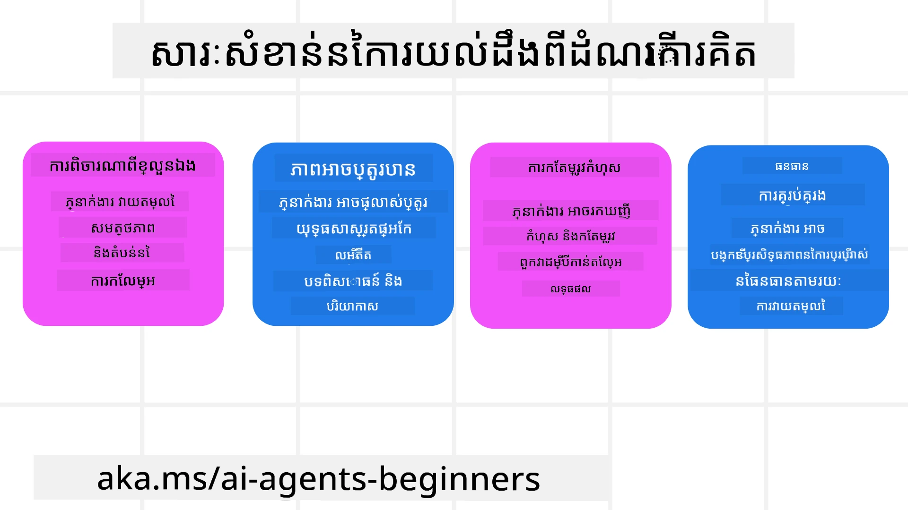
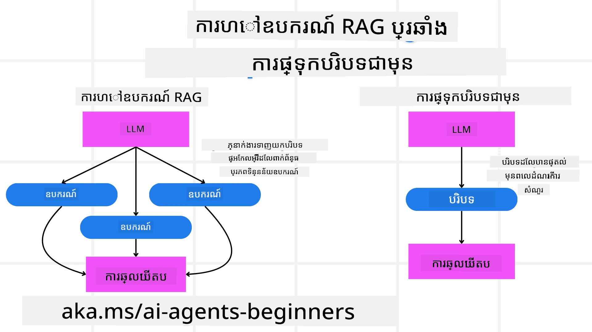

[](https://youtu.be/His9R6gw6Ec?si=3_RMb8VprNvdLRhX)

> _(ចុចលើរូបភាពខាងលើ ដើម្បីមើលវីដេអូមេរៀននេះ)_
# ការយល់ដឹងពីការយល់ដឹង (Metacognition) នៅក្នុងភ្នាក់ងារបច្ចេកវិទ្យាបញ្ញាសិប្បនិម្មិត

## សេចក្ដីផ្ដើម

សូមស្វាគមន៍មកកាន់មេរៀនអំពីការយល់ដឹងពីការយល់ដឹង (metacognition) ក្នុងភ្នាក់ងារបញ្ញាសិប្បនិម្មិត! ជំពូកនេះគឺសម្រាប់អ្នកចាប់ផ្តើមដែលចង់ដឹងពីរបៀបដែលភ្នាក់ងារបញ្ញាសិប្បនិម្មិតអាចគិតពីដំណើរការគិតរបស់ខ្លួន។ នៅចុងបញ្ចប់មេរៀននេះ អ្នកនឹងយល់ពីគ្រឹះស្នូលនៃគំនិតសំខាន់ៗ និងទទួលបានគំរូការអនុវត្តជាក់ស្តែងសម្រាប់ការបញ្ចូលការយល់ដឹងពីការយល់ដឹងក្នុងការរចនាភ្នាក់ងារ AI។

## គោលបំណងការសិក្សា

បន្ទាប់ពីបញ្ចប់មេរៀននេះ អ្នកនឹងអាចធ្វើបាន៖

1. ដឹងពីផលប៉ះពាល់នៃការសង្វាក់ហេតុផលក្នុងការជាកម្មវិធីពណ៌នាភ្នាក់ងារ។
2. ប្រើបច្ចេកវិទ្យាការធ្វើផែនការ និងការវាស់វែង ដើម្បីជួយភ្នាក់ងារដែលអាចកែប្រែខ្លួនឯងបាន។
3. បង្កើតភ្នាក់ងាររបស់អ្នកផ្ទាល់ដែលអាចកែប្រែកូដដើម្បីបំពេញភារកិច្ចបាន។

## ណែនាំអំពីការយល់ដឹងពីការយល់ដឹង

ការយល់ដឹងពីការយល់ដឹង (Metacognition) មានករណីច្រើនគឺដំណើរការជាស្ដង់ដារលំដាប់ខ្ពស់ ដែលពាក់ព័ន្ធនឹងការគិតអំពីការគិតរបស់ខ្លួន។ សម្រាប់ភ្នាក់ងារបញ្ញាសិប្បនិម្មិត វាមានន័យថាអាចវាយតម្លៃ និងកែប្រែសកម្មភាពរបស់ខ្លួនដោយផ្អែកលើការយល់ដឹងខ្លួនឯង និងបទពិសោធន៍កន្លងមក។ ការយល់ដឹងពីការយល់ដឹង ឬ "គិតអំពីការគិត" គឺជាគំរោងសំខាន់ក្នុងការអភិវឌ្ឍប្រព័ន្ធ AI ប្រភេទភ្នាក់ងារ។ វារួមបញ្ចូលប្រព័ន្ធ AI ដែលដឹងពីដំណើរការមនុស្សក្នុងខ្លួនខ្លួន និងអាចត្រួតពិនិត្យ ទប់ស្កាត់ និងប្តូរផ្នែកនៃអាកប្បកិរិយារបស់ខ្លួនឯងយ៉ាងសមរម្យ។ ដូចជាយើងធ្វើនៅពេលយើងអានស្ថានភាពឬមើលបញ្ហាមួយ។ ការយល់ដឹងខ្លួនឯងនេះអាចជួយប្រព័ន្ធ AI ធ្វើការសម្រេចចិត្តល្អជាងមុន សម្គាល់កំហុស និងកែលម្អសមត្ថភាពរបស់ខ្លួនជារឿយៗ - បានភ្ជាប់ត្រឡប់ទៅកាន់ការប្រឡង Turing និងការពិភាក្សាអំពីថាតើ AI នឹងយកអារក្សកាន់កាប់។

ក្នុងបរិបទប្រព័ន្ធ AI ប្រភេទភ្នាក់ងារ ការយល់ដឹងពីការយល់ដឹងអាចជួយដោះស្រាយបញ្ហាជាច្រើន ដូចជា៖
- ភាពបញ្ចេញបញ្ចាំង៖ ដើម្បីធានាថាប្រព័ន្ធ AI អាចពន្យល់ពីហេតុផល និងការសម្រេចចិត្តរបស់ខ្លួន។
- ហេតុផល៖ បង្កើនសមត្ថភាពប្រព័ន្ធ AI ក្នុងការសង្ខេបព័ន្ធព័ត៌មាន និងធ្វើការសម្រេចចិត្តបានត្រឹមត្រូវ។
- ការផ្លាស់ប្តូរ៖ អនុញ្ញាតឲ្យប្រព័ន្ធ AI ត្រូវបានបត់បែនទៅជាមួយបរិយាកាសថ្មី និងលក្ខខណ្ឌផ្លាស់ប្តូរ។
- ការយល់ដឹង៖ កែលម្អភាពត្រឹមត្រូវនៃប្រព័ន្ធ AI ក្នុងការទទួលស្គាល់ និងបកស្រាយទិន្នន័យពីបរិយាកាស។

### តើការយល់ដឹងពីការយល់ដឹងគឺជាអ្វី?

ការយល់ដឹងពីការយល់ដឹង ឬ "គិតអំពីការគិត" គឺជាដំណើរការស្មារតីលំដាប់ខ្ពស់ដែលពាក់ព័ន្ធនឹងការយល់ដឹងខ្លួនឯង និងការគ្រប់គ្រងខ្លួនឯងនៃដំណើរការស្មារតីរបស់មនុស្ស។ នៅក្នុងផ្នែក AI ការយល់ដឹងពីការយល់ដឹងផ្តល់អំណាចឲ្យភ្នាក់ងារអាចវាយតម្លៃ និងកែប្រែយុទ្ធសាស្រ្ត និងសកម្មភាពរបស់ខ្លួន ដើម្បីធ្វើឱ្យមានសមត្ថភាពដោះស្រាយបញ្ហា និងធ្វើការសម្រេចចិត្តបានល្អប្រសើរជាងមុន។ ដោយយល់ពីការយល់ដឹងពីការយល់ដឹង អ្នកអាចរចនាភ្នាក់ងារបញ្ញាសិប្បនិម្មិតដែលមិនត្រឹមតែវៃឆ្លាតជាងមុនទេ ប៉ុន្តែក៏មានសមត្ថភាពបត់បែន និងប្រសិទ្ធភាពខ្ពស់។ ក្នុងការយល់ដឹងពីការយល់ដឹងពិតប្រាកដ អ្នកនឹងឃើញ AI មានការគិតដឹងពីហេតុផលរបស់ខ្លួនផ្ទាល់យ៉ាងច្បាស់។

ឧទាហរណ៍៖ “ខ្ញុំបានផ្តល់អាទិភាពទៅលើការហោះហើរពិសេសថោកព្រោះ... ខ្ញុំប្រហែលជាអាចខកខានការហោះហើរផ្ទាល់ ដូច្នេះខ្ញុំសូមពិនិត្យម្តងទៀត។”  
តាមដានរបៀបឬហេតុផលដែលវាជ្រើសរើសផ្លូវណាមួយ។  
- កំណត់សម្គាល់ថាវាបានធ្វើកំហុសព្រោះវាច្រាស់លើចំណង់ចំណូលចិត្តរបស់អ្នកប្រើពីមុនពេលនេះហើយវាប្តូរយុទ្ធសាស្ត្រសម្រេចចិត្តមិនមែនគ្រាន់តែផ្ដល់អនុសាសន៍ចុងក្រោយទេទេ។  
- វិភាគលំនាំដូចជា៖ “រាល់ពេលដែលខ្ញុំឃើញអ្នកប្រើប្រាស់រាយការណ៍ថា ‘កន្លែងនោះមានមនុស្សច្រើនដល់ទឹកដង’ ខ្ញុំគួរតែអត់តែដកចេញពីកន្លែងទស្សនាស្ល្បះជាច្រើន ប៉ុន្តែក៏ត្រូវសម្លឹងមើលថាវិធីសាស្ត្រជ្រើសរើស ‘កន្លែងទស្សនាស្ល្បះល្អបំផុត’ របស់ខ្ញុំមានកំហុសបើខ្ញុំបាទបញ្ជាក់តាមលំដាប់ពេញនិយមជានិច្ច។

### សារៈសំខាន់នៃការយល់ដឹងពីការយល់ដឹងនៅក្នុងភ្នាក់ងារបញ្ញាសិប្បនិម្មិត

ការយល់ដឹងពីការយល់ដឹងមានតួនាទីសំខាន់នៅក្នុងការរចនាភ្នាក់ងារបញ្ញាសិប្បនិម្មិតដោយសារតែហេតុផលជាច្រើន៖



- ការត្រួតពិនិត្យខ្លួនឯង៖ ភ្នាក់ងារអាចវាយតម្លៃសមត្ថភាពរបស់ខ្លួន និងសម្គាល់តំបន់ដែលត្រូវកែលម្អ។  
- ការបត់បែន៖ ភ្នាក់ងារអាចកែប្រែយុទ្ធសាស្ត្រដោយផ្អែកលើបទពិសោធន៍កន្លងមក និងបរិយាកាសផ្លាស់ប្តូរ។  
- ការកែលម្អកំហុស៖ ភ្នាក់ងារអាចរកឃើញ និងកែតម្រូវកំហុសដោយដែលខ្លួនឯង ដឹកនាំទៅកាន់លទ្ធផលត្រឹមត្រូវជាងមុន។  
- ការគ្រប់គ្រងធនធាន៖ ភ្នាក់ងារអាចអូបទីម៉ង់ការប្រើប្រាស់ធនធានដូចជា ពេលវេលា និងថាមពលកុំព្យូទ័រ ដោយដោយការធ្វើផែនការ និងការវាស់វែងសកម្មភាពរបស់ខ្លួន។

## ធាតុផ្សំមួយភ្នាក់ងារបញ្ញាសិប្បនិម្មិត

មុននឹងចូលជ្រាបដំណើរការយល់ដឹងពីការយល់ដឹង វាសំខាន់ក្នុងការយល់ពីធាតុមូលដ្ឋាននៃភ្នាក់ងារបញ្ញាសិប្បនិម្មិត។ ភ្នាក់ងារបញ្ញាសិប្បនិម្មិតមានធាតុបុគ្គលទូទៅ៖

- Persona (បុគ្គលិកលក្ខណៈ): បុគ្គលលក្ខណៈ និងលក្ខណៈពិសេសនៃភ្នាក់ងារ ដែលកំណត់របៀប វាផ្សាយទំនាក់ទំនងជាមួយអ្នកប្រើប្រាស់។  
- Tools (ឧបករណ៍): សមត្ថភាព និងមុខងារដែលភ្នាក់ងារអាចអនុវត្តបាន។  
- Skills (ជំនាញ): ចំណេះដឹង និងជំនាញពាក់ព័ន្ធដែលភ្នាក់ងារកាន់កាប់។

ធាតុទាំងនេះធ្វើការរួមគ្នាបង្កើតជា "ឯកត្តជំនាញ" ដែលអាចអនុវត្តភារកិច្ចជាក់លាក់មួយបាន។

**ឧទាហរណ៍**៖  
ចូរពិចារណាភ្នាក់ងារធ្វើដំណើរ ដែលមិនត្រឹមតែផែនការឈប់សម្រាករបស់អ្នកទេ ប៉ុន្តែថែមទាំងបត់បែនផ្លូវរបស់វាដោយផ្អែកលើទិន្នន័យពេលវេលាចាំបាច់ និងបទពិសោធន៍ដំណើររបស់អតិថិជនមុន។

### ឧទាហរណ៍៖ ការយល់ដឹងពីការយល់ដឹងនៅក្នុងសេវាភ្នាក់ងារធ្វើដំណើរ

ស្មានថាអ្នកកំពុងរចនាសេវាភ្នាក់ងារធ្វើដំណើរដោយមាន AI ជាថាមពល។ ភ្នាក់ងារនេះហៅថា "Travel Agent" ជួយអ្នកប្រើប្រាស់ក្នុងការធ្វើផែនការ​លំនៅដ្ឋានការធ្វើដំណើរ។ ដើម្បីបញ្ចូលការយល់ដឹងពីការយល់ដឹង Travel Agent ត្រូវតែវាយតម្លៃ និងកែប្រែសកម្មភាពរបស់ខ្លួនដោយផ្អែកលើការយល់ដឹងខ្លួនឯង និងបទពិសោធន៍កន្លងមក។ ទីនេះបង្ហាញពីវិធីដែលការយល់ដឹងពីការយល់ដឹងអាចមានទំនាក់ទំនង៖

#### ភារកិច្ចបច្ចុប្បន្ន

ភារកិច្ចបច្ចុប្បន្នគឺជួយអ្នកប្រើប្រាស់ផែនការធ្វើដំណើរទៅទីក្រុងប៉ារីស។

#### ជំហានដើម្បីបញ្ចប់ភារកិច្ច

1. **ប្រមូលចំណង់ចំណូលចិត្តរបស់អ្នកប្រើ**៖ សួរអំពីកាលបរិច្ឆេទធ្វើដំណើរ ថវិកា ចំណង់ចំណូលចិត្ត (ដូចជា ពិព័រណ៍សិល្បៈម្ហូបអាហារ ទិញទំនិញ) និងតម្រូវការពិសេសណាមួយ។  
2. **ទាញយកព័ត៌មាន**៖ ស្វែងរកជម្រើសហោះហើរ ផ្ទះស្នាក់នៅ កន្លែងទស្សនា និងភោជនីយដ្ឋានដែលផ្គូរផ្គងនឹងចំណង់ចំណូលចិត្តអ្នកប្រើ។  
3. **បង្កើតអនុសាសន៍**៖ ផ្តល់ផែនការផ្ទាល់ខ្លួនមានពត៌មានលម្អិតអំពីហោះហើរ ការកក់សណ្ឋាគារ និងសកម្មភាពដែលបានផ្តល់អនុសាសន៍។  
4. **កែប្រែក្នុងមួយចំណុច**៖ សួរអ្នកប្រើពីមតិយោបល់លើអនុសាសន៍ និងកែប្រែតម្រូវភាពតាមការពេញចិត្ត។

#### ធនធានត្រូវការជំនួយ

- ចូលប្រើវិទ្យាល័យបញ្ជីហោះហើរនិងសណ្ឋាគារ។  
- ព័ត៌មានអំពីកន្លែងទស្សនាប៉ារីស និងភោជនីយដ្ឋាន។  
- ទិន្នន័យមតិយោបល់អ្នកប្រើពីការប្រាស្រ័យពេលមុន។

#### បទពិសោធន៍ និងការត្រួតពិនិត្យខ្លួនឯង

Travel Agent ប្រើការយល់ដឹងពីការយល់ដឹងដើម្បីវាយតម្លៃ សមត្ថភាព និងរៀនពីបទពិសោធន៍មុន។ ឧទាហរណ៍៖

1. **វិភាគមតិយោបល់អ្នកប្រើ**៖ Travel Agent ពិនិត្យមើលមតិយោបល់របស់អ្នកប្រើ ដើម្បីកំណត់ថា អនុសាសន៍ណាដែលទទួលបានការគាំទ្រល្អ និងណាដែលមិនទាន់បាន។ វាកែប្រែអនុសាសន៍នៅពេលក្រោយ។  
2. **ការបត់បែន**៖ ប្រសិនបើអ្នកប្រើបានរាយការណ៍មុនថាមិនចូលចិត្តកន្លែងដែលមានមនុស្សច្រើន Travel Agent នឹងជៀសវាងណែនាំកន្លែងទេសចរណ៍ពេញនិយមនៅម៉ោងកំពុងឡើង។  
3. **កែប្រែកំហុស**៖ ប្រសិនបើ Travel Agent បានធ្វើកំហុសក្នុងការកក់មុន ដូចជា ផ្តល់អាផាតមិនដែលបានកក់ពេញលេញ វាអប់រំខ្លួនឯងក្នុងការត្រួតពិនិត្យការពិនិត្យភាពមានស្រេច និងមានភាពនៅរឹងមាំមុនពេលផ្តល់អនុសាសន៍។

#### ឧទាហរណ៍អ្នកអភិវឌ្ឍជាក់ស្តែង

នេះគឺជាគំរូកូដសាមញ្ញមួយដែលបង្ហាញពីរបៀប Travel Agent អាចបញ្ចូលការយល់ដឹងពីការយល់ដឹងបាន៖

```python
class Travel_Agent:
    def __init__(self):
        self.user_preferences = {}
        self.experience_data = []

    def gather_preferences(self, preferences):
        self.user_preferences = preferences

    def retrieve_information(self):
        # ស្វែងរក chuyến bay, សណ្ឋាគារ និងទីទេសចរណ៍ dựa trên sở thích
        flights = search_flights(self.user_preferences)
        hotels = search_hotels(self.user_preferences)
        attractions = search_attractions(self.user_preferences)
        return flights, hotels, attractions

    def generate_recommendations(self):
        flights, hotels, attractions = self.retrieve_information()
        itinerary = create_itinerary(flights, hotels, attractions)
        return itinerary

    def adjust_based_on_feedback(self, feedback):
        self.experience_data.append(feedback)
        # Phân tích phản hồi và điều chỉnh khuyến nghị trong tương lai
        self.user_preferences = adjust_preferences(self.user_preferences, feedback)

# Ví dụ sử dụng
travel_agent = Travel_Agent()
preferences = {
    "destination": "Paris",
    "dates": "2025-04-01 to 2025-04-10",
    "budget": "moderate",
    "interests": ["museums", "cuisine"]
}
travel_agent.gather_preferences(preferences)
itinerary = travel_agent.generate_recommendations()
print("Suggested Itinerary:", itinerary)
feedback = {"liked": ["Louvre Museum"], "disliked": ["Eiffel Tower (too crowded)"]}
travel_agent.adjust_based_on_feedback(feedback)
```

#### ហេតុអ្វីបានជាការយល់ដឹងពីការយល់ដឹងមានសារៈសំខាន់

- **ការត្រួតពិនិត្យខ្លួនឯង**៖ ភ្នាក់ងារអាចវិភាគសមត្ថភាព និងរកតំបន់ដែលត្រូវការកែលម្អ។  
- **ការបត់បែន**៖ ភ្នាក់ងារអាចកែប្រែយុទ្ធសាស្រ្តដោយផ្អែកលើមតិយោបល់ និងលក្ខខណ្ឌផ្លាស់ប្តូរ។  
- **កែប្រែកំហុស**៖ ភ្នាក់ងារអាចរកឃើញ និងកែតម្រូវកំហុសដោយដោយខ្លួនឯង។  
- **គ្រប់គ្រងធនធាន**៖ ភ្នាក់ងារអាចប្រើប្រាស់ធនធានបានប្រសើរ ដូចជា ពេលវេលា និងថាមពលកុំព្យូទ័រ។

ដោយបញ្ចូលការយល់ដឹងពីការយល់ដឹង Travel Agent អាចផ្តល់អនុសាសន៍ធ្វើដំណើរមានការផ្ទាល់ខ្លួន និងត្រឹមត្រូវបន្ថែមទៀត ជួយបង្កើនបទពិសោធន៍អ្នកប្រើប្រាស់សរុប។

---

## 2. ការធ្វើផែនការ​នៅក្នុងភ្នាក់ងារ

ការធ្វើផែនការជាធាតុសំខាន់ក្នុងអាកប្បកិរិយារបស់ភ្នាក់ងារ AI។ វាពាក់ព័ន្ធការរៀបចំជំហានដែលត្រូវការ ដើម្បីសម្រេចកាតព្វកិច្ចមួយ ដោយគិតពីស្ថានភាពបច្ចុប្បន្ន ធនធាន និងឧបសគ្គដែលអាចមាន។

### ធាតុទាំងក្នុងការធ្វើផែនការ

- **ភារកិច្ចបច្ចុប្បន្ន**៖ កំណត់ភារកិច្ចឲ្យច្បាស់។  
- **ជំហានដើម្បីបញ្ចប់ភារកិច្ច**៖ បំបែកភារកិច្ចជាជំហានដែលងាយស្រួលគ្រប់គ្រង។  
- **ធនធានត្រូវការ**៖ កំណត់ធនធានបាច់បាច់។  
- **បទពិសោធន៍**៖ ប្រើប្រាស់បទពិសោធន៍មុនសម្រាប់ចូរនាំផែនការ។

**ឧទាហរណ៍**៖  
នេះជាជំហានដែល Travel Agent ត្រូវអនុវត្ត ដើម្បីជួយអ្នកប្រើផែនការធ្វើដំណើរយ៉ាងមានប្រសិទ្ធភាព៖

### ជំហានសម្រាប់ Travel Agent

1. **ប្រមូលចំណង់ចំណូលចិត្តរបស់អ្នកប្រើ**  
   - សួរព័ត៌មានអំពីកាលបរិច្ឆេទធ្វើដំណើរ ថវិកា ចំណង់ចំណូលចិត្ត និងតម្រូវការពិសេស។  
   - ឧទាហរណ៍៖ "អ្នកគ្រោងធ្វើដំណើរពេលណា?" "ថវិកាអ្នកមានប៉ុន្មាន?" "សកម្មភាពណាអ្នកចូលចិត្តនៅក្នុងបទពិសោធរសម្រាក?"

2. **ទាញយកព័ត៌មាន**  
   - ស្វែងរកជម្រើសធ្វើដំណើរតាមចំណង់ចំណូលចិត្តអ្នកប្រើ។  
   - **ហោះហើរ**៖ ស្វែងរកជម្រើសហោះហើរដែលសមស្របនៅក្នុងថវិកា និងថ្ងៃធ្វើដំណើរ។  
   - **សណ្ឋាគារ**៖ រកសណ្ឋាគារឬកន្លែងស្នាក់នៅដែលផ្គូរផ្គងនឹងទីតាំង តម្លៃ និងសេវាកម្មដែលចង់បាន។  
   - **កន្លែងទស្សនា និងភោជនីយដ្ឋាន**៖ ស្វែងរកកន្លែងទាក់ថា សកម្មភាព និងភោជនីយដ្ឋានដែលសមរម្យនឹងចំណង់ចំណូលចិត្ត។

3. **បង្កើតអនុសាសន៍**  
   - ប្រមូលព័ត៌មានដែលបានទាញយកចូលទៅក្នុងផែនការផ្ទាល់ខ្លួន។  
   - ផ្តល់ពត៌មានលំអិតអំពីជម្រើសហោះហើរ ការកក់សណ្ឋាគារ និងសកម្មភាពដែលបានផ្តល់អនុសាសន៍។

4. **ផ្ដល់ផែនការពីរយៈដល់អ្នកប្រើ**  
   - បង្ហាញផែនការត្រូវបានបង្កើតឲ្យអ្នកប្រើសម្រាប់ពិនិត្យមើល។  
   - ឧទាហរណ៍៖ "នេះគឺជាផែនការដែលបានផ្តល់ឲ្យការធ្វើដំណើរទៅប៉ារីសរបស់អ្នក។ មានពត៌មានអំពីហោះហើរ ការកក់សណ្ឋាគារ និងសកម្មភាពដែលបានណែនាំ។ សូមប្រាប់ខ្ញុំពីមតិយោបល់របស់អ្នក!"

5. **ប្រមូលមតិយោបល់**  
   - សួរមតិយោបល់អ្នកប្រើអំពីផែនការ។  
   - ឧទាហរណ៍៖ "តើអ្នកចូលចិត្តជម្រើសហោះហើរឬទេទេ?" "សណ្ឋាគារយ៉ាងដូចម្តេច?" "តើមានសកម្មភាពណាដែលអ្នកចង់បន្ថែមឬលុប?"

6. **កែប្រែផ្អែកលើមតិយោបល់**  
   - កែប្រែផែនការតាមមតិយោបល់អ្នកប្រើ។  
   - កែប្រែការណែនាំហោះហើរ សណ្ឋាគារ និងសកម្មភាពឲ្យសមរម្យជាងមុន។

7. **បញ្ជាក់ចុងក្រោយ**  
   - បង្ហាញផែនការដែលបានកែប្រែទៅអ្នកប្រើសម្រាប់បញ្ជាក់ចុងក្រោយ។  
   - ឧទាហរណ៍៖ "ខ្ញុំបានធ្វើការកែប្រែតាមមតិយោបល់របស់អ្នក។ សូមមើលផែនការថ្មីម្តងទៀត។ តើវាសមរម្យទាំងអស់ដែរឬទេ?"

8. **ធ្វើការកក់ និងបញ្ជាក់**  
   - បន្ទាប់ពីអ្នកប្រើអនុម័តផែនការ អនុវត្តការកក់ហោះហើរ សណ្ឋាគារ និងសកម្មភាពដែលបានរៀបចំមុន។  
   - ផ្ញើព័ត៌មានបញ្ជាក់ទៅអ្នកប្រើ។

9. **ផ្តល់ជំនួយជាបន្ត**  
   - មានភាពអាចប្រើបានសម្រាប់ជួយអ្នកប្រើអំពីការផ្លាស់ប្តូរឬការស្នើសុំបន្ថែមឬកុននៅមុន និងកំឡុងពេលធ្វើដំណើរ។  
   - ឧទាហរណ៍៖ "ប្រសិនបើអ្នកត្រូវការជំនួយបន្ថែមនៅពេលធ្វើដំណើរ សូមទំនាក់ទំនងខ្ញុំបានគ្រប់ពេល!"

### ឧទាហរណ៍ការប្រាស្រ័យទាក់ទង

```python
class Travel_Agent:
    def __init__(self):
        self.user_preferences = {}
        self.experience_data = []

    def gather_preferences(self, preferences):
        self.user_preferences = preferences

    def retrieve_information(self):
        flights = search_flights(self.user_preferences)
        hotels = search_hotels(self.user_preferences)
        attractions = search_attractions(self.user_preferences)
        return flights, hotels, attractions

    def generate_recommendations(self):
        flights, hotels, attractions = self.retrieve_information()
        itinerary = create_itinerary(flights, hotels, attractions)
        return itinerary

    def adjust_based_on_feedback(self, feedback):
        self.experience_data.append(feedback)
        self.user_preferences = adjust_preferences(self.user_preferences, feedback)

# ឧទាហរណ៍ការប្រើប្រាស់នៅក្នុងសំណើការទ្រាក់
travel_agent = Travel_Agent()
preferences = {
    "destination": "Paris",
    "dates": "2025-04-01 to 2025-04-10",
    "budget": "moderate",
    "interests": ["museums", "cuisine"]
}
travel_agent.gather_preferences(preferences)
itinerary = travel_agent.generate_recommendations()
print("Suggested Itinerary:", itinerary)
feedback = {"liked": ["Louvre Museum"], "disliked": ["Eiffel Tower (too crowded)"]}
travel_agent.adjust_based_on_feedback(feedback)
```

## 3. ប្រព័ន្ធ RAG កែតម្រូវកំហុស

ដំបូងឡើង យើងមកយល់ពីភាពខុសគ្នារវាងឧបករណ៍ RAG និងការផ្ទុកបរិបទជាមុន (Pre-emptive Context Load)



### ការបង្កើតដោយប្រើប្រព័ន្ធទាញយក (Retrieval-Augmented Generation - RAG)

RAGបញ្ចូលប្រព័ន្ធទាញយកជាមួយម៉ូដែលបង្កើត។ នៅពេលមានសំណួរ ប្រព័ន្ធទាញយកនឹងយកឯកសារឬទិន្នន័យពាក់ព័ន្ធពីប្រភពក្រៅ ហើយព័ត៌មានដែលបានទាញយកនេះត្រូវបានប្រើសម្រាប់បញ្ចូលចូលទៅម៉ូដែលបង្កើត។ វាជួយឲ្យម៉ូដែលបង្កើតលទ្ធផលដែលមានភាពត្រឹមត្រូវ និងពាក់ព័ន្ធផ្នែកបរិបទ។

នៅក្នុងប្រព័ន្ធ RAG ភ្នាក់ងារនឹងទាញយកព័ត៌មានពាក់ព័ន្ធពីមូលដ្ឋានចំណេះដឹង ហើយប្រើវាសម្រាប់បង្កើតចម្លើយ ឬសកម្មភាពដែលសមរម្យ។

### គំនិត RAG កែតម្រូវកំហុស

គំនិត RAG កែតម្រូវកំហុសផ្តោតលើការប្រើបច្ចេកទេស RAG ដើម្បីកែសម្រួលកំហុស និងបង្កើនភាពត្រឹមត្រូវរបស់ភ្នាក់ងារ AI។ វារួមមាន៖

1. **បច្ចេកទេសបង្ហាញសំណួរ (Prompting Technique)**៖ ប្រើបង្ហាញសំណួរពិសេសដើម្បីណែនាំភ្នាក់ងារឲ្យទាញយកព័ត៌មានពាក់ព័ន្ធ។  
2. **ឧបករណ៍**៖ អនុវត្តល الگូរីធម និងគ្រប់គ្រងដំណើរការដើម្បីឲ្យភ្នាក់ងារវាយតម្លៃភាពពាក់ព័ន្ធនៃព័ត៌មានដែលបានទាញយក និងបង្កើតចម្លើយត្រឹមត្រូវ។  
3. **ការវាស់វែង**៖ បន្តវាយតម្លៃសមត្ថភាពភ្នាក់ងារហើយធ្វើការកែតម្រូវដើម្បីធ្វើឲ្យមានភាពត្រឹមត្រូវ និងប្រសិទ្ធភាពកាន់តែប្រសើរ។

#### ឧទាហរណ៍៖ RAG កែតម្រូវកំហុសនៅក្នុងភ្នាក់ងារស្វែងរក

ពិចារណាភ្នាក់ងារស្វែងរកជួយអ្នកប្រើទាក់ទងព័ត៌មានពីគេហទំព័រ។ គំនិត RAG កែតម្រូវកំហុសអាចរួមបញ្ចូល៖

1. **បច្ចេកទេសបង្ហាញសំណួរ**៖ បង្កើតសំណួរស្វែងរកដោយផ្អែកលើព័ត៌មានអ្នកប្រើបញ្ចូល។  
2. **ឧបករណ៍**៖ ប្រើក្រុមហ៊ុនវិភាគភាសាត្រឹមត្រូវ និងល_algorithm វិនិយោគស្វែងរកដើម្បីចាត់ទុក និងនិរន្តរត្ដន៍លទ្ធផលស្វែងរក។  
3. **ការវាស់វែង**៖ វិភាគមតិយោបល់អ្នកប្រើ ដើម្បីសម្គាល់កំហុស និងកែតម្រូវព័ត៌មានដែលបានទាញយក។

### RAG កែតម្រូវកំហុសនៅក្នុង Travel Agent

RAG កែតម្រូវកំហុសបង្កើនសមត្ថភាព AI ក្នុងការទាញយក និងបង្កើតព័ត៌មាន ខណៈដែលកែតម្រូវកំហុសណាមួយ។ យើងមើលថាតើ Travel Agent អាចប្រើវិធីសាស្ត្រ RAG កែតម្រូវកំហុស ដើម្បីផ្តល់អនុសាសន៍ធ្វើដំណើរដែលមានភាពត្រឹមត្រូវ និងពាក់ព័ន្ធកាន់តែច្រើនយ៉ាងដូចម្តេច។

វារួមមាន៖

- **បច្ចេកទេសបង្ហាញសំណួរ (Prompting Technique):** ប្រើបង្ហាញសំណួរពិសេសដើម្បីណែនាំភ្នាក់ងារឲ្យទាញយកព័ត៌មានពាក់ព័ន្ធ។  
- **ឧបករណ៍ (Tool):** អនុវត្តល_algorithm និងគ្រប់គ្រងដំណើរការដើម្បីឲ្យភ្នាក់ងារវាយតម្លៃភាពពាក់ព័ន្ធនៃព័ត៌មានដែលបានទាញយក និងបង្កើតចម្លើយត្រឹមត្រូវ។  
- **ការវាស់វែង (Evaluation):** បន្តវាយតម្លៃសមត្ថភាពភ្នាក់ងារ ហើយធ្វើការកែតម្រូវដើម្បីធ្វើឲ្យមានភាពត្រឹមត្រូវ និងប្រសិទ្ធភាពកាន់តែប្រសើរ។

#### ជំហានក្នុងការអនុវត្ត RAG កែតម្រូវកំហុសនៅក្នុង Travel Agent

1. **ការប្រតិបត្តិការដំបូងជាមួយអ្នកប្រើ**  
   - Travel Agent ប្រមូលចំណង់ចំណូលចិត្តដើមពីអ្នកប្រើ ដូចជាគោលដៅ កាលបរិច្ឆេទធ្វើដំណើរ ថវិកា និងចំណង់ចំណូលចិត្ត។  
   - ឧទាហរណ៍៖

     ```python
     preferences = {
         "destination": "Paris",
         "dates": "2025-04-01 to 2025-04-10",
         "budget": "moderate",
         "interests": ["museums", "cuisine"]
     }
     ```

2. **ការទាញយកព័ត៌មាន**  
   - Travel Agent ទាញយកព័ត៌មានអំពីហោះហើរ សណ្ឋាគារ កន្លែងទស្សនា និងភោជនីយដ្ឋានដោយផ្អែកលើចំណង់ចំណូលចិត្តអ្នកប្រើ។  
   - ឧទាហរណ៍៖

     ```python
     flights = search_flights(preferences)
     hotels = search_hotels(preferences)
     attractions = search_attractions(preferences)
     ```

3. **បង្កើតអនុសាសន៍ដើម**  
   - Travel Agent ប្រើព័ត៌មានដែលបានទាញយក ដើម្បីបង្កើតផែនការផ្ទាល់ខ្លួន។  
   - ឧទាហរណ៍៖

     ```python
     itinerary = create_itinerary(flights, hotels, attractions)
     print("Suggested Itinerary:", itinerary)
     ```

4. **ប្រមូលមតិយោបល់អ្នកប្រើ**  
   - Travel Agent សួរសំណួរអំពីមតិយោបល់លើអនុសាសន៍ដើម។  
   - ឧទាហរណ៍៖

     ```python
     feedback = {
         "liked": ["Louvre Museum"],
         "disliked": ["Eiffel Tower (too crowded)"]
     }
     ```

5. **ដំណើរការកែតម្រូវ RAG**  
   - **បច្ចេកទេសបង្ហាញសំណួរ**៖ Travel Agent បង្កើតសំណួរស្វែងរកថ្មី បន្ទាប់ពីមតិយោបល់អ្នកប្រើ។  
     - ឧទាហរណ៍៖

       ```python
       if "disliked" in feedback:
           preferences["avoid"] = feedback["disliked"]
       ```

   - **ឧបករណ៍**៖ Travel Agent ប្រើល_algorithm ដើម្បីចាត់តម្រៀប និងច្រោះលទ្ធផលស្វែងរកថ្មី សំរាប់ផ្អែកលើភាពពាក់ព័ន្ធតាមមតិយោបល់អ្នកប្រើ។  
     - ឧទាហរណ៍៖

       ```python
       new_attractions = search_attractions(preferences)
       new_itinerary = create_itinerary(flights, hotels, new_attractions)
       print("Updated Itinerary:", new_itinerary)
       ```

   - **ការវាស់វែង**៖ Travel Agent បន្តវាយតម្លៃភាពពាក់ព័ន្ធ និងភាពត្រឹមត្រូវនៃអនុសាសន៍ រួមបញ្ចូលការវិភាគមតិយោបល់អ្នកប្រើ និងធ្វើការកែប្រែត្រូវការជាបន្តបន្ទាប់។  
     - ឧទាហរណ៍៖

       ```python
       def adjust_preferences(preferences, feedback):
           if "liked" in feedback:
               preferences["favorites"] = feedback["liked"]
           if "disliked" in feedback:
               preferences["avoid"] = feedback["disliked"]
           return preferences

       preferences = adjust_preferences(preferences, feedback)
       ```

#### ឧទាហរណ៍ជាក់ស្តែង

នេះគឺជាគំរូកូដ Python សាមញ្ញនៃការបញ្ចូលវិធីសាស្ត្រ RAG កែតម្រូវកំហុសក្នុង Travel Agent៖

```python
class Travel_Agent:
    def __init__(self):
        self.user_preferences = {}
        self.experience_data = []

    def gather_preferences(self, preferences):
        self.user_preferences = preferences

    def retrieve_information(self):
        flights = search_flights(self.user_preferences)
        hotels = search_hotels(self.user_preferences)
        attractions = search_attractions(self.user_preferences)
        return flights, hotels, attractions

    def generate_recommendations(self):
        flights, hotels, attractions = self.retrieve_information()
        itinerary = create_itinerary(flights, hotels, attractions)
        return itinerary

    def adjust_based_on_feedback(self, feedback):
        self.experience_data.append(feedback)
        self.user_preferences = adjust_preferences(self.user_preferences, feedback)
        new_itinerary = self.generate_recommendations()
        return new_itinerary

# ការប្រើប្រាស់ឧទាហរណ៍
travel_agent = Travel_Agent()
preferences = {
    "destination": "Paris",
    "dates": "2025-04-01 to 2025-04-10",
    "budget": "moderate",
    "interests": ["museums", "cuisine"]
}
travel_agent.gather_preferences(preferences)
itinerary = travel_agent.generate_recommendations()
print("Suggested Itinerary:", itinerary)
feedback = {"liked": ["Louvre Museum"], "disliked": ["Eiffel Tower (too crowded)"]}
new_itinerary = travel_agent.adjust_based_on_feedback(feedback)
print("Updated Itinerary:", new_itinerary)
```

### ការផ្ទុកបរិបទជាមុន (Pre-emptive Context Load)
Pre-emptive Context Load មានន័យថា ការផ្ទុកបរិបទឬព័ត៌មានផ្ទាល់ខ្លួនដែលពាក់ព័ន្ធចូលក្នុងម៉ូដែលមុនពេលដំណើរការសំណួរ។ នេះមានអត្ថបទថា ម៉ូដែលអាចចូលដំណើរការព័ត៌មាននេះពីដើម ដែលអាចជួយឲ្យវាបង្កើតចម្លើយបានល្អប្រសើរជាងមុន ដោយមិនបាច់យកព័ត៌មានបន្ថែមក្នុងដំណើរការ។

នេះគឺជាតួនាទីហត្ថការងារងាយៗនៃការផ្ទុកបរិបទជាមុនសម្រាប់កម្មវិធីភ្នាក់ងារធ្វើដំណើរមួយក្នុង Python៖

```python
class TravelAgent:
    def __init__(self):
        # ផ្ទុកជាមុនគោលដៅពេញនិយម និងព័ត៌មានរបស់វា
        self.context = {
            "Paris": {"country": "France", "currency": "Euro", "language": "French", "attractions": ["Eiffel Tower", "Louvre Museum"]},
            "Tokyo": {"country": "Japan", "currency": "Yen", "language": "Japanese", "attractions": ["Tokyo Tower", "Shibuya Crossing"]},
            "New York": {"country": "USA", "currency": "Dollar", "language": "English", "attractions": ["Statue of Liberty", "Times Square"]},
            "Sydney": {"country": "Australia", "currency": "Dollar", "language": "English", "attractions": ["Sydney Opera House", "Bondi Beach"]}
        }

    def get_destination_info(self, destination):
        # ទាញយកព័ត៌មានគោលដៅពីបរិបទដែលបានផ្ទុកជាមុន
        info = self.context.get(destination)
        if info:
            return f"{destination}:\nCountry: {info['country']}\nCurrency: {info['currency']}\nLanguage: {info['language']}\nAttractions: {', '.join(info['attractions'])}"
        else:
            return f"Sorry, we don't have information on {destination}."

# ឧទាហរណ៍ការប្រើប្រាស់
travel_agent = TravelAgent()
print(travel_agent.get_destination_info("Paris"))
print(travel_agent.get_destination_info("Tokyo"))
```

#### ការពន្យល់

1. **ការចាប់ផ្តើម (`__init__` ម៉េតូ)**: ថ្នាក់ `TravelAgent` ផ្ទុកពាក្យបញ្ជីមួយដែលមានព័ត៌មានអំពីកន្លែងល្បីៗដូចជា ប៉ារីស, តូក្យូ, នូវយ៉ក, និងស៊ីដនេ។ ពាក្យបញ្ជីនេះមានព័ត៌មានលម្អិតដូចជា ប្រទេស, ប្រភេទរូបិយប័ណ្ណ, ភាសា, និងកន្លែងទេសចរណ៍សំខាន់ៗសម្រាប់កន្លែងនីមួយៗ។

2. **រកព័ត៌មាន (`get_destination_info` ម៉េតូ)**: នៅពេលដែលអ្នកប្រើសួរអំពីកន្លែងជាក់លាក់ មេតូ `get_destination_info` នឹងយកព័ត៌មានពាក់ព័ន្ធពីវចនាធិប្បាយបរិបទដែលបានផ្ទុកជាមុន។

ដោយផ្ទុកបរិបទជាមុន កម្មវិធីភ្នាក់ងារធ្វើដំណើរអាចឆ្លើយតបសំណួរអ្នកប្រើបានរហ័ស ដោយមិនចាំបាច់យកព័ត៌មានពីប្រភពខាងក្រៅដោយពេលវេលាពិត។ វាធ្វើឲ្យកម្មវិធីមានប្រសិទ្ធភាពនិងឆ្លើយតបលឿន។

### ការចាប់ផ្តើមផែនការជាមួយគោលបំណងមុនពេលវឌ្ឍន៍ជាដំណើរ

ការចាប់ផ្តើមផែនការជាមួយគោលបំណង មានន័យថា ចាប់ផ្តើមដោយមានគោលបំណងច្បាស់លាស់ ឬលទ្ធផលគោលដៅនៅក្នុងចិត្ត។ ដោយកំណត់គោលបំណងនេះជាមុន ម៉ូដែលអាចប្រើវាជាមួយនឹងគោលការណ៍ណែនាំរបស់វាទាំងមូលក្នុងដំណើរការវឌ្ឍន៍ជាដំណើរ។ វាជួយធានាថា ការវឌ្ឍន៍មួយៗប្រាកដជាចេញទៅកាន់ការសម្រេចបានលទ្ធផលដែលបានចង់បាន ធ្វើឲ្យដំណើរនេះមានប្រសិទ្ធភាព និងផ្តោតលើគោលបំណង។

នេះយើងមានឧទាហរណ៍នៃវិធីដែលអ្នកអាចចាប់ផ្តើមផែនការធ្វើដំណើរជាមួយគោលបំណង មុននឹងធ្វើវឌ្ឍន៍ជាដំណើរសម្រាប់ភ្នាក់ងារធ្វើដំណើរមួយក្នុង Python៖

### ស្ថានភាព

ភ្នាក់ងារធ្វើដំណើរម្នាក់ចង់កំណត់ផែនការធ្វើដំណើរផ្ទាល់ខ្លួនសម្រាប់អតិថិជន។ គោលបំណងគឺបង្កើតផែនការធ្វើដំណើរដែលបង្កើនកម្រិតពេញចិត្តរបស់អតិថិជនដោយផ្អែកលើចំណូលចិត្ត និងថវិកា។

### ជំហាន

1. កំណត់ចំណូលចិត្ត និងថវិការបស់អតិថិជន។
2. ចាប់ផ្តើមផែនការដំបូងដោយផ្អែកលើចំណូលចិត្តទាំងនេះ។
3. វឌ្ឍន៍ផែនការដើម្បីកែលម្អ ហើយបង្ហាញកម្រិតពេញចិត្តរបស់អតិថិជន។

#### កូដ Python

```python
class TravelAgent:
    def __init__(self, destinations):
        self.destinations = destinations

    def bootstrap_plan(self, preferences, budget):
        plan = []
        total_cost = 0

        for destination in self.destinations:
            if total_cost + destination['cost'] <= budget and self.match_preferences(destination, preferences):
                plan.append(destination)
                total_cost += destination['cost']

        return plan

    def match_preferences(self, destination, preferences):
        for key, value in preferences.items():
            if destination.get(key) != value:
                return False
        return True

    def iterate_plan(self, plan, preferences, budget):
        for i in range(len(plan)):
            for destination in self.destinations:
                if destination not in plan and self.match_preferences(destination, preferences) and self.calculate_cost(plan, destination) <= budget:
                    plan[i] = destination
                    break
        return plan

    def calculate_cost(self, plan, new_destination):
        return sum(destination['cost'] for destination in plan) + new_destination['cost']

# ការប្រើប្រាស់ឧទាហរណ៍
destinations = [
    {"name": "Paris", "cost": 1000, "activity": "sightseeing"},
    {"name": "Tokyo", "cost": 1200, "activity": "shopping"},
    {"name": "New York", "cost": 900, "activity": "sightseeing"},
    {"name": "Sydney", "cost": 1100, "activity": "beach"},
]

preferences = {"activity": "sightseeing"}
budget = 2000

travel_agent = TravelAgent(destinations)
initial_plan = travel_agent.bootstrap_plan(preferences, budget)
print("Initial Plan:", initial_plan)

refined_plan = travel_agent.iterate_plan(initial_plan, preferences, budget)
print("Refined Plan:", refined_plan)
```

#### ការពន្យល់កូដ

1. **ការចាប់ផ្តើម (`__init__` ម៉េតូ)**: ថ្នាក់ `TravelAgent` ត្រូវបានចាប់ផ្តើមជាមួយបញ្ជីកន្លែងដែលអាចទៅដល់បាន ដែលមានលក្ខណៈជាឈ្មោះ តម្លៃ និងប្រភេទសកម្មភាព។

2. **ការចាប់ផ្តើមផែនការ (`bootstrap_plan` ម៉េតូ)**: ម៉េតូនេះបង្កើតផែនការដំបូងដោយផ្អែកលើចំណូលចិត្ត និងថវិការរបស់អតិថិជន។ វាកំពុងវង្វេងតាមបញ្ជីកន្លែង ហើយបញ្ចូលកន្លែងដែលផ្គូរផ្គងនឹងចំណូលចិត្ត ហើយមានតម្លៃសមរម្យក្នុងថវិកា។

3. **ការផ្គូរផ្គងចំណូលចិត្ត (`match_preferences` ម៉េតូ)**: ម៉េតូនេះពិនិត្យថាតើកន្លែងនៅឈ្មោះផ្គូរផ្គងនឹងចំណូលចិត្តរបស់អតិថិជនឬទេ។

4. **វឌ្ឍន៍ផែនការ (`iterate_plan` ម៉េតូ)**: ម៉េតូនេះកែប្រែផែនការដំបូងដោយព្យាយាមបម្លែងកន្លែងមួយៗក្នុងផែនការជាមួយកន្លែងផ្គូរផ្គងល្អប្រសើរ ដែលគិតពាក់ព័ន្ធនឹងចំណូលចិត្ត និងកំណត់ថវិការរបស់អតិថិជន។

5. **គណនា​ថ្លៃ​ផែនការ (`calculate_cost` ម៉េតូ)**: ម៉េតូនេះគណនាតម្លៃសរុបនៃផែនការបច្ចុប្បន្ន រួមទាំងកន្លែងដែលអាចបន្ថែមថ្មី។

#### ឧទាហរណ៍ប្រើប្រាស់

- **ផែនការដំបូង**: ភ្នាក់ងារធ្វើដំណើរបង្កើតផែនការដំបូងដោយផ្អែកលើចំណូលចិត្តចូលទស្សនារីករាយ និងថវិកា $2000។
- **ផែនការកែលម្អ**: ភ្នាក់ងារធ្វើដំណើរវឌ្ឍន៍ផែនការនេះ ដើម្បីកែលម្អកម្រិតចំណូលចិត្ត និងថវិកា។

ដោយចាប់ផ្តើមផែនការជាមួយគោលបំណងច្បាស់ (ឧទាហរណ៍: បង្កើនកម្រិតពេញចិត្តរបស់អតិថិជន) ហើយវឌ្ឍន៍វា ដើម្បីកែលម្អ ផ្នែកភ្នាក់ងារធ្វើដំណើរអាចបង្កើតផែនការធ្វើដំណើរផ្ទាល់ខ្លួន និងមានប្រសិទ្ធភាពសម្រាប់អតិថិជន។ វិធីនេះធ្វើឲ្យផែនការធ្វើដំណើរត្រូវតាមចំណូលចិត្ត និងថវិការរបស់អតិថិជនចាប់ពីដើម ហើយកែលម្អបានប្រសើរជាមួយនឹងការវឌ្ឍន៍មួយៗ។

### ប្រយោជន៍នៃការប្រើប្រាស់ LLM សម្រាប់ការរៀបលំដាប់ឡើងវិញ និងការវាយពិន្ទុ

ម៉ូដែលភាសាធំ (LLMs) អាចប្រើសម្រាប់ការរៀបចំឡើងវិញ និងវាយពិន្ទុដោយវាយតម្លៃអត្ថិភាព និងគុណភាពរបស់ឯកសារបានយកចេញ ឬចម្លើយបានបង្កើត។ នេះគឺជាវិធីធ្វើការរបស់វា៖

**ការយកព័ត៌មាន**: ជំហានដំបូងនៃការយកព័ត៌មាន នឹងយកឯកសារឬចម្លើយឈរជាក្រុមទៅតាមសំណើ។

**ការរៀបលំដាប់ឡើងវិញ**: LLM វាយតម្លៃលើក្រុមឯកសារ ឬចម្លើយទាំងនេះ ហើយរៀបចំឡើងវិញដោយផ្អែកលើភាពពាក់ព័ន្ធ និងគុណភាព។ ជំហាននេះធានាថា ព័ត៌មានដែលពាក់ព័ន្ធខ្ពស់ និងគុណភាពល្អត្រូវបានបង្ហាញទៅដំបូង។

**ការវាយពិន្ទុ**: LLM ផ្ដល់ពិន្ទុទៅលើអ្នកដាក់បេក្ខភាពនីមួយៗ បង្ហាញពីភាពពាក់ព័ន្ធ និងគុណភាពរបស់ពួកវា។ វាដើម្បីជួយជ្រើសរើសចម្លើយឬឯកសារល្អបំផុតសម្រាប់អ្នកប្រើ។

ដោយអនុវត្ត LLM សម្រាប់ការរៀបចំឡើងវិញ និងការវាយពិន្ទុនេះ ប្រព័ន្ធអាចផ្តល់ព័ត៌មានជាក់លាក់ និងមានបរិបទសមរម្យជាង ដូច្នេះកែលម្អបទពិសោធន៍អ្នកប្រើទូទៅ។

នេះគឺជា ឧទាហរណ៍របៀបដែលភ្នាក់ងារធ្វើដំណើរអាចប្រើម៉ូដែលភាសាធំ (LLM) សម្រាប់ការរៀបលំដាប់ឡើងវិញនិងការវាយពិន្ទុកន្លែងធ្វើដំណើរទៅតាមចំណូលចិត្តរបស់អតិថិជន ក្នុង Python៖

#### ស្ថានភាព - តាមចំណូលចិត្តធ្វើដំណើរ

ភ្នាក់ងារធ្វើដំណើរម្នាក់ចង់ផ្តល់អនុសាសន៍កន្លែងធ្វើដំណើរល្អបំផុតទៅអតិថិជនផ្អែកលើចំណូលចិត្តរបស់ពួកគេ។ LLM នឹងជួយរៀបចំឡើងវិញ និងវាយពិន្ទុកន្លែងនេះ ដើម្បីធានាថា ជម្រើសដែលពាក់ព័ន្ធខ្ពស់ៗត្រូវបានបង្ហាញ។

#### ជំហាន៖

1. ប្រមូលចំណូលចិត្តអ្នកប្រើ។
2. បញ្ចេញបញ្ជីកន្លែងធ្វើដំណើរដែលអាចទៅដល់បាន។
3. ប្រើ LLM សម្រាប់ការ រៀបលំដាប់ឡើងវិញ និងវាយពិន្ទុកន្លែង ដោយផ្អែកលើចំណូលចិត្តអ្នកប្រើ។

នេះជាវិធីបច្ចុប្បន្នបំផុត ដើម្បីបើកយកឧទាហរណ៍ពីមុន សម្រាប់ប្រើប្រាស់ Azure OpenAI Services៖

#### តម្រូវការ

1. អ្នកត្រូវមានការជាវសេវាកម្ម Azure។
2. បង្កើតធនធាន Azure OpenAI ហើយទទួលបានកូនសោ API របស់អ្នក។

#### ឧទាហរណ៍កូដ Python

```python
import requests
import json

class TravelAgent:
    def __init__(self, destinations):
        self.destinations = destinations

    def get_recommendations(self, preferences, api_key, endpoint):
        # បង្កើតពាក្យបញ្ជាសម្រាប់ Azure OpenAI
        prompt = self.generate_prompt(preferences)
        
        # កំណត់ក្បាលសំណើ និងទិន្នន័យសម្រាប់ស្នើរ
        headers = {
            'Content-Type': 'application/json',
            'Authorization': f'Bearer {api_key}'
        }
        payload = {
            "prompt": prompt,
            "max_tokens": 150,
            "temperature": 0.7
        }
        
        # ហៅ API របស់ Azure OpenAI ដើម្បីទទួលបានគោលដៅដែលបានចាត់ថ្នាក់ឡើងវិញ និងបានពិន្ទុ
        response = requests.post(endpoint, headers=headers, json=payload)
        response_data = response.json()
        
        # ដកយក និងប្រគល់ការណែនាំវិញ
        recommendations = response_data['choices'][0]['text'].strip().split('\n')
        return recommendations

    def generate_prompt(self, preferences):
        prompt = "Here are the travel destinations ranked and scored based on the following user preferences:\n"
        for key, value in preferences.items():
            prompt += f"{key}: {value}\n"
        prompt += "\nDestinations:\n"
        for destination in self.destinations:
            prompt += f"- {destination['name']}: {destination['description']}\n"
        return prompt

# ឧទាហរណ៍ប្រើប្រាស់
destinations = [
    {"name": "Paris", "description": "City of lights, known for its art, fashion, and culture."},
    {"name": "Tokyo", "description": "Vibrant city, famous for its modernity and traditional temples."},
    {"name": "New York", "description": "The city that never sleeps, with iconic landmarks and diverse culture."},
    {"name": "Sydney", "description": "Beautiful harbour city, known for its opera house and stunning beaches."},
]

preferences = {"activity": "sightseeing", "culture": "diverse"}
api_key = 'your_azure_openai_api_key'
endpoint = 'https://your-endpoint.com/openai/deployments/your-deployment-name/completions?api-version=2022-12-01'

travel_agent = TravelAgent(destinations)
recommendations = travel_agent.get_recommendations(preferences, api_key, endpoint)
print("Recommended Destinations:")
for rec in recommendations:
    print(rec)
```

#### ការពន្យល់កូដ - ប្រើប្រាស់ប្រ៊ុកឃ័រៈចំណូលចិត្ត

1. **ការចាប់ផ្តើម**: ថ្នាក់ `TravelAgent` ត្រូវបានចាប់ផ្តើមជាមួយបញ្ជីកន្លែងធ្វើដំណើរដែលអាចទៅដល់បាន ដែលមានលក្ខណៈឈ្មោះ និងពណ៌នា។

2. **បង្កើតអនុសាសន៍ (`get_recommendations` ម៉េតូ)**: ម៉េតូនេះបង្កើតសំណើសម្រាប់សេវា Azure OpenAI ដោយផ្អែកលើចំណូលចិត្តអ្នកប្រើ ហើយធ្វើ HTTP POST សំដៅទៅ API Azure OpenAI ដើម្បីទទួលបានកន្លែងដែលបានរៀបលំដាប់ឡើងវិញ និងវាយពិន្ទុ។

3. **បង្កើតសំណើ (`generate_prompt` ម៉េតូ)**: ម៉េតូនេះបង្កើតសំណើសម្រាប់ Azure OpenAI ដែលរួមមានចំណូលចិត្តអ្នកប្រើ និងបញ្ជីកន្លែង។ សំណើនេះណែនាំម៉ូដែលឲ្យរៀបលំដាប់ឡើងវិញ និងវាយពិន្ទុកន្លែង ដោយផ្អែកលើចំណូលចិត្តដែលបានផ្តល់។

4. **ហៅ API**: បណ្ណាល័យ `requests` ត្រូវបានប្រើសម្រាប់ធ្វើការស្នើ HTTP POST ទៅអាសយដ្ឋាន API Azure OpenAI។ ពិចារណាលទ្ធផលរួមមានកន្លែងដែលបានរៀបលំដាប់ឡើងវិញ និងវាយពិន្ទុ។

5. **ឧទាហរណ៍ប្រើប្រាស់**: ភ្នាក់ងារធ្វើដំណើរប្រមូលចំណូលចិត្តអ្នកប្រើ (ឧ. ចំណាប់អារម្មណ៍ទៅលើការទស្សនាទេសភាព និងវប្បធម៌ចម្រុះ) ហើយប្រើសេវា Azure OpenAI ដើម្បីទទួលបានកន្លែងធ្វើដំណើរលំដាប់ឡើងវិញ និងវាយពិន្ទុ។

ប្រាកដថាអ្នកបានជំនួស `your_azure_openai_api_key` ជាមួយកូនសោ API Azure OpenAI ពិត និង URL `https://your-endpoint.com/...` ជាមួយអាសយដ្ឋានពិតនៃកម្មវិធីបង្ហោះ Azure OpenAI របស់អ្នក។

ដោយប្រើ LLM សម្រាប់ការ រៀបលំដាប់ឡើងវិញ និងការវាយពិន្ទុនេះ ភ្នាក់ងារធ្វើដំណើរអាចផ្តល់អនុសាសន៍ធ្វើដំណើរផ្ទាល់ខ្លួននិងពាក់ព័ន្ធជាងមុនទៅអតិថិជន ជួយកែលម្អបទពិសោធន៍របស់ពួកគេទូទៅ។

### RAG: បច្ចេកទេស Prompting ប្រៀបធៀបជាមួយឧបករណ៍

Retrieval-Augmented Generation (RAG) អាចជាប្រភេទបច្ចេកទេស prompting មួយ និងធ្វើជាឧបករណ៍មួយក្នុងការអភិវឌ្ឍភ្នាក់ងារបញ្ញាប្រដាប់។ ការយល់ដឹងពីភាពខុសគ្នារវាងពីរអាចជួយអ្នកប្រើប្រាស់ RAG បានប្រសើរជាងមុនក្នុងគម្រោងរបស់អ្នក។

#### RAG ជាបច្ចេកទេស Prompting

**វាជាអ្វី?**

- ជាបច្ចេកទេស prompting, RAG រួមបញ្ចូលការបង្កើតសំណួរឬសំណើជាក់លាក់ ដើម្បីណែនាំការយកព័ត៌មានដែលពាក់ព័ន្ធពីមូលដ្ឋានទិន្នន័យ ឬកម្រិតធំមួយ។ ព័ត៌មាននេះនឹងត្រូវប្រើក្នុងការបង្កើតចម្លើយឬសកម្មភាព។

**របៀបវាជួយ:**

1. **បង្កើតសំណើ**: បង្កើតសំណើមានរចនាសម្ព័ន្ធល្អ ឬសំណួរជាអាថ៌កំបាំងដោយផ្អែកលើភារកិច្ច ឬបញ្ចូលពីអ្នកប្រើ។
2. **យកព័ត៌មាន**: ប្រើសំណើនេះសម្រាប់ស្វែងរកទិន្នន័យពាក់ព័ន្ធពីមូលដ្ឋានចំណេះដឹង ឬទិន្នន័យដែលមានរួចហើយ។
3. **បង្កើតចម្លើយ**: បញ្ចូលព័ត៌មានដែលយកបានជាមួយម៉ូដែល AI បង្កើតចម្លើយដែលបច្ចុប្បន្ន និងរួមបញ្ចូលគ្នា។

**ឧទាហរណ៍នៅក្នុងភ្នាក់ងារធ្វើដំណើរ**:

- បញ្ចូលអ្នកប្រើ៖ "ខ្ញុំចង់ទៅទស្សនាសារមន្ទីរនៅប៉ារីស។"
- សំណើ៖ "ស្វែងរកសារមន្ទីរល្អៗនៅប៉ារីស។"
- ពត៌មានបានយក៖ ព័ត៌មានអំពីសារមន្ទីរលូវ, Musée d'Orsay, ល។
- ចម្លើយបានបង្កើត៖ "នេះជាសារមន្ទីរជាចម្បងនៅប៉ារីស៖ សារមន្ទីរលូវ, Musée d'Orsay, និង Centre Pompidou។"

#### RAG ជាឧបករណ៍

**វាជាអ្វី?**

- ជាឧបករណ៍, RAG គឺជាស្ថាប័នដែលបញ្ចូលគ្នារវាងការយកព័ត៌មាន និងបង្កើតចម្លើយផ្ទាល់ខ្លួន ធ្វើឲ្យអ្នកអភិវឌ្ឍអាចអនុវត្តមុខងារ AI ដែលស្មុគស្មាញដោយស្វ័យប្រវត្តិ ដោយមិនចាំបាច់បង្កើតសំណើដោយដៃគ្រប់សំណួរ។

**របៀបវាជួយ:**

1. **ការបញ្ចូល**: បន្តបញ្ចូល RAG ក្នុងស្ថាបត្យកម្មភ្នាក់ងារ AI ដែលអាចគ្រប់គ្រងការយកនឹងបង្កើតដោយស្វ័យប្រវត្តិ។
2. **ស្វ័យប្រវត្តិ**: ឧបករណ៍គ្រប់គ្រងដំណើរការទាំងមូល ពីការទទួលអំពីអ្នកប្រើ ដល់ការបង្កើតចម្លើយ ដោយមិនចាំបាច់ពិចារណាសំណើ។
3. **ប្រសិទ្ធភាព**: រលូនការវិវត្តភ្នាក់ងារ ដោយកម្មវិធីកាត់បន្ថយពេលនិងបង្កើតចម្លើយត្រឹមត្រូវលឿន។

**ឧទាហរណ៍នៅក្នុងភ្នាក់ងារធ្វើដំណើរ**:

- បញ្ចូលអ្នកប្រើ៖ "ខ្ញុំចង់ទៅទស្សនាសារមន្ទីរនៅប៉ារីស។"
- ឧបករណ៍ RAG៖ យកព័ត៌មានសារមន្ទីរ ទាញយក និងបង្កើតចម្លើយដោយស្វ័យប្រវត្តិ។
- ចម្លើយដែលបានបង្កើត៖ "នេះជាសារមន្ទីរល្អៗនៅប៉ារីស៖ សារមន្ទីរលូវ, Musée d'Orsay, និង Centre Pompidou។"

### ការប្រៀបធៀប

| ប្រភេទ                 | បច្ចេកទេស Prompting                                         | ឧបករណ៍                                               |
|------------------------|-------------------------------------------------------------|-------------------------------------------------------|
| **ដៃគូរ/ស្វ័យប្រវត្តិ**| បង្កើតសំណើដោយដៃសម្រាប់សំណួរនីមួយៗ។                         | ដំណើរការស្វ័យប្រវត្តិក្នុងការយកនិងបង្កើតចម្លើយ។      |
| **ការគ្រប់គ្រង**        | ផ្តល់ការគ្រប់គ្រងល្អជាងលើដំណើរការយកព័ត៌មាន។                 | រលូននិងស្វ័យប្រវត្តិដំណើរការយកនិងបង្កើត។            |
| **ភាពបត់បែន**          | អនុញ្ញាតឲ្យបង្កើតសំណើផ្ទាល់ខ្លួនទៅតាមតម្រូវការពិសេស។            | មានប្រសិទ្ធភាពសម្រាប់ការអនុវត្តនៅថ្នាក់ធំ។              |
| **ភាពស្មុគស្មាញ**       | តម្រូវការបង្កើត និងកែប្រែសំណើ។                              | បញ្ចូលបានងាយក្នុងស្ថាបត្យកម្មភ្នាក់ងារ AI។               |

### ឧទាហរណ៍ជាក់ស្តែង

**ឧទាហរណ៍បច្ចេកទេស Prompting:**

```python
def search_museums_in_paris():
    prompt = "Find top museums in Paris"
    search_results = search_web(prompt)
    return search_results

museums = search_museums_in_paris()
print("Top Museums in Paris:", museums)
```

**ឧទាហរណ៍ឧបករណ៍:**

```python
class Travel_Agent:
    def __init__(self):
        self.rag_tool = RAGTool()

    def get_museums_in_paris(self):
        user_input = "I want to visit museums in Paris."
        response = self.rag_tool.retrieve_and_generate(user_input)
        return response

travel_agent = Travel_Agent()
museums = travel_agent.get_museums_in_paris()
print("Top Museums in Paris:", museums)
```

### ការវាយតម្លៃភាពពាក់ព័ន្ធ

ការវាយតម្លៃភាពពាក់ព័ន្ធគឺជាផ្នែកសំខាន់នៃការសម្តែងមុខងារភ្នាក់ងារ AI។ វាធានាថាព័ត៌មានបានយកនិងបង្កើតដោយភ្នាក់ងារជាការសមរម្យ ត្រឹមត្រូវ និងមានប្រយោជន៍សម្រាប់អ្នកប្រើ។ នេះជាការបង្ហាញពីរបៀបវាយតម្លៃភាពពាក់ព័ន្ធក្នុងភ្នាក់ងារ AI រួមទាំងឧទាហរណ៍ និងបច្ចេកទេស។

#### គំនិតសំខាន់ក្នុងការវាយតម្លៃភាពពាក់ព័ន្ធ

1. **ការយល់ពីបរិបទ**:
   - ភ្នាក់ងារត្រូវយល់ពីបរិបទនៃសំណួរអ្នកប្រើ ដើម្បីយក និងបង្កើតព័ត៌មានដែលពាក់ព័ន្ធ។
   - ឧទាហរណ៍៖ ប្រសិនបើអ្នកប្រើសួរអំពី "ភោជនីយដ្ឋានល្អបំផុតនៅប៉ារីស" ភ្នាក់ងារត្រូវគិតពីចំណូលចិត្តអ្នកប្រើដូចជាប្រភេទម្ហូបនិងថវិកា។

2. **ភាពត្រឹមត្រូវ**:
   - ព័ត៌មានដែលផ្តល់ដោយភ្នាក់ងារត្រូវតែត្រឹមត្រូវនិងទាន់សម័យ។
   - ឧទាហរណ៍៖ ផ្តល់អនុសាសន៍ភោជនីយដ្ឋានដែលនៅបើក និងមានការពិនិត្យល្អ មិនមែនជាកន្លែងដែលបានបិទ ឬមិនទាន់ទាន់សម័យ។

3. **ចេតនារបស់អ្នកប្រើ**:
   - ភ្នាក់ងារត្រូវអះអាងចេតនាគ្រាអ្នកប្រើពីសំណួរ ដើម្បីផ្តល់ព័ត៌មានពាក់ព័ន្ធបំផុត។
   - ឧទាហរណ៍៖ ប្រសិនបើអ្នកប្រើសួរអំពី "សណ្ឋាគារថវិកាប្រាក់តិច" ភ្នាក់ងារត្រូវអាទិភាពក្នុងជម្រើសសណ្ឋាគារថែមទៀតហិរញ្ញវត្ថុ។

4. **វដ្តមតិវិជ្ជមាន**:
   - ការប្រមូលនិងវិភាគមតិយោបល់អ្នកប្រើជាបន្តបន្ទាប់ជួយឲ្យភ្នាក់ងារកែលម្អដំណើរការវាយតម្លៃភាពពាក់ព័ន្ធ។
   - ឧទាហរណ៍៖ បញ្ចូលការវាយតម្លៃ និងមតិយោបល់ពីអតីតអនុសាសន៍ ដើម្បីកែលម្អចម្លើយនៅពេលក្រោយ។

#### បច្ចេកទេសប្រើប្រាស់ក្នុងការវាយតម្លៃភាពពាក់ព័ន្ធ

1. **ការវាយតម្លៃភាពពាក់ព័ន្ធ**:
   - ផ្ដល់ពិន្ទុភាពពាក់ព័ន្ធនៃធាតុបានយកទាំងអស់ ដោយផ្អែកលើការផ្គូរផ្គងសំណួរនិងចំណូលចិត្តអ្នកប្រើ។
   - ឧទាហរណ៍៖

     ```python
     def relevance_score(item, query):
         score = 0
         if item['category'] in query['interests']:
             score += 1
         if item['price'] <= query['budget']:
             score += 1
         if item['location'] == query['destination']:
             score += 1
         return score
     ```

2. **ការត្រង់ និងរៀបចំលំដាប់**:
   - ត្រង់ធាតុដែលមិនពាក់ព័ន្ធរួចរៀបចំលំដាប់ធាតុដែលនៅសល់ ដោយផ្អែកលើពិន្ទុភាពពាក់ព័ន្ធ។
   - ឧទាហរណ៍៖

     ```python
     def filter_and_rank(items, query):
         ranked_items = sorted(items, key=lambda item: relevance_score(item, query), reverse=True)
         return ranked_items[:10]  # ត្រឡប់មកវិញ ១០ មុខទំនិញដែលសមរម្យបំផុត
     ```

3. **បច្ចេកទេសដំណឹងភាសាធម្មជាតិ (NLP)**:
   - ប្រើបច្ចេកទេស NLP ដើម្បីយល់ពីសំណួរអ្នកប្រើ និងយកព័ត៌មានពាក់ព័ន្ធ។
   - ឧទាហរណ៍៖

     ```python
     def process_query(query):
         # ប្រើ NLP ដើម្បីដកព័ត៌មានសំខាន់ចេញពីការសួររបស់អ្នកប្រើប្រាស់
         processed_query = nlp(query)
         return processed_query
     ```

4. **ការបញ្ចូលមតិយោបល់អ្នកប្រើ**:
   - ប្រមូលមតិយោបល់អ្នកប្រើលើអនុសាសន៍ផ្តល់ និងប្រើវាជាការទុកចិត្តដើម្បីកែលម្អការវាយតម្លៃភាពពាក់ព័ន្ធនៅពេលក្រោយ។
   - ឧទាហរណ៍៖

     ```python
     def adjust_based_on_feedback(feedback, items):
         for item in items:
             if item['name'] in feedback['liked']:
                 item['relevance'] += 1
             if item['name'] in feedback['disliked']:
                 item['relevance'] -= 1
         return items
     ```

#### ឧទាហរណ៍៖ វាយតម្លៃភាពពាក់ព័ន្ធក្នុងភ្នាក់ងារធ្វើដំណើរ

នេះជាឧទាហរណ៍អនុវត្តិតាមរយៈថ្នាក់ Travel Agent ដែលវាយតម្លៃភាពពាក់ព័ន្ធនៃអនុសាសន៍ធ្វើដំណើរ៖

```python
class Travel_Agent:
    def __init__(self):
        self.user_preferences = {}
        self.experience_data = []

    def gather_preferences(self, preferences):
        self.user_preferences = preferences

    def retrieve_information(self):
        flights = search_flights(self.user_preferences)
        hotels = search_hotels(self.user_preferences)
        attractions = search_attractions(self.user_preferences)
        return flights, hotels, attractions

    def generate_recommendations(self):
        flights, hotels, attractions = self.retrieve_information()
        ranked_hotels = self.filter_and_rank(hotels, self.user_preferences)
        itinerary = create_itinerary(flights, ranked_hotels, attractions)
        return itinerary

    def filter_and_rank(self, items, query):
        ranked_items = sorted(items, key=lambda item: self.relevance_score(item, query), reverse=True)
        return ranked_items[:10]  # ត្រឡប់ធាតុសំខាន់ ១០ ដើម

    def relevance_score(self, item, query):
        score = 0
        if item['category'] in query['interests']:
            score += 1
        if item['price'] <= query['budget']:
            score += 1
        if item['location'] == query['destination']:
            score += 1
        return score

    def adjust_based_on_feedback(self, feedback, items):
        for item in items:
            if item['name'] in feedback['liked']:
                item['relevance'] += 1
            if item['name'] in feedback['disliked']:
                item['relevance'] -= 1
        return items

# ឧទាហរណ៍ការប្រើប្រាស់
travel_agent = Travel_Agent()
preferences = {
    "destination": "Paris",
    "dates": "2025-04-01 to 2025-04-10",
    "budget": "moderate",
    "interests": ["museums", "cuisine"]
}
travel_agent.gather_preferences(preferences)
itinerary = travel_agent.generate_recommendations()
print("Suggested Itinerary:", itinerary)
feedback = {"liked": ["Louvre Museum"], "disliked": ["Eiffel Tower (too crowded)"]}
updated_items = travel_agent.adjust_based_on_feedback(feedback, itinerary['hotels'])
print("Updated Itinerary with Feedback:", updated_items)
```

### ស្វែងរកដោយមានគោលបំណង

ការស្វែងរកដោយមានគោលបំណងត្រូវការយល់និងបកស្រាយគោលបំណងមូលដ្ឋាន ឬគោលដៅពីសំណួរអ្នកប្រើ ដើម្បីយកនិងបង្កើតព័ត៌មានដែលពាក់ព័ន្ធនិងមានប្រយោជន៍បំផុត។ វិធីនេះលើសពីការចុះតំណពាក្យសំខាន់ៗ តែផ្តោតលើភារកិច្ចនិងបរិបទពិតប្រាកដរបស់អ្នកប្រើ។

#### គំនិតសំខាន់នៅក្នុងការស្វែងរកដោយមានគោលបំណង

1. **យល់ពីចេតនារបស់អ្នកប្រើ**:
   - ចេតនារបស់អ្នកប្រើអាចបែងចែកជាប្រភេទចម្បង ៣ ប្រភេទ៖ ព័ត៌មាន, ការរុករក, និងប្រតិបត្តិការ។
     - **ចេតនាព័ត៌មាន**: អ្នកប្រើត្រូវការព័ត៌មានអំពីប្រធានបទណាមួយ (ឧ. "សារមន្ទីរល្អបំផុតនៅប៉ារីសជាអ្វី?")។
     - **ចេតនារុករក**: អ្នកប្រើចង់ចូលដំណើរការទៅគេហទំព័រឬទំព័រផ្តោតមួយ (ឧ. "គេហទំព័រសារមន្ទីរលូវ")។
     - **ចេតនាប្រតិបត្តិការ**: អ្នកប្រើមានបំណងធ្វើប្រតិបត្តិការណ៍ ដូចជាកក់ជំហានឬទិញរបស់ (ឧ. "កក់ជំហានទៅប៉ារីស")។

2. **យល់ពីបរិបទ**:
   - វិភាគបរិបទនៃសំណួរអ្នកប្រើ ជួយកំណត់ចេតនារបស់ពួកគេបានត្រឹមត្រូវ។ រួមមានការពិចារណាពីចំណងមុខមុនៗ, ចំណូលចិត្ត, និងព័ត៌មានលម្អិតរបស់សំណួរបច្ចុប្បន្ន។

3. **បច្ចេកទេសដំណឹងភាសាធម្មជាតិ (NLP)**:
   - ប្រើបច្ចេកទេស NLP ដើម្បីយល់និងបកស្រាយសំណួរភាសាធម្មជាតិដែលអ្នកប្រើផ្តល់។ រួមមានបំពេញភារកិច្ចដូចជា ការទទួលសំណាង អារម្មណ៍ និងការពិនិត្យសំណួរ។

4. **ការផ្ទាល់ខ្លួន**:
   - កែប្រែក្នងលទ្ធផលស្វែងរកដោយផ្អែកលើប្រវត្តិ, ចំណូលចិត្ត និងមតិយោបល់របស់អ្នកប្រើ ដើម្បីធ្វើឲ្យព័ត៌មានវិជ្ជាជីវៈឆ្លើយតបបានល្អប្រសើរជាងមុន។

#### ឧទាហរណ៍អនុវត្ត៖ ស្វែងរកដោយមានគោលបំណងក្នុងភ្នាក់ងារធ្វើដំណើរ

យកថ្នាក់ Travel Agent ជាឧទាហរណ៍ ដើម្បីមើលរបៀបការស្វែងរកដោយមានគោលបំណងអាចអនុវត្តបាន។

1. **ប្រមូលចំណូលចិត្តអ្នកប្រើ**

   ```python
   class Travel_Agent:
       def __init__(self):
           self.user_preferences = {}

       def gather_preferences(self, preferences):
           self.user_preferences = preferences
   ```

2. **យល់ពីចេតនារបស់អ្នកប្រើ**

   ```python
   def identify_intent(query):
       if "book" in query or "purchase" in query:
           return "transactional"
       elif "website" in query or "official" in query:
           return "navigational"
       else:
           return "informational"
   ```

3. **ការយល់ពីបរិបទ**
   ```python
   def analyze_context(query, user_history):
       # បញ្ចូលសំណើបច្ចុប្បន្នជាមួយប្រវត្តិរបស់អ្នកប្រើដើម្បីយល់ពីបរិបទ
       context = {
           "current_query": query,
           "user_history": user_history
       }
       return context
   ```

4. **ស្វែងរក និងប្តូរតាមបំណងលទ្ធផល**

   ```python
   def search_with_intent(query, preferences, user_history):
       intent = identify_intent(query)
       context = analyze_context(query, user_history)
       if intent == "informational":
           search_results = search_information(query, preferences)
       elif intent == "navigational":
           search_results = search_navigation(query)
       elif intent == "transactional":
           search_results = search_transaction(query, preferences)
       personalized_results = personalize_results(search_results, user_history)
       return personalized_results

   def search_information(query, preferences):
       # ឧទាហរណ៍នៃលទ្ធផលស្វែងរកសម្រាប់បំណងព័ត៌មាន
       results = search_web(f"best {preferences['interests']} in {preferences['destination']}")
       return results

   def search_navigation(query):
       # ឧទាហរណ៍នៃលទ្ធផលស្វែងរកសម្រាប់បំណងចុះតំណ
       results = search_web(query)
       return results

   def search_transaction(query, preferences):
       # ឧទាហរណ៍នៃលទ្ធផលស្វែងរកសម្រាប់បំណងប្រតិបត្តិការ
       results = search_web(f"book {query} to {preferences['destination']}")
       return results

   def personalize_results(results, user_history):
       # ឧទាហរណ៍នៃលទ្ធផលផ្ទាល់ខ្លួន
       personalized = [result for result in results if result not in user_history]
       return personalized[:10]  # បញ្ជូនលទ្ធផលផ្ទាល់ខ្លួន ១០ លើក្រុម
   ```

5. **ឧទាហរណ៍ការប្រើប្រាស់**

   ```python
   travel_agent = Travel_Agent()
   preferences = {
       "destination": "Paris",
       "interests": ["museums", "cuisine"]
   }
   travel_agent.gather_preferences(preferences)
   user_history = ["Louvre Museum website", "Book flight to Paris"]
   query = "best museums in Paris"
   results = search_with_intent(query, preferences, user_history)
   print("Search Results:", results)
   ```

---

## 4. ការបង្កើតកូដជាគ្រឿងមួយ

ភ្នាក់ងារ​បង្កើតកូដ​ប្រើ​គំរូ AI ដើម្បីសរសេរ និងអនុវត្តកូដ ដើម្បីដោះស្រាយបញ្ហាស្មុគស្មាញ និងស្វ័យប្រវត្តិដំណើរការ។

### ភ្នាក់ងារ​បង្កើតកូដ

ភ្នាក់ងារ​បង្កើតកូដ​ប្រើគំរូ generative AI ដើម្បីសរសេរ និងអនុវត្តកូដ។ ភ្នាក់ងារទាំងនេះអាចដោះស្រាយបញ្ហាស្មុគស្មាញ, ស្វ័យប្រវត្តិដំណើរការ, និងផ្តល់ចំណេះដឹងតម្លៃដោយការបង្កើតនិងបង្កើតកូដជាភាសាកម្មវិធីផ្សេងៗគ្នា។

#### ការអនុវត្តប្រាក់ប្រយោជន៍

1. **ការបង្កើតកូដស្វ័យប្រវត្តិ**: បង្កើតកូដសម្រាប់ភារកិច្ចជាក់លាក់ដូចជា វិភាគទិន្នន័យ, ស្រាប់នៅលើគេហទំព័រ, ឬ машинное обучение។
2. **SQL ជា RAG**: ប្រើសំណួរ SQL ដើម្បីយកនិងកែប្រែនៅទិន្នន័យពីមូលដ្ឋានទិន្នន័យ។
3. **ដោះស្រាយបញ្ហា**: បង្កើតនិងអនុវត្តកូដសម្រាប់ដោះស្រាយបញ្ហាជាក់លាក់ដូចជា បំលែងអាល់កូរីធម៌ឲ្យប្រសើរឡើង ឬវិភាគទិន្នន័យ។

#### ឧទាហរណ៍៖ ភ្នាក់ងារបង្កើតកូដសម្រាប់វិភាគទិន្នន័យ

សូមគិតថាអ្នកកំពុងរចនាភ្នាក់ងារបង្កើតកូដ។ នេះជាវិធីដែលវាអាចដំណើរការ៖

1. **ភារកិច្ច**: វិភាគសំណុំទិន្នន័យដើម្បីកំណត់និន្នាការ និងលំនាំ។
2. **ជំហាន**:
   - ផ្ទុកសំណុំទិន្នន័យទៅឧបករណ៍វិភាគទិន្នន័យ។
   - បង្កើតសំណួរ SQL ដើម្បីចម្រោះ និងសម្រង់ទិន្នន័យ។
   - អនុវត្តសំណួរ និងយកលទ្ធផល។
   - ប្រើលទ្ធផលដើម្បីបង្កើតតំណក់តំណល់និងចំណេះដឹង។
3. **ធនធានត្រូវការ**: ចូលដំណើរការទិន្នន័យ សម្ភារៈវិភាគទិន្នន័យ និងសមត្ថភាព SQL។
4. **បទពិសោធ**: ប្រើលទ្ធផលពីការវិភាគមុនៗដើម្បីបង្កើនភាពត្រឹមត្រូវនៃការវិភាគក្រោយ។

### ឧទាហរណ៍៖ ភ្នាក់ងារបង្កើតកូដសម្រាប់ភ្នាក់ងារធ្វើដំណើរ

ក្នុងឧទាហរណ៍នេះ យើងនឹងរចនាភ្នាក់ងារបង្កើតកូដ, Travel Agent, ដើម្បីជួយអ្នកប្រើក្នុងការរៀបចំផែនការធ្វើដំណើរដោយបង្កើតនិងអនុវត្តកូដ។ ភ្នាក់ងារនេះអាចដោះស្រាយការងារដូចជាការទាញយកជម្រើសធ្វើដំណើរ, ចម្រោះលទ្ធផល, ហើយបង្ហាញផែនការធ្វើដំណើរផ្ទាល់ខ្លួនដោយប្រើ generative AI។

#### អត្ថបទសង្ខេបនៃភ្នាក់ងារបង្កើតកូដ

1. **ប្រមូលសំណើបំណងអ្នកប្រើ**: ទទួលយកព័ត៌មានអ្នកប្រើដូចជា ទីកន្លែងចេញដំណើរ, ថ្ងៃធ្វើដំណើរ, ថវិកា និងចំណាប់អារម្មណ៍។
2. **បង្កើតកូដដើម្បីទាញទិន្នន័យ**: បង្កើតស្នippets កូដដើម្បីទាញយកទិន្នន័យអំពីច្រើនព្រលានយន្តហោះ, សណ្ឋាគារ និងកន្លែងទស្សនាកម្សាន្ត។
3. **អនុវត្តកូដដែលបានបង្កើត**: បាត់បង់កូដដែលបានបង្កើតដើម្បីទាញយកព័ត៌មានពេលវេលាពិត។
4. **បង្កើតផែនការធ្វើដំណើរ**: រួមបញ្ចូលទិន្នន័យទាញបានទៅជាផែនការធ្វើដំណើរផ្ទាល់ខ្លួន។
5. **កំណត់តាមតម្រៀបមតិយោបល់**: ទទួលយកមតិយោបល់អ្នកប្រើ និងបង្កើតកូដឡើងវិញប្រសិនបើចាំបាច់ ដើម្បីកែប្រែលទ្ធផលឲ្យប្រសើរឡើង។

#### ដំណើរការដោយលំដាប់ជំហាន

1. **ប្រមូលសំណើបំណងអ្នកប្រើ**

   ```python
   class Travel_Agent:
       def __init__(self):
           self.user_preferences = {}

       def gather_preferences(self, preferences):
           self.user_preferences = preferences
   ```

2. **បង្កើតកូដដើម្បីទាញទិន្នន័យ**

   ```python
   def generate_code_to_fetch_data(preferences):
       # ឧទាហរណ៍៖ បង្កើតកូដសម្រាប់ស្វែងរកហោះហើរដោយផ្អែកលើចំណង់ចំណូលចិត្តរបស់អ្នកប្រើ
       code = f"""
       def search_flights():
           import requests
           response = requests.get('https://api.example.com/flights', params={preferences})
           return response.json()
       """
       return code

   def generate_code_to_fetch_hotels(preferences):
       # ឧទាហរណ៍៖ បង្កើតកូដសម្រាប់ស្វែងរកសណ្ឋាគារ
       code = f"""
       def search_hotels():
           import requests
           response = requests.get('https://api.example.com/hotels', params={preferences})
           return response.json()
       """
       return code
   ```

3. **អនុវត្តកូដដែលបានបង្កើត**

   ```python
   def execute_code(code):
       # អនុវត្តកូដដែលបានបង្កើតដោយប្រើ exec
       exec(code)
       result = locals()
       return result

   travel_agent = Travel_Agent()
   preferences = {
       "destination": "Paris",
       "dates": "2025-04-01 to 2025-04-10",
       "budget": "moderate",
       "interests": ["museums", "cuisine"]
   }
   travel_agent.gather_preferences(preferences)
   
   flight_code = generate_code_to_fetch_data(preferences)
   hotel_code = generate_code_to_fetch_hotels(preferences)
   
   flights = execute_code(flight_code)
   hotels = execute_code(hotel_code)

   print("Flight Options:", flights)
   print("Hotel Options:", hotels)
   ```

4. **បង្កើតផែនការធ្វើដំណើរ**

   ```python
   def generate_itinerary(flights, hotels, attractions):
       itinerary = {
           "flights": flights,
           "hotels": hotels,
           "attractions": attractions
       }
       return itinerary

   attractions = search_attractions(preferences)
   itinerary = generate_itinerary(flights, hotels, attractions)
   print("Suggested Itinerary:", itinerary)
   ```

5. **កំណត់តាមរយៈមតិយោបល់**

   ```python
   def adjust_based_on_feedback(feedback, preferences):
       # កែសម្រួលចំណូលចិត្តអាស្រ័យលើមតិប្រើប្រាស់
       if "liked" in feedback:
           preferences["favorites"] = feedback["liked"]
       if "disliked" in feedback:
           preferences["avoid"] = feedback["disliked"]
       return preferences

   feedback = {"liked": ["Louvre Museum"], "disliked": ["Eiffel Tower (too crowded)"]}
   updated_preferences = adjust_based_on_feedback(feedback, preferences)
   
   # បង្កើតឡើងវិញ និងរត់កូដជាមួយចំណូលចិត្តដែលបានអាប់ដេត
   updated_flight_code = generate_code_to_fetch_data(updated_preferences)
   updated_hotel_code = generate_code_to_fetch_hotels(updated_preferences)
   
   updated_flights = execute_code(updated_flight_code)
   updated_hotels = execute_code(updated_hotel_code)
   
   updated_itinerary = generate_itinerary(updated_flights, updated_hotels, attractions)
   print("Updated Itinerary:", updated_itinerary)
   ```

### ប្រើប្រាស់ការយល់ដឹងបរិស្ថាន និងការពិចារណា

ដោយផ្អែកលើស្កីម៉ាគារ៉ាងតារាង អាចនឹងបង្កើនដំណើរការបង្កើតសំណួរដោយប្រើការយល់ដឹងបរិស្ថាន និងការពិចារណា។

នេះជាឧទាហរណ៍ពីរបៀបដែលវាអាចធ្វើបាន៖

1. **ការយល់ដឹងពីស្កីម៉ា**: ប្រព័ន្ធនឹងយល់ដឹងពីស្កីម៉ារបស់តារាង និងប្រើព័ត៌មាននេះដើម្បីគ្រប់គ្រងការបង្កើតសំណួរ។
2. **កំណត់តាមមតិយោបល់**: ប្រព័ន្ធនឹងកំណត់បំណងអ្នកប្រើដោយផ្អែកលើមតិយោបល់ និងពិចារណាថាម៉ែតា(function)ណាខ្លះក្នុងស្កីម៉ាប្រសិនបើត្រូវកែប្រែ។
3. **បង្កើត និងអនុវត្តសំណួរ**: ប្រព័ន្ធនឹងបង្កើតនិងអនុវត្តសំណួរដើម្បីទាញយកទិន្នន័យហើយធ្វើបច្ចុប្បន្នភាពពីព្រលានយន្តហោះ និងសណ្ឋាគារដោយផ្អែកលើបំណងថ្មី។

នេះជាឧទាហរណ៍លេខកូដ Python ដែលបានបន្ទាន់សម័យ ដែលបញ្ចូលមូលដ្ឋានទាំងនេះ៖

```python
def adjust_based_on_feedback(feedback, preferences, schema):
    # កែតម្រូវចំណាំបំណងផ្អែកលើមតិយោបល់របស់អ្នកប្រើ
    if "liked" in feedback:
        preferences["favorites"] = feedback["liked"]
    if "disliked" in feedback:
        preferences["avoid"] = feedback["disliked"]
    # ការពិចារណាផ្អែកលើស្គីម៉ាដើម្បីកែតម្រូវចំណាំបំណងផ្សេងទៀតដែលពាក់ព័ន្ធ
    for field in schema:
        if field in preferences:
            preferences[field] = adjust_based_on_environment(feedback, field, schema)
    return preferences

def adjust_based_on_environment(feedback, field, schema):
    # ការត្រួតប៉ិនលីចម_custom​ ដើម្បីកែតម្រូវចំណាំបំណងផ្អែកលើស្គីមាដែលមានមតិយោបល់
    if field in feedback["liked"]:
        return schema[field]["positive_adjustment"]
    elif field in feedback["disliked"]:
        return schema[field]["negative_adjustment"]
    return schema[field]["default"]

def generate_code_to_fetch_data(preferences):
    # បង្កើតកូដដើម្បីយកទិន្នន័យការហោះហើរផ្អែកលើចំណាំបំណងដែលបានធ្វើបច្ចុប្បន្នភាព
    return f"fetch_flights(preferences={preferences})"

def generate_code_to_fetch_hotels(preferences):
    # បង្កើតកូដដើម្បីយកទិន្នន័យសណ្ឋាគារផ្អែកលើចំណាំបំណងដែលបានធ្វើបច្ចុប្បន្នភាព
    return f"fetch_hotels(preferences={preferences})"

def execute_code(code):
    # ការសំលេងការប្រតិបត្ដិការ​កូដហើយបញ្ជូនទិន្នន័យគំនិតផ្សេងៗ
    return {"data": f"Executed: {code}"}

def generate_itinerary(flights, hotels, attractions):
    # បង្កើតគម្រោងដំណើរផ្អែកលើការហោះហើរ សណ្ឋាគារ និងទេសចរណ៍
    return {"flights": flights, "hotels": hotels, "attractions": attractions}

# ស្គីម៉ាឧទាហរណ៍
schema = {
    "favorites": {"positive_adjustment": "increase", "negative_adjustment": "decrease", "default": "neutral"},
    "avoid": {"positive_adjustment": "decrease", "negative_adjustment": "increase", "default": "neutral"}
}

# ការប្រើប្រាស់ឧទាហរណ៍
preferences = {"favorites": "sightseeing", "avoid": "crowded places"}
feedback = {"liked": ["Louvre Museum"], "disliked": ["Eiffel Tower (too crowded)"]}
updated_preferences = adjust_based_on_feedback(feedback, preferences, schema)

# បង្កើតឡើងវិញ និងអនុវត្តកូដជាមួយចំណាំបំណងដែលបានធ្វើបច្ចុប្បន្នភាព
updated_flight_code = generate_code_to_fetch_data(updated_preferences)
updated_hotel_code = generate_code_to_fetch_hotels(updated_preferences)

updated_flights = execute_code(updated_flight_code)
updated_hotels = execute_code(updated_hotel_code)

updated_itinerary = generate_itinerary(updated_flights, updated_hotels, feedback["liked"])
print("Updated Itinerary:", updated_itinerary)
```

#### ពន្យល់ - ការកក់ដោយផ្អែកលើមតិយោបល់

1. **ការយល់ដឹងពីស្កីម៉ា**: អក្សរកូដ `schema` កំណត់របៀបដែលបំណងត្រូវបានកែប្រែក្នុងការឆ្លើយតបមតិយោបល់។ វាមានវាលដូចជា `favorites` និង `avoid` ជាមួយការកែប្រែតាមលំដាប់។
2. **កំណត់បំណង (`adjust_based_on_feedback` វិធីសាស្រ្ត)**: វិធីសាស្រ្តនេះកែប្រែបំណងដោយផ្អែកលើមតិយោបល់អ្នកប្រើ និងស្កីម៉ា។
3. **កំណត់តាមបរិស្ថាន (`adjust_based_on_environment` វិធីសាស្រ្ត)**: វិធីសាស្រ្តនេះប្ដូរការកំណត់តាមស្កីម៉ា និងមតិយោបល់។
4. **បង្កើតនិងអនុវត្តសំណួរ**: ប្រព័ន្ធបង្កើតកូដដើម្បីទាញយកទិន្នន័យហើយធ្វើបច្ចុប្បន្នភាពពីការហោះហើរ និងសណ្ឋាគារដោយផ្អែកលើបំណងដែលបានកែប្រែហើយចាក់សោភាគល្បឿននៃការអនុវត្តន៍សំណួរទាំងនេះ។
5. **បង្កើតផែនការ**: ប្រព័ន្ធបង្កើតផែនការថ្មីដើម្បីផ្ដល់ព័ត៌មានថ្មីពីចំណុចហោះហើរ, សណ្ឋាគារ, និងកន្លែងទស្សនា។

ដោយធ្វើឱ្យប្រព័ន្ធមានការយល់ដឹងពីបរិស្ថាន និងពិចារណាតាមស្កីម៉ា វាអាចបង្កើតសំណួរដោយមានភាពត្រឹមត្រូវ និងពាក់ព័ន្ធជាងមុន ដែលនាំឲ្យមានការណែនាំការធ្វើដំណើរល្អប្រសើរជាងមុន និងបទពិសោធន៍របស់អ្នកប្រើផ្ទាល់ខ្លួន។

### ការប្រើ SQL ជា វិធីសាស្រ្តបង្កើតដោយបង្កើតដោយយកទិន្នន័យជាមូលដ្ឋាន (Retrieval-Augmented Generation - RAG)

SQL (Structured Query Language) គឺជាឧបករណ៍មានសិទ្ធិខ្លាំងសម្រាប់ធ្វើប្រតិបត្តិការជាមួយមូលដ្ឋានទិន្នន័យ។ ពេលវាប្រើជាផ្នែកមួយនៃវិធីសាស្រ្ត Retrieval-Augmented Generation (RAG), SQL អាចកើតទិន្នន័យដែលពាក់ព័ន្ធពីមូលដ្ឋានទិន្នន័យ ដើម្បីផ្តល់ចម្លើយឬសកម្មភាពនៅក្នុងភ្នាក់ងារ AI។ យើងត្រូវស្វែងយល់ពីរបៀបដែល SQL អាចប្រើជាវិធីសាស្រ្ត RAG នៅក្នុងបរិបទរបស់ Travel Agent។

#### គោលនយោបាយសំខាន់ៗ

1. **ប្រតិបត្តិការមូលដ្ឋានទិន្នន័យ**:
   - SQL ត្រូវបានប្រើសម្រាប់ស្វែងរកមូលដ្ឋានទិន្នន័យ យកពត៌មានដែលពាក់ព័ន្ធ និងកែប្រែទិន្នន័យ។
   - ឧទាហរណ៍៖ ទាញយកព័ត៌មានអំពីសេវាហោះហើរ, ព័ត៌មានសណ្ឋាគារ និងកន្លែងទស្សនា។

2. **ការរួមបញ្ចូលជាមួយ RAG**:
   - សំណួរ SQL ត្រូវបានបង្កើតដោយផ្អែកលើព័ត៌មានអ្នកប្រើ និងបំណង។
   - ទិន្នន័យដែលបានយកនោះត្រូវបានប្រើសម្រាប់បង្កើតការណែនាំផ្ទាល់ខ្លួនឬសកម្មភាព។

3. **ការបង្កើតសំណួរ SQL ដោយ δυναμικός**:
   - ភ្នាក់ងារ AI បង្កើតសំណួរ SQL ដោយមានលក្ខណៈ δυναμικός ទៅតាមបរិបទ និងតម្រូវការអ្នកប្រើ។
   - ឧទាហរណ៍៖ ប្ដូរទម្រង់សំណួរ SQL ដើម្បីចម្រោះលទ្ធផលតាមថវិកា, ថ្ងៃខែ និងចំណាប់អារម្មណ៍។

#### ការអនុវត្ត

- **ការបង្កើតកូដស្វ័យប្រវត្តិ**: បង្កើតកូដសម្រាប់ភារកិច្ចជាក់លាក់។
- **SQL ជា RAG**: ប្រើសំណួរ SQL ដើម្បីកែប្រែទិន្នន័យ។
- **ដោះស្រាយបញ្ហា**: បង្កើត និងអនុវត្តកូដដើម្បីដោះស្រាយបញ្ហា។

**ឧទាហរណ៍**:
ភ្នាក់ងារវិភាគទិន្នន័យ៖

1. **ភារកិច្ច**: វិភាគសំណុំទិន្នន័យដើម្បីរកនិន្នាការ។
2. **ជំហាន**:
   - ផ្ទុកសំណុំទិន្នន័យ។
   - បង្កើតសំណួរ SQL ដើម្បីចម្រោះទិន្នន័យ។
   - អនុវត្តសំណួរ និងយកលទ្ធផល។
   - បង្កើតតំណក់តំណល់ និងចំណេះដឹង។
3. **ធនធាន**: ចូលដំណើរការទិន្នន័យ, សមត្ថភាព SQL។
4. **បទពិសោធ**: ប្រើលទ្ធផលមុនៗដើម្បីបង្កើនភាពត្រឹមត្រូវនៃការវិភាគក្រោយ។

#### ឧទាហរណ៍អនុវត្តិតាមការប្រើ SQL ក្នុង Travel Agent

1. **ប្រមូលបំណងអ្នកប្រើ**

   ```python
   class Travel_Agent:
       def __init__(self):
           self.user_preferences = {}

       def gather_preferences(self, preferences):
           self.user_preferences = preferences
   ```

2. **បង្កើតសំណួរ SQL**

   ```python
   def generate_sql_query(table, preferences):
       query = f"SELECT * FROM {table} WHERE "
       conditions = []
       for key, value in preferences.items():
           conditions.append(f"{key}='{value}'")
       query += " AND ".join(conditions)
       return query
   ```

3. **អនុវត្តសំណួរ SQL**

   ```python
   import sqlite3

   def execute_sql_query(query, database="travel.db"):
       connection = sqlite3.connect(database)
       cursor = connection.cursor()
       cursor.execute(query)
       results = cursor.fetchall()
       connection.close()
       return results
   ```

4. **បង្កើតការណែនាំ**

   ```python
   def generate_recommendations(preferences):
       flight_query = generate_sql_query("flights", preferences)
       hotel_query = generate_sql_query("hotels", preferences)
       attraction_query = generate_sql_query("attractions", preferences)
       
       flights = execute_sql_query(flight_query)
       hotels = execute_sql_query(hotel_query)
       attractions = execute_sql_query(attraction_query)
       
       itinerary = {
           "flights": flights,
           "hotels": hotels,
           "attractions": attractions
       }
       return itinerary

   travel_agent = Travel_Agent()
   preferences = {
       "destination": "Paris",
       "dates": "2025-04-01 to 2025-04-10",
       "budget": "moderate",
       "interests": ["museums", "cuisine"]
   }
   travel_agent.gather_preferences(preferences)
   itinerary = generate_recommendations(preferences)
   print("Suggested Itinerary:", itinerary)
   ```

#### ឧទាហរណ៍សំណួរ SQL

1. **សំណួរហោះហើរ**

   ```sql
   SELECT * FROM flights WHERE destination='Paris' AND dates='2025-04-01 to 2025-04-10' AND budget='moderate';
   ```

2. **សំណួរសណ្ឋាគារ**

   ```sql
   SELECT * FROM hotels WHERE destination='Paris' AND budget='moderate';
   ```

3. **សំណួរកន្លែងទស្សនា**

   ```sql
   SELECT * FROM attractions WHERE destination='Paris' AND interests='museums, cuisine';
   ```

ដោយប្រើ SQL ជាផ្នែកមួយនៃវិធីសាស្រ្ត Retrieval-Augmented Generation (RAG), ភ្នាក់ងារ AI ដូចជា Travel Agent អាចយកទិន្នន័យពាក់ព័ន្ធបានដោយ dynamic និងប្រើវា ដើម្បីផ្តល់ការណែនាំត្រឹមត្រូវ និងផ្ទាល់ខ្លួន។

### ឧទាហរណ៍នៃ Metacognition

ដូច្នេះដើម្បីបង្ហាញអំពីអនុវត្តន៍មេតាឃូហ្គនីសិន, យើងមកបង្កើតភ្នាក់ងារពិសេសមួយដែល *ពិចារណាអំពីដំណើរការសម្រេចចិត្តរបស់ខ្លួន* ខណៈដែលកំពុងដោះស្រាយបញ្ហា។ សម្រាប់ឧទាហរណ៍នេះ យើងនឹងបង្កើតប្រព័ន្ធមួយដែលភ្នាក់ងារមួយព្យាយាមជ្រើសរើសសណ្ឋាគារដែលល្អបំផុត តែវាធ្វើការវាយតម្លៃលទ្ធផលនិងកែប្រែយុទ្ធសាស្រ្តរបស់វាក្នុងពេលកន្លងមក ប្រសិនបើវបង្កើតកំហុសឬជម្រើសមិនល្អ។

យើងនឹងស្ដារដំណើរការនេះដោយឧទាហរណ៍មួយដែលភ្នាក់ងារជ្រើសរើសសណ្ឋាគារតាមការរួមបញ្ចូលគ្នារវាងតម្លៃ និងគុណភាព ប៉ុន្តែមិនហ៊ានខកខានលើការពិចារណា និងកែប្រែយុទ្ធសាស្រ្តរបស់វា។

#### របៀបដែលនេះបង្ហាញពី metacognition៖

1. **ការសម្រេចចិត្តដំបូង**: ភ្នាក់ងារជ្រើសរើសសណ្ឋាគារដែលមានតម្លៃទាបបំផុត ដោយមិនយល់ពីអត្ថិភាពគុណភាព។
2. **ការពិចារណា និងវាយតម្លៃ**: បន្ទាប់ពីជម្រើសដំបូង, ភ្នាក់ងារត្រួតពិនិត្យថាសណ្ឋាគារនោះជាជម្រើស "អាក្រក់" ឬអត់ ដោយផ្អែកលើមតិយោបល់អ្នកប្រើ។ បើវារកឃើញគុណភាពសណ្ឋាគារតិចពេក, វាកំពុងពិចារណាលើលទ្ធផលនោះ។
3. **ការកែប្រែយុទ្ធសាស្រ្ត**: ភ្នាក់ងារកែប្រែយុទ្ធសាស្រ្តដោយផ្អែកលើការពិចារណា រួចប្ដូរពី "តម្លៃទាបបំផុត" ទៅ "គុណភាពខ្ពស់បំផុត" ដូច្នេះបង្កើនដំណើរការសម្រេចចិត្តការងារនាពេលក្រោយ។

នេះជាឧទាហរណ៍មួយ៖

```python
class HotelRecommendationAgent:
    def __init__(self):
        self.previous_choices = []  # រក្សាទុកសណ្ឋាគារដែលបានជ្រើសរើសមុននេះ
        self.corrected_choices = []  # រក្សាទុកជម្រើសដែលបានកែប្រែ
        self.recommendation_strategies = ['cheapest', 'highest_quality']  # វិធានការដែលមានស្រាប់

    def recommend_hotel(self, hotels, strategy):
        """
        Recommend a hotel based on the chosen strategy.
        The strategy can either be 'cheapest' or 'highest_quality'.
        """
        if strategy == 'cheapest':
            recommended = min(hotels, key=lambda x: x['price'])
        elif strategy == 'highest_quality':
            recommended = max(hotels, key=lambda x: x['quality'])
        else:
            recommended = None
        self.previous_choices.append((strategy, recommended))
        return recommended

    def reflect_on_choice(self):
        """
        Reflect on the last choice made and decide if the agent should adjust its strategy.
        The agent considers if the previous choice led to a poor outcome.
        """
        if not self.previous_choices:
            return "No choices made yet."

        last_choice_strategy, last_choice = self.previous_choices[-1]
        # ឱ្យយើងសន្និដ្ឋានថាអ្នកប្រើប្រាស់មានមតិយោបល់មួយដែលប្រាប់យើងថាជម្រើសចុងក្រោយល្អឬមិនល្អ
        user_feedback = self.get_user_feedback(last_choice)

        if user_feedback == "bad":
            # កែសម្រួលយុទ្ធសាស្រ្តប្រសិនបើជម្រើសមុនមិនពេញចិត្ត
            new_strategy = 'highest_quality' if last_choice_strategy == 'cheapest' else 'cheapest'
            self.corrected_choices.append((new_strategy, last_choice))
            return f"Reflecting on choice. Adjusting strategy to {new_strategy}."
        else:
            return "The choice was good. No need to adjust."

    def get_user_feedback(self, hotel):
        """
        Simulate user feedback based on hotel attributes.
        For simplicity, assume if the hotel is too cheap, the feedback is "bad".
        If the hotel has quality less than 7, feedback is "bad".
        """
        if hotel['price'] < 100 or hotel['quality'] < 7:
            return "bad"
        return "good"

# ធ្វើបទនិច្ច័យនៃបញ្ជីសណ្ឋាគារ (តម្លៃ និងគុណភាព)
hotels = [
    {'name': 'Budget Inn', 'price': 80, 'quality': 6},
    {'name': 'Comfort Suites', 'price': 120, 'quality': 8},
    {'name': 'Luxury Stay', 'price': 200, 'quality': 9}
]

# បង្កើតភ្នាក់ងារ
agent = HotelRecommendationAgent()

# ជំហានទី 1: ភ្នាក់ងារផ្តល់អនុសាសន៍សណ្ឋាគារដោយប្រើយុទ្ធសាស្រ្ត "ប្រញាប់បំផុត"
recommended_hotel = agent.recommend_hotel(hotels, 'cheapest')
print(f"Recommended hotel (cheapest): {recommended_hotel['name']}")

# ជំហានទី 2: ភ្នាក់ងារពិចារណាពីជម្រើសនិងកែសម្រួលយុទ្ធសាស្រ្តប្រសិនបើត្រូវការ
reflection_result = agent.reflect_on_choice()
print(reflection_result)

# ជំហានទី 3: ភ្នាក់ងារផ្តល់អនុសាសន៍ម្តងទៀត ដំណើរការដោយប្រើយុទ្ធសាស្រ្តដែលបានកែប្រែ
adjusted_recommendation = agent.recommend_hotel(hotels, 'highest_quality')
print(f"Adjusted hotel recommendation (highest_quality): {adjusted_recommendation['name']}")
```

#### សមត្ថភាព Metacognition របស់ភ្នាក់ងារ

ចំណុចសំខាន់នៅទីនេះគឺសមត្ថភាពរបស់ភ្នាក់ងារ៖
- វាយតម្លៃជម្រើស និងដំណើរការសម្រេចចិត្តចាស់ៗ។
- កែប្រែយុទ្ធសាស្រ្តដោយផ្អែកលើការពិចារណានោះ គឺ metacognition នៅក្នុងសកម្មភាព។

នេះជាទម្រង់លើកដំបូងនៃ metacognition ដែលប្រព័ន្ធអាចកែប្រែដំណើរការពិចារណារបស់ខ្លួនដោយផ្អែកលើមតិយោបល់ក្នុងខ្លួន។

### សេចក្តីសន្និដ្ឋាន

Metacognition គឺជាឧបករណ៍មានអំណាច ដែលអាចបង្កើនសមត្ថភាពនៃភ្នាក់ងារ AI។ ដោយបញ្ចូលដំណើរការ metacognitive អ្នកអាចរចនាភ្នាក់ងារដែលមានប្រាជ្ញាមិនចេះឈប់ ដំណើរការប្រែប្រួលបានយ៉ាងសមស្រប និងមានប្រសិទ្ធភាព។ ប្រើធនធានបន្ថែមដើម្បីស្វែងយល់បន្ថែមពីពិភព metacognition នៅក្នុងភ្នាក់ងារ AI។

### តើអ្នកមានសំណួរបន្ថែមអំពី Patterns រចនារបស់ Metacognition?

ចូលរួម [Microsoft Foundry Discord](https://aka.ms/ai-agents/discord) ដើម្បីជួបជាមួយអ្នករៀនផ្សេងទៀត ចូលរួមម៉ោងការិយាល័យ និងទទួលបានការឆ្លើយសំណួរអំពីភ្នាក់ងារ AI របស់អ្នក។

## មេរៀនមុន

[Multi-Agent Design Pattern](../08-multi-agent/README.md)

## មេរៀនបន្ទាប់

[AI Agents in Production](../10-ai-agents-production/README.md)

---

<!-- CO-OP TRANSLATOR DISCLAIMER START -->
**ការបញ្ជាក់**៖
ឯកសារនេះត្រូវបានបកប្រែដោយប្រើសេវាកម្មបកប្រែ AI [Co-op Translator](https://github.com/Azure/co-op-translator)។ ខណៈពេលដែលយើងខិតខំរួចត្រឹមត្រូវ សូមយល់ថាការបកប្រែដោយស្វ័យប្រវត្តិអាចមានកំហុស ឬកង្វក់ខុសៗគ្នា។ ឯកសារដើមជាភាសានៅក្នុងដើមគួរត្រូវបានគេយកជាជំនុំជម្រៅច្បាស់លាស់។ សម្រាប់ព័ត៌មានសំខាន់ៗ សូមអនុម័តការបកប្រែដោយមនុស្សជំនាញជាជម្រើសល្អ។ យើងមិនទទួលខុសត្រូវចំពោះការយល់ខុសឬការបកប្រែខុសឆ្គងណាមួយដែលមានការគ្រប់គ្រងពីការប្រើប្រាស់ការបកប្រែនេះឡើយ។
<!-- CO-OP TRANSLATOR DISCLAIMER END -->