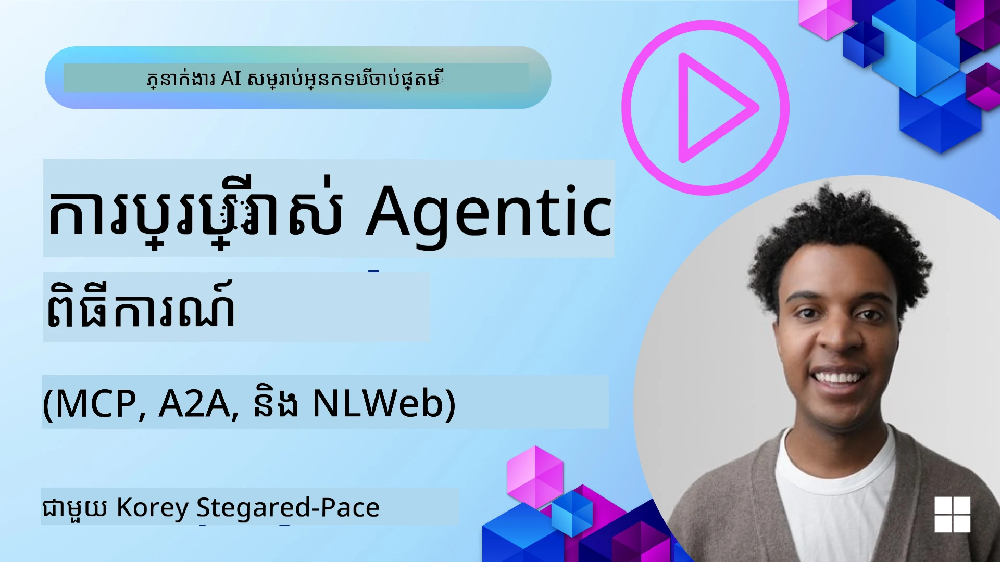
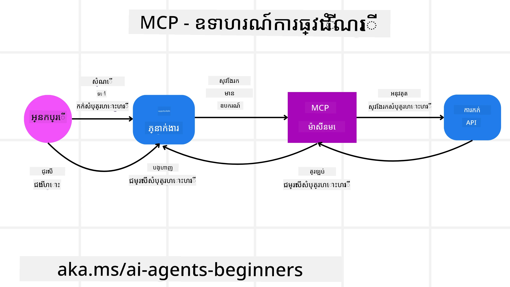
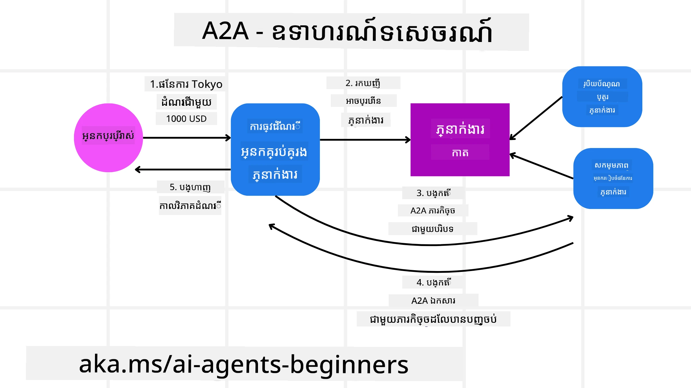
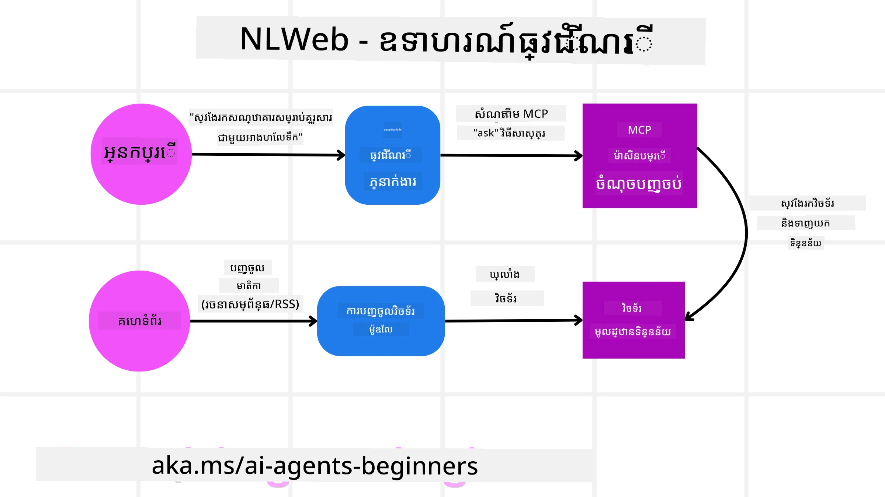

# ការប្រើប្រាស់ពិធីសាស្ត្រសម្រាប់ភ្នាក់ងារ (MCP, A2A និង NLWeb)

> _(ចុចលើរូបភាពខាងលើដើម្បីមើលវីដេអូរបស់មេរៀននេះ)_

នៅពេលដែលការប្រើភ្នាក់ងារ AI កើនឡើង ការទាមទារពីពិធីសាស្ត្រដែលធានាការមានស្តង់ដារ សុវត្ថិភាព និងគាំទ្រការបង្កើតថ្មីបើកចំហត្រូវកើនឡើងផងដែរ។ នៅក្នុងមេរៀននេះ យើងនឹងគណនាអំពីពិធីសាស្ត្រ 3 ប្រភេទ ដែលមានគោលបំណងបំពេញតម្រូវការនេះ - Model Context Protocol (MCP), Agent to Agent (A2A) និង Natural Language Web (NLWeb)។

## Introduction

នៅក្នុងមេរៀននេះ យើងនឹងពិភាក្សាអំពី៖

• របៀបដែល **MCP** អនុញ្ញាតឲ្យភ្នាក់ងារ AI ចូលដំណើរការឧបករណ៍ និងទិន្នន័យខាងក្រៅ ដើម្បីបញ្ចប់ភារកិច្ចរបស់អ្នកប្រើ។

• របៀបដែល **A2A** អនុញ្ញាតឲ្យមានការទំនាក់ទំនង និងសហការវិបាគ្នារវាងភ្នាក់ងារផ្សេងៗ។

• របៀបដែល **NLWeb** នាំយកចំណុចចំណាំភាសាធម្មជាតិក្នុងគេហទំព័រណាមួយ ដែលអនុញ្ញាតឲ្យភ្នាក់ងារ AI ស្វែងរក និងអន្តរកម្មជាមួយមាតិកា។

## Learning Goals

• **កំណត់** គោលបំណងស្នូល និងអត្ថប្រយោជន៍នៃ MCP, A2A, និង NLWeb នៅក្នុងបរិបទនៃភ្នាក់ងារ AI។

• **ពន្យល់** របៀបដែលពិធីសាស្ត្រនីមួយៗសម្រួលការទំនាក់ទំនង និងអន្តរកម្មរវាង LLMs, ឧបករណ៍ និងភ្នាក់ងារផ្សេងទៀត។

• **ស្គាល់** តួនាទីដ៍ផ្សេងគ្នាដែលពិធីសាស្ត្រនីមួយៗមានក្នុងការកសាងប្រព័ន្ធភ្នាក់ងារ​ដែលស្មុគស្មាញ។

## Model Context Protocol

The **Model Context Protocol (MCP)** ជាស្ដង់ដារបើកដែលផ្តល់នូវវិធីសាស្ត្រមានស្តង់ដារ សម្រាប់កម្មវិធីដើម្បីផ្តល់បរិបទ និងឧបករណ៍ទៅកាន់ LLMs។ នេះអនុញ្ញាតឲ្យមាន "ឧបករណពហុប្រយោជន៍" ដែលអាចភ្ជាប់ទៅប្រភពទិន្នន័យ និងឧបករណ៍ផ្សេងៗនៅក្នុងវិធីសាស្ត្រដែលទៀងទាត់។

យើងមកមើលសមាសធាតុនៃ MCP អត្ថប្រយោជន៍ប្រៀបធៀបទៅនឹងការប្រើ API ដោយផ្ទាល់ និងឧទាហរណ៍ពីរបៀបដែលភ្នាក់ងារ AI អាចប្រើម៉ាស៊ីនអ៊ិនធើន MCP ។

### MCP Core Components

MCP ធ្វើការលើស្ថាបត្យកម្ម **client-server** ហើយសមាសធាតុក្រិតស្នូលមានដូចជា៖

• **Hosts** គឺជាកម្មវិធី LLM (ឧ. កម្មវិធីកែសម្រួលកូដដូចជា VSCode) ដែលចាប់ផ្តើមការតភ្ជាប់ទៅកាន់ MCP Server។

• **Clients** គឺជាសមាសធាតុនៅក្នុងកម្មវិធី host ដែលរក្សាការតភ្ជាប់មួយទៅមួយជាមួយស៊ែវ័រ។

• **Servers** គឺជាផ្នែកកម្មវិធីទ្រៃភ្លឺដែលបង្ហាញពីសមត្ថភាពជាក់លាក់។

ដែលរួមបញ្ចូលនៅក្នុងពិធីសាស្ត្រមានបីធាតុមូលដ្ឋានដែលជាសមត្ថភាពរបស់ MCP Server៖

• **Tools**: វា​ជាសកម្មភាពឬមុខងារដែលភ្នាក់ងារ AI អាចហៅដើម្បីអនុវត្តសកម្មភាពមួយ។ ឧទាហរណ៍ សេវាកម្មអាកាសធាតុអាចបង្ហាញឧបករណ៍ "get weather" មួយ ឬស៊ែវ័រ​អេឡិចត្រូនិកអាចបង្ហាញឧបករណ៍ "purchase product" មួយ។ MCP servers ប្រកាសឈ្មោះ, ការពណ៌នា និង schema នៃ input/output របស់ឧបករណ៍នីមួយៗនៅក្នុងបញ្ជីសមត្ថភាពរបស់ពួកវា។

• **Resources**: វាជាធាតុទិន្នន័យអានតែម្ដង ឬឯកសារដែល MCP server អាចផ្ដល់បាន ហើយ clients អាចទាញយកវាបានតាមតម្រូវការ។ ឧទាហរណ៍រួមមានមាតិកាឯកសារ កំណត់ត្រាឃ្លាំងទិន្នន័យ ឬកំណត់ហេតុ។ Resources អាចជាអត្ថបទ (ដូចជា code ឬ JSON) ឬទ្រង់ទ្រាយបាន（二進制）ដូចជា រូបភាព ឬ PDF។

• **Prompts**: វាជា template ដែលបានកំណត់រួចដែលផ្តល់នូវសេចក្តីផ្ដល់ឱកាសសំណួរ ដើម្បីអនុញ្ញាតការងារដែលស្មុគស្មាញជាច្រើន។

### Benefits of MCP

MCP ផ្តល់អត្ថប្រយោជន៍សំខាន់ៗសម្រាប់ភ្នាក់ងារ AI:

• **ការរកឧបករណ៍ប្រភេទ Dynamic**: ភ្នាក់ងារអាចទទួលបានបញ្ជីឧបករណ៍ដែលអាចប្រើបានពីស៊ែវ័រមួយដោយឥតស្ថិតស្ថេរ ជាមួយការពណ៌នាអំពីអ្វីដែលពួកវាធ្វើ។ នេះខុសពី API ប្រពៃណី ដែលភាគច្រើនត្រូវការកូដបញ្ចូលតាំងពីដើមសម្រាប់ការរួមបញ្ចូល ដូច្នេះការផ្លាស់ប្តូរ API បណ្តាលឲ្យត្រូវអាប់ដេតកូដ។ MCP ផ្តល់នូវវិធានការ "integrate once" ដែលនាំឱ្យមានការយល់រួមបានពេញលេញជាងមុន។

• **ការទៅវិលគ្នាយឺតនៅលើ LLMs**: MCP ធ្វើការជាមួយ LLMs ផ្សេងៗផ្តល់ឱកាសបត់បែនសម្រាប់ប្ដូរម៉ូដែលស្នូល ដើម្បីវាយតម្លៃប្រសិទ្ធភាពល្អជាងមុន។

• **សុវត្ថិភាព​មានស្តង់ដារ**: MCP រួមបញ្ចូលវិធីសាស្ត្រផ្ទៀងផ្ទាត់សម្ថភាពមួយដែលធ្វើឲ្យមានសមត្ថភាពក្នុងការពង្រីកពេលបន្ថែមការចូលដំណើរការ MCP servers ផ្សេងគ្នា។ វាងាយស្រួលជាងការគ្រប់គ្រងកូនសោ និងប្រភេទការផ្ទៀងផ្ទាត់ប្លែកៗសម្រាប់ API ប្រពៃណីផ្សេងៗ។

### MCP Example

សូមសន្និដ្ឋានថាអ្នកប្រើចង់កក់ Tiket เรือบินជាមួយជំនួយក AI ដែលដំណើរការដោយ MCP។

1. **Connection**: ជំនួយ AI (the MCP client) តភ្ជាប់ទៅកាន់ MCP server ដែលផ្ដល់ដោយក្រុមហ៊ុនអាកាសចរណ៍មួយ។

2. **Tool Discovery**: client សួរស៊ែវ័រអាកាសចរណ៍ថា "តើអ្នកមានឧបករណ៍អ្វីខ្លះដែលអាចប្រើបាន?" ស៊ែវ័រឆ្លើយតបដោយឧបករណ៍ដូចជា "search flights" និង "book flights"។

3. **Tool Invocation**: បន្ទាប់មកអ្នកស្នើជំនួយAI ថា "សូមស្វែងរកបញ្ជីជើងហោះពី Portland ទៅ Honolulu" ជំនួយAI ដែលប្រើ LLM របស់វា ស្គាល់ថាវាចាំបាច់ត្រូវហៅឧបករណ៍ "search flights" ហើយដាក់ទិន្នន័យពាក់ព័ន្ធ (ដើមដំណើរ, គោលដៅ) ទៅ MCP server។

4. **Execution and Response**: MCP server ដែលមានតួនាទីជា wrapper ត្រូវធ្វើការហៅ API កក់សំបុត្រផ្ទៃក្នុងរបស់អាកាសចរណ៍។ វាទទួលព័ត៌មានជើងហោះ (ឧ. ទិន្នន័យ JSON) ហើយផ្ញើត្រឡប់ទៅជំនួយAI។

5. **Further Interaction**: ជំនួយAI បង្ហាញជំរើសជើងហោះ។ ពេលអ្នកជ្រើសជើងហោះមួយ ជំនួយអាចហៅឧបករណ៍ "book flight" លើ MCP server ដដែល ដើម្បីបញ្ចប់ការកក់។

## Agent-to-Agent Protocol (A2A)

ខណៈដែល MCP ផ្តោតទៅលើការភ្ជាប់ LLMs ទៅឧបករណ៍ ពិធីសាស្ត្រ **Agent-to-Agent (A2A)** ធ្វើម្ដងទៀតដោយអនុញ្ញាតឲ្យមានការទំនាក់ទំនង និងសហការវិបាគ្នារវាងភ្នាក់ងារ AI ផ្សេងៗ។ A2A ភ្ជាប់ភ្នាក់ងារ AI រួមគ្នាចន្លោះអង្គភាព អរិយធម៌ និងបច្ចេកវិទ្យាផ្សេងៗ ដើម្បីបញ្ចប់ភារកិច្ចចែករំលែក។

យើងនឹងពិនិត្យសមាសធាតុនិងអត្ថប្រយោជន៍នៃ A2A ដោយមានឧទាហរណ៍ពីរបៀបវាអាចអនុវត្តនៅក្នុងកម្មវិធីដំណើរកំសាន្តរបស់យើង។

### A2A Core Components

A2A ផ្តោតលើការអនុញ្ញាតឲ្យភ្នាក់ងារទំនាក់ទំនងគ្នានិងធ្វើការជាមួយគ្នាដើម្បីបញ្ចប់បំបែកភារកិច្ចមួយ។ សមាសធាតុនីមួយៗនៃពិធីសាស្ត្រមានការរួមចំណែកដូចខាងក្រោម៖

#### Agent Card

Similar to how an MCP server shares a list of tools, an Agent Card has:
- The Name of the Agent .
- A **description of the general tasks** it completes.
- A **list of specific skills** with descriptions to help other agents (or even human users) understand when and why they would want to call that agent.
- The **current Endpoint URL** of the agent
- The **version** and **capabilities** of the agent such as streaming responses and push notifications.

#### Agent Executor

The Agent Executor is responsible for **passing the context of the user chat to the remote agent**, the remote agent needs this to understand the task that needs to be completed. In an A2A server, an agent uses its own Large Language Model (LLM) to parse incoming requests and execute tasks using its own internal tools.

#### Artifact

Once a remote agent has completed the requested task, its work product is created as an artifact.  An artifact **contains the result of the agent's work**, a **description of what was completed**, and the **text context** that is sent through the protocol. After the artifact is sent, the connection with the remote agent is closed until it is needed again.

#### Event Queue

This component is used for **handling updates and passing messages**. It is particularly important in production for agentic systems to prevent the connection between agents from being closed before a task is completed, especially when task completion times can take a longer time.

### Benefits of A2A

• **Enhanced Collaboration**: It enables agents from different vendors and platforms to interact, share context, and work together, facilitating seamless automation across traditionally disconnected systems.

• **Model Selection Flexibility**: Each A2A agent can decide which LLM it uses to service its requests, allowing for optimized or fine-tuned models per agent, unlike a single LLM connection in some MCP scenarios.

• **Built-in Authentication**: Authentication is integrated directly into the A2A protocol, providing a robust security framework for agent interactions.

### A2A Example

Let's expand on our travel booking scenario, but this time using A2A.

1. **User Request to Multi-Agent**: A user interacts with a "Travel Agent" A2A client/agent, perhaps by saying, "Please book an entire trip to Honolulu for next week, including flights, a hotel, and a rental car".

2. **Orchestration by Travel Agent**: The Travel Agent receives this complex request. It uses its LLM to reason about the task and determine that it needs to interact with other specialized agents.

3. **Inter-Agent Communication**: The Travel Agent then uses the A2A protocol to connect to downstream agents, such as an "Airline Agent," a "Hotel Agent," and a "Car Rental Agent" that are created by different companies.

4. **Delegated Task Execution**: The Travel Agent sends specific tasks to these specialized agents (e.g., "Find flights to Honolulu," "Book a hotel," "Rent a car"). Each of these specialized agents, running their own LLMs and utilizing their own tools (which could be MCP servers themselves), performs its specific part of the booking.

5. **Consolidated Response**: Once all downstream agents complete their tasks, the Travel Agent compiles the results (flight details, hotel confirmation, car rental booking) and sends a comprehensive, chat-style response back to the user.

## Natural Language Web (NLWeb)

គេហទំព័របានជាទីបំផុតជារបៀបសម្រាប់អ្នកប្រើក្នុងការទទួលព័ត៌មាន និងទិន្នន័យតាមអ៊ីនធឺណិតរយៈពេលយូរ។

យើងមកមើលសមាសធាតុផ្សេងៗរបស់ NLWeb អត្ថប្រយោជន៍របស់វា និងឧទាហរណ៍ពីរបៀបដែល NLWeb ដំណើរការដោយយកគេហទំព័រដំណើរកមសាន្តរបស់យើងជាគំរូ។

### Components of NLWeb

- **NLWeb Application (Core Service Code)**: The system that processes natural language questions. It connects the different parts of the platform to create responses. You can think of it as the **engine that powers the natural language features** of a website.

- **NLWeb Protocol**: This is a **basic set of rules for natural language interaction** with a website. It sends back responses in JSON format (often using Schema.org). Its purpose is to create a simple foundation for the “AI Web,” in the same way that HTML made it possible to share documents online.

- **MCP Server (Model Context Protocol Endpoint)**: Each NLWeb setup also works as an **MCP server**. This means it can **share tools (like an “ask” method) and data** with other AI systems. In practice, this makes the website’s content and abilities usable by AI agents, allowing the site to become part of the wider “agent ecosystem.”

- **Embedding Models**: These models are used to **convert website content into numerical representations called vectors** (embeddings). These vectors capture meaning in a way computers can compare and search. They are stored in a special database, and users can choose which embedding model they want to use.

- **Vector Database (Retrieval Mechanism)**: This database **stores the embeddings of the website content**. When someone asks a question, NLWeb checks the vector database to quickly find the most relevant information. It gives a fast list of possible answers, ranked by similarity. NLWeb works with different vector storage systems such as Qdrant, Snowflake, Milvus, Azure AI Search, and Elasticsearch.

### NLWeb by Example

Consider our travel booking website again, but this time, it's powered by NLWeb.

1. **Data Ingestion**: The travel website's existing product catalogs (e.g., flight listings, hotel descriptions, tour packages) are formatted using Schema.org or loaded via RSS feeds. NLWeb's tools ingest this structured data, create embeddings, and store them in a local or remote vector database.

2. **Natural Language Query (Human)**: A user visits the website and, instead of navigating menus, types into a chat interface: "Find me a family-friendly hotel in Honolulu with a pool for next week".

3. **NLWeb Processing**: The NLWeb application receives this query. It sends the query to an LLM for understanding and simultaneously searches its vector database for relevant hotel listings.

4. **Accurate Results**: The LLM helps to interpret the search results from the database, identify the best matches based on "family-friendly," "pool," and "Honolulu" criteria, and then formats a natural language response. Crucially, the response refers to actual hotels from the website's catalog, avoiding made-up information.

5. **AI Agent Interaction**: Because NLWeb serves as an MCP server, an external AI travel agent could also connect to this website's NLWeb instance. The AI agent could then use the `ask("Are there any vegan-friendly restaurants in the Honolulu area recommended by the hotel?")`. The NLWeb instance would process this, leveraging its database of restaurant information (if loaded), and return a structured JSON response.

### Got More Questions about MCP/A2A/NLWeb?

Join the [Microsoft Foundry Discord](https://aka.ms/ai-agents/discord) to meet with other learners, attend office hours and get your AI Agents questions answered.

## Resources

- [MCP for Beginners](https://aka.ms/mcp-for-beginners)  
- [MCP Documentation](https://learn.microsoft.com/python/api/overview/azure/ai-projects-readme)
- [NLWeb Repo](https://github.com/nlweb-ai/NLWeb)
- [Microsoft Agent Framework](https://aka.ms/ai-agents-beginners/agent-framewrok)

---

<!-- CO-OP TRANSLATOR DISCLAIMER START -->
**Disclaimer**:
ឯកសារនេះត្រូវបានបកប្រែដោយប្រើសេវាបកប្រែ AI [Co-op Translator](https://github.com/Azure/co-op-translator)។ ទោះយើងខ្ញុំខំប្រឹងប្រែងដើម្បីឲ្យបានត្រឹមត្រូវ សូមយល់ដឹងថាការបកប្រែដោយស្វ័យប្រវត្តិអាចមានកំហុស ឬភាពមិនត្រឹមត្រូវ។ ឯកសារដើមនៅក្នុងភាសាដើមគួរត្រូវបានចាត់ទុកថាជា​ប្រភពដែលអាចទុកចិត្តបាន។ សម្រាប់ព័ត៌មានសំខាន់ ការបកប្រែដោយមនុស្សវិជ្ជាជីវៈគឺបានផ្ដល់អនុសាសន៍។ យើងមិនទទួលខុសត្រូវចំពោះការយល់ច្រឡំ ឬការបកស្រាយខុសណាមួយ ដែលកើតឡើងពីការប្រើប្រាស់ការបកប្រែនេះទេ។
<!-- CO-OP TRANSLATOR DISCLAIMER END -->