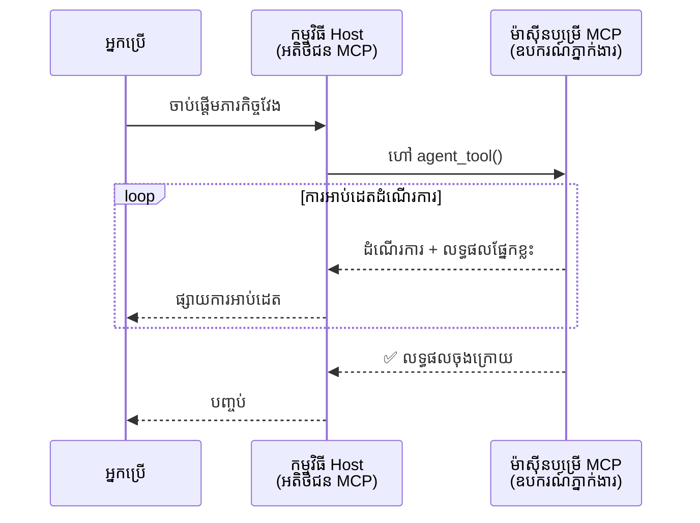
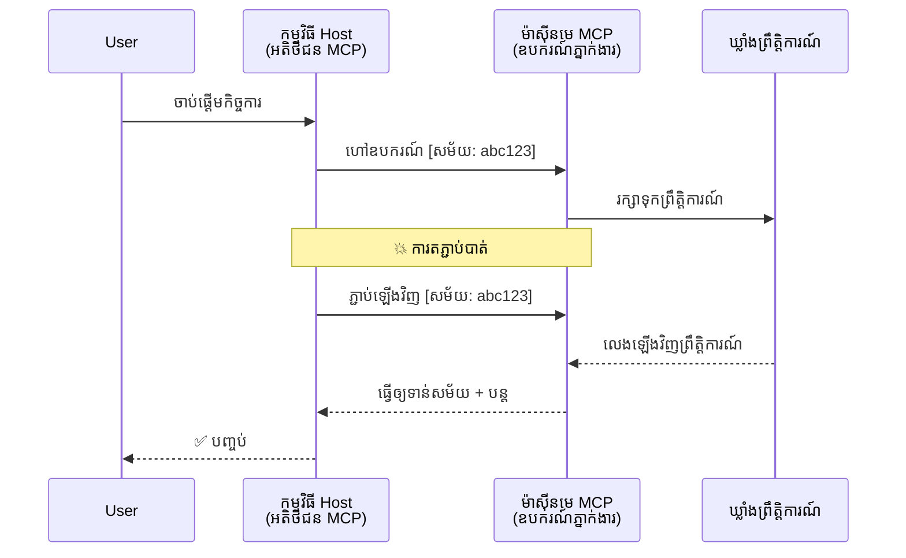
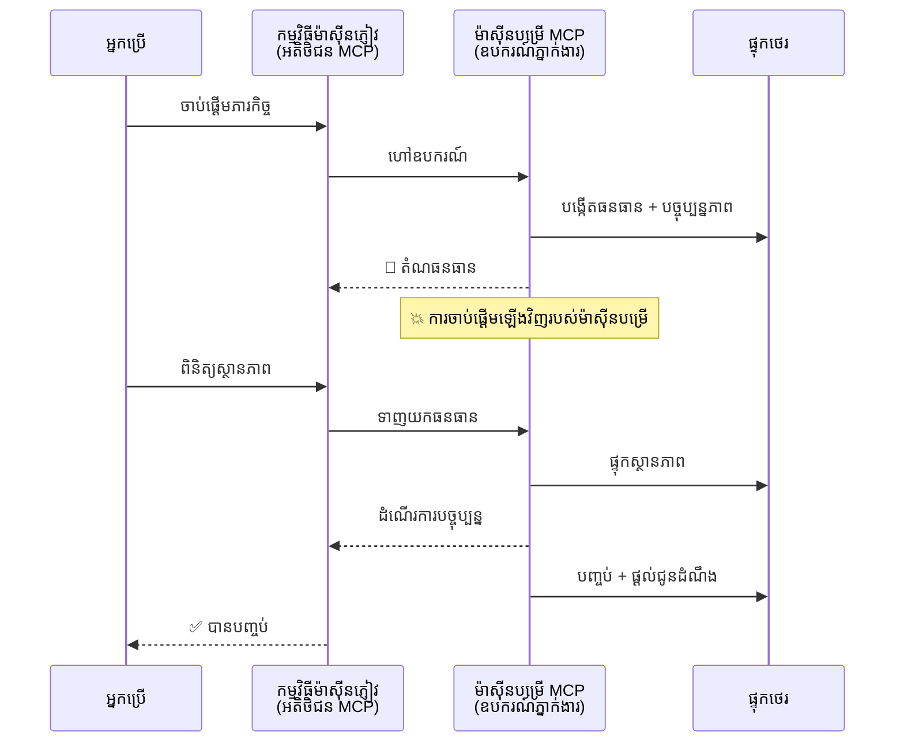
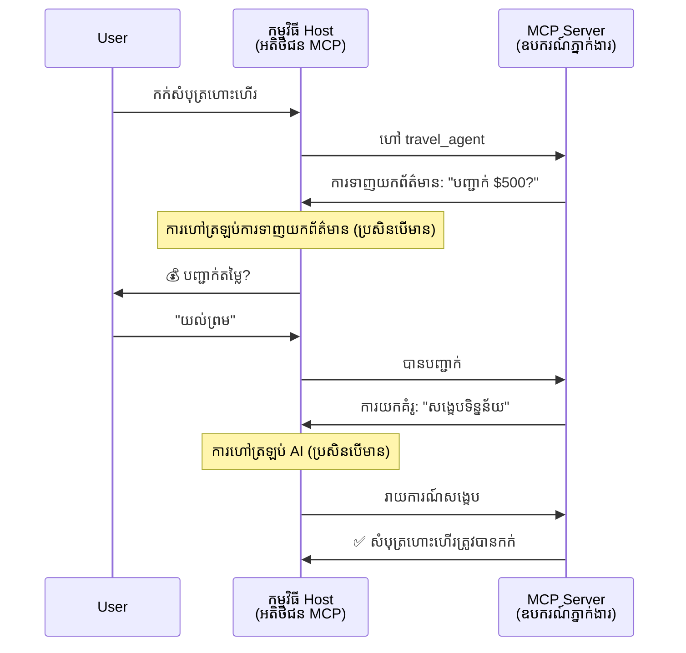
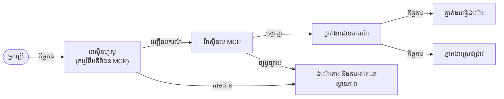

# Building Agent-to-Agent Communication Systems with MCP

> TL;DR - តើ​អ្នក​អាច​សាងសង់​ទំនាក់ទំនង Agent2Agent លើ MCP បានទេ? បាន!

MCP បានអភិវឌ្ឍយ៉ាងខ្លាំងលើសពីគោលបំណងដើមរបស់វា "ផ្តល់បរិបទទៅ LLMs"។ ជាមួយនឹងការកែលម្អថ្មីៗទាំង [ចរន្តដែលអាចបន្តបាន](https://modelcontextprotocol.io/docs/concepts/transports#resumability-and-redelivery), [elicitation](https://modelcontextprotocol.io/specification/2025-06-18/client/elicitation), [sampling](https://modelcontextprotocol.io/specification/2025-06-18/client/sampling), និងការជូនដំណឹង ([progress](https://modelcontextprotocol.io/specification/2025-06-18/basic/utilities/progress) និង [resources](https://modelcontextprotocol.io/specification/2025-06-18/schema#resourceupdatednotification)), MCP ឥឡូវនេះផ្តល់មូលដ្ឋានរឹងមាំសម្រាប់សង់ប្រព័ន្ធទំនាក់ទំនងស្មុគស្មាញអេហ្សិន​ទៅ​អេហ្សិន។

## The Agent/Tool Misconception

នៅពេលដែលអ្នកអភិវឌ្ឍកាន់តែច្រើនស្វែងរកឧបករណ៍ដែលមានឥរិយាបថអេហ្សិន (ដំណើរការពេលវេលាយូរ, អាចត្រូវការបញ្ចូលបន្ថែមនៅពេលដំណើរការ, ល។), ការយល់ច្រឡំទូលំទូលគឺថា MCP មិនសមស្រប ដោយសារ ឧទាហរណ៍ដំបូងៗ នៃឧបករណ៍របស់វាគឺផ្តោតលើគំរូសំណើ-បញ្ចប់សាមញ្ញ។

ការយល់ឃើញនេះចាស់ហើយ។ ពិស្ទិទ្ធសាធារណៈ MCP បានត្រូវបានបន្ថែមសមត្ថភាពយ៉ាងច្រើនក្នុងខែពីរបីចុងក្រោយ ដែលបិទចន្លោះសម្រាប់សាងសង់អ៊ីរិយាបថអេហ្សិនយូរពេល:

- **Streaming & Partial Results**: ការអាប់ដេតដំណើរការពេលពិតក្នុងអំឡុងការប្រតិបត្តិ
- **Resumability**: អតិថិជនអាចភ្ជាប់ឡើងវិញ និងបន្តបន្ទាប់ពីការបែកចេញ
- **Durability**: លទ្ធផលងាររស់នៅក្រោយការចាប់ផ្តើមម៉ាស៊ីនមេឡើងវិញ (ឧ. តាមរយៈ resource links)
- **Multi-turn**: ការបញ្ចូលអន្តរកម្មកណ្តាលក្នុងអំឡុងការប្រតិបត្តិ តាមរយៈ elicitation និង sampling

លក្ខណៈទាំងនេះអាចត្រូវបានសមាសធាតុគ្នាដើម្បីអនុញ្ញាតកម្មវិធីអេហ្សិនស្មុគស្មាញ និងកម្មវិធីអេហ្សិនច្រើន ត្រូវបានដាក់បញ្ចូលលើប្រព័ន្ធ MCP ទាំងមូល។

សម្រាប់យោង យើងនឹងយោងអេហ្សិនជាឧបករណ៍ ("tool") ដែលមានស្រាប់លើម៉ាស៊ីនមេ MCP។ នេះមានន័យថាមានកម្មវិធីដំណើរការមួយដែលអនុវត្ត MCP client ដែលបង្កើតសេស្យុងជាមួយម៉ាស៊ីនមេ MCP ហើយអាចហៅឧបករណ៍នោះបាន។

## What Makes an MCP Tool "Agentic"?

មុននឹងចូលទៅកាន់ការអនុវត្ត អោយយើងកំណត់ capability មួយចំនួនដែលត្រូវការសម្រាប់គាំទ្រ​អេហ្សិន​ដំណើរការយូរ។

> យើងនឹងកំណត់អេហ្សិនថាជាជាឯកត្តាដែលអាចដំណើរការយ៉ាងឯករាជ្យក្នុងរយៈពេលវែងបាន ជំនាញក្នុងការដោះស្រាយភារកិច្ចស្មុគស្មាញដែលអាចត្រូវការការបន្តអន្តរកម្មច្រើនដង ឬកែប្រែក្នុងមូលដ្ឋាននៃមតិយោបល់ពេលពិត។

### 1. Streaming & Partial Results

គំរូសំណើ-ចម្លើយប្រពៃណីមិនដំណើការ សម្រាប់ភារកិច្ចដំណើរការយូរ។ អេហ្សិនត្រូវការផ្តល់:

- ការអាប់ដេតដំណើរការពេលពិត
- លទ្ធផលចំណែកកណ្តាល

**MCP Support**: ការជូនដំណឹងអំពីការអាប់ដេត resource អនុញ្ញាតឲ្យចែកចាយលទ្ធផលចំណែក ក្រៅពីនេះទាមទារការរចនាយកចិត្ដយ៉ាងប្រុងប្រយ័ត្នដើម្បីជៀសវាងវិជ្ជាជីវៈជាមួយគំរូ JSON-RPC 1:1 សម្រាប់សំណើ/ចម្លើយ។

| Feature                    | Use Case                                                                                                                                                                       | MCP Support                                                                                |
| -------------------------- | ------------------------------------------------------------------------------------------------------------------------------------------------------------------------------ | ------------------------------------------------------------------------------------------ |
| Real-time Progress Updates | អ្នកប្រើស្នើសុំភារកិច្ចបម្លែងកូដៈ អេហ្សិនផ្តាច់បញ្ចាំងដំណើរការ៖ "10% - កំពុងវិភាគការគ្រប់គ្រង ... 25% - កំពុងបម្លែងឯកសារ TypeScript ... 50% - កំពុងធ្វើបច្ចប្បន្នភាព imports..."          | ✅ Progress notifications                                                                  |
| Partial Results            | ភារកិច្ច "បង្កើតសៀវភៅ" ផ្តល់លទ្ធផលចំណែកបាន ដូចជា 1) រចនាសម្ព័ន្ធរឿង, 2) បញ្ជីជំពូក, 3) ម eachជំពូកនៅពេលបានបញ្ចប់។ Host អាចពិនិត្យ សប់សារ ឬបញ្ជូនបញ្ឈប់នៅគ្រប់ដំណាក់កាល។ | ✅ Notifications can be "extended" to include partial results see proposals on PR 383, 776 |

<div align="center" style="font-style: italic; font-size: 0.95em; margin-bottom: 0.5em;">
<strong>Figure 1:</strong> គំនូសមួយនេះបង្ហាញពីរបៀបដែលអេហ្សិន MCP ផ្សព្វផ្សាយការអាប់ដេតដំណើរការពេលពិត និងលទ្ធផលចំណែកទៅកាន់កម្មវិធី host ក្នុងអំឡុងភារកិច្ចដំណើរការយូរ អនុញ្ញាតឲ្យអ្នកប្រើតាមដានការប្រតិបត្តិនៅពេលពិត។
</div>


### 2. Resumability

អេហ្សិនត្រូវតែគ្រប់គ្រងការបាក់បែកបណ្តាញយ៉ាងសង្ហារឹង៖

- ភ្ជាប់ឡើងវិញបន្ទាប់ពី (client) បែកចេញ
- បន្តពីចំណុចដែលបានផ្អាក (message redelivery)

**MCP Support**: ប្រព័ន្ធទ្រង់ទ្រាយ StreamableHTTP របស់ MCP សព្វថ្ងៃគាំទ្រការបន្តសេស្យុង និងការដឹកនាំសារ (message redelivery) ជាមួយ session IDs និង last event IDs។ កំណត់ចំណាំសំខាន់គឺម៉ាស៊ីនមេត្រូវអនុវត្ត EventStore ដែលអាចចម្លងព្រឹត្តិការណ៍ឡើងវិញនៅពេល client ភ្ជាប់ឡើងវិញ។  
សូមចំណាំថាមានសំណើសហគមន៍មួយ (PR #975) ដែលស្រាវជ្រាវអំពីចរន្តដែលអាចបន្តបានដោយមិនពឹងផ្អែកលើ transport ។

| Feature      | Use Case                                                                                                                                                   | MCP Support                                                                |
| ------------ | ---------------------------------------------------------------------------------------------------------------------------------------------------------- | -------------------------------------------------------------------------- |
| Resumability | Client ពិតជាបែកចេញក្នុងអំឡុងភារកិច្ចដំណើរការយូរ។ នៅពេលភ្ជាប់ឡើងវិញ សេស្យុងបន្តជាមួយព្រឹត្តិការណ៍ដែលខកខានត្រូវបានចម្លងឡើងវិញ បន្តដោយរលូនពីចំណុចដែលបានផ្អាក។ | ✅ StreamableHTTP transport with session IDs, event replay, and EventStore |

<div align="center" style="font-style: italic; font-size: 0.95em; margin-bottom: 0.5em;">
<strong>Figure 2:</strong> គំនូសនេះបង្ហាញពីរបៀបដែល StreamableHTTP transport និង event store របស់ MCP អនុញ្ញាតឲ្យបន្តសេស្យុងដោយរលូន៖ ប្រសិនបើ client បែកចេញ វាអាចភ្ជាប់ឡើងវិញ និងចម្លងព្រឹត្តិការណ៍ដែលខកខាន ដើម្បីបន្តភារកិច្ចដោយគ្មានការបាត់បង់ការរីកចម្រើន។
</div>


### 3. Durability

អេហ្សិនដំណើរការយូរអ្នកត្រូវការមានស្ថានភាពដែលនៅកន្លែងចាំទុក:

- លទ្ធផលរស់នៅក្រោយការចាប់ផ្តើមម៉ាស៊ីនមេឡើងវិញ
- អាចយកស្ថានភាពបានពីខាងក្រៅ
- ការតាមដានដំណើរការពីសេស្យុងទៅសេស្យុង

**MCP Support**: MCP ឥឡូវនេះគាំទ្រប្រភេទត្រឡប់ជា Resource link សម្រាប់ការហៅឧបករណ៍។ សព្វថ្ងៃ គំរូមួយធម្មតាគឺរៀបចំឧបករណ៍ដែលបង្កើត resource ហើយតalukត្រឡប់ resource link ពេលភ្ជាប់។ ឧបករណ៍អាចបន្តដោះស្រាយភារកិច្ចនៅខាងក្រោយ និងធ្វើឲ្យ resource បានអាប់ដេត។ នៅក្នុងវិលលិច client អាចជ្រើសជារៀងរាល់ពិនិត្យស្ថានភាពនៃ resource ដើម្បីទទួលលទ្ធផលចំណែក ឬពេញលេញ (អាស្រ័យលើការអាប់ដេតដែលម៉ាស៊ីនមេផ្តល់) ឬជាសមាជិកក៏អាចជាវសម្រាប់ការជូនដំណឹងអំពី resource។

កំណត់ខ្សែទាំងនេះគឺការស្ទង់សួរលើ resource ឬជាវសម្រាប់ការអាប់ដេតអាចប្រើប្រាស់ធនធានបានជាច្រើនដែលមានផលប៉ះពាល់នៅក្ដីស្ដុក។ មានសំណើសហគមន៍បើកចំហ (រួមទាំង #992) សម្រាប់ស្រាវជ្រាវសមត្ថភាពក្នុងការរួមបញ្ចូល webhooks ឬ triggers ដែលម៉ាស៊ីនមេអាចហៅដើម្បីជូនដំណឹងទៅ client/កម្មវិធី host ពីការអាប់ដេត។

| Feature    | Use Case                                                                                                                                        | MCP Support                                                        |
| ---------- | ----------------------------------------------------------------------------------------------------------------------------------------------- | ------------------------------------------------------------------ |
| Durability | ម៉ាស៊ីនមេធ្លាក់ក្នុងខណៈភារកិច្ចបម្លែងទិន្នន័យ។ លទ្ធផល និងដំណើរការរស់នៅក្រោយការចាប់ផ្តើមឡើងវិញ, client អាចពិនិត្យស្ថានភាព ហើយបន្តពី resource ដែលបានរក្សាទុក។ | ✅ Resource links with persistent storage and status notifications |

សព្វថ្ងៃ គំរូទូទៅគឺរៀបចំឧបករណ៍ដែលបង្កើត resource ហើយតាលុកត្រឡប់ resource link ពេលភ្ជាប់។ ឧបករណ៍អាចនៅខាងក្រោយដោះស្រាយភារកិច្ច ចេញផ្ញើការជូនដំណឹងអំពី resource ដែលដើមជាទ្រង់ទ្រាយនៃការអាប់ដេតដំណើរការ ឬរួមបញ្ចូលលទ្ធផលចំណែក ហើយអាប់ដេតមាតិកានៅក្នុង resource ឲ្យបានតាមត្រូវ។

<div align="center" style="font-style: italic; font-size: 0.95em; margin-bottom: 0.5em;">
<strong>Figure 3:</strong> គំនូសនេះបង្ហាញពីរបៀបដែលអេហ្សិន MCP ប្រើប្រាស់ resource ដែលមានទំនុកចិត្ត និងការជូនដំណឹងស្ថានភាព ដើម្បីធានាថា ភារកិច្ចដែលដំណើរការយូររស់នៅក្រោយការចាប់ផ្តើមម៉ាស៊ីនមើឡើងវិញ អនុញ្ញាតឲ្យ client ពិនិត្យដំណើរការ និងយកលទ្ធផលទោះបីមានបរាជ័យកើតឡើងក៏បាន។
</div>


### 4. Multi-Turn Interactions

អេហ្សិនភាគច្រើនត្រូវការបញ្ចូលបន្ថែមកណ្តាលក្នុងអំឡុងការប្រតិបត្តិ:

- ការបញ្ជាក់ ឬ អនុម័តពីមនុស្ស
- ជំនួយ AI សម្រាប់សេចក្តីសម្រេចស្មុគស្មាញ
- ការកែប្រែប៉ារ៉ាម៉ែត្រទន់

**MCP Support**: គាំទ្របំពេញតាម sampling (សម្រាប់បញ្ចូលពី AI) និង elicitation (សម្រាប់បញ្ចូលពីមនុស្ស)។

| Feature                 | Use Case                                                                                                                                     | MCP Support                                           |
| ----------------------- | -------------------------------------------------------------------------------------------------------------------------------------------- | ----------------------------------------------------- |
| Multi-Turn Interactions | អេហ្សិនកក់ដំណើរកម្រងស្នើឲ្យអ្នកប្រើបញ្ជាក់តម្លៃ, បន្ទាប់មកស្នើ AI ដើម្បីសង្ខេបព័ត៌មានដំណើរកម្រងមុនបញ្ចប់ប្រតិបត្តិការ ការកក់។                         | ✅ Elicitation for human input, sampling for AI input |

<div align="center" style="font-style: italic; font-size: 0.95em; margin-bottom: 0.5em;">
<strong>Figure 4:</strong> គំនូសនេះបង្ហាញពីរបៀបដែលអេហ្សិន MCP អាចស្នើសុំបញ្ចូលពីមនុស្សយ៉ាងអន្តរកម្ម ឬស្នើសុំជំនួយពី AI កណ្តាលការប្រតិបត្តិ ដើម្បីគាំទ្រការងារ multi-turn ស្មុគស្មាញ ដូចជា ការបញ្ជាក់ និងសេចក្តីសម្រេចឌីណាមិច។
</div>


## Implementing Long-Running Agents on MCP - Code Overview

ជាផ្នែកនៃអត្ថបទនេះ យើងផ្តល់ [code repository](https://github.com/victordibia/ai-tutorials/tree/main/MCP%20Agents) ដែលមានការអនុវត្តពេញលេញនៃអេហ្សិនដំណើរការយូរ ដោយប្រើ MCP Python SDK ជាមួយ StreamableHTTP transport សម្រាប់បន្តសេស្យុង និងការដឹកសារឡើងវិញ។ ការអនុវត្តបង្ហាញពីរបៀបដែលសមត្ថភាព MCP អាចត្រូវបានសមាសធាតុដើម្បីអនុញ្ញាតឲ្យមានឥរិយាបថប្រហែលអេហ្សិន។

ជាក់លាក់ យើងអនុវត្តម៉ាស៊ីនមេមួយដែលមានឧបករណ៍អេហ្សិនសំខាន់ពីរនាក់៖

- **Travel Agent** - ចាក់សោរកម្មវិធីកក់ដំណើរកម្រង ដែលធ្វើសំណើបញ្ជាក់តម្លៃតាមរយៈ elicitation
- **Research Agent** - អនុវត្តភារកិច្ចស្រាវជ្រាវជាមួយសង្ខេបជំនួយដោយ AI តាមរយៈ sampling

ទាំងពីរអេហ្សិនបង្ហាញការអាប់ដេតដំណើរការពេលពិត ការបញ្ជាក់អន្តរកម្ម និងសមត្ថភាពបន្តសេស្យុងពេញលេញ។

### Key Implementation Concepts

ផ្នែកខាងក្រោមបង្ហាញការអនុវត្តនៅផ្នែកម៉ាស៊ីនមេសម្រាប់អេហ្សិន និងការគ្រប់គ្រងនៅផ្នែក client/host សម្រាប់មុខងារ​នីមួយៗ៖

#### Streaming & Progress Updates - Real-time Task Status

Streaming អនុញ្ញាតឲ្យអេហ្សិនផ្តល់ការអាប់ដេតដំណើរការពេលពិតក្នុងអំឡុងភារកិច្ចដំណើរការយូរ រក្សាឲ្យអ្នកប្រើបានដឹងពីស្ថានភាពភារកិច្ច និងលទ្ធផលចំណែក។

**Server Implementation (agent sends progress notifications):**

```python
# ពី server/server.py - ភ្នាក់ងារធ្វើដំណើរកំពុងផ្ញើការអាប់ដេតស្ថានភាព
for i, step in enumerate(steps):
    await ctx.session.send_progress_notification(
        progress_token=ctx.request_id,
        progress=i * 25,
        total=100,
        message=step,
        related_request_id=str(ctx.request_id)
    )
    await anyio.sleep(2)  # ចម្លងការងារ

# ជម្រើសផ្សេង: សារកំណត់ហេតុសម្រាប់ការអាប់ដេតលម្អិតជាលំដាប់ដំណាក់កាល
await ctx.session.send_log_message(
    level="info",
    data=f"Processing step {current_step}/{steps} ({progress_percent}%)",
    logger="long_running_agent",
    related_request_id=ctx.request_id,
)
```

**Client Implementation (host receives progress updates):**

```python
# ពី client/client.py - អតិថិជនដែលគ្រប់គ្រងការជូនដំណឹងពេលពិត
async def message_handler(message) -> None:
    if isinstance(message, types.ServerNotification):
        if isinstance(message.root, types.LoggingMessageNotification):
            console.print(f"📡 [dim]{message.root.params.data}[/dim]")
        elif isinstance(message.root, types.ProgressNotification):
            progress = message.root.params
            console.print(f"🔄 [yellow]{progress.message} ({progress.progress}/{progress.total})[/yellow]")

# ចុះឈ្មោះអ្នកដំណើរការសារនៅពេលបង្កើតសម័យ
async with ClientSession(
    read_stream, write_stream,
    message_handler=message_handler
) as session:
```

#### Elicitation - Requesting User Input

Elicitation អនុញ្ញាតឲ្យអេហ្សិនស្នើសុំបញ្ចូលពីអ្នកប្រើកណ្តាលពេលដំណើរការ។ នេះសំខាន់សម្រាប់ការបញ្ជាក់ ការបកស្រាយ ឬការអនុម័តក្នុងអំឡុងភារកិច្ចដំណើរការយូរ។

**Server Implementation (agent requests confirmation):**

```python
# ពី server/server.py - ភ្នាក់ងារធ្វើដំណើរស្នើសុំការបញ្ជាក់តម្លៃ
elicit_result = await ctx.session.elicit(
    message=f"Please confirm the estimated price of $1200 for your trip to {destination}",
    requestedSchema=PriceConfirmationSchema.model_json_schema(),
    related_request_id=ctx.request_id,
)

if elicit_result and elicit_result.action == "accept":
    # បន្តការកក់
    logger.info(f"User confirmed price: {elicit_result.content}")
elif elicit_result and elicit_result.action == "decline":
    # បោះបង់ការកក់
    booking_cancelled = True
```

**Client Implementation (host provides elicitation callback):**

```python
# ពី client/client.py - កម្មវិធីអតិថិជន ដែលដំណើរការសំណើសុំប្រមូលព័ត៌មាន
async def elicitation_callback(context, params):
    console.print(f"💬 Server is asking for confirmation:")
    console.print(f"   {params.message}")

    response = console.input("Do you accept? (y/n): ").strip().lower()

    if response in ['y', 'yes']:
        return types.ElicitResult(
            action="accept",
            content={"confirm": True, "notes": "Confirmed by user"}
        )
    else:
        return types.ElicitResult(
            action="decline",
            content={"confirm": False, "notes": "Declined by user"}
        )

# ចុះបញ្ជី callback នៅពេលបង្កើតសេស្យុង
async with ClientSession(
    read_stream, write_stream,
    elicitation_callback=elicitation_callback
) as session:
```

#### Sampling - Requesting AI Assistance

Sampling អនុញ្ញាតឲ្យអេហ្សិនស្នើសុំជំនួយពី LLM សម្រាប់សេចក្តីសម្រេចស្មុគស្មាញ ឬការបង្កើតមាតិកានៅពេលប្រតិបត្តិ។ វាអនុញ្ញាតឲ្យមាន workflow ការងារលាយលក្ខណៈមនុស្ស-AI។

**Server Implementation (agent requests AI assistance):**

```python
# ពី server/server.py - តំណាងស្រាវជ្រាវកំពុងស្នើសុំសេចក្តីសង្ខេបពី AI
sampling_result = await ctx.session.create_message(
    messages=[
        SamplingMessage(
            role="user",
            content=TextContent(type="text", text=f"Please summarize the key findings for research on: {topic}")
        )
    ],
    max_tokens=100,
    related_request_id=ctx.request_id,
)

if sampling_result and sampling_result.content:
    if sampling_result.content.type == "text":
        sampling_summary = sampling_result.content.text
        logger.info(f"Received sampling summary: {sampling_summary}")
```

**Client Implementation (host provides sampling callback):**

```python
# ពី client/client.py - អតិថិជនដែលដំណើរការ​សំណើសម្រាប់ការទាញយកគំរូ
async def sampling_callback(context, params):
    message_text = params.messages[0].content.text if params.messages else 'No message'
    console.print(f"🧠 Server requested sampling: {message_text}")

    # នៅក្នុងកម្មវិធីពិតប្រាកដ វាអាចហៅ API របស់ LLM
    # សម្រាប់ការបង្ហាញ យើងផ្តល់ចម្លើយគំរូ
    mock_response = "Based on current research, MCP has evolved significantly..."

    return types.CreateMessageResult(
        role="assistant",
        content=types.TextContent(type="text", text=mock_response),
        model="interactive-client",
        stopReason="endTurn"
    )

# ចុះបញ្ជី callback នៅពេលបង្កើតសម័យ
async with ClientSession(
    read_stream, write_stream,
    sampling_callback=sampling_callback,
    elicitation_callback=elicitation_callback
) as session:
```

#### Resumability - Session Continuity Across Disconnections

Resumability ប្រាកដថាភារកិច្ចអេហ្សិនដំណើរការយូរអាចធម្មតារស់រានពេល client បែកចេញ ហើយបន្តដោយរលូននៅពេលភ្ជាប់ឡើងវិញ។ នេះបានអនុវត្តតាមរយៈ event stores និង resumption tokens។

**Event Store Implementation (server holds session state):**

```python
# ពី server/event_store.py - ឃ្លាំងព្រឹត្តិការណ៍សាមញ្ញនៅក្នុងចងចាំ
class SimpleEventStore(EventStore):
    def __init__(self):
        self._events: list[tuple[StreamId, EventId, JSONRPCMessage]] = []
        self._event_id_counter = 0

    async def store_event(self, stream_id: StreamId, message: JSONRPCMessage) -> EventId:
        """Store an event and return its ID."""
        self._event_id_counter += 1
        event_id = str(self._event_id_counter)
        self._events.append((stream_id, event_id, message))
        return event_id

    async def replay_events_after(self, last_event_id: EventId, send_callback: EventCallback) -> StreamId | None:
        """Replay events after the specified ID for resumption."""
        # ស្វែងរកព្រឹត្តិការណ៍បន្ទាប់ពីព្រឹត្តិការណ៍ចុងក្រោយដែលបានស្គាល់ ហើយចាក់ឡើងវិញ
        for _, event_id, message in self._events[start_index:]:
            await send_callback(EventMessage(message, event_id))

# ពី server/server.py - ការផ្តល់ឃ្លាំងព្រឹត្តិការណ៍ទៅអ្នកគ្រប់គ្រងសម័យ
def create_server_app(event_store: Optional[EventStore] = None) -> Starlette:
    server = ResumableServer()

    # បង្កើតអ្នកគ្រប់គ្រងសម័យជាមួយឃ្លាំងព្រឹត្តិការណ៍សម្រាប់ការបន្ត
    session_manager = StreamableHTTPSessionManager(
        app=server,
        event_store=event_store,  # ឃ្លាំងព្រឹត្តិការណ៍ធ្វើឲ្យអាចបន្តសម័យបាន
        json_response=False,
        security_settings=security_settings,
    )

    return Starlette(routes=[Mount("/mcp", app=session_manager.handle_request)])

# ការប្រើប្រាស់: ចាប់ផ្តើមជាមួយឃ្លាំងព្រឹត្តិការណ៍
event_store = SimpleEventStore()
app = create_server_app(event_store)
```

**Client Metadata with Resumption Token (client reconnects using stored state):**

```python
# ពី client/client.py - ការបន្តរបស់អតិថិជនជាមួយមេតាទិន្នន័យ
if existing_tokens and existing_tokens.get("resumption_token"):
    # ប្រើសញ្ញាបន្តដែលមានស្រាប់ ដើម្បីបន្តពីកន្លែងដែលយើងបានឈប់
    metadata = ClientMessageMetadata(
        resumption_token=existing_tokens["resumption_token"],
    )
else:
    # បង្កើត callback ដើម្បីរក្សាសញ្ញាបន្តពេលទទួលបាន
    def enhanced_callback(token: str):
        protocol_version = getattr(session, 'protocol_version', None)
        token_manager.save_tokens(session_id, token, protocol_version, command, args)

    metadata = ClientMessageMetadata(
        on_resumption_token_update=enhanced_callback,
    )

# ផ្ញើសំណើជាមួយមេតាទិន្នន័យសម្រាប់ការបន្ត
result = await session.send_request(
    types.ClientRequest(
        types.CallToolRequest(
            method="tools/call",
            params=types.CallToolRequestParams(name=command, arguments=args)
        )
    ),
    types.CallToolResult,
    metadata=metadata,
)
```

កម្មវិធី host រក្សា session IDs និង resumption tokens ក្នុងលក្ខខណ្ឌក្នុងស្រុក ឲ្យអាចភ្ជាប់ឡើងវិញទៅសេស្យុងដែលមានស្រាប់ដោយមិនបាត់បង់ការរីកចម្រើនឬស្ថានភាព។

### Code Organization

<div align="center" style="font-style: italic; font-size: 0.95em; margin-bottom: 0.5em;">
<strong>Figure 5:</strong> សង់ថាស្ថាបត្យកម្មប្រព័ន្ធអេហ្សិនមួយលើគ្រឹះ MCP
</div>


**Key Files:**

- **`server/server.py`** - Resumable MCP server with travel and research agents that demonstrate elicitation, sampling, and progress updates
- **`client/client.py`** - Interactive host application with resumption support, callback handlers, and token management
- **`server/event_store.py`** - Event store implementation enabling session resumption and message redelivery

## Extending to Multi-Agent Communication on MCP

ការអនុវត្តខាងលើអាចពង្រីកទៅប្រព័ន្ធអេហ្សិនច្រើនដោយពង្រឹងប្រាជ្ញានិងវិសាលភាពរបស់កម្មវិធី host:

- **Intelligent Task Decomposition**: Host វិភាគសំណើសុំស្មុគស្មាញ និងបំបែកវាជាកិច្ចការតូចៗទៅឧបករណ៍ពិសេសផ្សេងៗ
- **Multi-Server Coordination**: Host គ្រប់គ្រងការភ្ជាប់ជាមួយម៉ាស៊ីនមេ MCP ច្រើនៗ ដែលរៀបចំសមត្ថភាពអេហ្សិនផ្សេងៗ
- **Task State Management**: Host តាមដានដំណើរការរវាងភារកិច្ចអេហ្សិនជាច្រើនក្នុងពេលតែមួយ ដំណើរការ dependencies និងលំដាប់
- **Resilience & Retries**: Host គ្រប់គ្រងកំហុស អនុវត្តលូហ្គិច​ព្យាយាមឡើងវិញ ហើយបញ្ជូនតំណភារកិច្ចវិញពេលអេហ្សិន​មិនអាចប្រតិបត្តិការ
- **Result Synthesis**: Host រួមបញ្ចូលលទ្ធផលពីអេហ្សិនច្រើនទៅជា​លទ្ធផលចុងក្រោយដែលសមរម្យ

Host នឹងបត់បែនពី client ធម្មតាទៅជាអ្នកដឹកនាំមានបញ្ញា បម្រុងទុកការសម្របសម្រួលសមត្ថភាពអេហ្សិនបែកចែក ពោលគ្រប់គ្រងនៅលើមូលដ្ឋានប្រព័ន្ធ MCP ដដែល។

## Conclusion

សមត្ថភាពដែលបានពង្រីករបស់ MCP - ការជូនដំណឹង resource, elicitation/sampling, ចរន្តដែលអាចបន្តបាន, និង resource ដែលមានស្ថិតិភាព - អនុញ្ញាតឲ្យមានអន្តរកម្មអេហ្សិនទៅអេហ្សិនស្មុគស្មាញ ខណៈពេលថែមទាំងរក្សាសាមញ្ញភាពនៃពិធីសាស្ត្រ។

## Getting Started

ត្រៀមខ្លួនដើម្បីសាងសង់ប្រព័ន្ធ agent2agent របស់អ្នកឯង? សូមអនុវត្តជំហាន​ទាំងនេះ៖

### 1. Run the Demo

```bash
# ចាប់ផ្តើមម៉ាស៊ីនមេជាមួយឃ្លាំងព្រឹត្តិការណ៍សម្រាប់ការបន្ត
python -m server.server --port 8006

# នៅក្នុងផ្ទាំងបញ្ជាផ្សេងទៀត រត់កម្មវិធីអតិថិជនអន្តរកម្ម
python -m client.client --url http://127.0.0.1:8006/mcp
```

**Available commands in interactive mode:**

- `travel_agent` - Book travel with price confirmation via elicitation
- `research_agent` - Research topics with AI-assisted summaries via sampling
- `list` - Show all available tools
- `clean-tokens` - Clear resumption tokens
- `help` - Show detailed command help
- `quit` - Exit the client

### 2. Test Resumption Capabilities

- ចាប់ផ្តើមអេហ្សិនដំណើរការយូរ (ឧ. `travel_agent`)
- កាប់ចិត្ត client ក្នុងអំឡុងការប្រតិបត្តិ (Ctrl+C)
- ចាប់ផ្តើម client ម្តងទៀត - វានឹងភ្ជាប់ឡើងវិញដោយស្វ័យប្រវត្តិពីចំណុចដែលបានផ្អាក

### 3. Explore and Extend

- **Explore the examples**: ពិនិត្យមើល [mcp-agents](https://github.com/victordibia/ai-tutorials/tree/main/MCP%20Agents)
- **Join the community**: ចូលរួមក្នុងការពិភាក្សាអំពី MCP នៅ GitHub
- **Experiment**: ចាប់ផ្តើមពីភារកិច្ចដំណើរការយូរ ងាយៗ ហើយគឺបន្ថែម streaming, resumability, និងការសម្របសម្រួលអេហ្សិន​ច្រើន​កម្រិត​ដីៗ​ឡើងជាបន្តបន្ទាប់

នេះបង្ហាញពីរបៀបដែល MCP អនុញ្ញាតឲ្យមានឥរិយាបថអេហ្សិនមានប្រាជ្ញា នៅពេលដែលរក្សាសាមញ្ញភាពផ្អែកលើឧបករណ៍។

សកលនឹង សេចក្តីអនុម័តស្តង់ដារ MCP កំពុងអភិវឌ្ឍយ៉ាងលឿន; អ្នកអានត្រូវបានលើកទឹកចិត្តឲ្យពិនិត្យឯកសារផ្លូវការនៅវេបសាយបណ្ដាញសម្រាប់ព័ត៌មានបច្ចុប្បន្ន - https://modelcontextprotocol.io/introduction

---

<!-- CO-OP TRANSLATOR DISCLAIMER START -->
**ការមិនទទួលខុសត្រូវ**:
ឯកសារនេះត្រូវបានបកប្រែដោយប្រើសេវាកម្មបកប្រែ AI [Co-op Translator](https://github.com/Azure/co-op-translator). ខណៈពេលយើងខិតខំដើម្បីភាពត្រឹមត្រូវ សូមយល់ថាការបកប្រែដោយស្វ័យប្រវត្តិអាចមានកំហុស ឬភាពមិនត្រឹមត្រូវ។ ឯកសារដើមនៅក្នុងភាសាដើមគួរត្រូវបានចាត់ទុកជាប្រភពដែលអាចទុកចិត្តបាន។ សម្រាប់ព័ត៌មានសំខាន់ យើងសម្រេចណែនាំឱ្យប្រើការបកប្រែដោយអ្នកបកប្រែជំនាញមនុស្ស។ យើងមិនទទួលខុសត្រូវចំពោះការយល់ច្រឡំ ឬការពន្យល់ខុសណាមួយដែលកើតមានពីការប្រើប្រាស់ការបកប្រែមួយនេះ។
<!-- CO-OP TRANSLATOR DISCLAIMER END -->