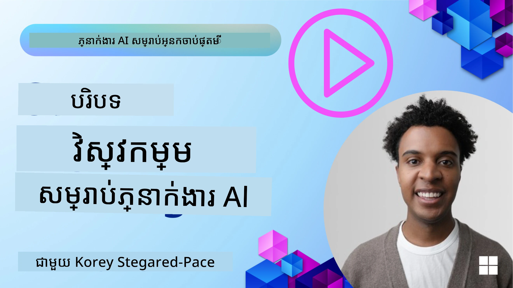
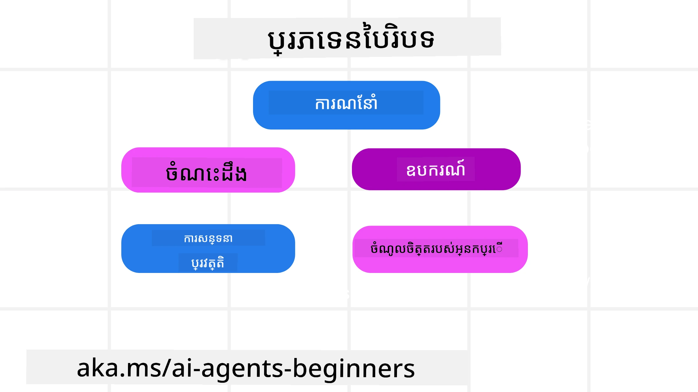
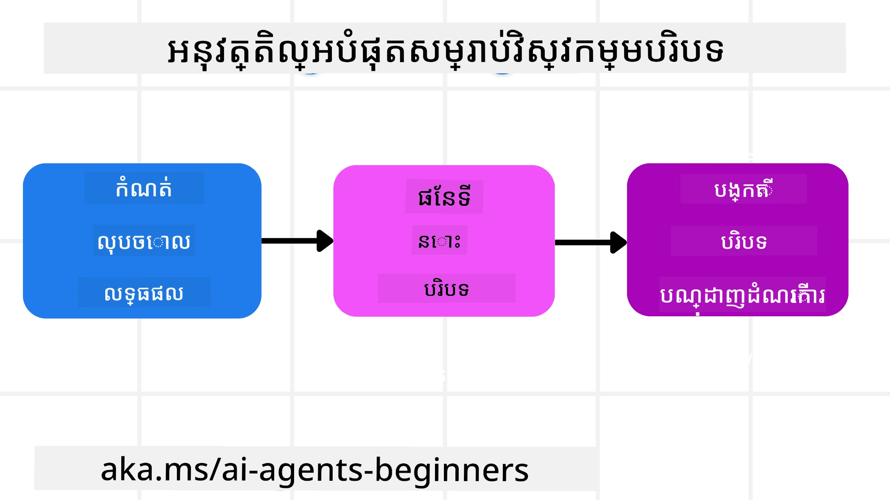

# វិស្វកម្មបរិបទសម្រាប់ភ្នាក់ងារ AI

> _(ចុចរូបភាពខាងលើ ដើម្បីមើលវីដេអូសម្រាប់មេរៀននេះ)_

ការយល់ដឹងពីភាពស្មុគស្មាញនៃកម្មវិធីដែលអ្នកកំពុងសាងសង់សម្រាប់ភ្នាក់ងារ AI មានសារៈសំខាន់ក្នុងការបង្កើតភ្នាក់ងារដែលអាចទុកចិត្តបាន។ យើងត្រូវបង្កើតភ្នាក់ងារ AI ដើម្បីគ្រប់គ្រងព័ត៌មានយ៉ាងមានប្រសិទ្ធភាព ដើម្បីដោះស្រាយតម្រូវការស្មុគស្មាញដែលលើសពីការបញ្ចូល prompt ជាទៀងទាត់។

ក្នុងមេរៀននេះ យើងនឹងពិភាក្សាអំពីអ្វីទៅជាវិស្វកម្មបរិបទ និងតួនាទីរបស់វាក្នុងការសាងសង់ភ្នាក់ងារ AI។

## ការណែនាំ

មេរៀននេះនឹងគ្របដណ្តប់៖

• **អ្វីទៅជាវិស្វកម្មបរិបទ** និងមូលហេតុដែលវាផ្សេងពី prompt engineering។

• **យុទ្ធសាស្ត្រសម្រាប់វិស្វកម្មបរិបទដែលមានប្រសិទ្ធភាព** រួមទាំង របៀបសរសេរ ជ្រើសយក សង្ខេប និងអង្គរក្សព័ត៌មាន។

• **ការបរាជ័យបរិបទទូទៅ** ដែលអាចបំផ្លាញភ្នាក់ងាររបស់អ្នក និងរបៀបកែប្រែបញ្ហាទាំងនេះ។

## គោលបំណងការរៀន

បន្ទាប់ពីបញ្ចប់មេរៀននេះ អ្នកនឹងដឹង និងយល់ដឹងពីរបៀប:

• **កំណត់និយមន័យវិស្វកម្មបរិបទ** និងបំបែកវាពី prompt engineering។

• **សម្គាល់តម្លាភាពសំខាន់ៗនៃបរិបទ** ក្នុងកម្មវិធីប្រើប្រាស់ម៉ូដែលភាសាធំ (LLM)។

• **អនុវត្តយុទ្ធសាស្ត្រសម្រាប់សរសេរ ជ្រើសយក សង្ខេប និងអង្គរក្សបរិបទ** ដើម្បីធ្វើឱ្យប្រសិទ្ធភាពភ្នាក់ងារ កាន់តែប្រសើរ។

• **កាលិតសម្គាល់ការបរាជ័យបរិបទទូទៅ** ដូចជា ការប៉ោយ្ស និងការរអាក់រាក់ (poisoning, distraction, confusion, clash) ហើយអនុវត្តបច្ចេកទេសបន្សាប។

## វេលាអ្វីទៅជាវិស្វកម្មបរិបទ?

សម្រាប់ភ្នាក់ងារ AI, បរិបទគឺជាអ្វីដែលជំរុញការធ្វើប្លង់របស់ភ្នាក់ងារឲ្យចាត់វិធានការ។ វិស្វកម្មបរិបទគឺជាព្រឹត្តិការណ៍ក្នុងការធានាថាភ្នាក់ងារ AI មានព័ត៌មានត្រឹមត្រូវសម្រាប់បញ្ចប់ជំហាន់បន្ទាប់នៃភារកិច្ច។ បញ្អាកម្មប្រហែល(context window) មានទំហំកំណត់ ដូច្នេះជាអ្នកសាងសង់ភ្នាក់ងារ យើងត្រូវបង្កើតប្រព័ន្ធ និងដំណើរការដើម្បីគ្រប់គ្រងការបន្ថែម ការទាញចេញ និងការសង្ខេបព័ត៌មានក្នុងបញ្អាកម្ម។

### Prompt Engineering ទល់នឹង វិស្វកម្មបរិបទ

Prompt engineering ផ្តោតលើសំណុំហត្ថការណ៍ថេរមួយ ដើម្បីណែនាំភ្នាក់ងារ AI ដោយមានសំណុំច្បាប់ជាក់លាក់។ វិស្វកម្មបរិបទគឺជាវិធីក្នុងការគ្រប់គ្រងសំណុំព័ត៌មានរូបមន្តដែលមានលក្ខណៈដណ្ដើម (dynamic) រួមទាំង promptដើម ដើម្បីធានាថាភ្នាក់ងារ AI មានអ្វីដែលខ្លាំងគ្រប់ពេលវេលា។ គំនិតសំខាន់នៃវិស្វកម្មបរិបទគឺធ្វើឱ្យដំណើរការនេះអាចធ្វើឡើងបានម្តងទៀត និងទុកចិត្តបាន។

### ប្រភេទនៃបរិបទ

មានសារៈសំខាន់ក្នុងការចងចាំថាបរិបទមិនមែនជារឿងតែមួយទេ។ ព័ត៌មានដែលភ្នាក់ងារ AI ត្រូវការអាចមកពីប្រភពផ្សេងៗ ហើយវាជាការទទួលខុសត្រូវរបស់យើងក្នុងការធានាថាភ្នាក់ងារអាចចូលដល់ប្រភពទាំងនោះ៖

ប្រភេទបរិបទដែលភ្នាក់ងារ AI ប្រហែលជាត្រូវគ្រប់គ្រងរួមមាន៖

• **សេចក្ដីណែនាំ៖** នេះដូចជា "ច្បាប់" របស់ភ្នាក់ងារ – prompts, system messages, few-shot examples (បង្ហាញម៉ូដែលធ្វើរបស់មួយត្រឹមត្រូវ), និងការពិពណ៌នាអំពីឧបករណ៍ដែលវាអាចប្រើ។ នេះជាកន្លែងដែលការយកចិត្តទុកដាក់ទין prompt engineering ផ្គុំទៅជាមួយវិស្វកម្មបរិបទ។

• **ចំណេះដឹង៖** នេះគ្របដណ្តប់ពីចំណុចពិត ព័ត៌មានដែលទាញចេញពីទិន្នន័យកត់ត្រា ឬអង្គចងចាំដ៏ឆាប់ចាំរបស់ភ្នាក់ងារ។ នេះរួមបញ្ចូលការបញ្ចូលប្រព័ន្ធ Retrieval Augmented Generation (RAG) ប្រសិនបើភ្នាក់ងារត្រូវការចូលដំណើរការទៅឃ្លាំងចំណេះដឹង និងមូលដ្ឋានទិន្នន័យផ្សេងៗ។

• **ឧបករណ៍៖** នេះគឺជាការពិពណ៌នាអំពីមុខងារផ្ទៃខាងក្រៅ, APIs និង MCP Servers ដែលភ្នាក់ងារអាចហៅ និងនឹងទទួលបានមតិយោបល់ (លទ្ធផល) ពីការប្រើប្រាស់ពួកវា។

• **ប្រវត្តិការសន្ទនា៖** ការពិភាក្សានឹងអ្នកប្រើនៅក្នុងរយៈពេលមួយ។ ជាមួយពេលវេលា ការសន្ទនាទាំងនេះកាន់តែវែង និងស្មុគស្មាញ ដែលមានន័យថាវាយកកន្លែងក្នុងបញ្អាកម្ម។

• **ចំណូលចិត្តអ្នកប្រើ៖** ព័ត៌មានដែលបានរៀនអំពីអ្វីដែលអ្នកប្រើចូលចិត្ត ឬមិនចូលចិត្តនៅក្នុងរយៈពេល។ អ្នកអាចរក្សាទុក និងហៅវិញពេលធ្វើចំណាត់កើតសំខាន់ៗដើម្បីជួយអ្នកប្រើ។

## យុទ្ធសាស្ត្រសម្រាប់វិស្វកម្មបរិបទដែលមានប្រសិទ្ធភាព

### យុទ្ធសាស្ត្រធ្វើផែនការ

វិស្វកម្មបរិបទល្អចាប់ផ្តើមដោយការធ្វើផែនការល្អ។ នេះជាវិធីសាស្ត្រមួយដែលនឹងជួយអ្នកចាប់ផ្តើមគិតពីរបៀបអនុវត្តគំនិតវិស្វកម្មបរិបទ៖

1. **កំណត់លទ្ធផលឱ្យច្បាស់** - លទ្ធផលនៃភារកិច្ចដែលភ្នាក់ងារ AI នឹងត្រូវបានលោកហៅគួរត្រូវបានកំណត់យ៉ាងច្បាស់។ បម្លែងសំនួរ - "ពិភពលោកនឹងមានរូបរាងយ៉ាងដូចម្តេច នៅពេលដែលភ្នាក់ងារ AI បញ្ចប់ភារកិច្ចរបស់វា?" ក្នុងព្យុយថា ព័ត៌មាន ឬឆ្លើយតបទាំងអស់ដែលអ្នកប្រើគួរត្រូវបានទទួលក្រោយពេលមានការទំនាក់ទំនងជាមួយភ្នាក់ងារ AI។

2. **ផែនទីបរិបទ** - ពេលដែលអ្នកបានកំណត់លទ្ធផលរួច អ្នកត្រូវដឹងថា "ព័ត៌មានអ្វីដែលភ្នាក់ងារ AI ត្រូវការដើម្បីបញ្ចប់ភារកិច្ចនេះ?" តាមរយៈវិធីនេះ អ្នកអាចចាប់ផ្តើមផែនទីបរិបទថាអ្នកអាចរកព័ត៌មាននោះនៅឯណា។

3. **បង្កើតបំពង់បរិបទ (Context Pipelines)** - ឥឡូវនេះដែលអ្នកដឹងថាព័ត៌មានស្ថិតនៅឯណា អ្នកត្រូវឆ្លើយសំនួរ "តើភ្នាក់ងារនឹងទទូលព័ត៌មាននេះដូចម្តេច?"។ នេះអាចធ្វើបានដោយវិធីជាច្រើន រួមទាំង RAG, ការប្រើប្រាស់ម៉ាស៊ីន MCP និងឧបករណ៍ផ្សេងៗ។

### យុទ្ធសាស្ត្រអនុវត្តន៍

ការធ្វើផែនការសំខាន់ ប៉ុន្តែពេលព័ត៌មានចាប់ផ្តើមហូរចូលទៅក្នុងបញ្អាកម្មនៃភ្នាក់ងារ យើងត្រូវមានយុទ្ធសាស្ត្រអនុវត្តដែលអាចគ្រប់គ្រងវា:

#### ការគ្រប់គ្រងបរិបទ

ខណៈពេលដែលព័ត៌មានខ្លះៗនឹងត្រូវបន្ថែមទៅក្នុងបញ្អាកម្មដោយស្វ័យប្រវត្តិ វិស្វកម្មបរិបទពាក់ព័ន្ធនឹងការទទួលបន្ទុកសកម្មលើព័ត៌មាននេះ ដែលអាចធ្វើបានដោយយុទ្ធសាស្ត្រតិចតួចខាងក្រោម៖

 1. **Agent Scratchpad**
 វា​អនុញ្ញាតឱ្យភ្នាក់ងារ AI បញ្ចូលកំណត់ចំណាំអំពីព័ត៌មានដែលពាក់ព័ន្ធនឹងភារកិច្ចបច្ចុប្បន្ន និងការទំនាក់ទំនងរវាងអ្នកប្រើក្នុងសម័យមួយឯង។ វាគួរត្រូវបានរក្សាផុតពីបញ្អាកម្មនៅក្នុងឯកសារ ឬវត្ថុ runtime ដែលភ្នាក់ងារអាចយកវិញបានក្នុងសម័យនោះ ប្រសិនបើចាំបាច់។

 2. **Memories**
 Scratchpads ល្អសម្រាប់គ្រប់គ្រងព័ត៌មានខាងក្រៅបញ្អាកម្មនៅក្នុងសម័យតែមួយ។ ចងចាំ (Memories) អនុញ្ញាតឱ្យភ្នាក់ងារផ្ទុក និងយកព័ត៌មានដែលពាក់ព័ន្ធឲ្យបានឡើងវិញក្នុងចន្លោះសម័យច្រើន។ នេះអាចរួមបញ្ចូលសេចក្តីសង្ខេប កំណត់ចំណូលចិត្តអ្នកប្រើ និងមតិយោបល់សម្រាប់ការកែលម្អអនាគត។

 3. **ការសង្ខេបបរិបទ**
  ពេលបញ្អាកម្មធំឡើងនិងកំពុងជិតដល់ដែនកំណត់ វិធីសាស្ត្រដូចជាការសង្ខេប និងការកាត់បន្ថយអាចប្រើបាន។ នេះរួមបញ្ចូលការរក្សាទុកត្រឹមតែព័ត៌មានដែលពាក់ព័ន្ធចម្បង ឬការដកសារបញ្ហាចាស់ៗចេញ។

 4. **ប្រព័ន្ធភ្នាក់ងារច្រើន**
  ការវិវឌ្ឍប្រព័ន្ធភ្នាក់ងារច្រើនគឺជារបៀបមួយនៃវិស្វកម្មបរិបទ ព្រោះភ្នាក់ងារ​មួយៗមានបញ្អាកម្មផ្ទាល់ខ្លួនរបស់ខ្លួន។ របៀបដែលបរិបទនោះត្រូវចែកចាយ និងបញ្ជូនទៅភ្នាក់ងារផ្សេងៗ គឺជាចំណុចត្រូវផែនការនៅពេលសាងសង់ប្រព័ន្ធទាំងនេះ។

 5. **បរិដ្ឋាន Sandbox**
  ប្រសិនបើភ្នាក់ងារ​ត្រូវរត់កូដមួយចំនួន ឬដំណើរការព័ត៌មានច្រើនក្នុងឯកសារ នេះអាចប្រើប្រាស់កោងភាគច្រើននៃ token ដើម្បីដំណើរការលទ្ធផល។ ជំនួសការផ្ទុកទាំងអស់នេះក្នុងបញ្អាកម្ម ភ្នាក់ងារអាចប្រើបរិដ្ឋាន sandbox ដែលអាចរត់កូដនេះ ហើយអានតែលទ្ធផល និងព័ត៌មានដែលពាក់ព័ន្ធប៉ុណ្ណោះ។

 6. **Runtime State Objects**
  នេះធ្វើដោយបង្កើតធុងនៃព័ត៌មានដើម្បីគ្រប់គ្រងស្ថានភាពពេលដែលភ្នាក់ងារត្រូវការចូលដល់ព័ត៌មានជាក់លាក់។ សម្រាប់ភារកិច្ចស្មុគស្មាញ នេះនឹងអនុញ្ញាតឱ្យភ្នាក់ងារផ្ទុកលទ្ធផលនៃមុខងាររងនីមួយៗជាកដ្នោង ដើម្បីឲ្យបរិបទនៅតែភ្ជាប់ចំពោះមុខងាររងនិមួយៗនោះប៉ុណ្ណោះ។

### ឧទាហរណ៍នៃវិស្វកម្មបរិបទ

សន្និដ្ឋានថាយើងចង់ឲ្យភ្នាក់ងារ AI **"កក់ដំណើរកម្សាន្តទៅទីក្រុងប៉ារីសសម្រាប់ខ្ញុំ"**

• ភ្នាក់ងារងាយស្រួលមួយប្រើតែ prompt engineering ប្រហែលតែឆ្លើយថា៖ **"បាន ហើយ អ្នកចង់ទៅប៉ារីសនៅពេលណា?"**។ វាប្រមូលតែសំណួរដែលអ្នកបានសួរពេលអ្នកបានសុំ។

• ភ្នាក់ងារដែលប្រើយុទ្ធសាស្ត្រវិស្វកម្មបរិបទដែលបានរៀបរាប់ នឹងធ្វើច្រើនជាងនេះ។ មុនពេលឆ្លើយ វាអាច:

  ◦ **ពិនិត្យប្រតិចិចាលខេឡែនដារ** ដើម្បីស្វែងរកកាលបរិច្ឆេទទំនេរ (ទាញទិន្នន័យពេលវេលាពិតប្រាកដ)។

  ◦ **រំឮកចំណូលចិត្តដំណើរកម្សាន្តពីមុន** (ពីអង្គចងចាំចម្ងាយ) ដូចជាហោះហើរដែលអ្នកចូលចិត្ត ប្រាក់កំណត់​ជញ្ជក់ ឬថាតើអ្នកចូលចិត្តហោះផ្ទាល់ ឬអត់។

  ◦ **សម្គាល់ឧបករណ៍ដែលអាចប្រើ** សម្រាប់កក់សំបុត្រ និងសណ្ឋាគារ។

- បន្ទាប់មក ឧទាហរណ៍នៃចម្លើយអាចជា៖  "Hey [Your Name]! I see you're free the first week of October. Shall I look for direct flights to Paris on [Preferred Airline] within your usual budget of [Budget]?". ចម្លើយដែលមានបរិបទសម្បូរនេះបង្ហាញពីអំណាចនៃវិស្វកម្មបរិបទ។

## ការបរាជ័យបរិបទទូទៅ

### Context Poisoning

**វាជាអ្វី៖** ពេល hallucination (ព័ត៌មានមិនពិតដែលម៉ូដែលភាសាបង្កើត) ឬកំហុសចូលទៅក្នុងបរិបទ ហើយត្រូវបានយោងជាបន្តបន្ទាប់ ធ្វើឲ្យភ្នាក់ងារតាមស្វែងរកគោលដៅដែលមិនអាចសម្រេចបាន ឬបង្កើតយុទ្ធសាស្ត្រមិនមានអត្ថន័យ។

**ត្រូវធ្វើយ៉ាងដូចម្តេច៖** អនុវត្ត **context validation** និង **quarantine**។ ពិនិត្យព័ត៌មានមុននឹងបន្ថែមវាទៅក្នុងអង្គចងចាំរយៈពេលវែង។ ប្រសិនបើមានការសង្ស័យថាមានការប៉ោយ្ស ការចាប់ផ្តើមខ្សែបរិបទថ្មីដើម្បីទប់ស្កាត់ព័ត៌មានខុស។

**ឧទាហរណ៍កក់ដំណើរ:** ភ្នាក់ងាររបស់អ្នកបាន hallucinate ថាមាន **ហោះហើរផ្ទាល់ពីអាកាសយានដ្ឋានស្រុកតូចមួយទៅកាន់ទីក្រុងអន្តរជាតិឆ្ងាយ** ដែលពិតប្រាកដមិនមានសេវាហោះហើរអន្តរជាតិ។ ព័ត៌មានហោះហើរមិនមាននេះត្រូវបានរក្សាទុកក្នុងបរិបទ។ បន្ទាប់មកពេលអ្នកសុំភ្នាក់ងារកក់ វាតែងព្យាយាមស្វែងរកសំបុត្រសម្រាប់ផ្លូវបិទនេះ ដែលនាំឲ្យកំហុសបន្តៗ។

**ដំណោះស្រាយ៖** អនុវត្តជំហាន់មួយដែល **ផ្ទៀងផ្ទាត់ការវត្តមាននិងមន្ត្រីថែមទាំងផ្លូវនៃហោះហើរជាមួយ API ពេលវេលាពិតប្រាកដ** មុននឹងបន្ថែមព័ត៌មានហោះនោះទៅក្នុងបរិបទការងារ។ ប្រសិនបើការផ្ទៀងផ្ទាត់បរាជ័យ ព័ត៌មានខុសនោះត្រូវ "ចាក់ខ្ទប់" ហើយមិនត្រូវបានប្រើបន្ត។

### Context Distraction

**វាជាអ្វី៖** ពេលដែលបរិបទធ្លាក់ធំក្មេងក៏ម៉ូដែលផ្តោតលើប្រវត្តិដែលបង្វិលនោះច្រើនពេក ដោយមិនប្រើអ្វីដែលវាបានរៀននៅពេលហ្វឹកហាត់ នាំឲ្យមានការធ្វើអ្វីម្តងៗ ឬអសមត្ថភាព។ ម៉ូដែលអាចចាប់ផ្តើមធ្វើកំហុស មុនពេលបញ្អាកម្មពេញផុត។

**ត្រូវធ្វើយ៉ាងដូចម្តេច៖** ប្រើ **context summarization**។ ជាប្រចាំសង្ខេបព័ត៌មានដែលបានរក្សារជាអក្សរស្លឹកយ៉ាងខ្លី ដើម្បីរក្សាព័ត៌មានសំខាន់នៅខ្លះ និងដកអត្ថន័យដែលមិនចាំបាច់។ វាជួយ "កាត់បន្ថយ" ការផ្តោត។

**ឧទាហរណ៍កក់ដំណើរ:** អ្នកបានពិភាក្សាពីគោលដៅដំណើរកម្សាន្តជាច្រើនរយៈពេលយូរ រួមទាំងការរំពឹងពណ៌នាដ៏លម្អិតអំពីការធ្វើដំឡើងកញ្ចប់ចល័តពីពីរឆ្នាំកន្លងមក។ ពេលអ្នកក្នុងចុងក្រោយសុំ “**ស្វែងរកសំបុត្រពីរថ្លៃសម្រាប់ខែក្រោយ**” ភ្នាក់ងារ ត្រូវចាក់សំរាមនៅក្នុងព័ត៌មានចាស់ៗ ហើយតែងសួរអំពីឧបករណ៍កាប្លុង ឬផែនកំណត់ដំណើរកម្សាន្តចាស់ៗ ជំនួសការយកចិត្តទុកដាក់លើសំណើបច្ចុប្បន្ន។

**ដំណោះស្រាយ៖** បន្ទាប់ពីចុចចំនួនជើងឬពេលបរិបទធំខ្លាំង ភ្នាក់ងារគួរតែ **សង្ខេបផ្នែកថ្មីៗ និងពាក់ព័ន្ធបំផុតនៃសន្ទនា** – ផ្តោតលើកាលបរិច្ឆេទ និងគោលដៅដំណើរកម្សាន្តបច្ចុប្បន្ន – ហើយប្រើសង្ខេបដែលត្រូវបានសុីចំអិននោះសម្រាប់ការហៅ LLM បន្ទាប់ ដើម្បីបោះបង់ការសន្ទនាដែលមិនពាក់ព័ន្ធ។

### Context Confusion

**វាជាអ្វី៖** ពេលបរិបទដែលមិនចាំបាច់ ជាធម្មតាជាទម្រង់នៃឧបករណ៍ដែលមានច្រើន ពិបាកធ្វើឲ្យម៉ូដែលបង្កើតចម្លើយខូច ឬហៅឧបករណ៍មិនពាក់ព័ន្ធ។ ម៉ូដែលតូចៗមានភរិយាធ្វើខុសខ្លាំងក្នុងករណីនេះ។

**ត្រូវធ្វើយ៉ាងដូចម្តេច៖** អនុវត្ត **ការ​គ្រប់គ្រងចំណុះឧបករណ៍ (tool loadout management)** ដោយប្រើវិធី RAG។ ទុកគណនីពិពណ៌នាឧបករណ៍ក្នុងទិន្នន័យវ៉ិចទ័រ និងជ្រើសយកតែឧបករណ៍ដែលពាក់ព័ន្ធបំផុតសម្រាប់ភារកិច្ចនីមួយៗ។ ការស្រាវជ្រាវបង្ហាញថាដាក់កំណត់ជ្រើសឧបករណ៍ឲ្យតិចជាង 30 នឹងល្អ។

**ឧទាហរណ៍កក់ដំណើរ:** ភ្នាក់ងាររបស់អ្នកមានការចូលដំណើរការទៅឧបករណ៍ជាច្រើនដូចជា `book_flight`, `book_hotel`, `rent_car`, `find_tours`, `currency_converter`, `weather_forecast`, `restaurant_reservations`, ល។ អ្នកសួរ **"តើវិធីល្អបំផុតក្នុងការធ្វើដំណើរជាមួយនៅទីក្រុងប៉ារីសគឺអ្វី?"** ពោលពីចំនួនឧបករណ៍យ៉ាងច្រើន ភ្នាក់ងារ​មានភាពច្របូកច្របល់ ហើយព្យាយាមហៅ `book_flight` ក្នុងលម្អិតនៅក្នុងប៉ារីស ឬ `rent_car` ទោះបីអ្នកចូលចិត្តដឹកជញ្ជូនសាធារណៈ ដោយសារ​ពិពណ៌នាឧបករណ៍អាចជាប់គ្នា ឬវាមិនអាចកំណត់ឧបករណ៍ល្អបំផុតបាន។

**ដំណោះស្រាយ៖** ប្រើ **RAG លើការពិពណ៌នាឧបករណ៍**។ ពេលអ្នកសួរអំពីរបៀបធ្វើដំណើរនៅប៉ារីស ប្រព័ន្ធនឹងទាញយកតែឧបករណ៍ដែលពាក់ព័ន្ធបំផុត ដូចជា `rent_car` ឬ `public_transport_info` ដ្រេកលើសំណួររបស់អ្នក ហើយបង្ហាញ "បញ្ជីឧបករណ៍" មួយដែលផ្ដោតចំណុចទៅ LLM។

### Context Clash

**វាជាអ្វី៖** ពេលមានព័ត៌មានបញ្ឆែកគ្នាក្នុងបរិបទ នាំឲ្យមានការគិតច្របូកច្របល់ ឬចម្លើយចុងក្រោយមិនល្អ។ នេះភាគច្រើនកើតឡើងពេលព័ត៌មានមកដល់ជាសំណាក និងការសន្មត្រចំបងខុសនៅដើមនៅតែស្ថិតនៅក្នុងបរិបទ។

**ត្រូវធ្វើយ៉ាងដូចម្តេច៖** ប្រើ **context pruning** និង **offloading**។ Pruning មានន័យថាលុបព័ត៌មានចាស់ ឬអំពើដែលជំពាក់ជាមួយពេលថ្មីៗ។ Offloading ផ្តល់ឲ្យម៉ូដែលនូវកន្លែងបន្ថែម "scratchpad" ដើម្បីដំណើរការព័ត៌មានដោយមិនធ្វើអោយបរិបទដើមរំខាន។

**ឧទាហរណ៍កក់ដំណើរ:** ជាលក្ខខណ្ឌដើម អ្នកប្រាប់ភ្នាក់ងារ​​ថា **"ខ្ញុំចង់ហោះថ្នាក់អេកូណូមី"**។ បន្ទាប់មកនៅក្នុងសន្ទនាតទៅ អ្នកផ្លាស់ប្តូរចិត្ត និងនិយាយថា **"ពិតជាហើយ សម្រាប់ដំណើរនេះ យើងទៅថ្នាក់អាជីវកម្ម"**។ ប្រសិនបើនូវសេចក្តីណែនាំទាំងពីរ​នៅក្នុងបរិបទ ភ្នាក់ងារអាចទទួលលទ្ធផលស្វែងរកជំហាន០២ដែលស្របគ្នា ឬច្របូកច្របល់អំពីលំដាប់ដែលត្រូវផ្តល់អាទិភាព។

**ដំណោះស្រាយ៖** អនុវត្ត **context pruning**។ បន្ទាប់មានការណែនាំថ្មីដែលធ្វើឲ្យមិនស្របនឹងមួយចាស់ នោះណែនាំចាស់ត្រូវបានលុបឬត្រូវបានលើកលែងដោយច្បាស់នៅក្នុងបរិបទ។ ជាជម្រើសផ្សេង អ្នកភ្នាក់ងារ​អាចប្រើ **scratchpad** ដើម្បីតងករណីចំណូលចិត្តដែលមានការបទព្រហ្ម និងធ្វើសេចក្តីសម្រេចចុងក្រោយ មុនពេលសម្រេច ដើម្បីធានាថាមានតែការណែនាំចុងក្រោយដែលមានសមត្ថភាពណែនាំសកម្មភាពរបស់វា។

## តើអ្នកមានសំណួរបន្ថែមអំពីវិស្វកម្មបរិបទទេ?

ចូលរួមក្នុង [Microsoft Foundry Discord](https://aka.ms/ai-agents/discord) ដើម្បីជួបអ្នករៀនផ្សេងៗ មកចូលរួមម៉ោងការិយាល័យ និងទទួលបានចម្លើយសម្រាប់សំណួរអំពីភ្នាក់ងារ AI របស់អ្នក។

---

<!-- CO-OP TRANSLATOR DISCLAIMER START -->
**ការមិនទទួលខុសត្រូវ**:
ឯកសារនេះត្រូវបានបកប្រែដោយប្រើសេវាកម្មបកប្រែដោយ AI [Co-op Translator](https://github.com/Azure/co-op-translator). ខណៈពេលដែលយើងខិតខំរកភាពត្រឹមត្រូវ សូមចំណាំថាការបកប្រែដោយស្វ័យប្រវត្តិអាចមានកំហុស ឬភាពមិនត្រឹមត្រូវ។ ឯកសារដើមនៅក្នុងភាសាដើមគួរត្រូវបានចាត់ទុកថាជាប្រភពដែលត្រូវទុកចិត្ត។ សម្រាប់ព័ត៌មានដែលសំខាន់ យើងសូមណែនាំឱ្យប្រើការបកប្រែដោយមនុស្សវិជ្ជាជីវៈ។ យើងមិនទទួលខុសត្រូវចំពោះការយល់ច្រឡំ ឬការបកពិឃោះខុសណាមួយដែលកើតឡើងពីការប្រើប្រាស់ការបកប្រែនេះទេ។
<!-- CO-OP TRANSLATOR DISCLAIMER END -->