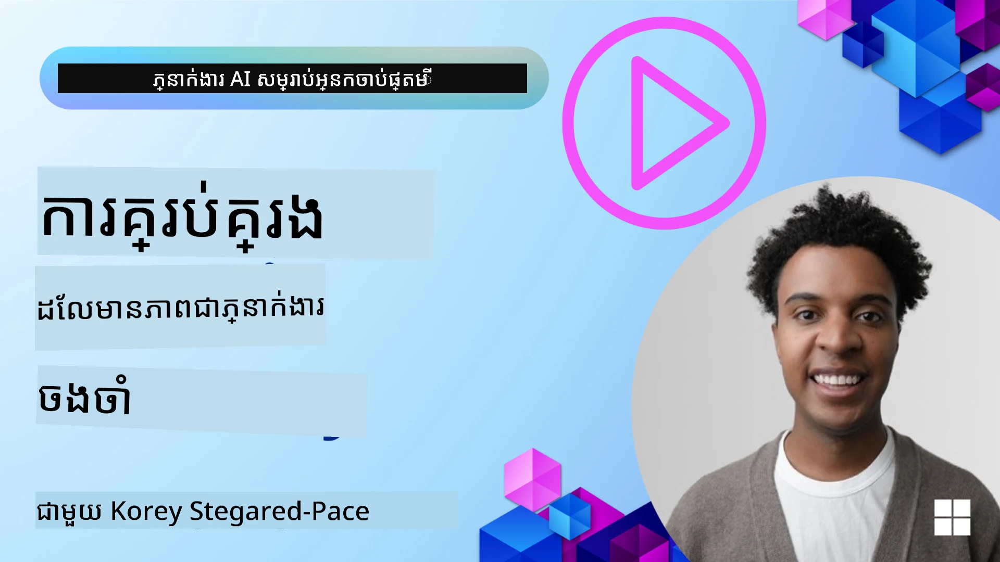

# ចងចាំសម្រាប់ភ្នាក់ងារ AI 

នៅពេលពិភាក្សាអំពីអត្ថប្រយោជន៍ចម្បងនៃការបង្កើតភ្នាក់ងារ AI មានរឿងពីរដែលភាគច្រើនត្រូវបានពិភាក្សា៖ សមត្ថភាពក្នុងការហៅឧបករណ៍ដើម្បីបំពេញភារកិច្ច និងសមត្ថភាពក្នុងការបានប្រសើរឡើងជាមួយពេលវេលា។ ចងចាំគឺជាគ្រឹះសម្រាប់ការបង្កើតភ្នាក់ងារអាចខ្លួនឯងប្រសើរឡើង ដែលអាចបង្កើតបទពិសោធន៍ល្អជាងសម្រាប់អ្នកប្រើរបស់យើង។

នៅក្នុងមេរៀននេះ យើងនឹងមើលថាចងចាំសំរាប់ភ្នាក់ងារ AI គឺជាអ្វី និងតើយើងអាចគ្រប់គ្រងនិងប្រើវាបានយ៉ាងដូចម្តេចសម្រាប់អត្ថប្រយោជន៍នៃកម្មវិធីរបស់យើង។

## ការណែនាំ

មេរៀននេះនឹងគ្របដណ្តប់៖

• **ការយល់ដឹងអំពីចងចាំភ្នាក់ងារ AI**: ចងចាំគឺជាអ្វី ហើយហេតុអ្វីបានជា វាសំខាន់សម្រាប់ភ្នាក់ងារ។

• **ការអនុវត្តន៍ និងការផ្ទុកចងចាំ**: វិធីអនុវត្តន៍ជាក់ស្តែងសម្រាប់បន្ថែមសមត្ថភាពចងចាំទៅភ្នាក់ងារ AI របស់អ្នក ទាក់ទិនទៅនឹងចងចាំរយៈពេលខ្លី និងរយៈពេលវែង។

• **ធ្វើឱ្យភ្នាក់ងារ AI អាចប្រសើរឡើងដោយខ្លួនឯង**: របៀបដែលចងចាំចូលរួមឱ្យភ្នាក់ងាររៀនពីផ្នែកជួបប្រទៈពីមុនហើយប្រសើរឡើងជាមួយពេលវេលា។

## ការអនុវត្តដែលអាចប្រើបាន

មេរៀននេះរួមបញ្ចូលនូវសៀវភៅកំណត់ចំណាំបណ្តាសព្វថ្ងៃពីរ។

• **[13-agent-memory.ipynb](./13-agent-memory.ipynb)**: អនុវត្តចងចាំដោយប្រើ Mem0 និង Azure AI Search ជាមួយ Microsoft Agent Framework

• **[13-agent-memory-cognee.ipynb](./13-agent-memory-cognee.ipynb)**: អនុវត្តចងចាំរចនាសម្ព័ន្ធដោយប្រើ Cognee ដែលស្ថាបនាថ្ងៃទំព័រព័ត៍មានដោយស្វ័យប្រវត្តិដោយមាន embeddings ជាគ្រោង, នាទស្សនាក្រាប, និងយកវិធីសាស្ត្របញ្ចេញយកដោយឆ្លាតខ្លាំង

## គោលបំណងក្នុងការរៀន

បន្ទាប់ពីបញ្ចប់មេរៀននេះ អ្នកនឹងដឹងពីរបៀបក្នុងការធ្វើឲ្យខាងក្រោម៖

• **ចម្លែកចេញពីប្រភេទចងចាំនានារបស់ភ្នាក់ងារ AI**, រួមមានចងចាំកំពុងដំណើរការ, ចងចាំរយៈពេលខ្លី, និងចងចាំរយៈពេលវែង, លើសពីនេះមានទ្រង់ទ្រាយពិសេសដូចជា persona និង episodic memory។

• **អនុវត្តន៍ និងគ្រប់គ្រងចងចាំរយៈពេលខ្លី និងរយៈពេលវែងសម្រាប់ភ្នាក់ងារ AI** ដោយប្រើ Microsoft Agent Framework, ការប្រើ Mem0, Cognee, Whiteboard memory, និងការរួមបញ្ចូលជាមួយ Azure AI Search។

• **យល់ដឹងពីគ្រឹះនៃភ្នាក់ងារ AI អាចប្រសើរឡើងដោយខ្លួនឯង** ហើយថាតើប្រព័ន្ធគ្រប់គ្រងចងចាំរឹងមាំយ៉ាងដូចម្តេចចូលរួមឱ្យមានការរៀន និងការភ្ជាប់ខ្លួនជាបន្ត។

## យល់ដឹងអំពីចងចាំភ្នាក់ងារ AI

នៅក្នុងកម្រិតមូលដ្ឋាន, **ចងចាំសម្រាប់ភ្នាក់ងារ AI និយាយពីយន្តការដែលឱ្យពួកវាអាចរក្សា និងអ៊កចង់យកព័ត៌មានត្រឡប់មកបាន**។ ព័ត៌មាននេះអាចជារឿងលំអិតជាក់លាក់អំពីការពិភាក្សា, ចំណង់ចំណូលចិត្តអ្នកប្រើ, សកម្មភាពពីមុន, ឬសូម្បីតែទម្លាប់ដែលបានរៀន។

បើគ្មានចងចាំ កម្មវិធី AI មួយច្រើនគឺមិនមានស្ថានភាព (stateless) ប្រាប់ថាការប្រាស្រ័យទាំងអស់ត្រូវតែចាប់ផ្តើមពីចំណុចសូន្យ។ វាធ្វើឱ្យបទពិសោធន៍អ្នកប្រើកើនឡើងជាការទុកចិត្តក្រោយនិងនឹកស្រូបពេលភ្នាក់ងារទើប "ភ្លេច" បរិបទឬចំណូលចិត្តពីមុន។

### ហេតុអ្វីបានជា​ចងចាំ​សំខាន់?

ប្រាជ្ញាភ្នាក់ងារមានទំនាក់ទំនងជិតស្និទនឹងសមត្ថភាពរបស់វាដើម្បីយកព័ត៌មានពីមុនមកប្រើ។ ចងចាំឱ្យភ្នាក់ងារអាច:

• **មានការតាមស្មុគស្មាញ**: សិក្សាពីសកម្មភាព និងលទ្ធផលពីមុន។

• **មានអន្តរកម្ម**: រក្សាបរិបទក្នុងការពិភាក្សារបស់កម្មវិធីឱ្យជាប់ជានិច្ច។

• **ទស្សនិកចរិតប្រតិកម្មនិងព្យាករណ៍**: ព្យាករណ៍តម្រូវការ ឬឆ្លើយតបដោយសមរម្យដោយផ្អែកលើទិន្នន័យប្រវត្តិសាស្ត្រ។

• **មានសមត្ថភាពឯករាជ្យ**: ប្រតិបត្តិការជាស្វ័យត្រ by drawing on stored knowledge.

គោលដៅនៃការអនុវត្តចងចាំគឺធ្វើឱ្យភ្នាក់ងារមានភាព **ទុកចិត្តបាន និងមានសមត្ថភាព**។

### ប្រភេទនៃចងចាំ

#### ចងចាំកំពុងដំណើរការ (Working Memory)

សូមគិតវាដូចជាកាសសរសេរមួយដែលភ្នាក់ងារប្រើនៅពេលធ្វើភារកិច្ចឬដំណើរការគិតមួយច្បាស់ក្រោយ។ វាញឹកញាប់ផ្ទុកព័ត៌មានបន្ទាន់ដែលចាំបាច់ដើម្បីគណនាជំហានបន្ទាប់។

សម្រាប់ភ្នាក់ងារ AI, ចងចាំកំពុងដំណើរការចាប់យកព័ត៌មានសំខាន់បំផុតពីការពិភាក្សា បើទោះបីជាប្រវត្តិចលនាតែពេញលេញឬវែងឬត្រូវបានកាត់ក្រឡុកក៏ដោយ។ វាផ្តោតលើការដកស្រង់ធាតុសំខាន់ៗដូចជា ទាមទារ, ការអនុវត្ត, ការសម្រេចចិត្ត និងសកម្មភាព។

**ឧទាហរណ៍ចងចាំកំពុងដំណើរការ**

នៅក្នុងភ្នាក់ងារ​កក់ដំណើរកម្សាន្ត, ចងចាំកំពុងដំណើរការ​អាចចាប់យកការសំណើបច្ចុប្បន្នរបស់អ្នកប្រើ ដូចជា "ខ្ញុំចង់កក់ដំណើរកម្សាន្តទៅទីក្រុង Paris"។ តម្រូវការជាក់លាក់នេះត្រូវបានរក្សាទុកក្នុងបរិបទភ្លាមភ្លៃរបស់ភ្នាក់ងារ ដើម្បីណែនាំការប្រាស្រ័យបច្ចុប្បន្ន។

#### ចងចាំរយៈពេលខ្លី (Short Term Memory)

ប្រភេទចងចាំនេះរក្សាព័ត៌មានក្នុងរយៈពេលនៃការពិភាក្សាឬសម័យមួយ។ វាជាបរិបទនៃការជជែកបច្ចុប្បន្ន ដែលអនុញ្ញាតឱ្យភ្នាក់ងារយោងទៅតាមជំហានមុនៗក្នុងការសន្ទនាដើម្បីជួយការឆ្លើយតប។

**ឧទាហរណ៍ចងចាំរយៈពេលខ្លី**

បើអ្នកប្រើសួរ "បើក​បង​ប៉ុន្មាននៃសំបុត្រធ្វើដំណើរទៅ Paris ត្រូវបង់ប៉ុន្មាន?" ហើយបន្ទាប់មកសួរថា "ហើយអំពីការស្នាក់នៅទីនោះយ៉ាងដូចម្តេច?" ចងចាំរយៈពេលខ្លីធានាថាភ្នាក់ងារយល់ថា "ទីនោះ" កំពុងយោងទៅទីក្រុង "Paris" ក្នុងពេលពិភាក្សាដដែល។

#### ចងចាំរយៈពេលវែង (Long Term Memory)

នេះគឺជាព័ត៌មានដែលនៅរាប់ឆ្នាំឬកន្លងកាលជាងមួយ។ វាអនុញ្ញាតឱ្យភ្នាក់ងារចងចាំចំណូលចិត្តអ្នកប្រើ ប្រវត្តិយុទ្ធសាស្ត្រ ឬចំណេះដឹងទូទៅក្នុងរយៈពេលវែង។ វាសំខាន់សម្រាប់ការផ្ទៀងផ្ទាត់ផ្ទាល់ខ្លួន។

**ឧទាហរណ៍ចងចាំរយៈពេលវែង**

ចងចាំរយៈពេលវែងអាចផ្ទុកថា "Ben ចូលចិត្តហែលទឹកព្រៃនិងសកម្មភាពក្រៅផ្ទះ, ចូលចិត្តកាហ្វេទស្សនារូបភ្នំ, និងចង់ជៀសវាងសហការណ៍តំបន់ស្គីកម្រិតខ្ពស់ដោយសារកាលពីមុនបានរងរបួស"។ ព័ត៌មាននេះ ដែលបានរៀនពីការជជែកពីមុន នឹងមានឥទ្ធិពលលើការផ្ដល់អនុសាសន៍នៅក្នុងសម័យផែនការធ្វើដំណើរពេលអនាគត ដើម្បីឲ្យជាប់ផ្ទាល់ខាន់ទៅនឹងម្ចាស់អ្នកប្រើ។

#### ចងចាំអត្តសញ្ញាណ (Persona Memory)

ប្រភេទចងចាំពិសេសនេះជួយឲ្យភ្នាក់ងារអភិវឌ្ឍ "បុគ្គលិកភាព" ឬ "persona" ដែលមានសភាពជាប់គ្នា។ វាអនុញ្ញាតឲ្យភ្នាក់ងារចងចាំព័ត៌មានអំពីខ្លួនឯង ឬតួនាទីដែលចង់សម្តែង ដើម្បីធ្វើឲ្យអន្តរកម្មរលូននិងផ្តោត។

**ឧទាហរណ៍ចងចាំអត្តសញ្ញាណ**
បើភ្នាក់ងារកក់ដំណើរកម្សាន្តត្រូវបានរចនាឱ្យជា "អ្នកផែនការស្គីជំនាញ", ចងចាំអត្តសញ្ញាណអាចខិតខំរឹតបន្តឹងតួនាទីនេះ ដើម្បីឲ្យចម្លើយរបស់វាសមស្របនឹងសំលេងនិងចំណេះដឹងរបស់ជំនាញនោះ។

#### ចងចាំសកម្មវិធី/អំពឺសូឌិក (Workflow/Episodic Memory)

ចងចាំនេះផ្ទុកលំដាប់ជំហានដែលភ្នាក់ងារធ្វើក្នុងភារកិច្ចស្មុគស្មាញមួយ រួមទាំងភាពជោគជ័យនិងបរាជ័យ។ វាដូចជាការចងចាំ "បញ្ញាតិការជាក់លាក់" ឬបទពិសោធន៍ពីមុនដើម្បីរៀនពីវា។

**ឧទាហរណ៍ចងចាំអំពឺសូឌិក**

បើភ្នាក់ងារបានព្យាយាមកក់សំបុត្រហោះហើរមួយជាក់លាក់ ប៉ុន្តែការប្រកួតបរាជ័យដោយសារការមិនមានស្រាប់, ចងចាំអំពឺសូឌិកអាចកត់ត្រាបរាជ័យនេះ ដើម្បីឲ្យភ្នាក់ងារជួយសាកល្បងជម្រើសផ្សេងៗឬជូនដំណឹងអ្នកប្រើអំពីបញ្ហានៅពេលដែលមានព្យាយាមបន្ទាប់។

#### ចងចាំអត្ថិបត្ថម្ភវត្ថុ (Entity Memory)

នេះពាក់ព័ន្ធនឹងការដកស្រង់និងចងចាំអត្ថិបត្ថម្ភជាក់លាក់ (ដូចជាមនុស្ស ទីកន្លែង ឬវត្ថុ) និងព្រឹត្តិការណ៍ពីការសន្ទនា។ វាអនុញ្ញាតឲ្យភ្នាក់ងារាសង់ការយល់ដឹងរចនាសម្ព័ន្ធនៃធាតុកាន់សំខាន់ដែលបានពិភាក្សា។

**ឧទាហរណ៍ចងចាំអត្ថិបត្ថម្ភ**

ពីការពិភាក្សាអំពីដំណើរកម្សាន្តកាលពីមុន, ភ្នាក់ងារអាចដក "Paris," "ស្នាដៃ Eiffel," និង "ជបទឹកដល់ម្ហូបនៅភោជនីយដ្ឋាន Le Chat Noir" ជាអត្ថិបត្ថម្ភ។ នៅក្នុងការជជែកពេលអនាគត ភ្នាក់ងារអាចចងចាំ "Le Chat Noir" ហើយផ្តល់ជូនការកក់មួយថ្មីនៅទីនោះ។

#### Structured RAG (Retrieval Augmented Generation)

ក្នុងន័យទូទៅ RAG គឺជាវិធីសាស្ត្រធំទូលាយមួយ, "Structured RAG" ត្រូវបានលើកឡើងថាជាបច្ចេកវិទ្យាចងចាំខ្លាំងមួយ។ វាដកស្រង់ព័ត៌មានត្រង់ ផ្ដល់រចនាសម្ព័ន្ធពីប្រភពនានា (ការពិភាក្សា អ៊ីមែល រូបភាព) ហើយប្រើវាដើម្បីបង្កើនភាពត្រឹមត្រូវ ការស្វែងរកត្រឡប់ និងល្បឿនក្នុងការឆ្លើយតប។ ផ្ទុយពី RAG ដើមដែលផ្អែកលើសន្តិសុខភាពសំដៅតែមួយ Structured RAG ធ្វើការជាមួយរចនាសម្ព័ន្ធដែលមានស្រាប់របស់ព័ត៌មាន។

**ឧទាហរណ៍ Structured RAG**

ផ្ទុយពីការគាប់ពាក្យសំខាន់ៗប៉ុណ្ណោះ, Structured RAG អាចផ្ដាច់លម្អិតព័ត៌មានជាពិសេសអំពីសំបុត្រហោះហើរ (ទីដែលទៅ យឺត កាលបរិច្ឆេទ ម៉ោង ក្រុមហ៊ុនហោះហើរ) ពីអ៊ីមែល ហើយផ្ទុកវាទៅក្នុងរចនាសម្ព័ន្ធ។ វាអនុញ្ញាតឱ្យមានការស្វែងរកជាក់លាក់ដូចជា "ខ្ញុំបានកក់សំបុត្រហោះហើរទៅ Paris នៅថ្ងៃអង្គារ?"

## ការអនុវត្តន៍ និងការផ្ទុកចងចាំ

ការអនុវត្តចងចាំសម្រាប់ភ្នាក់ងារ AI ត្រូវការជាដំណើរការប្រព័ន្ធនៃ **ការគ្រប់គ្រងចងចាំ** ដែលរួមមានការបង្កើត ការផ្ទុក ការទាញយក ការរួមបញ្ចូល ការអាប់ដេត និងសូម្បីតែការមិនចាំ (ឬការលុប)ព័ត៌មាន។ ការទាញយកគឺជាផ្នែកសំខាន់យ៉ាងពិសេស។

### ឧបករណ៍ចងចាំពិសេស

#### Mem0

មួយវិធីក្នុងការផ្ទុកនិងគ្រប់គ្រងចងចាំភ្នាក់ងារគឺការប្រើឧបករណ៍ពិសេសដូចជា Mem0។ Mem0 ធ្វើការជាស្រទាប់ចងចាំដ៏រឹងមាំ ដែលអនុញ្ញាតឲ្យភ្នាក់ងារចងចាំអន្តរកម្មដែលពាក់ព័ន្ធ ផ្ទុកចំណូលចិត្តអ្នកប្រើ និងបរិបទទិន្នន័យពិតប្រាកដ និងរៀនពីភាពជោគជ័យនិងបរាជ័យជាមួយពេលវេលា។ គំនិតនៅទីនេះគឺថាភ្នាក់ងារដែលមិនមានស្ថានភាព (stateless) វែនតាធ្វើឲ្យក្លាយជាភ្នាក់ងារមានស្ថានភាព (stateful)។

វាធ្វើការដោយរង្វង់ចងចាំពីរមេរោគៈ ការដកស្រង់ និងការអាប់ដេត។ ជាដំបូង,សារចូលក្នុងតួចលនារបស់ភ្នាក់ងារត្រូវបានផ្ញើទៅសេវាកម្ម Mem0 ដែលប្រើម៉ូឌែលភាសាធំ (Large Language Model (LLM)) ដើម្បីសង្ខេបប្រវត្តិការសន្ទនា និងដកស្រង់ចងចាំថ្មីៗ។ បន្ទាប់មក ជំហានអាប់ដេតដែលដឹកនាំដោយ LLM កំណត់ថាតើត្រូវបន្ថែម ប្លុក ឬលុបចងចាំទាំងនេះ ធ្វើការផ្ទុកក្នុងឃ្លាំងទិន្នន័យចម្រុះដែលអាចរួមមានវ៉ិចទ័រ ក្រាប និង key-value databases។ ប្រព័ន្ធនេះក៏គាំទ្រប្រភេទចងចាំជាច្រើននិងអាចបញ្ចូលចងចាំក្រាបសម្រាប់គ្រប់គ្រងទំនាក់ទំនងរវាងអត្ថិបត្ថម្ភបានផងដែរ។

#### Cognee

មួយវិធីខ្លាំងផ្សេងទៀតគឺការប្រើ **Cognee**, ជាចងចាំហ្សេម៉ង់ពហុ-អភិវឌ្ឍសម្រាប់ភ្នាក់ងារ AI ដែលបំលែងទិន្នន័យដែលមានរចនាសម្ព័ន្ធនិងគ្មានរចនាសម្ព័ន្ធទៅជាក្រាបចំណេះដឹងដែលអាចស្វែងរកបានដោយគាំទ្រដោយ embeddings។ Cognee ផ្តល់នូវ **ស្ថាបត្យកម្មបន្ទុកទ្វេភាគ (dual-store architecture)** រួមបញ្ចូលការស្វែងរកស្រដៀងវ៉ិចទ័រជាមួយទំនាក់ទំនងក្នុងក្រាប ដែលឲ្យភ្នាក់ងារយល់ពីមិនត្រឹមតែព័ត៌មានណាដែលស្រដៀងគ្នា ទេ តែក៏យល់ពីរបៀបដែលគំនិតទាក់ទងគ្នាផងដែរ។

វាទទូចชាន់ខ្លាំងនៅក្នុងការទាញយកចម្រុះដែលលាយឡំសរីរាង្គស្រដៀងវ៉ិចទ័រ រចនាសម្ព័ន្ធក្រាប និងការថ្កោលទោសដោយ LLM — ពីការមើលសំរាប់ចំណែកដើមទៅដល់សំណួរជាមួយអត្ថិភាពក្រាប។ ប្រព័ន្ធរក្សា **ចងចាំរស់** ដែលអភិវឌ្ឍនិងកើនឡើង ខណៈដែលនៅតែអាចស្វែងរកបានជាក្រាបចំណងដៃតែមួយ ត្រូវគាំទ្រទាំងបរិបទសម័យខ្លីនិងចងចាំជាប់ទាប់រយៈពេលវែង។

សៀវភៅកំណត់ចំណាំ Cognee ([13-agent-memory-cognee.ipynb](./13-agent-memory-cognee.ipynb)) បង្ហាញការសាងសង់ស្រទាប់ចងចាំផ្សំព្រិត្តនេះ ជាមួយឧទាហរណ៍ដំណើរការពិតប្រាកដនៃការច្រមើលទិន្នន័យពហុប្រភព, ទស្សនាហ្គ្រាបចំណេះដឹង, និងការស្វែងរកដោយយុទ្ធសាស្រ្តផ្សេងៗសម្រាប់តម្រូវការភ្នាក់ងារពិសេស។

### ការផ្ទុកចងចាំជាមួយ RAG

ក្រៅពីឧបករណ៍ចងចាំពិសេសដូចជា mem0, អ្នកអាចប្រើសេវាស្វែងរករឹងមាំដូចជា **Azure AI Search ជាគ្រឹះសេវាកម្មសម្រាប់ផ្ទុកនិងទាញយកចងចាំ**, ជាពិសេសសម្រាប់ Structured RAG។

នេះអនុញ្ញាតឱ្យអ្នកគ្រប់គ្រងចម្លើយរបស់ភ្នាក់ងារដោយផ្អែកលើទិន្នន័យរបស់អ្នកផ្ទាល់, ដើម្បីធានាការឆ្លើយតបទាន់ពេល និងត្រឹមត្រូវ។ Azure AI Search អាចប្រើសម្រាប់ផ្ទុកចងចាំដំណើរកម្សាន្តជាក់លាក់របស់អ្នកប្រើ, បញ្ជីផលិតផល, ឬចំណេះដឹងឯកសារផ្សេងទៀតក្នុងដែនជាក់លាក់ណាមួយ។

Azure AI Search គាំទ្រមុខងារដូចជា **Structured RAG**, ដែលមានលក្ខណៈឯកទេសក្នុងការដកស្រង់និងទាញយកព័ត៌មានរចនាសម្ព័ន្ធដ៏ដាក់ស្ដុកស្ដម្ភពីឯកសារធំនានា ដូចជាប្រវត្តិការសន្ទនា, អ៊ីមែល, ឬសូម្បីតែរូបភាព។ នេះផ្តល់នូវ "ភាពត្រឹមត្រូវនិងចងចាំលើសមនុស្ស" ប្រសិនបើប្រៀបធៀបទៅនឹងវិធីបែងចែកអត្ថបទនិង embeddings ដ៏ប្រពៃណី។

## ធ្វើឱ្យភ្នាក់ងារ AI អាចប្រសើរឡើងដោយខ្លួនឯង

របៀបពេញនិយមមួយសម្រាប់ភ្នាក់ងារអាចប្រសើរឡើងដោយខ្លួនឯង រួមមានការបញ្ចូល **"ភ្នាក់ងារចំណេះដឹង" (knowledge agent)**។ ភ្នាក់ងារបំបែកនេះសង្កេតការពិភាក្សាចម្បងរវាងអ្នកប្រើនិងភ្នាក់ងារមេ។ តួនាទីរបស់វារួមមាន៖

1. **កំណត់ព័ត៌មានមានតម្លៃ**: កំណត់ថាតើផ្នែកណាមួយនៃការពិភាក្សាគួរត្រូវបានរក្សាទុកជាចំណេះទូទៅឬជាចំណូលចិត្តអ្នកប្រើជាក់លាក់។

2. **ដកស្រង់ និងសង្ខេប**: ពិស្ដារអ្វីដែលជាការរៀនសំខាន់ឬចំណូលចិត្តពីការពិភាក្សា។

3. **ផ្ទុកក្នុងមូលដ្ឋានចំណេះដឹង**: រឹតតែរក្សាព័ត៌មានដែលបានដកស្រង់នេះជាទូទៅ, ជាញឹកញាប់នៅក្នុងមូលដ្ឋានទិន្នន័យវ៉ិចទ័រ, ដូច្នេះវាអាចទាញយកមកជាផ្សេងពេល។

4. **បញ្ចុះបន្ថែមសំណួរពេលអនាគត**: នៅពេលអ្នកប្រើស្នើសុំសំណួរថ្មី ភ្នាក់ងារចំណេះដឹងនឹងទាញយកព័ត៌មានសម្រាប់រក្សារមានពាក់ព័ន្ធ ហើយភ្ជាប់វាទៅក្នុងបាចទេសំណើរបស់អ្នកប្រើ ដើម្បីផ្តល់បរិបទសំខាន់ដល់ភ្នាក់ងារមេ (ស្រដៀងនឹង RAG)។

### ការបង្កើនប្រសិទ្ធភាពសម្រាប់ចងចាំ

• **ការគ្រប់គ្រងល្បឿនយឺត (Latency Management)**: ដើម្បីចៀសវាងការពន្យារពេលក្នុងអន្តរកម្មអ្នកប្រើ, អាចប្រើម៉ូឌែលតម្លៃទាប និងលឿនជាមុន ដើម្បីពិនិត្យយ៉ាងរហ័សថាតើព័ត៌មានមានតម្លៃរក្សាទុកឬទេ មុននឹងហៅដំណើរការដកស្រង់/ទាញយកស្មុគស្មាញជាងនេះ។

• **ការថែទាំមូលដ្ឋានចំណេះដឹង**: សម្រាប់មូលដ្ឋានចំណេះដឹងដែលកំពុងកើនឡើង ព័ត៌មានដែលប្រើប្រាស់កម្រាមអាចត្រូវបានផ្ទេរទៅ "ស្តុកត្រជាក់" (cold storage) ដើម្បីគ្រប់គ្រងថ្លៃដើម។

## មានសំណួរបន្ថែមអំពីចងចាំភ្នាក់ងារ?

ចូលរួមក្នុង [Microsoft Foundry Discord](https://aka.ms/ai-agents/discord) ដើម្បីជួបជាមួយអ្នករៀនផ្សេងទៀត, ចូលរួមម៉ោងការិយាល័យ និងទទួលបានការឆ្លើយសំណួរអំពីភ្នាក់ងារ AI របស់អ្នក។

---

<!-- CO-OP TRANSLATOR DISCLAIMER START -->
**ការមិនទទួលខុសត្រូវ**:
ឯកសារនេះត្រូវបានបកប្រែដោយប្រើសេវាកម្មបកប្រែ AI [Co-op Translator](https://github.com/Azure/co-op-translator). ខណៈពេលយើងខិតខំនៅក្នុងការធានាថាប្រែបានត្រឹមត្រូវ សូមចាប់អារម្មណ៍ថាការបកប្រែដោយស្វ័យប្រវត្តិអាចមានកំហុស ឬភាពមិនត្រឹមត្រូវ។ ឯកសារដើមក្នុងភាសាមូលដ្ឋានគួរត្រូវបានគេចាត់ទុកថាជាប្រភពផ្លូវការ។ សម្រាប់ព័ត៌មានសំខាន់ យើងសូមណែនាំឲ្យប្រើការបកប្រែដោយអ្នកវិជ្ជាជីវៈមនុស្ស។ យើងមិនទទួលខុសត្រូវចំពោះការយល់ច្រឡំ ឬការបកស្រាយខុសណាមួយដែលកើតឡើងពីការប្រើប្រាស់ការបកប្រែនេះ។
<!-- CO-OP TRANSLATOR DISCLAIMER END -->