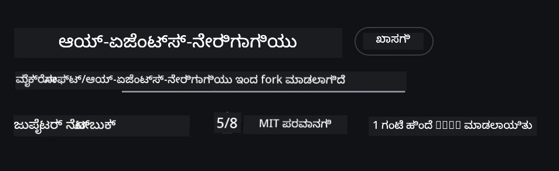
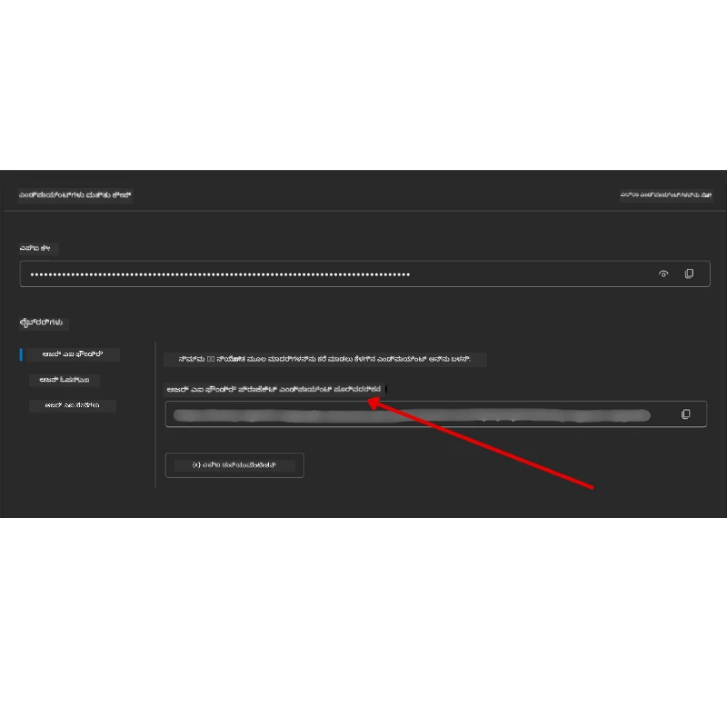

# ಕೋರ್ಸ್ ಸೆಟ್‌ಅಪ್

## ಪರಿಚಯ

ಈ ಪಾಠವು ಈ ಕೋರ್ಸ್‌ನ ಕೊಡ್ ಉದಾಹರಣೆಗಳನ್ನು ಹೇಗೆ ಚಲಾಯಿಸುವುದು ಎಂಬುದನ್ನು ಮುಚ್ಚುತ್ತದೆ.

## ಇತರ ಕಲಿಕರೊಂದಿಗೆ ಸೇರಿ ಸಹಾಯ ಪಡೆದುಕೊಳ್ಳಿ

ನೀವು ನಿಮ್ಮ ರೆಪೋವನ್ನು ಕ್ಲೋನ್ ಮಾಡುವ ಮೊದಲು, ಸೆಟ್‌ಅಪ್ ಬಗ್ಗೆ ಯಾವುದೇ ಸಹಾಯಕ್ಕಾಗಿ, ಕೋರ್ಸ್ ಬಗ್ಗೆ ಯಾವುದೇ ಪ್ರಶ್ನೆಗಳಿಗೆ ಅಥವಾ ಇತರ ಕಲಿಕರೊಂದಿಗೆ ಸಂಪರ್ಕ ಸಾಧಿಸಲು [AI Agents For Beginners Discord ಚಾನೆಲ್](https://aka.ms/ai-agents/discord) ಸೇರಿ.

## ಈ ರೆಪೋವನ್ನು ಕ್ಲೋನ್ ಅಥವಾ ಫೋರ್ಕ್ ಮಾಡಿ

ಪ್ರಾರಂಭಿಸಲು, ದಯವಿಟ್ಟು GitHub ರೆಪೋಜಿಟರಿಯನ್ನು ಕ್ಲೋನ್ ಅಥವಾ ಫೋರ್ಕ್ ಮಾಡಿ. ಇದರಿಂದ ಕೋರ್ಸ್ ವಸ್ತುಗಳ ನಿಮ್ಮ ಸ್ವಂತ ಆವೃತ್ತಿ ಸೃಷ್ಟಿಯಾಗುತ್ತದೆ ಹೀಗಾಗಿ ನೀವು ಕೊಡ್ ಅನ್ನು ಚಲಾಯಿಸಲು, ಪರೀಕ್ಷಿಸಲು ಮತ್ತು ತಿದ್ದುಪಡಿ ಮಾಡಬಹುದು!

ಇದಕ್ಕಾಗಿ <a href="https://github.com/microsoft/ai-agents-for-beginners/fork" target="_blank">ರೆಪೋವನ್ನು ಫೋರ್ಕ್ ಮಾಡಿ</a> ಲಿಂಕ್ ಮೇಲೆ ಕ್ಲಿಕ್ ಮಾಡಿ.

ಈಗ ನೀವು ಈ ಕೋರ್ಸ್‌ನ ನಿಮ್ಮ ಸ್ವಂತ ಫೋರ್ಕ್ ಆವೃತ್ತಿಯನ್ನು ಕೆಳಗಿನ ಲಿಂಕ್‌ನಲ್ಲಿ ಹೊಂದಿರಬೇಕು:



### ಶ್ಯಾಲೋ ಕ್ಲೋನ್ (ಕಾರ್ಯಾಗಾರ / ಕೋಡ್‌ಸ್ಪೇಸ್ಗಳಿಗೆ ಶಿಫಾರಸು ಮಾಡಲಾಗುತ್ತದೆ)

  >ನೀವು ಸಂಪೂರ್ಣ ಇತಿಹಾಸ ಮತ್ತು ಎಲ್ಲಾ ಕಡತಗಳನ್ನು ಡೌನ್‌ಲೋಡ್ ಮಾಡಿದಾಗ ಸಂಪೂರ್ಣ ರೆಪೋಜಿಟರಿ ದೊಡ್ಡದು ಆಗಬಹುದು (~3 GB). ನೀವು ಕಾರ್ಯಾಗಾರದಲ್ಲಿ ಮಾತ್ರ ಭಾಗವಹಿಸುತ್ತಿದ್ದರೆ ಅಥವಾ ಕೆಲವು ಪಾಠದ ಫೋಲ್ಡರ್‌ಗಳೇ ಬೇಕಾದರೆ, ಶ್ಯಾಲೋ ಕ್ಲೋನ್ (ಅಥವಾ ಸ್ಪಾರ್ಸ್ ಕ್ಲೋನ್) ಇತಿಹಾಸವನ್ನು ಕುಗ್ಗಿಸುವುದು ಮತ್ತು/ಅಥವಾ ಬ್ಲಾಬ್‌ಗಳನ್ನು ಅಳವಡಿಸಲು ಮೂಲಕ ಹೆಚ್ಚಿನ ಡೌನ್‌ಲೋಡ್ ತಪ್ಪಿಸುತ್ತದೆ.

#### ತ್ವರಿತ ಶ್ಯಾಲೋ ಕ್ಲೋನ್ — ಕನಿಷ್ಠ ಇತಿಹಾಸ, ಎಲ್ಲಾ ಕಡತಗಳು

ಕೆಳಗಿನ ಆಜ್ಞೆಗಳಲ್ಲಿ `<your-username>` ಅನ್ನು ನಿಮ್ಮ ಫೋರ್ಕ್ URL (ಅಥವಾ ನೀವು ಇಚ್ಛಿಸುವಲ್ಲಿ ಅಪ್‌ಸ್ಟ್ರೀಮ್ URL) ಸಹಿತ ಬದಲಾಯಿಸಿ.

ಕೆವಲ ಇತ್ತೀಚಿನ ಕಮಿಟ್ ಇತಿಹಾಸವನ್ನು ಕ್ಲೋನ್ ಮಾಡಲು (ಸಣ್ಣ ಡೌನ್‌ಲೋಡ್):

```bash|powershell
git clone --depth 1 https://github.com/<your-username>/ai-agents-for-beginners.git
```

ನಿರ್ದಿಷ್ಟ ಶಾಖೆಯನ್ನು ಕ್ಲೋನ್ ಮಾಡಲು:

```bash|powershell
git clone --depth 1 --branch <branch-name> https://github.com/<your-username>/ai-agents-for-beginners.git
```

#### ಭಾಗಶಃ (ಸ್ಪಾರ್ಸ್) ಕ್ಲೋನ್ — ಕನಿಷ್ಠ ಬ್ಲಾಬ್‌ಗಳು + ಆಯ್ಕೆಮಾಡಲಾದ ಫೋಲ್ಡರ್‌ಗಳು ಮಾತ್ರ

ಇದು ಭಾಗಶಃ ಕ್ಲೋನ್ ಮತ್ತು ಸ್ಪಾರ್ಸ್-ಚೆಕ್ಔಟ್ ಬಳಸುತ್ತದೆ (Git 2.25+ ಅಗತ್ಯವಾಗಿದ್ದು ಮತ್ತು ಭಾಗಶಃ ಕ್ಲೋನ್ ಬೆಂಬಲದೊಂದಿಗೆ ಆಧುನಿಕ Git ಶಿಫಾರಸು ಮಾಡಲ್ಪಡುತ್ತಿದೆ):

```bash|powershell
git clone --depth 1 --filter=blob:none --sparse https://github.com/<your-username>/ai-agents-for-beginners.git
```

ರೆಪೋ ಫೋಲ್ಡರ್‌ಗೆ ಪ್ರವೇಶಿಸಿ:

```bash|powershell
cd ai-agents-for-beginners
```

ನಂತರ ನೀವು ಬೇಕಾದ ಫೋಲ್ಡರ್‌ಗಳನ್ನು ಸೂಚಿಸಿ (ಕೆಳಗಿನ ಉದಾಹರಣೆಯಲ್ಲಿ ಎರಡು ಫೋಲ್ಡರ್‌ಗಳಿವೆ):

```bash|powershell
git sparse-checkout set 00-course-setup 01-intro-to-ai-agents
```

ಕ್ಲೋನ್ ಮಾಡಿ ಕಡತಗಳನ್ನು ಪರಿಶೀಲಿಸಿದ ನಂತರ, ನೀವು ಈ ಕಡತಗಳು ಮಾತ್ರ ಬೇಕಾದರೆ ಮತ್ತು ಜಾಗವನ್ನು ಹಂಚಲು ಗಿಟ್ ಇತಿಹಾಸ ಬೇಕಾಗದಿದ್ದರೆ, ದಯವಿಟ್ಟು ರೆಪೋಜಿಟರಿ ಮೆಟಾಡೇಟಾವನ್ನು ಅಳಿಸಿ (💀ಪರಿಹಾರವಿಲ್ಲದದ್ದು — ನೀವು ಎಲ್ಲಾ Git ಕಾರ್ಯಾಚರಣೆಗಳನ್ನು ಕಳೆದುಕೊಳ್ಳುತ್ತೀರಿ: ಕಮಿಟ್‌ಗಳು, ಪಲ್ಲಿಗಳು, ಪುಷ್‌ಗಳು ಅಥವಾ ಇತಿಹಾಸ ಪ್ರವೇಶ).

```bash
# zsh/bash
rm -rf .git
```

```powershell
# ಪವರ್‌ಶೆಲ್
Remove-Item -Recurse -Force .git
```

#### GitHub ಕೋಡ್‌ಸ್ಪೇಸ್ಗಳ ಬಳಕೆ (ಸ್ಥಳೀಯ ದೊಡ್ಡ ಡೌನ್‌ಲೋಡ್ ಅಲ್ಲದೆ ಶಿಫಾರಸು ಮಾಡಲಾಗಿದೆ)

- ಈ ರೆಪೋಗೆ ಹೊಸ ಕೋಡ್‌ಸ್ಪೇಸ್ ಅನ್ನು [GitHub UI](https://github.com/codespaces) ಮೂಲಕ ರಚಿಸಿ.

- ಹೊಸ ಕೋಡ್‌ಸ್ಪೇಸ್‌ನ ಟರ್ಮಿನಲ್‌ನಲ್ಲಿ, ಮೇಲಿನ ಶ್ಯಾಲೋ/ಸ್ಪಾರ್ಸ್ ಕ್ಲೋನ್ ಆಜ್ಞೆಗಳಲ್ಲಿ ಒಂದನ್ನು ಚಲಾಯಿಸಿ ಮತ್ತು ಬೇಕಾದ ಪಾಠ ಫೋಲ್ಡರ್‌ಗಳನ್ನು ಕೋಡ್‌ಸ್ಪೇಸ್ ವರ್ಕ್‌ಸ್ಪೇಸ್‌ಗೆ ತರಾಟೆ ಮಾಡಿ.
- ಐಚ್ಛಿಕ: ಕೋಡ್‌ಸ್ಪೇಸ್‌ಗಳೊಳಗೆ ಕ್ಲೋನ್ ಮಾಡಿದ ನಂತರ, ಹೆಚ್ಚುವರಿ ಜಾಗವನ್ನು ಮುಕ್ತಿ ಮಾಡಲು .git ಅನ್ನು ತೆಗೆದುಹಾಕಬಹುದು (ಮೇಲಿನ ಅಳಿಸುವ ಆಜ್ಞೆಗಳನ್ನು ನೋಡಿ).
- ಗಮನಿಸಿ: ನೀವು ರೆಪೋ ಅನ್ವಯವಾಗಿ ಕೋಡ್‌ಸ್ಪೇಸ್‌ನಲ್ಲಿ ತೆರೆಯಲು ಇಚ್ಛಿಸಿದರೆ (ಹೆಚ್ಚುವರಿ ಕ್ಲೋನ್ ಇಲ್ಲದೆ), ಕೋಡ್‌ಸ್ಪೇಸ್ ಡೆವ್ಕಂಟೈನರ್ ಪರಿಸರವನ್ನು ನಿರ್ಮಿಸುತ್ತದೆ ಮತ್ತು ನೀವು ಬೇಕಾದದ್ದಕ್ಕಿಂತ ಹೆಚ್ಚು ಪ್ರೊವಿಷನ್ ಆಗಬಹುದು. ಹೊಸ ಕೋಡ್‌ಸ್ಪೇಸ್‌ನೊಳಗೆ ಶ್ಯಾಲೋ ಕ್ಲೋನ್ ಮಾಡುವುದರಿಂದ ಡಿಸ್ಕ್ ಬಳಕೆಯ ಮೇಲೆ ಹೆಚ್ಚು ನಿಯಂತ್ರಣ ದೊರೆಯುತ್ತದೆ.

#### ಟಿಪ್ಸ್

- ಭಾಗವಹಿಸಲು/ಕಮಿಟ್ ಮಾಡಲು ನೀವು ಫೋರ್ಕ್ ಬದಲಾವಣೆ ಮಾಡುವಾಗ πάν್‌ಯಾಗಿಯೂ ಕ್ಲೋನ್ URL ಅನ್ನು ನಿಮ್ಮ ಫೋರ್ಕ್ URL ಮೂಲಕ ಬದಲाओ.
- ನಂತರ ಇತಿಹಾಸ ಅಥವಾ ಕಡತಗಳು ಹೆಚ್ಚು ಬೇಕಾದರೆ, ನೀವು ಅವುಗಳನ್ನು ಕರೆದುಕೊಂಡು ಬರುವುದು ಅಥವಾ ಸ್ಪಾರ್ಸ್-ಚೆಕ್ಔಟ್ ಅನ್ನು ಹೆಚ್ಚುವರಿ ಫೋಲ್ಡರ್‌ಗಳನ್ನು ಒಳಗೊಂಡಂತೆ ಸರಿಹೊಂದಿಸಬಹುದು.

## ಕೋಡ್ ಚಾಲನೆ

ಈ ಕೋರ್ಸ್ AI ಏಜಂಟ್ಸ್ ನಿರ್ಮಿಸುವಲ್ಲಿ ಕೈಗಾರಿಕಾ ಅನುಭವ ಪಡೆಯಲು ನಿಮಗೆ ಅನುಕೂಲವಾಗುವ ಸರಣಿ ಜುಪಿಟರ್ ನೋಟ್ಬುಕ್‌ಗಳನ್ನು ಒದಗಿಸುತ್ತದೆ.

ಕೊಡ್ ಉದಾಹರಣೆಗಳು **Microsoft Agent Framework (MAF)** ನ್ನು `AzureAIProjectAgentProvider` ನೊಂದಿಗೆ ಉಪಯೋಗಿಸುತ್ತವೆ, ಅದು **Microsoft Foundry** ಮೂಲಕ **Azure AI Agent Service V2** (Responses API) ಗೆ ಸಂಪರ್ಕ ಹೊಂದಿದೆ.

ಎಲ್ಲಾ ಪೈಥಾನ್ ನೋಟ್ಬುಕ್‌ಗಳು `*-python-agent-framework.ipynb` ಎಂದು ಲೇಬಲ್ ಮಾಡಲಾಗಿದೆ.

## ಅವಶ್ಯಕತೆಗಳು

- Python 3.12+
  - **ಗಮನಿಸಿ**: ನಿಮ್ಮ ಬಳಿ Python3.12 ಸ್ಥಾಪಿಸಲಾಗದಿದ್ದರೆ, ಅದನ್ನು ಸ್ಥಾಪಿಸಿಕೊಳ್ಳಿ. ನಂತರ requirements.txt ಫೈಲ್‌ನಿಂದ ಸರಿಯಾದ ಆವೃತ್ತಿಗಳು ಸರಿಯಾಗಿ ಸ್ಥಾಪಿತವಾಗಲು python3.12 ಬಳಸಿ ನಿಮ್ಮ ವೆನ್ವ್‌ನ್ನು ರಚಿಸಿ.
  
    >ಉದಾಹರಣೆಗೆ

    Python ವೆನ್ವ್ ಡೈರೆಕ್ಟರಿಯನ್ನು ರಚಿಸಿ:

    ```bash|powershell
    python -m venv venv
    ```

    ನಂತರ ಕೆಳಕಂಡಕ್ಕೆ ವೆನ್ವ್ ಪರಿಸರವನ್ನು ಸಕ್ರಿಯಗೊಳಿಸಿರಿ:

    ```bash
    # zsh/bash
    source venv/bin/activate
    ```
  
    ```dos
    # Command Prompt for Windows
    venv\Scripts\activate
    ```

- .NET 10+: .NET ಉಪಯೋಗಿಸುವ ಉದಾಹರಣೆಗಳಿಗೆ, ದಯವಿಟ್ಟು [.NET 10 SDK](https://dotnet.microsoft.com/download/dotnet/10.0) ಅಥವಾ ನಂತರದ ಆವೃತ್ತಿ ಸ್ಥಾಪಿಸಿ. ನಂತರ ನಿಮ್ಮ .NET SDK ಆವೃತ್ತಿ ಪರಿಶೀಲಿಸಿ:

    ```bash|powershell
    dotnet --list-sdks
    ```

- **Azure CLI** — ಖಚಿತೀಕರಿಸಲು ಅಗತ್ಯ. [aka.ms/installazurecli](https://aka.ms/installazurecli) ರಿಂದ ಸ್ಥಾಪಿಸಿ.
- **Azure ಸಬ್ಸ್ಕ್ರಿಪ್ಷನ್** — Microsoft Foundry ಮತ್ತು Azure AI Agent Service ಗೆ ಪ್ರವೇಶಕ್ಕಾಗಿ.
- **Microsoft Foundry ಪ್ರಾಜೆಕ್ಟ್** — ನಿಯೋಜಿಸಲಾದ ಮಾದರಿಯೊಂದಿಗೆ ಪ್ರಾಜೆಕ್ಟ್ (ಉದಾ: `gpt-4o`). ಕೆಳಗಿನ [ಹಂತ 1](#ಹಂತ-1-microsoft-foundry-ಪ್ರಾಜೆಕ್ಟ್-ರಚಿಸಿ) ನೋಡಿ.

ಈ ರೆಪೋಜಿಟರಿಯ ರೂಢಿಯಲ್ಲಿ ಪ್ರಯೋಗಿಸಲು ಅಗತ್ಯವಿರುವ ಎಲ್ಲ ಪೈಥಾನ್ ಪ್ಯಾಕೇಜ್‌ಗಳು `requirements.txt` ನಲ್ಲಿ ಸೇರಿಸಲಾಗಿದೆ.

ನೀವು ರೆಪೋಜಿಟರಿಯ ರೂಢಿಯಲ್ಲಿ ಈ ಕೆಳಗಿನ ಆಜ್ಞೆಯನ್ನು ಟರ್ಮಿನಲ್‌ನಲ್ಲಿ ಚಲಾಯಿಸಿ ಅವುಗಳನ್ನು ಸ್ಥಾಪಿಸಬಹುದು:

```bash|powershell
pip install -r requirements.txt
```

ಯಾವುದೇ ಸಂಘರ್ಷ ಮತ್ತು ಸಮಸ್ಯೆಗಳ ನಿವಾರಣೆಗೆ ಪೈಥಾನ್ ವರ್ಚುವಲ್ ಪರಿಸರವನ್ನು ರಚಿಸಲು ಶಿಫಾರಸು ಮಾಡಲಾಗಿದೆ.

## VSCode ಸೆಟ್‌ಅಪ್

VSCodeನಲ್ಲಿ ಸರಿಯಾದ ಪೈಥಾನ್ ಆವೃತ್ತಿಯನ್ನು ಬಳಸುತ್ತೀರಿ ಎಂಬುದು ಖಚಿತಪಡಿಸಿಕೊಳ್ಳಿ.


## Microsoft Foundry ಮತ್ತು Azure AI Agent Service ಸೆಟ್‌ಅಪ್ ಮಾಡಿಕೊಳ್ಳಿ

### ಹಂತ 1: Microsoft Foundry ಪ್ರಾಜೆಕ್ಟ್ ರಚಿಸಿ

ನೀವು ನೋಟ್ಸುಗಳನ್ನು ಚಲಾಯಿಸಲು ನಿಯೋಜಿಸಲಾದ ಮಾದರಿಯೊಂದಿಗಿನ Azure AI Foundry **ಹಬ್** ಮತ್ತು **ಪ್ರಾಜೆಕ್ಟ್** ಬೇಕಾಗುವುದು.

1. [ai.azure.com](https://ai.azure.com) ಗೆ ಹೋಗಿ ಮತ್ತು ನಿಮ್ಮ Azure ಖಾತೆಯೊಂದಿಗೆ ಸೈನ್ ಇನ್ ಆಗಿ.
2. **ಹಬ್** ರಚಿಸಿ (ಅಥವಾ ಇರುವುದನ್ನು ಉಪಯೋಗಿಸಿ). ನೋಡಿ: [Hub resources overview](https://learn.microsoft.com/azure/ai-foundry/concepts/ai-resources).
3. ಹಬ್‌ನೊಳಗೆ, **ಪ್ರಾಜೆಕ್ಟ್** ರಚಿಸಿ.
4. **Models + Endpoints** → **Deploy model** ನಲ್ಲಿ ಒಂದು ಮಾದರಿಯನ್ನು ನಿಯೋಜಿಸಿ (ಉದಾ: `gpt-4o`).

### ಹಂತ 2: ನಿಮ್ಮ ಪ್ರಾಜೆಕ್ಟ್ ಎಂಡ್ಪಾಯಿಂಟ್ ಮತ್ತು ಮಾದರಿ ನಿಯೋಜನೆ ಹೆಸರನ್ನು ಪಡೆಯಿರಿ

Microsoft Foundry ಪೋರ್ಟಲ್‌ನಲ್ಲಿರುವ ನಿಮ್ಮ ಪ್ರಾಜೆಕ್ಟ್‌ನಿಂದ:

- **ಪ್ರಾಜೆಕ್ಟ್ ಎಂಡ್ಪಾಯಿಂಟ್** — **Overview** ಪುಟಕ್ಕೆ ಹೋಗಿ ಮತ್ತು ಎಂಡ್ಪಾಯಿಂಟ್ URL ನಕಲಿಸಿ.



- **ಮಾದರಿ ನಿಯೋಜನೆ ಹೆಸರು** — **Models + Endpoints** ಗೆ ಹೋಗಿ, ನಿಮ್ಮ ನಿಯೋಜಿಸಲಾದ ಮಾದರಿಯನ್ನು ಆರಿಸಿ ಮತ್ತು **Deployment name** (ಉದಾ: `gpt-4o`) ಗಮನಿಸಿ.

### ಹಂತ 3: `az login` ಬಳಸಿ Azureಗೆ ಸೈನ್ ಇನ್ ಆಗಿ

ಎಲ್ಲಾ ನೋಟ್ಬುಕ್‌ಗಳು ಖಚಿತೀಕರಿಸಲು **`AzureCliCredential`** ಬಳಸುತ್ತವೆ — ಆಪಿಐ ಕೀಸ್ ಇವುದಿಲ್ಲ. ಇದಕ್ಕಾಗಿ ನೀವು Azure CLI ಮೂಲಕ ಸೈನ್ ಇನ್ ಆಗಿರಬೇಕಾಗಿದೆ.

1. **Azure CLI ಅನ್ನು ಸ್ಥಾಪಿಸಿ** (ನೀವು ಇನ್‌ಸ್ಟಾಲ್ ಮಾಡದಿದ್ದರೆ): [aka.ms/installazurecli](https://aka.ms/installazurecli)

2. ಸೈನ್ ಇನ್ ಮಾಡಲು ಈ ಆಜ್ಞೆಯನ್ನು ಚಲಾಯಿಸಿ:

    ```bash|powershell
    az login
    ```

    ಅಥವಾ ನೀವು ಬ್ರೌಸರ್ ಇಲ್ಲದ ರಿಮೋಟ್/ಕೋಡ್ಸ್ಪೇಸ್ ಪರಿಸರದಲ್ಲಿದ್ದರೆ:

    ```bash|powershell
    az login --use-device-code
    ```

3. ಪ್ರಾಂಪ್ಟ್ ಬರುವಲ್ಲಿ ನಿಮ್ಮ ಸಬ್ಸ್ಕ್ರಿಪ್ಷನ್ ಆಯ್ಕೆಮಾಡಿ — ಅದು ನಿಮ್ಮ Foundry ಪ್ರಾಜೆಕ್ಟ್ ಇರುವದಾಗಿರಬೇಕು.

4. ನೀವು ಸೈನ್ ಇನ್ ಆಗಿದ್ದೀರಾ ಎಂದು ಪರಿಶೀಲಿಸಿ:

    ```bash|powershell
    az account show
    ```

> **`az login` ಬೇಕಾದುದೇನು?** ನೋಟ್ಸುಗಳು `azure-identity` ಪ್ಯಾಕೇಜಿನ `AzureCliCredential` ಬಳಸಿ ಗುರುತಿಸುತ್ತದೆ. ಇದರರ್ಥ ನಿಮ್ಮ Azure CLI ಸೆಷನ್ ಕ್ರೆಡೆನ್ಶಿಯಲ್ಗಳನ್ನು ಒದಗಿಸುತ್ತದೆ — ನಿಮ್ಮ `.env` ಫೈಲ್‌ನಲ್ಲಿ ಯಾವುದೇ API ಕೀಗಳು ಅಥವಾ ರಹಸ್ಯವಿಲ್ಲ. ಇದು [ಭದ್ರತಾ ಉತ್ತಮ ಅಭ್ಯಾಸ](https://learn.microsoft.com/azure/developer/ai/keyless-connections) ಆಗಿದೆ.

### ಹಂತ 4: ನಿಮ್ಮ `.env` ಫೈಲ್ ರಚಿಸಿ

ಉದಾಹರಣೆ ಫೈಲನ್ನು ನಕಲಿಸಿ:

```bash
# zsh/bash
cp .env.example .env
```

```powershell
# ಪವರ್‌ಶೆಲ್
Copy-Item .env.example .env
```

`.env` ಅನ್ನು ತೆರೆದು ಈ ಎರಡು ಮೌಲ್ಯಗಳನ್ನು ಭರ್ತಿ ಮಾಡಿ:

```env
AZURE_AI_PROJECT_ENDPOINT=https://<your-project>.services.ai.azure.com/api/projects/<your-project-id>
AZURE_AI_MODEL_DEPLOYMENT_NAME=gpt-4o
```

| ಮರುಬದಲಿ | ಅನ್ನು ಪಡೆಯುವ ಸ್ಥಳ |
|----------|-----------------|
| `AZURE_AI_PROJECT_ENDPOINT` | Foundry ಪೋರ್ಟಲ್ → ನಿಮ್ಮ ಪ್ರಾಜೆಕ್ಟ್ → **Overview** ಪುಟ |
| `AZURE_AI_MODEL_DEPLOYMENT_NAME` | Foundry ಪೋರ್ಟಲ್ → **Models + Endpoints** → ನಿಮ್ಮ ನಿಯೋಜಿಸಿದ ಮಾದರಿಯ ಹೆಸರು |

ಬಹುತೆಕ ಪಾಠಗಳಿಗಾಗಿ ಆಗಿದ್ದು ಇದೆ! ನೋಟ್ಬುಕ್‌ಗಳು ಸ್ವಯಂಚಾಲಿತವಾಗಿ ನಿಮ್ಮ `az login` ಸೆಷನ್ ಮೂಲಕ ದೃಢೀಕರಣ ಮಾಡಿಕೊಳ್ಳುತ್ತವೆ.

### ಹಂತ 5: ಪೈಥಾನ್ ಅವಲಂಬನೆಗಳನ್ನು ಸ್ಥಾಪಿಸಿ

```bash|powershell
pip install -r requirements.txt
```

ನೀವು ಮುಂಚೆ ರಚಿಸಿದ ವರ್ಚುವಲ್ ಪರಿಸರದೊಳಗೆ ಇದನ್ನು ಚಲಾಯಿಸಲು ಶಿಫಾರಸು ಮಾಡಲಾಗುತ್ತದೆ.

## ಪಾಠ 5 (Agentic RAG)ಿಗಾಗಿ ಹೆಚ್ಚುವರಿ ಸೆಟ್‌ಅಪ್

ಪಾಠ 5 ರಿಗಾಗಿ **Azure AI Search** ಅನ್ನು ರಿಟ್ರೀವಲ್-ಆಗ್ಮೆಂಟೆಡ್ ಜನರೇಶನ್‌ಗೆ ಉಪಯೋಗಿಸಲಾಗುತ್ತದೆ. ಆ ಪಾಠವನ್ನು ಚಲಾಯಿಸಲು, ಈ ವ್ಯಾರೀಯಬಲ್‌ಗಳನ್ನು ನಿಮ್ಮ `.env` ಫೈಲ್‌ಗೆ ಸೇರಿಸಿ:

| ಮರುಬದಲಿ | ಅನ್ನು ಪಡೆಯುವ ಸ್ಥಳ |
|----------|-----------------|
| `AZURE_SEARCH_SERVICE_ENDPOINT` | Azure ಪೋರ್ಟಲ್ → ನಿಮ್ಮ **Azure AI Search** ಸಂಪನ್ಮೂಲ → **Overview** → URL |
| `AZURE_SEARCH_API_KEY` | Azure ಪೋರ್ಟಲ್ → ನಿಮ್ಮ **Azure AI Search** ಸಂಪನ್ಮೂಲ → **Settings** → **Keys** → ಪ್ರಾಥಮಿಕ ಆಡಳಿತ ಕೀ |

## ಪಾಠ 6 ಮತ್ತು ಪಾಠ 8 (GitHub ಮಾದರಿಗಳು)ಗಾಗಿ ಹೆಚ್ಚುವರಿ ಸೆಟ್‌ಅಪ್

ಪಾಠ 6 ಮತ್ತು 8 ರ ಕೆಲ ನೋಟ್ಬುಕ್‌ಗಳು Azure AI Foundry ಬದಲು **GitHub ಮಾದರಿಗಳನ್ನು** ಉಪಯೋಗಿಸುತ್ತವೆ. ಆ ಉದಾಹರಣೆಗಳನ್ನು ಚಲಾಯಿಸಲು:

| ಮರುಬದಲಿ | ಅನ್ನು ಪಡೆಯುವ ಸ್ಥಳ |
|----------|-----------------|
| `GITHUB_TOKEN` | GitHub → **Settings** → **Developer settings** → **Personal access tokens** |
| `GITHUB_ENDPOINT` | `https://models.inference.ai.azure.com` (ಡೀಫಾಲ್ಟ್ ಮೌಲ್ಯ) ಉಪಯೋಗಿಸಿ |
| `GITHUB_MODEL_ID` | ಬಳಸಬೇಕಾದ ಮಾದರಿ ಹೆಸರು (ಉದಾ: `gpt-4o-mini`) |

## ಪರ್ಯಾಯ ಪ್ರೊವೈಡರ್: MiniMax (OpenAI-ಸಂಗತಿಹೊಂದಿದ)

[MiniMax](https://platform.minimaxi.com/) ದೊಡ್ಡ ಸಂಧರ್ಭ ಮಾದರಿಗಳನ್ನು (204K ಟೋಕನ್‌ಗಳವರೆಗೆ) OpenAI-ಸಂಗತಿಹೊಂದಿದ API ಮೂಲಕ ಒದಗಿಸುತ್ತದೆ. Microsoft Agent Frameworkನ `OpenAIChatClient` OpenAI-ಸಂಗತಿಹೊಂದಿದ ಯಾವುದೇ ಎಂಡ್ಪಾಯಿಂಟ್ ನೊಂದಿಗೆ ಕೆಲಸ ಮಾಡುತ್ತದೆ, ಆದ್ದರಿಂದ MiniMax ಅನ್ನು GitHub ಮಾದರಿಗಳು ಅಥವಾ OpenAIಗೆ ಬದಲಾವಣೆಯಾಗಿ ಉಪಯೋಗಿಸಬಹುದು.

ಈ ವ್ಯಾರೀಯಬಲ್ಗಳನ್ನು ನಿಮ್ಮ `.env` ಫೈಲ್‌ಗೆ ಸೇರಿಸಿ:

| ಮರುಬದಲಿ | ಅನ್ನು ಪಡೆಯುವ ಸ್ಥಳ |
|----------|-----------------|
| `MINIMAX_API_KEY` | [MiniMax Platform](https://platform.minimaxi.com/) → API ಕೀಸ್ |
| `MINIMAX_BASE_URL` | `https://api.minimax.io/v1` (ಡೀಫಾಲ್ಟ್ ಮೌಲ್ಯ) ಉಪಯೋಗಿಸಿ |
| `MINIMAX_MODEL_ID` | ಬಳಸಬೇಕಾದ ಮಾದರಿ ಹೆಸರು (ಉದಾ: `MiniMax-M2.7`) |

**ಲಭ್ಯವಿರುವ ಮಾದರಿಗಳು**: `MiniMax-M2.7` (ಶಿಫಾರಸು ಮಾಡಲಾದದು), `MiniMax-M2.7-highspeed` (ವೇಗವಾಗಿ ಪ್ರತಿಕ್ರಿಯಿಸುವದು)

`OpenAIChatClient` ಬಳಸುವ ಕೋಡ್ ಉದಾಹರಣೆಗಳು (ಉದಾ: ಪಾಠ 14 ಹೋಟೆಲ್ ಬುಕ್ಕಿಂಗ್ ವರ್ಕ್‌ಫ್ಲೋ) ಸ್ವಯಂಚಾಲಿತವಾಗಿ ನಿಮ್ಮ MiniMax ಸಂರಚನೆಯನ್ನು ಪತ್ತೆಮಾಡಿ ಉಪಯೋಗಿಸುತ್ತವೆ, ನೀವು `MINIMAX_API_KEY` ಅನ್ನು ಸೆಟ್ ಮಾಡಿದಾಗ.

## ಪಾಠ 8 (Bing ಗ್ರೌಂಡಿಂಗ್ ವರ್ಕ್‌ಫ್ಲೋ)ಗಾಗಿ ಹೆಚ್ಚುವರಿ ಸೆಟ್‌ಅಪ್

ಪಾಠ 8 ರ ಷರತ್ತಿನ ವರ್ಕ್‌ಫ್ಲೋ ನೋಟ್ಬುಕ್ **Bing ಗ್ರೌಂಡಿಂಗ್** ಅನ್ನು Azure AI Foundry ಮೂಲಕ ಉಪಯೋಗಿಸುತ್ತದೆ. ಆ ಉದಾಹರಣೆ ಚಲಾಯಿಸಲು ಈ ವ್ಯಾರೀಯಬಲನ್ನು ನಿಮ್ಮ `.env` ಫೈಲ್‌ಗೆ ಸೇರಿಸಿ:

| ಮರುಬದಲಿ | ಅನ್ನು ಪಡೆಯುವ ಸ್ಥಳ |
|----------|-----------------|
| `BING_CONNECTION_ID` | Azure AI Foundry ಪೋರ್ಟಲ್ → ನಿಮ್ಮ ಪ್ರಾಜೆಕ್ಟ್ → **Management** → **Connected resources** → ನಿಮ್ಮ Bing ಸಂಪರ್ಕ → ಸಂಪರ್ಕ ID ನಕಲಿಸಿ |

## ಸಮಸ್ಯೆ ಪರಿಹಾರ

### macOS ನಲ್ಲಿ SSL ಪ್ರಮಾಣಪತ್ರ ಪರಿಶೀಲನಾ ದೋಷಗಳು

ನೀವು macOS ನಲ್ಲಿ ಇದ್ದಾಗ ಕೆಳಗಿನ ರೀತಿಯ ದೋಷ ಬರುತ್ತಿದ್ದರೆ:

```plaintext
ssl.SSLCertVerificationError: [SSL: CERTIFICATE_VERIFY_FAILED] certificate verify failed: self-signed certificate in certificate chain
```

ಇದು macOS ಮೇಲೆ Python ಪ್ರಸ್ತುತಗೊಳಿಸುವ ಒಂದು ಪತ್ತೆಯಾದ ಸಮಸ್ಯೆ, ಇಲ್ಲಿ ಸಿಸ್ಟಮ್ SSL ಪ್ರಮಾಣಪತ್ರಗಳು ಸ್ವಯಂಚಾಲಿತವಾಗಿ ನಂಬಿಕೆಯಲ್ಲ. ಕೆಳಗಿನ ಪರಿಹಾರಗಳನ್ನು ಕ್ರಮವಾಗಿ ಪ್ರಯತ್ನಿಸಿ:

**ಆಯ್ಕೆ 1: Python ನ Install Certificates ಸ್ಕ್ರಿಪ್ಟ್ ಅನ್ನು ಚಾಲನೆ ಮಾಡಿ (ಶಿಫಾರಸು ಮಾಡಲ್ಪಟ್ಟದ್ದು)**

```bash
# ನಿಮ್ಮ ಸ್ಥಾಪಿಸಿದ ಪೈಥಾನ್ ಆವೃತ್ತಿಯೊಂದಿಗೆ 3.XX ಬದಲಾಯಿಸಿ (ಉದಾಹರಣೆಗೆ, 3.12 ಅಥವಾ 3.13):
/Applications/Python\ 3.XX/Install\ Certificates.command
```

**ಆಯ್ಕೆ 2: ನಿಮ್ಮ ನೋಟ್ಬುಕ್‌ನಲ್ಲಿ `connection_verify=False` ಉಪಯೋಗಿಸಿ (GitHub ಮಾದರಿಗಳ ನೋಟ್ಬುಕ್‌ಗಳಿಗೆ ಮಾತ್ರ)**

ಪಾಠ 6ನ ನೋಟ್ಬುಕ್ (`06-building-trustworthy-agents/code_samples/06-system-message-framework.ipynb`) ನಲ್ಲಿರುವ ಕಾಮೆಂಟ್ ಮಾಡಲಾದ ಸಮಾಧಾನಕಾರಿಯಾದ ಮಾರ್ಗವನು ಈಗಾಗಲೇ ಸೇರಿಸಲಾಗಿದೆ. ಕ್ಲೈಯಂಟ್ ಸೃಷ್ಟಿಯ ಸಮಯದಲ್ಲಿ `connection_verify=False` ಅನಕಮೆಂಟ್ ಮಾಡಿ:

```python
client = ChatCompletionsClient(
    endpoint=endpoint,
    credential=AzureKeyCredential(token),
    connection_verify=False,  # ಪ್ರಮಾಣಪತ್ರದ ದೋಷಗಳನ್ನು ಎದುರಿಸಿದರೆ SSL ಪರಿಶೀಲನೆಯನ್ನು ನಿಷ್ಕ್ರಿಯಗೊಳಿಸಿ
)
```

> **⚠️ ಎಚ್ಚರಿಕೆ:** SSL ಪರಿಶೀಲನೆ ನಿಷ್ಕ್ರಿಯಗೊಳಿಸುವುದು (`connection_verify=False`) ಪ್ರಮಾಣಪತ್ರ ದೃಢೀಕರಣವನ್ನು ಮೀರಿಸಿ ಭದ್ರತೆಯನ್ನು ಕಡಿಮೆಯಾಗಿಸುತ್ತದೆ. ಅದನ್ನು ಅಭಿವೃದ್ಧಿ ಪರಿಸರಗಳಲ್ಲಿ ತಾತ್ಕಾಲಿಕ ಕಳೆಯಾಗಿ ಮಾತ್ರ ಉಪಯೋಗಿಸಿ, ಉತ್ಪಾದನಾ ಪರಿಸರಗಳಲ್ಲಿ ಬಳಸಬೇಡಿ.

**ಆಯ್ಕೆ 3: `truststore` ಅನ್ನು ಸ್ಥಾಪಿಸಿ ಮತ್ತು ಬಳಸಿಕೊಳ್ಳಿ**

```bash
pip install truststore
```

ನಂತರ ಯಾವುದೇ ನೆಟ್‌ವರ್ಕ್ ಕರೆಯುವ ಮೊದಲು ನಿಮ್ಮ ನೋಟ್ಬುಕ್ ಅಥವಾ ಸ್ಕ್ರಿಪ್ಟ್ ನಾಲಿಗೆಯಲ್ಲಿಗೂ ಕೆಳಗಿನವನ್ನು ಸೇರಿಸಿ:

```python
import truststore
truststore.inject_into_ssl()
```

## ಸಂಕುಳಿ ಸುಮ್ಮನಾಗಿದ್ದೀರಾ?

ಈ ಸೆಟ್‌ಅಪ್ ಅನ್ನು ಚಾಲನೆ ಮಾಡಲು ಯಾವುದೇ ಸಮಸ್ಯೆಗಳಿದ್ದರೆ, ನಮ್ಮ <a href="https://discord.gg/kzRShWzttr" target="_blank">Azure AI Community Discord</a> ಗೆ ಸರಿ ಹೊಡೆದಿರಿ ಅಥವಾ <a href="https://github.com/microsoft/ai-agents-for-beginners/issues?WT.mc_id=academic-105485-koreyst" target="_blank">ಇಶ್ಯೂ ಸೃಷ್ಟಿ ಮಾಡಿ</a>.

## ಮುಂದಿನ ಪಾಠ

ನೀವು ಈಗ ಈ ಕೋರ್ಸ್‌ನ ಕೊಡ್ ಚಾಲನೆ ಮಾಡಲು ಸಿದ್ಧರಾಗಿದ್ದೀರಿ. AI ಏಜಂಟ್ಸ್ ಲೋಕವನ್ನು ಇನ್ನಷ್ಟು ಕಲಿಯಿರಿ, ಶುಭವಾಗಲಿ!

[AI ಏಜಂಟ್ಸ್ ಪರಿಚಯ ಮತ್ತು ಏಜಂಟ್ ಬಳಕೆ ಪ್ರಕರಣಗಳು](../01-intro-to-ai-agents/README.md)

---

<!-- CO-OP TRANSLATOR DISCLAIMER START -->
**ಅಸ್ವೀಕರಣ**:  
ಈ ದಾಖಲೆ [Co-op Translator](https://github.com/Azure/co-op-translator) ಎಂಬ AI ಭಾಷಾಂತರ ಸೇವೆಯನ್ನು ಬಳಸಿಕೊಂಡು ಅನುವಾದಿಸಲಾಗಿದೆ. ನಾವು ಶುದ್ಧತೆಯನ್ನು ಕಾಪಾಡಲು ಪ್ರಯತ್ನಿಸುವಾಗ, ಸ್ವಯಂಚಾಲಿತ ಭಾಷಾಂತರಗಳಲ್ಲಿ ತಪ್ಪುಗಳು ಅಥವಾ ಅಸತ್ಯತೆಗಳಿರಬಹುದು ಎಂದು ದಯವಿಟ್ಟು ಗಮನಿಸಿ. ಮೂಲ ಭಾಷೆಯಲ್ಲಿನ ಮೂಲ ದಾಖಲೆ ಪ್ರಾಧಿಕಾರಿಕ ಮೂಲವಾಗಿದೆ ಎಂದು ಪರಿಗಣಿಸಬೇಕು. ಮಹತ್ವದ ಮಾಹಿತಿಗಾಗಿ ವೃತ್ತಿಪರ ಮಾನವ ಭಾಷಾಂತರವನ್ನು ಶಿಫಾರಸು ಮಾಡಲಾಗುತ್ತದೆ. ಈ ಭಾಷಾಂತರ ಬಳಕೆಯಿಂದ ಉಂಟಾಗುವ ಯಾವುದೆ誤ರ್ಥನೆಗಳು ಅಥವಾ ದುರಹಂಕಾರಗಳಿಗೆ ನಾವು ಹೊಣೆಗಾರರು ಅಲ್ಲ.
<!-- CO-OP TRANSLATOR DISCLAIMER END -->