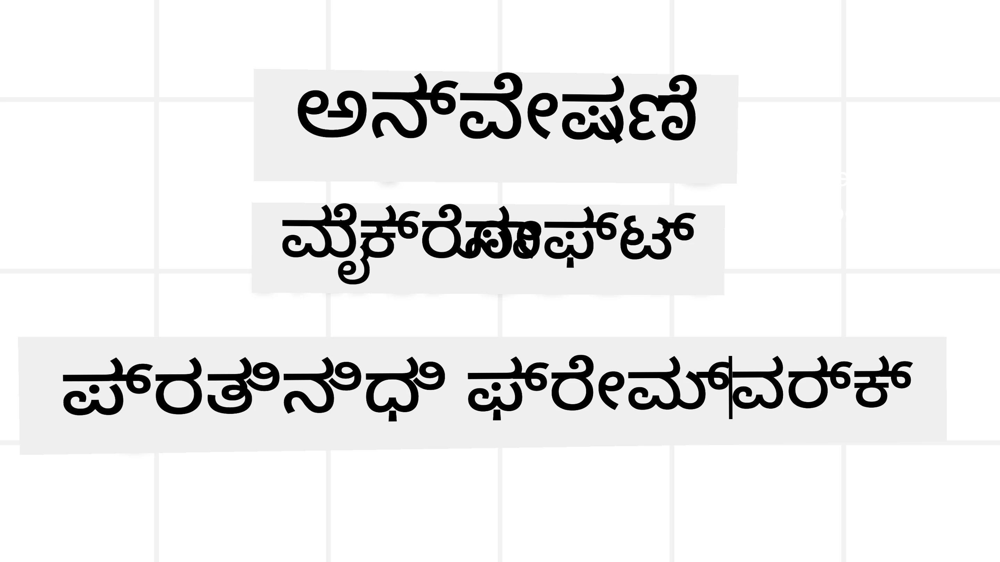
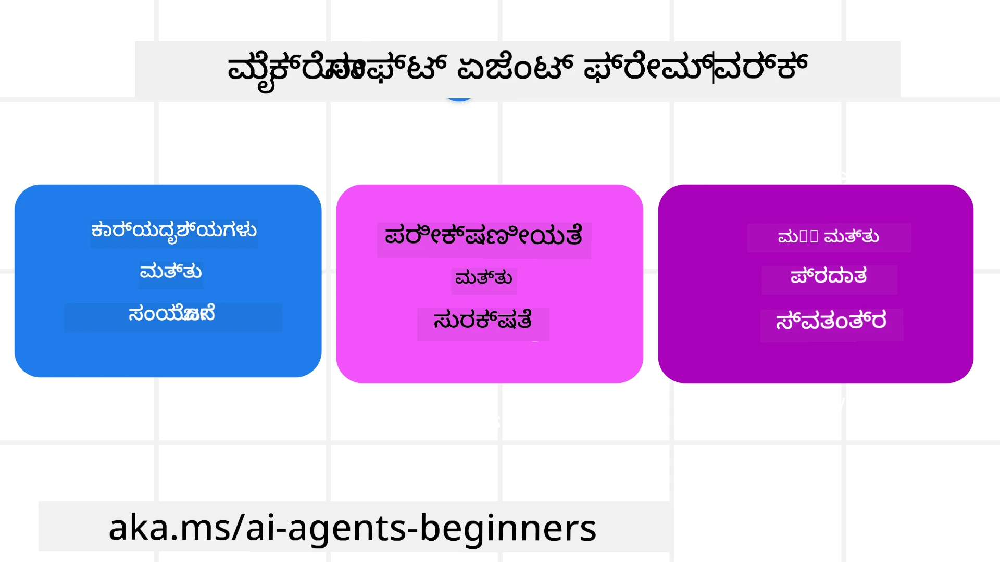

# ಮೈಕ್ರೋಸಾಫ್ಟ್ ಏಜೆಂಟ್ ಫ್ರೇಮು ವರ್ಕ್ ಅನ್ವೇಷಣೆ



### ಪರಿಚಯ

ಈ ಪಾಠದಲ್ಲಿ ಹೀಗಾದವುಗಳನ್ನು ಚರ್ಚಿಸಲಿದ್ದು:

- ಮೈಕ್ರೋಸಾಫ್ಟ್ ಏಜೆಂಟ್ ಫ್ರೇಮು ವರ್ಕ್: ಪ್ರಮುಖ ವೈಶಿಷ್ಟ್ಯಗಳು ಮತ್ತು ಮೌಲ್ಯವನ್ನು ಅರ್ಥಮಾಡಿಕೊಳ್ಳುವುದು  
- ಮೈಕ್ರೋಸಾಫ್ಟ್ ಏಜೆಂಟ್ ಫ್ರೇಮು ವರ್ಕ್‌ನ ಮುಖ್ಯ ತತ್ವಗಳನ್ನು ಅನ್ವೇಷಿಸುವುದು
- ಈಜು MAF ಮಾದರಿಗಳು: ವರ್ಕ್‌ಫ್ಲೋಗಳು, ಮಧ್ಯವರ್ತಿ ಮತ್ತು ಮೆಮೊರಿ

## ಕಲಿಕೆಯ ಗುರಿಗಳು

ಈ ಪಾಠವನ್ನು ಪೂರ್ಣಗೊಳಿಸಿದ ನಂತರ, ನಿಮಗೆ ಒಳಿತು:

- ಮೈಕ್ರೋಸಾಫ್ಟ್ ಏಜೆಂಟ್ ಫ್ರೇಮು ವರ್ಕ್ ಬಳಸಿ ಉತ್ಪಾದನಾ ಸಿದ್ಧ AI ಏಜೆಂಟ್ಗಳನ್ನು ನಿರ್ಮಿಸುವುದು
- ನಿಮ್ಮ ಏಜೆಂಟಿಕ್ ಬಳಕೆ ಪ್ರಕರಣಗಳಿಗೆ ಮೈಕ್ರೋಸಾಫ್ಟ್ ಏಜೆಂಟ್ ಫ್ರೇಮು ವರ್ಕ್‌ನ ಮೂಲ ಲಕ್ಷಣಗಳನ್ನು ಅನ್ವಯಿಸುವುದು
- ವರ್ಕ್‌ಫ್ಲೋಗಳು, ಮಧ್ಯವರ್ತಿ, ಮತ್ತು ಪರಿಶೀಲನೆ ಸೇರಿದಂತೆ ಆಧುನಿಕ ಮಾದರಿಗಳನ್ನು ಬಳಸುವುದು

## ಕೋಡ್ ಉದಾಹರಣೆಗಳು

[Microsoft Agent Framework (MAF)](https://aka.ms/ai-agents-beginners/agent-framewrok) ಗಾಗಿ ಕೋಡ್ ಉದಾಹರಣೆಗಳನ್ನು ಈ ರೆಪೊಸಿಟರಿಯಲ್ಲಿ `xx-python-agent-framework` ಮತ್ತು `xx-dotnet-agent-framework` ಫೈಲಿ ಗಳಡಿ ಕಾಣಬಹುದು.

## ಮೈಕ್ರೋಸಾಫ್ಟ್ ಏಜೆಂಟ್ ಫ್ರೇಮು ವರ್ಕ್ ಅರ್ಥಮಾಡಿಕೊಳ್ಳುವುದು



[Microsoft Agent Framework (MAF)](https://aka.ms/ai-agents-beginners/agent-framewrok) ಅನ್ನು AI ಏಜೆಂಟ್ಗಳ ನಿರ್ಮಾಣಕ್ಕಾಗಿ ಮೈಕ್ರೋಸಾಫ್ಟ್ ಒಕ್ಕೂಟವಾದ ಫ್ರೇಮು ವರ್ಕ್ ಆಗಿ ಒದಗಿಸಲಾಗಿದೆ. ಇದು ಉತ್ಪಾದನೆ ಮತ್ತು ಸಂಶೋಧನಾ ಪರಿಸರಗಳಲ್ಲಿ ಕಂಡುಬರುವ ವಿವಿಧ ಏಜೆಂಟಿಕ್ ಬಳಕೆ ಪ್ರಕರಣಗಳನ್ನು ಪೂರೈಸಲು ತಮ್ಮಸ್ವತಃ ಲೈಚ್ಯತ್ನಶೀಲತೆಯನ್ನು ನೀಡುತ್ತದೆ, ಉದಾಹರಣೆಗೆ:

- **ಕ್ರಮಬದ್ಧ ಏಜೆಂಟ್ ಸಂಯೋಜನೆ** ಅಂದರೆ ಹಂತ ಹಂತವಾಗಿ ಕಾರ್ಯನಿರ್ವಹಿಸುವ ಪರಿಸ್ಥಿತಿಗಳು.
- **ಸಮಾನಕಾಲೀನ ಸಂಯೋಜನೆ** ಅಂದರೆ ಏಜೆಂಟ್ಗಳು ಒಂದೇ ಸಮಯದಲ್ಲಿ ಕಾರ್ಯಗಳನ್ನು ಪೂರ್ಣಗೊಳಿಸುವ ಅಗತ್ಯವಿರುವ ಪರಿಸ್ಥಿತಿಗಳು.
- **ಗುಂಪು ಚಾಟ್ ಸಂಯೋಜನೆ** ಅಂದರೆ ಏಜೆಂಟ್ಗಳು ಒಬ್ಬ ಕಾರ್ಯದ ಕುರಿತು ಒಟ್ಟಾಗಿ ಸಹಕರಿಸುವ ಸಂದರ್ಭ.
- **ಹ್ಯಾಂಡ್‌ಆಫ್ ಸಂಯೋಜನೆ** ಅಂದರೆ ಉಪಕಾರ್ಯಗಳು ಪೂರ್ಣಗೊಳಿಸಲಾಗುತ್ತಿರುವ ವೇಳೆ ಏಜೆಂಟ್ಗಳು ಕೆಲಸವನ್ನು ಪರಸ್ಪರ ಹಸ್ತಾಂತರಿಸುವ ಸಂದರ್ಭ.
- **ಮ್ಯಾಗ್ನೆಟಿಕ್ ಸಂಯೋಜನೆ** ಅಂದರೆ ನಿರ್ವಾಹಕ ಏಜೆಂಟ್ ಕಾರ್ಯ ಪಟ್ಟಿ ರಚಿಸಿ, ತಿದ್ದುಪಡಿ ಮಾಡುತ್ತಾ ಉಪಏಜೆಂಟ್ಗಳ ಸಮನ್ವಯವನ್ನು ನಡೆಸುವ ಸಂದರ್ಭ.

ಉತ್ಪಾದನೆಗೆ AI ಏಜೆಂಟ್ ಗಳನ್ನು ಒದಗಿಸಲು, MAF ಇವುಗಳಲ್ಲೂ ವೈಶಿಷ್ಟ್ಯಗಳನ್ನು ಒಳಗೊಂಡಿದೆ:

- **ಪರಿಶೀಲನೆ** OpenTelemetry ಬಳಸಿಕೊಂಡು, ಏಜೆಂಟ್‌ನ ಎಲ್ಲಾ ಕ್ರಿಯೆಗಳು, ಉಪಕರಣ ಆಹ್ವಾನ, ಸಂಯೋಜನೆ ಹಂತಗಳು, ತರ್ಕ ಪ್ರವಾಹಗಳು ಮತ್ತು Microsoft Foundry ಡ್ಯಾಶ್ಬೋರ್ಡ್‌ಗಳ ಮೂಲಕ ಕಾರ್ಯಕ್ಷಮತೆ ನೆಚ್ಚುಗೆಯನ್ನು ನಡೆಸುವುದು.
- **ಭದ್ರತೆ** Microsoft Foundry ಮೇಲಿನ ಸ್ಥಳೀಯ ಆತಿಥ್ಯದಿಂದ, ಪಾತ್ರಾಧಾರಿತ ಪ್ರವೇಶ ನಿಯಂತ್ರಣ, ಖಾಸಗಿ ಡೇಟಾ ನಿರ್ವಹಣೆ ಮತ್ತು ಒಳಗೊಳಿಸಿದ ವಿಷಯ ಭದ್ರತೆ.
- **ಧೈರ್ಯ** ಏಜೆಂಟ್ ಥ್ರೆಡ್‌ಗಳು ಮತ್ತು ವರ್ಕ್‌ಫ್ಲೋಗಳು ತಾತ್ಕಾಲಿಕ ನಿಲ್ಲಿಸುವಿಕೆ, ಮರುಪ್ರಾರಂಭ ಮತ್ತು ದೋಷಗಳಿಂದ ಪುನರುದ್ದರಿಸುವಿಕೆ ಸಾಮರ್ಥ್ಯ ಹೊಂದಿವೆ, ಇದರಿಂದ ದೀರ್ಘಕಾಲಿಕ ಪ್ರಕ್ರಿಯೆ ಸಾಧ್ಯ.
- **ನಿಯಂತ್ರಣ** ಮಾನವನ ನಿರೀಕ್ಷಣೆಯ ಇರುವ ವರ್ಕ್‌ಫ್ಲೋಗಳನ್ನು ಬೆಂಬಲಿಸಿ, ಕಾರ್ಯಗಳಿಗೆ ಮಾನವ ಅನುಮೋದನೆ ಅಗತ್ಯವಿರುತ್ತದೆ ಎಂದು ಗುರುತಿಸುವುದು.

ಮೈಕ್ರೋಸಾಫ್ಟ್ ಏಜೆಂಟ್ ಫ್ರೇಮು ವರ್ಕ್ ಮುಂದುವರಿಯುವಂತೆ ಇಂಟರ್‌ಆಪರೇಬಲ್ ಆಗಿರಲು ಗಮನ ಹರಿಸಿದೆ:

- **ಮೇಘ-ಸ್ವಾತಂತ್ರ್ಯ** - ಏಜೆಂಟ್‌ಗಳು ಕಂಟೈನರ್‌ಗಳಲ್ಲಿ, ಆನ್-ಪ್ರೇಮ್ ಮತ್ತು ಹಲವಾರು ಮೇಘಗಳಲ್ಲಿ ಓಡಬಹುದು.
- **ಪ್ರದಾನಕর্তೃ-ಸ್ವಾತಂತ್ರ್ಯ** - ನೀವು ಇಚ್ಛಿಸುವ SDK ಗಳ ಮೂಲಕ ಏಜೆಂಟ್‌ಗಳನ್ನು ಸೃಷ್ಟಿಸಬಹುದು, Azure OpenAI ಮತ್ತು OpenAI ಸೇರಿದಂತೆ.
- **ಒಪನ್ ಸ್ಟ್ಯಾಂಡರ್ಡ್ ಸಂಯೋಜನೆ** - ಏಜೆಂಟ್‌ಗಳು Agent-to-Agent (A2A) ಹಾಗು Model Context Protocol (MCP) ಮುಂತಾದ ಪ್ರೋಟೋಕಾಲ್‌ಗಳನ್ನು ಬಳಸಿಕೊಂಡು ಇತರ ಏಜೆಂಟ್‌ಗಳು ಮತ್ತು ಉಪಕರಣಗಳನ್ನು ಪತ್ತೆಹಚ್ಚಿ ಬಳಸಬಹುದು.
- **ಪ್ಲಗಿನ್ ಮತ್ತು ಕನೆಕ್ಟರ್‌ಗಳು** - Microsoft Fabric, SharePoint, Pinecone ಮತ್ತು Qdrant ಮುಂತಾದ ಡೇಟಾ ಮತ್ತು ಮೆಮೊರಿ ಸೇವೆಗಳಿಗೆ ಸಂಪರ್ಕಗಳ ಸ್ಥಾಪನೆ.

ಈ ವೈಶಿಷ್ಟ್ಯಗಳು ಮೈಕ್ರೋಸಾಫ್ಟ್ ಏಜೆಂಟ್ ಫ್ರೇಮು ವರ್ಕ್‌ನ ಕೆಲವು ಮೂಲ ತತ್ವಗಳಿಗೆ ಹೇಗೆ ಅನ್ವಯಿಸುತ್ತವೆ ಅಂತ ನೋಡೋಣ.

## ಮೈಕ್ರೋಸಾಫ್ಟ್ ಏಜೆಂಟ್ ಫ್ರೇಮು ವರ್ಕ್‌ನ ಪ್ರಮುಖ ತತ್ವಗಳು

### ಏಜೆಂಟ್ಗಳು


**ಏಜೆಂಟ್ ರಚನೆ**

ಏಜೆಂಟ್ ರಚನೆ LLM_PROVIDER (ಅನುವಾದ ಸೇವೆ) ಅನ್ನು ನಿರ್ಧರಿಸುವ ಮೂಲಕ, AI ಏಜೆಂಟ್ ಪಾಲಿಸಲು ನಿಯಮಗಳ ಸರಣಿಯನ್ನು ಮತ್ತು ನಿಮಿತ್ತ ಹೆಸರು `name` ಅನ್ನು ನಿಯೋಜಿಸುವ ಮೂಲಕ ಮಾಡಲಾಗುತ್ತದೆ:

```python
agent = AzureOpenAIChatClient(credential=AzureCliCredential()).create_agent( instructions="You are good at recommending trips to customers based on their preferences.", name="TripRecommender" )
```

ಮೇಲಿನ ಉದಾಹರಣೆಯಲ್ಲಿ `Azure OpenAI` ಬಳಸಲಾಗುತ್ತಿದೆ ಆದರೆ ಏಜೆಂಟ್‌ಗಳು ವಿವಿಧ ಬಗೆಯ ಸೇವೆಗಳನ್ನು ಬಳಸಿ ರಚಿಸಬಹುದು, ಉದಾಹರಣೆಗೆ `Microsoft Foundry Agent Service`:

```python
AzureAIAgentClient(async_credential=credential).create_agent( name="HelperAgent", instructions="You are a helpful assistant." ) as agent
```

OpenAI `Responses`, `ChatCompletion` API ಗಳು

```python
agent = OpenAIResponsesClient().create_agent( name="WeatherBot", instructions="You are a helpful weather assistant.", )
```

```python
agent = OpenAIChatClient().create_agent( name="HelpfulAssistant", instructions="You are a helpful assistant.", )
```

ಅಥವಾ [MiniMax](https://platform.minimaxi.com/), OpenAI-ಹೋಲುವ API_large context ವಿಂಡೋ (204K ಟೋಕನ್ಸ್ ವರೆಗೆ) ಒದಗಿಸುವುದು:

```python
agent = OpenAIChatClient(base_url="https://api.minimax.io/v1", api_key=os.environ["MINIMAX_API_KEY"], model_id="MiniMax-M2.7").create_agent( name="HelpfulAssistant", instructions="You are a helpful assistant.", )
```

ಅಥವಾ A2A ಪ್ರೋಟೋಕಾಲ್ ಬಳಸಿ ದೂರಸ್ಥ ಏಜೆಂಟ್‌ಗಳು:

```python
agent = A2AAgent( name=agent_card.name, description=agent_card.description, agent_card=agent_card, url="https://your-a2a-agent-host" )
```

**ಏಜೆಂಟ್ ಓಡಿಸುವಿಕೆ**

ಏಜೆಂಟ್‌ಗಳನ್ನು `.run` ಅಥವಾ `.run_stream` ವಿಧಾನಗಳ ಮೂಲಕ ನಾನ್-ಸ್ಟ್ರೀಮಿಂಗ್ ಅಥವಾ ಸ್ಟ್ರೀಮಿಂಗ್ ಪ್ರತಿಕ್ರಿಯೆಗಳಿಗಾಗಿ ಓಡಿಸಲಾಗುತ್ತದೆ.

```python
result = await agent.run("What are good places to visit in Amsterdam?")
print(result.text)
```

```python
async for update in agent.run_stream("What are the good places to visit in Amsterdam?"):
    if update.text:
        print(update.text, end="", flush=True)

```

ಪ್ರತಿಯೊಂದು ಏಜೆಂಟ್ ಓಡುವಿಕೆಯು `max_tokens`, ಏಜೆಂಟ್ ಕರೆಮಾಡಬಹುದಾದ `tools`, ಮತ್ತು ಏಜೆಂಟ್ ಬಳಸುವ `model` ಮುಂತಾದ ಪರಿಮಾಣಗಳನ್ನು ಕಸ್ಟಮೈಸ್ ಮಾಡುವ ಆಯ್ಕೆಗಳನ್ನೂ ಹೊಂದಿರಬಹುದು.

ಈದು ಬಳಕೆದಾರರ ಕಾರ್ಯವನ್ನು ಮುಗಿಸಲು ನಿರ್ದಿಷ್ಟ ಮಾದರಿ ಅಥವಾ ಉಪಕರಣಗಳು ಬೇಕಾದ ಸಂದರ್ಭಗಳಲ್ಲಿ ಬಹುಪಯೋಗಿ.

**ಕೈಗಾರಿಕೆ**

ಕೈಗಾರಿಕೆಗಳನ್ನು ಏಜೆಂಟ್ ನಿರ್ಧರಿಸುವಾಗ ಹಾಗೂ ಏಜೆಂಟ್ ಓಡಿಸುವಾಗ ವ್ಯಾಖ್ಯಾನಿಸಬಹುದು:

```python
def get_attractions( location: Annotated[str, Field(description="The location to get the top tourist attractions for")], ) -> str: """Get the top tourist attractions for a given location.""" return f"The top attractions for {location} are." 


# ನೇರವಾಗಿ ಚಾಟ್ ಏಜೆಂಟ್ ರಚಿಸುವಾಗ

agent = ChatAgent( chat_client=OpenAIChatClient(), instructions="You are a helpful assistant", tools=[get_attractions]

```

```python

result1 = await agent.run( "What's the best place to visit in Seattle?", tools=[get_attractions] # ಈ ಓಟಿಗೆ ಮಾತ್ರ ಒದಗಿಸಲಾದ ಸಾಧನ )
```

**ಏಜೆಂಟ್ ಥ್ರೆಡ್‌ಗಳು**

ಏಜೆಂಟ್ ಥ್ರೆಡ್‌ಗಳು ಬಹು-ತಿರುವು ಸಂಭಾಷಣೆಯನ್ನು ನಿರ್ವಹಿಸಲು ಬಳಸಲಾಗುತ್ತದೆ. ಥ್ರೆಡ್‌ಗಳನ್ನು 2 ರೀತಿಯಲ್ಲಿ ರಚಿಸಬಹುದು:

- `get_new_thread()` ಬಳಸಿ ಥ್ರೆಡ್ ಅನ್ನು ಸಮಯಕ್ಕೂ ಕೂಡ ಉಳಿಸಬಹುದು
- ಏಜೆಂಟ್ ಓಡಿಸುವಾಗ ಸ್ವಯಂಚಾಲಿತವಾಗಿ ಥ್ರೆಡ್ ರಚಿಸಿ, ಅದು ಓಡುವಿಕೆಯ ಅವಧಿಯಷ್ಟೇ ಇರಲಿದೆ.

ಥ್ರೆಡ್ ಸೃಷ್ಟಿಸಲು ಕೋಡ್ ಹೀಗಿದೆ:

```python
# ಹೊಸ ತಂತಿಯನ್ನು ರಚಿಸಿ.
thread = agent.get_new_thread() # ಆ ಹೆತ್ತಡೊಂದಿಗೆ ಏಜೆಂಟ್ ಅನ್ನು ಚಾಲನೆ ಮಾಡಿ.
response = await agent.run("Hello, I am here to help you book travel. Where would you like to go?", thread=thread)

```

ನಂತರ ಈ ಥ್ರೆಡ್ ಅನ್ನು ಶೇಖರಿಸಲು ಸರಿಸಿ (serialize) ಮಾಡಬಹುದು:

```python
# ಹೊಸ ಥ್ರೆಡ್ ಅನ್ನು ರಚಿಸಿ.
thread = agent.get_new_thread() 

# ಥ್ರೆಡ್‌ನೊಂದಿಗೆ ಏಜೆಂಟ್ ಅನ್ನು ಚಾಲನೆ ಮಾಡಿ.

response = await agent.run("Hello, how are you?", thread=thread) 

# ಸಂಗ್ರಹಣೆಯಿಗಾಗಿ ಥ್ರೆಡ್ ಅನ್ನು ಸೀರಿಯಲೈಸ್ ಮಾಡಿ.

serialized_thread = await thread.serialize() 

# ಸಂಗ್ರಹಣೆಯಿಂದ ಲೋಡ್ ಮಾಡಿದ ನಂತರ ಥ್ರೆಡ್ ಸ್ಥಿತಿಯನ್ನು ಡಿಸೀರಿಯಲೈಸ್ ಮಾಡಿ.

resumed_thread = await agent.deserialize_thread(serialized_thread)
```

**ಏಜೆಂಟ್ ಮಧ್ಯವರ್ತಿ**

ಏಜೆಂಟ್‌ಗಳು ಉಪಕರಣಗಳು ಮತ್ತು LLM ಗಳು ಬಳಸಿ ಬಳಕೆದಾರರ ಕಾರ್ಯಗಳನ್ನು ಮುಗಿಸುತ್ತವೆ. ಕೆಲ ಸಂದರ್ಭಗಳಲ್ಲಿ ಈ ಮದ್ಯದಲ್ಲಿ ಕಾರ್ಯಾಚರಣೆ ನಡೆಸಬೇಕಾಗುತ್ತದೆ ಅಥವಾ ಅಳವಡಿಸಬೇಕಾಗುತ್ತದೆ. ಏಜೆಂಟ್ ಮಧ್ಯವರ್ತಿ ಇದನ್ನು ಸಾಧ್ಯಮಾಡುತ್ತದೆ:

*ಕಾರ್ಯ ಮದ್ಯವರ್ತಿ*

ಈ ಮಧ್ಯವರ್ತಿಯು ಏಜೆಂಟ್ ಮತ್ತು ಆಹ್ವಾನಿಸುವ ಕಾರ್ಯ/ಉಪಕರಣದ ಮಧ್ಯೆ ಕ್ರಿಯೆಯನ್ನು ನಡೆಸಲು ನೆರವಾಗುತ್ತದೆ. ಉದಾಹರಣೆಗೆ, ಕಾರ್ಯ ಕರೆ ಮೇಲೆ ಲಾಗಿಂಗ್ ಮಾಡಬೇಕಿದ್ದರೆ.

ಕೆಳಗಿನ ಕೋಡ್‌ನಲ್ಲಿ `next` ಎಂದರೆ ಮುಂದಿನ ಮಧ್ಯವರ್ತಿ ಅಥವಾ ನಿಜವಾದ ಕಾರ್ಯವನ್ನು ಕರೆ ಮಾಡಬೇಕೇ ಎಂಬುದನ್ನು ಸೂಚಿಸುತ್ತದೆ.

```python
async def logging_function_middleware(
    context: FunctionInvocationContext,
    next: Callable[[FunctionInvocationContext], Awaitable[None]],
) -> None:
    """Function middleware that logs function execution."""
    # ಪೂರ್ವ ಪ್ರಕ್ರಿಯೆ: ಕಾರ್ಯ ಕಾರ್ಯಗತಗೊಳಿಸುವ ಮೊದಲು ಲಾಗ್ ಮಾಡಿ
    print(f"[Function] Calling {context.function.name}")

    # ಮುಂದಿನ ಮಧ್ಯಸ್ಥ ಅಥವಾ ಕಾರ್ಯ ಕಾರ್ಯಗತಗೊಳಗಳಿಗೆ ಮುಂದುವರಿಯಿರಿ
    await next(context)

    # ನಂತರ ಪ್ರಕ್ರಿಯೆ: ಕಾರ್ಯ ಕಾರ್ಯಗತಗೊಳ್ಳುವ ನಂತರ ಲಾಗ್ ಮಾಡಿ
    print(f"[Function] {context.function.name} completed")
```

*ಚಾಟ್ ಮಧ್ಯವರ್ತಿ*

ಈ ಮಧ್ಯವರ್ತಿಯು ಏಜೆಂಟ್ ಮತ್ತು LLM ನಡುವಿನ ವಿನಂತಿಗಳ ನಡುವೆ ಕ್ರಿಯೆಯನ್ನು ನಡೆಸುವ ಅಥವಾ ಲಾಗ್ ಮಾಡಲು ಸಹಾಯ ಮಾಡುತ್ತದೆ.

ಇದರಲ್ಲಿ AI ಸೇವೆಗೆ ಕಳುಹಿಸಲಾದ `messages` ಮುಂತಾದ ಪ್ರಮುಖ ಮಾಹಿತಿಗಳು ಇರುತ್ತವೆ.

```python
async def logging_chat_middleware(
    context: ChatContext,
    next: Callable[[ChatContext], Awaitable[None]],
) -> None:
    """Chat middleware that logs AI interactions."""
    # ಪೂರ್ವ-ಪ್ರಕ್ರಿಯೆ: AI ಕರೆಗೂ ಮುನ್ನ ಲಾಗ್ ಮಾಡಬೇಕು
    print(f"[Chat] Sending {len(context.messages)} messages to AI")

    # ಮುಂದಿನ ಮಧ್ಯವರ್ತಿ ಅಥವಾ AI ಸೇವೆಗೆ ಮುಂದುವರೆಯಿರಿ
    await next(context)

    # ನಂತರ ಪ್ರಕ್ರಿಯೆ: AI ಪ್ರತಿಕ್ರಿಯೆಯ ನಂತರ ಲಾಗ್ ಮಾಡಬೇಕು
    print("[Chat] AI response received")

```

**ಏಜೆಂಟ್ ಮೆಮೊರಿ**

`Agentic Memory` ಪಾಠದಲ್ಲಿ ಚರ್ಚಿಸಿದಂತೆ, ಮೆಮೊರಿ ವಿವಿಧ ಸನ್ನಿವೇಶಗಳಲ್ಲಿ ಏಜೆಂಟ್ ಕಾರ್ಯಾಚರಣೆಗಾಗಿ ಪ್ರಾಮುಖ್ಯವಾಗಿದೆ. MAF ಹಲವು ಬಗೆಯ ಮೆಮೊರಿಗಳನ್ನು ಒದಗಿಸುತ್ತದೆ:

*ಇನ್-ಮೆಮೊರಿ ಸಂಗ್ರಹಣೆ*

ಅಪ್ಲಿಕೇಶನ್ ರನ್‌ಟೈಮ್‌ನಲ್ಲಿ ಥ್ರೆಡ್‌ಗಳಲ್ಲಿ ಸಂಗ್ರಹಿಸಿದ ಮೆಮೊರಿ.

```python
# ಹೊಸ ಥ್ರೆಡ್ ರಚಿಸಿ.
thread = agent.get_new_thread() # ಥ್ರೆಡ್ ನೊಂದಿಗೆ ಏಜೆಂಟ್ ಅನ್ನು ಚಾಲನೆ ಮಾಡು.
response = await agent.run("Hello, I am here to help you book travel. Where would you like to go?", thread=thread)
```

*ಸ್ಥಿರ ಸಂದೇಶಗಳು*

ಬೇರೆ ಸೆಷನ್‌ಗಳ ನಡುವೆ ಸಂಭಾಷಣೆ ಇತಿಹಾಸವನ್ನು ಸಂಗ್ರಹಿಸಲು ಬಳಸುವ ಮೆಮೊರಿ. `chat_message_store_factory` ಮೂಲಕ ವ್ಯಾಖ್ಯಾನಿಸಲಾಗಿದೆ:

```python
from agent_framework import ChatMessageStore

# ಕಸ್ಟಮ್ ಸಂದೇಶ ಸಂಗ್ರಹಣೆಯನ್ನು ರಚಿಸಿ
def create_message_store():
    return ChatMessageStore()

agent = ChatAgent(
    chat_client=OpenAIChatClient(),
    instructions="You are a Travel assistant.",
    chat_message_store_factory=create_message_store
)

```

*ಡೈನಾಮಿಕ್ ಮೆಮೊರಿ*

ಏಜೆಂಟ್‌ಗಳು ಓಡುವ ಮೊದಲು ತಾತ್ಕಾಲಿಕವಾಗಿ ವಿಸ್ತರಿಸುವ ಸನ್ನಿವೇಶಕ್ಕೆ ಸೇರಿಸುವ ಮೆಮೊರಿ. ಈ ಮೆಮೊರಿ mem0 ಮುಂತಾದ ಬಾಹ್ಯ ಸೇವೆಗಳಲ್ಲಿ ಸಂಗ್ರಹಿಸಲಾಗಬಹುದು:

```python
from agent_framework.mem0 import Mem0Provider

# ಅಭಿವೃದ್ಧಿಶೀಲ ಮೆಮೊರಿ ಸಾಮರ್ಥ್ಯಗಳಿಗಾಗಿ Mem0 ಬಳಕೆಗೆ
memory_provider = Mem0Provider(
    api_key="your-mem0-api-key",
    user_id="user_123",
    application_id="my_app"
)

agent = ChatAgent(
    chat_client=OpenAIChatClient(),
    instructions="You are a helpful assistant with memory.",
    context_providers=memory_provider
)

```

**ಏಜೆಂಟ್ ಪರಿಶೀಲನೆ**

ಪರಿಶೀಲನೆ ವಿಶ್ವಾಸಾರ್ಹ ಮತ್ತು ನಿರ್ವಹಣೆಯೋಗ್ಯ ಏಜೆಂಟ್ ಸಿಸ್ಟಂಗಳನ್ನು ನಿರ್ಮಿಸಲು ಅತ್ಯವಶ್ಯಕ. MAF OpenTelemetryಗೂ ಸಂಯೋಜಿಸಿ ಉತ್ತಮ ಪರಿಶೀಲನೆಗಾಗಿ ಟ್ರೇಸಿಂಗ್ ಮತ್ತು ಮೀಟರ್‌ಗಳನ್ನು ಒದಗಿಸುತ್ತದೆ.

```python
from agent_framework.observability import get_tracer, get_meter

tracer = get_tracer()
meter = get_meter()
with tracer.start_as_current_span("my_custom_span"):
    # ಏನಾದರೂ ಮಾಡಿ
    pass
counter = meter.create_counter("my_custom_counter")
counter.add(1, {"key": "value"})
```

### ವರ್ಕ್‌ಫ್ಲೋಗಳು

MAF ಕಾರ್ಯವನ್ನು ಪೂರ್ಣಗೊಳಿಸಲು ಪೂರ್ವನಿಗದಿತ ಹಂತಗಳನ್ನು ಒಳಗೊಂಡಿರುವ ವರ್ಕ್ಫ್ಲೋಗಳನ್ನು ಒದಗಿಸುತ್ತದೆ ಮತ್ತು ಆ ಹಂತಗಳಲ್ಲಿ AI ಏಜೆಂಟ್‌ಗಳನ್ನು բաղುಳಿಸುವುದು.

ವರ್ಕ್‌ಫ್ಲೋವು ವಿವಿಧ ಘಟಕಗಳಿಂದ ನಿರ್ಮಿತವಾಗಿದ್ದು, ಯಶಸ್ವೀ ಕಾರ್ಯ ನಿರ್ವಹಣೆಗೆ ಉತ್ತಮ ನಿಯಂತ್ರಣ ಒದಗಿಸುತ್ತದೆ. ವರ್ಕ್‌ಫ್ಲೋಗಳು **ಬಹು-ಏಜೆಂಟ್ ಸಂಯೋಜನೆ** ಮತ್ತು **ಚೆಕ್‌ಪಾಯಿಂಟಿಂಗ್** ಅನ್ನು ವೆರ್ಕ್‌ಫ್ಲೋ ಸ್ಥಿತಿಗಳನ್ನು ಉಳಿಸಲು ಅನುವು ಮಾಡಿಕೊಡುತ್ತವೆ.

ವರ್ಕ್‌ಫ್ಲೋಯ ಪ್ರಮುಖ ಘಟಕಗಳು:

**ಕಾರ್ಯನಿರ್ವಹಕರು (Executors)**

ಕಾರ್ಯನಿರ್ವಹಕರು ಇನ್‌ಪುಟ್ ಸಂದೇಶಗಳನ್ನು ಸ್ವೀಕರಿಸಿ ಅವರ ನಿರ್ದಿಷ್ಟ ಕೆಲಸಗಳನ್ನು ಮಾಡುತ್ತಾ, ಮಾಯಕೊನ ಸಂದೇಶವನ್ನು ಉತ್ಪಾದಿಸುತ್ತಾರೆ. ಇದು ವರ್ಕ್‌ಫ್ಲೋವನ್ನು ದೊಡ್ಡ ಕಾರ್ಯ ಪೂರ್ಣಗೊಳಿಸುವತ್ತ ಮುಂದಿಸುವುದು. ಕಾರ್ಯನಿರ್ವಹಕರು AI ಏಜೆಂಟ್ ಅಥವಾ ಇಚ್ಛಿತ ಲಾಜಿಕ್ ಆಗಿರಬಹುದು.

**ಜೆತೆಗಳು (Edges)**

ಸಂದೇಶಗಳ ಹರಿವನ್ನು ವರ್ಕ್‌ಫ್ಲೋದಲ್ಲಿ ನಿರ್ಧರಿಸಲು ಜೆತೆಗಳನ್ನು ಬಳಸಲಾಗುತ್ತದೆ. ಅವು:

*ನೇರ ಜೆತೆಗಳು* - ಕಾರ್ಯನಿರ್ವಹಕರ ನಡುವಿನ ಸರಳ ಒಂದರಿಂದ ಒಬ್ಬರ ಸಂಪರ್ಕ:

```python
from agent_framework import WorkflowBuilder

builder = WorkflowBuilder()
builder.add_edge(source_executor, target_executor)
builder.set_start_executor(source_executor)
workflow = builder.build()
```

*ಶರತಳಿತ ಜೆತೆಗಳು* - ನಿರ್ದಿಷ್ಟ ಶರತ್ತು ತೃಪ್ತಿಯಾದ ನಂತರ ಸಕ್ರಿಯವಾಗುವುವು. ಉದಾಹರಣೆಗೆ, ಹೋಟೆಲ್ ಕೊಠಡಿಗಳು ಲಭ್ಯವಿಲ್ಲದಿದ್ದಲ್ಲಿ, ಕಾರ್ಯನಿರ್ವಹಕ ಇತರ ಆಯ್ಕೆಗಳನ್ನು ಸೂಚಿಸಬಹುದು.

*ಸ್ವಿಚ್-ಕೇಸ್ ಜೆತೆಗಳು* - ನಿಗದಿತ ಶರತ್ತುಗಳ ಆಧಾರದಲ್ಲಿ ಸಂದೇಶಗಳನ್ನು ವಿಭಿನ್ನ ಕಾರ್ಯನಿರ್ವಹಕರಿಗೆ ಮಾರ್ಗದರ್ಶಿಸುವುದು. ಉದಾಹರಣೆಗೆ, ಪ್ರವಾಸಿ ಗ್ರಾಹಕರಿಗೆ ಪ್ರಾಧಿಕಾರ ಪ್ರವೇಶ ಇದ್ದರೆ ಅವರ ಕಾರ್ಯಗಳು ಬೇರೆ ವರ್ಕ್‌ಫ್ಲೋ ಮೂಲಕ ನಿರ್ವಹಣೆಯಾಗಬಹುದು.

*ಫ್ಯಾನ್- ಔಟ್ ಜೆತೆಗಳು* - ಒಂದು ಸಂದೇಶವನ್ನು ಬಹು ಗುರಿಗಳಿಗೆ ಕಳುಹಿಸುವುದು.

*ಫ್ಯಾನ್- ಇನ್ ಜೆತೆಗಳು* - ವಿಭಿನ್ನ ಕಾರ್ಯನಿರ್ವಹಕರಿಂದ ಬಹಳ ಸಂದೇಶಗಳನ್ನು ಸಂಗ್ರಹಿಸಿ ಒಂದೇ ಗುರಿಗೆ ಕಳುಹಿಸುವುದು.

**ಕಾರ್ಯಘಟನைகள் (Events)**

ವರ್ಕ್‌ಫ್ಲೋಗಳ ವಿಶಾಲ ಪರಿಶೀಲನೆಗಾಗಿ MAF ಕಾರ್ಯನಿರ್ವಹಣೆಗೆ ಒಳಗೌಂಡಿರುವ ಕಾರ್ಯಘಟನೆಗಳನ್ನೂ ಒದಗಿಸುತ್ತದೆ, ಉದಾಹರಣೆಗಳು:

- `WorkflowStartedEvent`  - ವರ್ಕ್‌ಫ್ಲೋ ಕಾರ್ಯನಿರ್ವಹಣೆ ಪ್ರಾರಂಭ
- `WorkflowOutputEvent` - ವರ್ಕ್‌ಫ್ಲೋ ಹೊರಟಲಾದ ಸಂವೇದಿ
- `WorkflowErrorEvent` - ವರ್ಕ್‌ಫ್ಲೋ ದೋಷ ಎದುರಿಸಿತು
- `ExecutorInvokeEvent`  - ಕಾರ್ಯನಿರ್ವಹಕ ಪ್ರಕ್ರಿಯೆ ಆರಂಭ
- `ExecutorCompleteEvent`  -  ಕಾರ್ಯನಿರ್ವಹಕ ಪ್ರಕ್ರಿಯೆ ಸಂಪನ್ಮೂಲವಾಗಿದೆ
- `RequestInfoEvent` - ವಿನಂತಿ ಹೊರಡಿಸಲಾಗಿದೆ

## ಆಧುನಿಕ MAF ಮಾದರಿಗಳು

ಮೇಲಿನ ವಿಭಾಗಗಳು ಮೈಕ್ರೋಸಾಫ್ಟ್ ಏಜೆಂಟ್ ಫ್ರೇಮು ವರ್ಕ್‌ನ ಮುಖ್ಯ ತತ್ವಗಳನ್ನು ಆವರಿಸಿದೆ. ನೀವು ಹೆಚ್ಚು ಸಂಕೀರ್ಣ ಏಜೆಂಟ್‌ಗಳನ್ನು ನಿರ್ಮಿಸಿದಂತೆ, ಇಲ್ಲಿ ಕೆಲವು ಆಧುನಿಕ ಮಾದರಿಗಳು bedacht ಮಾಡಬಹುದು:

- **ಮಧ್ಯವರ್ತಿ ಸಂಯೋಜನೆ**: ಬಹು ಮಧ್ಯವರ್ತಿ ಸಿಬ್ಬಂದಿಗಳನ್ನು (ಲಾಗಿಂಗ್, ಪ್ರಾಮಾಣೀಕರಣ, ದರ-ನಿಯಂತ್ರಣ) ಕಾರ್ಯ ಮತ್ತು ಚಾಟ್ ಮಧ್ಯವರ್ತಿಗಳ ಮೂಲಕ ಜೋಡಿಸಿ ಏಜೆಂಟ್ ವರ್ತನೆಯನ್ನು ಸೂಕ್ಷ್ಮವಾಗಿ ನಿಯಂತ್ರಿಸುವುದು.
- **ವರ್ಕ್‌ಫ್ಲೋ ಚೆಕ್‌ಪಾಯಿಂಟಿಂಗ್**: ವರ್‌ಕ್ಫ್ಲೋ ಘಟನಗಳನ್ನು ಮತ್ತು ಸರಣೀಕರಣವನ್ನು ಬಳಸಿಕೊಂಡು ದೀರ್ಘಕಾಲಿಕ ಏಜೆಂಟ್ ಪ್ರಕ್ರಿಯೆಗಳನ್ನು ಉಳಿಸಿ ಪುನರಾರಂಭ ಮಾಡುವುದು.
- **ಡೈನಾಮಿಕ್ ಉಪಕರಣ ಆಯ್ಕೆ**: ಉಪಕರಣಗಳ ವಿವರಣೆಗೆ RAG ಹಾಗೂ MAF ಉಪಕರಣ ನೋಂದಣಿಯನ್ನು ಜೋಡಿಸಿ ಪ್ರಶ್ನೆಗೆ ತಕ್ಕ ಉಪಕರಣಗಳನ್ನು ಮಾತ್ರ ಪ್ರಸ್ತುತಪಡಿಸುವುದು.
- **ಬಹು-ಏಜೆಂಟ್ ಹ್ಯಾಂಡ್‌ಆಫ್**: ವರ್ಕ್‌ಫ್ಲೋ ಜೆತೆಗಳು ಮತ್ತು ಶರತಳಿತ ಮಾರ್ಗಸೂಚಿಗಳನ್ನು ಬಳಸಿಕೊಂಡು ವಿಶೇಷ ಏಜೆಂಟ್‌ಗಳ ಮಧ್ಯೆ ಹ್ಯಾಂಡ್‌ಆಫ್ ವ್ಯವಸ್ಥೆಯನ್ನು ಸಂಯೋಜಿಸುವುದು.

## ಕೋಡ್ ಉದಾಹರಣೆಗಳು

ಮೈಕ್ರೋಸಾಫ್ಟ್ ಏಜೆಂಟ್ ಫ್ರೇಮು ವರ್ಕ್ ಗೆ ಸಂಬಂಧಿಸಿದ ಕೋಡ್ ಉದಾಹರಣೆಗಳು ಈ ರೆಪೊಸಿಟರಿಯಲ್ಲಿ `xx-python-agent-framework` ಮತ್ತು `xx-dotnet-agent-framework` ಫೈಲ್‌ಗಳಡಿಯಲ್ಲಿ ಕಾಣಬಹುದು.

## ಮೈಕ್ರೋಸಾಫ್ಟ್ ಏಜೆಂಟ್ ಫ್ರೇಮು ವರ್ಕ್ ಬಗ್ಗೆ ಇನ್ನಷ್ಟು ಪ್ರಶ್ನೆಗಳಿವೆಯೇ?

ಇತರ ಕಲಿಯುವವರನ್ನು 만나ಲು, ಆಫೀಸ್ ಘಂಟೆಗಳಲ್ಲಿ ಭಾಗವಹಿಸಲು ಮತ್ತು ನಿಮ್ಮ AI ಏಜೆಂಟ್ ಪ್ರಶ್ನೆಗಳಿಗೆ ಉತ್ತರಗಳನ್ನು ಪಡೆಯಲು [Microsoft Foundry Discord](https://aka.ms/ai-agents/discord) ಗೆ ಸೇರಿಕೊಳ್ಳಿ.

---

<!-- CO-OP TRANSLATOR DISCLAIMER START -->
**ತ್ಯಾಜ್ಯತೆ**:
ಈ ದಸ್ತಾವೇಜನ್ನು AI ಅನುವಾದ ಸೇವೆ [Co-op Translator](https://github.com/Azure/co-op-translator) ಬಳಸಿ ಅನುವಾದಿಸಲಾಗಿದೆ. ನಾವು ತಿದ್ದುಪಡಿ ಮಾಡಲು ಪ್ರಯತ್ನಿಸಿದರೂ, ಸ್ವಯಂಚಾಲಿತ ಅನುವಾದಗಳಲ್ಲಿ ದೋಷಗಳು ಅಥವಾ ಅಸತ್ಯತೆಗಳು ಇರಬಹುದು ಎಂಬುದನ್ನು ಗಮನದಲ್ಲಿರಿಸಿ. ಮೂಲ ಭಾಷೆಯಲ್ಲಿ ಇರುವ ದಸ್ತಾವೇಜನ್ನು ಪ್ರಾಮಾಣಿಕ ಮೂಲವಾಗಿ ಪರಿಗಣಿಸಬೇಕು. ಪ್ರಮುಖ ಮಾಹಿತಿಗೆ, ವೃತ್ತಿಪರ ಮಾನವ ಅನುವಾದವನ್ನು ಶಿಫಾರಸು ಮಾಡಲಾಗುತ್ತದೆ. ಈ ಅನುವಾದದಿಂದ ಉಂಟಾಗುವ ಯಾವುದೇ ಅರ್ಥದ ಗಲಭೆಗಳಿಗೆ ನಾವು ಜವಾಬ್ದಾರರು ಅಲ್ಲ.
<!-- CO-OP TRANSLATOR DISCLAIMER END -->