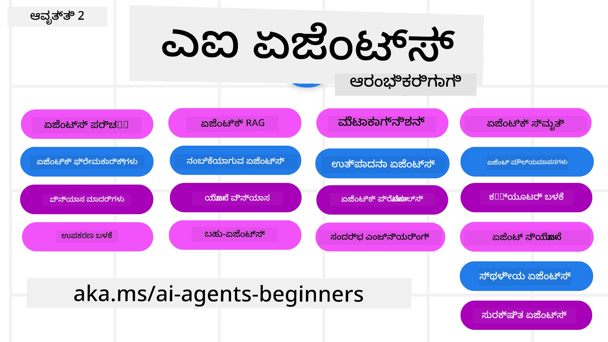

# ಆರಂಭಿಕರಿಗೆ AI ಏಜೆಂಟ್ಸ್ - ಒಂದು ಕೋರ್ಸ್



## AI ಏಜೆಂಟ್‌ಗಳನ್ನು ನಿರ್ಮಿಸುವುದು ಪ್ರಾರಂಭಿಸಲು ಬೇಕಾದ ಎಲ್ಲಾ ವಿಷಯಗಳನ್ನ ಕಲಿಸುವ ಕೋರ್ಸ್

[](https://github.com/microsoft/ai-agents-for-beginners/blob/master/LICENSE?WT.mc_id=academic-105485-koreyst)
[](https://GitHub.com/microsoft/ai-agents-for-beginners/graphs/contributors/?WT.mc_id=academic-105485-koreyst)
[](https://GitHub.com/microsoft/ai-agents-for-beginners/issues/?WT.mc_id=academic-105485-koreyst)
[](https://GitHub.com/microsoft/ai-agents-for-beginners/pulls/?WT.mc_id=academic-105485-koreyst)
[](http://makeapullrequest.com?WT.mc_id=academic-105485-koreyst)

### 🌐 ಬಹುಭಾಷಾ ಬೆಂಬಲ

#### GitHub ಕ್ರಿಯೆಯಿಂದ ಬೆಂಬಲಿಸಲಾಗಿದೆ (ಸ್ವಯಂಚಾಲಿತ ಮತ್ತು ಸದಾ ನವೀಕರಿಸಲಾಗುವುದು)

<!-- CO-OP TRANSLATOR LANGUAGES TABLE START -->
[ಅರಬಿಕ್](../ar/README.md) | [ಬಂಗಾಳಿ](../bn/README.md) | [ಬಲ್ಗೇರಿಯನ್](../bg/README.md) | [ಬರ್ಮೀಸ್ (ಮಯಾನ್ಮಾರ್)](../my/README.md) | [ಚೈನೀಸ್ (ಸರಳೀಕೃತ)](../zh-CN/README.md) | [ಚೈನೀಸ್ (ಪാരಂಪರಿಕ, ಹಾಂಗ್ ಕಾಂಗ್)](../zh-HK/README.md) | [ಚೈನೀಸ್ (ಪಾರಂಪರಿಕ, ಮಾಕಾವ್)](../zh-MO/README.md) | [ಚೈನೀಸ್ (ಪಾರಂಪರಿಕ, ತೈವಾನ್)](../zh-TW/README.md) | [ಕ್ರೋಯೇಷಿಯನ್](../hr/README.md) | [ಚೆಕ್](../cs/README.md) | [ಡೆನಿಶ್](../da/README.md) | [ಡಚ್](../nl/README.md) | [ಎಸ್ಟೋನಿಯನ್](../et/README.md) | [ಫಿನ್ನಿಶ್](../fi/README.md) | [ಫ್ರೆಂಚ್](../fr/README.md) | [ಜರ್ಮನ್](../de/README.md) | [ಗ್ರೀಕ್](../el/README.md) | [ಹೆಬ್ರೂ](../he/README.md) | [ಹಿಂದಿ](../hi/README.md) | [ಹಂಗೇರಿಯನ್](../hu/README.md) | [ಇಂಡೋನೇಶಿಯನ್](../id/README.md) | [ಇಟಾಲಿಯನ್](../it/README.md) | [ಜಾವಾನೀಸ್](../ja/README.md) | [ಕನ್ನಡ](./README.md) | [ಖ್ಮೇರ್](../km/README.md) | [ಕೋರಿ](../ko/README.md) | [ಲಿಥುವೇನಿಯನ್](../lt/README.md) | [ಮಲಯ್](../ms/README.md) | [ಮಲಯಾಳಂ](../ml/README.md) | [ಮರಾಠಿ](../mr/README.md) | [ನೇಪಾಳಿ](../ne/README.md) | [ನೈಗೆರಿಯನ್ ಪಿಡ್ಜಿನ್](../pcm/README.md) | [ನಾರ್ವೇಜಿಯನ್](../no/README.md) | [ಪರ್ಶಿಯನ್ (ಫಾರ್ಸಿ)](../fa/README.md) | [ಪೋಲಿಷ್](../pl/README.md) | [ಪೋರ್ಚುಗೀಸ್ (ಬ್ರೆಜಿಲ್)](../pt-BR/README.md) | [ಪೋರ್ಚುಗೀಸ್ (ಪೋರ್ಚುಗಲ್)](../pt-PT/README.md) | [ಪಂಜಾಬಿ (ಗುರ್ಮುಖಿ)](../pa/README.md) | [ರೋಮಾನಿಯನ್](../ro/README.md) | [ರಶಿಯನ್](../ru/README.md) | [ಸರ್ಬಿಯನ್ (ಸಿರಿಲಿಕ್)](../sr/README.md) | [ಸ್ಲೋವಾಕ್](../sk/README.md) | [ಸ್ಲೋವೇನಿಯನ್](../sl/README.md) | [ಸ್ಪ್ಯಾನಿಷ್](../es/README.md) | [ಸ್ವಾಹಿಲಿ](../sw/README.md) | [ಸ್ವೀಡಿಶ್](../sv/README.md) | [ಟ್ಯಾಗಾಲೊಗ್ (ಫಿಲಿಪೀನೋ)](../tl/README.md) | [ತಮಿಳು](../ta/README.md) | [ತೆಲುಗು](../te/README.md) | [ಥಾಯಿ](../th/README.md) | [ಟರ್ಕಿಷ್](../tr/README.md) | [ಉಕ್ರೇನಿಯನ್](../uk/README.md) | [ಉರ್ಡು](../ur/README.md) | [ವಿಯೆಟ್ನಾಮೀಸ್](../vi/README.md)

> **ಸ್ಥಳೀಯವಾಗಿ ಕ್ಲೋನ್ ಮಾಡೋದು ಇಚ್ಛೆಯಾಗಿದೆಯಾ?**  
>   
> ಈ ಭಂಡಾರದಲ್ಲಿ 50+ ಭಾಷಾ ಭಾಷಾಂತರಗಳು ಸೇರಿವೆ, ಇದು ಡೌನ್ಲೋಡ್ ಗಾತ್ರವನ್ನು ಹೆಚ್ಚಿಸುತ್ತದೆ. ಭಾಷಾಂತರವಿಲ್ಲದೆ ಕ್ಲೋನ್ ಮಾಡಲು, ಸ್ಪಾರ್ಸ್ ಔಟ್‌ಶೆರ್ಟ್ ಬಳಸಿ:  
>   
> **ಬಾಶ್ / macOS / ಲಿನಕ್ಸ್ನಲ್ಲಿ:**  
> ```bash
> git clone --filter=blob:none --sparse https://github.com/microsoft/ai-agents-for-beginners.git
> cd ai-agents-for-beginners
> git sparse-checkout set --no-cone '/*' '!translations' '!translated_images'
> ```
>
> **CMD (ವಿಂಡೋಸ್):**  
> ```cmd
> git clone --filter=blob:none --sparse https://github.com/microsoft/ai-agents-for-beginners.git
> cd ai-agents-for-beginners
> git sparse-checkout set --no-cone "/*" "!translations" "!translated_images"
> ```
>  
> ಇದು ನಿಮಗೆ ಹೆಚ್ಚಿನ ವೇಗದಲ್ಲಿ ಕೋರ್ಸ್ನ ಪೂರ್ಣತೆಯನ್ನು ಮಾಡಲು ಬೇಕಾದ ಎಲ್ಲವನ್ನೂ ನೀಡುತ್ತದೆ.  
<!-- CO-OP TRANSLATOR LANGUAGES TABLE END -->

**ನೀವು ಹೆಚ್ಚುವರಿ ಭಾಷಾಂತರಗಳಿಗೆ ಬೆಂಬಲ ಬೇಕಾದರೆ, ಅವುಗಳನ್ನು ಇಲ್ಲಿ [ಪಟ್ಟಿ](https://github.com/Azure/co-op-translator/blob/main/getting_started/supported-languages.md) ಮಾಡಲಾಗಿದೆ**

[](https://GitHub.com/microsoft/ai-agents-for-beginners/watchers/?WT.mc_id=academic-105485-koreyst)
[](https://GitHub.com/microsoft/ai-agents-for-beginners/network/?WT.mc_id=academic-105485-koreyst)
[](https://GitHub.com/microsoft/ai-agents-for-beginners/stargazers/?WT.mc_id=academic-105485-koreyst)

[](https://discord.gg/nTYy5BXMWG)


## 🌱 ಪ್ರಾರಂಭಿಸುವುದು

ಈ ಕೋರ್ಸ್‌ನಲ್ಲಿ AI ಏಜೆಂಟ್‌ಗಳನ್ನು ನಿರ್ಮಿಸುವ ಮೂಲಭೂತ ವಿಷಯಗಳನ್ನು ಒಳಗೊಂಡ ಪಾಠಗಳಿವೆ. ಪ್ರತಿ ಪಾಠವು ತನ್ನದೇ ವಿಷಯವನ್ನು ಒಳಗೊಂಡಿದೆ, ಆದ್ದರಿಂದ ನೀವು ಇಚ್ಛಿಸುವುದರಲ್ಲಿ ಪ್ರಾರಂಭಿಸಬಹುದು!

ಈ ಕೋರ್ಸ್‌ಗೆ ಬಹುಭಾಷಾ ಬೆಂಬಲ ಇದೆ. ನಮ್ಮ [ಲಭ್ಯವಿರುವ ಭಾಷೆಗಳು ಇಲ್ಲಿ](#-multi-language-support) ನೋಡಿ.

ನೀವು ಮೊದಲು ಗೇನರೇಟಿವ್ AI ಮಾದರಿಗಳೊಂದಿಗೆ ನಿರ್ಮುತ್ತಿರುವವರಾಗಿದ್ದರೆ, [Generative AI For Beginners](https://aka.ms/genai-beginners) ಕೋರ್ಸ್ ನೋಡಿ, ಇದು GenAI ಜೊತೆ ನಿರ್ಮಿಸುವ ಬಗ್ಗೆ 21 ಪಾಠಗಳನ್ನು ಒಳಗೊಂಡಿದೆ.

ಈ ರೆಪೋವನ್ನು [ಸ್ಟಾರ್ (🌟)ಮಾಡಲು](https://docs.github.com/en/get-started/exploring-projects-on-github/saving-repositories-with-stars?WT.mc_id=academic-105485-koreyst) ಮರೆತ್ದುಬಿಡಬೇಡಿ ಮತ್ತು [ಫೋರ್ಕ್ ಮಾಡಿ](https://github.com/microsoft/ai-agents-for-beginners/fork) ಕೋಡ್ ಅನ್ನು ರನ್ ಮಾಡಲು.

### ಇತರ ಕಲಿಯುವವರಿಗೆ ಭೇಟಿ ನೀಡಿ, ನಿಮ್ಮ ಪ್ರಶ್ನೆಗಳಿಗೆ ಉತ್ತರ ಪಡೆಯಿರಿ

ನೀವು ಅಡಚಣೆಗಳಾಗಿದ್ದರೆ ಅಥವಾ AI ಏಜೆಂಟ್‌ಗಳನ್ನು ನಿರ್ಮಿಸುವ ಬಗ್ಗೆ ಯಾವುದೇ ಪ್ರಶ್ನೆಗಳಿದ್ದರೆ, [Microsoft Foundry Discord](https://aka.ms/ai-agents/discord) ನಲ್ಲಿ ನಮ್ಮ ವಿಶೇಷ Discord ಚಾನೆಲ್‌ಗೆ ಸೇರಿ.

### ನೀವು ಏನು ಬೇಕಾಗುತ್ತದೆ

ಈ ಕೋರ್ಸ್‌ನ ಪ್ರತಿ ಪಾಠವು ಕೋಡ್ ಮಾದರಿಗಳನ್ನು ಹೊಂದಿದೆ, ಅವುಗಳನ್ನು code_samples ಫೋಲ್ಡರ್‌ನಲ್ಲಿ ಕಾಣಬಹುದು. ನೀವು ನಿಮ್ಮ ಸ್ವಂತ ನಕಲಿಗಾಗಿ [ಈ ರೆಪೋವನ್ನು ಫೋರ್ಕ್](https://github.com/microsoft/ai-agents-for-beginners/fork) ಮಾಡಬಹುದು.

ಈ ವ್ಯಾಯಾಮಗಳಲ್ಲಿ ಕೋಡ್ ಮಾದರಿಗಳು Microsoft Agent Framework ಅನ್ನು Azure AI Foundry Agent Service V2 ಜೊತೆಗೆ ಬಳಸುತ್ತದೆ:

- [Microsoft Foundry](https://aka.ms/ai-agents-beginners/ai-foundry) - ಆಜೂರ್ ಖಾತೆ ಅಗತ್ಯ 

ಈ ಕೋರ್ಸ್ Microsoft ನಿಂದ ಕೆಳಗಿನ AI ಏಜೆಂಟ್ ಫ್ರೇಮ್ವರ್ಕ್‌ಗಳು ಮತ್ತು ಸೇವೆಗಳನ್ನು ಬಳಸುತ್ತದೆ:

- [Microsoft Agent Framework (MAF)](https://aka.ms/ai-agents-beginners/agent-framewrok)
- [Azure AI Foundry Agent Service V2](https://aka.ms/ai-agents-beginners/ai-agent-service)

ಕೆಲವು ಕೋಡ್ ಮಾದರಿಗಳು [MiniMax](https://platform.minimaxi.com/) ಮುಂತಾದ ಬದಲಿ OpenAI-ಸಾಮಾನ್ಯ ಪ್ರೊವೈಡರ್ಗಳನ್ನು ಕೂಡ ಬೆಂಬಲಿಸುತ್ತವೆ, ಇದು ದೊಡ್ಡ-ಸಂದರ್ಭ ಮಾದರಿಗಳನ್ನು (204K ಟೋಕನ್ಗಳು ವರೆಗೆ) ಒದಗಿಸುತ್ತದೆ. ವಿವರಗಳಿಗಾಗಿ [ಕೋರ್ಸ್ ಸೆಟಪ್](./00-course-setup/README.md) ನೋಡಿ.

ಈ ಕೋರ್ಸ್‌ನ ಕೋಡ್ ರನ್ ಮಾಡುವುದಕ್ಕಾಗಿ ಹೆಚ್ಚುವರಿ ಮಾಹಿತಿಗೆ [ಕೋರ್ಸ್ ಸೆಟಪ್](./00-course-setup/README.md)ಗೆ ಹೋಗಿ.

## 🙏 ಸಹಾಯ ಬೇಕೆ?

ನೀವು ಸಲಹೆಗಳು ಹೊಂದಿದ್ದೀರಾ ಅಥವಾ ಸ್ಪೆಲ್ಲಿಂಗ್ ಅಥವಾ ಕೋಡ್ ದೋಷಗಳನ್ನು ಕಂಡುಹಿಡಿದಿದ್ದೀರಾ? [ಸಮಸ್ಯೆ ಉದ್ಭವಿಸಿ](https://github.com/microsoft/ai-agents-for-beginners/issues?WT.mc_id=academic-105485-koreyst) ಅಥವಾ [ಪುಲ್ ರಿಕ್ವೆಸ್ಟ್ ಮಾಡಿ](https://github.com/microsoft/ai-agents-for-beginners/pulls?WT.mc_id=academic-105485-koreyst)


## 📂 ಪ್ರತಿ ಪಾಠದಲ್ಲಿ ಒಳಗೊಂಡಿದೆ

- README ಪುಟದಲ್ಲಿರುವ ಬರಹ ಪಾಠ ಮತ್ತು ಒಂದು ಚಿಕ್ಕ ವಿಡಿಯೋ
- Microsoft Agent Framework ಬಳಸಿ Azure AI Foundry ಜೊತೆಗೆ Python ಕೋಡ್ ಮಾದರಿಗಳು
- ನಿಮ್ಮ ಅಧ್ಯಯನ ಮುಂದುವರಿಸಲು ಹೆಚ್ಚುವರಿ ಸಂಪನ್ಮೂಲಗಳಿಗೆ ಲಿಂಕ್ಗಳು


## 🗃️ ಪಾಠಗಳು

| **ಪಾಠ**                                     | **ಕಠಿಣ ಪಠ್ಯ ಮತ್ತು ಕೋಡ್**                              | **ವೀడియో**                                                | **ಹೆಚ್ಚಿನ ಅಧ್ಯಯನ**                                                                       |
|----------------------------------------------|----------------------------------------------------|------------------------------------------------------------|------------------------------------------------------------------------------------------|
| AI ಏಜೆಂಟ್‌ಗಳ ಪ್ರವೇಶ ಮತ್ತು ಬಳಕೆ ಪ್ರಕರಣಗಳು       | [ಲಿಂಕ್](./01-intro-to-ai-agents/README.md)          | [ವೀడియో](https://youtu.be/3zgm60bXmQk?si=z8QygFvYQv-9WtO1)  | [ಲಿಂಕ್](https://aka.ms/ai-agents-beginners/collection?WT.mc_id=academic-105485-koreyst)   |
| AI Agentic Framework ಗಳ ಅನ್ವೇಷಣೆ              | [ಲಿಂಕ್](./02-explore-agentic-frameworks/README.md)  | [ವೀடியோ](https://youtu.be/ODwF-EZo_O8?si=Vawth4hzVaHv-u0H)  | [ಲಿಂಕ್](https://aka.ms/ai-agents-beginners/collection?WT.mc_id=academic-105485-koreyst)   |
| AI Agentic ವಿನ್ಯಾಸ ಮಾದರಿಗಳ ಅರ್ಥಮಾಡಿಕೆ          | [ಲಿಂಕ್](./03-agentic-design-patterns/README.md)     | [ವೀಡಿಯೋ](https://youtu.be/m9lM8qqoOEA?si=BIzHwzstTPL8o9GF)  | [ಲಿಂಕ್](https://aka.ms/ai-agents-beginners/collection?WT.mc_id=academic-105485-koreyst)   |
| ಉಪಕರಣ ಬಳಕೆ ವಿನ್ಯಾಸ ಮಾದರಿ                      | [ಲಿಂಕ್](./04-tool-use/README.md)                    | [ವೀಡಿಯೋ](https://youtu.be/vieRiPRx-gI?si=2z6O2Xu2cu_Jz46N)  | [ಲಿಂಕ್](https://aka.ms/ai-agents-beginners/collection?WT.mc_id=academic-105485-koreyst)   |
| Agentic RAG                                  | [ಲಿಂಕ್](./05-agentic-rag/README.md)                 | [ವೀಡಿಯೋ](https://youtu.be/WcjAARvdL7I?si=gKPWsQpKiIlDH9A3)  | [ಲಿಂಕ್](https://aka.ms/ai-agents-beginners/collection?WT.mc_id=academic-105485-koreyst)   |
| ನಂಬಿಕೆಗೆ ಯೋಗ್ಯ AI ಏಜೆಂಟ್‌ಗಳ ನಿರ್ಮಾಣ          | [ಲಿಂಕ್](./06-building-trustworthy-agents/README.md) | [ವೀಡಿಯೋ](https://youtu.be/iZKkMEGBCUQ?si=jZjpiMnGFOE9L8OK ) | [ಲಿಂಕ್](https://aka.ms/ai-agents-beginners/collection?WT.mc_id=academic-105485-koreyst)   |
| ಯೋಜನೆ ವಿನ್ಯಾಸ ಮಾದರಿ                           | [ಲಿಂಕ್](./07-planning-design/README.md)             | [ವೀಡಿಯೋ](https://youtu.be/kPfJ2BrBCMY?si=6SC_iv_E5-mzucnC)  | [ಲಿಂಕ್](https://aka.ms/ai-agents-beginners/collection?WT.mc_id=academic-105485-koreyst)   |
| ಬಹು-ಏಜೆಂಟ್ ವಿನ್ಯಾಸ ಮಾದರಿ                      | [ಲಿಂಕ್](./08-multi-agent/README.md)                 | [ವೀಡಿಯೋ](https://youtu.be/V6HpE9hZEx0?si=rMgDhEu7wXo2uo6g)  | [ಲಿಂಕ್](https://aka.ms/ai-agents-beginners/collection?WT.mc_id=academic-105485-koreyst)   |
| ಮೆಟಾಕಾಗ್ನಿಟಿವ್ ವಿನ್ಯಾಸ ಮಾದರಿ                 | [Link](./09-metacognition/README.md)               | [Video](https://youtu.be/His9R6gw6Ec?si=8gck6vvdSNCt6OcF)  | [Link](https://aka.ms/ai-agents-beginners/collection?WT.mc_id=academic-105485-koreyst) |
| ಉತ್ಪಾದನೆಯಲ್ಲಿರುವ AI ಏಜೆಂಟ್ಸ್                | [Link](./10-ai-agents-production/README.md)        | [Video](https://youtu.be/l4TP6IyJxmQ?si=31dnhexRo6yLRJDl)  | [Link](https://aka.ms/ai-agents-beginners/collection?WT.mc_id=academic-105485-koreyst) |
| ಏಜೆಂಟಿಕ್ ಪ್ರೋಟೋಕಾಲ್ಗಳ ಬಳಕೆ (MCP, A2A ಮತ್ತು NLWeb) | [Link](./11-agentic-protocols/README.md)           | [Video](https://youtu.be/X-Dh9R3Opn8)                                 | [Link](https://aka.ms/ai-agents-beginners/collection?WT.mc_id=academic-105485-koreyst) |
| AI ಏಜೆಂಟ್‌ಗಳಿಗಾಗಿ ಸಂದರ್ಭ ಇಂಜಿನಿಯರಿಂಗ್         | [Link](./12-context-engineering/README.md)         | [Video](https://youtu.be/F5zqRV7gEag)                                 | [Link](https://aka.ms/ai-agents-beginners/collection?WT.mc_id=academic-105485-koreyst) |
| ಏಜೆಂಟಿಕ್ ಮೆಮೊರಿ ನಿರ್ವಹಣೆ                    | [Link](./13-agent-memory/README.md)     |      [Video](https://youtu.be/QrYbHesIxpw?si=vZkVwKrQ4ieCcIPx)                                                      |                                                                                        |
| ಮೈಕ್ರೋಸಾಫ್ಟ್ ಏಜೆಂಟ್ ಫ್ರೇಮ್ವರ್ಕ್ ಅನ್ನು ಅನ್ವೇಷಿಸುವುದು                     | [Link](./14-microsoft-agent-framework/README.md)                            |                                                            |                                                                                        |
| ಕಂಪ್ಯೂಟರ್ ಬಳಕೆ ಏಜೆಂಟ್‌ಗಳ ನಿರ್ಮಾಣ (CUA)         | [Link](./15-browser-use/README.md)     |                                                            | [Link](https://docs.browser-use.com/examples/templates/playwright-integration)         |
| ವ್ಯಾಪಕವಾಗಿ ಪ್ರಚಲಿತವಾದ ಏಜೆಂಟ್‌ಗಳನ್ನು ನಿಯೋಜಿಸುವುದು | ಶೀಘ್ರದಲ್ಲೇ ಲಭ್ಯ                       |                                                            |                                                                                        |
| ಸ್ಥಳೀಯ AI ಏಜೆಂಟ್‌ಗಳನ್ನು ರಚಿಸುವುದು               | ಶೀಘ್ರದಲ್ಲೇ ಲಭ್ಯ                           |                                                            |                                                                                        |
| AI ಏಜೆಂಟ್‌ಗಳನ್ನು ಸುರಕ್ಷಿತಗೊಳಿಸುವುದು               | ಶೀಘ್ರದಲ್ಲೇ ಲಭ್ಯ                           |                                                            |                                                                                        |

## 🎒 ಇತರೆ ಕೋರ್ಸುಗಳು

ನಮ್ಮ ತಂಡ ಇತರೆ ಕೋರ್ಸುಗಳನ್ನು ಉತ್ಪಾದಿಸುತ್ತದೆ! ಈ ಕೆಳಗಿನವುಗಳನ್ನು ಪರಿಶೀಲಿಸಿ:

<!-- CO-OP TRANSLATOR OTHER COURSES START -->
### ಲಾಂಗ್‌ಚೈನ್
[](https://aka.ms/langchain4j-for-beginners)
[](https://aka.ms/langchainjs-for-beginners?WT.mc_id=m365-94501-dwahlin)
[](https://github.com/microsoft/langchain-for-beginners?WT.mc_id=m365-94501-dwahlin)
---

### ಅಜ್ಯೂರ್ / ಎಡ್ಜ್ / MCP / ಏಜೆಂಟ್‌ಗಳು
[](https://github.com/microsoft/AZD-for-beginners?WT.mc_id=academic-105485-koreyst)
[](https://github.com/microsoft/edgeai-for-beginners?WT.mc_id=academic-105485-koreyst)
[](https://github.com/microsoft/mcp-for-beginners?WT.mc_id=academic-105485-koreyst)
[](https://github.com/microsoft/ai-agents-for-beginners?WT.mc_id=academic-105485-koreyst)

---
 
### ಜನರೇಟಿವ್ AI ಸರಣಿ
[](https://github.com/microsoft/generative-ai-for-beginners?WT.mc_id=academic-105485-koreyst)
[-9333EA?style=for-the-badge&labelColor=E5E7EB&color=9333EA)](https://github.com/microsoft/Generative-AI-for-beginners-dotnet?WT.mc_id=academic-105485-koreyst)
[-C084FC?style=for-the-badge&labelColor=E5E7EB&color=C084FC)](https://github.com/microsoft/generative-ai-for-beginners-java?WT.mc_id=academic-105485-koreyst)
[-E879F9?style=for-the-badge&labelColor=E5E7EB&color=E879F9)](https://github.com/microsoft/generative-ai-with-javascript?WT.mc_id=academic-105485-koreyst)

---
 
### ಕೋರ್ ಲರ್ನಿಂಗ್
[](https://aka.ms/ml-beginners?WT.mc_id=academic-105485-koreyst)
[](https://aka.ms/datascience-beginners?WT.mc_id=academic-105485-koreyst)
[](https://aka.ms/ai-beginners?WT.mc_id=academic-105485-koreyst)
[](https://github.com/microsoft/Security-101?WT.mc_id=academic-96948-sayoung)
[](https://aka.ms/webdev-beginners?WT.mc_id=academic-105485-koreyst)
[](https://aka.ms/iot-beginners?WT.mc_id=academic-105485-koreyst)
[](https://github.com/microsoft/xr-development-for-beginners?WT.mc_id=academic-105485-koreyst)

---
 
### ಕೊಪೈಲಟ್ ಸರಣಿ
[](https://aka.ms/GitHubCopilotAI?WT.mc_id=academic-105485-koreyst)
[](https://github.com/microsoft/mastering-github-copilot-for-dotnet-csharp-developers?WT.mc_id=academic-105485-koreyst)
[](https://github.com/microsoft/CopilotAdventures?WT.mc_id=academic-105485-koreyst)
<!-- CO-OP TRANSLATOR OTHER COURSES END -->

## 🌟 ಸಮುದಾಯ ಧನ್ಯವಾದಗಳು

Agentic RAG ಅನ್ನು ತೋರಿಸುವ ಪ್ರಮುಖ ಕೋಡ್ ಉದಾಹರಣೆಗಳನ್ನು ನೀಡಿ ಕೊಡುಗೆ ನೀಡಿದ [ಶಿವಮ್ ಗೊಯಲ್](https://www.linkedin.com/in/shivam2003/) ಅವರಿಗೆ ಧನ್ಯವಾದಗಳು.

## ಕೊಡುಗೆ ನೀಡುವುದು

ಈ ಯೋಜನೆಯನ್ನು ಕೊಡುಗೆಗಳು ಮತ್ತು ಸಲಹೆಗಳನ್ನ ಹೊಂದಿಕೊಳ್ಳುತ್ತದೆ. ಬಹುತೇಕ ಕೊಡುಗೆಗಳಿಗೆ ನೀವು ಸಹಿ ಹಾಕಬೇಕಾಗಿದ್ದು,
Contributor License Agreement (CLA)ನು ಒಪ್ಪಿಕೊಂಡು ನಿಮ್ಮ ಕೊಡುಗೆ ಬಳಕೆಗೆ ನಾವು ಹಕ್ಕು ಹೊಂದಿದ್ದೇವೆ ಎಂದು ಘೋಷಿಸಬೇಕು.
ವಿವರಗಳಿಗಾಗಿ <https://cla.opensource.microsoft.com> ಅನ್ನು ಭೇಟಿ ಮಾಡಿ.

ನೀವು ಒಂದು ಪುಲ್‌ ರಿಕ್ವೆಸ್ಟ್ ಸಲ್ಲಿಸಿದಾಗ, CLA ಬಾಟ್ ಸ್ವಯಂಚಾಲಿತವಾಗಿ ನೀವು CLA ಒದಗಿಸಬೇಕಾ ಎಂದು ನಿರ್ಧರಿಸಿ PR ಅನ್ನು ಸರಿಯಾಗಿ ಗುರುತಿಸುತ್ತದೆ (ಉದಾ., ಸ್ಥಿತಿ ಪರಿಶೀಲನೆ, ಕಾಮೆಂಟ್). ಬಾಟ್ ನೀಡುವ ಸೂಚನೆಗಳನ್ನು ಅನುಸರಿಸಿರಿ. ಇವನ್ನು ಎಲ್ಲಾ ರೆಪೋಗಳಲ್ಲಿ ಒಂದೇ ಬಾರಿಗೆ ಮಾಡಿ ಸಾಕು.

ಈ ಯೋಜನೆಯಲ್ಲಿ [ಮೈಕ್ರೋಸಾಫ್ಟ್ ಓಪನ್ ಸೋರ್ಸ್ ಅಡಚಣೆ ಕೋಡ್ ಆಫ್ ಕಂಡಕ್ಟ್](https://opensource.microsoft.com/codeofconduct/) ಅನ್ನು ತೆಗೆದುಕೊಂಡಿದೆ.
ಹೆಚ್ಚಿನ ಮಾಹಿತಿಗೆ [ಕೋಡ್ ಆಫ್ ಕಂಡಕ್ಟ್ FAQ](https://opensource.microsoft.com/codeofconduct/faq/) ಅನ್ನು ನೋಡಿ ಅಥವಾ
ಯಾವುದೇ ಹೆಚ್ಚುವರಿ ಪ್ರಶ್ನೆಗಳು ಅಥವಾ ಟಿಪ್ಪಣಿಗಳಿಗಾಗಿ [opencode@microsoft.com](mailto:opencode@microsoft.com) ಜೊತೆ ಸಂಪರ್ಕಿಸಿ.

## ಟ್ರೇಡ್‌ಮಾರ್ಕ್‌ಗಳು

ಈ ಯೋಜನೆಯಲ್ಲಿ ಯೋಜನೆಗಳು, ಉತ್ಪನ್ನಗಳು ಅಥವಾ ಸೇವೆಗಳ ಟ್ರೇಡ್‌ಮಾರ್ಕ್‌ಗಳು ಅಥವಾ ಲೋಗೋಗಳು ಇರಬಹುದು. ಮೈಕ್ರೋಸಾಫ್ಟ್
ಟ್ರೇಡ್‌ಮಾರ್ಕ್ ಅಥವಾ ಲೋಗೋಗಳ ವಿನಿಯೋಗ ನೀಡಲು ಮತ್ತು ಅನುಸರಿಸಲು
[ಮೈಕ್ರೋಸಾಫ್ಟ್‌ನ ಟ್ರೇಡ್‌ಮಾರ್ಕ್ & ಬ್ರ್ಯಾಂಡ್ ಮಾರ್ಗಸೂಚಿಗಳು](https://www.microsoft.com/legal/intellectualproperty/trademarks/usage/general) ಪಾಲಿಸಲು ಬೇಕಾಗುತ್ತದೆ.
ಈ ಯೋಜನೆಯ ಬದಲಾದ ಆವೃತ್ತಿಗಳಲ್ಲಿ ಮೈಕ್ರೋಸಾಫ್ಟ್ ಟ್ರೇಡ್‌ಮಾರ್ಕ್‌ಗಳು ಅಥವಾ ಲೋಗೋಗಳ ಬಳಕೆ ಗೊಂದಲ ಉಂಟುಮಾಡಬಾರದು ಅಥವಾ ಮೈಕ್ರೋಸಾಫ್ಟ್ ಪಾಲುದಾರಿತ್ವವನ್ನು ಸೂಚಿಸಬಾರದು.
ಮೂರುಪಕ್ಷದ ಟ್ರೇಡ್‌ಮಾರ್ಕ್‌ಗಳು ಅಥವಾ ಲೋಗೋಗಳ ಯಾವುದೇ ಬಳಕೆ ಅವುಗಳ ನಿಯಮಗಳನ್ನು ಅನುಸರಿಸಬೇಕು.

## ಸಹಾಯ ಪಡೆಯುವುದು

ನೀವು ಅಡ್ಡಪಟ್ಟುಕೊಂಡರೆ ಅಥವಾ AI ಅಪ್ಲಿಕೇಶನ್‌ಗಳನ್ನು ನಿರ್ಮಿಸುವ ಬಗ್ಗೆ ಯಾವುದೇ ಪ್ರಶ್ನೆಗಳಿದ್ದರೆ, ಸೇರಿ:

[](https://aka.ms/foundry/discord)

ಉತ್ಪನ್ನ ಪ್ರತಿಕ್ರಿಯೆ ಅಥವಾ ನಿರ್ಮಾಣದ ಸಂದರ್ಭದಲ್ಲಿ ದೋಷಗಳು ಇದ್ದರೆ, ಇಂದಿಗೆ ಭೇಟಿ ನೀಡಿ:

[](https://aka.ms/foundry/forum)

---

<!-- CO-OP TRANSLATOR DISCLAIMER START -->
**ನವೀನಿಕೆ**:  
ಈ ಡಾಕ್ಯುಮೆಂಟ್ ಅನ್ನು AI ಭಾಷಾಂತರ ಸೇವೆ [Co-op Translator](https://github.com/Azure/co-op-translator) ಬಳಸಿ ಭಾಷಾಂತರಿಸಲಾಗಿದೆ. ನಾವು ಶುದ್ಧತೆಯನ್ನು ಐಚ್ಚಾಸಿಸುತ್ತಿದ್ದರೂ, ಸ್ವಯಂಚಾಲಿತ ಭಾಷಾಂತರಗಳಲ್ಲಿ ದೋಷಗಳು ಅಥವಾ ಅಸತ್ಯತೆಗಳು ಇರಬಹುದೆಂದು ದಯವಿಟ್ಟು ಗಮನಿಸಿ. ಮೂಲ ಭಾಷೆಯಲ್ಲಿನ ಡಾಕ್ಯುಮೆಂಟ್ ಅನ್ನು ಅಧಿಕೃತ ಮೂಲವೆಂದು ಪರಿಗಣಿಸಬೇಕು. ಮಹತ್ವವಾದ ಮಾಹಿತಿಗೆ ವೃತ್ತಿಪರ ಮಾನವ ಭಾಷಾಂತರವನ್ನು ಶಿಫಾರಸು ಮಾಡಲಾಗುತ್ತದೆ. ಈ ಭಾಷಾಂತರ ಬಳಕೆಯಿಂದ ಉಂಟಾದ ಯಾವುದೇ ತಪ್ಪು ಅರ್ಥಮಾಡಿಕೊಳ್ಳುವಿಕೆಗಳಿಗಾಗಿ ನಾವು ಹೊಣೆಗಾರರಾಗುವುದಿಲ್ಲ.
<!-- CO-OP TRANSLATOR DISCLAIMER END -->