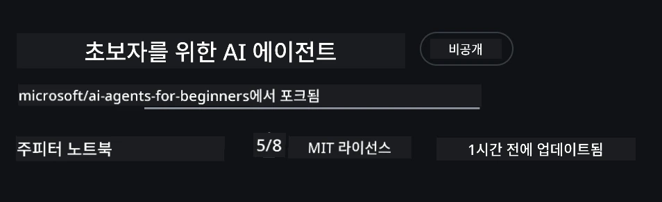

# 강의 설정

## 소개

이 강의에서는 본 과정의 코드 샘플을 실행하는 방법을 다룹니다.

## 다른 학습자와 함께하고 도움 받기

레포를 클론하기 전에, [AI Agents For Beginners Discord 채널](https://aka.ms/ai-agents/discord)에 참여하여 설정 관련 도움을 받거나 강의에 관한 질문을 하거나 다른 학습자와 교류하세요.

## 이 레포를 클론하거나 포크하기

시작하려면 GitHub 레포지토리를 클론하거나 포크하세요. 이렇게 하면 강의 자료의 자신의 버전을 만들어 코드를 실행, 테스트, 조정할 수 있습니다!

<a href="https://github.com/microsoft/ai-agents-for-beginners/fork" target="_blank">레포 포크하기</a> 링크를 클릭하여 수행할 수 있습니다.

다음 링크에서 이제 이 강의의 자신만의 포크된 버전을 볼 수 있습니다.



### 얕은 클론(워크숍 / Codespaces에 권장)

> 전체 레포지토리는 전체 히스토리와 모든 파일을 다운로드하면 크기가 클 수 있습니다 (~3GB). 워크숍에만 참석하거나 몇몇 강의 폴더만 필요하면, 얕은 클론(또는 sparse clone)을 사용하면 히스토리를 잘라내거나 blob을 건너뛰어 대부분의 다운로드를 줄일 수 있습니다.

#### 빠른 얕은 클론 — 최소 히스토리, 모든 파일

아래 명령어에서 `<your-username>`을 자신의 포크 URL(또는 원본 URL)로 바꾸세요.

최신 커밋 히스토리만 클론하려면 (파일은 작게 다운로드됨):

```bash|powershell
git clone --depth 1 https://github.com/<your-username>/ai-agents-for-beginners.git
```

특정 브랜치를 클론하려면:

```bash|powershell
git clone --depth 1 --branch <branch-name> https://github.com/<your-username>/ai-agents-for-beginners.git
```

#### 부분(스패스) 클론 — 최소 blob + 선택한 폴더만

이 방법은 부분 클론과 sparse-checkout을 사용합니다(필요 조건: Git 2.25+ 및 부분 클론 지원이 있는 최신 Git 권장):

```bash|powershell
git clone --depth 1 --filter=blob:none --sparse https://github.com/<your-username>/ai-agents-for-beginners.git
```

레포 폴더로 이동:

```bash|powershell
cd ai-agents-for-beginners
```

그 후 필요한 폴더를 지정하세요(아래 예시는 두 폴더):

```bash|powershell
git sparse-checkout set 00-course-setup 01-intro-to-ai-agents
```

클론 후 파일을 확인하고 git 히스토리가 필요 없고 용량을 확보하려면 레포지토리 메타데이터를 삭제하세요(💀복구 불가 — 커밋, pull, push, 히스토리 접근 모두 삭제됨).

```bash
# zsh/bash
rm -rf .git
```

```powershell
# 파워셸
Remove-Item -Recurse -Force .git
```

#### GitHub Codespaces 사용하기 (로컬 대용량 다운로드 방지 권장)

- [GitHub UI](https://github.com/codespaces)를 통해 이 레포에 대해 새 Codespace를 만듭니다.

- 새 Codespace 터미널에서 위 얕은 클론 / sparse 클론 명령 중 하나를 실행해 필요한 강의 폴더만 Codespace 작업공간에 가져옵니다.
- 선택 사항: Codespaces 내에서 클론 후 .git을 제거하여 공간 확보하세요(위 삭제 명령 참고).
- 참고: 레포를 Codespaces에서 직접 열 경우(추가 클론 없이), Codespaces는 devcontainer 환경을 구축하므로 필요 이상으로 더 많은 리소스를 사용할 수 있습니다. 새로운 Codespace 내에서 얕은 복사본을 클론하면 디스크 사용량을 더 잘 제어할 수 있습니다.

#### 팁

- 코드를 수정/커밋하려면 클론 URL을 항상 자신의 포크로 바꾸세요.
- 더 많은 히스토리나 파일이 나중에 필요하면 fetch하거나 sparse-checkout 구성을 조정해 추가 폴더를 포함할 수 있습니다.

## 코드 실행

이 과정은 AI 에이전트를 만드는 실습 경험을 얻을 수 있도록 Jupyter 노트북 시리즈를 제공합니다.

코드 샘플은 `AzureAIProjectAgentProvider`를 사용하는 <strong>Microsoft Agent Framework (MAF)</strong>를 사용하며, 이는 <strong>Microsoft Foundry</strong>를 통해 **Azure AI Agent Service V2**(Responses API)에 연결합니다.

모든 Python 노트북은 `*-python-agent-framework.ipynb`로 레이블링되어 있습니다.

## 요구 사항

- Python 3.12+
  - <strong>참고</strong>: Python 3.12가 설치되어 있지 않으면 설치하세요. 그런 다음 python3.12로 venv를 만들어 `requirements.txt`에 명시된 정확한 버전이 설치되도록 합니다.
  
    >예시

    Python venv 디렉터리 생성:

    ```bash|powershell
    python -m venv venv
    ```

    그런 다음 다음 명령으로 venv 활성화:

    ```bash
    # zsh/bash
    source venv/bin/activate
    ```
  
    ```dos
    # Command Prompt for Windows
    venv\Scripts\activate
    ```

- .NET 10+: .NET을 사용하는 샘플 코드용으로 [.NET 10 SDK](https://dotnet.microsoft.com/download/dotnet/10.0) 이상을 설치하세요. 설치된 .NET SDK 버전을 확인하려면:

    ```bash|powershell
    dotnet --list-sdks
    ```

- **Azure CLI** — 인증용으로 필요합니다. [aka.ms/installazurecli](https://aka.ms/installazurecli)에서 설치하세요.
- **Azure 구독** — Microsoft Foundry와 Azure AI Agent Service에 액세스할 구독입니다.
- **Microsoft Foundry 프로젝트** — 배포된 모델(예: `gpt-4o`)이 포함된 프로젝트입니다. 아래 [Step 1](#1단계-microsoft-foundry-프로젝트-만들기) 참조.

레포지토리 루트에 코드 샘플 실행에 필요한 모든 Python 패키지가 포함된 `requirements.txt` 파일이 있습니다.

레포 루트에서 다음 명령을 터미널에 입력하면 설치할 수 있습니다:

```bash|powershell
pip install -r requirements.txt
```

충돌과 문제 방지를 위해 Python 가상 환경을 만드는 것을 권장합니다.

## VSCode 설정

VSCode에서 올바른 버전의 Python을 사용하고 있는지 확인하세요.


## Microsoft Foundry 및 Azure AI Agent Service 설정

### 1단계: Microsoft Foundry 프로젝트 만들기

노트북을 실행하려면 Azure AI Foundry <strong>허브(hub)</strong>와 배포된 모델을 포함하는 <strong>프로젝트</strong>가 필요합니다.

1. [ai.azure.com](https://ai.azure.com)으로 이동하여 Azure 계정으로 로그인합니다.
2. <strong>허브</strong>를 만듭니다(또는 기존 허브를 사용). 자세한 내용은: [허브 리소스 개요](https://learn.microsoft.com/azure/ai-foundry/concepts/ai-resources)를 참조하세요.
3. 허브 내에서 <strong>프로젝트</strong>를 생성합니다.
4. **Models + Endpoints** → <strong>Deploy model</strong>에서 모델(예: `gpt-4o`)을 배포합니다.

### 2단계: 프로젝트 엔드포인트 및 모델 배포 이름 확인

Microsoft Foundry 포털 내 프로젝트에서:

- **프로젝트 엔드포인트** — **Overview** 페이지로 이동하여 엔드포인트 URL을 복사합니다.


- **모델 배포 이름** — <strong>Models + Endpoints</strong>로 이동 후 배포된 모델을 선택하고 **Deployment name**(예: `gpt-4o`)을 확인합니다.

### 3단계: `az login`으로 Azure에 로그인

모든 노트북은 인증에 **`AzureCliCredential`**을 사용하므로 API 키를 별도로 관리할 필요 없습니다. 이를 위해 Azure CLI로 로그인해야 합니다.

1. Azure CLI가 설치되어 있지 않으면 설치하세요: [aka.ms/installazurecli](https://aka.ms/installazurecli)

2. 다음 명령으로 로그인:

    ```bash|powershell
    az login
    ```

    또는 브라우저가 없는 원격/Codespace 환경이라면:

    ```bash|powershell
    az login --use-device-code
    ```

3. 메시지가 나타나면 구독을 선택하세요 — Foundry 프로젝트가 포함된 구독을 선택합니다.

4. 로그인 상태 확인:

    ```bash|powershell
    az account show
    ```

> **왜 `az login`인가요?** 노트북은 `azure-identity` 패키지의 `AzureCliCredential`을 통해 인증됩니다. 즉, Azure CLI 세션이 인증 정보를 제공하므로 `.env` 파일에 API 키나 비밀을 저장할 필요가 없습니다. 이는 [보안 모범 사례](https://learn.microsoft.com/azure/developer/ai/keyless-connections)입니다.

### 4단계: `.env` 파일 만들기

샘플 파일 복사:

```bash
# zsh/bash
cp .env.example .env
```

```powershell
# 파워셸
Copy-Item .env.example .env
```

`.env` 파일을 열어 두 값을 채우세요:

```env
AZURE_AI_PROJECT_ENDPOINT=https://<your-project>.services.ai.azure.com/api/projects/<your-project-id>
AZURE_AI_MODEL_DEPLOYMENT_NAME=gpt-4o
```

| 변수 | 위치 |
|----------|-----------------|
| `AZURE_AI_PROJECT_ENDPOINT` | Foundry 포털 → 프로젝트 → **Overview** 페이지 |
| `AZURE_AI_MODEL_DEPLOYMENT_NAME` | Foundry 포털 → **Models + Endpoints** → 배포된 모델 이름 |

대부분의 강의는 여기까지입니다! 노트북은 `az login` 세션을 통해 자동으로 인증합니다.

### 5단계: Python 의존성 설치

```bash|powershell
pip install -r requirements.txt
```

앞에서 만든 가상 환경 내에서 실행하는 것을 권장합니다.

## 5강 추가 설정 (Agentic RAG)

5강은 검색 강화 생성(RAG)에 <strong>Azure AI Search</strong>를 사용합니다. 해당 강의를 실행하려면 `.env` 파일에 다음 변수를 추가하세요:

| 변수 | 위치 |
|----------|-----------------|
| `AZURE_SEARCH_SERVICE_ENDPOINT` | Azure 포털 → **Azure AI Search** 리소스 → <strong>개요</strong> → URL |
| `AZURE_SEARCH_API_KEY` | Azure 포털 → **Azure AI Search** 리소스 → <strong>설정</strong> → <strong>키</strong> → 주 관리자 키 |

## 6강 및 8강 추가 설정 (GitHub 모델)

6강 및 8강의 일부 노트북은 Azure AI Foundry 대신 <strong>GitHub Models</strong>를 사용합니다. 이 샘플을 실행하려면 `.env` 파일에 아래 변수를 추가하세요:

| 변수 | 위치 |
|----------|-----------------|
| `GITHUB_TOKEN` | GitHub → <strong>설정</strong> → **개발자 설정** → **개인 액세스 토큰** |
| `GITHUB_ENDPOINT` | 기본값으로 `https://models.inference.ai.azure.com` 사용 |
| `GITHUB_MODEL_ID` | 사용할 모델 이름 (예: `gpt-4o-mini`) |

## 대체 공급자: MiniMax (OpenAI 호환)

[MiniMax](https://platform.minimaxi.com/)는 204K 토큰까지 대용량 컨텍스트 모델을 OpenAI 호환 API로 제공합니다. Microsoft Agent Framework의 `OpenAIChatClient`는 OpenAI 호환 엔드포인트에서 작동하므로 MiniMax를 GitHub Models 또는 OpenAI 대체로 사용할 수 있습니다.

`.env` 파일에 다음 변수를 추가하세요:

| 변수 | 위치 |
|----------|-----------------|
| `MINIMAX_API_KEY` | [MiniMax Platform](https://platform.minimaxi.com/) → API 키 |
| `MINIMAX_BASE_URL` | 기본값으로 `https://api.minimax.io/v1` 사용 |
| `MINIMAX_MODEL_ID` | 사용할 모델 이름 (예: `MiniMax-M2.7`) |

**사용 가능 모델**: `MiniMax-M2.7` (권장), `MiniMax-M2.7-highspeed` (더 빠른 응답)

`OpenAIChatClient`를 사용하는 코드 샘플(예: 14강 호텔 예약 워크플로우)은 `MINIMAX_API_KEY`가 설정되면 MiniMax 구성을 자동으로 감지하여 사용합니다.

## 8강 추가 설정 (Bing 이음새 워크플로우)

8강 조건부 워크플로우 노트북은 Azure AI Foundry를 통한 <strong>Bing 이음새</strong>를 사용합니다. 해당 샘플을 실행하려면 `.env` 파일에 다음 변수를 추가하세요:

| 변수 | 위치 |
|----------|-----------------|
| `BING_CONNECTION_ID` | Azure AI Foundry 포털 → 프로젝트 → <strong>관리</strong> → **연결된 리소스** → Bing 연결 → 연결 ID 복사 |

## 문제 해결

### macOS에서 SSL 인증서 검사 오류

macOS에서 다음과 같은 오류가 발생할 수 있습니다:

```plaintext
ssl.SSLCertVerificationError: [SSL: CERTIFICATE_VERIFY_FAILED] certificate verify failed: self-signed certificate in certificate chain
```

이는 macOS Python에서 시스템 SSL 인증서를 자동으로 신뢰하지 않는 알려진 문제입니다. 아래 해결방법을 순서대로 시도하세요:

**옵션 1: Python 설치 시 제공된 인증서 설치 스크립트 실행(권장)**

```bash
# 설치한 파이썬 버전(예: 3.12 또는 3.13)으로 3.XX를 교체하세요:
/Applications/Python\ 3.XX/Install\ Certificates.command
```

**옵션 2: 노트북에서 `connection_verify=False` 옵션 사용(오직 GitHub Models 노트북 전용)**

6강 노트북(`06-building-trustworthy-agents/code_samples/06-system-message-framework.ipynb`)에 주석 처리된 해결책이 포함되어 있습니다. 클라이언트 생성 시 `connection_verify=False` 주석을 해제하세요:

```python
client = ChatCompletionsClient(
    endpoint=endpoint,
    credential=AzureKeyCredential(token),
    connection_verify=False,  # 인증서 오류가 발생하는 경우 SSL 검증을 비활성화하세요
)
```

> **⚠️ 경고:** SSL 검증을 비활성화(`connection_verify=False`)하면 인증서 검증 단계를 건너뛰어 보안이 약화됩니다. 개발 환경에서 일시적 해결책으로만 사용하고, 운영 환경에서는 절대 사용하지 마세요.

**옵션 3: `truststore` 설치 및 사용**

```bash
pip install truststore
```

그런 다음 네트워크 호출 전에 노트북이나 스크립트 상단에 다음을 추가하세요:

```python
import truststore
truststore.inject_into_ssl()
```

## 어디에서 막혔나요?

설정 실행에 문제가 있으면 <a href="https://discord.gg/kzRShWzttr" target="_blank">Azure AI 커뮤니티 Discord</a>에 참여하거나 <a href="https://github.com/microsoft/ai-agents-for-beginners/issues?WT.mc_id=academic-105485-koreyst" target="_blank">이슈를 생성</a>하세요.

## 다음 강의

이제 본 과정의 코드를 실행할 준비가 되었습니다. AI 에이전트 세계를 더욱 즐겁게 배우세요!

[AI 에이전트 소개 및 활용 사례](../01-intro-to-ai-agents/README.md)

---

<!-- CO-OP TRANSLATOR DISCLAIMER START -->
**면책 조항**:  
이 문서는 AI 번역 서비스 [Co-op Translator](https://github.com/Azure/co-op-translator)를 사용하여 번역되었습니다. 정확성을 위해 노력하고 있으나, 자동 번역에는 오류나 부정확한 내용이 포함될 수 있으니 참고하시기 바랍니다. 원문 문서가 권위 있는 출처로 간주되어야 합니다. 중요한 정보에 대해서는 전문적인 인간 번역을 권장합니다. 본 번역의 사용으로 발생하는 오해나 잘못된 해석에 대해 당사는 책임지지 않습니다.
<!-- CO-OP TRANSLATOR DISCLAIMER END -->