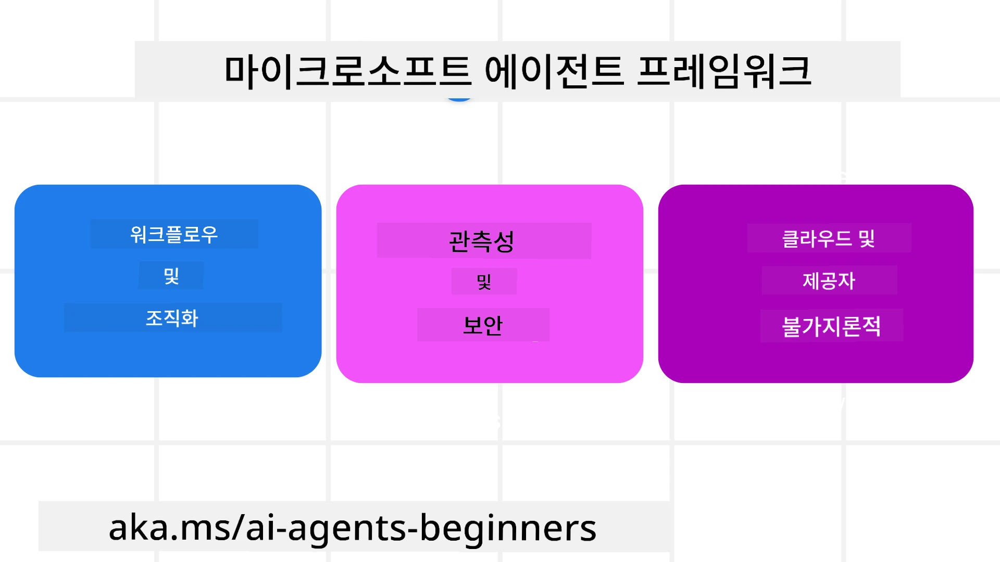
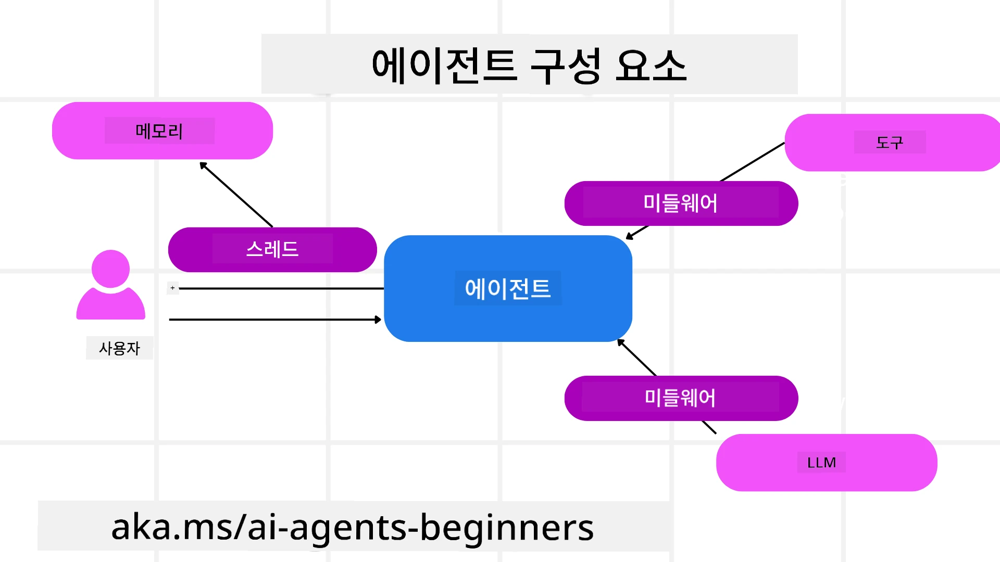

# 마이크로소프트 에이전트 프레임워크 탐색하기


### 소개

이 수업에서 다룰 내용:

- 마이크로소프트 에이전트 프레임워크 이해하기: 주요 기능과 가치  
- 마이크로소프트 에이전트 프레임워크의 핵심 개념 탐색하기
- 고급 MAF 패턴: 워크플로우, 미들웨어, 메모리

## 학습 목표

이 수업을 마친 후에는 다음을 할 수 있습니다:

- 마이크로소프트 에이전트 프레임워크를 사용하여 프로덕션 준비된 AI 에이전트 구축
- 에이전트의 핵심 기능을 에이전트 사용 사례에 적용
- 워크플로우, 미들웨어, 관찰 가능성 포함한 고급 패턴 사용

## 코드 샘플

[Microsoft Agent Framework (MAF)](https://aka.ms/ai-agents-beginners/agent-framewrok)에 대한 코드 샘플은 이 저장소의 `xx-python-agent-framework` 및 `xx-dotnet-agent-framework` 파일에 있습니다.

## 마이크로소프트 에이전트 프레임워크 이해하기



[Microsoft Agent Framework (MAF)](https://aka.ms/ai-agents-beginners/agent-framewrok)는 AI 에이전트를 구축하기 위한 마이크로소프트의 통합 프레임워크입니다. 프로덕션과 연구 환경 모두에서 다양한 에이전트 사용 사례를 다룰 수 있는 유연성을 제공합니다:

- 단계별 워크플로우가 필요한 시나리오에서의 **순차적 에이전트 오케스트레이션**
- 에이전트가 동시에 작업을 완료해야 하는 시나리오에서의 **동시 오케스트레이션**
- 에이전트들이 하나의 작업을 함께 협력하는 시나리오에서의 **그룹 채팅 오케스트레이션**
- 하위 작업이 완료될 때 에이전트가 서로 작업을 넘기는 시나리오에서의 **전달 오케스트레이션**
- 매니저 에이전트가 작업 목록을 만들고 수정하며 하위 에이전트를 조정하여 작업을 완료하는 시나리오에서의 **마그네틱 오케스트레이션**

프로덕션에서 AI 에이전트를 제공하기 위해 MAF는 다음 기능도 포함합니다:

- AI 에이전트의 모든 행동(도구 호출, 오케스트레이션 단계, 추론 흐름 및 Microsoft Foundry 대시보드를 통한 성능 모니터링)을 OpenTelemetry를 통해 제공하는 **관찰 가능성**
- 역할 기반 접근 제어, 개인 데이터 처리 및 내장 안전 콘텐츠 등 보안 제어를 포함한 Microsoft Foundry에 에이전트를 네이티브로 호스팅하는 <strong>보안</strong>
- 에이전트 스레드와 워크플로우가 일시 중지, 재개 및 오류 복구가 가능하여 장시간 실행 프로세스를 구현하는 <strong>내구성</strong>
- 사람이 작업 승인 필요로 표시된 작업에 대해 인간이 개입하는 워크플로우를 지원하는 <strong>통제</strong>

마이크로소프트 에이전트 프레임워크는 상호 운용성에도 중점을 둡니다:

- **클라우드 독립적** - 컨테이너, 온프레미스 및 여러 클라우드 환경에서 에이전트 실행 가능
- **공급자 독립적** - Azure OpenAI, OpenAI 등 선호하는 SDK를 통해 에이전트 생성 가능
- **오픈 표준 통합** - 에이전트-간(A2A) 및 모델 컨텍스트 프로토콜(MCP)과 같은 프로토콜을 활용하여 다른 에이전트 및 도구 발견 및 사용 가능
- **플러그인 및 커넥터** - Microsoft Fabric, SharePoint, Pinecone, Qdrant와 같은 데이터 및 메모리 서비스 연결 가능

이제 이러한 기능들이 마이크로소프트 에이전트 프레임워크의 핵심 개념에 어떻게 적용되는지 살펴보겠습니다.

## 마이크로소프트 에이전트 프레임워크의 핵심 개념

### 에이전트



**에이전트 생성하기**

에이전트는 추론 서비스(LLM 제공자), AI 에이전트가 따를 명령 집합, 그리고 할당된 `name`을 정의하여 생성합니다:

```python
agent = AzureOpenAIChatClient(credential=AzureCliCredential()).create_agent( instructions="You are good at recommending trips to customers based on their preferences.", name="TripRecommender" )
```

위 예시는 `Azure OpenAI`를 사용하지만, `Microsoft Foundry Agent Service` 등 다양한 서비스로 에이전트를 생성할 수 있습니다:

```python
AzureAIAgentClient(async_credential=credential).create_agent( name="HelperAgent", instructions="You are a helpful assistant." ) as agent
```

OpenAI의 `Responses`, `ChatCompletion` API

```python
agent = OpenAIResponsesClient().create_agent( name="WeatherBot", instructions="You are a helpful weather assistant.", )
```

```python
agent = OpenAIChatClient().create_agent( name="HelpfulAssistant", instructions="You are a helpful assistant.", )
```

또는 큰 컨텍스트 윈도우(최대 204K 토큰)를 제공하는 OpenAI 호환 API인 [MiniMax](https://platform.minimaxi.com/)도 가능합니다:

```python
agent = OpenAIChatClient(base_url="https://api.minimax.io/v1", api_key=os.environ["MINIMAX_API_KEY"], model_id="MiniMax-M2.7").create_agent( name="HelpfulAssistant", instructions="You are a helpful assistant.", )
```

또는 A2A 프로토콜을 사용하는 원격 에이전트도 있습니다:

```python
agent = A2AAgent( name=agent_card.name, description=agent_card.description, agent_card=agent_card, url="https://your-a2a-agent-host" )
```

**에이전트 실행하기**

에이전트는 비스트리밍 또는 스트리밍 응답을 위해 `.run` 또는 `.run_stream` 메서드로 실행합니다.

```python
result = await agent.run("What are good places to visit in Amsterdam?")
print(result.text)
```

```python
async for update in agent.run_stream("What are the good places to visit in Amsterdam?"):
    if update.text:
        print(update.text, end="", flush=True)

```

각 에이전트 실행은 에이전트가 사용할 `max_tokens`, 호출할 수 있는 `tools`, 심지어 에이전트에 사용되는 `model` 등의 매개변수를 사용자 정의할 수 있습니다.

이는 사용자의 작업 완료를 위한 특정 모델이나 도구가 필요한 경우에 유용합니다.

<strong>도구</strong>

도구는 에이전트 정의 시에:

```python
def get_attractions( location: Annotated[str, Field(description="The location to get the top tourist attractions for")], ) -> str: """Get the top tourist attractions for a given location.""" return f"The top attractions for {location} are." 


# ChatAgent를 직접 생성할 때

agent = ChatAgent( chat_client=OpenAIChatClient(), instructions="You are a helpful assistant", tools=[get_attractions]

```

또는 에이전트 실행 시에:

```python

result1 = await agent.run( "What's the best place to visit in Seattle?", tools=[get_attractions] # 이 실행에서만 제공되는 도구 )
```

정의할 수 있습니다.

**에이전트 스레드**

에이전트 스레드는 다중 턴 대화를 처리하는 데 사용됩니다. 스레드는 다음 방법 중 하나로 생성할 수 있습니다:

- 시간이 지남에 따라 스레드가 저장되도록 하는 `get_new_thread()`
- 에이전트 실행 시 자동으로 스레드를 생성하고 현재 실행 기간 동안만 유지

스레드 생성 코드는 다음과 같습니다:

```python
# 새 스레드를 만듭니다.
thread = agent.get_new_thread() # 스레드로 에이전트를 실행합니다.
response = await agent.run("Hello, I am here to help you book travel. Where would you like to go?", thread=thread)

```

그 후 스레드를 직렬화하여 나중에 저장할 수 있습니다:

```python
# 새 스레드를 생성합니다.
thread = agent.get_new_thread() 

# 스레드와 함께 에이전트를 실행합니다.

response = await agent.run("Hello, how are you?", thread=thread) 

# 저장을 위해 스레드를 직렬화합니다.

serialized_thread = await thread.serialize() 

# 저장소에서 불러온 후 스레드 상태를 역직렬화합니다.

resumed_thread = await agent.deserialize_thread(serialized_thread)
```

**에이전트 미들웨어**

에이전트는 도구와 LLM과 상호 작용하여 사용자의 작업을 완료합니다. 특정 시나리오에서 이 상호작용 사이에 작업을 실행하거나 추적하려면 에이전트 미들웨어를 사용합니다:

*함수 미들웨어*

이 미들웨어는 에이전트와 호출할 함수/도구 사이에서 작업을 실행할 수 있게 합니다. 예를 들어 함수 호출 시 로깅을 수행할 때 쓸 수 있습니다.

아래 코드에서 `next`는 다음 미들웨어 또는 실제 함수를 호출할지를 정의합니다.

```python
async def logging_function_middleware(
    context: FunctionInvocationContext,
    next: Callable[[FunctionInvocationContext], Awaitable[None]],
) -> None:
    """Function middleware that logs function execution."""
    # 전처리: 함수 실행 전 로그
    print(f"[Function] Calling {context.function.name}")

    # 다음 미들웨어 또는 함수 실행 계속
    await next(context)

    # 후처리: 함수 실행 후 로그
    print(f"[Function] {context.function.name} completed")
```

*채팅 미들웨어*

이 미들웨어는 에이전트와 LLM 간 요청 사이에서 작업을 실행하거나 로그할 수 있게 합니다.

이곳에는 AI 서비스에 보내지는 `messages`와 같은 중요한 정보가 포함됩니다.

```python
async def logging_chat_middleware(
    context: ChatContext,
    next: Callable[[ChatContext], Awaitable[None]],
) -> None:
    """Chat middleware that logs AI interactions."""
    # 전처리: AI 호출 전 로그
    print(f"[Chat] Sending {len(context.messages)} messages to AI")

    # 다음 미들웨어 또는 AI 서비스로 계속 진행
    await next(context)

    # 후처리: AI 응답 후 로그
    print("[Chat] AI response received")

```

**에이전트 메모리**

`Agentic Memory` 수업에서 다뤘듯이, 메모리는 에이전트가 다양한 문맥에서 작동할 수 있게 하는 중요한 요소입니다. MAF는 여러 유형의 메모리를 제공합니다:

*인메모리 저장*

애플리케이션 실행 중 스레드에 저장되는 메모리입니다.

```python
# 새 스레드를 만듭니다.
thread = agent.get_new_thread() # 해당 스레드로 에이전트를 실행합니다.
response = await agent.run("Hello, I am here to help you book travel. Where would you like to go?", thread=thread)
```

*지속 메시지*

서로 다른 세션 간 대화 기록을 저장할 때 사용됩니다. `chat_message_store_factory`를 사용해 정의됩니다:

```python
from agent_framework import ChatMessageStore

# 사용자 정의 메시지 저장소 생성
def create_message_store():
    return ChatMessageStore()

agent = ChatAgent(
    chat_client=OpenAIChatClient(),
    instructions="You are a Travel assistant.",
    chat_message_store_factory=create_message_store
)

```

*동적 메모리*

에이전트 실행 전에 컨텍스트에 추가되는 메모리입니다. mem0 등의 외부 서비스에 저장할 수 있습니다:

```python
from agent_framework.mem0 import Mem0Provider

# 고급 메모리 기능을 위해 Mem0 사용
memory_provider = Mem0Provider(
    api_key="your-mem0-api-key",
    user_id="user_123",
    application_id="my_app"
)

agent = ChatAgent(
    chat_client=OpenAIChatClient(),
    instructions="You are a helpful assistant with memory.",
    context_providers=memory_provider
)

```

**에이전트 관찰 가능성**

관찰 가능성은 신뢰할 수 있고 유지 관리가 용이한 에이전트 시스템 구축에 중요합니다. MAF는 추적과 미터를 제공하기 위해 OpenTelemetry와 통합됩니다.

```python
from agent_framework.observability import get_tracer, get_meter

tracer = get_tracer()
meter = get_meter()
with tracer.start_as_current_span("my_custom_span"):
    # 무언가를 하다
    pass
counter = meter.create_counter("my_custom_counter")
counter.add(1, {"key": "value"})
```

### 워크플로우

MAF는 사전 정의된 단계로 작업을 완료하고 이 단계들에 AI 에이전트를 포함하는 워크플로우를 제공합니다.

워크플로우는 더 나은 제어 흐름을 위해 다양한 구성 요소로 이루어져 있습니다. 또한 워크플로우는 <strong>다중 에이전트 오케스트레이션</strong>과 **워크플로우 상태 저장(checkpointing)** 을 지원합니다.

워크플로우의 핵심 구성 요소는 다음과 같습니다:

<strong>실행자</strong>

실행자는 입력 메시지를 받고, 할당된 작업을 수행하며, 출력 메시지를 생성합니다. 이는 워크플로우를 더 큰 작업 완료로 진행시킵니다. 실행자는 AI 에이전트나 사용자 정의 로직일 수 있습니다.

<strong>에지</strong>

에지는 워크플로우 내 메시지 흐름을 정의하는 데 사용됩니다. 다음과 같은 유형이 있습니다:

*직접 에지* - 실행자들 간 단순 1:1 연결:

```python
from agent_framework import WorkflowBuilder

builder = WorkflowBuilder()
builder.add_edge(source_executor, target_executor)
builder.set_start_executor(source_executor)
workflow = builder.build()
```

*조건부 에지* - 특정 조건이 충족된 후 활성화됩니다. 예를 들어, 호텔 객실이 없을 경우 실행자가 다른 옵션을 제시할 수 있습니다.

*스위치-케이스 에지* - 정의된 조건에 따라 메시지를 다른 실행자에게 라우팅합니다. 예를 들어, 여행 고객이 우선 접근 권한이 있을 때 작업이 다른 워크플로우를 통해 처리됩니다.

*팬아웃 에지* - 하나의 메시지를 여러 대상에게 전송.

*팬인 에지* - 여러 실행자로부터 메시지를 수집하여 하나의 대상으로 전송.

<strong>이벤트</strong>

워크플로우의 관찰 가능성을 높이기 위해 MAF는 다음과 같은 실행 이벤트를 제공합니다:

- `WorkflowStartedEvent`  - 워크플로우 실행 시작
- `WorkflowOutputEvent` - 워크플로우 출력 생성
- `WorkflowErrorEvent` - 워크플로우에서 오류 발생
- `ExecutorInvokeEvent`  - 실행자 작업 시작
- `ExecutorCompleteEvent`  - 실행자 작업 완료
- `RequestInfoEvent` - 요청이 발행됨

## 고급 MAF 패턴

위의 섹션에서는 마이크로소프트 에이전트 프레임워크의 핵심 개념을 다뤘습니다. 더 복잡한 에이전트를 구축하면서 고려할 고급 패턴은 다음과 같습니다:

- **미들웨어 구성**: 함수 및 채팅 미들웨어를 사용하여 여러 미들웨어 핸들러(로깅, 인증, 속도 제한)를 체인으로 연결해 에이전트 동작을 정밀 제어.
- **워크플로우 체크포인팅**: 워크플로우 이벤트 및 직렬화를 활용해 장시간 실행되는 에이전트 프로세스를 저장하고 재개.
- **동적 도구 선택**: 도구 설명에 대한 RAG와 MAF의 도구 등록을 결합해 쿼리당 관련 도구만 제시.
- **다중 에이전트 핸드오프**: 워크플로우 에지 및 조건부 라우팅을 사용해 전문화된 에이전트 간 핸드오프 오케스트레이션.

## 코드 샘플

마이크로소프트 에이전트 프레임워크에 대한 코드 샘플은 이 저장소의 `xx-python-agent-framework` 및 `xx-dotnet-agent-framework` 파일에 있습니다.

## 마이크로소프트 에이전트 프레임워크에 대해 더 궁금하세요?

[Microsoft Foundry Discord](https://aka.ms/ai-agents/discord)에 참여하세요. 다른 학습자들과 만나고, 오피스아워에 참석하며, AI 에이전트 관련 질문에 대한 답변을 얻을 수 있습니다.

---

<!-- CO-OP TRANSLATOR DISCLAIMER START -->
**면책 조항**:  
이 문서는 AI 번역 서비스 [Co-op Translator](https://github.com/Azure/co-op-translator)를 사용하여 번역되었습니다. 정확성을 위해 노력하고 있으나, 자동 번역에는 오류나 부정확성이 포함될 수 있음을 알려드립니다. 원문 문서는 항상 권위 있는 원본으로 간주되어야 합니다. 중요한 정보의 경우 전문적인 인간 번역을 권장합니다. 본 번역 사용으로 인한 오해나 잘못된 해석에 대해 당사는 책임을 지지 않습니다.
<!-- CO-OP TRANSLATOR DISCLAIMER END -->