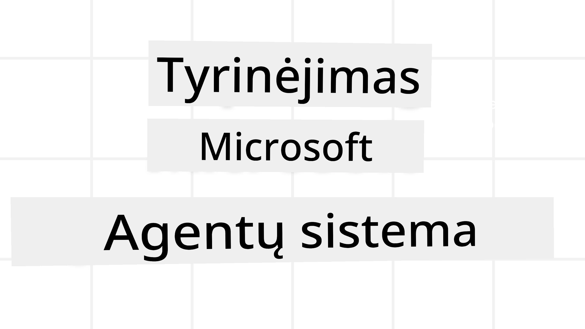
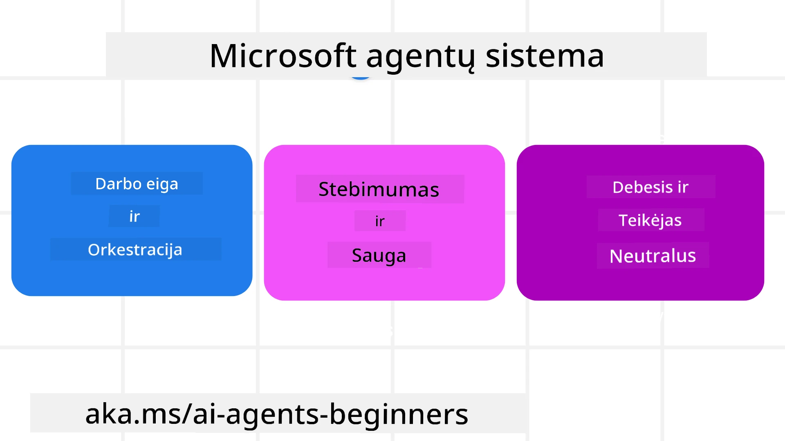

# Naršymas po Microsoft Agent Framework



### Įvadas

Ši pamoka apims:

- Microsoft Agent Framework supratimas: pagrindinės savybės ir vertė  
- Microsoft Agent Framework pagrindinių sąvokų tyrinėjimas
- Išplėstiniai MAF modeliai: darbo eiga, tarpinis programinis sluoksnis ir atmintis

## Mokymosi tikslai

Baigę šią pamoką, jūs gebėsite:

- Kurti gamybai paruoštus AI agentus naudojant Microsoft Agent Framework
- Taikyti pagrindines Microsoft Agent Framework funkcijas savo agentūriniams naudojimo atvejams
- Naudoti pažangius modelius, įskaitant darbo eigas, tarpinį programinį sluoksnį ir stebėjimą

## Kodo pavyzdžiai 

[Microsoft Agent Framework (MAF)](https://aka.ms/ai-agents-beginners/agent-framewrok) kodo pavyzdžiai saugomi šiame saugykloje, faileose `xx-python-agent-framework` ir `xx-dotnet-agent-framework`.

## Microsoft Agent Framework supratimas



[Microsoft Agent Framework (MAF)](https://aka.ms/ai-agents-beginners/agent-framewrok) yra Microsoft vieningas karkasas AI agentams kurti. Jis suteikia lankstumą sprendžiant įvairius agentūrinius naudojimo atvejus, pasitaikančius tiek gamyboje, tiek tyrimuose, pavyzdžiui:

- **Sekveninė agentų koordinacija** scenarijuose, kur reikalinga veiksmų vykdymo tvarka.
- **Lygiagretus koordinavimas** scenarijuose, kai agentai turi atlikti užduotis vienu metu.
- **Grupinės pokalbių koordinacija** scenarijuose, kur agentai gali bendradarbiauti atliekant vieną užduotį.
- **Perdavimų koordinacija** scenarijuose, kai agentai perduoda užduotį vienas kitam, kai poskaičiai yra užbaigti.
- **Magnetinė koordinacija** scenarijuose, kai valdymo agentas kuria ir keičia užduočių sąrašą bei valdo subagentų koordinavimą užduočiai atlikti.

Kad AI agentai veiktų gamyboje, MAF taip pat turi funkcijas:

- **Stebimumas** naudojant OpenTelemetry, kur kiekvienas AI agento veiksmas, įskaitant įrankių kvietimus, koordinavimo veiksmus, sprendimų srautus ir veiklos stebėjimą per Microsoft Foundry informacinius skydelius, yra stebimas.
- **Saugumas** įdiegtas naudojant Microsoft Foundry vietinį talpinimą, kuris apima saugumo valdymą, pvz., vaidmenų pagrindu paremtą prieigą, privačių duomenų tvarkymą ir įmontuotą turinio saugumą.
- **Ilgaamžiškumas** - agentų gijos ir darbo eigos gali pristabdyti, tęsti ir atkurti klaidas, leidžiančias vykdyti ilgesnius procesus.
- **Valdymas** - palaikomi žmogaus dalyvavimo darbo eiga, kur užduotys žymimos kaip reikalaujančios žmogaus patvirtinimo.

Microsoft Agent Framework taip pat pabrėžia suderinamumą:

- **Debesų nepriklausomumas** – agentai gali veikti konteineriuose, vietinėje infrastruktūroje ir keliuose debesis.
- **Tiekėjo nepriklausomumas** – agentai gali būti kuriami naudojant pageidaujamą SDK, įskaitant Azure OpenAI ir OpenAI.
- **Atviro standarto integracija** – agentai gali naudoti tokius protokolus kaip Agent-to-Agent (A2A) ir Model Context Protocol (MCP), kad atrastų ir naudotų kitus agentus bei įrankius.
- **Plėtiniai ir jungtys** – galima jungtis prie duomenų ir atminties paslaugų, tokių kaip Microsoft Fabric, SharePoint, Pinecone ir Qdrant.

Pažvelkime, kaip šios savybės taikomos Microsoft Agent Framework pagrindinėms sąvokoms.

## Microsoft Agent Framework pagrindinės sąvokos

### Agentai


**Agentų kūrimas**

Agentų kūrimas vykdomas apibrėžiant nuspėjimo tarnybą (LLM tiekėją), instrukcijų rinkinį, kurias AI agentas turi vykdyti, ir priskirtą `name`:

```python
agent = AzureOpenAIChatClient(credential=AzureCliCredential()).create_agent( instructions="You are good at recommending trips to customers based on their preferences.", name="TripRecommender" )
```

Viršuje naudojamas `Azure OpenAI`, bet agentai gali būti kuriami naudojant įvairias paslaugas, įskaitant `Microsoft Foundry Agent Service`:

```python
AzureAIAgentClient(async_credential=credential).create_agent( name="HelperAgent", instructions="You are a helpful assistant." ) as agent
```

OpenAI `Responses`, `ChatCompletion` API

```python
agent = OpenAIResponsesClient().create_agent( name="WeatherBot", instructions="You are a helpful weather assistant.", )
```

```python
agent = OpenAIChatClient().create_agent( name="HelpfulAssistant", instructions="You are a helpful assistant.", )
```

arba [MiniMax](https://platform.minimaxi.com/), kuris teikia OpenAI suderinamą API su dideliais konteksto langais (iki 204K žetonų):

```python
agent = OpenAIChatClient(base_url="https://api.minimax.io/v1", api_key=os.environ["MINIMAX_API_KEY"], model_id="MiniMax-M2.7").create_agent( name="HelpfulAssistant", instructions="You are a helpful assistant.", )
```

arba nuotolinius agentus, naudojant A2A protokolą:

```python
agent = A2AAgent( name=agent_card.name, description=agent_card.description, agent_card=agent_card, url="https://your-a2a-agent-host" )
```

**Agentų paleidimas**

Agentai paleidžiami naudojant `.run` arba `.run_stream` metodus, pvz., ne srautiniams ar srautiniams atsakymams.

```python
result = await agent.run("What are good places to visit in Amsterdam?")
print(result.text)
```

```python
async for update in agent.run_stream("What are the good places to visit in Amsterdam?"):
    if update.text:
        print(update.text, end="", flush=True)

```

Kiekvienam agento paleidimui taip pat gali būti nustatytos pasirinktys parametrams pritaikyti, pvz., `max_tokens`, kuriuos agentas naudoja, `tools`, kuriuos agentas gali iškviesti, ir net `model`, kuri naudojama agentui.

Tai naudinga, kai specifiniai modeliai ar įrankiai yra būtini vartotojo užduočiai įvykdyti.

**Įrankiai**

Įrankiai gali būti apibrėžti tiek kuriant agentą:

```python
def get_attractions( location: Annotated[str, Field(description="The location to get the top tourist attractions for")], ) -> str: """Get the top tourist attractions for a given location.""" return f"The top attractions for {location} are." 


# Kai tiesiogiai kuriamas ChatAgent

agent = ChatAgent( chat_client=OpenAIChatClient(), instructions="You are a helpful assistant", tools=[get_attractions]

```

tiek paleidžiant agentą:

```python

result1 = await agent.run( "What's the best place to visit in Seattle?", tools=[get_attractions] # Įrankis skirtas tik šiam vykdymui )
```

**Agentų gijos**

Agentų gijos naudojamos daugiažingsnių pokalbių tvarkymui. Gijos gali būti sukuriamos:

- Naudojant `get_new_thread()`, kuris leidžia saugoti giją ilgą laiką
- Automatiškai sukuriant giją paleidžiant agentą, o gija egzistuoja tik vykdymo metu.

Gijos kūrimas atrodo taip:

```python
# Sukurkite naują giją.
thread = agent.get_new_thread() # Paleiskite agentą su gija.
response = await agent.run("Hello, I am here to help you book travel. Where would you like to go?", thread=thread)

```

Tada galite serializuoti giją, kad ją išsaugotumėte vėlesniam naudojimui:

```python
# Sukurti naują giją.
thread = agent.get_new_thread() 

# Vykdyti agentą su gija.

response = await agent.run("Hello, how are you?", thread=thread) 

# Serializuoti giją saugojimui.

serialized_thread = await thread.serialize() 

# Deserializuoti gijos būseną po įkėlimo iš saugyklos.

resumed_thread = await agent.deserialize_thread(serialized_thread)
```

**Agentų tarpinis programinis sluoksnis**

Agentai sąveikauja su įrankiais ir LLM užduočiai atlikti. Tam tikrais atvejais norime vykdyti arba stebėti vykdymą tarp šių sąveikų. Agentų tarpinis sluoksnis leidžia tai padaryti per:

*Funkcinį tarpinį programinį sluoksnį*

Šis tarpinis sluoksnis leidžia vykdyti veiksmą tarp agento ir funkcijos/įrankio, kurį agentas kvies. Pavyzdys – norint atlikti žurnalavimą funkcijos kvietimo metu.

Toliau pateiktame kode `next` nurodo, ar kviečiamas kitas tarpinio sluoksnio elementas, ar tiesioginė funkcija.

```python
async def logging_function_middleware(
    context: FunctionInvocationContext,
    next: Callable[[FunctionInvocationContext], Awaitable[None]],
) -> None:
    """Function middleware that logs function execution."""
    # Išankstinis apdorojimas: registruoti prieš funkcijos vykdymą
    print(f"[Function] Calling {context.function.name}")

    # Tęsti prie kito tarpinio programos sluoksnio arba funkcijos vykdymo
    await next(context)

    # Tolimesnis apdorojimas: registruoti po funkcijos vykdymo
    print(f"[Function] {context.function.name} completed")
```

*Pokyčių tarpinis programinis sluoksnis*

Šis sluoksnis leidžia vykdyti veiksmą arba žurnalavimą tarp agento ir užklausų LLM.

Tai apima svarbią informaciją, pvz., `messages`, kurios siunčiamos į AI tarnybą.

```python
async def logging_chat_middleware(
    context: ChatContext,
    next: Callable[[ChatContext], Awaitable[None]],
) -> None:
    """Chat middleware that logs AI interactions."""
    # Išankstinis apdorojimas: žurnalas prieš AI kvietimą
    print(f"[Chat] Sending {len(context.messages)} messages to AI")

    # Tęsti prie kito tarpinio sluoksnio arba AI paslaugos
    await next(context)

    # Po apdorojimo: žurnalas po AI atsakymo
    print("[Chat] AI response received")

```

**Agentų atmintis**

Kaip aptarta pamokoje `Agentic Memory`, atmintis yra svarbi, leidžianti agentui veikti skirtinguose kontekstuose. MAF siūlo kelias skirtingas atminties rūšis:

*Operatyvinė atmintis*

Tai atmintis, saugoma gijose programos vykdymo laikotarpiu.

```python
# Sukurkite naują giją.
thread = agent.get_new_thread() # Vykdykite agentą su šia gija.
response = await agent.run("Hello, I am here to help you book travel. Where would you like to go?", thread=thread)
```

*Nuolatinės žinutės*

Ši atmintis naudojama pokalbių istorijai saugoti skirtingose sesijose. Ji apibrėžiama naudojant `chat_message_store_factory`:

```python
from agent_framework import ChatMessageStore

# Sukurkite pasirinktinių žinučių saugyklą
def create_message_store():
    return ChatMessageStore()

agent = ChatAgent(
    chat_client=OpenAIChatClient(),
    instructions="You are a Travel assistant.",
    chat_message_store_factory=create_message_store
)

```

*Dinaminė atmintis*

Ši atmintis pridedama prie konteksto prieš paleidžiant agentus. Šią atmintį galima saugoti išorinėse paslaugose, pvz., mem0:

```python
from agent_framework.mem0 import Mem0Provider

# Naudojant Mem0 pažangioms atminties funkcijoms
memory_provider = Mem0Provider(
    api_key="your-mem0-api-key",
    user_id="user_123",
    application_id="my_app"
)

agent = ChatAgent(
    chat_client=OpenAIChatClient(),
    instructions="You are a helpful assistant with memory.",
    context_providers=memory_provider
)

```

**Agentų stebimumas**

Stebimumas yra svarbus patikimų ir prižiūrimų agentūrinių sistemų kūrimui. MAF integruojasi su OpenTelemetry, kad suteiktų sekimą ir matuoklius geresniam stebimumui.

```python
from agent_framework.observability import get_tracer, get_meter

tracer = get_tracer()
meter = get_meter()
with tracer.start_as_current_span("my_custom_span"):
    # daryti kažką
    pass
counter = meter.create_counter("my_custom_counter")
counter.add(1, {"key": "value"})
```

### Darbo eigos

MAF siūlo darbo eigas – iš anksto apibrėžtus žingsnius užduočiai atlikti, kuriose AI agentai veikia kaip komponentai.

Darbo eigos sudaro įvairūs komponentai, leidžiantys geresnį valdymo srautą. Darbo eigos taip pat palaiko **daugiagentūrę koordinaciją** ir **patikros taškus** darbo eigos būsenoms išsaugoti.

Pagrindiniai darbo eigos komponentai yra:

**Vykdytojai**

Vykdytojai priima įvesties žinutes, atlieka paskirtas užduotis ir sukuria išvesties žinutę. Tai juda darbo eigą pirmyn link didesnės užduoties užbaigimo. Vykdytojai gali būti AI agentai arba vartotojo logika.

**Kraštai**

Kraštai apibrėžia žinučių srautą darbo eigoje. Jie gali būti:

*Tiesioginiai kraštai* – paprasti vienas prie vieno ryšiai tarp vykdytojų:

```python
from agent_framework import WorkflowBuilder

builder = WorkflowBuilder()
builder.add_edge(source_executor, target_executor)
builder.set_start_executor(source_executor)
workflow = builder.build()
```

*Sąlyginiai kraštai* – aktyvuojami, kai įvykdoma tam tikra sąlyga. Pavyzdžiui, jei viešbučių kambariai nėra prieinami, vykdytojas gali pasiūlyti kitas galimybes.

*Perjungimo atvejo kraštai* – nukreipia žinutes į skirtingus vykdytojus pagal apibrėžtas sąlygas. Pavyzdžiui, jei keliautojas turi prioriteto prieigą, jo užduotys bus tvarkomos per kitą darbo eigą.

*Išskleidimo kraštai* – siunčia vieną žinutę keliems gavėjams.

*Surinkimo kraštai* – surenka kelias žinutes iš skirtingų vykdytojų ir siunčia vienam gavėjui.

**Įvykiai**

Norint geriau stebėti darbo eigas, MAF siūlo įrankius su vykdymo įvykiais, įskaitant:

- `WorkflowStartedEvent`  - pradėtas darbo eigos vykdymas
- `WorkflowOutputEvent` - darbo eiga sugeneruoja išvestį
- `WorkflowErrorEvent` - darbo eiga susiduria su klaida
- `ExecutorInvokeEvent`  - vykdytojas pradeda apdorojimą
- `ExecutorCompleteEvent`  -  vykdytojas baigia apdorojimą
- `RequestInfoEvent` - išduota užklausa

## Išplėstiniai MAF modeliai

Aukščiau aprašytos pagrindinės Microsoft Agent Framework sąvokos. Kuriant sudėtingesnius agentus, verta apsvarstyti šiuos išplėstinius modelius:

- **Tarpinių sluoksnių sudėtis**: grandininis kelių tarpinio sluoksnio tvarkyklių (žurnalavimas, autentifikacija, užklausų ribojimas) naudojimas per funkcijų ir pokalbių tarpinį sluoksnį smulkesniam agentų elgesio valdymui.
- **Darbo eigos patikros taškai**: naudoti darbo eigos įvykius ir serializavimą ilgalaikiams agentų procesams išsaugoti ir tęsti.
- **Dinaminis įrankių pasirinkimas**: derinti RAG pagal įrankių aprašymus su MAF įrankių registracija, kad būtų pateikti tik aktualūs įrankiai pagal užklausą.
- **Daugiagenturinis perdavimas**: naudoti darbo eigos kraštus ir sąlyginį nukreipimą specializuotų agentų perdavimams koordinuoti.

## Kodo pavyzdžiai 

Microsoft Agent Framework kodo pavyzdžiai saugomi šiame saugykloje, faileose `xx-python-agent-framework` ir `xx-dotnet-agent-framework`.

## Turite daugiau klausimų apie Microsoft Agent Framework?

Prisijunkite prie [Microsoft Foundry Discord](https://aka.ms/ai-agents/discord), kad susitiktumėte su kitais besimokančiais, dalyvautumėte valandos klausimų ir atsakymų sesijose bei gautumėte atsakymus į savo AI agentų klausimus.

---

<!-- CO-OP TRANSLATOR DISCLAIMER START -->
**Atsakomybės apribojimas**:
Šis dokumentas buvo išverstas naudojant dirbtinio intelekto vertimo paslaugą [Co-op Translator](https://github.com/Azure/co-op-translator). Nors siekiame tikslumo, atkreipkite dėmesį, kad automatizuoti vertimai gali turėti klaidų ar netikslumų. Originalus dokumentas gimtąja kalba turi būti laikomas autoritetingu šaltiniu. Svarbiai informacijai rekomenduojama naudoti profesionalų žmogaus vertimą. Mes neatsakome už bet kokius nesusipratimus ar klaidingas interpretacijas, kylančias naudojant šį vertimą.
<!-- CO-OP TRANSLATOR DISCLAIMER END -->