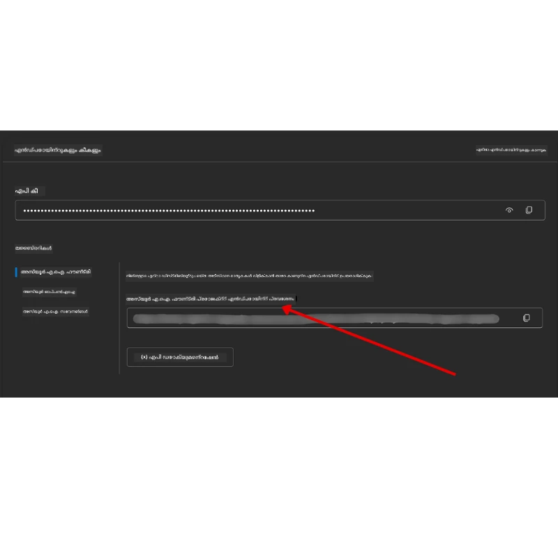

# കോഴ്‌സ് സജ്ജീകരണം

## പരിചയം

ഈ പാഠം ഈ കോഴ്സിലെ കോഡ് സാമ്പിളുകൾ എങ്ങനെ പ്രവർത്തിപ്പിക്കാമെന്ന് ഉൾക്കൊള്ളുന്നതാണ്.

## മറ്റ് പഠിതാക്കളോടൊപ്പം ചേരാം സഹായം ലഭിക്കുക

നിങ്ങളുടെ റിപ്പോ ക്ലോണിംഗിനു മുമ്പ്, സജ്ജീകരണവുമായി ബന്ധപ്പെട്ട സഹായത്തിനായി, കോഴ്‌സ് സംബന്ധിച്ച ചോദ്യങ്ങൾക്കായി, അല്ലെങ്കിൽ മറ്റു പഠിതാക്കളുമായി ബന്ധപ്പെടാൻ [AI Agents For Beginners Discord ചാനലിൽ](https://aka.ms/ai-agents/discord) ചേരുക.

## ഈ റിപ്പോ ക്ലോൺ ചെയ്യുക അല്ലെങ്കിൽ ഫോർക്കുചെയ്യുക

ആരംഭിക്കാൻ, ഗിറ്റ്ഹബ് റിപ്പോസിറ്ററി ക്ലോൺ ചെയ്യുക അല്ലെങ്കിൽ ഫോർക്ക് ചെയ്യുക. ഇതുവഴി നിങ്ങളുടെ സ്വന്തം കോഴ്‌സ് മെറ്റീരിയലിന്റെ പതിപ്പ് ഉണ്ടാകും, അതിലൂടെ നിങ്ങൾക്ക് കോഡ് പ്രവർത്തിപ്പിക്കാൻ, പരീക്ഷിക്കാൻ, തിരുത്താൻ കഴിയും!

ഇത് ചെയ്യാൻ, <a href="https://github.com/microsoft/ai-agents-for-beginners/fork" target="_blank">ഫോർക്കു ചെയ്‌തുള്ള ലിങ്ക് ക്ലിക്കുചെയ്യുക</a>

ഇപ്പോൾ താഴെ കൊടുത്തിരിക്കുന്ന ലിങ്കിൽ നിങ്ങൾക്ക് നിങ്ങളുടെ സ്വന്തം ഫോർക്കുചെയ്ത കോഴ്‌സ് പതിപ്പ് കാണാം:


### ഷല്ലോ ക്ലോൺ (വർക്ക്‌ഷോപ്പ് / കോഡ്സ്പേസുകൾക്കായി ശിപാർശ)

  >പൂർണ്ണ റിപ്പോസിറ്ററി വളരെ വലുതായി (~3 GB) ആയിരിക്കാം, എന്നാൽ നിങ്ങൾക്ക് വെറും വർക്ക്‌ഷോപ്പ് അറ്റൻഡ് ചെയ്യുകയോ കുറച്ച് പാഠഫോളഡറുകൾ മാത്രമേ വേണ്ടുകയുള്ളൂ എങ്കിൽ, ഹിസ്റ്ററി ഭാഗികമായി കുത്തിവെക്കുകയോ (shallow clone) ബ್ಲോബുകൾ ഒഴിവാക്കുകയോ (sparse clone) ചെയ്ത് ഡൗൺലോഡ് കുറയ്ക്കാം.

#### വേഗത്തിൽ ഷല്ലോ ക്ലോൺ — കുറഞ്ഞ ഹിസ്റ്ററി, എല്ലാ ഫയലുകളും

താഴെ ലിസ്റ്റ് ചെയ്തിരിക്കുന്ന കമാൻഡുകളിൽ `<your-username>` നിങ്ങളുടെ ഫോർക്കിന്റെ URL (അല്ലെങ്കിൽ അവലംബ URL) ഉപയോഗിച്ച് മാറ്റുക.

ഏറ്റവും പുതിയ കമ്മിറ്റിന്റെ ഹിസ്റ്ററി മാത്രം ക്ലോൺ ചെയ്യാൻ (ചെറിയ ഡൗൺലോഡ്):

```bash|powershell
git clone --depth 1 https://github.com/<your-username>/ai-agents-for-beginners.git
```

കുറേ കമാന്റ് കൊണ്ട് പ്രത്യേക ബ്രാഞ്ച് ക്ലോൺ ചെയ്യാൻ:

```bash|powershell
git clone --depth 1 --branch <branch-name> https://github.com/<your-username>/ai-agents-for-beginners.git
```

#### ഭാഗിക (Sparse) ക്ലോൺ — കുറഞ്ഞ ബ്ളോബുകൾ + തിരഞ്ഞെടുക്കപ്പെട്ട ഫോൾഡറുകൾ മാത്രം

ഇത് ഭാഗിക ക്ലോൺ, sparse-checkout ഉപയോഗിക്കുന്നു (Git 2.25+ ആവശ്യമാണ്, ഭാഗിക ക്ലോൺ പിന്തുണയുള്ള പുതിയ Git ശിപാർശ):

```bash|powershell
git clone --depth 1 --filter=blob:none --sparse https://github.com/<your-username>/ai-agents-for-beginners.git
```

റിപ്പോ ഫോൾഡറിലേക്ക് പ്രവേശിക്കുക:

```bash|powershell
cd ai-agents-for-beginners
```

ആവശ്യമായ ഫോൾഡറുകൾ വ്യക്തമാക്കുക (ഉദാഹരണം താഴെ രണ്ട് ഫോൾഡറുകൾ കാണിക്കുന്നു):

```bash|powershell
git sparse-checkout set 00-course-setup 01-intro-to-ai-agents
```

ക്ലോൺ ചെയ്ത് ഫയലുകൾ ഉറപ്പാക്കിയതിനു ശേഷം, നിങ്ങളുടെ വെള്ളിമരം ഒഴിവാക്കാൻ (ഗിറ്റ് ഹിസ്റ്ററി ഇല്ലാതെ) റിപ്പോ മെറ്റാഡാറ്റ നീക്കുന്നത് (💀തിരികെ എത്താനാകാത്തത് — എല്ലാ Git പ്രവർത്തനങ്ങളും നഷ്ടപ്പെടും: കമ്മിറ്റുകൾ, പുൾസ്, പുഷ്‌സ്, ഹിസ്റ്ററി ആക്സസ് ഇല്ല).

```bash
# zsh/bash
rm -rf .git
```

```powershell
# പവർശെൽ
Remove-Item -Recurse -Force .git
```

#### GitHub Codespaces ഉപയോഗിക്കുന്നതിന് (വലുതായ ലോക്കൽ ഡൗൺലോഡ് ഒഴിവാക്കാൻ ശിപാർശ)

- ഈ റിപ്പോസിറ്ററിക്ക് [GitHub UI](https://github.com/codespaces) വഴിയാണ് പുതിയ Codespace സൃഷ്ടിക്കുക.

- പുതിയ കോഡ്സ്പേസ് ടർമിനലിൽ മുകളിൽ കൊടുത്ത ഷല്ലോ / സ്പാർസ് ക്ലോൺ കമാന്റുകളിൽ ഒരും പ്രവർത്തിപ്പിച്ച് വേണ്ട പാഠ ഫോളഡറുകൾ മാത്രം കോഡ്സ്പേസ് വർക്ക്സ്പേസിലേക്കു കൊണ്ടുവരിക.
- ഓപ്ഷണൽ: കോഡ്സ്പേസിൽ കോഡ് ക്ലോൺ ചെയ്ത ശേഷം, അധിക സ്‌പേസ് ലഭിക്കാൻ .git ഫയൽ നീക്കം ചെയ്യാവുന്നതാണ് (മീതിൽ നൽകിയ നീക്കം കമാൻഡുകൾ കാണുക).
- കുറിപ്പ്: റിപ്പോ നേരിട്ട് കോഡ്സ്പേസിൽ തുറക്കുന്നതിൽ (കോമപ്ലക്സിന്റെ ഒരു കോപ്പില്ലാതെ) Codespaces ഡെവ്‌കണ്ട് എൻവയോണ്‍മെന്റ് സൃഷ്ടിക്കും; ഏറ്റവും ആവശ്യമാണ് ക്കാൾ അധികം വിഭവങ്ങൾ ഉപയോഗിക്കാം. പുതിയ Codespace-യിൽ ഷല്ലോ ക്ലോൺ ചെയ്യുന്നത് ഡിസ്ക് ഉപയോഗം കൂടുതൽ നിയന്ത്രിക്കാൻ സഹായിക്കും.

#### ടിപ്സ്

- എപ്പോഴും നിങ്ങളുടെ ഫോർക്കിന്റെ URL ഉപയോഗിച്ച് ക്ലോൺ URL മാറ്റണം എഡിറ്റ്/കമ്മിറ്റ് ചെയ്യാൻ ആഗ്രഹിക്കുന്നാൽ.
- പിന്നീട് കൂടുതൽ ഹിസ്റ്ററി അല്ലെങ്കിൽ ഫയലുകൾ വേണ്ടെങ്കിൽ, ഫെച്ച് ചെയ്യാവുന്നതോ സ്പാർസ്-ചെക്കൗട്ടിൽ കൂടുതൽ ഫോൾഡറുകൾ ഉൾപ്പെടുത്താനാവും.

## കോഡ് പ്രവർത്തിപ്പിക്കൽ

ഈ കോഴ്സ്, നിങ്ങൾക്ക് AI ഏജന്റുകൾ നിർമ്മിക്കാൻ കൈകൊണ്ട് പഠിക്കാനായി ഓപ്പൺ ചെയ്യുന്ന ജുപൈറ്റർ നോട്ട്‌ബുക്കുകളുടെ ഒരു പരമ്പര Ilakkiyam കൊടുക്കുന്നു.

കോഡ് സാമ്പിളുകൾ **Microsoft Agent Framework (MAF)** ഉപയോഗിക്കുന്നു `AzureAIProjectAgentProvider` എന്നതിന്, որը **Azure AI Agent Service V2**-ലേക്കുള്ള **Microsoft Foundry** വഴി ബന്ധിപ്പിക്കുന്നു (Responses API).

എല്ലാ പൈത്തൺ നോട്ട് ബുക്കുകളും `*-python-agent-framework.ipynb` എന്നത് ലേബൽ ചെയ്യപ്പെട്ടവയാണ്.

## ആവശ്യകതകൾ

- Python 3.12+
  - **ഗമനാർഥം**: Python 3.12 ഇൻസ്റ്റാൾ ചെയ്‌തിട്ടില്ല എങ്കിൽ, ആദ്യം ഇത് ഇൻസ്റ്റാൾ ചെയ്യുക. പിന്നീട് നിങ്ങളുടെ വെർച്ച്വൽ എൻവയോൺമെന്റ് python3.12 ഉപയോഗിച്ച് സൃഷ്ടിച്ചു ആവശ്യമായ പതിപ്പുകൾ requirements.txt ഫയലിൽ നിന്ന് ഇൻസ്റ്റാൾ ചെയ്യുക.
  
    >ഉദാഹരണം

    Python വെർച്ച്വൽ എൻവയോൺമെന്റ് ഡയറക്ടറി സൃഷ്ടിക്കുക:

    ```bash|powershell
    python -m venv venv
    ```

    തുടർന്ന് ഷെൽ പ്രവർത്തിപ്പിക്കുക:

    ```bash
    # zsh/bash
    source venv/bin/activate
    ```
  
    ```dos
    # Command Prompt for Windows
    venv\Scripts\activate
    ```

- .NET 10+: .NET ഉപയോഗിക്കുന്ന സാമ്പിൾ കോഡിനു [.NET 10 SDK](https://dotnet.microsoft.com/download/dotnet/10.0) അല്ലെങ്കിൽ അതിനു പിന്നാലെ പതിപ്പുകൾ ഇൻസ്റ്റാൾ ചെയ്തിരിക്കണം. തുടർന്ന് നിങ്ങളുടെ ഇൻസ്റ്റാൾ ചെയ്ത .NET SDK പതിപ്പ് പരിശോധിക്കുക:

    ```bash|powershell
    dotnet --list-sdks
    ```

- **Azure CLI** — ഓത്തന്റിക്കേഷനിനായി ആവശ്യമുണ്ട്. [aka.ms/installazurecli](https://aka.ms/installazurecli) വഴി ഇൻസ്റ്റാൾ ചെയ്യുക.
- **Azure Subscription** — Microsoft Foundryക്കും Azure AI Agent Service-க்கும் ആക്‌സസ് ലഭിക്കാൻ.
- **Microsoft Foundry പ്രോജക്റ്റ്** — (ഉദാഹരണം: `gpt-4o`) ഡിപ്ലോയുചെയ്‌ത മോഡലുള്ള ഒരു പ്രോജക്റ്റ്. താഴെ കാണുന്ന [സ്ഥാപന ഘടകങ്ങൾ](#ഘട്ടം-1-microsoft-foundry-പ്രോജക്റ്റ്-സൃഷ്ടിക്കുക).

ഈ റിപ്പോസിറ്ററിയുടെ റൂട്ട് ഡയറക്ടറിയിൽ `requirements.txt` ഫയൽ ഉൾപ്പെടുത്തിയിട്ടുണ്ട്, ഇത് കോഡ് സാമ്പിളുകൾക്ക് വേണ്ട Python പാക്കേജുകൾ മുഴുവനും ഉൾക്കൊള്ളുന്നു.

ഇവ ഇൻസ്റ്റാൾ ചെയ്യാൻ താഴെ കൊടുക്കുന്ന കമാൻഡ് റൂട്ട് ഡയറക്ടറിയിൽ ട്വർമിനലിൽ ഓടിക്കുക:

```bash|powershell
pip install -r requirements.txt
```

കേടുകൾ ഒഴിവാക്കാൻ പൈത്തൺ വെർച്ച്വൽ എൻവയോൺമെന്റ് സൃഷ്ടിച്ച് ഓടിക്കാൻ ഞങ്ങൾ ശിപാർശ ചെയ്യുന്നു.

## VSCode സെറ്റ് അപ്

VSCode-യിൽ ശരിയായ പൈത്തൺ പതിപ്പ് ഉപയോഗിക്കുന്നത് ഉറപ്പാക്കുക.


## Microsoft Foundry & Azure AI Agent Service സജ്ജീകരിക്കുക

### ഘട്ടം 1: Microsoft Foundry പ്രോജക്റ്റ് സൃഷ്ടിക്കുക

നോട്ട് ബുക്ക്‌സ് ഓടിക്കാൻ നിങ്ങൾക്ക് Azure AI Foundry **ഹബ്** ഉം **പ്രോജക്റ്റും** ഡിപ്ലോയുചെയ്‌ത മോഡലോടെ വേണം.

1. [ai.azure.com](https://ai.azure.com) സന്ദർശിച്ച് നിങ്ങളുടെ Azure അക്കൗണ്ടിൽ സൈനിന്മാർ.
2. ഒരു **ഹബ്** സൃഷ്ടിക്കുക (അല്ലെങ്കിൽ നിലവിലുള്ളത് ഉപയോഗിക്കുക). [ഹബ് റിസോഴ്‌സസ് അവലോകനം](https://learn.microsoft.com/azure/ai-foundry/concepts/ai-resources) കാണുക.
3. ഹബിൽ പ്രോജക്റ്റ് സൃഷ്ടിക്കുക.
4. **Models + Endpoints** → **Deploy model** വഴി മോഡൽ (ഉദാ: `gpt-4o`) ഡിപ്ലോയ് ചെയ്യുക.

### ഘട്ടം 2: നിങ്ങളുടെ പ്രോജക്റ്റ് എൻഡ്‌പോയിന്റും മോഡൽ ഡിപ്ലോയ്മെന്റ് പേര് കണ്ടെത്തുക

Microsoft Foundry പോർട്ടലിലെ നിങ്ങളുടെ പ്രോജക്റ്റിൽ നിന്നു:

- **Project Endpoint** — **Overview** പേജിൽ പോയി എൻഡ്‌പോയിന്റ് URL പകർത്തുക.



- **Model Deployment Name** — **Models + Endpoints** ൽ പോകുക, ഡിപ്ലോയുചെയ്‌ത മോഡൽ തിരഞ്ഞെടുക്കുക, ഡിപ്ലോയ്മെന്റ് നാമം ശ്രദ്ധിക്കുക (ഉദാ: `gpt-4o`).

### ഘട്ടം 3: `az login` വഴി Azure ലേക്കു സൈനിന്

എല്ലാ നോട്ട്‌ബുക്കുകളും ഓത്തന്റിക്കേഷനിനായി **`AzureCliCredential`** ഉപയോഗിക്കും — API കീകൾ മാനേജുചെയ്യേണ്ടതില്ല. ഇതിനായി Azure CLI വഴിയുള്ള സൈൻ ഇൻ ആവശ്യമാണ്.

1. Azure CLI നിലവിലില്ലെങ്കിൽ ഇൻസ്റ്റാൾ ചെയ്യുക: [aka.ms/installazurecli](https://aka.ms/installazurecli)

2. സൈൻ ഇൻ ചെയ്യുക:

    ```bash|powershell
    az login
    ```

    ബ്രൗസർ ഇല്ലാത്ത റിമോട്ട്/കോഡ്സ്പേസ് പ്രയോഗം ഉള്ള പക്ഷം:

    ```bash|powershell
    az login --use-device-code
    ```

3. ആവശ്യാനുസരിച്ചു സബ്‌സ്‌ക്രിപ്ഷൻ തിരഞ്ഞെടുക്കുക — നിങ്ങളുടെ Foundry പ്രോജക്റ്റ് ഉൾപ്പെട്ടത് തെരഞ്ഞെടുക്കുക.

4. സൈൻ ഇൻ സ്ഥിരീകരിക്കുക:

    ```bash|powershell
    az account show
    ```

> **'az login' എന്തിനാണ്?** നോട്ട്‌ബുക്കുകൾ `azure-identity` പാക്കേജിലെ `AzureCliCredential` ഉപയോഗിച്ച് ഓത്തന്റിക്കറ്റ് ചെയ്യും. അതായത് നിങ്ങളുടെ Azure CLI സെഷൻ ഓത്തന്റിക്കേഷൻ ക്രെഡൻഷ്യൽസ് നൽകുന്നു — `.env` ഫയലിൽ API കീകൾ അല്ലെങ്കിൽ രഹസ്യങ്ങൾ വേണം ഇല്ല. ഇത് [സുരക്ഷിതമായ മികച്ച പ്രാക്ടീസ്](https://learn.microsoft.com/azure/developer/ai/keyless-connections) ആണ്.

### ഘട്ടം 4: നിങ്ങളുടെ `.env` ഫയൽ സൃഷ്ടിക്കുക

ഉദാഹരണ ഫയൽ പകർത്തുക:

```bash
# zsh/bash
cp .env.example .env
```

```powershell
# పవర్‌షెల్
Copy-Item .env.example .env
```

`.env` തുറന്ന് ഈ രണ്ട് മൂല്യങ്ങൾ പൂരിപ്പിക്കുക:

```env
AZURE_AI_PROJECT_ENDPOINT=https://<your-project>.services.ai.azure.com/api/projects/<your-project-id>
AZURE_AI_MODEL_DEPLOYMENT_NAME=gpt-4o
```

| വ്യേരിയബിൾ | എവിടെ കണ്ടെത്താം |
|----------|-----------------|
| `AZURE_AI_PROJECT_ENDPOINT` | Foundry പോർട്ടൽ → നിങ്ങളുടെ പ്രോജക്റ്റ് → **Overview** പേജ് |
| `AZURE_AI_MODEL_DEPLOYMENT_NAME` | Foundry പോർട്ടൽ → **Models + Endpoints** → നിങ്ങളുടെ ഡിപ്ലോയുചെയ്ത മോഡൽ നാമം |

ഇതുവരെയുള്ള പാഠങ്ങൾക്ക് തീർച്ചയാണ്! നോട്ട് ബുക്കുകൾ നിങ്ങളുടെ `az login` സെഷൻ വഴി സ്വയം ഓത്തന്റിക്കറ്റ് ചെയ്യും.

### ഘട്ടം 5: Python ആശ്രിതത്വങ്ങൾ ഇൻസ്റ്റാൾ ചെയ്യുക

```bash|powershell
pip install -r requirements.txt
```

മുന്‍പ് സൃഷ്ടിച്ച വെർച്ച്വൽ എൻവയോൺമെന്റ് ആക്റ്റിവേറ്റ് ചെയ്തതിനു ശേഷം ഇത് ഓടിക്കാൻ ശിപാർശ.

## പാഠം 5 (Agentic RAG) യ്ക്കുള്ള അധിക സജ്ജീകരണം

പാഠം 5 **Azure AI Search** Retrieval-Augmented Generation (RAG) ഉപയോഗിക്കുന്നു. ആ പാഠം പ്രവർത്തിപ്പിക്കാൻ നിങ്ങൾ ആഗ്രഹിക്കുന്ന പക്ഷം, ഈ വ്യേരിയബിൾകൾ `.env` യിൽ ചേർക്കുക:

| വ്യേരിയബിൾ | എവിടെ കണ്ടെത്താം |
|----------|-----------------|
| `AZURE_SEARCH_SERVICE_ENDPOINT` | Azure പോർട്ടൽ → നിങ്ങളുടെ **Azure AI Search** റിസോഴ്‌സ് → **Overview** → URL |
| `AZURE_SEARCH_API_KEY` | Azure പോർട്ടൽ → നിങ്ങളുടെ **Azure AI Search** റിസോഴ്‌സ് → **Settings** → **Keys** → primary admin കീ |

## പാഠം 6 & 8 (GitHub മോഡലുകൾ) യ്ക്കുള്ള അധിക സജ്ജീകരണം

പാഠം 6 & 8 ലെ ചില നോട്ട്‌ബുക്കുകൾ **Azure AI Foundry** പകരം **GitHub Models** ഉപയോഗിക്കുന്നു. ആ സാമ്പിളുകൾ പ്രവർത്തിപ്പിക്കാൻ നിങ്ങൾ ഉദ്ദേശിക്കുന്ന പക്ഷം, ഈ വ്യേരിയബിൾകൾ `.env` യിൽ ചേർക്കുക:

| വ്യേരിയബിൾ | എവിടെ കണ്ടെത്താം |
|----------|-----------------|
| `GITHUB_TOKEN` | GitHub → **Settings** → **Developer settings** → **Personal access tokens** |
| `GITHUB_ENDPOINT` | ഉപയോഗിക്കുക `https://models.inference.ai.azure.com` (ഡിഫോൾട്ട് മൂല്യം) |
| `GITHUB_MODEL_ID` | ഉപയോഗിക്കാനുള്ള മോഡൽ പേര് (ഉദാ: `gpt-4o-mini`) |

## പകരം നൽകാവുന്ന പ്രൊവൈഡർ: MiniMax (OpenAI-ഉപയോഗയോഗ്യമായത്)

[MiniMax](https://platform.minimaxi.com/) വലിയ കോൺടെക്സ്റ്റ് മോഡലുകൾ (204K ടോകൺസ് വരെ) ഓപ്പൺഎഐ-ഉപയോഗയോഗ്യമായ API മുഖേന നൽകുന്നു. Microsoft Agent Frameworkന്റെ `OpenAIChatClient` ഏതെങ്കിലും OpenAI-ഉപയോഗയോഗ്യമായ എൻഡ്‌പോയിന്റുമായി പ്രവർത്തിക്കുന്നതിനാൽ, GitHub Models അല്ലെങ്കിൽ OpenAIക്ക് പകരം MiniMax ഉപയോഗിക്കാം.

`.env` ഫയലിൽ ഈ വ്യേരിയബിൾകൾ ചേർക്കുക:

| വ്യേരിയബിൾ | എവിടെ കണ്ടെത്താം |
|----------|-----------------|
| `MINIMAX_API_KEY` | [MiniMax Platform](https://platform.minimaxi.com/) → API കീകൾ |
| `MINIMAX_BASE_URL` | ഉപയോഗിക്കുക `https://api.minimax.io/v1` (ഡിഫോൾട്ട് മൂല്യം) |
| `MINIMAX_MODEL_ID` | ഉപയോഗിക്കാനുള്ള മോഡൽ നാമം (ഉദാ: `MiniMax-M2.7`) |

**ലഭ്യമായ മോഡലുകൾ**: `MiniMax-M2.7` (ശിപാർശ), `MiniMax-M2.7-highspeed` (ആകർഷക വേഗത)

`OpenAIChatClient` ഉപയോഗിക്കുന്ന കോഡ് സാമ്പിളുകൾ (ഉദാ: പാഠം 14 ഹോട്ടൽ ബുക്കിംഗ് വർക്ക്‌ഫ്ലോ) ഓട്ടോമാറ്റിക് ആയി നിങ്ങളുടെ MiniMax കോൺഫിഗറേഷൻ കണ്ടെത്തുകയും `MINIMAX_API_KEY` സജ്ജമാക്കിയാൽ ഉപയോഗിക്കുകയും ചെയ്യും.

## പാഠം 8 (Bing Grounding Workflow) യ്ക്കുള്ള അധിക സജ്ജീകരണം

പാഠം 8 ലെ കൺഡീഷണൽ വർക്ക്‌ഫ്ലോ നോട്ട് ബുക്കിൽ **Bing grounding** Azure AI Foundry മുഖേന ഉപയോഗിക്കുന്നു. ആ സാമ്പിൾ ഓടിക്കാൻ നിങ്ങൾ ആഗ്രഹിക്കുന്ന പക്ഷം, ഈ വ്യേരിയബിൾ `.env` ഫയലിൽ ചേർക്കുക:

| വ്യേരിയബിൾ | എവിടെ കണ്ടെത്താം |
|----------|-----------------|
| `BING_CONNECTION_ID` | Azure AI Foundry പോർട്ടൽ → നിങ്ങളുടെ പ്രോജക്റ്റ് → **Management** → **Connected resources** → നിങ്ങളുടെ Bing കണക്ഷൻ → കണക്ഷൻ ഐഡി പകർത്തുക |

## പ്രശ്നപരിഹാരം

### macOS ൽ SSL സർട്ടിഫിക്കറ്റ് പരിശോധന പിഴവുകൾ

നിങ്ങൾ macOS ഉപയോക്താവാണെങ്കിൽ, താഴെക്കൊടുത്ത പോലുള്ള പിഴവുകൾ കാണാനാകും:

```plaintext
ssl.SSLCertVerificationError: [SSL: CERTIFICATE_VERIFY_FAILED] certificate verify failed: self-signed certificate in certificate chain
```

macOS-ലെ പൈത്തണിൽ സിസ്റ്റം SSL സർട്ടിഫിക്കറ്റുകൾ സ്വയം വിശ്വസിക്കപ്പെടാത്ത പ്രശ്നമാണ് ഇത്. ദയവായി താഴെ പറയുന്ന പരിഹാരങ്ങൾ അനുസരിക്കുക:

**ഐച്ഛികം 1: Python Certificates ഇൻസ്റ്റാൾ സ്ക്രിപ്റ്റ് പ്രവർത്തിപ്പിക്കുക (ശിപാർശ)**

```bash
# നിങ്ങളുടെ ഇൻസ്റ്റാൾ ചെയ്ത Python പതിപ്പോടെ 3.XX മാറുക (ഉദാ: 3.12 അല്ലെങ്കിൽ 3.13):
/Applications/Python\ 3.XX/Install\ Certificates.command
```

**ഐച്ഛികം 2: നിങ്ങൾ GitHub Models നോട്ട്‌ബുക്കുകളിലാണ് എങ്കിൽ `connection_verify=False` ഉപയോഗിക്കുക**

പാഠം 6 നോട്ട്‌ബുക്കിൽ (`06-building-trustworthy-agents/code_samples/06-system-message-framework.ipynb`), കമന്റ് ചെയ്ത പരിഹാരമാണ് ഇതിനുള്ളത്. ക്ലയന്റ് സൃഷ്ടിക്കുമ്പോൾ `connection_verify=False` അൺകമന്റ് ചെയ്യുക:

```python
client = ChatCompletionsClient(
    endpoint=endpoint,
    credential=AzureKeyCredential(token),
    connection_verify=False,  # സർട്ടിഫിക്കറ്റ് പിശകുകൾ നേരിടുമ്പോളെങ്കിൽ SSL സ്ഥിരീകരണം غیرനിഷ്ക്രീയമാക്കുക
)
```

> **⚠️ മുന്നറിയിപ്പ്:** SSL പരിശോധന അപ്രാമാണികമാക്കുന്നത് (`connection_verify=False`) സുരക്ഷ കുറയും, കാരണം സർട്ടിഫിക്കറ്റ് പരിശോധിക്കുന്നത് ഒഴിവാക്കുന്നു. ഇത് വികസന പരിസ്ഥിതിയിൽ താത്കാലിക പരിഹാരമായി മാത്രമേ ഉപയോഗിക്കാവൂ, പ്രോഡക്ഷനിൽ ഉപയോഗിക്കരുത്.

**ഐച്ഛികം 3: `truststore` ഇൻസ്റ്റാൾ ചെയ്ത് ഉപയോഗിക്കുക**

```bash
pip install truststore
```

ശേഷം നിങ്ങളുടെ നോട്ട് ബുക്ക് അല്ലെങ്കില്‍ സ്ക്രിപ്റ്റിൽ നെറ്റ്വർക്കിംഗ് കോൾചെയ്യുന്നതിന് മുൻപ് ഈ കോഡ് ചേർക്കുക:

```python
import truststore
truststore.inject_into_ssl()
```

## എവിടെ ബുദ്ധിമുട്ട്?

ഈ സജ്ജീകരണം പ്രവർത്തിപ്പിക്കാൻ പ്രശ്നം വന്നാൽ, ഞങ്ങളുടെ <a href="https://discord.gg/kzRShWzttr" target="_blank">Azure AI Community Discord</a> ലേക്ക് ചേരുക അല്ലെങ്കിൽ <a href="https://github.com/microsoft/ai-agents-for-beginners/issues?WT.mc_id=academic-105485-koreyst" target="_blank">ഇഷ്യൂ സൃഷ്ടിക്കുക</a>.

## അടുത്ത പാഠം

ഇപ്പോൾ കോഴ്‌സ് കോഡ് പ്രവർത്തിപ്പിക്കാൻ നിങ്ങൾ തയാറാണ്. AI ഏജന്റുകളുടെ ലോകത്തെ കുറിച്ച് കൂടുതൽ പഠിക്കാൻ ആശംസകൾ!

[AI ഏജന്റുകളും ഏജന്റ് ഉപയോഗ കേസുകളും പരിചയം](../01-intro-to-ai-agents/README.md)

---

<!-- CO-OP TRANSLATOR DISCLAIMER START -->
**അസ്‌പഷ്ടീകരണം**:
ഈ രേഖ [Co-op Translator](https://github.com/Azure/co-op-translator) എന്ന AI വിവർത്തന സേവനം ഉപയോഗിച്ച് വിവർത്തനം ചെയ്തതാണ്. കൃത്യതക്ക് നാം വാഗ്ദാനം നൽകുന്നുവെങ്കിലും, ഓട്ടോമേറ്റഡ് വിവർത്തനങ്ങളിൽ പിഴവുകളും തെറ്റുകളും ഉണ്ടാകാമെന്ന് ദയവായി ശ്രദ്ധിക്കുക. ഒറിജിനൽ രേഖയുടെ സ്വന്തം ഭാഷയിലെ അപേക്ഷയേ ഉള്ളതായിരുന്നു അതിന്റെ അധികാരമുള്ള ഉറവിടം എന്ന് കണക്കാക്കണം. ഗൗരവമുള്ള വിവരങ്ങൾക്ക്, പ്രൊഫഷണൽ മനുഷ്യ വിവർത്തനം നിർദേശിക്കുന്നു. ഈ വിവർത്തനം ഉപയോഗിച്ചതിലൂടെ ഉണ്ടാകുന്ന തെറ്റായ വ്യാഖ്യാനങ്ങൾക്കും തെറ്റായി മനസ്സിലാക്കലിനും നാം ഉത്തരവാദികളല്ല.
<!-- CO-OP TRANSLATOR DISCLAIMER END -->