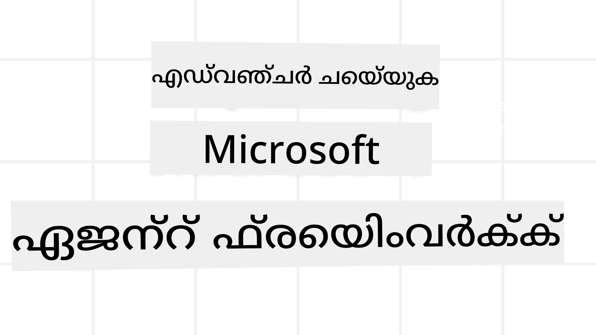

# മൈക്രോസോഫ്‌റ്റ് ഏജന്റ് ഫ്രെയിംവർക്ക് പരിചയപ്പെടൽ



### പരിചയം

ഈ പാഠം താഴെ ഉള്ളവ കവർ ചെയ്യും:

- മൈക്രോസോഫ്റ്റ് ഏജന്റ് ഫ്രെയിംവർക്കിനെക്കുറിച്ചുള്ള അവലംബം: പ്രധാന സവിശേഷതകളും മൂല്യവും  
- മൈക്രോസോഫ്റ്റ് ഏജന്റ് ഫ്രെയിംവർക്കിന്റെ പ്രധാന ആശയങ്ങൾ പരിശോധിക്കുക
- തന്ത്രപരമായ MAF മാതൃകകൾ: വർക്ക്‌ഫ്ലോസ്, മിഡിൽവെയർ, മെമ്മറി

## പഠന ലക്ഷ്യങ്ങൾ

ഈ പാഠം പൂർത്തിയാക്കിയശേഷം, നിങ്ങൾക്ക് അറിയാം:

- മൈക്രോസോഫ്റ്റ് ഏജന്റ് ഫ്രെയിംവർക്ക്ഗ് ഉപയോഗിച്ച് പ്രോഡക്ഷൻ റെഡി AI ഏജന്റുകൾ നിർമ്മിക്കുക
- മൈക്രോസോഫ്റ്റ് ഏജന്റ് ഫ്രെയിംവർക്കിന്റെ പ്രാഥമിക സവിശേഷതകൾ നിങ്ങളുടെ ഏജന്റിക് ഉപയോഗകേസുകളിലേക്ക് പ്രയോഗിക്കുക
- വർക്ക്‌ഫ്ലോസുകൾ, മിഡിൽവെയർ, നിരീക്ഷണം ഉൾപ്പെടെയുള്ള പ്രगत മാതൃകകൾ ഉപയോഗിക്കുക

## കോഡ് സാമ്പിളുകൾ

[Microsoft Agent Framework (MAF)](https://aka.ms/ai-agents-beginners/agent-framewrok) കോഡ് സാമ്പിളുകൾ ഈ റീപോസിറ്ററിയിൽ `xx-python-agent-framework`-ഉം  `xx-dotnet-agent-framework`-ഉം ഫയലുകളിൽ ലഭ്യമാണ്.

## മൈക്രോസോഫ്‌റ്റ് ഏജന്റ് ഫ്രെയിംവർക്കിന്റെ മനസ്സിലാക്കൽ


[Microsoft Agent Framework (MAF)](https://aka.ms/ai-agents-beginners/agent-framewrok) മൈക്രോസോഫ്റ്റിന്റെ ഐക്യപ്പെട്ട ഫ്രെയിംവർക്കാണ് AI ഏജന്റുകൾ നിർമ്മിക്കുന്നതിനായി. ഇത് പ്രൊഡക്ഷനും ഗവേഷണ പരിസരങ്ങളിലെ വിവിധതരം ഏജന്റിക് ഉപയോഗകേസുകൾ നേരിടാനുള്ള സൌകര്യം നൽകുന്നു:

- സ്ട്രിംവീസ് ഘട്ടങ്ങളായ വർക്ക്‌ഫ്ലോസുകൾ ആവശ്യമാണ് എന്ന സാഹചര്യങ്ങളിൽ **ക്രമീകരിച്ച ഏജന്റ് ഓർക്കേസ്ട്രേഷൻ**.
- ഏജന്റുകൾ സമാന്തരമായി ജോലി പൂർത്തിയാക്കേണ്ട അവസ്ഥയിൽ **സമകാലീന ഓർക്കേസ്ട്രേഷൻ**.
- ഏജന്റുകൾ ഒരു ജോലിയിൽ ചേർന്ന് പ്രവർത്തിക്കുന്ന സാഹചര്യങ്ങളിൽ **ഗ്രൂപ്പ് ചാറ്റ് ഓർക്കേസ്ട്രേഷൻ**.
- ഉപജോലികൾ പൂർത്തിയാകുമ്പോൾ ഏജന്റുകൾ തമ്മിൽ കൈമാറുന്ന സാഹചര്യങ്ങളിൽ **ഹാൻഡ്ഓഫ് ഓർക്കേസ്ട്രേഷൻ**.
- മാനേജർ ഏജന്റ് ഒരു ജോലിയുടെയും ഉപഏജന്റുകൾ തമ്മിലുള്ള تنسيق കൈകാര്യം ചെയ്യുന്ന **മാഗ്നറ്റിക് ഓർക്കേസ്ട്രേഷൻ**.

പ്രൊഡക്ഷനിൽ AI ഏജന്റുകൾ നൽകാനായി, MAF-ൽ ഉൾപ്പെട്ടിട്ടുള്ള സവിശേഷതകൾ:

- OpenTelemetry ഉപയോഗിച്ച് **നിരീക്ഷണം**: AI ഏജന്റിന്റെ ഓരോ പ്രവർത്തനവും ടൂൾ വിളിക്കലും, ഓർക്കേസ്ട്രേഷൻ ഘട്ടങ്ങളും, മാനസിക പ്രക്രിയകളും, പ്രകടനം മോണിറ്ററിംഗും Microsoft Foundry ഡാഷ്ബോർഡുകൾ വഴി.
- **സുരക്ഷ**: Microsoft Foundry-യിൽ ഏജന്റുകൾ സർവീസ് പോലെ ഹോസ്റ്റ് ചെയ്ത് റോളുകൾ അടിസ്ഥാനമാക്കിയുള്ള ആക്സസ്, സ്വകാര്യ ഡാറ്റ കൈകാര്യം ചെയ്യൽ, ഉള്ളടക്കം സുരക്ഷ തുടങ്ങിയ നിയന്ത്രണങ്ങൾ.
- **ദൃഢത**: ഏജന്റ് ത്രെഡ്‌സും വർക്ക്‌ഫ്ലോസുകളും പാസ്, റിസ്യൂം ചെയ്യാനും പിഴവുകളിൽ നിന്നും പുനഃപ്രാപ്തി നടത്താനുമുള്ള കഴിവ്, ദീർഘകാല പ്രവർത്തനം സാധ്യമാക്കുന്നു.
- **നിയന്ത്രണം**: മനുഷ്യൻ ഇടപെടുന്ന പ്രവൃത്തി പ്രക്രിയകൾക്ക് പിന്തുണ, ഇവിടെ ജോലി മനുഷ്യാനുമതി തിരഞ്ഞെടുക്കേണ്ടതായി അടയാളപ്പെടുത്താം.

മൈക്രോസോഫ്റ്റ് ഏജന്റ് ഫ്രെയിംവർക്കിന്റെ ആന്തർപ്രവർത്തിത്വം താഴെ പ്രാധാന്യം നൽകുന്നു:

- **ക്ലൗഡ് അവഗണന** - ഏജന്റുകൾ കണ്ടെയ്‌നറുകളിൽ, ഒഫ്-പ്രേം‌സിൽ, വിവിധ ക്ലൗഡുകളിൽ ഓടാൻ കഴിയും.
- **ദായകൻ അവഗണന** - നിങ്ങളുടെ ഇഷ്ട SDK ഉപയോഗിച്ച് ഏജന്റുകൾ നിർമ്മിക്കാം, Azure OpenAI അടങ്ങിയവയും.
- **ഓപ്പൺ സ്റ്റാൻഡേർഡുകൾ ഉൾക്കൊള്ളൽ** - ഏജന്റുകൾക്ക് Agent-to-Agent (A2A), Model Context Protocol (MCP) പോലുള്ള പ്രോട്ടോകോളുകൾ ഉപയോഗിച്ച് മറ്റ് ഏജന്റുകളും ടൂളുകളും കണ്ടെത്തുകയും ഉപയോഗിക്കുകയും ചെയ്‌യാം.
- **പ്ലഗിനുകളും കണക്റ്ററുകളും** - Microsoft Fabric, SharePoint, Pinecone, Qdrant പോലുള്ള ഡാറ്റയും മെമ്മറിയും സേവനങ്ങളുമായി ബന്ധിപ്പിക്കാൻ കഴിയും.

ഇപ്പോൾ Microsoft Agent Framework-ന്റെ ചില പ്രാഥമിക ആശയങ്ങളിൽ ഈ സവിശേഷതകൾ എങ്ങനെ പ്രയോഗിക്കപ്പെടുന്നുവെന്ന് നോക്കാം.

## മൈക്രോസോഫ്റ്റ് ഏജന്റ് ഫ്രെയിംവർക്കിന്റെ പ്രധാന ആശയങ്ങൾ

### ഏജന്റുകൾ


**ഏജന്റുകൾ സൃഷ്ടിക്കുന്നത്**

ഏജന്റ് സൃഷ്ടിക്കുന്നത് inference service (LLM Provider), AI ഏജന്റ് പിന്തുടരേണ്ട നിർദ്ദേശങ്ങൾ, കൂടാതെ നിയോഗിച്ച `name` നിർവചിക്കൽ മുഖേന നടക്കുന്നു:

```python
agent = AzureOpenAIChatClient(credential=AzureCliCredential()).create_agent( instructions="You are good at recommending trips to customers based on their preferences.", name="TripRecommender" )
```

മുകളില്‍ കൊടുത്തത് `Azure OpenAI` ഉപയോഗിച്ചാണ്, പക്ഷെ `Microsoft Foundry Agent Service` ഉൾപ്പെടെയുള്ള വിവിധ സervisസ് ഉപയോഗിച്ച് ഏജന്റുകൾ നിർമ്മിക്കാം:

```python
AzureAIAgentClient(async_credential=credential).create_agent( name="HelperAgent", instructions="You are a helpful assistant." ) as agent
```

OpenAI `Responses`, `ChatCompletion` APIs

```python
agent = OpenAIResponsesClient().create_agent( name="WeatherBot", instructions="You are a helpful weather assistant.", )
```

```python
agent = OpenAIChatClient().create_agent( name="HelpfulAssistant", instructions="You are a helpful assistant.", )
```

അഥവാ [MiniMax](https://platform.minimaxi.com/), ഇത് വലിയ കോൺടെക്സ്റ്റ് വിൻഡോകളുമായി (204K ടോക്കണുകൾ വരെ) OpenAI-സ്വഭാവമുള്ള API വാഗ്ദാനം ചെയ്യുന്നു:

```python
agent = OpenAIChatClient(base_url="https://api.minimax.io/v1", api_key=os.environ["MINIMAX_API_KEY"], model_id="MiniMax-M2.7").create_agent( name="HelpfulAssistant", instructions="You are a helpful assistant.", )
```

അഥവാ A2A പ്രോട്ടോക്കോൾ ഉപയോഗിച്ച് ദൂരെ ഉള്ള ഏജന്റുകൾ:

```python
agent = A2AAgent( name=agent_card.name, description=agent_card.description, agent_card=agent_card, url="https://your-a2a-agent-host" )
```

**ഏജന്റുകൾ പ്രവർത്തിപ്പിക്കൽ**

ഏജന്റുകൾ `.run` അല്ലെങ്കിൽ `.run_stream` മെത്തഡുകൾ ഉപയോഗിച്ച് സ്ട്രീമില്ലാത്ത അല്ലെങ്കിൽ സ്ട്രീമിങ്ങ് പ്രതികരണങ്ങൾക്ക് ഓടിക്കുന്നു.

```python
result = await agent.run("What are good places to visit in Amsterdam?")
print(result.text)
```

```python
async for update in agent.run_stream("What are the good places to visit in Amsterdam?"):
    if update.text:
        print(update.text, end="", flush=True)

```

ഓരോ ഏജന്റ് ഓടൽക്കും `max_tokens` പോലുള്ള പരാമീറ്ററുകൾ, ഏജന്റ് വിളിക്കാവുന്ന `tools`, മഡൽ എന്നിവ ഇഷ്ടാനുസൃതമാക്കാനുള്ള ഓപ്ഷനുകൾ ഉണ്ട്.

ഒരു ഉപയോക്താവിന്റെ ജോലിയെ പൂർത്തിയാക്കാൻ പ്രത്യേക മോഡലുകൾ അല്ലെങ്കിൽ ടൂളുകൾ ആവശ്യമായ സാഹചര്യങ്ങളിൽ ഇത് ഉപയോഗപ്രദമാണ്.

**ടൂളുകൾ**

ടൂളുകൾ ഏജന്റ് നിർവ്വചിക്കുമ്പോൾ നിർവചിക്കാം:

```python
def get_attractions( location: Annotated[str, Field(description="The location to get the top tourist attractions for")], ) -> str: """Get the top tourist attractions for a given location.""" return f"The top attractions for {location} are." 


# നേരിട്ട് ഒരു ചാറ്റ് ഏജന്റിനെ സൃഷ്ടിക്കുമ്പോൾ

agent = ChatAgent( chat_client=OpenAIChatClient(), instructions="You are a helpful assistant", tools=[get_attractions]

```

എന്നും ഏജന്റ് ഓടുമ്പോൾ പരിശോധിക്കാം:

```python

result1 = await agent.run( "What's the best place to visit in Seattle?", tools=[get_attractions] # ഈ റണ്ണ് മാത്രമാണ് ഉപയോഗിക്കാവുന്നത് എന്ന ഉപകരണം )
```

**ഏജന്റ് ത്രെഡ്‌സ്**

ഏജന്റ് ത്രെഡ്‌സ് മൾട്ടി-ടേൺ സംഭാഷണങ്ങൾ കൈകാര്യം ചെയ്യാനാണ്. ത്രെഡ്‌സ് എങ്ങനെയാണ് സൃഷ്ടിക്കപ്പെടുന്നത്:

- സമയോചിതമായി ത്രെഡ് সংരക്ഷിക്കാൻ `get_new_thread()` ഉപയോഗിക്കുക
- ഏജന്റ് ഓടുമ്പോൾ ത്രെഡ് സ്വയം സൃഷ്ടിക്കുക, ഇപ്പോഴത്തെ ഓടലിനുള്ളില്‍ മാത്രമേ ത്രെഡ് നിലനിർത്താവൂ.

ത്രെഡ് സൃഷ്ടിക്കാൻ കോഡ് വിധം:

```python
# ഒരു പുതിയ ത്രെഡ് സൃഷ്ടിക്കുക.
thread = agent.get_new_thread() # അത്ഭുതകരവുമായി ത്രെഡിനൊപ്പം പ്രവർത്തിക്കുക.
response = await agent.run("Hello, I am here to help you book travel. Where would you like to go?", thread=thread)

```

തുടർന്ന് ത്രെഡ് സീരിയലൈസ് ചെയ്ത് പിന്നീട് ഉപയോഗിക്കാൻ സൂക്ഷിക്കാം:

```python
# ഒരു പുതുപുത്തൻ ത്രെഡ് സൃഷ്ടിക്കുക.
thread = agent.get_new_thread() 

# ത്രെഡിനൊപ്പം ഏജന്റ് പ്രവർത്തിപ്പിക്കുക.

response = await agent.run("Hello, how are you?", thread=thread) 

# സംഭരണത്തിന് ത്രെഡ് സീരിയലൈസ് ചെയ്യുക.

serialized_thread = await thread.serialize() 

# സംഭരണത്തിൽ നിന്ന് ലോഡ് ചെയ്തതിനു ശേഷം ത്രെഡ് അവസ്ഥ ഡിസീരിയലൈസ് ചെയ്യുക.

resumed_thread = await agent.deserialize_thread(serialized_thread)
```

**ഏജന്റ് മിഡിൽവെയർ**

ഏജന്റുകൾ ഉപകരണങ്ങളും LLM-കളും ഉപയോഗിച്ച് ഉപയോക്തൃ ജോലികൾ പൂർത്തിയാക്കുന്നു. ചില സാഹചര്യങ്ങളിൽ ഈ ഇടപെടലുകൾ ഇടയ്ക്ക് പ്രവർത്തിക്കേണ്ടതോ ട്രാക്ക് ചെയ്യേണ്ടതോ വരാം. ഏജന്റ് മിഡിൽവെയർ ഇതിനായി ഉപയോഗിക്കുന്നു:

*ഫംഗ്ഷൻ മിഡിൽവെയർ*

ഈ മിഡിൽവെയർ ഏജന്റും ഫംഗ്ഷൻ/ടൂൾ വിളിയ്ക്കുന്ന ഇടയിൽ ചില പ്രവർത്തനങ്ങൾ നടപ്പിലാക്കാൻ സഹായിക്കും. ഉദാഹരണത്തിന് ഫംഗ്ഷൻ കോളിൽ ലോഗിംഗ് ചെയ്യാൻ.

കോടിൽ `next` നിർവചിക്കുന്നത് അടുത്ത middleware അല്ലെങ്കിൽ യഥാർത്ഥ ഫംഗ്ഷൻ വിളിക്കണമെന്നതാണ്.

```python
async def logging_function_middleware(
    context: FunctionInvocationContext,
    next: Callable[[FunctionInvocationContext], Awaitable[None]],
) -> None:
    """Function middleware that logs function execution."""
    # മുൻപ്രോസസ്സിംഗ്: ഫംഗ്ഷൻ പ്രവർത്തനം ആരംഭിക്കുന്നതിന് മുമ്പ് ലോഗ് ചെയ്യുക
    print(f"[Function] Calling {context.function.name}")

    # അടുത്ത മിഡിൽവെയർ അല്ലെങ്കിൽ ഫംഗ്ഷൻ പ്രവർത്തനത്തിലേക്ക് തുടരുക
    await next(context)

    # പോസ്റ്റ്-പ്രോസസ്സിംഗ്: ഫംഗ്ഷൻ പ്രവർത്തനം കഴിഞ്ഞ് ലോഗ് ചെയ്യുക
    print(f"[Function] {context.function.name} completed")
```

*ചാറ്റ് മിഡിൽവെയർ*

ഈ മിഡിൽവെയർ LLM-ഉം ഏജന്റും തമ്മിലുള്ള അഭ്യർത്ഥനകളിൽ ഇടയ്ക്കു പ്രവർത്തনങ്ങൾ ചെയ്യാൻ ഉപയോഗിക്കുന്നു.

ഇതിൽ AI സേവനത്തിലേക്ക് അയക്കുന്ന `messages` ഉൾപ്പെടെ പ്രധാന വിവരങ്ങൾ ഉണ്ട്.

```python
async def logging_chat_middleware(
    context: ChatContext,
    next: Callable[[ChatContext], Awaitable[None]],
) -> None:
    """Chat middleware that logs AI interactions."""
    # മുൻ предус്കരണ: AI വിളിക്കുമുവന്നുള്ള ലോഗ്
    print(f"[Chat] Sending {len(context.messages)} messages to AI")

    # അടുത്ത.middleware അല്ലെങ്കിൽ AI സേവനത്തിലേക്ക് തുടരുക
    await next(context)

    # പോസ്റ്റ്-പ്രോസസ്സ്: AI പ്രതികരണത്തിനുശേഷം ലോഗ്
    print("[Chat] AI response received")

```

**ഏജന്റ് മെമ്മറി**

`Agentic Memory` പാഠത്തിൽ ചർച്ച ചെയ്തത് പോലെ, മെമ്മറി ഏജന്റിനെ വ്യത്യസ്ത കോൺടെക്സ്റ്റുകളിൽ പ്രവർത്തിക്കാൻ സഹായിക്കുന്നു. MAF വിവിധ തരത്തിലുള്ള മെമ്മറികൾ വാഗ്ദാനം ചെയ്യുന്നു:

*ഇൻ-മെമ്മറി സ്റ്റോറേജ്*

അപ്ലിക്കേഷൻ റൺടൈമിൽ ത്രെഡ്‌സിൽ സൂക്ഷിക്കുന്ന മെമ്മറി.

```python
# പുതിയ ത്രെഡ് സൃഷ്ടിക്കുക.
thread = agent.get_new_thread() # ആജന്റ് ത്രെഡിനൊപ്പം പ്രവർത്തിക്കുക.
response = await agent.run("Hello, I am here to help you book travel. Where would you like to go?", thread=thread)
```

*സ്ഥാപിത സന്ദേശങ്ങൾ*

പല സെഷനുകൾക്ക് ഇടയിൽ സംഭാഷണ ചരിത്രം സൂക്ഷിക്കുമ്പോൾ ഈ മെമ്മറി ഉപയോഗിക്കുന്നു. ഇത് `chat_message_store_factory` ഉപയോഗിച്ച് നിർവ്വചിക്കുന്നു:

```python
from agent_framework import ChatMessageStore

# ഒറ്റപ്പെട്ട സന്ദേശ സംഭരണം സൃഷ്‌ടിക്കുക
def create_message_store():
    return ChatMessageStore()

agent = ChatAgent(
    chat_client=OpenAIChatClient(),
    instructions="You are a Travel assistant.",
    chat_message_store_factory=create_message_store
)

```

*ഡൈനാമിക് മെമ്മറി*

ഏജന്റുകൾ ഓടുന്നതിന് മുമ്പ് കോൺടെക്സ്റ്റിലേക്ക് ചേർക്കുന്ന മെമ്മറി. mem0 പോലുള്ള ബാഹ്യ സേവനങ്ങളിലായി ഈ മെമ്മറികൾ സൂക്ഷിക്കാം:

```python
from agent_framework.mem0 import Mem0Provider

# മെം0 ഉപയോഗിച്ച് പുരോഗമിത മെമ്മറി ശേഷികൾ
memory_provider = Mem0Provider(
    api_key="your-mem0-api-key",
    user_id="user_123",
    application_id="my_app"
)

agent = ChatAgent(
    chat_client=OpenAIChatClient(),
    instructions="You are a helpful assistant with memory.",
    context_providers=memory_provider
)

```

**ഏജന്റ് നിരീക്ഷണം**

നിരീക്ഷണം വിശ്വസനീയവും പരിപാലനയോഗ്യവുമായ ഏജന്റിക് സിസ്റ്റങ്ങൾ നിർമ്മിക്കാൻ പ്രധാനമാണ്. MAF OpenTelemetry-യുമായി സംയോജിപ്പിച്ച് മികച്ച നിരീക്ഷണത്തിന് ട്രേസിംഗ്, മീറ്ററുകൾ നൽകുന്നു.

```python
from agent_framework.observability import get_tracer, get_meter

tracer = get_tracer()
meter = get_meter()
with tracer.start_as_current_span("my_custom_span"):
    # എന്തെങ്കിലും ചെയ്യുക
    pass
counter = meter.create_counter("my_custom_counter")
counter.add(1, {"key": "value"})
```

### വർക്ക്‌ഫ്ലോകൾ

MAF കടമ പൂർത്തിയാക്കുന്ന മുൻനിർവ്വചിത ഘട്ടങ്ങളായ workflows വാഗ്ദാനം ചെയ്യുന്നു, തീർച്ചയായും AI ഏജന്റുകൾ ഈ ഘട്ടങ്ങളിലുടെ ഘടകങ്ങളായി ഉണ്ടായിരിക്കും.

വർക്‌ഫ്ലോസുകൾ നിയന്ത്രണ പ്രയോഗത്തിന് വിവിധ ഘടകങ്ങൾ ഉൾക്കൊള്ളുന്നു. workflows-കൾ **മൾട്ടി-ഏജന്റ് ഓർക്കേസ്ട്രേഷൻ**ക്കും **ചെക്ക്‌പോയിന്റിംഗ്**ക്കും സഹായിക്കുന്നു, അതിലൂടെ സ്റ്റേറ്റ് സംരക്ഷിക്കുന്നു.

വർക്ക്‌ഫ്ലോയുടെ പ്രാഥമിക ഘടകങ്ങൾ:

**െക്സിക്യൂട്ടേഴ്സ്**

െക്സിക്യൂട്ടേഴ്സ് ഇൻപുട്ട് സന്ദേശങ്ങൾ സ്വീകരിച്ച് നിർവ്വചിച്ച ജോലി നിർവഹിച്ച് ഔട്ട്‌പുട്ട് സന്ദേശം തയാറാക്കുന്നു. ഇത് വർക്ക്‌ഫ്ലോ മുന്നോട്ട് നയിക്കുന്നു. പ്രയോഗം AI ഏജന്റ് അല്ലെങ്കിൽ കസ്റ്റം ലജിക്ക് ആകാം.

**എഡ്ജുകൾ**

എഡ്ജുകൾ വർക്ക്‌ഫ്ലോയിൽ സന്ദേശങ്ങളുടെ ഒഴുക്കിനെ നിർവ്വചിക്കുന്നു. ഇവ ചുവടെപ്പറയുന്നവ ആകാം:

*തത്സമയം എഡ്ജുകൾ* - എളുപ്പത്തിലുള്ള ഒരേ ഓഫ്-ഒന്നു ബന്ധങ്ങൾ:

```python
from agent_framework import WorkflowBuilder

builder = WorkflowBuilder()
builder.add_edge(source_executor, target_executor)
builder.set_start_executor(source_executor)
workflow = builder.build()
```

*നിബന്ധന എഡ്ജുകൾ* - നിബന്ധന പാലിക്കുമ്പോൾ സജീവമാകുന്നു. ഉദാഹരണത്തിന് ഹോട്ടൽ മുറികൾ ലഭ്യമല്ലെങ്കിൽ മറ്റുള്ളവ നിർദ്ദേശിക്കുന്നു.

*സ്വിച്ച്-കേസ് എഡ്ജുകൾ* - നിബന്ധനകളുടെ അടിസ്ഥാനത്തിൽ msg-കൾ വ്യത്യസ്തെക്‌സിക്യൂട്ടർമാർക്ക് റൂട്ടുചെയ്യുന്നു. ഫലം: യാത്രക്കാർക്ക് പ്രായോറിറ്റി ആക്സസ് ഉണ്ടെങ്കിൽ വിവിധ workflows വഴി കൈകാര്യം ചെയ്യുന്നു.

*ഫാൻ-ഔട്ട് എഡ്ജുകൾ* - ഒരേ msg ബഹുസ്വര ലക്ഷ്യങ്ങളിൽ അയയ്ക്കുന്നു.

*ഫാൻ-ഇൻ എഡ്ജുകൾ* - വിവിധ എക്സിക്യൂട്ടർമാർ മുതൽ msg ഹരിച്ചുകൂടിച്ച് ഒരാളിലേക്ക് അയയ്ക്കുന്നു.

**ഇവന്റുകൾ**

വർക്ക്‌ഫ്ലോകളിലെ പ്രവർത്തനം സംബന്ധിച്ച ഉത്തമ നിരീക്ഷണം നൽകാൻ MAF ഇന്റഗ്രേറ്റഡ് ഇവന്റുകൾ വാഗ്ദാനം ചെയ്യുന്നു:

- `WorkflowStartedEvent`  - വർക്ക്‌ഫ്ലോ പ്രവർത്തനം ആരംഭിക്കുന്നു
- `WorkflowOutputEvent` - വർക്ക്‌ഫ്ലോ ഔട്ട്‌പുട്ട് നൽകുന്നു
- `WorkflowErrorEvent` - വർക്ക്‌ഫ്ലോ പിഴവ് നേരിടുന്നു
- `ExecutorInvokeEvent`  - എക്സിക്യൂട്ടർ ജോലി ആരംഭിക്കുന്നു
- `ExecutorCompleteEvent`  - എക്സിക്യൂട്ടർ ജോലി പൂർത്തിയാക്കുന്നു
- `RequestInfoEvent` - അഭ്യർത്ഥന ഇറക്കുന്നു

## പ്രगत MAF മാതൃകകൾ

മുകളിൽ മൈക്രോസോഫ്റ്റ് ഏജന്റ് ഫ്രെയിംവർക്കിന്റെ പ്രധാന ആശയങ്ങൾ കവർ ചെയ്തിട്ടുണ്ട്. കൂടുതൽ പ്രഗത്ഭമായ ഏജന്റുകൾ നിർമ്മിക്കുമ്പോൾ പരിഗണിക്കേണ്ട ചില പ്രഗത്ഭ മാതൃകകൾ:

- **മിഡിൽവെയർ സംയോജനം**: ഫംഗ്ഷൻ, ചാറ്റ് മിഡിൽവെയർ ഉപയോഗിച്ച് ലോഗിംഗ്, ഓത്ത്, റേറ്റ്-ലിമിറ്റിംഗ് തുടങ്ങിയ മിഡിൽവെയർ കൈകാര്യം ചെയ്യലുകൾ ശൃംഖലപ്പെടുത്തുക, ഏജന്റ് സ്വഭാവത്തിൽ സൂക്ഷ്മ നിയന്ത്രണം.
- **വർക്ക്‌ഫ്ലോ ചെക്ക്‌പോയിന്റിംഗ്**: വർക്ക്‌ഫ്ലോ ഇവന്റുകളും സീരിയലൈസേഷനും ഉപയോഗിച്ച് ദൈർഘ്യമേറിയ ഏജന്റ് പ്രക്രിയകൾ സംരക്ഷിക്കുകയും പുന:സജ്ജമാക്കുകയും ചെയ്യുക.
- **ഡൈനാമിക് ടൂൾ തെരഞ്ഞെടുപ്പ്**: ടൂൾ വിവരങ്ങളുടെ RAG-നെ MAF-യുടെ ടൂൾ രജിസ്ട്രേഷനുമായി സംയോജിപ്പിച്ച് അമിതമായ ടൂളുകൾ ഒഴിവാക്കി വിഷയത്തിന് പ്രാസക്തമാകുന്ന ടൂളുകൾ മാത്രമേ കാണിക്കൂ.
- **മൾട്ടി-ഏജന്റ് ഹാൻഡ്ഓഫ്**: വർക്ക്‌ഫ്ലോ എഡ്ജുകളും നിബന്ധനാ റൂട്ടിങ്ങും ഉപയോഗിച്ച് പ്രത്യേക ഏജന്റുകൾക്കിടയിൽ ഹാൻഡ്ഓഫ് ഓർക്കേസ്ട്രേറ്റ് ചെയ്യുക.

## കോഡ് സാമ്പിളുകൾ

Microsoft Agent Framework-ന്റെ കോഡ് സാമ്പിളുകൾ `xx-python-agent-framework`-ഉം `xx-dotnet-agent-framework`-ഉം ഫയലുകളിലായി ഈ റീപോസിറ്ററിയിൽ ലഭ്യമാണ്.

## മൈക്രോസോഫ്റ്റ് ഏജന്റ് ഫ്രെയിംവർക്കിനെക്കുറിച്ച് കൂടുതൽ ചോദിക്കാനുണ്ടോ?

മറ്റു പഠനാർത്ഥികളുമായി കാണാനായി, ഓഫീസ് മണിക്കൂറുകളിൽ പങ്കെടുത്ത് AI ഏജന്റുകളുടെ ചോദ്യങ്ങൾക്ക് മറുപടി ലഭിക്കാൻ [Microsoft Foundry Discord](https://aka.ms/ai-agents/discord) ൽ ചേരുക.

---

<!-- CO-OP TRANSLATOR DISCLAIMER START -->
**അസാധുവാക്കൽ**:
ഈ പ്രമാണം AI പരിഭാഷാ സേവനം [Co-op Translator](https://github.com/Azure/co-op-translator) ഉപയോഗിച്ച് പരിഭാഷિત ചെയ്തതാണ്. ഞങ്ങൾ കൃത്യതയ്ക്ക് ശ്രമിക്കുമ്പോഴും, യന്ത്രമാധ്യമ വിവർത്തനങ്ങളിൽ പിശകുകൾ അല്ലെങ്കിൽ തെറ്റുകൾ ഉണ്ടായേക്കാമെന്ന് ദയവായി മനസ്സിലാക്കുക. മൗലിക പ്രമാണം അതിന്റെ ماد്രഭാഷയിൽ പ്രാമാണികമായ ഉറവിടമായി കണക്കാക്കേണ്ടതാണ്. മികവുറ്റ വിവരങ്ങൾക്ക്, പ്രൊഫഷണൽ മാനുഷിക വിവർത്തനം ശിപാർശ ചെയ്യപ്പെടുന്നു. ഈ പരിഭാഷയുടെ ഉപയോഗത്തിൽ ഉണ്ടായിട്ടുള്ള ഏതെങ്കിലും തെറ്റിദ്ധാരണകൾക്കും ദുരുപയോഗങ്ങൾക്കും ഞങ്ങൾ ഉത്തരവാദികളല്ല.
<!-- CO-OP TRANSLATOR DISCLAIMER END -->