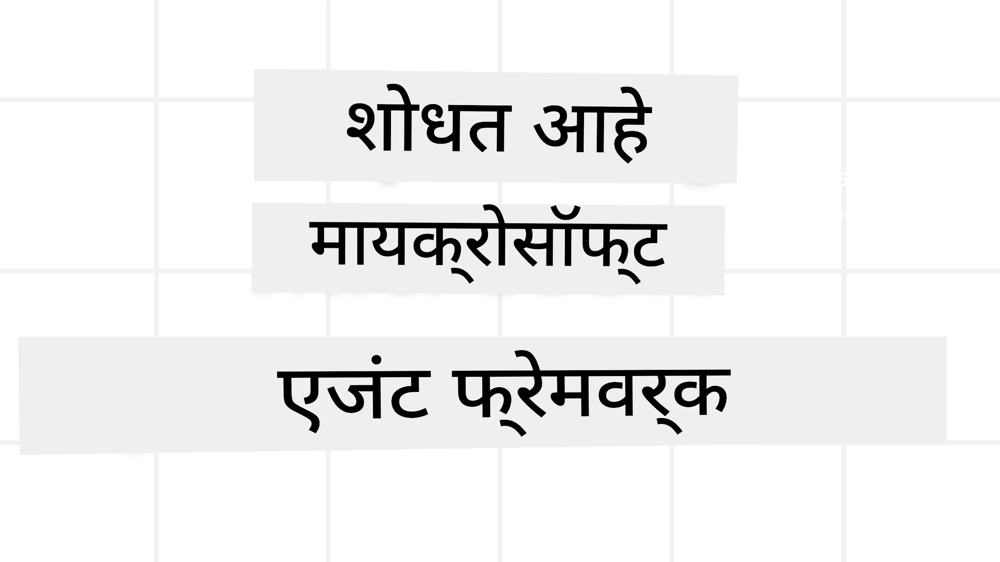

# मायक्रोसॉफ्ट एजंट फ्रेमवर्कची ओळख



### परिचय

हा धडा खालील विषयांचा आढावा घेईल:

- मायक्रोसॉफ्ट एजंट फ्रेमवर्क समजून घेणे: प्रमुख वैशिष्ट्ये आणि मूल्य  
- मायक्रोसॉफ्ट एजंट फ्रेमवर्कच्या मुख्य संकल्पनांचा अन्वेषण
- प्रगत MAF नमुने: वर्कफ्लोज, मिडलवेयर, आणि मेमोरी

## शिक्षणाचे उद्दिष्टे

हा धडा पूर्ण केल्यावर, तुम्हाला खालील गोष्टी माहित असतील:

- मायक्रोसॉफ्ट एजंट फ्रेमवर्क वापरून उत्पादनासाठी तयार एआय एजंट तयार करण्याची पद्धत
- मायक्रोसॉफ्ट एजंट फ्रेमवर्कचे मुख्य वैशिष्ट्ये तुमच्या एजंटिक वापर प्रकरणांवर लागू करणे
- प्रगत नमुने जसे की वर्कफ्लोज, मिडलवेयर, आणि निरीक्षणाचा वापर करणे

## कोड नमुने

[Microsoft Agent Framework (MAF)](https://aka.ms/ai-agents-beginners/agent-framewrok) साठी कोड नमुने या संचिकामध्ये `xx-python-agent-framework` आणि `xx-dotnet-agent-framework` फाइल्समध्ये मिळू शकतात.

## मायक्रोसॉफ्ट एजंट फ्रेमवर्क समजून घेणे


[Microsoft Agent Framework (MAF)](https://aka.ms/ai-agents-beginners/agent-framewrok) मायक्रोसॉफ्टचा एकसंध फ्रेमवर्क आहे जे एआय एजंट तयार करण्यासाठी वापरले जाते. हे उत्पादन आणि संशोधन वातावरणातील विविध एजंटिक वापर प्रकरणे हाताळण्यासाठी लवचिकता देते, ज्यात समाविष्ट आहे:

- **क्रमिक एजंट संयोजन** ज्यामध्ये टप्प्याटप्प्याने वर्कफ्लोज आवश्यक असतात.
- **समानकालीन संयोजन** जिथे एजंट्सना एकाच वेळी कार्य पूर्ण करावं लागते.
- **गट चॅट संयोजन** जिथे एजंट्स एकाच कार्यावर एकत्र काम करू शकतात.
- **हँडऑफ संयोजन** जिथे एजंट्स उपकार्य पूर्ण करताना एकमेकांना कार्य हस्तांतरीत करतात.
- **मॅग्नेटिक संयोजन** जिथे एक व्यवस्थापक एजंट कार्यांची यादी तयार करतो, बदलतो आणि उप-एजंट्सना समन्वयित करतो.

उत्पादनात एआय एजंट प्रदान करण्यासाठी, MAF मध्ये खालील वैशिष्ट्ये देखील आहेत:

- **निरीक्षणीयता** OpenTelemetry चा उपयोग करून जिथे एआय एजंटच्या प्रत्येक क्रियेला ट्रेस केले जाते, ज्यात साधन वापर, संयोजन टप्पे, विचारप्रक्रिया आणि मायक्रोसॉफ्ट फाउंड्री डॅशबोर्ड्सद्वारे कामगिरीचे निरीक्षण यांचा समावेश आहे.
- **सुरक्षा** मायक्रोसॉफ्ट फाउंड्रीवर नैसर्गिकरित्या एजंट होस्ट करून, ज्यात भूमिका आधारित प्रवेश, खाजगी डेटा हाताळणी आणि अंगभूत सामग्री सुरक्षेसारख्या सुरक्षा नियंत्रणांचा समावेश आहे.
- **टिकाऊपणा** जिथे एजंट थ्रेड्स आणि वर्कफ्लोज थांबू, सुरू करू आणि चुका सुधारू शकतात, ज्यामुळे अधिक लांब चालणारे प्रक्रिया शक्य होतात.
- **नियंत्रण** मानवी हस्तक्षेपासह वर्कफ्लोजसाठी समर्थन जिथे कार्यांना मानवी मंजुरी आवश्यक असल्याचे चिन्हांकन केले जाते.

मायक्रोसॉफ्ट एजंट फ्रेमवर्क खालील बाबींवरही लक्ष केंद्रीत करते:

- **क्लाउड-स्वतंत्र** - एजंट्स कंटेनरमध्ये, ऑन-प्रिम, आणि विविध क्लाउड्समध्ये चालू शकतात.
- **प्रदाता-स्वतंत्र** - एजंट्स तुमच्या प्राधान्यित SDK जसे की Azure OpenAI आणि OpenAI वापरून तयार करता येतात.
- **मुक्त मानके समाकलित करणे** - एजंट्स Agent-to-Agent(A2A) आणि Model Context Protocol (MCP) सारख्या प्रोटोकॉल्स वापरून इतर एजंट्स आणि साधने शोधू आणि वापरू शकतात.
- **प्लगइन्स आणि कनेक्टर्स** - मायक्रोसॉफ्ट फॅब्रिक, शेअरपॉइंट, पाइनकोन आणि क्युड्रंट यांसारख्या डेटा आणि मेमरी सेवा कनेक्ट करता येतात.

चला पाहूया कसे या वैशिष्ट्यांचा मायक्रोसॉफ्ट एजंट फ्रेमवर्कच्या काही मुख्य संकल्पनांवर उपयोग केला जातो.

## मायक्रोसॉफ्ट एजंट फ्रेमवर्कच्या मुख्य संकल्पना

### एजंट्स


**एजंट तयार करणे**

एजंट तयार करणे म्हणजे इन्फरन्स सेवा (LLM प्रदाता), एआय एजंटसाठी पाळावयाच्या सूचनांचा संच, आणि एक वाटप केलेले `नाव` यांचे निर्धारण करणे:

```python
agent = AzureOpenAIChatClient(credential=AzureCliCredential()).create_agent( instructions="You are good at recommending trips to customers based on their preferences.", name="TripRecommender" )
```

वरील कोड `Azure OpenAI` वापरत आहे परंतु एजंट विविध सेवांचा वापर करून तयार करता येतात ज्यामध्ये `Microsoft Foundry Agent Service` देखील आहे:

```python
AzureAIAgentClient(async_credential=credential).create_agent( name="HelperAgent", instructions="You are a helpful assistant." ) as agent
```

OpenAI चे `Responses`, `ChatCompletion` API

```python
agent = OpenAIResponsesClient().create_agent( name="WeatherBot", instructions="You are a helpful weather assistant.", )
```

```python
agent = OpenAIChatClient().create_agent( name="HelpfulAssistant", instructions="You are a helpful assistant.", )
```

किंवा [MiniMax](https://platform.minimaxi.com/), जे मोठ्या संदर्भ विंडोज (204K टोकनपर्यंत) सह OpenAI-सुसंगत API प्रदान करते:

```python
agent = OpenAIChatClient(base_url="https://api.minimax.io/v1", api_key=os.environ["MINIMAX_API_KEY"], model_id="MiniMax-M2.7").create_agent( name="HelpfulAssistant", instructions="You are a helpful assistant.", )
```

किंवा A2A प्रोटोकॉल वापरून रिमोट एजंट:

```python
agent = A2AAgent( name=agent_card.name, description=agent_card.description, agent_card=agent_card, url="https://your-a2a-agent-host" )
```

**एजंट चालवणे**

एजंट्स `.run` किंवा `.run_stream` पद्धतीने गैर-स्ट्रीमिंग अथवा स्ट्रीमिंग प्रतिसादांसाठी चालवले जातात.

```python
result = await agent.run("What are good places to visit in Amsterdam?")
print(result.text)
```

```python
async for update in agent.run_stream("What are the good places to visit in Amsterdam?"):
    if update.text:
        print(update.text, end="", flush=True)

```

प्रत्येक एजंट रनमध्ये एजंट वापरले जाणारे `max_tokens`, कॉल करू शकणारी `tools`, आणि वापरले जाणारे `model` यांसारख्या परिमाणांची सानुकूलता देखील असू शकते.

हे त्या परिस्थितींमध्ये उपयुक्त आहे जिथे विशिष्ट मॉडेल किंवा साधन वापरणे आवश्यक आहे.

**साधने (Tools)**

एजंट तयार करत असताना साधने परिभाषित केली जाऊ शकतात:

```python
def get_attractions( location: Annotated[str, Field(description="The location to get the top tourist attractions for")], ) -> str: """Get the top tourist attractions for a given location.""" return f"The top attractions for {location} are." 


# ChatAgent थेट तयार करताना

agent = ChatAgent( chat_client=OpenAIChatClient(), instructions="You are a helpful assistant", tools=[get_attractions]

```

आणि एजंट चालवताना देखील:

```python

result1 = await agent.run( "What's the best place to visit in Seattle?", tools=[get_attractions] # फक्त या रनसाठी उपकरण प्रदान केले आहे )
```

**एजंट थ्रेड्स**

एजंट थ्रेड्स बहु-परतावा संभाषण हाताळण्यासाठी वापरल्या जातात. थ्रेड तयार करता येतो:

- `get_new_thread()` वापरून ज्यामुळे थ्रेड वेळोवेळी जतन केली जाऊ शकते
- एजंट चालवताना आपोआप थ्रेड तयार होत असतो आणि तो केवळ सध्याच्या रनसाठी टिकतो.

थ्रेड तयार करण्यासाठी कोड असे दिसतो:

```python
# नवीन थ्रेड तयार करा.
thread = agent.get_new_thread() # थ्रेडसह एजंट चालवा.
response = await agent.run("Hello, I am here to help you book travel. Where would you like to go?", thread=thread)

```

त्यानंतर थ्रेड नंतरच्या वापरासाठी सिरीअलाइझ केली जाऊ शकते:

```python
# एक नवीन थ्रेड तयार करा.
thread = agent.get_new_thread() 

# थ्रेडसह एजंट चालवा.

response = await agent.run("Hello, how are you?", thread=thread) 

# संग्रहासाठी थ्रेड सीरियलाईज करा.

serialized_thread = await thread.serialize() 

# संग्रहातून लोड केल्यानंतर थ्रेडची स्थिती डीसीरियलाईज करा.

resumed_thread = await agent.deserialize_thread(serialized_thread)
```

**एजंट मिडलवेयर**

एजंट साधने आणि LLM शी संवाद साधून वापरकर्त्याच्या कार्य पूर्ण करतात. काही परिस्थितींमध्ये, संवादातील क्रिया ट्रॅक किंवा अंमलात आणण्यासाठी मिडलवेयर वापरतो. एजंट मिडलवेयरद्वारे हे शक्य होते:

*फंक्शन मिडलवेयर*

हा मिडलवेयर एजंट आणि फंक्शन/टूल यांच्यातील क्रियेच्या दरम्यान एक क्रिया करण्यास परवानगी देतो. उदाहरणार्थ, फंक्शन कॉलवर काही लॉगिंग करणे.

खालिल कोडमध्ये `next` हा पुनरावृत्ती मिडलवेयर किंवा प्रत्यक्ष फंक्शन सांगतो की कोणाला कॉल करायचे.

```python
async def logging_function_middleware(
    context: FunctionInvocationContext,
    next: Callable[[FunctionInvocationContext], Awaitable[None]],
) -> None:
    """Function middleware that logs function execution."""
    # पूर्व-प्रक्रिया: फंक्शन अंमलबजावणीपूर्वी लॉग करा
    print(f"[Function] Calling {context.function.name}")

    # पुढील मिडलवेअर किंवा फंक्शन अंमलबजावणीसाठी पुढे जा
    await next(context)

    # नंतर-प्रक्रिया: फंक्शन अंमलबजावणी नंतर लॉग करा
    print(f"[Function] {context.function.name} completed")
```

*चॅट मिडलवेयर*

हा मिडलवेयर एजंट आणि LLM दरम्यानच्या विनंत्यांमध्ये एक क्रिया अंमलात आणण्याची किंवा लॉगिंग करण्याची परवानगी देतो.

यामध्ये AI सेवा कडे पाठवले जाणारे `messages` यांसारखे महत्त्वाचे माहिती असते.

```python
async def logging_chat_middleware(
    context: ChatContext,
    next: Callable[[ChatContext], Awaitable[None]],
) -> None:
    """Chat middleware that logs AI interactions."""
    # पूर्व प्रक्रिया: AI कॉल करण्यापूर्वी लॉग करा
    print(f"[Chat] Sending {len(context.messages)} messages to AI")

    # पुढील मिडलवेअर किंवा AI सेवेकडे पुढे जा
    await next(context)

    # पोस्ट-प्रोसेसिंग: AI प्रतिसादानंतर लॉग करा
    print("[Chat] AI response received")

```

**एजंट मेमरी**

`Agentic Memory` धड्यात सांगितल्याप्रमाणे, मेमरी एजंटला विविध संदर्भांवर ऑपरेट करण्यास मदत करणारा महत्त्वाचा घटक आहे. MAF मध्ये वेगवेगळ्या प्रकारच्या मेमरीज दिल्या आहेत:

*इन-मेमरी स्टोरेज*

या मेमरीचा संग्रह थ्रेड्समध्ये अनुप्रयोगाच्या रनटाइम दरम्यान होतो.

```python
# एक नवीन थ्रेड तयार करा.
thread = agent.get_new_thread() # थ्रेडसह एजंट चालवा.
response = await agent.run("Hello, I am here to help you book travel. Where would you like to go?", thread=thread)
```

*सतत असलेली संदेशे*

ही मेमरी विविध सत्रांदरम्यान संभाषण इतिहास जतन करण्यासाठी वापरली जाते. हे `chat_message_store_factory` वापरून परिभाषित केले जाते:

```python
from agent_framework import ChatMessageStore

# सानुकूल संदेश संग्रह तयार करा
def create_message_store():
    return ChatMessageStore()

agent = ChatAgent(
    chat_client=OpenAIChatClient(),
    instructions="You are a Travel assistant.",
    chat_message_store_factory=create_message_store
)

```

*डायनामिक मेमरी*

ही मेमरी एजंट चालवण्याच्या आधी संदर्भात जोडली जाते. ही मेमरी बाह्य सेवांमध्ये जसे mem0 मध्ये साठवली जाऊ शकते:

```python
from agent_framework.mem0 import Mem0Provider

# प्रगत स्मृती क्षमतांसाठी Mem0 वापरणे
memory_provider = Mem0Provider(
    api_key="your-mem0-api-key",
    user_id="user_123",
    application_id="my_app"
)

agent = ChatAgent(
    chat_client=OpenAIChatClient(),
    instructions="You are a helpful assistant with memory.",
    context_providers=memory_provider
)

```

**एजंट निरीक्षणीयता**

एजंट प्रणाली विश्वसनीय आणि देखभाल करण्यायोग्य बनवण्यासाठी निरीक्षणीयता महत्त्वाची आहे. MAF OpenTelemetry सह समाकलित आहे ज्यामुळे ट्रेसिंग आणि मीटरिंगद्वारे चांगली निरीक्षणीयता मिळते.

```python
from agent_framework.observability import get_tracer, get_meter

tracer = get_tracer()
meter = get_meter()
with tracer.start_as_current_span("my_custom_span"):
    # काहीतरी करा
    pass
counter = meter.create_counter("my_custom_counter")
counter.add(1, {"key": "value"})
```

### वर्कफ्लोज

MAF वर्कफ्लोज ऑफर करते ज्या पूर्वनिर्धारित टप्प्यांमधून कार्य पूर्ण करण्यात मदत करतात आणि त्या टप्प्यांमध्ये एआय एजंट घटक म्हणून असतात.

वर्कफ्लोज विविध घटकांनी बनलेले असतात जे नियंत्रण प्रवाहास मदत करतात. वर्कफ्लोज अनेक एजंटांचे संयोजन आणि वर्कफ्लोजची स्थिती जतन करणे (checkpointing) सक्षम करतात.

वर्तमान घटक:

**कार्यकारिणी (Executors)**

कार्यकारिणी इनपुट संदेश प्राप्त करतात, दिलेले कार्य पार पाडतात, आणि आउटपुट संदेश तयार करतात. हे मोठ्या कार्याकडे वर्कफ्लोला पुढे घेऊन जातं. कार्यकारिणी AI एजंट किंवा सानुकूल लॉजिक असू शकतात.

**कडा (Edges)**

वर्कफ्लोजमधील संदेशांचे प्रवाह ठरवण्यासाठी कडा वापरल्या जातात. यामध्ये असू शकतात:

*थेट कडा* - एक ते एक साधे कनेक्शन कार्यकारिणी दरम्यान:

```python
from agent_framework import WorkflowBuilder

builder = WorkflowBuilder()
builder.add_edge(source_executor, target_executor)
builder.set_start_executor(source_executor)
workflow = builder.build()
```

*परिस्थितीनुसार कडा* - काही अटी पूर्ण झाल्यावर सक्रिय होणाऱ्या कडा. उदाहरणार्थ, जेव्हा हॉटेलच्या खोल्या उपलब्ध नसतात तेव्हा इतर पर्याय सुचविणे.

*स्विच-केस कडा* - निश्चित अटींवर आधारित संदेश वेगवेगळ्या कार्यकारिणीकडे पाठवतात. उदाहरणार्थ, प्रवासी ग्राहकाना प्राधान्य प्रवेश असल्यास त्यांचे कार्य वेगळी वर्कफ्लोजद्वारे हाताळले जातील.

*फॅन-आऊट कडा* - एक संदेश अनेक लक्ष्यांकडे पाठवणे.

*फॅन-इन कडा* - वेगवेगळ्या कार्यकारिणीकडून अनेक संदेश गोळा करणे आणि एका लक्ष्याला पाठवणे.

**घटना (Events)**

वर्कफ्लोजच्या कार्यशीलतेत चांगली निरीक्षणीयता मिळवण्यासाठी, MAFमध्ये अंतर्भूत कार्यान्वयन घटना आहेत ज्यात समाविष्ट आहे:

- `WorkflowStartedEvent` - वर्कफ्लोची कार्यवाही सुरू झाली
- `WorkflowOutputEvent` - वर्कफ्लो उत्पन्न संदेश निर्माण करतो
- `WorkflowErrorEvent` - वर्कफ्लोमध्ये त्रुटी आली
- `ExecutorInvokeEvent` - कार्यकारिणी प्रक्रिया सुरू करते
- `ExecutorCompleteEvent` - कार्यकारिणी प्रक्रिया पूर्ण करते
- `RequestInfoEvent` - एक विनंती जारी केली गेली

## प्रगत MAF नमुने

वरील विभाग मायक्रोसॉफ्ट एजंट फ्रेमवर्कच्या मुख्य संकल्पना समजावतात. जसे तुम्ही अधिक जटिल एजंट तयार करत जाता, पुढील प्रगत नमुने विचारात घ्या:

- **मिडलवेयर संयोजन**: अनेक मिडलवेयर हँडलर (लॉगिंग, प्रमाणीकरण, दरमर्यादा) फंक्शन आणि चॅट मिडलवेयर वापरून साखळीने जोडणे जेणेकरून एजंट वर्तनावर सूक्ष्म नियंत्रण मिळेल.
- **वर्कफ्लो चेकपॉइंटिंग**: वर्कफ्लोच्या घटनांचा आणि सिरीअलायझेशनचा वापर करून लांब चालणाऱ्या एजंट प्रक्रियेची स्थिती जतन करणे आणि पुन्हा सुरू करणे.
- **डायनामिक टूल निवड**: RAG टूल वर्णनांवर आधारित उपकरणांची निवड MAFच्या टूल नोंदणीसह संयोजित करून प्रत्येक क्वेरीसाठी संबंधित टूल्स सादर करणे.
- **बहु-एजंट हँडऑफ**: वर्कफ्लो कड्या आणि परिस्थितिनुसार मार्गदर्शन वापरून विशेषीकृत एजंट्स दरम्यान कार्य हस्तांतरणाचे संयोजन करणे.

## कोड नमुने

मायक्रोसॉफ्ट एजंट फ्रेमवर्कसाठी कोड नमुने या संचिकेमध्ये `xx-python-agent-framework` आणि `xx-dotnet-agent-framework` फाइल्समध्ये उपलब्ध आहेत.

## मायक्रोसॉफ्ट एजंट फ्रेमवर्कबाबत अजून प्रश्न आहेत का?

इतर शिकणाऱ्यांना भेटण्यासाठी, ऑफिस अवर्समध्ये सहभागी होण्यासाठी आणि तुमच्या एआय एजंट प्रश्नांची उत्तरे मिळवण्यासाठी [Microsoft Foundry Discord](https://aka.ms/ai-agents/discord) मध्ये सहभागी व्हा.

---

<!-- CO-OP TRANSLATOR DISCLAIMER START -->
**अस्वीकरण**:  
हा दस्तऐवज AI अनुवाद सेवा [Co-op Translator](https://github.com/Azure/co-op-translator) वापरून अनुवादित केला आहे. आम्ही अचूकतेसाठी प्रयत्नशील आहोत, परंतु कृपया लक्षात ठेवा की स्वयंचलित अनुवादांमध्ये चुका किंवा अचूकतेच्या त्रुटी असू शकतात. मूळ दस्तऐवज त्याच्या स्थानिक भाषेत अधिकृत स्रोत मानला जावा. महत्त्वाच्या माहितीसाठी व्यावसायिक मानवी अनुवादाची शिफारस केली जाते. या अनुवादाच्या वापराबद्दल उद्भवणाऱ्या कोणत्याही गैरसमज किंवा चुकीच्या अर्थलागीसाठी आम्ही जबाबदार नाही.
<!-- CO-OP TRANSLATOR DISCLAIMER END -->