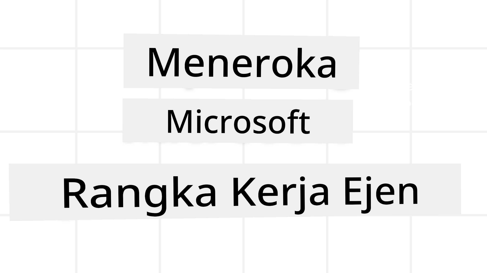
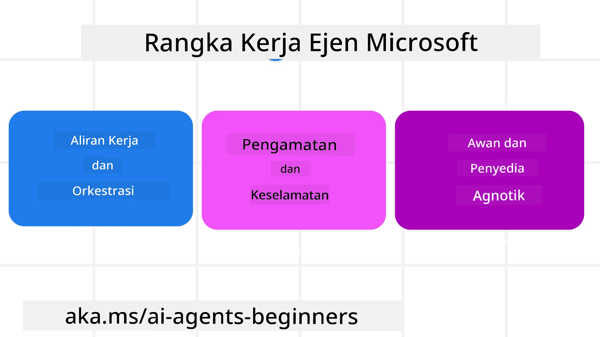

# Meneroka Rangka Kerja Ejen Microsoft



### Pengenalan

Pelajaran ini akan merangkumi:

- Memahami Rangka Kerja Ejen Microsoft: Ciri Utama dan Nilai  
- Meneroka Konsep Utama Rangka Kerja Ejen Microsoft
- Corak MAF Lanjutan: Aliran Kerja, Middleware, dan Memori

## Matlamat Pembelajaran

Selepas menyelesaikan pelajaran ini, anda akan tahu cara untuk:

- Membina Ejen AI Sedia untuk Produksi menggunakan Rangka Kerja Ejen Microsoft
- Mengaplikasikan ciri teras Rangka Kerja Ejen Microsoft kepada Kes Penggunaan Ejen anda
- Menggunakan corak lanjutan termasuk aliran kerja, middleware, dan kebolehpantauan

## Contoh Kod

Contoh kod untuk [Rangka Kerja Ejen Microsoft (MAF)](https://aka.ms/ai-agents-beginners/agent-framewrok) boleh didapati dalam repositori ini di bawah fail `xx-python-agent-framework` dan `xx-dotnet-agent-framework`.

## Memahami Rangka Kerja Ejen Microsoft



[Microsoft Agent Framework (MAF)](https://aka.ms/ai-agents-beginners/agent-framewrok) adalah rangka kerja bersatu Microsoft untuk membina ejen AI. Ia menawarkan fleksibiliti untuk menangani pelbagai kes penggunaan ejen yang dilihat dalam persekitaran produksi dan penyelidikan termasuk:

- **Orkestrasi Ejen Berurutan** dalam senario di mana aliran kerja langkah demi langkah diperlukan.
- **Orkestrasi Serentak** dalam senario di mana ejen perlu menyelesaikan tugasan pada masa yang sama.
- **Orkestrasi Chat Berkumpulan** dalam senario di mana ejen boleh bekerjasama dalam satu tugasan.
- **Orkestrasi Penyerahan** dalam senario di mana ejen menyerahkan tugasan antara satu sama lain apabila subtugas diselesaikan.
- **Orkestrasi Magnetik** dalam senario di mana ejen pengurus mencipta dan mengubah senarai tugasan serta mengendalikan koordinasi subagen untuk menyelesaikan tugasan.

Untuk menyampaikan Ejen AI dalam Produksi, MAF juga telah menyertakan ciri untuk:

- **Kebolehpantauan** melalui penggunaan OpenTelemetry di mana setiap tindakan Ejen AI termasuk panggilan alat, langkah orkestrasi, aliran alasan dan pemantauan prestasi melalui papan pemuka Microsoft Foundry.
- **Keselamatan** dengan mengehos ejen secara asli pada Microsoft Foundry yang merangkumi kawalan keselamatan seperti akses berasaskan peranan, pengendalian data peribadi dan keselamatan kandungan terbina dalam.
- **Ketahanan** kerana benang dan aliran kerja Ejen boleh berhenti, disambung semula dan pulih daripada ralat yang membolehkan proses berjalan lebih lama.
- **Kawalan** kerana aliran kerja human-in-the-loop disokong di mana tugasan ditandakan sebagai memerlukan kelulusan manusia.

Rangka Kerja Ejen Microsoft juga fokus pada kebolehinteroperasi dengan:

- **Bersifat Awan-agnostik** - Ejen boleh dijalankan dalam kontena, di premis dan merentasi pelbagai awan yang berbeza.
- **Bersifat Pembekal-agnostik** - Ejen boleh dicipta melalui SDK pilihan anda termasuk Azure OpenAI dan OpenAI
- **Mengintegrasikan Piawaian Terbuka** - Ejen boleh menggunakan protokol seperti Agent-to-Agent (A2A) dan Model Context Protocol (MCP) untuk mencari dan menggunakan ejen dan alat lain.
- **Plugin dan Penyambung** - Sambungan boleh dibuat ke perkhidmatan data dan memori seperti Microsoft Fabric, SharePoint, Pinecone dan Qdrant.

Mari lihat bagaimana ciri-ciri ini diterapkan pada beberapa konsep teras Rangka Kerja Ejen Microsoft.

## Konsep Utama Rangka Kerja Ejen Microsoft

### Ejen


**Mencipta Ejen**

Penciptaan ejen dilakukan dengan menentukan perkhidmatan inferens (Pembekal LLM), satu set arahan untuk ejen AI ikut, dan `nama` yang diberikan:

```python
agent = AzureOpenAIChatClient(credential=AzureCliCredential()).create_agent( instructions="You are good at recommending trips to customers based on their preferences.", name="TripRecommender" )
```

Di atas menggunakan `Azure OpenAI` tetapi ejen boleh dicipta menggunakan pelbagai perkhidmatan termasuk `Microsoft Foundry Agent Service`:

```python
AzureAIAgentClient(async_credential=credential).create_agent( name="HelperAgent", instructions="You are a helpful assistant." ) as agent
```

API OpenAI `Responses`, `ChatCompletion`

```python
agent = OpenAIResponsesClient().create_agent( name="WeatherBot", instructions="You are a helpful weather assistant.", )
```

```python
agent = OpenAIChatClient().create_agent( name="HelpfulAssistant", instructions="You are a helpful assistant.", )
```

atau [MiniMax](https://platform.minimaxi.com/), yang menyediakan API yang serasi dengan OpenAI dengan tetingkap konteks besar (sehingga 204K token):

```python
agent = OpenAIChatClient(base_url="https://api.minimax.io/v1", api_key=os.environ["MINIMAX_API_KEY"], model_id="MiniMax-M2.7").create_agent( name="HelpfulAssistant", instructions="You are a helpful assistant.", )
```

atau ejen jauh menggunakan protokol A2A:

```python
agent = A2AAgent( name=agent_card.name, description=agent_card.description, agent_card=agent_card, url="https://your-a2a-agent-host" )
```

**Menjalankan Ejen**

Ejen dijalankan menggunakan kaedah `.run` atau `.run_stream` untuk respons bukan streaming atau streaming.

```python
result = await agent.run("What are good places to visit in Amsterdam?")
print(result.text)
```

```python
async for update in agent.run_stream("What are the good places to visit in Amsterdam?"):
    if update.text:
        print(update.text, end="", flush=True)

```

Setiap jalankan ejen juga boleh mempunyai pilihan untuk menyesuaikan parameter seperti `max_tokens` yang digunakan oleh ejen, `tools` yang boleh dipanggil oleh ejen, dan bahkan `model` itu sendiri yang digunakan untuk ejen.

Ini berguna dalam kes di mana model atau alat tertentu diperlukan untuk menyelesaikan tugasan pengguna.

**Alat**

Alat boleh ditakrifkan semasa mendefinisikan ejen:

```python
def get_attractions( location: Annotated[str, Field(description="The location to get the top tourist attractions for")], ) -> str: """Get the top tourist attractions for a given location.""" return f"The top attractions for {location} are." 


# Apabila mencipta ChatAgent secara langsung

agent = ChatAgent( chat_client=OpenAIChatClient(), instructions="You are a helpful assistant", tools=[get_attractions]

```

dan juga semasa menjalankan ejen:

```python

result1 = await agent.run( "What's the best place to visit in Seattle?", tools=[get_attractions] # Alat disediakan untuk larian ini sahaja )
```

**Benang Ejen**

Benang Ejen digunakan untuk mengendalikan perbualan berbilang giliran. Benang boleh dicipta sama ada dengan:

- Menggunakan `get_new_thread()` yang membolehkan benang disimpan untuk jangka masa panjang
- Mencipta benang secara automatik apabila menjalankan ejen dan benang itu hanya wujud sepanjang sesi jalankan itu.

Untuk mencipta benang, kodnya kelihatan seperti ini:

```python
# Cipta benang baru.
thread = agent.get_new_thread() # Jalankan ejen dengan benang tersebut.
response = await agent.run("Hello, I am here to help you book travel. Where would you like to go?", thread=thread)

```

Anda kemudian boleh menyalin benang tersebut untuk disimpan kegunaan kemudian:

```python
# Buat utas baru.
thread = agent.get_new_thread() 

# Jalankan ejen dengan utas.

response = await agent.run("Hello, how are you?", thread=thread) 

# Siri utas untuk penyimpanan.

serialized_thread = await thread.serialize() 

# Nyah siri keadaan utas selepas memuat dari penyimpanan.

resumed_thread = await agent.deserialize_thread(serialized_thread)
```

**Middleware Ejen**

Ejen berinteraksi dengan alat dan LLM untuk menyelesaikan tugasan pengguna. Dalam sesetengah senario, kita ingin melaksanakan atau menjejaki interaksi antara mereka. Middleware ejen membolehkan kita melakukan ini melalui:

*Middleware Fungsi*

Middleware ini membolehkan kita melaksanakan tindakan antara ejen dan fungsi/alat yang akan dipanggilnya. Contoh penggunaan adalah semasa anda ingin mencatat pada panggilan fungsi.

Dalam kod di bawah `next` menentukan sama ada middleware seterusnya atau fungsi sebenar yang harus dipanggil.

```python
async def logging_function_middleware(
    context: FunctionInvocationContext,
    next: Callable[[FunctionInvocationContext], Awaitable[None]],
) -> None:
    """Function middleware that logs function execution."""
    # Pralaksanaan: Log sebelum pelaksanaan fungsi
    print(f"[Function] Calling {context.function.name}")

    # Teruskan ke middleware seterusnya atau pelaksanaan fungsi
    await next(context)

    # Pasca-pemprosesan: Log selepas pelaksanaan fungsi
    print(f"[Function] {context.function.name} completed")
```

*Middleware Chat*

Middleware ini membolehkan kita melaksanakan atau mencatat tindakan antara ejen dan permintaan antara LLM.

Ini mengandungi maklumat penting seperti `messages` yang dihantar ke perkhidmatan AI.

```python
async def logging_chat_middleware(
    context: ChatContext,
    next: Callable[[ChatContext], Awaitable[None]],
) -> None:
    """Chat middleware that logs AI interactions."""
    # Pra-pemprosesan: Log sebelum panggilan AI
    print(f"[Chat] Sending {len(context.messages)} messages to AI")

    # Teruskan ke middleware atau perkhidmatan AI seterusnya
    await next(context)

    # Pasca-pemprosesan: Log selepas respons AI
    print("[Chat] AI response received")

```

**Memori Ejen**

Seperti yang dibincangkan dalam pelajaran `Memori Ejen`, memori adalah elemen penting untuk membolehkan ejen beroperasi dalam konteks berbeza. MAF menawarkan beberapa jenis memori:

*Penyimpanan Dalam Memori*

Ini adalah memori yang disimpan di dalam benang semasa runtime aplikasi.

```python
# Cipta benang baru.
thread = agent.get_new_thread() # Jalankan ejen dengan benang tersebut.
response = await agent.run("Hello, I am here to help you book travel. Where would you like to go?", thread=thread)
```

*Mesej Kekal*

Memori ini digunakan apabila menyimpan sejarah perbualan merentas sesi yang berbeza. Ia ditakrifkan menggunakan `chat_message_store_factory` :

```python
from agent_framework import ChatMessageStore

# Cipta stor mesej tersuai
def create_message_store():
    return ChatMessageStore()

agent = ChatAgent(
    chat_client=OpenAIChatClient(),
    instructions="You are a Travel assistant.",
    chat_message_store_factory=create_message_store
)

```

*Memori Dinamik*

Memori ini ditambah ke konteks sebelum ejen dijalankan. Memori ini boleh disimpan dalam perkhidmatan luar seperti mem0:

```python
from agent_framework.mem0 import Mem0Provider

# Menggunakan Mem0 untuk keupayaan memori lanjutan
memory_provider = Mem0Provider(
    api_key="your-mem0-api-key",
    user_id="user_123",
    application_id="my_app"
)

agent = ChatAgent(
    chat_client=OpenAIChatClient(),
    instructions="You are a helpful assistant with memory.",
    context_providers=memory_provider
)

```

**Kebolehpantauan Ejen**

Kebolehpantauan adalah penting untuk membina sistem ejen yang boleh dipercayai dan boleh diselenggara. MAF mengintegrasi dengan OpenTelemetry untuk menyediakan penjejakan dan meter untuk kebolehpantauan yang lebih baik.

```python
from agent_framework.observability import get_tracer, get_meter

tracer = get_tracer()
meter = get_meter()
with tracer.start_as_current_span("my_custom_span"):
    # lakukan sesuatu
    pass
counter = meter.create_counter("my_custom_counter")
counter.add(1, {"key": "value"})
```

### Aliran Kerja

MAF menawarkan aliran kerja yang merupakan langkah pra-takrif untuk menyelesaikan tugasan dan termasuk ejen AI sebagai komponen dalam langkah-langkah tersebut.

Aliran kerja terdiri daripada komponen yang berbeza yang membolehkan aliran kawalan yang lebih baik. Aliran kerja juga membolehkan **orkestrasi multi-ejen** dan **checkpointing** untuk menyimpan keadaan aliran kerja.

Komponen teras aliran kerja adalah:

**Pelaksana**

Pelaksana menerima mesej input, melaksanakan tugasan yang diberikan, kemudian menghasilkan mesej output. Ini menggerakkan aliran kerja ke arah menyelesaikan tugasan lebih besar. Pelaksana boleh menjadi ejen AI atau logik custom.

**Edges**

Edges digunakan untuk mentakrifkan aliran mesej dalam aliran kerja. Ini boleh menjadi:

*Edges Langsung* - Sambungan satu-ke-satu mudah antara pelaksana:

```python
from agent_framework import WorkflowBuilder

builder = WorkflowBuilder()
builder.add_edge(source_executor, target_executor)
builder.set_start_executor(source_executor)
workflow = builder.build()
```

*Edges Bersyarat* - Diaktifkan selepas syarat tertentu dipenuhi. Contohnya, apabila bilik hotel tiada, pelaksana boleh mencadangkan pilihan lain.

*Edges Kes Beralih* - Menghala mesej ke pelaksana yang berbeza berdasarkan syarat yang ditakrif. Contohnya, jika pelanggan perjalanan mempunyai akses keutamaan dan tugas mereka akan dikendalikan melalui aliran kerja lain.

*Edges Fan-out* - Menghantar satu mesej ke pelbagai sasaran.

*Edges Fan-in* - Mengumpul pelbagai mesej daripada pelaksana berbeza dan menghantar ke satu sasaran.

**Peristiwa**

Untuk menyediakan kebolehpantauan yang lebih baik ke dalam aliran kerja, MAF menawarkan peristiwa bawaan untuk pelaksanaan termasuk:

- `WorkflowStartedEvent`  - Pelaksanaan aliran kerja bermula
- `WorkflowOutputEvent` - Aliran kerja menghasilkan output
- `WorkflowErrorEvent` - Aliran kerja menghadapi ralat
- `ExecutorInvokeEvent`  - Pelaksana mula memproses
- `ExecutorCompleteEvent`  -  Pelaksana selesai memproses
- `RequestInfoEvent` - Permintaan dikeluarkan

## Corak MAF Lanjutan

Bahagian di atas merangkumi konsep utama Rangka Kerja Ejen Microsoft. Semasa anda membina ejen yang lebih kompleks, berikut adalah beberapa corak lanjutan yang perlu dipertimbangkan:

- **Komposisi Middleware**: Rangka middleware handler berganda (pencatatan, pengesahan, had kadar) menggunakan middleware fungsi dan chat untuk kawalan halus ke atas tingkah laku ejen.
- **Checkpointing Aliran Kerja**: Gunakan peristiwa aliran kerja dan penyalinan bagi menyimpan dan menyambung proses ejen yang berjalan lama.
- **Pemilihan Alat Dinamik**: Gabungkan RAG ke atas penerangan alat dengan pendaftaran alat MAF untuk membentangkan hanya alat relevan bagi setiap pertanyaan.
- **Penyerahan Multi-Ejen**: Gunakan edges aliran kerja dan penghalaan bersyarat untuk mengatur penyerahan antara ejen khusus.

## Contoh Kod

Contoh kod untuk Rangka Kerja Ejen Microsoft boleh didapati dalam repositori ini di bawah fail `xx-python-agent-framework` dan `xx-dotnet-agent-framework`.

## Ada Lebih Banyak Soalan Tentang Rangka Kerja Ejen Microsoft?

Sertai [Microsoft Foundry Discord](https://aka.ms/ai-agents/discord) untuk bertemu dengan pelajar lain, menghadiri waktu pejabat dan mendapatkan soalan Ejen AI anda dijawab.

---

<!-- CO-OP TRANSLATOR DISCLAIMER START -->
**Penafian**:  
Dokumen ini telah diterjemahkan menggunakan perkhidmatan terjemahan AI [Co-op Translator](https://github.com/Azure/co-op-translator). Walaupun kami berusaha untuk ketepatan, sila ambil perhatian bahawa terjemahan automatik mungkin mengandungi kesilapan atau ketidaktepatan. Dokumen asal dalam bahasa asalnya harus dianggap sebagai sumber yang sahih. Untuk maklumat penting, terjemahan profesional oleh manusia adalah disyorkan. Kami tidak bertanggungjawab terhadap sebarang salah faham atau salah tafsir yang timbul daripada penggunaan terjemahan ini.
<!-- CO-OP TRANSLATOR DISCLAIMER END -->