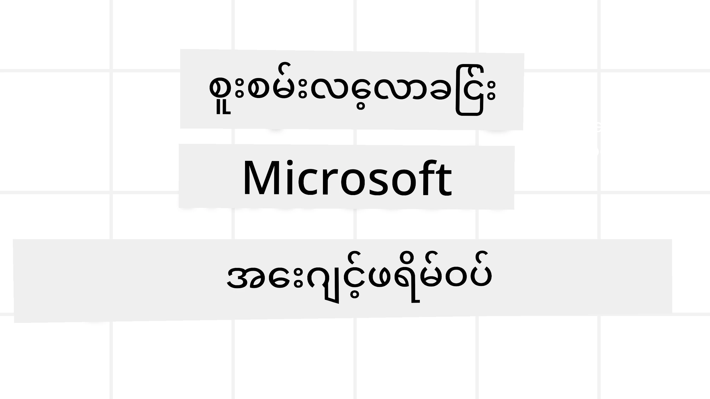
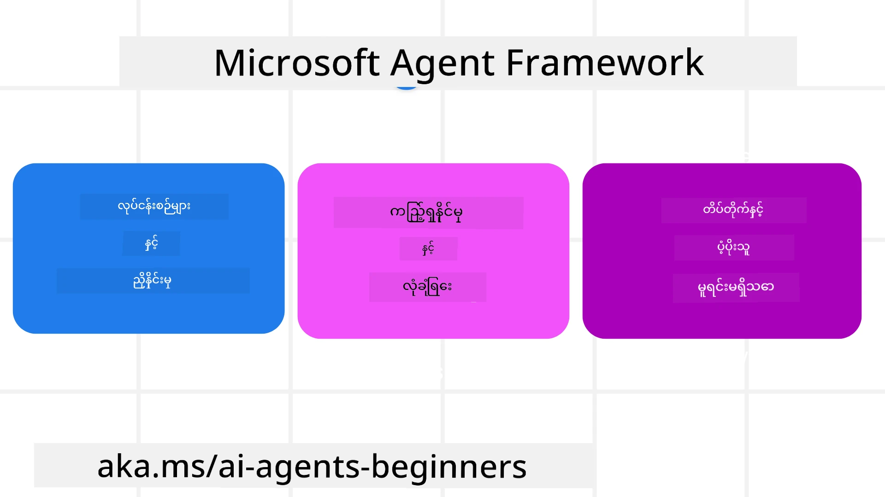
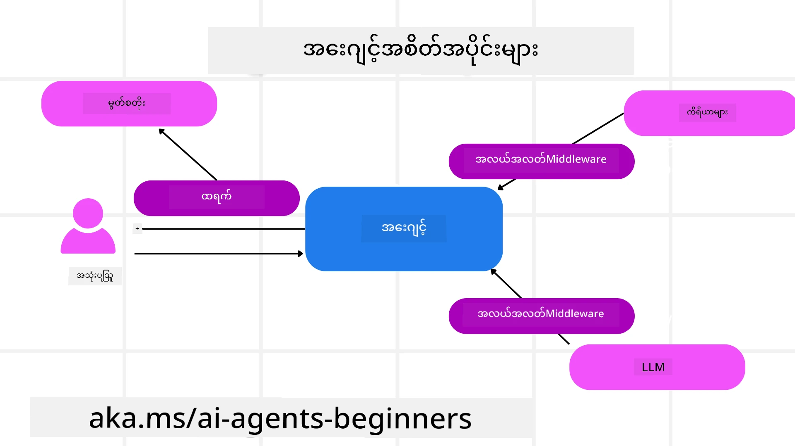

# Microsoft Agent Framework ကို ရှာဖွေခြင်း



### နိဒါန်း

ဒီသင်ခန်းစာမှာ ပါဝင်မယ့်အကြောင်းအရာတွေကတော့ -

- Microsoft Agent Framework ကိုနားလည်ခြင်း: အဓိက လက္ခဏာများနှင့် တန်ဖိုး  
- Microsoft Agent Framework ၏ အဓိက သိမွတ်ချက်များကို ရှာဖွေခြင်း
- ကျွမ်းကျင် MAF ပုံစံများ: အလုပ်စဉ်များ၊ Middleware နှင့် မှတ်ဉာဏ်

## သင်ယူလိုသော ရည်ရွယ်ချက်များ

ဒီသင်ခန်းစာပြီးဆုံးပြီးနောက် သင် သိရှိမည့်အရာများမှာ -

- Microsoft Agent Framework အသုံးပြု၍ ထုတ်လုပ်မှုအသင့် AI Agents များ ဖန်တီးနိုင်ခြင်း
- သင်၏ Agentic အသုံးပြုမှုကိစ္စများအတွက် Microsoft Agent Framework ၏ အဓိက လက္ခဏာများကို လျှောက်ထားနိုင်ခြင်း
- အလုပ်စဉ်များ၊ middleware နှင့် ကြည့်ရှုစောင့်ကြည့်မှုများအပါအဝင် အဆင့်မြင့်ပုံစံများအသုံးပြုနိုင်ခြင်း

## ကုဒ် နမူနာများ

[Microsoft Agent Framework (MAF)](https://aka.ms/ai-agents-beginners/agent-framewrok) အတွက် ကုဒ်နမူနာများကို ဒီ repository ပြင်ပမှာရှိသည့် `xx-python-agent-framework` နှင့် `xx-dotnet-agent-framework` ဖိုင်များတွင် တွေ့နိုင်ပါသည်။

## Microsoft Agent Framework ကို နားလည်ခြင်း



[Microsoft Agent Framework (MAF)](https://aka.ms/ai-agents-beginners/agent-framewrok) သည် AI agents ဖန်တီးရန် Microsoft ၏ ပေါင်းစည်းထားသော framework ဖြစ်သည်။ ထုတ်လုပ်မှုနှင့် သုတေသန လုပ်ငန်းရပ်များတွင် တွေ့ရသော အမျိုးမျိုးသော agentic အသုံးအနှုန်းများကို ဆက်သွယ်ရွေ့လျားနိုင်ခြင်းကို ပေးစွမ်းသည်။ ထိုမှာ -

- **အဆင့်လိုက် Agent နည်းလမ်း** (Sequential Agent orchestration) - အဆင့်ဆင့် အလုပ်စဉ်များလိုအပ်သောအခါ။
- **တပြိုင်နက်မှ ကြားဝင်မှု** (Concurrent orchestration) - Agent များ တပြိုင်နက် အလုပ်များ ပြီးမြောက်စေရန်။
- **အဖွဲ့ chat ရှိခြင်း** (Group chat orchestration) - Agent များ တစ်ခုတည်းသော အလုပ်တွင် ပူးပေါင်းလုပ်ဆောင်နိုင်ခြင်း။
- **အလုပ်အပ်ပြီး ကွဲပြားဝေငှပေးခြင်း** (Handoff Orchestration) - Subtask များပြီးဆုံးသောအခါ agent များ အတူတကွ ဦးစားပေးကူညီဝေငှခြင်း။
- **Magnetic Orchestration** - မန်နေဂျာ agent တစ်ယောက်က အလုပ်စာရင်းပြုပြင်ပြီး subagents များကို အလုပ်များ ပြီးမြောက်အောင် စီမံခန့်ခွဲခြင်း။

ထုတ်လုပ်မှုတွင် AI Agents များ မိတ်ဆက်ရန် MAF အောက်ပါ လက္ခဏာများပါဝင်သည် -

- **ကြည့်ရှုနိုင်မှု** (Observability) - OpenTelemetry အသုံးပြု၍ AI Agent ၏ လုပ်ဆောင်ချက်တိုင်း၌ သွားလာမှု၊ နည်းလမ်းပြောင်းလဲခြင်း၊ ဆုံးဖြတ်ချက်များ၊ Microsoft Foundry dashboard များဖြင့် လုပ်ဆောင်မှု ကြည့်ရှုစောင့်ကြည့်မှု။
- **လုံခြုံရေး** (Security) - Microsoft Foundry ပေါ်တွင် native ဖြစ်စေ agent များဟာ role-based access, ပုဂ္ဂလိကဒေတာ ကိုင်တွယ်ခြင်းနှင့် built-in ပစ္စည်းလုံခြုံရေး စနစ်ပါဝင်။
- **တည်တံ့ခံနိုင်မှု** (Durability) - Agent threads နှင့် workflows များသည် ရပ်နား၊ ထပ်မံစတင်၊ အမှားမှ ပြန်လည် ဆဲလျင်ရှိနိုင်သည့်ကောလဟာလ။
- **ထိန်းချုပ်မှု** (Control) - လူ့ထံအတည်ပြုချက်လိုအပ်သည့် အလုပ်စဉ်များကို ထောက်ပံ့သည်။

Microsoft Agent Framework သည် ဖြတ်သန်းချက်ဖြစ်ပေါ်စေရန်လည်း ဂရုပြုသည် -

- **Cloud မဟုတ်သည့် ဖြေလျော့ချက်** - Agent များသည် containers, on-premises နှင့် cloud များ ရပ်တည်နိုင်။
- **Provider မဟုတ်သည့် ဖြေလျော့ချက်** - သင်နှစ်သက်သည့် SDK များဖြင့် ဖန်တီးနိုင်၊ Azure OpenAI နှင့် OpenAI ပါဝင်။
- **ဖွင့်လှစ် စံသတ်မှတ်ချက်များ ပါဝင်ခြင်း** - Agent-to-Agent (A2A) နှင့် Model Context Protocol (MCP) ကဲ့သို့သော protocol များအား အသုံးပြုနိုင်ခြင်း။
- **Plugins နှင့် Connectors** - Microsoft Fabric, SharePoint, Pinecone, Qdrant စသည့် ဒေတာနှင့် မှတ်ဉာဏ် ဝန်ဆောင်မှုများနှင့် ချိတ်ဆက်နိုင်ခြင်း။

အခုတော့ Microsoft Agent Framework ၏ အဓိက သိမွတ်ချက်များတွင် ဤလက္ခဏာများကို မည်သိုကာ အသုံးချနိုင်ကြောင်း ကြည့်ကြပါစို့။

## Microsoft Agent Framework ၏ အဓိက သိမွတ်ချက်များ

### Agents



**Agent များ ဖန်တီးခြင်း**

Agent ဖန်တီးခြင်းသည် inference service (LLM Provider) ကို သတ်မှတ်ခြင်း၊ AI Agent မလိုက်နာရန် အညွှန်းများ သတ်မှတ်ခြင်းနှင့် ပေးအပ်ထားသော `name` ဖြင့် ပြုလုပ်သည်-

```python
agent = AzureOpenAIChatClient(credential=AzureCliCredential()).create_agent( instructions="You are good at recommending trips to customers based on their preferences.", name="TripRecommender" )
```
  
အထက်ပါမှာ `Azure OpenAI` ကို အသုံးပြုထားသော်လည်း agent များကို အမျိုးမျိုးသော ဝန်ဆောင်မှုများဖြင့် ဖန်တီးနိုင်သည်၊ ဥပမာ `Microsoft Foundry Agent Service`:

```python
AzureAIAgentClient(async_credential=credential).create_agent( name="HelperAgent", instructions="You are a helpful assistant." ) as agent
```
  
OpenAI `Responses`, `ChatCompletion` APIs

```python
agent = OpenAIResponsesClient().create_agent( name="WeatherBot", instructions="You are a helpful weather assistant.", )
```
  
```python
agent = OpenAIChatClient().create_agent( name="HelpfulAssistant", instructions="You are a helpful assistant.", )
```
  
သို့မဟုတ် [MiniMax](https://platform.minimaxi.com/) ဟူသော OpenAI ကိုက်ညီသည့် API ကို context window ကြီးမားစွာ (အများဆုံး 204K tokens) ပေးသော ဝန်ဆောင်မှု:

```python
agent = OpenAIChatClient(base_url="https://api.minimax.io/v1", api_key=os.environ["MINIMAX_API_KEY"], model_id="MiniMax-M2.7").create_agent( name="HelpfulAssistant", instructions="You are a helpful assistant.", )
```
  
သို့မဟုတ် A2A protocol ကို အသုံးပြုသော remote agents:

```python
agent = A2AAgent( name=agent_card.name, description=agent_card.description, agent_card=agent_card, url="https://your-a2a-agent-host" )
```
  
**Agent များ ဖွင့်လှစ်ခြင်း**

အယ်ဂျင့်များကို `.run` သို့မဟုတ် `.run_stream` method များဖြင့် non-streaming သို့မဟုတ် streaming ပြန်လည်စာတွေ့အားဖြင့် ကစားနိုင်သည်။

```python
result = await agent.run("What are good places to visit in Amsterdam?")
print(result.text)
```
  
```python
async for update in agent.run_stream("What are the good places to visit in Amsterdam?"):
    if update.text:
        print(update.text, end="", flush=True)

```
  
Agent တစ်ခုချင်း run များတွင် agent အသုံးပြုမည့် `max_tokens`, အယ်ဂျင့်ခေါ်သည့် `tools` များ၊ နှင့် agent အတွက် အသုံးပြုမည့် `model` ကို ဆက်တင်များ ပြုလုပ်နိုင်သည်။

ထိုကဲ့သို့ ကိုယ်တိုင် အထူးမှတ်ထားသည့် မော်ဒယ် သို့မဟုတ် ကိရိယာများ လိုအပ်သော အခါ အသုံးဝင်သည်။

**ကိရိယာများ**

ကိရိယာများကို agent သတ်မှတ်ရာတွင် -

```python
def get_attractions( location: Annotated[str, Field(description="The location to get the top tourist attractions for")], ) -> str: """Get the top tourist attractions for a given location.""" return f"The top attractions for {location} are." 


# ChatAgent ကိုတိုက်ရိုက် ဖန်တီးသောအခါ

agent = ChatAgent( chat_client=OpenAIChatClient(), instructions="You are a helpful assistant", tools=[get_attractions]

```
  
နှင့် agent run ပြုလုပ်ရာတွင်လည်း သတ်မှတ်နိုင်သည် -

```python

result1 = await agent.run( "What's the best place to visit in Seattle?", tools=[get_attractions] # ဤပြေးဆွဲမှုအတွက်သာ ပံ့ပိုးထားသောကိရိယာဖြစ်သည်)
```
  
**Agent Threads**

Agent Threads သည် မာတိကာပြောဆိုမှုများကို ကိုင်တွယ်သည်။ Threads ကို ဖန်တီးနိုင်သည့် နည်းလမ်းများမှာ -

- အချိန်အတွင်း ပြန်လည်သိမ်းဆည်းနိုင်သော `get_new_thread()` အသုံးပြုခြင်း
- Agent run ဖွင့်စဉ်တွင် thread ကို automatic ဖန်တီး၍ လက်ရှိ run အတွင်းသာ ရှိသည့်နည်းလမ်း။

Thread ဖန်တီးရန် ကုဒ်ပုံစံမှာ-

```python
# နယူး thread တစ်ခုကို ဖန်တီးပါ။
thread = agent.get_new_thread() # thread နှင့် agent ကို အတူတူ ပြေးဆွဲပါ။
response = await agent.run("Hello, I am here to help you book travel. Where would you like to go?", thread=thread)

```
  
ပြီးနောက်တွင် thread ကို စနစ်တကျ သိမ်းဆည်းနိုင်ရန် serialization ပြုလုပ်နိုင်သည် -

```python
# အသစ်သော သရက်တစ်ခု ဖန်တီးပါ။
thread = agent.get_new_thread() 

# သရက်နှင့်အတူ ကိုယ်စားလှယ်ကို ပြေးပါ။

response = await agent.run("Hello, how are you?", thread=thread) 

# သိမ်းဆည်းရန် သရက်ကို စီးရီးလိုက်ဆွဲပါ။

serialized_thread = await thread.serialize() 

# သိမ်းဆည်းမှုမှ ပြန်ဖတ်ပြီးနောက် သရက်အခြေအနေကို ပြန်ပြုလုပ်ပါ။

resumed_thread = await agent.deserialize_thread(serialized_thread)
```
  
**Agent Middleware**

Agent များသည် ကိရိယာများနှင့် LLM များနှင့် ပူးပေါင်းပြီး အသုံးပြုသူ မှာထားသော အလုပ်များကို ပြီးမြောက်စေသည်။ အချို့အခါများတွင် အလုပ်စဉ်အတွင်းအကြား လုပ်ဆောင်မှု သို့မဟုတ် မှတ်တမ်းတင်မှုများ လုပ်ချင်သည်။ Agent middleware သည် အောက်ပါအတိုင်း ဆောင်ရွက်နိုင်သည် -

*Function Middleware*

ဒီ middleware သည် agent နှင့် function/tool ခေါ်ဆိုမှုကြားတွင် လုပ်ဆောင်မှုတစ်ခုကိရိယာများ (function call) တွင် logging လုပ်ခြင်း ကဲ့သို့ လုပ်ဆောင်ရန် အသုံးပြုသည်။

အောက်ကကုဒ်တွင် `next` သည် နောက်တစ်ခု middleware သို့မဟုတ် function ကို ခေါ်မလားသော် ဆိုသည်။

```python
async def logging_function_middleware(
    context: FunctionInvocationContext,
    next: Callable[[FunctionInvocationContext], Awaitable[None]],
) -> None:
    """Function middleware that logs function execution."""
    # ကြိုတင်လုပ်ဆောင်ခြင်း - ဖန်ကုတ်ပြုလုပ်မည့်အချိန်မတိုင်မီ မှတ်တမ်းတင်ခြင်း
    print(f"[Function] Calling {context.function.name}")

    # နောက်ထပ် middleware သို့ function ကို ဆက်လုပ်ရန်
    await next(context)

    # နောက်ပိုင်းလုပ်ဆောင်ခြင်း - function ပြီးလျှင် မှတ်တမ်းတင်ခြင်း
    print(f"[Function] {context.function.name} completed")
```
  
*Chat Middleware*

ဒီ middleware သည် agent နှင့် LLM အကြား အကြောင်းတရားများ (request) တွင် လုပ်ဆောင်မှု သို့မဟုတ် logging လုပ်ရန် အသုံးပြုသည်။

ဤတွင် AI ဝန်ဆောင်မှု ထံ ပို့သော `messages` စသည့် အရေးကြီးအချက်များ ပါဝင်သည်။

```python
async def logging_chat_middleware(
    context: ChatContext,
    next: Callable[[ChatContext], Awaitable[None]],
) -> None:
    """Chat middleware that logs AI interactions."""
    # ကြိုတင်ပြင်ဆင်မှု: AI ခေါ်ဆိုမှုမပြုမီ မှတ်တမ်းတင်ခြင်း
    print(f"[Chat] Sending {len(context.messages)} messages to AI")

    # နောက်ထပ် middleware သို့မဟုတ် AI ဝန်ဆောင်မှုသို့ ဆက်လက်သွားပါ
    await next(context)

    # ပြီးဆုံးပြင်ဆင်မှု: AI ဖြေကြားချက်အပြီးမှတ်တမ်းတင်ခြင်း
    print("[Chat] AI response received")

```
  
**Agent Memory**

`Agentic Memory` သင်ခန်းစာတွင်ဖော်ပြထားသလို မှတ်ဉာဏ်သည် agent များကို context အမျိုးမျိုးအလိုက် လည်ပတ်စေနိုင်ရန် အရေးကြီးသည်။ MAF သည် အမျိုးမျိုးသော မှတ်ဉာဏ်စနစ်များ ပေးထားသည်-

*In-Memory Storage*

ဒီမှာမှတ်ဉာဏ်သည် မျိုးစုံ application runtime တွင် threads အတွင်း သိမ်းဆည်းထားသည်။

```python
# သစ်သားတစ်ခု ဖန်တီးပါ။
thread = agent.get_new_thread() # သစ်သားနှင့်အတူ ကိုယ်စားလှယ်ကို လည်ပတ်ပါ။
response = await agent.run("Hello, I am here to help you book travel. Where would you like to go?", thread=thread)
```
  
*Persistent Messages*

ဒီမှတ်ဉာဏ်သည် အကြောင်းပြန်ကြားမှုသမိုင်းများကို ကွဲပြားသော အစည်းအဝေးများအတွင်း သိမ်းဆည်းရာတွင် အသုံးပြုသည်။

`chat_message_store_factory` ဖြင့် သတ်မှတ်သည် -

```python
from agent_framework import ChatMessageStore

# ကိုယ်ပိုင်စာတိုက်သိုလှောင်မှုတစ်ခုဖန်တီးပါ
def create_message_store():
    return ChatMessageStore()

agent = ChatAgent(
    chat_client=OpenAIChatClient(),
    instructions="You are a Travel assistant.",
    chat_message_store_factory=create_message_store
)

```
  
*Dynamic Memory*

ဒီမှတ်ဉာဏ်ကို agents run မလုပ်ခင် context ထဲ ထည့်သွင်းသည်။ အခြား အပြင် ဝန်ဆောင်မှုများတွင် စနစ်တကျထားနိုင်သည်၊ ဥပမာ mem0:

```python
from agent_framework.mem0 import Mem0Provider

# အဆင့်မြင့်မှတ်ဉာဏ်စွမ်းရည်များအတွက် Mem0 ကိုအသုံးပြုခြင်း
memory_provider = Mem0Provider(
    api_key="your-mem0-api-key",
    user_id="user_123",
    application_id="my_app"
)

agent = ChatAgent(
    chat_client=OpenAIChatClient(),
    instructions="You are a helpful assistant with memory.",
    context_providers=memory_provider
)

```
  
**Agent Observability**

ကြည့်ရှုနိုင်မှုသည် အတွင်းစိတ် အားလုံးရှိသည့် agent systems တည်ဆောက်ရာတွင် အရေးကြီးသည်။ MAF သည် OpenTelemetry နှင့် ပေါင်းစပ်ဖက်ဆောင်၍ tracing နှင့် meters များဖြင့် ကြည့်ရှုနိုင်မှု မြင့်တင်သည်။

```python
from agent_framework.observability import get_tracer, get_meter

tracer = get_tracer()
meter = get_meter()
with tracer.start_as_current_span("my_custom_span"):
    # တစ်ခုခုလုပ်ပါ
    pass
counter = meter.create_counter("my_custom_counter")
counter.add(1, {"key": "value"})
```
  
### အလုပ်စဉ်များ

MAF သည် အလုပ်ကို ပြီးမြောက်စေရန် ရှေ့ဆုံးသတ်မှတ်ထားသော အဆင့်များဖြစ်သော workflows များ ပေးစွမ်းသည်။ AI agent များကို အလုပ်စဉ်အဆင့်တွင် အစိတ်အပိုင်းအဖြစ် ထည့်သွင်းထားသည်။

Workflows တွင် သရုပ်ဖော်ထားသည့် control flow အပိုင်းအစ များ ပါရှိသည်။ အလုပ်စဉ်များသည် **စွဲချက်များ (multi-agent orchestration)** နှင့် **checkpointing** ကိုလည်း support ပြုသည်။

workflow ၏ အဓိကအစိတ်အပိုင်းများမှာ -

**Executors**

Executors များသည် input message များခံယူပြီး ကိစ္စများ ဆောင်ရွက်ပြီး output message ထုတ်ပေးသည်။ ၎င်းသည် အလုပ်စဉ်ကို ဆက်လက် တိုးတက်စေသည်။ Executors များသည် AI agent ဖြစ်နိုင်သည့်အပြင် ကိုယ်ပိုင် logic များဖြစ်နိုင်သည်။

**Edges**

Edges သည် workflow အတွင်း message ညွှန်ကြားမှုကို သတ်မှတ်ရန် အသုံးပြုသည်။ ၎င်းတို့မှာ -

*Direct Edges* - Executor တစ်ခုမှ အခြား executor တစ်ခုသို့ တန်းတိုက် ချိတ်ဆက်မှု -

```python
from agent_framework import WorkflowBuilder

builder = WorkflowBuilder()
builder.add_edge(source_executor, target_executor)
builder.set_start_executor(source_executor)
workflow = builder.build()
```
  
*Conditional Edges* - အချို့ အခြေအနေ ပြည့်စုံသောအခါပဲ လှုပ်ရှားမှုဖြစ်နိုင်သည်။ ตัวอย่าง - ဟိုတယ်အခန်း မရရှိနိုင်သောအခါ executor တစ်ခုက အခြားရွေးချယ်မှုများအကြံပြုနိုင်သည်။

*Switch-case Edges* - သတ်မှတ်ထားသော အခြေအနေများအရ executor များသို့ message များ ရွေ့လျားသည်၊ ဥပမာ - ခရီးသွားဖောက်သည်တွင် ဦးစားပေး ဝင်ခွင့်ရှိလျှင် အခြား workflow ဖြင့် ကိစ္စများ ကိုင်တွယ်သည်။

*Fan-out Edges* - Message တစ်ခုကို နေရာများစွာအား ပို့ပေးသည်။

*Fan-in Edges* - Executor များစွာက Message များပိုက်ဆံပြီး တစ်နေရာသို့ ပေးပို့သည်။

**Events**

Workflow များတွင် observability ကို မြှင့်တင်ရန် MAF သည် ဆောင်ရွက်မှုအတွက် အောက်ပါ events များ ပေးစွမ်းသည် -

- `WorkflowStartedEvent`  - Workflow စတင်ခြင်း
- `WorkflowOutputEvent` - Workflow အထွက် ထုတ်ပေးခြင်း
- `WorkflowErrorEvent` - Workflow အမှား ရှိခြင်း
- `ExecutorInvokeEvent`  - Executor ဆောင်ရွက်စတင်ခြင်း
- `ExecutorCompleteEvent`  - Executor ဆောင်ရွက်မှုပုံစံ ပြီးစီးခြင်း
- `RequestInfoEvent` - တောင်းဆိုမှုတစ်ခု လုပ်ဆောင်ခြင်း

## ကျွမ်းကျင် MAF ပုံစံများ

အထက်ပါတွင် Microsoft Agent Framework ၏ အဓိက သိမွတ်ချက်များဖော်ပြထားသည်။ ပိုမိုရှုပ်ထွေးသော agent များ ဖန်တီးရာတွင် ပြုလုပ်ကြည့်သင့်သော အဆင့်မြင့်ပုံစံများမှာ -

- **Middleware အစုံစု**: function နှင့် chat middleware များဖြင့် logging, authentication, rate-limiting အပါအဝင် middleware များစနစ်တကျ ချိတ်ဆက်၍ agent လုပ်ဆောင်မှုကို အကောင်းဆုံး ထိန်းချုပ်သည်။
- **Workflow Checkpointing**: Workflow events နှင့် serialization ကို အသုံးပြု၍ ရေရှည်ပြေးဆဲ agent processes များကို သိမ်းဆည်းပြီး ပုံမှန်စတင်နိုင်စေသည်။
- **Dynamic Tool Selection**: RAG နည်းလမ်းနှင့် MAF ရဲ့ tool registration ကို ပေါင်းစပ်၍ တောင်းဆိုချက်အလိုက် သင့်တော်သော tool များကိုသာ ပြသသည်။
- **Multi-Agent Handoff**: Workflow edges နှင့် conditional routing ကို အသုံးပြု၍ ကျွမ်းကျင် agent များအကြား အလုပ် အပ်နှံမှု အဆင်ပြေစေသည်။

## ကုဒ် နမူနာများ

Microsoft Agent Framework အတွက် ကုဒ်နမူနာများကို ဒီ repository တွင် `xx-python-agent-framework` နှင့် `xx-dotnet-agent-framework` ဖိုင်များတွင် ရှာတွေ့နိုင်ပါသည်။

## Microsoft Agent Framework အကြောင်း ပိုမိုမေးမြန်းလိုပါသလား?

အခြား သင်ယူလိုသူများနှင့် တွေ့ဆုံနိုင်ရန်၊ office hours များ တက်ရောက်ရန်နှင့် သင့် AI Agents အကြောင်း မေးခွန်းများ အဖြေ ရယူရန် [Microsoft Foundry Discord](https://aka.ms/ai-agents/discord) တွင် ပါဝင်ဆွေးနွေးပါ။

---

<!-- CO-OP TRANSLATOR DISCLAIMER START -->
**မှတ်ချက်**  
ဤစာတမ်းကို AI ဘာသာပြန်ဝန်ဆောင်မှု [Co-op Translator](https://github.com/Azure/co-op-translator) ကိုအသုံးပြု၍ ဘာသာပြန်ထားပါသည်။ ကျွန်ုပ်တို့သည် မှန်ကန်မှုအတွက် အစဉ်ကြိုးစားသော်လည်း၊ အလိုအလျောက်ဘာသာပြန်ခြင်းများတွင် အမှားများ သို့မဟုတ် မှားယွင်းမှုများ ပါဝင်နိုင်ကြောင်း သတိပြုပါ။ မူလစာတမ်းကို မိခင်ဘာသာဖြင့်သာ တရားဝင်အတည်ပြုအရင်းအမြစ်အဖြစ် ချက်ချင်းယူဆသင့်သည်။ အရေးကြီးသော အချက်အလက်များအတွက် ကျွမ်းကျင်သော လူသားဘာသာပြန်ခြင်းကို အကြံပြုပါသည်။ ဤဘာသာပြန်မှုကို အသုံးပြုရာမှ ဖြစ်လာနိုင်သော နားမလည်မှု သို့မဟုတ် မှားထင်မှားယွင်းမှုများအတွက် ကျွန်ုပ်တို့ တာဝန်မယူပါ။
<!-- CO-OP TRANSLATOR DISCLAIMER END -->