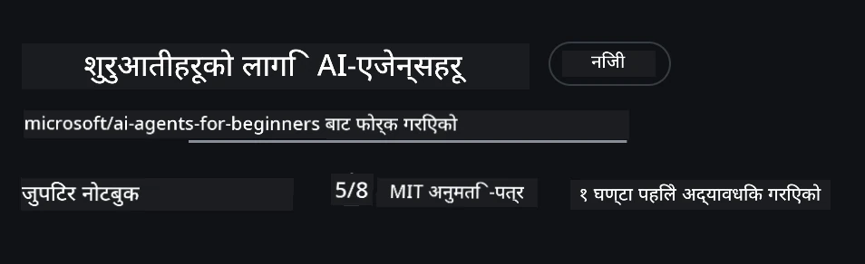

# कोर्स सेटअप

## परिचय

यो पाठले यो कोर्सका कोड नमूना कसरी चलाउने बारेमा छलफल गर्नेछ।

## अन्य सिक्नेहरूमा सामेल हुनुहोस् र मद्दत पाउनुहोस्

तपाईंको रेपो क्लोन गर्न सुरु गर्नु अघि, सेटअपमा कुनै पनि सहायता, कोर्सको बारेमा कुनै प्रश्नहरू, वा अन्य सिक्नेहरूसँग जडान हुन [AI Agents For Beginners Discord च्यानल](https://aka.ms/ai-agents/discord) मा सामेल हुनुहोस्।

## यो रेपो क्लोन वा फोर्क गर्नुहोस्

सुरू गर्न, कृपया GitHub रिपोजिटोरी क्लोन वा फोर्क गर्नुहोस्। यसले तपाईंलाई कोर्स सामग्रीको आफ्नै संस्करण बनाउन मद्दत गर्दछ ताकि तपाईं कोड चलाउन, परीक्षण गर्न र परिमार्जन गर्न सक्नुहोस्!

यो <a href="https://github.com/microsoft/ai-agents-for-beginners/fork" target="_blank">रेपो फोर्क गर्न</a> लिंकमा क्लिक गरेर गर्न सकिन्छ।

अब तपाईंको आफ्नै फोर्क गरिएको कोर्सको संस्करण निम्न लिंकमा हुनुपर्छ:



### शालो क्लोन (कार्यशाला / Codespaces का लागि सिफारिस गरिन्छ)

  > पूरा रिपोजिटोरी डाउनलोड गर्दा इतिहास र सबै फाइलहरूका कारण ठूलो (~3 GB) हुन सक्छ। यदि तपाईं केवल कार्यशालामा सहभागी हुँदै हुनुहुन्छ वा केही पाठ्यक्रम फोल्डरहरू मात्र चाहिन्छ भने, शालो क्लोन (वा sparse क्लोन) ले धेरै डाउनलोड बचत गर्दछ जसले इतिहास कटौती गर्छ र/वा ब्लबहरू स्किप गर्छ।

#### छिटो शालो क्लोन — न्यूनतम इतिहास, सबै फाइलहरू

तलका आदेशहरूमा `<your-username>` लाई तपाईंको फोर्क URL (वा upstream URL यदि चाहनुहुन्छ भने) मध्ये एउटा राख्नुहोस्।

हालैको कमिट इतिहास मात्र क्लोन गर्न (सानो डाउनलोड):

```bash|powershell
git clone --depth 1 https://github.com/<your-username>/ai-agents-for-beginners.git
```

विशिष्ट शाखा क्लोन गर्न:

```bash|powershell
git clone --depth 1 --branch <branch-name> https://github.com/<your-username>/ai-agents-for-beginners.git
```

#### आंशिक (sparse) क्लोन — न्यूनतम ब्लबहरू + मात्र चयन गरिएको फोल्डरहरू

यो आंशिक क्लोन र sparse-checkout प्रयोग गर्छ (Git 2.25+ र आधुनिकीकरण गरिएको Git सिफारिस गरिएको):

```bash|powershell
git clone --depth 1 --filter=blob:none --sparse https://github.com/<your-username>/ai-agents-for-beginners.git
```

रेपो फोल्डर भित्र जानुहोस्:

```bash|powershell
cd ai-agents-for-beginners
```

तपाईंले चाहानुभएको फोल्डरहरू तोक्नुहोस् (तलको उदाहरणमा दुई फोल्डरहरू छन्):

```bash|powershell
git sparse-checkout set 00-course-setup 01-intro-to-ai-agents
```

क्लोन पछि फाइलहरूको जाँच गर्दा, यदि तपाईंलाई केवल फाइलहरू चाहिन्छ र स्थान खाली गर्न चाहनुहुन्छ (git इतिहास बिना), कृपया रिपोजिटोरी मेटाडाटा मेटाउनुहोस् (💀अपरिवर्तनीय — सबै Git कार्यक्षमताहरू हराउनेछन्: कुनै कमिट, पुल, पुश, वा इतिहास पहुँच छैन)।

```bash
# zsh/bash
rm -rf .git
```

```powershell
# पावरशेल
Remove-Item -Recurse -Force .git
```

#### GitHub Codespaces प्रयोग गर्दै (स्थानीय ठूलो डाउनलोडबाट बच्न सिफारिस)

- यो रेपोसँग नयाँ Codespace GitHub UI [GitHub UI](https://github.com/codespaces) बाट सिर्जना गर्नुहोस्।

- नयाँ सिर्जना गरिएको Codespace को टर्मिनलमा, माथिका शालो/स्पार्स क्लोन आदेशहरू मध्ये कुनै एक चलाउनुहोस् ताकि आवश्यक पाठ्यक्रम फोल्डरहरू मात्र Codespace कार्यक्षेत्रमा ल्याउन सकियोस्।
- वैकल्पिक: Codespaces भित्र क्लोन गरेपछि, अतिरिक्त स्थान फिर्ता गर्न .git हटाउन सकिन्छ (माथिका हटाउने आदेशहरू हेर्नुहोस्)।
- नोट: यदि तपाईं नजिकै क्लोन नगरी सिधै Codespaces मा रेपो खोल्न चाहनुहुन्छ भने, Codespaces ले devcontainer वातावरण बनाउँछ र अझ धेरै स्रोतहरू प्रदान गर्न सक्छ। नयाँ Codespace भित्र शालो प्रतिलिपि क्लोन गरेपछि डिस्क प्रयोगमा बढी नियन्त्रण हुन्छ।

#### सुझावहरू

- सम्पादन/कमिट गर्न चाहनुहुन्छ भने सधैं क्लोन URL लाई तपाईंको फोर्कसँग परिवर्तन गर्नुहोस्।
- पछि यदि थप इतिहास वा फाइलहरू चाहियो भने, तिनीहरूलाई फेच गर्न वा sparse-checkout समायोजन गर्न सक्नुहुन्छ।

## कोड चलाउने

यस कोर्सले एक श्रृंखला Jupyter नोटबुकहरू प्रदान गर्दछ जुन तपाईंले AI एजेन्टहरू निर्माणमा व्यावहारिक अनुभवका लागि चलाउन सक्नुहुन्छ।

कोड नमूनाहरू **Microsoft Agent Framework (MAF)** प्रयोग गर्छन् `AzureAIProjectAgentProvider` सँग, जुन **Azure AI Agent Service V2** (Responses API) मार्फत **Microsoft Foundry** सँग जडान हुन्छ।

सबै Python नोटबुकहरू `*-python-agent-framework.ipynb` ले लेबल गरिएको छन्।

## आवश्यकताहरू

- Python 3.12+
  - **NOTE**: यदि तपाईंंसँग Python3.12 छैन भने, यसलाई स्थापना गर्न सुनिश्चित गर्नुहोस्। त्यसपछि आफ्नो venv सिर्जना गर्दा python3.12 प्रयोग गर्नुहोस् ताकि requirements.txt बाट सही संस्करणहरू इन्स्टल हुन सकुन्।
  
    >उदाहरण

    Python venv डाइरकट्री सिर्जना गर्नुहोस्:

    ```bash|powershell
    python -m venv venv
    ```

    त्यसपछि venv वातावरण सक्रिय गर्नुहोस्:

    ```bash
    # zsh/bash
    source venv/bin/activate
    ```
  
    ```dos
    # Command Prompt for Windows
    venv\Scripts\activate
    ```

- .NET 10+: .NET प्रयोग गरेको नमूनाहरूका लागि, सुनिश्चित गर्नुहोस् [.NET 10 SDK](https://dotnet.microsoft.com/download/dotnet/10.0) वा पछिल्लो संस्करण स्थापना गरिएको छ। त्यसपछि आफ्नो .NET SDK संस्करण जाँच्नुहोस्:

    ```bash|powershell
    dotnet --list-sdks
    ```

- **Azure CLI** — प्रमाणीकरणका लागि आवश्यक। [aka.ms/installazurecli](https://aka.ms/installazurecli) बाट स्थापना गर्नुहोस्।
- **Azure Subscription** — Microsoft Foundry र Azure AI Agent Service पहुँचका लागि।
- **Microsoft Foundry Project** — तैनाथ मोडेल भएको प्रोजेक्ट (जस्तै `gpt-4o`)। [Step 1](#चरण-१-microsoft-foundry-प्रोजेक्ट-सिर्जना-गर्नुहोस्) हेर्नुहोस्।

हाम्रो यो रिपोजिटोरीको मूल फोल्डरमा `requirements.txt` फाइल समावेश गरिएको छ जसमा कोड नमूनाहरू चलाउन आवश्यक सबै Python प्याकेजहरू छन्।

तपाईंले रिपोजिटोरीको मूल फोल्डरमा आफ्नो टर्मिनलमा तलको आदेश चलाएर तिनीहरू इन्स्टल गर्न सक्नुहुन्छ:

```bash|powershell
pip install -r requirements.txt
```

हामी सिफारिस गर्छौं कि कुनै पनि द्वन्द्व र समस्याहरूबाट बच्न Python वर्चुअल वातावरण सिर्जना गर्नुहोस्।

## VSCode सेटअप गर्नुहोस्

VSCode मा सुनिश्चित गर्नुहोस् कि तपाईं सही Python संस्करण प्रयोग गर्दै हुनुहुन्छ।


## Microsoft Foundry र Azure AI Agent सेवा सेटअप गर्नुहोस्

### चरण १: Microsoft Foundry प्रोजेक्ट सिर्जना गर्नुहोस्

तपाईंलाई Azure AI Foundry **हब** र **प्रोजेक्ट** आवश्यक छ जहाँ मोडेल तैनाथ गरिएको छ, जसले नोटबुकहरू चलाउन मद्दत गर्दछ।

1. जानुहोस् [ai.azure.com](https://ai.azure.com) र आफ्नो Azure खाताबाट साइन इन गर्नुहोस्।
2. **हब** सिर्जना गर्नुहोस् (वा पहिलेबाट रहेको प्रयोग गर्नुहोस्)। हेर्नुहोस्: [Hub resources overview](https://learn.microsoft.com/azure/ai-foundry/concepts/ai-resources).
3. हब भित्र नयाँ **प्रोजेक्ट** सिर्जना गर्नुहोस्।
4. **Models + Endpoints** → **Deploy model** बाट मोडेल (जस्तै `gpt-4o`) तैनाथ गर्नुहोस्।

### चरण २: तपाईको प्रोजेक्ट अन्त्यबिन्दु र मोडेल तैनाथ नाम प्राप्त गर्नुहोस्

Microsoft Foundry पोर्टलमा तपाईको प्रोजेक्ट बाट:

- **Project Endpoint** — **Overview** पृष्ठमा जानुहोस् र अन्त्यबिन्दु URL प्रतिलिपि गर्नुहोस्।


- **Model Deployment Name** — **Models + Endpoints** मा जानुहोस्, तैनाथ गरिएको मोडेल छान्नुहोस्, र **Deployment name** नोट गर्नुहोस् (जस्तै `gpt-4o`)।

### चरण ३: `az login` गरेर Azure मा साइन इन गर्नुहोस्

सबै नोटबुकहरूले प्रमाणीकरणका लागि **`AzureCliCredential`** प्रयोग गर्छन् — कुनै API कुञ्जीहरू व्यवस्थापन गर्न पर्दैन। यसलाई Azure CLI मार्फत साइन इन हुनु आवश्यक छ।

1. **Azure CLI स्थापना गर्नुहोस्**, यदि पहिले स्थापना नगरिएको भए: [aka.ms/installazurecli](https://aka.ms/installazurecli)

2. **साइन इन** गर्न:

    ```bash|powershell
    az login
    ```

    वा यदि तपाई रिमोट/Codespace वातावरणमा ब्राउजर बिना हुनुहुन्छ भने:

    ```bash|powershell
    az login --use-device-code
    ```

3. **तपाईंको सदस्यता चयन गर्नुहोस्** यदि आग्रह भए — तपाईंको Foundry प्रोजेक्ट भएको सदस्यता छान्नुहोस्।

4. **साइन इन भएको पुष्टि गर्नुहोस्**:

    ```bash|powershell
    az account show
    ```

> **किन `az login`?** नोटबुकहरूले `azure-identity` प्याकेजको `AzureCliCredential` मार्फत प्रमाणीकरण गर्छन्। यसको अर्थ तपाईंको Azure CLI सत्रले प्रमाणीकरण प्रदान गर्छ — तपाइको `.env` फाइलमा कुनै API कुञ्जी वा गोप्य सूचना छैन। यो [सुरक्षा उत्कृष्ट अभ्यास](https://learn.microsoft.com/azure/developer/ai/keyless-connections) हो।

### चरण ४: आफ्नो `.env` फाइल सिर्जना गर्नुहोस्

नमुना फाइल कपी गर्नुहोस्:

```bash
# zsh/bash
cp .env.example .env
```

```powershell
# पावरशेल
Copy-Item .env.example .env
```

`.env` खोल्नुहोस् र यी दुई मानहरू भर्नुहोस्:

```env
AZURE_AI_PROJECT_ENDPOINT=https://<your-project>.services.ai.azure.com/api/projects/<your-project-id>
AZURE_AI_MODEL_DEPLOYMENT_NAME=gpt-4o
```

| परिवर्तनीय | कहाँ फेला पार्ने |
|----------|-----------------|
| `AZURE_AI_PROJECT_ENDPOINT` | Foundry पोर्टल → तपाईंको प्रोजेक्ट → **Overview** पृष्ठ |
| `AZURE_AI_MODEL_DEPLOYMENT_NAME` | Foundry पोर्टल → **Models + Endpoints** → तपाईंले तैनाथ गरेको मोडेलको नाम |

यो अधिकांश पाठहरूको लागि हो! नोटबुकहरूले तपाईंको `az login` सत्रबाट स्वतः प्रमाणीकरण गर्नेछन्।

### चरण ५: Python निर्भरता इन्स्टल गर्नुहोस्

```bash|powershell
pip install -r requirements.txt
```

हामी सिफारिस गर्छौं कि यसलाई तपाईंले पहिले सिर्जना गरेको वर्चुअल वातावरणमा चलाउनुहोस्।

## पाठ ५ (Agentic RAG) का लागि थप सेटअप

पाठ ५ ले पुनःप्राप्ति-अंकित उत्पादनको लागि **Azure AI Search** प्रयोग गर्छ। यदि तपाईं त्यो पाठ चलाउन चाहनुहुन्छ भने, यी भेरियेबलहरू `.env` फाइलमा थप्नुहोस्:

| परिवर्तनीय | कहाँ फेला पार्ने |
|----------|-----------------|
| `AZURE_SEARCH_SERVICE_ENDPOINT` | Azure पोर्टल → तपाईंको **Azure AI Search** स्रोत → **Overview** → URL |
| `AZURE_SEARCH_API_KEY` | Azure पोर्टल → तपाईंको **Azure AI Search** स्रोत → **Settings** → **Keys** → प्राथमिक प्रशासक कुञ्जी |

## पाठ ६ र पाठ ८ (GitHub मोडेलहरू) का लागि थप सेटअप

पाठ ६ र ८ का केही नोटबुकहरूले Azure AI Foundry सट्टा **GitHub Models** प्रयोग गर्छन्। यदि तपाईं ती नमूनाहरू चलाउन चाहनुहुन्छ भने, यी भेरियेबलहरू `.env` फाइलमा थप गर्नुहोस्:

| परिवर्तनीय | कहाँ फेला पार्ने |
|----------|-----------------|
| `GITHUB_TOKEN` | GitHub → **Settings** → **Developer settings** → **Personal access tokens** |
| `GITHUB_ENDPOINT` | `https://models.inference.ai.azure.com` (पूर्वनिर्धारित मान) प्रयोग गर्नुहोस् |
| `GITHUB_MODEL_ID` | प्रयोग गर्नुपर्ने मोडेल नाम (जस्तै `gpt-4o-mini`) |

## वैकल्पिक प्रदायक: MiniMax (OpenAI-अनुकूल)

[MiniMax](https://platform.minimaxi.com/) ठूलो सन्दर्भ मोडेलहरू (२०४K टोकनसम्म) OpenAI-अनुकूल API मार्फत प्रदान गर्छ। Microsoft Agent Framework को `OpenAIChatClient` कुनै OpenAI-अनुकूल अन्त्यबिन्दुमा काम गर्छ, यसैले MiniMax लाई GitHub Models वा OpenAI को विकल्पको रूपमा प्रयोग गर्न सकिन्छ।

यी भेरियेबलहरू आफ्नो `.env` फाइलमा थप्नुहोस्:

| परिवर्तनीय | कहाँ फेला पार्ने |
|----------|-----------------|
| `MINIMAX_API_KEY` | [MiniMax Platform](https://platform.minimaxi.com/) → API Keys |
| `MINIMAX_BASE_URL` | `https://api.minimax.io/v1` (पूर्वनिर्धारित मान) प्रयोग गर्नुहोस् |
| `MINIMAX_MODEL_ID` | प्रयोग गर्नुपर्ने मोडेल नाम (जस्तै `MiniMax-M2.7`) |

**उपलब्ध मोडेलहरू**: `MiniMax-M2.7` (सिफारिस), `MiniMax-M2.7-highspeed` (छिटो प्रतिक्रिया)

`OpenAIChatClient` प्रयोग गर्ने कोड नमूनाहरू (जस्तै पाठ १४ होटल बुकिङ कार्यप्रवाह) स्वतः तपाईंको MiniMax कन्फिगरेशन पत्ता लगाएर प्रयोग गर्छन् जब `MINIMAX_API_KEY` सेट गरिएको हुन्छ।

## पाठ ८ (Bing Grounding Workflow) का लागि थप सेटअप

पाठ ८ मा सर्ताधारित कार्यप्रवाह नोटबुकले Azure AI Foundry मार्फत **Bing grounding** प्रयोग गर्छ। यदि तपाईं त्यो नमूना चलाउन चाहनुहुन्छ भने, तपाईंको `.env` फाइलमा यो भेरियेबल थप्नुहोस्:

| परिवर्तनीय | कहाँ फेला पार्ने |
|----------|-----------------|
| `BING_CONNECTION_ID` | Azure AI Foundry पोर्टल → तपाईंको प्रोजेक्ट → **Management** → **Connected resources** → तपाईंको Bing कनेक्शन → कनेक्शन ID प्रतिलिपि गर्नुहोस् |

## समस्या समाधान

### macOS मा SSL प्रमाणपत्र प्रमाणीकरण त्रुटिहरू

यदि तपाईं macOS मा हुनुहुन्छ र यस्तो त्रुटि आइपरेको छ भने:

```plaintext
ssl.SSLCertVerificationError: [SSL: CERTIFICATE_VERIFY_FAILED] certificate verify failed: self-signed certificate in certificate chain
```

यो macOS मा Python संग परिचित समस्या हो जहाँ सिस्टम SSL प्रमाणपत्रहरू स्वचालित रूपमा विश्वास प्राप्त गर्दैनन्। तलका समाधानहरू प्रयास गर्नुहोस्:

**विकल्प १: Python को Install Certificates स्क्रिप्ट चलाउनुहोस् (सिफारिस गरिएको)**

```bash
# तपाईंले स्थापना गर्नुभएको Python संस्करण (जस्तै, 3.12 वा 3.13) सँग 3.XX प्रतिस्थापन गर्नुहोस्:
/Applications/Python\ 3.XX/Install\ Certificates.command
```

**विकल्प २: तपाईंको नोटबुकमा `connection_verify=False` प्रयोग गर्नुहोस् (GitHub Models नोटबुकहरूका लागि मात्र)**

पाठ ६ को नोटबुक (`06-building-trustworthy-agents/code_samples/06-system-message-framework.ipynb`) मा एक टिप्पणी गरिएको समाधान पहिलेबाटै छ। क्लाइन्ट सिर्जना गर्दा `connection_verify=False` लाई अनकमेन्ट गर्नुहोस्:

```python
client = ChatCompletionsClient(
    endpoint=endpoint,
    credential=AzureKeyCredential(token),
    connection_verify=False,  # यदि तपाईं प्रमाणपत्र त्रुटिहरू सामना गर्नुहुन्छ भने SSL प्रमाणीकरण अक्षम गर्नुहोस्
)
```

> **⚠️ चेतावनी:** SSL प्रमाणीकरण अक्षम गर्दा (`connection_verify=False`) सुरक्षा कम हुन्छ किनकि प्रमाणपत्र प्रमाणीकरण छोडिन्छ। विकास वातावरणमा मात्र अस्थायी समाधानको रूपमा प्रयोग गर्नुहोस्, उत्पादन वातावरणमा कहिल्यै प्रयोग नगर्नुहोस्।

**विकल्प ३: `truststore` इन्स्टल र प्रयोग गर्नुहोस्**

```bash
pip install truststore
```

त्यसपछि तपाईंको नोटबुक वा स्क्रिप्टको शीर्षमा थप्नुहोस् नेटवर्क कलहरू गर्नु अघि:

```python
import truststore
truststore.inject_into_ssl()
```

## कतै अड्किनुभयो?

यदि तपाईंलाई यो सेटअप चलाउन कुनै पनि समस्या आयो भने, हाम्रो <a href="https://discord.gg/kzRShWzttr" target="_blank">Azure AI Community Discord</a> मा जानुहोस् वा <a href="https://github.com/microsoft/ai-agents-for-beginners/issues?WT.mc_id=academic-105485-koreyst" target="_blank">समस्या सिर्जना गर्नुहोस्</a>।

## अर्को पाठ

अब तपाईं यो कोर्सका कोडहरू चलाउन तयार हुनुहुन्छ। AI एजेन्टहरूको संसारबारे थप सिक्न खुशी हुनुहोस्!

[Introduction to AI Agents and Agent Use Cases](../01-intro-to-ai-agents/README.md)

---

<!-- CO-OP TRANSLATOR DISCLAIMER START -->
**अस्वीकरण**:
यो दस्तावेज [Co-op Translator](https://github.com/Azure/co-op-translator) नामक एआई अनुवाद सेवाको प्रयोग गरी अनुवाद गरिएको हो। हामी सटीकता को प्रयास गर्दैनौं, कृपया जान्नुहोस् कि स्वचालित अनुवादमा त्रुटिहरू वा अशुद्धिहरू हुन सक्छन्। मूल दस्तावेज यसको स्वदेशी भाषामा अधिकारिक स्रोत मानिनुपर्छ। महत्वपूर्ण जानकारीका लागि, व्यावसायिक मानव अनुवाद सिफारिस गरिन्छ। यस अनुवादको प्रयोगबाट उत्पन्न कुनै पनि गलतफहमी वा गलत व्याख्याका लागि हामी जिम्मेवार छैनौं।
<!-- CO-OP TRANSLATOR DISCLAIMER END -->