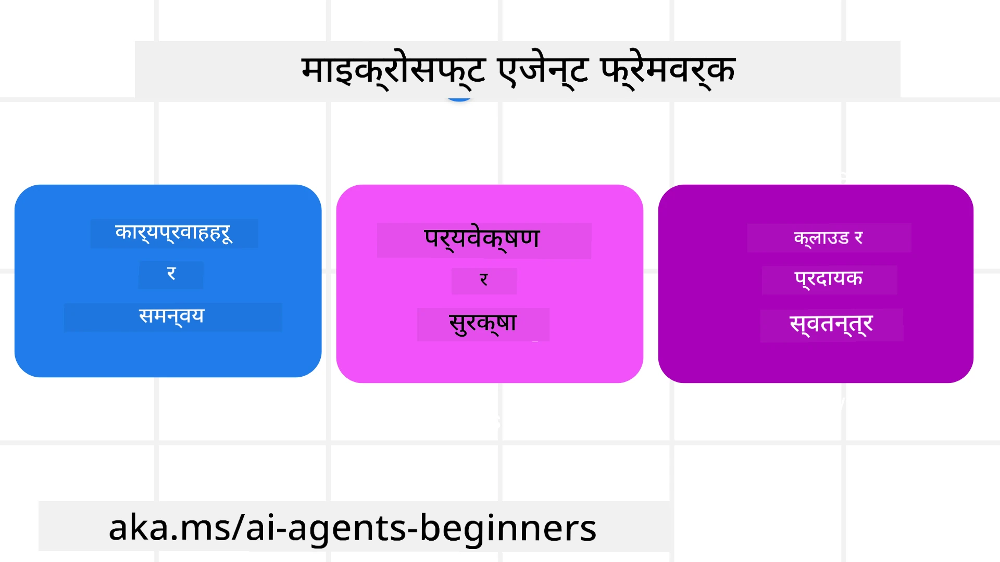

# Microsoft Agent Framework को अन्वेषण


### परिचय

यस पाठले समावेश गर्नेछ:

- Microsoft Agent Framework बुझ्नु: मुख्य विशेषताहरू र मूल्य  
- Microsoft Agent Framework का मुख्य अवधारणाहरू अन्वेषण गर्नुहोस्
- उन्नत MAF ढाँचा: कार्यप्रवाह, मध्यवेयर, र मेमोरी

## सिकाइ लक्ष्यहरू

यस पाठ समाप्त गरेपछि, तपाईं जान्नेछ:

- Microsoft Agent Framework प्रयोग गरेर उत्पादनका लागि तयार AI एजेन्टहरू निर्माण गर्ने
- Microsoft Agent Framework का मुख्य विशेषताहरूलाई तपाईंको एजेन्टिक प्रयोग मामिलाहरूमा लागू गर्ने
- कार्यप्रवाह, मध्यवेयर, र अवलोकनसम्बन्धी उन्नत ढाँचाहरू प्रयोग गर्ने

## कोड नमूनाहरू

[Microsoft Agent Framework (MAF)](https://aka.ms/ai-agents-beginners/agent-framewrok) का कोड नमूनाहरू यो रिपोजिटरीमा `xx-python-agent-framework` र `xx-dotnet-agent-framework` फाइलहरूमा फेला पार्न सकिन्छ।

## Microsoft Agent Framework बुझ्ने



[Microsoft Agent Framework (MAF)](https://aka.ms/ai-agents-beginners/agent-framewrok) Microsoft को एकीकृत फ्रेमवर्क हो AI एजेन्टहरू निर्माण गर्न। यसले उत्पादन र अनुसन्धान वातावरणहरूमा देखिने विभिन्न प्रकारका एजेन्टिक प्रयोग मामिलाहरूलाई सम्बोधन गर्न लचकता प्रदान गर्दछ, जस्तै:

- **क्रमागत एजेन्ट तालमेल** जहाँ चरण-दर-चरण कार्यप्रवाहहरू आवश्यक हुन्छन्।
- **सामयिक तालमेल** जहाँ एजेन्टहरूले एउटै समयमा कार्यहरू पूरा गर्नु पर्छ।
- **समूह संवाद तालमेल** जहाँ एजेन्टहरू एउटै कार्यमा सँगै सहकार्य गर्न सक्छन्।
- **ह्यान्डअफ तालमेल** जहाँ एजेन्टहरूले उप-कार्यहरू पूरा हुँदा कार्य एकअर्कालाई सुम्पिन्छन्।
- **चुम्बकीय तालमेल** जहाँ व्यवस्थापकीय एजेन्टले कार्य सूचि सिर्जना र परिमार्जन गर्छ र उप-एजेन्टहरूको समन्वय सम्हाल्छ।

उत्पादनमा AI एजेन्टहरू प्रदान गर्न, MAF मा थप सुविधाहरू समावेश छन्:

- **अवलोकनशीलता** OpenTelemetry प्रयोग गरेर जहाँ AI एजेन्टको प्रत्येक क्रिया, उपकरण कल, तालमेल चरणहरू, सोच प्रक्रियाहरू, र Microsoft Foundry ड्यासबोर्ड मार्फत प्रदर्शन निगरानी हुन्छ।
- **सुरक्षा** Microsoft Foundry मा स्थानीय रूपमा एजेन्टहरू होस्ट गरेर, जसमा भूमिका-आधारित पहुँच, निजी डाटा व्यवस्थापन, र निर्मित सामग्री सुरक्षा समावेश छन्।
- **धैर्यता** एजेन्ट थ्रेड र कार्यप्रवाहहरू रोक्न, पुनः सुरु गर्न, र त्रुटिहरूबाट पुनः प्राप्त गर्न सक्षम छन् जसले लामो समयसम्म चल्ने प्रक्रियालाई सम्भव बनाउँछ।
- **नियन्त्रण** मानव इन द लूप कार्यप्रवाहहरू समर्थन गर्दै जहाँ कार्यहरूलाई मानव स्वीकृति आवश्यक भनेर पहिचान गरिन्छ।

Microsoft Agent Framework मा अन्तरक्रियाशीलता पनि महत्वपूर्ण छ:

- **क्लाउड-निर्भर छैन** - एजेन्टहरू कन्टेनरहरूमा, अनप्रिम, र बहुअन्य क्लाउडहरूमा चलाउन सकिन्छ।
- **प्रदाता-निर्भर छैन** - एजेन्टहरू तपाईँको रोजाइको SDK मार्फत सिर्जना गर्न सकिन्छ, जस्तै Azure OpenAI र OpenAI।
- **खुला मापदण्डहरू समामिल गर्नु** - एजेन्टहरूले Agent-to-Agent(A2A) र Model Context Protocol (MCP) जस्ता प्रोटोकलहरू प्रयोग गरेर अन्य एजेन्ट र उपकरणहरू पत्ता लगाउन र प्रयोग गर्न सक्छन्।
- **प्लगिन र कनेक्टर्स** - Microsoft Fabric, SharePoint, Pinecone र Qdrant जस्ता डाटा र मेमोरी सेवाहरूमा जडान गर्न सकिन्छ।

अब यी सुविधाहरू Microsoft Agent Framework का केही मुख्य अवधारणाहरूमा कसरी लागू हुन्छन् हेरौं।

## Microsoft Agent Framework का मुख्य अवधारणाहरू

### एजेन्टहरू


**एजेन्टहरू सिर्जना गर्नु**

एजेन्ट सिर्जना इन्फरेन्स सेवा (LLM प्रदायक), AI एजेन्टले पालना गर्ने निर्देशनहरूको सेट, र निर्दिष्ट `name` द्वारा गरिन्छ:

```python
agent = AzureOpenAIChatClient(credential=AzureCliCredential()).create_agent( instructions="You are good at recommending trips to customers based on their preferences.", name="TripRecommender" )
```

माथिको उदाहारणमा `Azure OpenAI` प्रयोग गरिएको छ, तर एजेन्टहरू विभिन्न सेवाहरू प्रयोग गरेर सिर्जना गर्न सकिन्छ, जस्तै `Microsoft Foundry Agent Service`:

```python
AzureAIAgentClient(async_credential=credential).create_agent( name="HelperAgent", instructions="You are a helpful assistant." ) as agent
```

OpenAI का `Responses`, `ChatCompletion` APIs

```python
agent = OpenAIResponsesClient().create_agent( name="WeatherBot", instructions="You are a helpful weather assistant.", )
```

```python
agent = OpenAIChatClient().create_agent( name="HelpfulAssistant", instructions="You are a helpful assistant.", )
```

वा [MiniMax](https://platform.minimaxi.com/), जसले ठूलो सन्दर्भ विन्डो (२०४K टोकन सम्म) सहित OpenAI उपयुक्त API प्रदान गर्दछ:

```python
agent = OpenAIChatClient(base_url="https://api.minimax.io/v1", api_key=os.environ["MINIMAX_API_KEY"], model_id="MiniMax-M2.7").create_agent( name="HelpfulAssistant", instructions="You are a helpful assistant.", )
```

वा A2A प्रोटोकल प्रयोग गरी दूरस्थ एजेन्टहरू:

```python
agent = A2AAgent( name=agent_card.name, description=agent_card.description, agent_card=agent_card, url="https://your-a2a-agent-host" )
```

**एजेन्ट चलाउने**

एजेन्टहरू `.run` वा `.run_stream` विधिहरू प्रयोग गरेर गैर-प्रवाह वा प्रवाह प्रतिक्रियाहरूका लागि चलाइन्छ।

```python
result = await agent.run("What are good places to visit in Amsterdam?")
print(result.text)
```

```python
async for update in agent.run_stream("What are the good places to visit in Amsterdam?"):
    if update.text:
        print(update.text, end="", flush=True)

```

प्रत्येक एजेन्ट रनमा `max_tokens`, एजेन्टले कल गर्न सक्ने `tools`, र प्रयोग हुने `model` जस्ता विकल्पहरू अनुकूलन गर्न सकिन्छ।

यो प्रयोगकर्ताको कार्य पूरा गर्न विशिष्ट मोडेल वा उपकरण आवश्यक पर्ने अवस्थामा उपयोगी छ।

**उपकरणहरू**

तपाईं एजेन्ट परिभाषा गर्दा उपकरणहरू निर्धारण गर्न सक्नुहुन्छ:

```python
def get_attractions( location: Annotated[str, Field(description="The location to get the top tourist attractions for")], ) -> str: """Get the top tourist attractions for a given location.""" return f"The top attractions for {location} are." 


# प्रत्यक्ष रूपमा ChatAgent सिर्जना गर्दा

agent = ChatAgent( chat_client=OpenAIChatClient(), instructions="You are a helpful assistant", tools=[get_attractions]

```

र एजेन्ट चलाउने बेलामा पनि:

```python

result1 = await agent.run( "What's the best place to visit in Seattle?", tools=[get_attractions] # यो रनका लागि मात्र प्रदान गरिएको उपकरण )
```

**एजेन्ट थ्रेडहरू**

एजेन्ट थ्रेडहरू बहु-चरण संवादहरू सम्हाल्न प्रयोग गरिन्छ। थ्रेडहरू निम्न तरिकाले सिर्जना गर्न सकिन्छ:

- `get_new_thread()` प्रयोग गरेर जसले समयमा थ्रेड सुरक्षित गर्न सक्षम बनाउँछ
- एजेन्ट चलाउँदा स्वतः थ्रेड सिर्जना गर्ने, र थ्रेड केवल उक्त रन अवधिभर कायम रहने।

थ्रेड सिर्जना गर्ने कोड यसरी देखिन्छ:

```python
# नयाँ थ्रेड बनाएँ।
thread = agent.get_new_thread() # थ्रेडसँग एजेन्ट चलाउनुहोस्।
response = await agent.run("Hello, I am here to help you book travel. Where would you like to go?", thread=thread)

```

थ्रेडलाई पछि प्रयोगका लागि संग्रह गर्न तपाईं यसलाई सिरियलाइज गर्न सक्नुहुन्छ:

```python
# नयाँ थ्रेड सिर्जना गर्नुहोस्।
thread = agent.get_new_thread() 

# थ्रेडसँग एजेन्ट चलाउनुहोस्।

response = await agent.run("Hello, how are you?", thread=thread) 

# भण्डारणको लागि थ्रेडलाई सिरियलाइज गर्नुहोस्।

serialized_thread = await thread.serialize() 

# भण्डारणबाट लोड गरेपछि थ्रेड अवस्थालाई डिसेरियलाइज गर्नुहोस्।

resumed_thread = await agent.deserialize_thread(serialized_thread)
```

**एजेन्ट मध्यवेयर**

एजेन्टहरूले प्रयोगकर्ताका कार्यहरू पूरा गर्न उपकरण र LLM सँग अन्तरक्रिया गर्छन्। केहि अवस्थामा, यी अन्तरक्रियाहरू बीचमा कार्यान्वयन वा ट्र्याक गर्न चाहन्छौँ। एजेन्ट मध्यवेयरले यसलाई सक्षम बनाउँछ:

*फंक्शन मध्यवेयर*

यसले एजेन्ट र फंक्शन/उपकरण बीचमा क्रिया चलाउन अनुमति दिन्छ। उदाहरणका लागि, फंक्शन कलमा लगिंग गर्न चाहिएको हो भने।

तलको कोडमा `next` ले अर्को मध्यवेयर वा वास्तविक फंक्शनलाई कल गर्ने निर्णय गर्छ।

```python
async def logging_function_middleware(
    context: FunctionInvocationContext,
    next: Callable[[FunctionInvocationContext], Awaitable[None]],
) -> None:
    """Function middleware that logs function execution."""
    # पूर्व-प्रक्रिया: फंक्शन कार्यान्वयन अघि लग
    print(f"[Function] Calling {context.function.name}")

    # अर्को मिडलवेयर वा फंक्शन कार्यान्वयनमा जारी राख्नुहोस्
    await next(context)

    # पश्चात-प्रक्रिया: फंक्शन कार्यान्वयन पछि लग
    print(f"[Function] {context.function.name} completed")
```

*च्याट मध्यवेयर*

यसले एजेन्ट र LLM बीचको अनुरोधहरू बीचमा क्रियाहरू चलाउन वा लग गर्न अनुमति दिन्छ।

यसमा AI सेवामा पठाइएका `messages` जस्ता महत्वपूर्ण जानकारी हुन्छ।

```python
async def logging_chat_middleware(
    context: ChatContext,
    next: Callable[[ChatContext], Awaitable[None]],
) -> None:
    """Chat middleware that logs AI interactions."""
    # पूर्व-प्रक्रिया: AI कल गर्नु अघि लग इन गर्नुहोस्
    print(f"[Chat] Sending {len(context.messages)} messages to AI")

    # अर्को मध्यस्थ वा AI सेवा तर्फ जारी राख्नुहोस्
    await next(context)

    # पश्चात-प्रक्रिया: AI प्रतिक्रिया पछि लग इन गर्नुहोस्
    print("[Chat] AI response received")

```

**एजेन्ट मेमोरी**

`Agentic Memory` पाठमा छलफल गरिएको जस्तै, मेमोरी एजेन्टलाई विभिन्न सन्दर्भहरूमा काम गर्न सक्षम बनाउने महत्वपूर्ण तत्व हो। MAF ले विभिन्न प्रकारका मेमोरीहरू प्रदान गर्दछ:

*इन-मेमोरी स्टोरेज*

यो मेमोरी लागू हुने समयमा थ्रेडहरूमा सुरक्षित हुन्छ।

```python
# नयाँ थ्रेड सिर्जना गर्नुहोस्।
thread = agent.get_new_thread() # थ्रेडसँग एजेन्ट चलाउनुहोस्।
response = await agent.run("Hello, I am here to help you book travel. Where would you like to go?", thread=thread)
```

*स्थायी सन्देशहरू*

यो मेमोरी विभिन्न सत्रहरूमा संवाद इतिहास भण्डारण गर्दा प्रयोग हुन्छ। यो `chat_message_store_factory` प्रयोग गरेर परिभाषित हुन्छ:

```python
from agent_framework import ChatMessageStore

# एक अनुकूल सन्देश भण्डार सिर्जना गर्नुहोस्
def create_message_store():
    return ChatMessageStore()

agent = ChatAgent(
    chat_client=OpenAIChatClient(),
    instructions="You are a Travel assistant.",
    chat_message_store_factory=create_message_store
)

```

*डाइनामिक मेमोरी*

यो मेमोरी एजेन्टहरू चलाउनु अघि सन्दर्भमा थपिन्छ। यी मेमोरीहरू बाहिरी सेवाहरूमा भण्डारण गर्न सकिन्छ, जस्तै mem0:

```python
from agent_framework.mem0 import Mem0Provider

# उन्नत मेमोरी क्षमताहरूको लागि Mem0 प्रयोग गर्दै
memory_provider = Mem0Provider(
    api_key="your-mem0-api-key",
    user_id="user_123",
    application_id="my_app"
)

agent = ChatAgent(
    chat_client=OpenAIChatClient(),
    instructions="You are a helpful assistant with memory.",
    context_providers=memory_provider
)

```

**एजेन्ट अवलोकनशीलता**

अवलोकनशीलता भरपर्दो र मर्मतयोग्य एजेन्टिक प्रणालीहरू निर्माण गर्न महत्वपूर्ण छ। MAF ले OpenTelemetry सँग एकीकरण गरेर ट्रेसिङ र मिटरहरू प्रदान गर्दछ।

```python
from agent_framework.observability import get_tracer, get_meter

tracer = get_tracer()
meter = get_meter()
with tracer.start_as_current_span("my_custom_span"):
    # केहि गर्नुहोस्
    pass
counter = meter.create_counter("my_custom_counter")
counter.add(1, {"key": "value"})
```

### कार्यप्रवाहहरू

MAF ले प्रि-निर्दिष्ट चरणहरू प्रदान गर्दछ जसले एउटा कार्य पूरा गर्छ र ती चरणहरूमा AI एजेन्टहरू समावेश गर्दछ।

कार्यप्रवाहहरू विभिन्न कम्पोनेन्टहरू मिलेर बनेका हुन्छन् जसले राम्रो नियन्त्रण प्रवाह अनुमति दिन्छ। कार्यप्रवाहहरूले **बहु-एजेन्ट तालमेल** र **चेकपोइन्टिङ** सपोर्ट गर्छ जुनले कार्यप्रवाह अवस्थाहरू सुरक्षित गर्न मद्दत गर्दछ।

कार्यप्रवाहका मुख्य कम्पोनेन्टहरू:

**प्रवर्तकहरू**

प्रवर्तकहरूले इनपुट सन्देशहरू प्राप्त गर्छन्, आफ्नो कार्य सम्पन्न गर्छन्, र आउटपुट सन्देश उत्पादन गर्छन्। यसले कार्यप्रवाहलाई ठूलो कार्य पूरा गर्ने दिशामा अगाडि बढाउँछ। प्रवर्तकहरू AI एजेन्ट वा कस्टम लॉजिक दुबै हुन सक्छन्।

**धाराहरू**

धाराहरू सन्देशहरूको प्रवाह कार्यप्रवाहमा परिभाषित गर्न प्रयोग गरिन्छ। यी हुन सक्छन्:

*प्रत्यक्ष धाराहरू* - प्रवर्तकहरूबीच सिधा एउटाबाट अर्को कनेक्शन:

```python
from agent_framework import WorkflowBuilder

builder = WorkflowBuilder()
builder.add_edge(source_executor, target_executor)
builder.set_start_executor(source_executor)
workflow = builder.build()
```

*सशर्त धाराहरू* - कुनै निश्चित अवस्था पूरा भएपछि सक्रिय हुन्छन्। जस्तै, होटल कोठा उपलब्ध नभएको अवस्थामा, प्रवर्तकले अन्य विकल्पहरू सिफारिस गर्न सक्छ।

*स्विच-केस धाराहरू* - परिभाषित अवस्थाहरू अनुसार सन्देशहरू विभिन्न प्रवर्तकहरूमा पठाउने। जस्तै, यदि यात्रा ग्राहकलाई प्राथमिकता पहुँच छ भने उनको कार्य अर्को कार्यप्रवाह मार्फत सम्हालिनेछ।

*फ्यान-आउट धाराहरू* - एक सन्देश धेरै लक्षितहरूमा पठाउने।

*फ्यान-इन धाराहरू* - विभिन्न प्रवर्तकहरूबाट धेरै सन्देशहरू सङ्कलन गरी एउटा लक्ष्यमा पठाउने।

**घटना**

कार्यप्रवाहहरूको राम्रो अवलोकनशीलता दिन MAF ले निम्न कार्यान्वयन घटनाहरू प्रदान गर्दछ:

- `WorkflowStartedEvent` - कार्यप्रवाह कार्यान्वयन सुरु हुन्छ
- `WorkflowOutputEvent` - कार्यप्रवाहले आउटपुट उत्पादन गर्छ
- `WorkflowErrorEvent` - कार्यप्रवाहमा त्रुटि आउँछ
- `ExecutorInvokeEvent` - प्रवर्तकले प्रक्रिया सुरु गर्छ
- `ExecutorCompleteEvent` - प्रवर्तकले प्रक्रिया समाप्त गर्छ
- `RequestInfoEvent` - अनुरोध जारी गरिएको छ

## उन्नत MAF ढाँचा

माथिका खण्डहरूले Microsoft Agent Framework का मुख्य अवधारणाहरू समेट्छन्। जटिल एजेन्टहरू निर्माण गर्दा, यहाँ केही उन्नत ढाँचाहरू छन्:

- **मध्यवेयर संयोजन**: फंक्शन र च्याट मध्यवेयरहरू प्रयोग गरी लगिंग, प्रमाणीकरण, दर-सीमा आदि विभिन्न मध्यवेयर ह्यान्डलरहरूलाई श्रृंखलाबद्ध गरेर एजेन्टको व्यवहारलाई सूक्ष्म नियन्त्रण गर्नुहोस्।
- **कार्यप्रवाह चेकपोइन्टिङ**: कार्यप्रवाह घटनाहरू र सिरियलाइजेसन प्रयोग गरेर लामो समयसम्म चल्ने एजेन्ट प्रक्रियाहरू सुरक्षित र पुनः सुरु गर्नुहोस्।
- **डाइनामिक उपकरण चयन**: उपकरण विवरणहरू माथि RAG प्रयोग गरी MAF को उपकरण दर्तासँग मेल खाँदै प्रत्येक प्रश्नका लागि मात्र सम्बन्धित उपकरणहरू प्रदर्शन गर्नुहोस्।
- **बहु-एजेन्ट ह्यान्डअफ**: कार्यप्रवाह धाराहरू र सशर्त मार्गनिर्देशन प्रयोग गरी विशेषीकृत एजेन्टहरू बीच ह्यान्डअफहरूको तालमेल गर्नुहोस्।

## कोड नमूनाहरू

Microsoft Agent Framework का कोड नमूनाहरू यो रिपोजिटरीमा `xx-python-agent-framework` र `xx-dotnet-agent-framework` फाइलहरूमा फेला पार्न सकिन्छ।

## Microsoft Agent Framework सम्बन्धी थप प्रश्नहरू छन्?

[Microsoft Foundry Discord](https://aka.ms/ai-agents/discord) मा सहभागी हुनुहोस् जहाँ अन्य सिक्नेहरू भेट्न, कार्यालय समयहरूमा भाग लिन र तपाईंको AI एजेन्टहरूको प्रश्नहरूको उत्तर पाउन सकिन्छ।

---

<!-- CO-OP TRANSLATOR DISCLAIMER START -->
**अस्वीकरण**:  
यस दस्तावेजलाई AI अनुवाद सेवा [Co-op Translator](https://github.com/Azure/co-op-translator) प्रयोग गरेर अनुवाद गरिएको छ। हामी शुद्धताका लागि प्रयास गर्छौं, तर कृपया ध्यान दिनुहोस् कि स्वचालित अनुवादमा त्रुटिहरू वा असम्मतिहरू हुन सक्छन्। मूल दस्तावेज यसको स्वदेशी भाषामा प्रामाणिक स्रोत मानिनु पर्छ। महत्वपूर्ण जानकारीको लागि, व्यावसायिक मानवीय अनुवाद सिफारिस गरिन्छ। यस अनुवादको प्रयोगबाट उत्पन्न हुने कुनै पनि गलतफहमी वा गलत व्याख्याका लागि हामी उत्तरदायी छैनौं।
<!-- CO-OP TRANSLATOR DISCLAIMER END -->