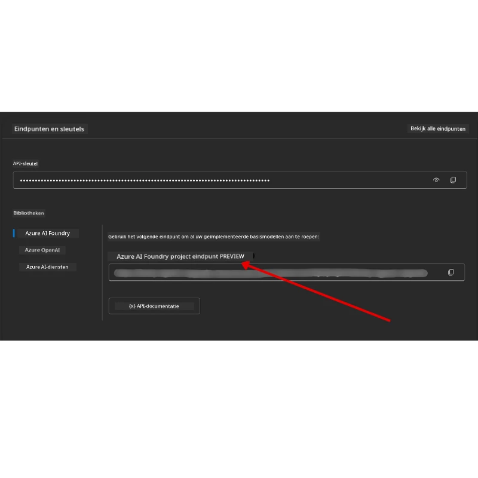

# Cursusconfiguratie

## Inleiding

Deze les behandelt hoe je de codevoorbeelden van deze cursus kunt uitvoeren.

## Sluit je aan bij andere cursisten en krijg hulp

Voordat je begint met het klonen van je repo, sluit je aan bij het [AI Agents For Beginners Discord-kanaal](https://aka.ms/ai-agents/discord) om hulp te krijgen bij de installatie, vragen over de cursus te stellen of in contact te komen met andere cursisten.

## Clone of fork deze repo

Om te beginnen, clone of fork je de GitHub-repository. Dit maakt een eigen versie van het cursusmateriaal zodat je de code kunt uitvoeren, testen en aanpassen!

Dit kan door op de link te klikken om <a href="https://github.com/microsoft/ai-agents-for-beginners/fork" target="_blank">de repo te forken</a>.

Je zou nu je eigen geforkte versie van deze cursus moeten hebben onder de volgende link:


### Shallow Clone (aanbevolen voor workshop / Codespaces)

  >De volledige repository kan groot zijn (~3 GB) bij het downloaden van de volledige geschiedenis en alle bestanden. Als je alleen de workshop bijwoont of slechts een paar lesmappen nodig hebt, vermijdt een shallow clone (of een sparse clone) het meeste van die download door geschiedenis in te korten en/of blobs over te slaan.

#### Snelle shallow clone — minimale geschiedenis, alle bestanden

Vervang `<your-username>` in onderstaande opdrachten met je fork-URL (of de upstream-URL als je dat verkiest).

Om alleen de meest recente commitgeschiedenis te clonen (kleine download):

```bash|powershell
git clone --depth 1 https://github.com/<your-username>/ai-agents-for-beginners.git
```

Om een specifieke branch te clonen:

```bash|powershell
git clone --depth 1 --branch <branch-name> https://github.com/<your-username>/ai-agents-for-beginners.git
```

#### Gedeeltelijke (sparse) clone — minimale blobs + alleen geselecteerde mappen

Dit gebruikt gedeeltelijke clone en sparse-checkout (vereist Git 2.25+ en aanbevolen moderne Git met ondersteuning voor partial clone):

```bash|powershell
git clone --depth 1 --filter=blob:none --sparse https://github.com/<your-username>/ai-agents-for-beginners.git
```

Ga de repo-map in:

```bash|powershell
cd ai-agents-for-beginners
```

Specificeer daarna welke mappen je wilt (voorbeeld hieronder toont twee mappen):

```bash|powershell
git sparse-checkout set 00-course-setup 01-intro-to-ai-agents
```

Na het clonen en verifiëren van de bestanden, als je alleen de bestanden nodig hebt en ruimte wilt vrijmaken (geen git-geschiedenis), verwijder dan de repository metadata (💀onherstelbaar — je verliest alle Git-functionaliteit: geen commits, pulls, pushes of toegang tot geschiedenis).

```bash
# zsh/bash
rm -rf .git
```

```powershell
# PowerShell
Remove-Item -Recurse -Force .git
```

#### Gebruik GitHub Codespaces (aanbevolen om lokale grote downloads te vermijden)

- Maak een nieuwe Codespace voor deze repo via de [GitHub UI](https://github.com/codespaces).

- Voer in de terminal van de nieuw gemaakte codespace een van de hierboven genoemde shallow/sparse clone-opdrachten uit om alleen de lesmappen die je nodig hebt in de Codespace workspace te brengen.
- Optioneel: verwijder na het clonen binnen Codespaces de .git map om extra ruimte vrij te maken (zie verwijderingsopdrachten hierboven).
- Opmerking: als je liever de repo direct opent in Codespaces (zonder extra clone), wees er dan van bewust dat Codespaces de devcontainer-omgeving bouwt en mogelijk meer provisioneert dan je nodig hebt. Het maken van een shallow clone in een verse Codespace geeft je meer controle over het schijfgebruik.

#### Tips

- Vervang altijd de clone-URL met je fork als je wilt bewerken/committen.
- Als je later meer geschiedenis of bestanden nodig hebt, kun je die ophalen of sparse-checkout aanpassen om aanvullende mappen op te nemen.

## De Code Uitvoeren

Deze cursus biedt een reeks Jupyter Notebooks die je kunt uitvoeren om praktische ervaring op te doen met het bouwen van AI Agents.

De codevoorbeelden gebruiken **Microsoft Agent Framework (MAF)** met de `AzureAIProjectAgentProvider`, die verbinding maakt met **Azure AI Agent Service V2** (de Responses API) via **Microsoft Foundry**.

Alle Python-notebooks zijn gelabeld met `*-python-agent-framework.ipynb`.

## Vereisten

- Python 3.12+
  - **OPMERKING**: Als je Python3.12 niet hebt geïnstalleerd, zorg dan dat je dit installeert. Maak daarna je venv aan met python3.12 om te zorgen dat de juiste versies uit het requirements.txt-bestand worden geïnstalleerd.
  
    >Voorbeeld

    Maak Python venv-directory aan:

    ```bash|powershell
    python -m venv venv
    ```

    Activeer daarna de venv-omgeving voor:

    ```bash
    # zsh/bash
    source venv/bin/activate
    ```
  
    ```dos
    # Command Prompt for Windows
    venv\Scripts\activate
    ```

- .NET 10+: Voor de voorbeeldcodes met .NET, zorg ervoor dat je [.NET 10 SDK](https://dotnet.microsoft.com/download/dotnet/10.0) of hoger installeert. Controleer daarna je geïnstalleerde .NET SDK-versie:

    ```bash|powershell
    dotnet --list-sdks
    ```

- **Azure CLI** — Vereist voor authenticatie. Installeren via [aka.ms/installazurecli](https://aka.ms/installazurecli).
- **Azure-abonnement** — Voor toegang tot Microsoft Foundry en Azure AI Agent Service.
- **Microsoft Foundry-project** — Een project met een gedeployed model (bijv. `gpt-4o`). Zie [Stap 1](#stap-1-maak-een-microsoft-foundry-project-aan) hieronder.

We hebben een `requirements.txt` bestand toegevoegd in de root van deze repository met alle benodigde Python-pakketten om de codevoorbeelden uit te voeren.

Je kunt ze installeren door de volgende opdracht in je terminal te draaien in de root van de repository:

```bash|powershell
pip install -r requirements.txt
```

We raden aan een Python virtuele omgeving aan te maken om conflicten en problemen te vermijden.

## VSCode instellen

Zorg ervoor dat je de juiste Python-versie gebruikt in VSCode.


## Microsoft Foundry en Azure AI Agent Service instellen

### Stap 1: Maak een Microsoft Foundry-project aan

Je hebt een Azure AI Foundry **hub** en **project** met een gedeployed model nodig om de notebooks uit te voeren.

1. Ga naar [ai.azure.com](https://ai.azure.com) en meld je aan met je Azure-account.
2. Maak een **hub** aan (of gebruik een bestaande). Zie: [Hub resources overview](https://learn.microsoft.com/azure/ai-foundry/concepts/ai-resources).
3. Maak binnen de hub een **project** aan.
4. Deploy een model (bijv. `gpt-4o`) via **Models + Endpoints** → **Deploy model**.

### Stap 2: Vind je projectendpoint en model deploymentnaam

Vanuit je project in de Microsoft Foundry-portal:

- **Project Endpoint** — Ga naar de **Overview** pagina en kopieer de endpoint-URL.



- **Model Deployment Name** — Ga naar **Models + Endpoints**, selecteer je gedeployde model en noteer de **Deployment name** (bijv. `gpt-4o`).

### Stap 3: Meld je aan bij Azure met `az login`

Alle notebooks gebruiken **`AzureCliCredential`** voor authenticatie — geen API-sleutels om te beheren. Dit vereist dat je bent aangemeld via de Azure CLI.

1. **Installeer de Azure CLI** als je dat nog niet gedaan hebt: [aka.ms/installazurecli](https://aka.ms/installazurecli)

2. **Meld je aan** door te draaien:

    ```bash|powershell
    az login
    ```

    Of als je in een remote/Codespace-omgeving zit zonder browser:

    ```bash|powershell
    az login --use-device-code
    ```

3. **Selecteer je abonnement** als daarom wordt gevraagd — kies het abonnement dat je Foundry-project bevat.

4. **Controleer** of je bent aangemeld:

    ```bash|powershell
    az account show
    ```

> **Waarom `az login`?** De notebooks authenticeren met `AzureCliCredential` uit het `azure-identity` pakket. Dit betekent dat je Azure CLI-sessie de credentials levert — geen API-sleutels of geheimen in je `.env`-bestand. Dit is een [beveiligingsbest practice](https://learn.microsoft.com/azure/developer/ai/keyless-connections).

### Stap 4: Maak je `.env`-bestand aan

Kopieer het voorbeeldbestand:

```bash
# zsh/bash
cp .env.example .env
```

```powershell
# PowerShell
Copy-Item .env.example .env
```

Open `.env` en vul deze twee waarden in:

```env
AZURE_AI_PROJECT_ENDPOINT=https://<your-project>.services.ai.azure.com/api/projects/<your-project-id>
AZURE_AI_MODEL_DEPLOYMENT_NAME=gpt-4o
```

| Variabele | Waar te vinden |
|----------|-----------------|
| `AZURE_AI_PROJECT_ENDPOINT` | Foundry-portal → je project → **Overview** pagina |
| `AZURE_AI_MODEL_DEPLOYMENT_NAME` | Foundry-portal → **Models + Endpoints** → naam van je gedeployde model |

Dat is het voor de meeste lessen! De notebooks authenticeren automatisch via je `az login` sessie.

### Stap 5: Installeer Python-afhankelijkheden

```bash|powershell
pip install -r requirements.txt
```

We raden aan dit te doen binnen de eerder gemaakte virtuele omgeving.

## Aanvullende installatie voor les 5 (Agentic RAG)

Les 5 gebruikt **Azure AI Search** voor retrieval-augmented generation. Als je die les wilt uitvoeren, voeg dan deze variabelen toe aan je `.env`-bestand:

| Variabele | Waar te vinden |
|----------|-----------------|
| `AZURE_SEARCH_SERVICE_ENDPOINT` | Azure-portal → je **Azure AI Search** resource → **Overview** → URL |
| `AZURE_SEARCH_API_KEY` | Azure-portal → je **Azure AI Search** resource → **Settings** → **Keys** → primaire beheerderssleutel |

## Aanvullende installatie voor les 6 en les 8 (GitHub Models)

Sommige notebooks in lessen 6 en 8 gebruiken **GitHub Models** in plaats van Azure AI Foundry. Als je die voorbeelden wilt draaien, voeg dan deze variabelen toe aan je `.env`-bestand:

| Variabele | Waar te vinden |
|----------|-----------------|
| `GITHUB_TOKEN` | GitHub → **Settings** → **Developer settings** → **Personal access tokens** |
| `GITHUB_ENDPOINT` | Gebruik `https://models.inference.ai.azure.com` (standaardwaarde) |
| `GITHUB_MODEL_ID` | Naam van het model dat je wilt gebruiken (bijv. `gpt-4o-mini`) |

## Alternatieve provider: MiniMax (OpenAI-compatibel)

[MiniMax](https://platform.minimaxi.com/) biedt grote contextmodellen (tot 204K tokens) via een OpenAI-compatibele API. Omdat de Microsoft Agent Framework `OpenAIChatClient` werkt met elke OpenAI-compatibele endpoint, kun je MiniMax gebruiken als drop-in alternatief voor GitHub Models of OpenAI.

Voeg deze variabelen toe aan je `.env`-bestand:

| Variabele | Waar te vinden |
|----------|-----------------|
| `MINIMAX_API_KEY` | [MiniMax Platform](https://platform.minimaxi.com/) → API Keys |
| `MINIMAX_BASE_URL` | Gebruik `https://api.minimax.io/v1` (standaardwaarde) |
| `MINIMAX_MODEL_ID` | Naam van het model dat je wilt gebruiken (bijv. `MiniMax-M2.7`) |

**Beschikbare modellen**: `MiniMax-M2.7` (aanbevolen), `MiniMax-M2.7-highspeed` (snellere reacties)

De codevoorbeelden die `OpenAIChatClient` gebruiken (bijv. les 14 hotelboekingsworkflow) detecteren automatisch je MiniMax-configuratie als `MINIMAX_API_KEY` is ingesteld.

## Aanvullende installatie voor les 8 (Bing Grounding Workflow)

De conditionele workflow-notebook in les 8 gebruikt **Bing grounding** via Azure AI Foundry. Als je dat voorbeeld wilt uitvoeren, voeg dan deze variabele toe aan je `.env`-bestand:

| Variabele | Waar te vinden |
|----------|-----------------|
| `BING_CONNECTION_ID` | Azure AI Foundry portal → je project → **Management** → **Connected resources** → je Bing-verbinding → kopieer de connection ID |

## Problemen oplossen

### SSL-certificaatcontrole-fouten op macOS

Als je op macOS een fout krijgt zoals:

```plaintext
ssl.SSLCertVerificationError: [SSL: CERTIFICATE_VERIFY_FAILED] certificate verify failed: self-signed certificate in certificate chain
```

Dit is een bekend probleem met Python op macOS waarbij de systeem-SSL-certificaten niet automatisch worden vertrouwd. Probeer de volgende oplossingen in deze volgorde:

**Optie 1: Voer het 'Install Certificates' script van Python uit (aanbevolen)**

```bash
# Vervang 3.XX door de geïnstalleerde Python-versie (bijv. 3.12 of 3.13):
/Applications/Python\ 3.XX/Install\ Certificates.command
```

**Optie 2: Gebruik `connection_verify=False` in je notebook (alleen voor GitHub Models-notebooks)**

In de les 6-notebook (`06-building-trustworthy-agents/code_samples/06-system-message-framework.ipynb`) is een uitgecommentarieerde workaround opgenomen. Haal het commentaar weg bij `connection_verify=False` wanneer je de client aanmaakt:

```python
client = ChatCompletionsClient(
    endpoint=endpoint,
    credential=AzureKeyCredential(token),
    connection_verify=False,  # Schakel SSL-verificatie uit als u certificaatfouten tegenkomt
)
```

> **⚠️ Waarschuwing:** Het uitschakelen van SSL-validatie (`connection_verify=False`) vermindert de veiligheid omdat certificaatvalidatie wordt overgeslagen. Gebruik dit alleen als tijdelijke workaround in ontwikkelomgevingen, nooit in productie.

**Optie 3: Installeer en gebruik `truststore`**

```bash
pip install truststore
```

Voeg dan het volgende toe bovenaan je notebook of script voordat je netwerkverzoeken uitvoert:

```python
import truststore
truststore.inject_into_ssl()
```

## Zit je vast?

Als je problemen hebt met deze setup, ga dan naar onze <a href="https://discord.gg/kzRShWzttr" target="_blank">Azure AI Community Discord</a> of <a href="https://github.com/microsoft/ai-agents-for-beginners/issues?WT.mc_id=academic-105485-koreyst" target="_blank">maak een issue aan</a>.

## Volgende les

Je bent nu klaar om de code voor deze cursus uit te voeren. Veel plezier met leren over de wereld van AI Agents!

[Introductie tot AI-agenten en agentgebruiksscenario's](../01-intro-to-ai-agents/README.md)

---

<!-- CO-OP TRANSLATOR DISCLAIMER START -->
**Disclaimer**:  
Dit document is vertaald met behulp van de AI-vertalingsdienst [Co-op Translator](https://github.com/Azure/co-op-translator). Hoewel we streven naar nauwkeurigheid, dient u er rekening mee te houden dat geautomatiseerde vertalingen fouten of onnauwkeurigheden kunnen bevatten. Het oorspronkelijke document in de moedertaal moet als de gezaghebbende bron worden beschouwd. Voor kritieke informatie wordt professionele menselijke vertaling aanbevolen. Wij zijn niet aansprakelijk voor misverstanden of verkeerde interpretaties die voortvloeien uit het gebruik van deze vertaling.
<!-- CO-OP TRANSLATOR DISCLAIMER END -->