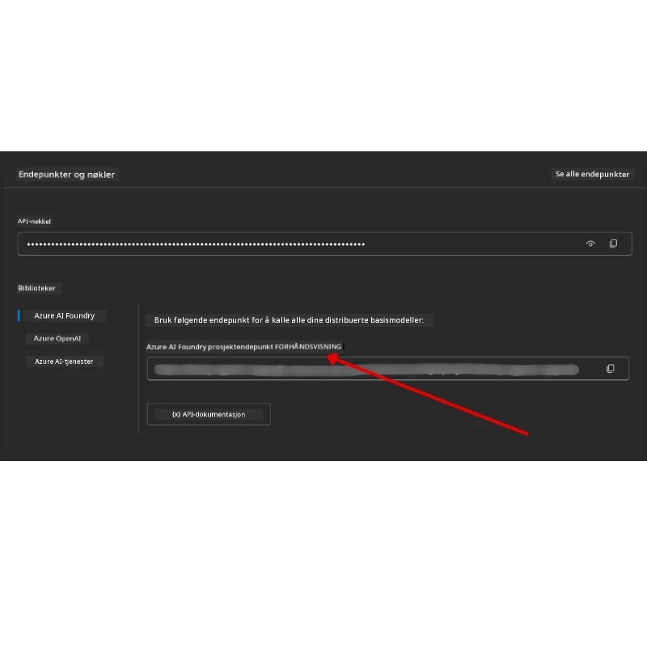

# Kursoppsett

## Introduksjon

Denne leksjonen vil dekke hvordan du kjører kodeeksemplene i dette kurset.

## Bli med andre elever og få hjelp

Før du begynner å klone ditt repositorium, bli med i [AI Agents For Beginners Discord-kanalen](https://aka.ms/ai-agents/discord) for å få hjelp med oppsett, spørsmål om kurset, eller for å koble deg til andre elever.

## Klon eller forkk dette repoet

For å begynne, klon eller fork GitHub-repositoriet. Dette vil lage din egen versjon av kursmaterialet slik at du kan kjøre, teste og justere koden!

Dette kan gjøres ved å klikke på lenken for <a href="https://github.com/microsoft/ai-agents-for-beginners/fork" target="_blank">å forke repoet</a>

Du skal nå ha din egen forkede versjon av dette kurset på følgende lenke:


### Shallow Clone (anbefalt for workshop / Codespaces)

  >Det fullstendige repositoriet kan være stort (~3 GB) når du laster ned hele historikken og alle filer. Hvis du kun deltar på workshopen eller bare trenger noen få leksjonsmapper, unngår en shallow clone (eller sparse clone) det meste av nedlastingen ved å forkorte historikken og/eller hoppe over blobs.

#### Rask shallow clone — minimal historikk, alle filer

Bytt ut `<your-username>` i kommandoene under med din fork URL (eller upstream URL hvis du foretrekker det).

For å klone kun den siste commit-historikken (liten nedlasting):

```bash|powershell
git clone --depth 1 https://github.com/<your-username>/ai-agents-for-beginners.git
```

For å klone en spesifikk branch:

```bash|powershell
git clone --depth 1 --branch <branch-name> https://github.com/<your-username>/ai-agents-for-beginners.git
```

#### Delvis (sparse) clone — minimale blobs + bare valgte mapper

Dette bruker partial clone og sparse-checkout (krever Git 2.25+ og anbefalt moderne Git med partial clone støtte):

```bash|powershell
git clone --depth 1 --filter=blob:none --sparse https://github.com/<your-username>/ai-agents-for-beginners.git
```

Gå inn i repo-mappen:

```bash|powershell
cd ai-agents-for-beginners
```

Deretter spesifiser hvilke mapper du vil ha (eksempelet under viser to mapper):

```bash|powershell
git sparse-checkout set 00-course-setup 01-intro-to-ai-agents
```

Etter kloning og verifisering av filer, hvis du kun trenger filene og vil frigjøre plass (ingen git-historikk), slett repository-metadataene (💀irreversibelt — du mister all Git-funksjonalitet: ingen commits, pulls, pushes eller historikk-tilgang).

```bash
# zsh/bash
rm -rf .git
```

```powershell
# PowerShell
Remove-Item -Recurse -Force .git
```

#### Bruk av GitHub Codespaces (anbefalt for å unngå store lokale nedlastinger)

- Opprett et nytt Codespace for dette repoet via [GitHub UI](https://github.com/codespaces).  

- I terminalen til det nylig opprettede codespacet, kjør en av shallow/sparse clone-kommandoene ovenfor for å hente kun lekjsonsmappene du trenger inn i Codespace arbeidsområdet.
- Valgfritt: etter kloning inne i Codespaces, fjern .git for å frigjøre ekstra plass (se fjerningskommandoer ovenfor).
- Merk: Hvis du foretrekker å åpne repoet direkte i Codespaces (uten ekstra kloning), vær oppmerksom på at Codespaces vil bygge devcontainer-miljøet og kan fortsatt provisjonere mer enn du trenger. Å klone en shallow kopi inne i et nytt Codespace gir deg mer kontroll over diskbruk.

#### Tips

- Bytt alltid ut clone URL med din fork hvis du ønsker å redigere/committe.
- Hvis du senere trenger mer historikk eller filer, kan du hente dem eller justere sparse-checkout for å inkludere flere mapper.

## Kjøre koden

Dette kurset tilbyr en serie Jupyter Notebooks som du kan kjøre for å få praktisk erfaring med å bygge AI-agenter.

Kodeeksemplene bruker **Microsoft Agent Framework (MAF)** med `AzureAIProjectAgentProvider`, som kobler til **Azure AI Agent Service V2** (Responses API) gjennom **Microsoft Foundry**.

Alle Python-notebooks har navnet `*-python-agent-framework.ipynb`.

## Krav

- Python 3.12+
  - **MERK**: Hvis du ikke har Python3.12 installert, forsikre deg om at du installerer det. Lag deretter ditt virtuelle miljø ved å bruke python3.12 for å sikre riktige versjoner installert fra requirements.txt-filen.
  
    >Eksempel

    Opprett Python venv-katalog:

    ```bash|powershell
    python -m venv venv
    ```

    Aktiver deretter venv-miljøet for:

    ```bash
    # zsh/bash
    source venv/bin/activate
    ```
  
    ```dos
    # Command Prompt for Windows
    venv\Scripts\activate
    ```

- .NET 10+: For kodeeksempler som bruker .NET, forsikre deg om at du har installert [.NET 10 SDK](https://dotnet.microsoft.com/download/dotnet/10.0) eller nyere. Deretter sjekk hvilken .NET SDK-versjon som er installert:

    ```bash|powershell
    dotnet --list-sdks
    ```

- **Azure CLI** — Nødvendig for autentisering. Installer fra [aka.ms/installazurecli](https://aka.ms/installazurecli).
- **Azure-abonnement** — For tilgang til Microsoft Foundry og Azure AI Agent Service.
- **Microsoft Foundry-prosjekt** — Et prosjekt med distribuert modell (f.eks. `gpt-4o`). Se [Steg 1](#steg-1-opprett-et-microsoft-foundry-prosjekt) nedenfor.

Vi har inkludert en `requirements.txt`-fil i roten av dette repositoriet som inneholder alle nødvendige Python-pakker for å kjøre kodeeksemplene.

Du kan installere dem ved å kjøre følgende kommando i terminalen i repositoriets rotmappe:

```bash|powershell
pip install -r requirements.txt
```

Vi anbefaler å opprette et Python virtuelt miljø for å unngå eventuelle konflikter og problemer.

## Sett opp VSCode

Forsikre deg at du bruker riktig Python-versjon i VSCode.


## Sett opp Microsoft Foundry og Azure AI Agent Service

### Steg 1: Opprett et Microsoft Foundry-prosjekt

Du trenger en Azure AI Foundry **hub** og **prosjekt** med distribuert modell for å kjøre notebookene.

1. Gå til [ai.azure.com](https://ai.azure.com) og logg på med din Azure-konto.
2. Opprett en **hub** (eller bruk en eksisterende). Se: [Hub ressurser oversikt](https://learn.microsoft.com/azure/ai-foundry/concepts/ai-resources).
3. Inne i huben, opprett et **prosjekt**.
4. Distribuer en modell (f.eks. `gpt-4o`) fra **Models + Endpoints** → **Deploy model**.

### Steg 2: Hent prosjektendepunkt og modell-distribusjonsnavn

Fra prosjektet ditt i Microsoft Foundry-portalen:

- **Project Endpoint** — Gå til **Oversikts**siden og kopier endepunkt-URLen.



- **Model Deployment Name** — Gå til **Models + Endpoints**, velg din distribuerte modell, og noter deg **Deployment name** (f.eks. `gpt-4o`).

### Steg 3: Logg på Azure med `az login`

Alle notebooks bruker **`AzureCliCredential`** for autentisering — ingen API-nøkler trenger å håndteres. Dette krever at du er logget inn via Azure CLI.

1. **Installer Azure CLI** hvis du ikke allerede har gjort det: [aka.ms/installazurecli](https://aka.ms/installazurecli)

2. **Logg på** ved å kjøre:

    ```bash|powershell
    az login
    ```

    Eller hvis du er i et fjern-/Codespace-miljø uten nettleser:

    ```bash|powershell
    az login --use-device-code
    ```

3. **Velg abonnement** om du blir bedt om det — velg det som inneholder Foundry-prosjektet ditt.

4. **Verifiser** at du er pålogget:

    ```bash|powershell
    az account show
    ```

> **Hvorfor `az login`?** Notebookene autentiserer med `AzureCliCredential` fra `azure-identity`-pakken. Dette betyr at Azure CLI-økten din gir legitimasjonen — ingen API-nøkler eller hemmeligheter i din `.env`-fil. Dette er en [best practice for sikkerhet](https://learn.microsoft.com/azure/developer/ai/keyless-connections).

### Steg 4: Opprett din `.env`-fil

Kopier eksempelfilen:

```bash
# zsh/bash
cp .env.example .env
```

```powershell
# PowerShell
Copy-Item .env.example .env
```

Åpne `.env` og fyll inn disse to verdiene:

```env
AZURE_AI_PROJECT_ENDPOINT=https://<your-project>.services.ai.azure.com/api/projects/<your-project-id>
AZURE_AI_MODEL_DEPLOYMENT_NAME=gpt-4o
```

| Variabel | Hvor finne den |
|----------|-----------------|
| `AZURE_AI_PROJECT_ENDPOINT` | Foundry-portalen → ditt prosjekt → **Oversikt**-side |
| `AZURE_AI_MODEL_DEPLOYMENT_NAME` | Foundry-portalen → **Models + Endpoints** → ditt distribuerte modellnavn |

Det er alt for de fleste leksjoner! Notebookene vil autentisere automatisk gjennom din `az login`-økt.

### Steg 5: Installer Python-avhengigheter

```bash|powershell
pip install -r requirements.txt
```

Vi anbefaler å kjøre dette inne i det virtuelle miljøet du opprettet tidligere.

## Ekstra oppsett for leksjon 5 (Agentic RAG)

Leksjon 5 bruker **Azure AI Search** for retrieval-augmented generation. Hvis du planlegger å kjøre denne leksjonen, legg til disse variablene i din `.env`-fil:

| Variabel | Hvor finne den |
|----------|-----------------|
| `AZURE_SEARCH_SERVICE_ENDPOINT` | Azure-portalen → din **Azure AI Search** ressurs → **Oversikt** → URL |
| `AZURE_SEARCH_API_KEY` | Azure-portalen → din **Azure AI Search** ressurs → **Innstillinger** → **Nøkler** → primær administratornøkkel |

## Ekstra oppsett for leksjon 6 og leksjon 8 (GitHub-modeller)

Noen notebooks i leksjon 6 og 8 bruker **GitHub Models** i stedet for Azure AI Foundry. Hvis du planlegger å kjøre disse eksemplene, legg til disse variablene i din `.env`-fil:

| Variabel | Hvor finne den |
|----------|-----------------|
| `GITHUB_TOKEN` | GitHub → **Innstillinger** → **Utviklerinnstillinger** → **Personlige tilgangsnøkler** |
| `GITHUB_ENDPOINT` | Bruk `https://models.inference.ai.azure.com` (standardverdi) |
| `GITHUB_MODEL_ID` | Modellnavn som skal brukes (f.eks. `gpt-4o-mini`) |

## Alternativ leverandør: MiniMax (OpenAI-kompatibel)

[MiniMax](https://platform.minimaxi.com/) tilbyr modeller med stor kontekst (opptil 204K tokens) gjennom en OpenAI-kompatibel API. Siden Microsoft Agent Frameworks `OpenAIChatClient` fungerer med hvilken som helst OpenAI-kompatibel endepunkt, kan du bruke MiniMax som en drop-in erstatning for GitHub Models eller OpenAI.

Legg disse variablene til i din `.env`-fil:

| Variabel | Hvor finne den |
|----------|-----------------|
| `MINIMAX_API_KEY` | [MiniMax Platform](https://platform.minimaxi.com/) → API-nøkler |
| `MINIMAX_BASE_URL` | Bruk `https://api.minimax.io/v1` (standardverdi) |
| `MINIMAX_MODEL_ID` | Modellnavn som skal brukes (f.eks. `MiniMax-M2.7`) |

**Tilgjengelige modeller**: `MiniMax-M2.7` (anbefalt), `MiniMax-M2.7-highspeed` (raskere svar)

Kodeeksemplene som bruker `OpenAIChatClient` (f.eks. leksjon 14 hotellbooking-arbeidsflyt) vil automatisk oppdage og bruke MiniMax-konfigurasjonen din når `MINIMAX_API_KEY` er satt.

## Ekstra oppsett for leksjon 8 (Bing Grounding-arbeidsflyt)

Den betingede arbeidsflytnotebooken i leksjon 8 bruker **Bing grounding** via Azure AI Foundry. Hvis du planlegger å kjøre det eksempelet, legg til denne variabelen i din `.env`-fil:

| Variabel | Hvor finne den |
|----------|-----------------|
| `BING_CONNECTION_ID` | Azure AI Foundry-portalen → ditt prosjekt → **Management** → **Connected resources** → din Bing-tilkobling → kopier tilkoblings-ID |

## Feilsøking

### SSL-sertifikatverifiseringsfeil på macOS

Hvis du er på macOS og møter en feil som:

```plaintext
ssl.SSLCertVerificationError: [SSL: CERTIFICATE_VERIFY_FAILED] certificate verify failed: self-signed certificate in certificate chain
```

Dette er et kjent problem med Python på macOS der systemets SSL-sertifikater ikke blir automatisk anerkjent. Prøv følgende løsninger i rekkefølge:

**Alternativ 1: Kjør Pythons Install Certificates-skript (anbefalt)**

```bash
# Erstatt 3.XX med din installerte Python-versjon (f.eks. 3.12 eller 3.13):
/Applications/Python\ 3.XX/Install\ Certificates.command
```

**Alternativ 2: Bruk `connection_verify=False` i notebooken din (kun for GitHub Models-notebooks)**

I leksjon 6-notebooken (`06-building-trustworthy-agents/code_samples/06-system-message-framework.ipynb`), finnes en kommentert løsning allerede inkludert. Fjern kommentaren på `connection_verify=False` når klienten opprettes:

```python
client = ChatCompletionsClient(
    endpoint=endpoint,
    credential=AzureKeyCredential(token),
    connection_verify=False,  # Deaktiver SSL-verifisering hvis du opplever sertifikatfeil
)
```

> **⚠️ Advarsel:** Deaktivering av SSL-verifisering (`connection_verify=False`) reduserer sikkerheten ved å hoppe over sertifikatvalidering. Bruk dette kun som en midlertidig løsning i utviklingsmiljøer, aldri i produksjon.

**Alternativ 3: Installer og bruk `truststore`**

```bash
pip install truststore
```

Legg deretter til følgende øverst i notebooken eller skriptet før du gjør nettverkskall:

```python
import truststore
truststore.inject_into_ssl()
```

## Står du fast et sted?

Hvis du har problemer med å kjøre oppsettet, ta turen innom vår <a href="https://discord.gg/kzRShWzttr" target="_blank">Azure AI Community Discord</a> eller <a href="https://github.com/microsoft/ai-agents-for-beginners/issues?WT.mc_id=academic-105485-koreyst" target="_blank">opprett en issue</a>.

## Neste leksjon

Du er nå klar til å kjøre koden for dette kurset. Lykke til med å lære mer om AI-agenters verden! 

[Introduksjon til AI-agenter og Agent Use Cases](../01-intro-to-ai-agents/README.md)

---

<!-- CO-OP TRANSLATOR DISCLAIMER START -->
**Ansvarsfraskrivelse**:  
Dette dokumentet er oversatt ved hjelp av AI-oversettelsestjenesten [Co-op Translator](https://github.com/Azure/co-op-translator). Selv om vi streber etter nøyaktighet, vær oppmerksom på at automatiserte oversettelser kan inneholde feil eller unøyaktigheter. Det opprinnelige dokumentet på originalspråket bør betraktes som den autoritative kilden. For kritisk informasjon anbefales profesjonell menneskelig oversettelse. Vi påtar oss ikke ansvar for misforståelser eller feiltolkninger som oppstår ved bruk av denne oversettelsen.
<!-- CO-OP TRANSLATOR DISCLAIMER END -->