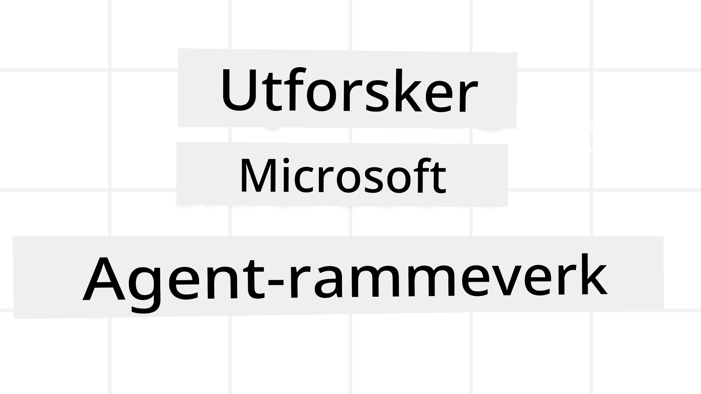
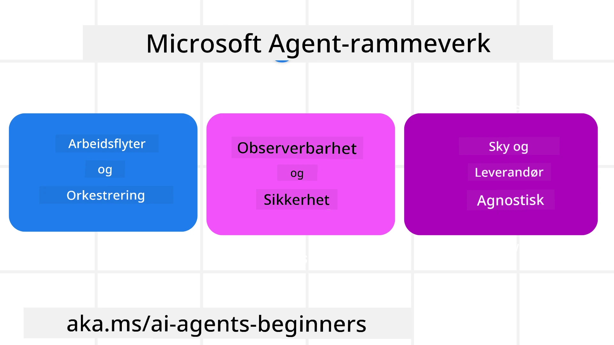
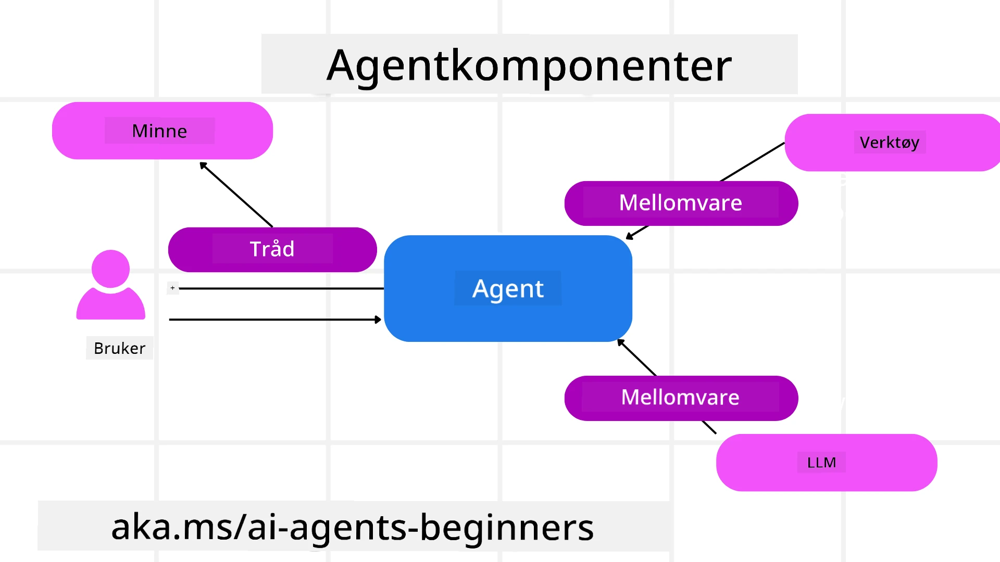

# Utforske Microsoft Agent Framework



### Introduksjon

Denne leksjonen vil dekke:

- Forstå Microsoft Agent Framework: Nøkkelfunksjoner og verdi  
- Utforske nøkkelkonseptene i Microsoft Agent Framework
- Avanserte MAF-mønstre: Arbeidsflyter, mellomvare og minne

## Læringsmål

Etter å ha fullført denne leksjonen, vil du vite hvordan du skal:

- Bygge produksjonsklare AI-agenter ved hjelp av Microsoft Agent Framework
- Anvende kjernemerkene i Microsoft Agent Framework på dine agentiske brukstilfeller
- Bruke avanserte mønstre inkludert arbeidsflyter, mellomvare og observabilitet

## Kodeeksempler 

Kodeeksempler for [Microsoft Agent Framework (MAF)](https://aka.ms/ai-agents-beginners/agent-framewrok) finnes i dette depotet under filene `xx-python-agent-framework` og `xx-dotnet-agent-framework`.

## Forstå Microsoft Agent Framework



[Microsoft Agent Framework (MAF)](https://aka.ms/ai-agents-beginners/agent-framewrok) er Microsofts enhetlige rammeverk for å bygge AI-agenter. Det tilbyr fleksibiliteten til å adressere det brede spekteret av agentiske brukstilfeller som ses både i produksjon og forskningsmiljøer, inkludert:

- **Sekvensiell agentorkestrering** i scenarioer hvor steg-for-steg arbeidsflyter er nødvendig.
- **Samtidig orkestrering** i scenarioer hvor agenter må utføre oppgaver samtidig.
- **Gruppechat-orkestrering** i scenarioer hvor agenter kan samarbeide på en oppgave.
- **Overleveringsorkestrering** i scenarioer hvor agenter overleverer oppgaven til hverandre etter hvert som deloppgaver fullføres.
- **Magnetisk orkestrering** i scenarioer hvor en lederagent oppretter og endrer en oppgaveliste og håndterer koordineringen av underagenter for å fullføre oppgaven.

For å levere AI-agenter i produksjon, inkluderer MAF også funksjoner for:

- **Observabilitet** gjennom bruk av OpenTelemetry hvor hver handling til AI-agenten, inkludert verktøysanrop, orkestreringstrinn, resonnementflyter og ytelsesovervåking skjer via Microsoft Foundry dashboards.
- **Sikkerhet** ved å ha agenter hostet nativt på Microsoft Foundry, som inkluderer sikkerhetskontroller som rollebasert tilgang, håndtering av privat data og innebygd innholdssikkerhet.
- **Robusthet** da agenttråder og arbeidsflyter kan pause, gjenoppta og komme seg etter feil, noe som muliggjør lengre kjøringer.
- **Kontroll** da arbeidsflyter med menneskelig involvering støttes der oppgaver merkes som krever menneskelig godkjenning.

Microsoft Agent Framework er også fokusert på å være interoperabel ved å:

- **Være sky-agnostisk** - Agenter kan kjøre i containere, on-prem og på tvers av flere ulike skyer.
- **Være leverandør-agnostisk** - Agenter kan opprettes via ditt foretrukne SDK, inkludert Azure OpenAI og OpenAI.
- **Integrere åpne standarder** - Agenter kan bruke protokoller som Agent-to-Agent (A2A) og Model Context Protocol (MCP) for å oppdage og bruke andre agenter og verktøy.
- **Plugins og tilkoblinger** - Tilkoblinger kan gjøres til data- og minnetjenester som Microsoft Fabric, SharePoint, Pinecone og Qdrant.

La oss se på hvordan disse funksjonene anvendes på noen av kjernebegrepene i Microsoft Agent Framework.

## Nøkkelkonsepter i Microsoft Agent Framework

### Agenter



**Opprette Agenter**

Opprettelse av agenter gjøres ved å definere inferenstjenesten (LLM-leverandør), et sett med instruksjoner for AI-agenten å følge, og et tildelt `name`:

```python
agent = AzureOpenAIChatClient(credential=AzureCliCredential()).create_agent( instructions="You are good at recommending trips to customers based on their preferences.", name="TripRecommender" )
```

Ovenfor brukes `Azure OpenAI`, men agenter kan opprettes ved hjelp av en rekke tjenester inkludert `Microsoft Foundry Agent Service`:

```python
AzureAIAgentClient(async_credential=credential).create_agent( name="HelperAgent", instructions="You are a helpful assistant." ) as agent
```

OpenAI `Responses`, `ChatCompletion` API-er

```python
agent = OpenAIResponsesClient().create_agent( name="WeatherBot", instructions="You are a helpful weather assistant.", )
```

```python
agent = OpenAIChatClient().create_agent( name="HelpfulAssistant", instructions="You are a helpful assistant.", )
```

eller [MiniMax](https://platform.minimaxi.com/), som tilbyr en OpenAI-kompatibel API med store kontekstvinduer (opptil 204K tokens):

```python
agent = OpenAIChatClient(base_url="https://api.minimax.io/v1", api_key=os.environ["MINIMAX_API_KEY"], model_id="MiniMax-M2.7").create_agent( name="HelpfulAssistant", instructions="You are a helpful assistant.", )
```

eller eksterne agenter ved bruk av A2A-protokollen:

```python
agent = A2AAgent( name=agent_card.name, description=agent_card.description, agent_card=agent_card, url="https://your-a2a-agent-host" )
```

**Kjøre Agenter**

Agenter kjøres ved bruk av `.run` eller `.run_stream` metoder for enten ikke-strømning eller strømning av svar.

```python
result = await agent.run("What are good places to visit in Amsterdam?")
print(result.text)
```

```python
async for update in agent.run_stream("What are the good places to visit in Amsterdam?"):
    if update.text:
        print(update.text, end="", flush=True)

```

Hver agentkjøring kan også ha alternativer for å tilpasse parametere som `max_tokens` brukt av agenten, `tools` agenten kan kalle, og til og med `model` som brukes av agenten.

Dette er nyttig i tilfeller hvor spesifikke modeller eller verktøy kreves for å fullføre en brukers oppgave.

**Verktøy**

Verktøy kan defineres både ved opprettelse av agenten:

```python
def get_attractions( location: Annotated[str, Field(description="The location to get the top tourist attractions for")], ) -> str: """Get the top tourist attractions for a given location.""" return f"The top attractions for {location} are." 


# Når du oppretter en ChatAgent direkte

agent = ChatAgent( chat_client=OpenAIChatClient(), instructions="You are a helpful assistant", tools=[get_attractions]

```

og også ved kjøring av agenten:

```python

result1 = await agent.run( "What's the best place to visit in Seattle?", tools=[get_attractions] # Verktøy tilgjengelig kun for denne kjøringen )
```

**Agenttråder**

Agenttråder brukes for å håndtere fleromgangssamtaler. Tråder kan opprettes enten ved:

- Å bruke `get_new_thread()` som gjør at tråden kan lagres over tid
- Å opprette en tråd automatisk når en agent kjøres, der tråden kun varer under den nåværende kjøringen.

For å opprette en tråd ser koden slik ut:

```python
# Opprett en ny tråd.
thread = agent.get_new_thread() # Kjør agenten med tråden.
response = await agent.run("Hello, I am here to help you book travel. Where would you like to go?", thread=thread)

```

Du kan deretter serialisere tråden for lagring til senere bruk:

```python
# Opprett en ny tråd.
thread = agent.get_new_thread() 

# Kjør agenten med tråden.

response = await agent.run("Hello, how are you?", thread=thread) 

# Serialiser tråden for lagring.

serialized_thread = await thread.serialize() 

# Deserialiser trådtilstanden etter lasting fra lagring.

resumed_thread = await agent.deserialize_thread(serialized_thread)
```

**Agent Mellomvare**

Agenter samhandler med verktøy og LLM for å fullføre brukeroppgaver. I visse scenarioer ønsker vi å utføre eller spore handlinger mellom disse interaksjonene. Agent-mellomvare tillater oss å gjøre dette gjennom:

*Funksjonsmellomvare*

Denne mellomvaren lar oss utføre en handling mellom agenten og en funksjon/verktøy den vil kalle. Et eksempel på bruk er når du ønsker å gjøre logging på funksjonskallet.

I koden under definerer `next` om neste mellomvare eller den faktiske funksjonen skal kalles.

```python
async def logging_function_middleware(
    context: FunctionInvocationContext,
    next: Callable[[FunctionInvocationContext], Awaitable[None]],
) -> None:
    """Function middleware that logs function execution."""
    # Forbehandling: Logg før funksjonsutførelse
    print(f"[Function] Calling {context.function.name}")

    # Fortsett til neste mellomvare eller funksjonsutførelse
    await next(context)

    # Etterbehandling: Logg etter funksjonsutførelse
    print(f"[Function] {context.function.name} completed")
```

*Chat Mellomvare*

Denne mellomvaren lar oss utføre eller logge en handling mellom agenten og forespørslene til LLM.

Dette inneholder viktig informasjon som `messages` som sendes til AI-tjenesten.

```python
async def logging_chat_middleware(
    context: ChatContext,
    next: Callable[[ChatContext], Awaitable[None]],
) -> None:
    """Chat middleware that logs AI interactions."""
    # Forbehandling: Logg før AI-kall
    print(f"[Chat] Sending {len(context.messages)} messages to AI")

    # Fortsett til neste mellomvare eller AI-tjeneste
    await next(context)

    # Etterbehandling: Logg etter AI-respons
    print("[Chat] AI response received")

```

**Agentminne**

Som dekket i leksjonen `Agentic Memory`, er minne et viktig element for å muliggjøre agentens operasjon over ulike kontekster. MAF tilbyr flere forskjellige typer minne:

*Minne i minnet*

Dette er minnet lagret i tråder under applikasjonskjøringen.

```python
# Opprett en ny tråd.
thread = agent.get_new_thread() # Kjør agenten med tråden.
response = await agent.run("Hello, I am here to help you book travel. Where would you like to go?", thread=thread)
```

*Vedvarende meldinger*

Dette minnet brukes til å lagre samtalehistorikk på tvers av ulike økter. Det defineres ved bruk av `chat_message_store_factory`:

```python
from agent_framework import ChatMessageStore

# Lag en egendefinert meldingslagring
def create_message_store():
    return ChatMessageStore()

agent = ChatAgent(
    chat_client=OpenAIChatClient(),
    instructions="You are a Travel assistant.",
    chat_message_store_factory=create_message_store
)

```

*Dynamisk minne*

Dette minnet legges til konteksten før agenter kjøres. Disse minnene kan lagres i eksterne tjenester som mem0:

```python
from agent_framework.mem0 import Mem0Provider

# Bruker Mem0 for avanserte minnefunksjoner
memory_provider = Mem0Provider(
    api_key="your-mem0-api-key",
    user_id="user_123",
    application_id="my_app"
)

agent = ChatAgent(
    chat_client=OpenAIChatClient(),
    instructions="You are a helpful assistant with memory.",
    context_providers=memory_provider
)

```

**Agentobservabilitet**

Observabilitet er viktig for å bygge pålitelige og vedlikeholdbare agentiske systemer. MAF integreres med OpenTelemetry for å tilby sporing og målere for bedre observabilitet.

```python
from agent_framework.observability import get_tracer, get_meter

tracer = get_tracer()
meter = get_meter()
with tracer.start_as_current_span("my_custom_span"):
    # gjør noe
    pass
counter = meter.create_counter("my_custom_counter")
counter.add(1, {"key": "value"})
```

### Arbeidsflyter

MAF tilbyr arbeidsflyter som er forhåndsdefinerte trinn for å fullføre en oppgave og inkluderer AI-agenter som komponenter i disse trinnene.

Arbeidsflyter består av ulike komponenter som gir bedre kontrollflyt. Arbeidsflyter muliggjør også **multi-agent orkestrering** og **checkpointing** for å lagre arbeidsflyttilstander.

Kjernekomponentene i en arbeidsflyt er:

**Utøvere**

Utøvere mottar inndata, utfører sine tildelte oppgaver og produserer deretter en utdata-melding. Dette driver arbeidsflyten framover for å fullføre den større oppgaven. Utøvere kan være enten AI-agenter eller egendefinert logikk.

**Kanter**

Kanter brukes til å definere flyten av meldinger i en arbeidsflyt. Disse kan være:

*Direkte kanter* - Enkle en-til-en forbindelser mellom utøvere:

```python
from agent_framework import WorkflowBuilder

builder = WorkflowBuilder()
builder.add_edge(source_executor, target_executor)
builder.set_start_executor(source_executor)
workflow = builder.build()
```

*Betingede kanter* - Aktiveres etter at en viss betingelse er oppfylt. For eksempel, når hotellrom ikke er ledige, kan en utøver foreslå andre alternativer.

*Switch-case kanter* - Ruter meldinger til forskjellige utøvere basert på definerte betingelser. For eksempel om en reisekunde har prioritert tilgang, håndteres oppgavene deres gjennom en annen arbeidsflyt.

*Fan-out kanter* - Sender én melding til flere mål.

*Fan-in kanter* - Samler flere meldinger fra ulike utøvere og sender til ett mål.

**Hendelser**

For å gi bedre observabilitet i arbeidsflyter, tilbyr MAF innebygde hendelser for utførelse inkludert:

- `WorkflowStartedEvent`  - Arbeidsflytutførelse starter
- `WorkflowOutputEvent` - Arbeidsflyt produserer en utdata
- `WorkflowErrorEvent` - Arbeidsflyt møter en feil
- `ExecutorInvokeEvent`  - Utøver starter behandling
- `ExecutorCompleteEvent`  -  Utøver fullfører behandling
- `RequestInfoEvent` - En forespørsel er utstedt

## Avanserte MAF-mønstre

Avsnittene over dekker nøkkelkonseptene i Microsoft Agent Framework. Når du bygger mer komplekse agenter, her er noen avanserte mønstre å vurdere:

- **Mellomvarekomposisjon**: Kjede flere mellomvarehåndterere (logging, autentisering, ratebegrensning) ved bruk av funksjons- og chat-mellomvare for finmasket kontroll over agentens oppførsel.
- **Arbeidsflyt-checkpointing**: Bruk arbeidsflythendelser og serialisering for å lagre og gjenoppta langvarige agentprosesser.
- **Dynamisk verktøyvalg**: Kombiner RAG over verktøybeskrivelser med MAF sin verktøyregistrering for å presentere kun relevante verktøy per spørsmål.
- **Multi-agent overlevering**: Bruk arbeidsflytkanter og betinget ruting for å orkestrere overlevering mellom spesialiserte agenter.

## Kodeeksempler 

Kodeeksempler for Microsoft Agent Framework finnes i dette depotet under filene `xx-python-agent-framework` og `xx-dotnet-agent-framework`.

## Har du flere spørsmål om Microsoft Agent Framework?

Bli med i [Microsoft Foundry Discord](https://aka.ms/ai-agents/discord) for å møte andre lærende, delta på kontortimer og få svar på dine AI-agentspørsmål.

---

<!-- CO-OP TRANSLATOR DISCLAIMER START -->
**Ansvarsfraskrivelse**:  
Dette dokumentet er oversatt ved hjelp av AI-oversettelsestjenesten [Co-op Translator](https://github.com/Azure/co-op-translator). Selv om vi streber etter nøyaktighet, vennligst vær oppmerksom på at automatiske oversettelser kan inneholde feil eller unøyaktigheter. Det originale dokumentet på det opprinnelige språket bør anses som den autoritative kilden. For kritisk informasjon anbefales profesjonell menneskelig oversettelse. Vi er ikke ansvarlige for eventuelle misforståelser eller feiltolkninger som oppstår ved bruk av denne oversettelsen.
<!-- CO-OP TRANSLATOR DISCLAIMER END -->