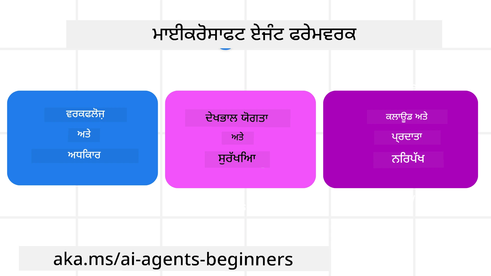

# ਮਾਈਕ੍ਰੋਸਾਫਟ ਏਜੰਟ ਫਰੇਮਵਰਕ ਦੀ ਖੋਜ


### ਤਾਰੂਫ਼

ਇਸ ਪਾਠ ਵਿੱਚ ਸਮਾਵੇਸ਼ ਹੋਵੇਗਾ:

- ਮਾਈਕ੍ਰੋਸਾਫਟ ਏਜੰਟ ਫਰੇਮਵਰਕ ਨੂੰ ਸਮਝਣਾ: ਮੁੱਖ ਵਿਸ਼ੇਸ਼ਤਾਵਾਂ ਅਤੇ ਕੀਮਤ  
- ਮਾਈਕ੍ਰੋਸਾਫਟ ਏਜੰਟ ਫਰੇਮਵਰਕ ਦੇ ਮੁੱਖ ਧਾਰਣਾਵਾਂ ਦੀ ਖੋਜ
- ਉਤਕ੍ਰਿਸ਼ਟ MAF ਪੈਟਰਨ: ਵਰਕਫਲੋ, ਮਿਡਲਵੇਅਰ ਅਤੇ ਮੈਮੋਰੀ

## ਸਿੱਖਣ ਦੇ ਲਕੜ

ਇਸ ਪਾਠ ਨੂੰ ਪੂਰਾ ਕਰਨ ਤੋਂ ਬਾਅਦ, ਤੁਸੀਂ ਜਾਣੋਗੇ ਕਿ ਕਿਵੇਂ:

- ਮਾਈਕ੍ਰੋਸਾਫਟ ਏਜੰਟ ਫਰੇਮਵਰਕ ਦੀ ਵਰਤੋਂ ਕਰਕੇ ਉਤਪਾਦਨ ਲਈ ਤਿਆਰ AI ਏਜੰਟ ਬਣਾਏ ਜਾ ਸਕਦੇ ਹਨ
- ਮਾਈਕ੍ਰੋਸਾਫਟ ਏਜੰਟ ਫਰੇਮਵਰਕ ਦੀਆਂ ਕੇਂਦਰੀ ਵਿਸ਼ੇਸ਼ਤਾਵਾਂ ਨੂੰ ਤੁਹਾਡੇ ਏਜੰਟਿਕ ਵਰਤੋਂ ਮਾਮਲਿਆਂ 'ਤੇ ਲਾਗੂ ਕਰੋ
- ਉਤਕ੍ਰਿਸ਼ਟ ਪੈਟਰਨ ਜਿਵੇਂ ਵਰਕਫਲੋ, ਮਿਡਲਵੇਅਰ ਅਤੇ ਨਿਰੀਖਣ ਵਰਤੋਂ ਕਰੋ

## ਕੋਡ ਨਮੂਨੇ 

[Microsoft Agent Framework (MAF)](https://aka.ms/ai-agents-beginners/agent-framewrok) ਲਈ ਕੋਡ ਨਮੂਨੇ ਇਸ ਰਿਪੋਜ਼ਿਟਰੀ ਵਿੱਚ `xx-python-agent-framework` ਅਤੇ `xx-dotnet-agent-framework` ਫਾਈਲਾਂ ਹੇਠਾਂ ਮਿਲ ਸਕਦੇ ਹਨ।

## ਮਾਈਕ੍ਰੋਸਾਫਟ ਏਜੰਟ ਫਰੇਮਵਰਕ ਨੂੰ ਸਮਝਣਾ



[Microsoft Agent Framework (MAF)](https://aka.ms/ai-agents-beginners/agent-framewrok) ਮਾਈਕ੍ਰੋਸਾਫਟ ਦਾ ਏਆਈ ਏਜੰਟ ਬਣਾਉਣ ਲਈ ਇਕਕ੍ਰਿਤ ਫਰੇਮਵਰਕ ਹੈ। ਇਹ ਉਤਪਾਦਨ ਅਤੇ ਅਨੁਸੰਧਾਨ ਵਾਤਾਵਰਨਾਂ ਵਿੱਚ ਵੇਖੇ ਗਏ ਵੱਖ-ਵੱਖ ਕਿਸਮ ਦੇ ਏਜੰਟਿਕ ਵਰਤੋਂ ਮਾਮਲਿਆਂ ਨੂੰ ਪਤੇ ਲਗਾਉਣ ਦੇ ਲਈ ਲਚਕੀਲਾਪਨ ਪ੍ਰਦਾਨ ਕਰਦਾ ਹੈ ਜਿਸ ਵਿੱਚ ਸ਼ਾਮਲ ਹਨ:

- **ਕ੍ਰਮਵਾਰ ਏਜੰਟ ਅੰਸ਼ਗਠਨ** ਜਿੱਥੇ ਕਦਮ-ਦਰ-ਕਦਮ ਵਰਕਫਲੋਜ਼ ਦੀ ਲੋੜ ਹੁੰਦੀ ਹੈ।
- **ਸੰਯੁਕਤ ਅੰਸ਼ਗਠਨ** ਜਿੱਥੇ ਏਜੰਟ ਨੂੰ ਇੱਕੋ ਸਮੇਂ ਕੰਮ ਪੂਰੇ ਕਰਨੇ ਹੁੰਦੇ ਹਨ।
- **ਗਰੁੱਪ ਚੈਟ ਅੰਸ਼ਗਠਨ** ਜਿੱਥੇ ਏਜੰਟ ਇਕੱਠੇ ਇੱਕ ਕੰਮ 'ਤੇ ਸਹਿਯੋਗ ਕਰ ਸਕਦੇ ਹਨ।
- **ਹੈਂਡਆਫ਼ ਅੰਸ਼ਗਠਨ** ਜਿੱਥੇ ਏਜੰਟ ਉਪਕਾਰਜ ਪੂਰੇ ਹੋਣ ਤੇ ਕੰਮ ਨੂੰ ਇਕੱਠੇ ਹੋਰ ਨੂੰ ਸੰਭਾਲਦੇ ਹਨ।
- **ਮੈਗਨੇਟਿਕ ਅੰਸ਼ਗਠਨ** ਜਿੱਥੇ ਇਕ ਪ੍ਰबंधਕ ਏਜੰਟ ਕੰਮ ਸੂਚੀ ਬਣਾਉਂਦਾ ਅਤੇ ਸੋਧਦਾ ਹੈ ਅਤੇ ਉਪ ਏਜੰਟਾਂ ਦੀ ਯੋਜਨਾ ਬਣਾਉਂਦਾ ਹੈ।

ਉਤਪਾਦਨ ਵਿੱਚ AI ਏਜੰਟ ਪ੍ਰਦਾਨ ਕਰਨ ਲਈ, MAF ਵਿੱਚ ਇਹ ਗੁਣ ਵੀ ਹਨ:

- **ਨਿਰੀਖਣਯੋਗਤਾ** OpenTelemetry ਦੇ ਜ਼ਰੀਏ ਜਿੱਥੇ AI ਏਜੰਟ ਦੀ ਹਰ ਕਾਰਵਾਈ ਜਿਵੇਂ ਟੂਲ ਆਹਵਾਨ, ਅੰਸ਼ਗਠਨ ਕਦਮ, ਵਿਚਾਰ ਦੇ ਪ੍ਰਵਾਹ ਅਤੇ ਪ੍ਰਦਰਸ਼ਨ ਮਾਨੀਟਰਿੰਗ ਮਾਈਕ੍ਰੋਸਾਫਟ ਫਾਊਂਡਰੀ ਡੈਸ਼ਬੋਰਡਸ ਦੇ ਨਾਲ ਹੋਦੀ ਹੈ।
- **ਸੁਰੱਖਿਆ** ਏਜੰਟਾਂ ਨੂੰ ਮਾਈਕ੍ਰੋਸਾਫਟ ਫਾਊਂਡਰੀ ਤੇ ਮਨ मुताबिक ਉੜਾਉਣਾ ਜਿਸ ਵਿੱਚ ਰੋਲ-ਆਧਾਰਤ ਪਹੁੰਚ, ਨਿੱਜੀ ਡੇਟਾ ਸੰਭਾਲ ਅਤੇ ਅੰਦਰੂਨੀ ਸਮੱਗਰੀ ਸੁਰੱਖਿਆ ਸ਼ਾਮਲ ਹੈ।
- **ਟਿਕਾਊਤਾ** ਕਿਉਂਕਿ ਏਜੰਟ ਥਰੇਡ ਅਤੇ ਵਰਕਫਲੋਜ਼ ਰੋਕੇ, ਦੁਬਾਰਾ ਚਾਲੂ ਅਤੇ ਗਲਤੀਆਂ ਤੋਂ ਬਚ ਸਕਦੇ ਹਨ, ਜਿਸ ਨਾਲ ਲੰਮੀ ਦੌੜ ਵਾਲਾ ਪ੍ਰਕਿਰਿਆ ਸੰਭਵ ਹੁੰਦੀ ਹੈ।
- **ਨਿਯੰਤਰਣ** ਕਿਉਂਕਿ ਹਿਊਮਨ ਇਨ ਦ ਲੂਪ ਵਰਕਫਲੋ ਸਹਾਇਤਾ ਦਿੰਦੇ ਹਨ ਜਿੱਥੇ ਕੰਮ ਮਾਨਵੀ ਮਨਜ਼ੂਰੀ ਲਈ ਦਿੱਖਾਏ ਜਾਂਦੇ ਹਨ।

ਮਾਈਕ੍ਰੋਸਾਫਟ ਏਜੰਟ ਫਰੇਮਵਰਕ ਦਾ ਮੁੱਖ ਫੋਕਸ ਇੰਟਰਓਪਰੈਬਿਲਿਟੀ ਤੇ ਵੀ ਹੈ:

- **ਕਲਾਉਡ ਅਣਉਪਰੀ** - ਏਜੰਟ ਕੰਟੇਨਰਾਂ, ਆਨ-ਪ੍ਰੇਮ ਅਤੇ ਕਈ ਵੱਖ-ਵੱਖ ਕਲਾਉਡਾਂ ਉੱਤੇ ਚੱਲ ਸਕਦੇ ਹਨ।
- **ਪ੍ਰੋਵਾਈਡਰ ਅਣਉਪਰੀ** - ਏਜੰਟ ਤੁਹਾਡੇ ਪਸੰਦੀਦਾ SDK ਜਿਵੇਂ Azure OpenAI ਅਤੇ OpenAI ਨਾਲ ਬਣਾਏ ਜਾ ਸਕਦੇ ਹਨ।
- **ਖੁੱਲੇ ਮਿਆਰਾਂ ਦਾ ਸਮਾਵੇਸ਼** - ਏਜੰਟਆਂ ਨੂੰ Agent-to-Agent (A2A) ਅਤੇ Model Context Protocol (MCP) ਵਰਗੇ ਪ੍ਰੋਟੋਕਾਲ ਵਰਤੀ ਜਾਂਦੀ ਹੈ ਹੋਰ ਏਜੰਟਾਂ ਅਤੇ ਟੂਲਾਂ ਦੀ ਖੋਜ ਅਤੇ ਵਰਤੋਂ ਲਈ।
- **ਪਲੱਗਇਨ ਅਤੇ ਕਨੈਕਟਰ** - ਕਨੈਕਸ਼ਨ ਬਣਾਈ ਜਾਣ ਦੀ ਸਮਰੱਥਾ ਹੈ ਜਿਵੇਂ Microsoft Fabric, SharePoint, Pinecone ਅਤੇ Qdrant ਵਰਗੀਆਂ ਡੇਟਾ ਅਤੇ ਮੈਮੋਰੀ ਸੇਵਾਵਾਂ ਵਿੱਚ।

ਆਓ ਵੇਖੀਏ ਕਿ ਇਹ ਫੀਚਰ ਮਾਈਕ੍ਰੋਸਾਫਟ ਏਜੰਟ ਫਰੇਮਵਰਕ ਦੇ ਕੁਝ ਕੇਂਦਰੀ ਧਾਰਨਾਵਾਂ ਵਿੱਚ ਕਿਵੇਂ ਲਾਗੂ ਹੁੰਦੇ ਹਨ।

## ਮਾਈਕ੍ਰੋਸਾਫਟ ਏਜੰਟ ਫਰੇਮਵਰਕ ਦੇ ਮੁੱਖ ਧਾਰਣਾਵਾਂ

### ਏਜੰਟ


**ਏਜੰਟ ਬਣਾਉਣਾ**

ਏਜੰਟ ਬਣਾਉਣਾ ਅਨੁਮਾਨ ਸੇਵਾ (LLM ਪ੍ਰਦਾਤਾ) ਨੂੰ ਪਰਿਭਾਸ਼ਿਤ ਕਰਕੇ, AI ਏਜੰਟ ਲਈ ਹੁਕਮਾਂ ਦੀ ਸੈੱਟ ਦਿੱਤੀ ਜਾਂਦੀ ਹੈ, ਅਤੇ ਇੱਕ ਨਿਰਧਾਰਤ `ਨਾਮ` ਦਿੱਤਾ ਜਾਂਦਾ ਹੈ:

```python
agent = AzureOpenAIChatClient(credential=AzureCliCredential()).create_agent( instructions="You are good at recommending trips to customers based on their preferences.", name="TripRecommender" )
```

ਉਪਰੋਕਤ `Azure OpenAI` ਦੀ ਵਰਤੋਂ ਕਰਦਾ ਹੈ ਪਰ ਏਜੰਟਾਂ ਨੂੰ ਵੱਖ-ਵੱਖ ਸੇਵਾਵਾਂ ਵਰਗੀ `Microsoft Foundry Agent Service` ਨਾਲ ਬਣਾਇਆ ਜਾ ਸਕਦਾ ਹੈ:

```python
AzureAIAgentClient(async_credential=credential).create_agent( name="HelperAgent", instructions="You are a helpful assistant." ) as agent
```

OpenAI ਦੇ `Responses`, `ChatCompletion` API

```python
agent = OpenAIResponsesClient().create_agent( name="WeatherBot", instructions="You are a helpful weather assistant.", )
```

```python
agent = OpenAIChatClient().create_agent( name="HelpfulAssistant", instructions="You are a helpful assistant.", )
```

ਜਾਂ [MiniMax](https://platform.minimaxi.com/), ਜੋ ਵੱਡੇ ਸੰਦਰਭ ਵਿੰਡੋ (204K ਟੋਕਨ ਤੱਕ) ਵਾਲਾ OpenAI-ਅਨੁਕੂਲ API ਪ੍ਰਦਾਨ ਕਰਦਾ ਹੈ:

```python
agent = OpenAIChatClient(base_url="https://api.minimax.io/v1", api_key=os.environ["MINIMAX_API_KEY"], model_id="MiniMax-M2.7").create_agent( name="HelpfulAssistant", instructions="You are a helpful assistant.", )
```

ਜਾਂ A2A ਪ੍ਰੋਟੋਕੌਲ ਨਾਲ ਰਿਮੋਟ ਏਜੰਟ:

```python
agent = A2AAgent( name=agent_card.name, description=agent_card.description, agent_card=agent_card, url="https://your-a2a-agent-host" )
```

**ਏਜੰਟ ਚਲਾਉਣਾ**

ਏਜੰਟ ਨੂੰ `.run` ਜਾਂ `.run_stream` ਵਿਧੀਆਂ ਨਾਲ ਚਲਾਇਆ ਜਾਂਦਾ ਹੈ ਨਾਨ-ਸਟ੍ਰੀਮਿੰਗ ਜਾਂ ਸਟ੍ਰੀਮਿੰਗ ਜਵਾਬਾਂ ਲਈ।

```python
result = await agent.run("What are good places to visit in Amsterdam?")
print(result.text)
```

```python
async for update in agent.run_stream("What are the good places to visit in Amsterdam?"):
    if update.text:
        print(update.text, end="", flush=True)

```

ਹਰ ਏਜੰਟ ਚਲਾਉਣ ਲਈ ਵਿਕਲਪ ਹੁੰਦੇ ਹਨ ਜਿਹੜੇ ਪਰਮੇਟਰ ਨੂੰ ਕਸਟਮਾਈਜ਼ ਕਰਨ ਲਈ ਵਰਤੇ ਜਾ ਸਕਦੇ ਹਨ ਜਿਵੇਂ ਕਿ `max_tokens` ਜੋ ਏਜੰਟ ਵੱਲੋਂ ਵਰਤੀ ਜਾਂਦੀ ਹੈ, `tools` ਜੋ ਏਜੰਟ ਕਾਲ ਕਰ ਸਕਦਾ ਹੈ, ਅਤੇ `model` ਖ਼ੁਦ ਜੋ ਏਜੰਟ ਲਈ ਵਰਤੀ ਜਾਂਦੀ ਹੈ।

ਇਹ ਉਪਯੋਗੀ ਹੁੰਦਾ ਹੈ ਜਦੋਂ ਖਾਸ ਮਾਡਲ ਜਾਂ ਟੂਲ ਉਪਭੋਗਤਾ ਦੇ ਕੰਮ ਨੂੰ ਪੂਰਾ ਕਰਨ ਲਈ ਲੋੜੀਂਦੇ ਹਨ।

**ਟੂਲ**

ਟੂਲਾਂ ਨੂੰ ਏਜੰਟ ਦੀ ਪਰਿਭਾਸ਼ਾ ਸਮੇਂ ਵੀ ਅਤੇ ਏਜੰਟ ਚਲਾਉਂਦੇ ਸਮੇਂ ਵੀ ਪਰਿਭਾਸ਼ਿਤ ਕੀਤਾ ਜਾ ਸਕਦਾ ਹੈ:

```python
def get_attractions( location: Annotated[str, Field(description="The location to get the top tourist attractions for")], ) -> str: """Get the top tourist attractions for a given location.""" return f"The top attractions for {location} are." 


# ਜਦੋਂ ਸਿੱਧਾ ਇੱਕ ਚੈਟਏਜੰਟ ਬਣਾਇਆ ਜਾ ਰਿਹਾ ਹੈ

agent = ChatAgent( chat_client=OpenAIChatClient(), instructions="You are a helpful assistant", tools=[get_attractions]

```

```python

result1 = await agent.run( "What's the best place to visit in Seattle?", tools=[get_attractions] # ਸਿਰਫ਼ ਇਸ ਦੌੜ ਲਈ ਉਪਲਬਧ ਸੰਦ )
```

**ਏਜੰਟ ਥਰੇਡ**

ਏਜੰਟ ਥਰੇਡ ਦੀ ਵਰਤੋਂ ਬਹੁ-ਵਾਰਤਾਲਾਪ ਸੰਭਾਲਣ ਲਈ ਹੁੰਦੀ ਹੈ। ਥਰੇਡ ਕਿਵੇਂ ਬਣਾਏ ਜਾ ਸਕਦੇ ਹਨ:

- `get_new_thread()` ਦੇ ਸਹਾਰੇ ਜੋ ਥਰੇਡ ਨੂੰ ਸਮੇਂ ਦੇ ਨਾਲ ਬਚਾਉਣ ਯੋਗ ਬਨਾਉਂਦਾ ਹੈ
- ਥਰੇਡ ਨੂੰ ਆਟੋਮੈਟਿਕ ਤੌਰ 'ਤੇ ਬਣਾਉਣਾ ਜਦੋਂ ਏਜੰਟ ਚਲ ਰਿਹਾ ਹੁੰਦਾ ਹੈ ਅਤੇ ਥਰੇਡ ਸਿਰਫ ਮੌਜੂਦਾ ਚੱਲ ਰਹੇ ਸੈਸ਼ਨ ਲਈ ਰਹਿੰਦਾ ਹੈ।

ਥਰੇਡ ਬਣਾਉਣ ਲਈ ਕੋਡ ਇੱਥੇ ਹੈ:

```python
# ਇੱਕ ਨਵੀਂ ਥ੍ਰੈੱਡ ਬਣਾਓ।
thread = agent.get_new_thread() # ਥ੍ਰੈੱਡ ਨਾਲ ਏਜੰਟ ਚਲਾਓ।
response = await agent.run("Hello, I am here to help you book travel. Where would you like to go?", thread=thread)

```

ਤੁਸੀਂ ਫਿਰ ਥਰੇਡ ਨੂੰ ਬਾਅਦ ਲੈ ਲਈ ਸਟੋਰ ਕਰਨ ਲਈ ਸੀਰੀਅਲਾਈਜ਼ ਕਰ ਸਕਦੇ ਹੋ:

```python
# ਇਕ ਨਵਾਂ ਥ੍ਰੈੱਡ ਬਣਾਓ।
thread = agent.get_new_thread() 

# ਥ੍ਰੈੱਡ ਨਾਲ ਏਜੰਟ ਚਲਾਓ।

response = await agent.run("Hello, how are you?", thread=thread) 

# ਸਟੋਰੇਜ਼ ਲਈ ਥ੍ਰੈੱਡ ਨੂੰ ਸੀਰੀਅਲਾਈਜ਼ ਕਰੋ।

serialized_thread = await thread.serialize() 

# ਸਟੋਰੇਜ਼ ਤੋਂ ਲੋਡ ਕਰਨ ਤੋਂ ਬਾਅਦ ਥ੍ਰੈੱਡ ਦੀ ਸਥਿਤੀ ਨੂੰ ਡੀਸੀਰੀਅਲਾਈਜ਼ ਕਰੋ।

resumed_thread = await agent.deserialize_thread(serialized_thread)
```

**ਏਜੰਟ ਮਿਡਲਵੇਅਰ**

ਏਜੰਟ ਟੂਲਾਂ ਅਤੇ LLMs ਨਾਲ ਕਰਕਿਰਦਾਰ ਕਰਦੇ ਹਨ ਉਹ ਉਪਭੋਗਤਾਹਾਂ ਦੇ ਕੰਮ ਪੂਰੇ ਕਰਨ ਲਈ। ਕੁਝ ਮਾਮਲਿਆਂ ਵਿੱਚ, ਅਸੀਂ ਇਨ੍ਹਾਂ ਵਿਚਕਾਰ ਕੁਝ ਕਾਰਵਾਈ ਜਾਂ ਟ੍ਰੈਕਿੰਗ ਕਰਨੀ ਚਾਹੀਦੀ ਹੈ। ਏਜੰਟ ਮਿਡਲਵੇਅਰ ਸਾਨੂੰ ਇਹ ਕਰਨ ਦਿੰਦਾ ਹੈ:

*ਫੰਕਸ਼ਨ ਮਿਡਲਵੇਅਰ*

ਇਹ ਮਿਡਲਵੇਅਰ ਅਸੀਂ ਐਜੰਟ ਅਤੇ ਫੰਕਸ਼ਨ/ਟੂਲ ਦੇ ਵਿੱਚਕਾਰ ਕਾਰਵਾਈ ਕਰਨ ਲਈ ਵਰਤਦੇ ਹਾਂ ਜੋ ਕਾਲ ਕੀਤੀ ਜਾ ਰਹੀ ਹੈ। ਉਦਾਹਰਨ ਵਜੋਂ ਤੁਸੀਂ ਫੰਕਸ਼ਨ ਕਾਲ ਤੇ ਲਾਗਿੰਗ ਕਰਨਾ ਚਾਹੁੰਦੇ ਹੋ।

ਜੋ ਕੋਡ ਹੇਠਾਂ ਦਿੱਤਾ ਹੈ 'next' ਨੂੰ ਪਰਿਭਾਸ਼ਿਤ ਕਰਦਾ ਹੈ ਕਿ ਅਗਲਾ ਮਿਡਲਵੇਅਰ ਜਾਂ ਅਸਲ ਫੰਕਸ਼ਨ ਕਾਲ ਹੋਵੇ।

```python
async def logging_function_middleware(
    context: FunctionInvocationContext,
    next: Callable[[FunctionInvocationContext], Awaitable[None]],
) -> None:
    """Function middleware that logs function execution."""
    # ਪਹਿਲਾਂ ਦੀ ਸੰਸਕਰਨ: ਫੰਕਸ਼ਨ ਚਲਾਉਣ ਤੋਂ ਪਹਿਲਾਂ ਲਾਗ ਕਰੋ
    print(f"[Function] Calling {context.function.name}")

    # ਅਗਲੇ ਮਿਡਲਵੇਅਰ ਜਾਂ ਫੰਕਸ਼ਨ ਚਲਾਉਣ ਨੂੰ ਜਾਰੀ ਰੱਖੋ
    await next(context)

    # ਬਾਅਦ ਦੀ ਸੰਸਕਰਨ: ਫੰਕਸ਼ਨ ਚਲਾਉਣ ਤੋਂ ਬਾਅਦ ਲਾਗ ਕਰੋ
    print(f"[Function] {context.function.name} completed")
```

*ਚੈਟ ਮਿਡਲਵੇਅਰ*

ਇਹ ਮਿਡਲਵੇਅਰ ਸਾਨੂੰ ਏਜੰਟ ਅਤੇ LLM ਵਿਚਕਾਰ ਦੀਆਂ ਬੇਨਤੀਆਂ ਤੇ ਕਾਰਵਾਈ ਜਾਂ ਲਾਗਿੰਗ ਕਰਨ ਦੀ ਆਗਿਆ ਦਿੰਦਾ ਹੈ।

ਇਸ ਵਿੱਚ ਵਧੀਆ ਜਾਣਕਾਰੀ ਹੈ ਜਿਵੇਂ ਕਿ ਉਹ `messages` ਜੋ AI ਸੇਵਾ ਨੂੰ ਭੇਜੇ ਜਾ ਰਹੇ ਹਨ।

```python
async def logging_chat_middleware(
    context: ChatContext,
    next: Callable[[ChatContext], Awaitable[None]],
) -> None:
    """Chat middleware that logs AI interactions."""
    # ਪ੍ਰੀ-ਪ੍ਰੋਸੈਸਿੰਗ: ਏਆਈ ਕਾਲ ਤੋਂ ਪਹਿਲਾਂ ਲਾਗ
    print(f"[Chat] Sending {len(context.messages)} messages to AI")

    # ਅਗਲੇ ਮਿਡਲਵੇਅਰ ਜਾਂ ਏਆਈ ਸੇਵਾ ਵੱਲ ਜਾਰੀ ਰੱਖੋ
    await next(context)

    # ਪੋਸਟ-ਪ੍ਰੋਸੈਸਿੰਗ: ਏਆਈ ਜਵਾਬ ਤੋਂ ਬਾਅਦ ਲਾਗ
    print("[Chat] AI response received")

```

**ਏਜੰਟ ਮੈਮੋਰੀ**

`Agentic Memory` ਪਾਠ ਵਿੱਚ ਕਵਰੇਜ ਮੁਤਾਬਕ, ਮੈਮੋਰੀ ਇੱਕ ਜਰੂਰੀ ਤੱਤ ਹੈ ਜੋ ਏਜੰਟ ਨੂੰ ਵੱਖ-ਵੱਖ ਸੰਦਰਭਾਂ 'ਤੇ ਕੰਮ ਕਰਨ ਲਈ ਯੋਗ ਬਨਾਉਂਦਾ ਹੈ। MAF ਕਈ ਕਿਸਮ ਦੀਆਂ ਮੈਮੋਰੀਜ਼ ਦਿੰਦਾ ਹੈ:

*ਇਨ-ਮੇਮੋਰੀ ਸਟੋਰੇਜ*

ਇਹ ਮੈਮੋਰੀ ਵਰਕਫਲੋਜ਼ ਵਿਚ ਦੌਰਾਨ ਸਟੋਰ ਹੁੰਦੀ ਹੈ।

```python
# ਇਕ ਨਵਾਂ ਧਾਗਾ ਬਣਾਓ।
thread = agent.get_new_thread() # ਥ੍ਰੈੱਡ ਨਾਲ ਏਜੰਟ ਨੂੰ ਚਲਾਓ।
response = await agent.run("Hello, I am here to help you book travel. Where would you like to go?", thread=thread)
```

*ਪ੍ਰਤਿਸ਼ਠਿਤ ਸੁਨੇਹੇ*

ਇਹ ਮੈਮੋਰੀ ਵੱਖ-ਵੱਖ ਸੈਸ਼ਨ ਵਿੱਚ ਗੱਥਾ ਸਟੋਰੇਜ ਲਈ ਵਰਤੀ ਜਾਂਦੀ ਹੈ। ਇਹ `chat_message_store_factory` ਤੋਂ ਪਰਿਭਾਸ਼ਿਤ ਹੁੰਦੀ ਹੈ:

```python
from agent_framework import ChatMessageStore

# ਇੱਕ ਕਸਟਮ ਮੈਸੇਜ ਸਟੋਰ ਬਣਾਓ
def create_message_store():
    return ChatMessageStore()

agent = ChatAgent(
    chat_client=OpenAIChatClient(),
    instructions="You are a Travel assistant.",
    chat_message_store_factory=create_message_store
)

```

*ਡਾਇਨਾਮਿਕ ਮੈਮੋਰੀ*

ਇਹ ਮੈਮੋਰੀ ਏਜੰਟ ਚਲਾਉਣ ਤੋਂ ਪਹਿਲਾਂ ਸੰਦਰਭ ਵਿੱਚ ਜੋੜੀ ਜਾਂਦੀ ਹੈ। ਇਹ ਦੂਜੇ ਸੇਵਾਵਾਂ ਵਿੱਚ ਸਟੋਰ ਕੀਤੀ ਜਾ ਸਕਦੀ ਹੈ ਜਿਵੇਂ mem0:

```python
from agent_framework.mem0 import Mem0Provider

# ਵਧੀਆ ਮੈਮੋਰੀ ਖੁਰਾਕ ਲਈ Mem0 ਦੀ ਵਰਤੋਂ ਕਰਨਾ
memory_provider = Mem0Provider(
    api_key="your-mem0-api-key",
    user_id="user_123",
    application_id="my_app"
)

agent = ChatAgent(
    chat_client=OpenAIChatClient(),
    instructions="You are a helpful assistant with memory.",
    context_providers=memory_provider
)

```

**ਏਜੰਟ ਨਿਰੀਖਣਯੋਗਤਾ**

ਨਿਰੀਖਣਯੋਗਤਾ ਭਰੋਸੇਮੰਦ ਅਤੇ ਰਖ-ਰਖਾਵਯੋਗ ਏਜੰਟਿਕ ਪ੍ਰਣਾਲੀਆਂ ਬਣਾਉਣ ਲਈ ਜਰੂਰੀ ਹੈ। MAF OpenTelemetry ਨਾਲ ਇੰਟੀਗ੍ਰੇਟ ਕਰਦਾ ਹੈ ਤਾਂ ਜੋ ਸੰਕੇਤਕ ਅਤੇ ਮੀਟਰ ਪ੍ਰਦਾਨ ਕਰਕੇ ਬਿਹਤਰ ਨਿਰੀਖਣਯੋਗਤਾ ਨੂੰ ਯਕੀਨੀ ਬਣਾਇਆ ਜਾ ਸਕੇ।

```python
from agent_framework.observability import get_tracer, get_meter

tracer = get_tracer()
meter = get_meter()
with tracer.start_as_current_span("my_custom_span"):
    # ਕੁਝ ਕਰਨਾ
    pass
counter = meter.create_counter("my_custom_counter")
counter.add(1, {"key": "value"})
```

### ਵਰਕਫਲੋਜ਼

MAF ਉਹ ਵਰਕਫਲੋਜ਼ ਪ੍ਰਦਾਨ ਕਰਦਾ ਹੈ ਜੋ ਕੰਮ ਪੂਰੇ ਕਰਨ ਲਈ ਪਹਿਲਾਂ ਤੈਅ ਕੀਤੇ ਕਦਮ ਹਨ ਅਤੇ ਉਹਨਾਂ ਕਦਮਾਂ ਵਿੱਚ AI ਏਜੰਟਾਂ ਨੂੰ ਭਾਗ ਵਜੋਂ ਸ਼ਾਮਿਲ ਕਰਦੇ ਹਨ।

ਵਰਕਫਲੋਜ਼ ਵੱਖ-ਵੱਖ ਘਟਕਾਂ ਦੇ ਬਣੇ ਹੁੰਦੇ ਹਨ ਜੋ ਵਧੀਆ ਨਿਯੰਤਰਣ ਦਾ ਪ੍ਰਵਾਹ ਮੁਹੱਈਆ ਕਰਦੇ ਹਨ। ਵਰਕਫਲੋਜ਼ **ਬਹੁ-ਏਜੰਟ ਅੰਸ਼ਗਠਨ** ਅਤੇ ਵਰਕਫਲੋ ਅਵਸਥਾਵਾਂ ਨੂੰ ਬਚਾਉਣ ਲਈ **ਚੈਕਪੋਇੰਟਿੰਗ** ਨੂੰ ਵੀ ਯੋਗ ਬਨਾਉਂਦੇ ਹਨ।

ਵਰਕਫਲੋਜ਼ ਦੇ ਮੁੱਖ ਘਟਕ ਹਨ:

**ਇਗਜ਼ਿਕਿਊਟਰ**

ਇਗਜ਼ਿਕਿਊਟਰ ਇਨਪੁੱਟ ਸੁਨੇਹੇ ਪ੍ਰਾਪਤ ਕਰਦੇ ਹਨ, ਆਪਣੇ ਨਿਰਯਤ ਕੀਤੇ ਕੰਮ ਕਰਦੇ ਹਨ, ਅਤੇ ਫਿਰ ਨਿਕਾਸ ਸੁਨੇਹਾ ਤਿਆਰ ਕਰਦੇ ਹਨ। ਇਹ ਵਰਕਫਲੋਜ਼ ਨੂੰ ਵੱਡੇ ਕੰਮ ਦੇ ਪੂਰੇ ਹੋਣ ਵੱਲ ਵਧਾਉਂਦਾ ਹੈ। ਇਗਜ਼ਿਕਿਊਟਰ AI ਏਜੰਟ ਜਾਂ ਵਿਸ਼ੇਸ਼ ਲੌजिक ਹੋ ਸਕਦੇ ਹਨ।

**ਐਜ਼**

ਐਜ਼ ਵਰਕਫਲੋ ਵਿੱਚ ਸੁਨੇਹਿਆਂ ਦੇ ਪ੍ਰਵਾਹ ਨੂੰ ਪਰਿਭਾਸ਼ਿਤ ਕਰਨ ਲਈ ਵਰਤੇ ਜਾਂਦੇ ਹਨ। ਇਹ ਇਸ ਤਰ੍ਹਾਂ ਹੋ ਸਕਦੇ ਹਨ:

*ਸਿੱਧੇ ਐਜ਼* - ਇਗਜ਼ਿਕਿਊਟਰਾਂ ਵਿਚਕਾਰ ਸਧਾਰਨ ਇੱਕ-ਤੋਂ-ਇੱਕ ਕਨੈਕਸ਼ਨ:

```python
from agent_framework import WorkflowBuilder

builder = WorkflowBuilder()
builder.add_edge(source_executor, target_executor)
builder.set_start_executor(source_executor)
workflow = builder.build()
```

*ਸ਼ਰਤੀ ਐਜ਼* - ਕੁਝ ਸ਼ਰਤਾਂ ਪੂਰੀ ਹੋਣ 'ਤੇ ਸਰਗਰਮ। ਉਦਾਹਰਨ ਵਜੋਂ, ਜੇ ਹੋਟਲ ਕਮਰੇ ਉਪਲਬਧ ਨਹੀਂ, ਤਾਂ ਇਗਜ਼ਿਕਿਊਟਰ ਹੋਰ ਵਿਕਲਪ ਸੁਝਾ ਸਕਦਾ ਹੈ।

*ਸਵਿੱਚ-ਕੇਸ ਐਜ਼* - ਨਿਰਧਾਰਤ ਸ਼ਰਤਾਂ ਦੇ ਅਧਾਰ 'ਤੇ ਸੁਨੇਹੇ ਵੱਖ-ਵੱਖ ਇਗਜ਼ਿਕਿਊਟਰਾਂ ਨੂੰ ਭੇਜੇ ਜਾਂਦੇ ਹਨ। ਉਦਾਹਰਨ ਵਜੋਂ, ਜੇ ਯਾਤਰੀ ਗਾਹਕ ਨੂੰ ਪ੍ਰਾਥਮਿਕ ਅਕਸੇਸ ਹੈ ਤਾਂ ਉਨ੍ਹਾਂ ਦੇ ਕੰਮ ਹੋਰ ਵਰਕਫਲੋ ਰਾਹੀਂ ਸਾਂਭੇ ਜਾਂਦੇ ਹਨ।

*ਫੈਨ-ਆਉਟ ਐਜ਼* - ਇਕ ਸੁਨੇਹਾ ਕਈ ਲਕੜਾਂ ਨੂੰ ਭੇਜੋ।

*ਫੈਨ-ਇਨ ਐਜ਼* - ਵੱਖ-ਵੱਖ ਇਗਜ਼ਿਕਿਊਟਰਾਂ ਤੋਂ ਕਈ ਸੁਨੇਹੇ ਇਕੱਠੇ ਕਰੋ ਅਤੇ ਇੱਕ ਲਕੜ ਨੂੰ ਭੇਜੋ।

**ਇਵੈਂਟਸ**

ਵਰਕਫਲੋਜ਼ ਵਿੱਚ ਵਧੀਆ ਨਿਰੀਖਣਯੋਗਤਾ ਪ੍ਰਦਾਨ ਕਰਨ ਲਈ, MAF ਵਰਕਫਲੋ ਏਗਜ਼ਿਕਿਊਸ਼ਨ ਲਈ ਅੰਦਰੂਨੀ ਇਵੈਂਟਸ ਮੁਹੱਈਆ ਕਰਦਾ ਹੈ ਜਿਵੇਂ:

- `WorkflowStartedEvent`  - ਵਰਕਫਲੋ ਏਗਜ਼ਿਕਿਊਸ਼ਨ ਸ਼ੁਰੂ ਹੁੰਦਾ ਹੈ
- `WorkflowOutputEvent` - ਵਰਕਫਲੋ ਨਿਕਾਸ ਦਿੰਦਾ ਹੈ
- `WorkflowErrorEvent` - ਵਰਕਫਲੋ ਨੂੰ ਗਲਤੀ ਦਾ ਸਾਹਮਣਾ ਹੁੰਦਾ ਹੈ
- `ExecutorInvokeEvent`  - ਇਗਜ਼ਿਕਿਊਟਰ ਪ੍ਰਕਿਰਿਆ ਸ਼ੁਰੂ ਕਰਦਾ ਹੈ
- `ExecutorCompleteEvent`  -  ਇਗਜ਼ਿਕਿਊਟਰ ਪ੍ਰਕਿਰਿਆ ਮੁਕੰਮਲ ਕਰਦਾ ਹੈ
- `RequestInfoEvent` - ਇਕ ਬੇਨਤੀ ਜਾਰੀ ਕੀਤੀ ਜਾਂਦੀ ਹੈ

## ਉਤਕ੍ਰਿਸ਼ਟ MAF ਪੈਟਰਨ

ਉਪਰ ਦਿੱਤੇ ਭਾਗ ਮਾਈਕ੍ਰੋਸਾਫਟ ਏਜੰਟ ਫਰੇਮਵਰਕ ਦੇ ਮੁੱਖ ਧਾਰਣਾਵਾਂ ਨੂੰ ਕਵਰ ਕਰਦੇ ਹਨ। ਜਿਵੇਂ ਤੁਸੀਂ ਹੋਰ ਜਟਿਲ ਏਜੰਟ ਬਣਾਉਂਦੇ ਹੋ, ਇਹ ਕੁਝ ਉਤਕ੍ਰਿਸ਼ਟ ਪੈਟਰਨ ਹਨ ਜੋ ਵਿਚਾਰ ਕਰਨ ਲਾਇਕ ਹਨ:

- **ਮਿਡਲਵੇਅਰ ਸੰਯੋਜਨ**: ਕਈ ਮਿਡਲਵੇਅਰ ਹੈਂਡਲਰ (ਲਾਗਿੰਗ, ਪ੍ਰਮਾਣੀਕਰਨ, ਰੇਟ-ਲਿਮਟਿੰਗ) ਨੂੰ ਫੰਕਸ਼ਨ ਅਤੇ ਚੈਟ ਮਿਡਲਵੇਅਰ ਰਾਹੀਂ ਹੇਠਾਂ-ਗਹਿਰਾਈ ਨਾਲ ਨਿਯੰਤਰਿਤ ਕਰਨ ਲਈ ਜੋੜੋ।
- **ਵਰਕਫਲੋ ਚੈਕਪੋਇੰਟਿੰਗ**: ਵਰਕਫਲੋ ਇਵੈਂਟਸ ਅਤੇ ਸੀਰੀਅਲਾਈਜ਼ੇਸ਼ਨ ਦੀ ਵਰਤੋਂ ਕਰਕੇ ਲੰਮੀ ਚੱਲ ਰਹੀਆਂ ਏਜੰਟ ਪ੍ਰਕਿਰਿਆਵਾਂ ਨੂੰ ਸਟੋਰ ਅਤੇ ਦੁਬਾਰਾ ਸ਼ੁਰੂ ਕਰੋ।
- **ਡਾਇਨਾਮਿਕ ਟੂਲ ਚੋਣ**: MAF ਦੇ ਟੂਲ ਰਜਿਸਟਰੇਸ਼ਨ ਨਾਲ RAG ਨੂੰ ਮਿਲਾ ਕੇ ਸਿਰਫ਼ ਸਬੰਧਤ ਟੂਲ ਪ੍ਰਸਤੁਤ ਕਰੋ।
- **ਬਹੁ-ਏਜੰਟ ਹੈਂਡਆਫ਼**: ਵਰਕਫਲੋ ਐਜ਼ ਅਤੇ ਸ਼ਰਤੀ ਰਾਊਟਿੰਗ ਦੀ ਵਰਤੋਂ ਕਰਕੇ ਵਿਸ਼ੇਸ਼ਕ੍ਰਿਤ ਏਜੰਟਾਂ ਦਰਮਿਆਨ ਹੈਂਡ ਆਫ਼ ਅੰਸ਼ਗਠਨ ਕਰੋ।

## ਕੋਡ ਨਮੂਨੇ 

ਮਾਈਕ੍ਰੋਸਾਫਟ ਏਜੰਟ ਫਰੇਮਵਰਕ ਲਈ ਕੋਡ ਨਮੂਨੇ ਇਸ ਰਿਪੋਜ਼ਿਟਰੀ ਵਿੱਚ `xx-python-agent-framework` ਅਤੇ `xx-dotnet-agent-framework` ਫਾਈਲਾਂ ਹੇਠਾਂ ਪਾਏ ਜਾ ਸਕਦੇ ਹਨ।

## ਮਾਈਕ੍ਰੋਸਾਫਟ ਏਜੰਟ ਫਰੇਮਵਰਕ ਬਾਰੇ ਹੋਰ ਸਵਾਲ?

[Microsoft Foundry Discord](https://aka.ms/ai-agents/discord) ‘ਤੇ ਸ਼ਾਮਲ ਹੋਵੋ, ਹੋਰ ਸਿੱਖਿਆਰਥੀਆਂ ਨਾਲ ਮਿਲੋ, ਦਫਤਰ ਘੰਟੇ ਹਾਜ਼ਰ ਰਹੋ ਅਤੇ ਆਪਣੇ AI ਏਜੰਟ ਸਵਾਲਾਂ ਦੇ ਜਵਾਬ ਪ੍ਰਾਪਤ ਕਰੋ।

---

<!-- CO-OP TRANSLATOR DISCLAIMER START -->
**ਪਾਠਕ ਨੋਟ**:  
ਇਸ ਦਸਤਾਵੇਜ਼ ਨੂੰ ਏਆਈ ਅਨੁਵਾਦ ਸੇਵਾ [Co-op Translator](https://github.com/Azure/co-op-translator) ਦੀ ਵਰਤੋਂ ਕਰਕੇ ਅਨੁਵਾਦ ਕੀਤਾ ਗਿਆ ਹੈ। ਜਦੋਂ ਕਿ ਅਸੀਂ ਸਹੀਤਾ ਲਈ ਕੋਸ਼ਿਸ਼ ਕਰਦੇ ਹਾਂ, ਕਿਰਪਾ ਕਰਕੇ ਜਾਣੋ ਕਿ ਆਟੋਮੈਟਿਕ ਅਨੁਵਾਦਾਂ ਵਿੱਚ ਗਲਤੀਆਂ ਜਾਂ ਅਸਮਰਥਤਾਵਾਂ ਹੋ ਸਕਦੀਆਂ ਹਨ। ਮੂਲ ਦਸਤਾਵੇਜ਼ ਆਪਣੀ ਮੂਲ ਭਾਸ਼ਾ ਵਿੱਚ ਹੀ ਸਰਬੋਤਮ ਸਰੋਤ ਮੰਨਿਆ ਜਾਣਾ ਚਾਹੀਦਾ ਹੈ। ਜ਼ਰੂਰੀ ਜਾਣਕਾਰੀ ਲਈ, ਵਿਸ਼ੇਸ਼ਜ ਔਰਤਾਂ ਦੁਆਰਾ ਕੀਤਾ ਗਿਆ ਅਨੁਵਾਦ ਹੀ ਸੁਝਾਇਆ ਜਾਂਦਾ ਹੈ। ਅਸੀਂ ਇਸ ਅਨੁਵਾਦ ਦੀ ਵਰਤੋਂ ਤੋਂ ਹੋਣ ਵਾਲੀਆਂ ਕਿਸੇ ਵੀ ਗਲਤ ਫਹਿਮੀਆਂ ਜਾਂ ਭੁਲਾਂ ਲਈ ਜ਼ਿੰਮੇਵਾਰ ਨਹੀਂ ਹਾਂ।
<!-- CO-OP TRANSLATOR DISCLAIMER END -->