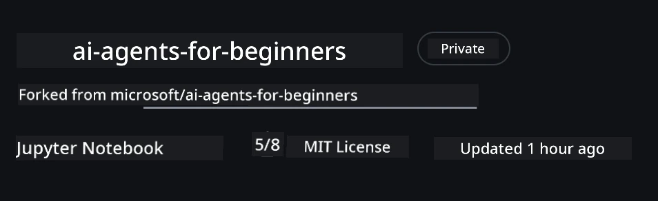

# Course Setup

## Introduction

Dis lesson go cover how to run di code samples for dis course.

## Join Other Learners and Get Help

Before you begin cloning your repo, join di [AI Agents For Beginners Discord channel](https://aka.ms/ai-agents/discord) to get any help with setup, any questions about di course, or to connect wit other learners.

## Clone or Fork this Repo

To begin, abeg clone or fork di GitHub Repository. Dis go make your own version of di course material so dat you fit run, test, and tweak di code!

You fit do dis by clicking di link to <a href="https://github.com/microsoft/ai-agents-for-beginners/fork" target="_blank">fork di repo</a>

You suppose get your own forked version of dis course for dis link below:



### Shallow Clone (recommended for workshop / Codespaces)

  >Di full repository fit big (~3 GB) when you download full history and all files dem. If na only workshop you dey attend or you just need small lesson folders, shallow clone (or sparse clone) fit avoid plenty download by truncating history and/or skipping blobs.

#### Quick shallow clone — minimal history, all files

Change `<your-username>` for di commands below with your fork URL (or di upstream URL if na so you like).

To clone only di latest commit history (small download):

```bash|powershell
git clone --depth 1 https://github.com/<your-username>/ai-agents-for-beginners.git
```

To clone specific branch:

```bash|powershell
git clone --depth 1 --branch <branch-name> https://github.com/<your-username>/ai-agents-for-beginners.git
```

#### Partial (sparse) clone — minimal blobs + only selected folders

Dis one dey use partial clone and sparse-checkout (e require Git 2.25+ and recommended make you get modern Git wey get partial clone support):

```bash|powershell
git clone --depth 1 --filter=blob:none --sparse https://github.com/<your-username>/ai-agents-for-beginners.git
```

Go enter di repo folder:

```bash|powershell
cd ai-agents-for-beginners
```

Then choose di folders wey you want (example below get two folders):

```bash|powershell
git sparse-checkout set 00-course-setup 01-intro-to-ai-agents
```

After you don clone and check di files, if na only files you need and you want free space (no git history), abeg delete di repository metadata (💀irreversible — you go lose all Git functionality: no commits, pulls, pushes, or history access).

```bash
# zsh/bash
rm -rf .git
```

```powershell
# PowerShell
Remove-Item -Recurse -Force .git
```

#### Using GitHub Codespaces (recommended to avoid local big downloads)

- Create new Codespace for dis repo via di [GitHub UI](https://github.com/codespaces).

- For di terminal of di new codespace wey you create, run one of di shallow/sparse clone commands wey dey above to carry only di lesson folders wey you need enter di Codespace workspace.
- Optional: after you clone inside Codespaces, comot .git to get extra space (see removal commands above).
- Note: if you prefer to open di repo direct for Codespaces (without extra clone), make you sabi say Codespaces go build di devcontainer environment and fit still install more pass wetin you need. Cloning shallow copy inside fresh Codespace go give you better control over disk usage.

#### Tips

- Always change di clone URL to your fork if you want edit/commit.
- If later you need more history or files, you fit fetch dem or adjust sparse-checkout to add more folders.

## Running the Code

Dis course get series of Jupyter Notebooks wey you fit run to get hands-on experience to build AI Agents.

Di code samples dey use **Microsoft Agent Framework (MAF)** wit di `AzureAIProjectAgentProvider`, wey connect to **Azure AI Agent Service V2** (di Responses API) through **Microsoft Foundry**.

All Python notebooks get label `*-python-agent-framework.ipynb`.

## Requirements

- Python 3.12+
  - **NOTE**: If you no get Python3.12 installed, make sure say you install am. Then create your venv using python3.12 to make sure say di correct versions install from di requirements.txt file.

    >Example

    Create Python venv directory:

    ```bash|powershell
    python -m venv venv
    ```

    Then activate venv environment for:

    ```bash
    # zsh/bash
    source venv/bin/activate
    ```
  
    ```dos
    # Command Prompt for Windows
    venv\Scripts\activate
    ```

- .NET 10+: For di sample codes wey use .NET, make sure say you install [.NET 10 SDK](https://dotnet.microsoft.com/download/dotnet/10.0) or later. After dat, check your installed .NET SDK version:

    ```bash|powershell
    dotnet --list-sdks
    ```

- **Azure CLI** — Required for authentication. Install from [aka.ms/installazurecli](https://aka.ms/installazurecli).
- **Azure Subscription** — For access to Microsoft Foundry and Azure AI Agent Service.
- **Microsoft Foundry Project** — Project wey get deployed model (e.g., `gpt-4o`). See [Step 1](#step-1-create-a-microsoft-foundry-project) below.

We don include `requirements.txt` file for di root of dis repository wey get all di required Python packages to run di code samples.

You fit install dem by running di command below for your terminal at di root of di repository:

```bash|powershell
pip install -r requirements.txt
```

We recommend say you create Python virtual environment to avoid conflicts and issues.

## Setup VSCode

Make sure say you dey use correct version of Python for VSCode.


## Set Up Microsoft Foundry and Azure AI Agent Service

### Step 1: Create a Microsoft Foundry Project

You need Azure AI Foundry **hub** and **project** wey get deployed model to run di notebooks.

1. Go to [ai.azure.com](https://ai.azure.com) and sign in wit your Azure account.
2. Create **hub** (or use one wey you get before). See: [Hub resources overview](https://learn.microsoft.com/azure/ai-foundry/concepts/ai-resources).
3. Inside di hub, create **project**.
4. Deploy model (e.g., `gpt-4o`) from **Models + Endpoints** → **Deploy model**.

### Step 2: Retrieve Your Project Endpoint and Model Deployment Name

From your project for Microsoft Foundry portal:

- **Project Endpoint** — Go to **Overview** page and copy di endpoint URL.


- **Model Deployment Name** — Go to **Models + Endpoints**, select your deployed model, and note di **Deployment name** (e.g., `gpt-4o`).

### Step 3: Sign in to Azure with `az login`

All notebooks dey use **`AzureCliCredential`** for authentication — no API keys to manage. Dis one require say you sign in via Azure CLI.

1. **Install Azure CLI** if you never install: [aka.ms/installazurecli](https://aka.ms/installazurecli)

2. **Sign in** by running:

    ```bash|powershell
    az login
    ```

    Or if you dey remote/Codespace environment wey no get browser:

    ```bash|powershell
    az login --use-device-code
    ```

3. **Select your subscription** if dem ask — choose di one wey get your Foundry project.

4. **Verify** say you don sign in:

    ```bash|powershell
    az account show
    ```

> **Why `az login`?** Di notebooks dey authenticate using `AzureCliCredential` from `azure-identity` package. Dat one mean say your Azure CLI session dey provide credentials — no API keys or secrets dey `.env` file. Dis na [security best practice](https://learn.microsoft.com/azure/developer/ai/keyless-connections).

### Step 4: Create Your `.env` File

Copy di example file:

```bash
# zsh/bash
cp .env.example .env
```

```powershell
# PowerShell
Copy-Item .env.example .env
```

Open `.env` and put these two values inside:

```env
AZURE_AI_PROJECT_ENDPOINT=https://<your-project>.services.ai.azure.com/api/projects/<your-project-id>
AZURE_AI_MODEL_DEPLOYMENT_NAME=gpt-4o
```

| Variable | Where to find am |
|----------|-----------------|
| `AZURE_AI_PROJECT_ENDPOINT` | Foundry portal → your project → **Overview** page |
| `AZURE_AI_MODEL_DEPLOYMENT_NAME` | Foundry portal → **Models + Endpoints** → your deployed model's name |

Na so e be for most lessons! Di notebooks go automatically authenticate through your `az login` session.

### Step 5: Install Python Dependencies

```bash|powershell
pip install -r requirements.txt
```

We recommend say you run dis inside di virtual environment wey you create before.

## Additional Setup for Lesson 5 (Agentic RAG)

Lesson 5 dey use **Azure AI Search** for retrieval-augmented generation. If you wan run dat lesson, add these variables to your `.env` file:

| Variable | Where to find am |
|----------|-----------------|
| `AZURE_SEARCH_SERVICE_ENDPOINT` | Azure portal → your **Azure AI Search** resource → **Overview** → URL |
| `AZURE_SEARCH_API_KEY` | Azure portal → your **Azure AI Search** resource → **Settings** → **Keys** → primary admin key |

## Additional Setup for Lesson 6 and Lesson 8 (GitHub Models)

Some notebooks for lessons 6 and 8 dey use **GitHub Models** instead of Azure AI Foundry. If you wan run those samples, add these variables to your `.env` file:

| Variable | Where to find am |
|----------|-----------------|
| `GITHUB_TOKEN` | GitHub → **Settings** → **Developer settings** → **Personal access tokens** |
| `GITHUB_ENDPOINT` | Use `https://models.inference.ai.azure.com` (default value) |
| `GITHUB_MODEL_ID` | Model name to use (e.g. `gpt-4o-mini`) |

## Alternative Provider: MiniMax (OpenAI-Compatible)

[MiniMax](https://platform.minimaxi.com/) dey provide large-context models (up to 204K tokens) through OpenAI-compatible API. Since Microsoft Agent Framework's `OpenAIChatClient` dey work with any OpenAI-compatible endpoint, you fit use MiniMax as drop-in alternative to GitHub Models or OpenAI.

Add these variables to your `.env` file:

| Variable | Where to find am |
|----------|-----------------|
| `MINIMAX_API_KEY` | [MiniMax Platform](https://platform.minimaxi.com/) → API Keys |
| `MINIMAX_BASE_URL` | Use `https://api.minimax.io/v1` (default value) |
| `MINIMAX_MODEL_ID` | Model name to use (e.g., `MiniMax-M2.7`) |

**Available models**: `MiniMax-M2.7` (recommended), `MiniMax-M2.7-highspeed` (faster responses)

Di code samples wey dey use `OpenAIChatClient` (like Lesson 14 hotel booking workflow) go automatically detect and use your MiniMax configuration when `MINIMAX_API_KEY` dey set.

## Additional Setup for Lesson 8 (Bing Grounding Workflow)

Di conditional workflow notebook for lesson 8 dey use **Bing grounding** via Azure AI Foundry. If you want run dat sample, add dis variable to your `.env` file:

| Variable | Where to find am |
|----------|-----------------|
| `BING_CONNECTION_ID` | Azure AI Foundry portal → your project → **Management** → **Connected resources** → your Bing connection → copy di connection ID |

## Troubleshooting

### SSL Certificate Verification Errors on macOS

If you dey macOS and you see error like:

```plaintext
ssl.SSLCertVerificationError: [SSL: CERTIFICATE_VERIFY_FAILED] certificate verify failed: self-signed certificate in certificate chain
```

Dis one na known problem wit Python for macOS wey system SSL certificates no dey trusted automatically. Try these solutions for order:

**Option 1: Run Python's Install Certificates script (recommended)**

```bash
# Replace 3.XX wit di Python version wey you don install (e.g., 3.12 or 3.13):
/Applications/Python\ 3.XX/Install\ Certificates.command
```

**Option 2: Use `connection_verify=False` in your notebook (only for GitHub Models notebooks)**

For Lesson 6 notebook (`06-building-trustworthy-agents/code_samples/06-system-message-framework.ipynb`), dem don already put commented-out workaround. Uncomment `connection_verify=False` when you dey create di client:

```python
client = ChatCompletionsClient(
    endpoint=endpoint,
    credential=AzureKeyCredential(token),
    connection_verify=False,  # Turn off SSL check if you see certificate wahala
)
```

> **⚠️ Warning:** Turning off SSL verification (`connection_verify=False`) go reduce security cause e skip certificate validation. Use dis only as temporary workaround for development environment, no use am for production.

**Option 3: Install and use `truststore`**

```bash
pip install truststore
```

Then add di followings for di top of your notebook or script before you do any network calls:

```python
import truststore
truststore.inject_into_ssl()
```

## Stuck Somewhere?

If you get any wahala to run dis setup, waka enter our <a href="https://discord.gg/kzRShWzttr" target="_blank">Azure AI Community Discord</a> or <a href="https://github.com/microsoft/ai-agents-for-beginners/issues?WT.mc_id=academic-105485-koreyst" target="_blank">create issue</a>.

## Next Lesson

You don ready to run di code for dis course. Happy to learn more about di world of AI Agents!

[Introduction to AI Agents and Agent Use Cases](../01-intro-to-ai-agents/README.md)

---

<!-- CO-OP TRANSLATOR DISCLAIMER START -->
**Disclaimer**:  
Dis document na im don translate wit AI translation service [Co-op Translator](https://github.com/Azure/co-op-translator). Even though we dey try make am correct, abeg make you sabi say automated translations fit get mistake or no too correct. Di original document wey dey im own language na di correct source. If na important information, make person wey sabi human translator do am. We no go take responsibility for any misunderstanding or wrong meaning wey fit come from this translation.
<!-- CO-OP TRANSLATOR DISCLAIMER END -->