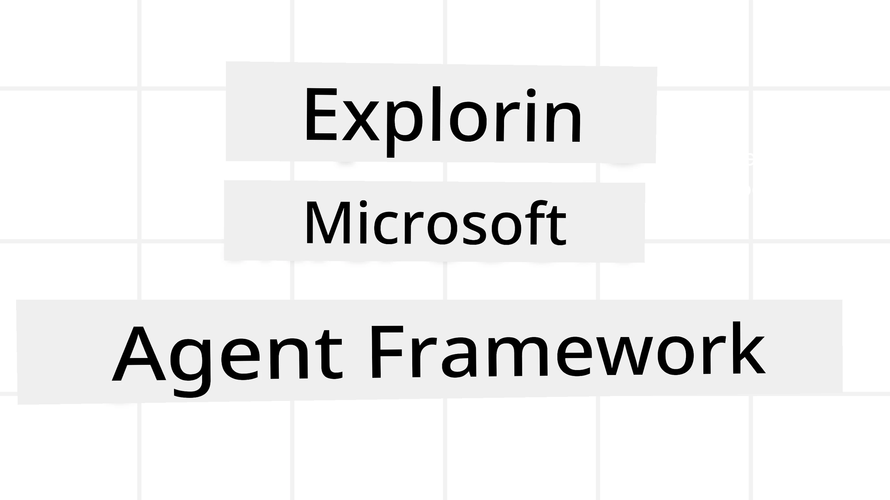
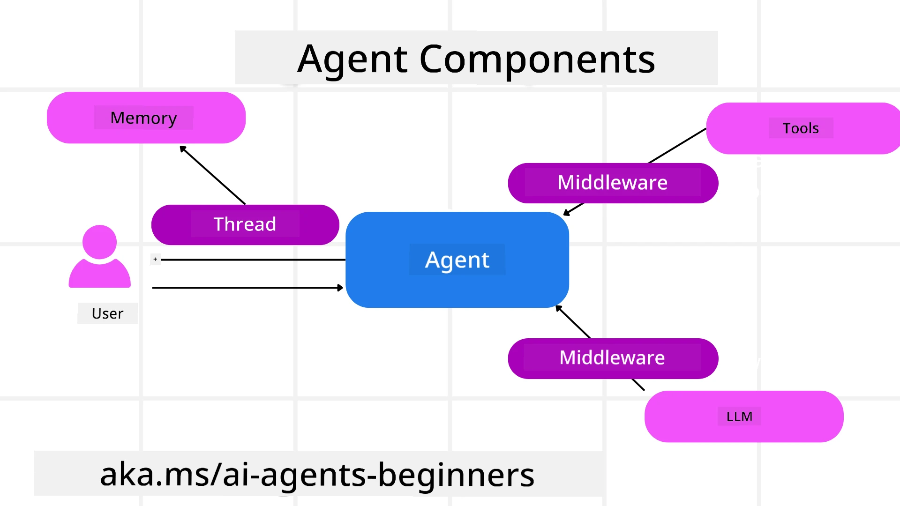

# Exploring Microsoft Agent Framework



### Introduction

Dis lesson go cover:

- Understanding Microsoft Agent Framework: Key Features and Value  
- Exploring the Key Concepts of Microsoft Agent Framework
- Advanced MAF Patterns: Workflows, Middleware, and Memory

## Learning Goals

After you don finish dis lesson, you go sabi how to:

- Build Production Ready AI Agents using Microsoft Agent Framework
- Apply the core features of Microsoft Agent Framework to your Agentic Use Cases
- Use advanced patterns including workflows, middleware, and observability

## Code Samples 

Code samples for [Microsoft Agent Framework (MAF)](https://aka.ms/ai-agents-beginners/agent-framewrok) fit be found for dis repository under `xx-python-agent-framework` and `xx-dotnet-agent-framework` files.

## Understanding Microsoft Agent Framework


[Microsoft Agent Framework (MAF)](https://aka.ms/ai-agents-beginners/agent-framewrok) na Microsoft unified framework wey dem dey use build AI agents. E dey give you flexibility to solve different kinds agentic use cases wey you go fit see for both production and research environments including:

- **Sequential Agent orchestration** for places wey you need step-by-step workflows.
- **Concurrent orchestration** for places wey agents need run tasks for the same time.
- **Group chat orchestration** for places wey agents fit collaborate for one task.
- **Handoff Orchestration** for places wey agents go hand over task to another as dem finish subtasks.
- **Magnetic Orchestration** for places wey manager agent dey create and modify task list and manage coordination of subagents to finish the task.

To deliver AI Agents for Production, MAF sef get features for:

- **Observability** through OpenTelemetry wey dey trace every action of the AI Agent including tool use, orchestration steps, reasoning flows and performance monitoring through Microsoft Foundry dashboards.
- **Security** as dem dey host agents natively on Microsoft Foundry wey get security controls like role-based access, private data handling and built-in content safety.
- **Durability** as Agent threads and workflows fit pause, resume and recover from wahala so process fit run longer.
- **Control** as human for the loop workflows dey supported where tasks dey marked as needing human approval.

Microsoft Agent Framework dey also focused on being interoperable by:

- **Being Cloud-agnostic** - Agents fit run for containers, on-premise and across different clouds.
- **Being Provider-agnostic** - Agents fit be created through your preferred SDK like Azure OpenAI and OpenAI
- **Integrating Open Standards** - Agents fit use protocols like Agent-to-Agent(A2A) and Model Context Protocol (MCP) to find and use other agents and tools.
- **Plugins and Connectors** - Connections fit join data and memory services like Microsoft Fabric, SharePoint, Pinecone and Qdrant.

Make we see how dem dey apply these features to some core concepts of Microsoft Agent Framework.

## Key Concepts of Microsoft Agent Framework

### Agents



**Creating Agents**

To create Agent, you go define the inference service (LLM Provider), put set instructions for the AI Agent to follow, plus assign `name`:

```python
agent = AzureOpenAIChatClient(credential=AzureCliCredential()).create_agent( instructions="You are good at recommending trips to customers based on their preferences.", name="TripRecommender" )
```

The one we dey see above na `Azure OpenAI` but you fit create agents using different services like `Microsoft Foundry Agent Service`:

```python
AzureAIAgentClient(async_credential=credential).create_agent( name="HelperAgent", instructions="You are a helpful assistant." ) as agent
```

OpenAI `Responses`, `ChatCompletion` APIs

```python
agent = OpenAIResponsesClient().create_agent( name="WeatherBot", instructions="You are a helpful weather assistant.", )
```

```python
agent = OpenAIChatClient().create_agent( name="HelpfulAssistant", instructions="You are a helpful assistant.", )
```

or [MiniMax](https://platform.minimaxi.com/), wey get OpenAI-compatible API wey get large context windows (up to 204K tokens):

```python
agent = OpenAIChatClient(base_url="https://api.minimax.io/v1", api_key=os.environ["MINIMAX_API_KEY"], model_id="MiniMax-M2.7").create_agent( name="HelpfulAssistant", instructions="You are a helpful assistant.", )
```

or remote agents using the A2A protocol:

```python
agent = A2AAgent( name=agent_card.name, description=agent_card.description, agent_card=agent_card, url="https://your-a2a-agent-host" )
```

**Running Agents**

You fit run Agents with `.run` or `.run_stream` method for non-streaming or streaming responses.

```python
result = await agent.run("What are good places to visit in Amsterdam?")
print(result.text)
```

```python
async for update in agent.run_stream("What are the good places to visit in Amsterdam?"):
    if update.text:
        print(update.text, end="", flush=True)

```

Each agent run fit get options to change parameters like `max_tokens` wey agent go use, `tools` wey agent fit call, and even the `model` wey agent go use.

Dis dey important if specific models or tools dey needed to complete user task.

**Tools**

Tools fit be defined both when you dey define the agent:

```python
def get_attractions( location: Annotated[str, Field(description="The location to get the top tourist attractions for")], ) -> str: """Get the top tourist attractions for a given location.""" return f"The top attractions for {location} are." 


# Wen you dey create ChatAgent direct

agent = ChatAgent( chat_client=OpenAIChatClient(), instructions="You are a helpful assistant", tools=[get_attractions]

```

and also when you dey run the agent:

```python

result1 = await agent.run( "What's the best place to visit in Seattle?", tools=[get_attractions] # Di tool na just for dis run only )
```

**Agent Threads**

Agent Threads dey used to manage multi-turn conversations. You fit create thread by:

- Using `get_new_thread()` wey go make the thread save over time
- Create thread automatically during agent run wey last only for the current run.

To create one thread, the code look like this:

```python
# Make new thread.
thread = agent.get_new_thread() # Run the agent wit di thread.
response = await agent.run("Hello, I am here to help you book travel. Where would you like to go?", thread=thread)

```

You fit serialize the thread to keep am for later use:

```python
# Make new thread.
thread = agent.get_new_thread() 

# Run the agent wit di thread.

response = await agent.run("Hello, how are you?", thread=thread) 

# Arrange di thread for keep.

serialized_thread = await thread.serialize() 

# Arrange di thread state again afta load from storage.

resumed_thread = await agent.deserialize_thread(serialized_thread)
```

**Agent Middleware**

Agents dey yok with tools and LLMs to complete user task. Sometimes we want execute or track things inside these interactions. Agent middleware dey help do that by:

*Function Middleware*

Dis middleware dey allow us run action inside between the agent and function/tool wey e go call. For example, you fit want do some logging on the function call.

For the code below, `next` na wetin tell whether to call the next middleware or the actual function.

```python
async def logging_function_middleware(
    context: FunctionInvocationContext,
    next: Callable[[FunctionInvocationContext], Awaitable[None]],
) -> None:
    """Function middleware that logs function execution."""
    # Pre-processing: Log before function execution
    print(f"[Function] Calling {context.function.name}")

    # Continue to next middleware or function execution
    await next(context)

    # Post-processing: Log after function execution
    print(f"[Function] {context.function.name} completed")
```

*Chat Middleware*

Dis middleware allow us run or log action between agent and the requests between the LLM.

E get important info like the `messages` wey dem dey send to the AI service.

```python
async def logging_chat_middleware(
    context: ChatContext,
    next: Callable[[ChatContext], Awaitable[None]],
) -> None:
    """Chat middleware that logs AI interactions."""
    # Pre-processing: Make log before you call AI
    print(f"[Chat] Sending {len(context.messages)} messages to AI")

    # Continue go next middleware or AI service
    await next(context)

    # Post-processing: Make log after AI don respond
    print("[Chat] AI response received")

```

**Agent Memory**

As we talk for `Agentic Memory` lesson, memory na important part to make agent fit work with different contexts. MAF get different kinds memories:

*In-Memory Storage*

Na memory wey dey store for threads during app running time.

```python
# Make beta thread.
thread = agent.get_new_thread() # Run the agent wit the thread.
response = await agent.run("Hello, I am here to help you book travel. Where would you like to go?", thread=thread)
```

*Persistent Messages*

Dis memory dey use to store conversation history across different sessions. E dey defined wit `chat_message_store_factory`:

```python
from agent_framework import ChatMessageStore

# Make custom message store
def create_message_store():
    return ChatMessageStore()

agent = ChatAgent(
    chat_client=OpenAIChatClient(),
    instructions="You are a Travel assistant.",
    chat_message_store_factory=create_message_store
)

```

*Dynamic Memory*

Dis memory dey add to context before agents run. Dem fit store this memory for external services like mem0:

```python
from agent_framework.mem0 import Mem0Provider

# Di use of Mem0 na for advanced memory wahala
memory_provider = Mem0Provider(
    api_key="your-mem0-api-key",
    user_id="user_123",
    application_id="my_app"
)

agent = ChatAgent(
    chat_client=OpenAIChatClient(),
    instructions="You are a helpful assistant with memory.",
    context_providers=memory_provider
)

```

**Agent Observability**

Observability important to build reliable and maintainable agentic systems. MAF join with OpenTelemetry to provide tracing and meters for better observability.

```python
from agent_framework.observability import get_tracer, get_meter

tracer = get_tracer()
meter = get_meter()
with tracer.start_as_current_span("my_custom_span"):
    # make sometin
    pass
counter = meter.create_counter("my_custom_counter")
counter.add(1, {"key": "value"})
```

### Workflows

MAF get workflows wey na pre-defined steps to finish task and dem include AI agents as components for those steps.

Workflows get different components wey dey give better control flow. Workflows also dey support **multi-agent orchestration** and **checkpointing** to save workflow states.

The core components of workflow be:

**Executors**

Executors dey receive input messages, do their assigned tasks, then produce output message. Dis one dey push workflow go front to finish the bigger task. Executors fit be AI agent or custom logic.

**Edges**

Edges dey used to define how messages flow inside workflow. These ones fit be:

*Direct Edges* - Simple one-to-one connection between executors:

```python
from agent_framework import WorkflowBuilder

builder = WorkflowBuilder()
builder.add_edge(source_executor, target_executor)
builder.set_start_executor(source_executor)
workflow = builder.build()
```

*Conditional Edges* - E dey activate after one particular condition happen. For example, if hotel rooms no dey available, executor fit suggest other options.

*Switch-case Edges* - E dey route messages go different executors based on defined conditions. For example, if travel customer get priority access their tasks fit run through another workflow.

*Fan-out Edges* - Dem send one message to many targets.

*Fan-in Edges* - Dem gather many messages from different executors and send to one target.

**Events**

To make observability better for workflows, MAF get in-built events for execution including:

- `WorkflowStartedEvent`  - Workflow run start
- `WorkflowOutputEvent` - Workflow give output
- `WorkflowErrorEvent` - Workflow get wahala
- `ExecutorInvokeEvent`  - Executor start work
- `ExecutorCompleteEvent`  -  Executor finish work
- `RequestInfoEvent` - Request don issue

## Advanced MAF Patterns

The parts wey pass don explain the key concepts of Microsoft Agent Framework. As you dey build more complex agents, here na some advanced patterns wey you fit consider:

- **Middleware Composition**: Chain many middleware handlers (logging, auth, rate-limiting) using function and chat middleware to get fine-grained control over how agent dey behave.
- **Workflow Checkpointing**: Use workflow events and serialization to save and continue long-running agent processes.
- **Dynamic Tool Selection**: Combine RAG on top tool descriptions with MAF's tool registration to show only relevant tools per query.
- **Multi-Agent Handoff**: Use workflow edges and conditional routing to organize handoffs between specialized agents.

## Code Samples 

Code samples for Microsoft Agent Framework fit be found for dis repository under `xx-python-agent-framework` and `xx-dotnet-agent-framework` files.

## Got More Questions About Microsoft Agent Framework?

Join the [Microsoft Foundry Discord](https://aka.ms/ai-agents/discord) to link up with other learners, attend office hours and ask your AI Agents questions.

---

<!-- CO-OP TRANSLATOR DISCLAIMER START -->
**Disclaimer**:  
Dis document don translate wit AI translation service [Co-op Translator](https://github.com/Azure/co-op-translator). Even though we dey try make am correct, abeg sabi say automated translations fit get some errors or wrong waka. Di original document for dia original language na di correct one. For important mata, na professional human translation dem suppose use. We no gree take any blame if person no understand or misinterpret tins because of dis translation.
<!-- CO-OP TRANSLATOR DISCLAIMER END -->