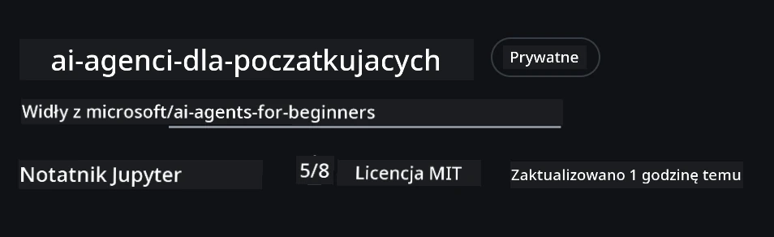

# Konfiguracja kursu

## Wprowadzenie

Ta lekcja pokaże, jak uruchomić przykłady kodu z tego kursu.

## Dołącz do innych uczniów i uzyskaj pomoc

Zanim zaczniesz klonować swoje repozytorium, dołącz do [kanału Discord AI Agents For Beginners](https://aka.ms/ai-agents/discord), aby uzyskać pomoc przy konfiguracji, zadać pytania dotyczące kursu lub połączyć się z innymi uczącymi się.

## Sklonuj lub rozgałęź to repozytorium

Na początek proszę sklonować lub rozgałęzić repozytorium GitHub. Spowoduje to utworzenie własnej wersji materiałów kursu, aby móc uruchamiać, testować i modyfikować kod!

Można to zrobić, klikając link do <a href="https://github.com/microsoft/ai-agents-for-beginners/fork" target="_blank">rozgałęzienia repozytorium</a>

Teraz powinieneś mieć swoje własne rozgałęzione repozytorium tego kursu pod następującym linkiem:



### Płytkie klonowanie (zalecane dla warsztatów / Codespaces)

  >Pełne repozytorium może być duże (~3 GB), jeśli pobierasz pełną historię i wszystkie pliki. Jeśli uczestniczysz tylko w warsztacie lub potrzebujesz tylko kilku folderów z lekcjami, płytkie klonowanie (lub rzadkie klonowanie) pozwala uniknąć większości pobierania, skracając historię i/lub pomijając obiekty.

#### Szybkie płytkie klonowanie — minimalna historia, wszystkie pliki

Zamień `<your-username>` w poniższych poleceniach na URL twojego forka (lub adres upstream, jeśli wolisz).

Aby sklonować tylko najnowszą historię commitów (małe pobieranie):

```bash|powershell
git clone --depth 1 https://github.com/<your-username>/ai-agents-for-beginners.git
```

Aby sklonować konkretną gałąź:

```bash|powershell
git clone --depth 1 --branch <branch-name> https://github.com/<your-username>/ai-agents-for-beginners.git
```

#### Częściowe (rzadkie) klonowanie — minimalne obiekty + tylko wybrane foldery

To używa częściowego klonowania i sparse-checkout (wymaga Git 2.25+ oraz zalecany nowoczesny Git z obsługą częściowego klonowania):

```bash|powershell
git clone --depth 1 --filter=blob:none --sparse https://github.com/<your-username>/ai-agents-for-beginners.git
```

Przejdź do folderu repozytorium:

```bash|powershell
cd ai-agents-for-beginners
```

Następnie określ, które foldery chcesz (przykład poniżej pokazuje dwa foldery):

```bash|powershell
git sparse-checkout set 00-course-setup 01-intro-to-ai-agents
```

Po sklonowaniu i zweryfikowaniu plików, jeśli potrzebujesz tylko plików i chcesz zwolnić miejsce (bez historii git), usuń metadane repozytorium (💀 nieodwracalne — stracisz całą funkcjonalność Git: brak commitów, pulli, pushów ani dostępu do historii).

```bash
# zsh/bash
rm -rf .git
```

```powershell
# PowerShell
Remove-Item -Recurse -Force .git
```

#### Korzystanie z GitHub Codespaces (zalecane, aby uniknąć dużych pobrań lokalnych)

- Utwórz nowy Codespace dla tego repozytorium poprzez [GitHub UI](https://github.com/codespaces).  

- W terminalu świeżo utworzonego Codespace uruchom jedno z poleceń płytkiego/rzadkiego klonowania powyżej, aby wprowadzić tylko potrzebne foldery z lekcjami do przestrzeni roboczej Codespace.
- Opcjonalnie: po sklonowaniu w Codespaces usuń .git, aby odzyskać miejsce (patrz polecenia usunięcia powyżej).
- Uwaga: jeśli wolisz otworzyć repozytorium bezpośrednio w Codespaces (bez dodatkowego klonowania), miej na uwadze, że Codespaces zbuduje środowisko devcontainer i może dalej dostarczyć więcej niż potrzebujesz. Klonowanie płytkiej kopii wewnątrz świeżego Codespace daje większą kontrolę nad użyciem dysku.

#### Wskazówki

- Zawsze zastępuj URL klonowania swoim fork, jeśli chcesz edytować/commitować.
- Jeśli później potrzebujesz więcej historii lub plików, możesz je pobrać lub dostosować sparse-checkout, by dołączyć dodatkowe foldery.

## Uruchamianie kodu

Ten kurs oferuje serię Notebooków Jupyter, które możesz uruchomić, aby zdobyć praktyczne doświadczenie w budowaniu Agentów AI.

Przykłady kodu korzystają z **Microsoft Agent Framework (MAF)** z dostawcą `AzureAIProjectAgentProvider`, który łączy się z **Azure AI Agent Service V2** (API Odpowiedzi) przez **Microsoft Foundry**.

Wszystkie notatniki Pythona są oznaczone `*-python-agent-framework.ipynb`.

## Wymagania

- Python 3.12+
  - **UWAGA**: Jeśli nie masz zainstalowanego Pythona 3.12, upewnij się, że go zainstalujesz. Następnie utwórz swoje środowisko wirtualne używając python3.12, aby zapewnić instalację odpowiednich wersji z pliku requirements.txt.
  
    >Przykład

    Utwórz katalog środowiska Python venv:

    ```bash|powershell
    python -m venv venv
    ```

    Następnie aktywuj środowisko venv dla:

    ```bash
    # zsh/bash
    source venv/bin/activate
    ```
  
    ```dos
    # Command Prompt for Windows
    venv\Scripts\activate
    ```

- .NET 10+: Dla przykładów w .NET, upewnij się, że masz zainstalowane [.NET 10 SDK](https://dotnet.microsoft.com/download/dotnet/10.0) lub nowsze. Sprawdź wersję zainstalowanego SDK:

    ```bash|powershell
    dotnet --list-sdks
    ```

- **Azure CLI** — Wymagane do uwierzytelniania. Zainstaluj z [aka.ms/installazurecli](https://aka.ms/installazurecli).
- **Subskrypcja Azure** — Dostęp do Microsoft Foundry i Azure AI Agent Service.
- **Projekt Microsoft Foundry** — Projekt z wdrożonym modelem (np. `gpt-4o`). Zobacz [Krok 1](#krok-1-utwórz-projekt-microsoft-foundry) poniżej.

W katalogu głównym tego repozytorium znajduje się plik `requirements.txt` zawierający wszystkie wymagane pakiety Pythona do uruchomienia przykładów kodu.

Możesz je zainstalować, uruchamiając następujące polecenie w terminalu w katalogu głównym repozytorium:

```bash|powershell
pip install -r requirements.txt
```

Zalecamy utworzenie środowiska wirtualnego Pythona, aby uniknąć konfliktów i problemów.

## Konfiguracja VSCode

Upewnij się, że używasz odpowiedniej wersji Pythona w VSCode.


## Konfiguracja Microsoft Foundry i Azure AI Agent Service

### Krok 1: Utwórz projekt Microsoft Foundry

Do uruchomienia notatników potrzebujesz huba i projektu Azure AI Foundry z wdrożonym modelem.

1. Przejdź na [ai.azure.com](https://ai.azure.com) i zaloguj się na konto Azure.
2. Utwórz **hub** (lub użyj istniejącego). Zobacz: [Przegląd zasobów huba](https://learn.microsoft.com/azure/ai-foundry/concepts/ai-resources).
3. W hubie utwórz **projekt**.
4. Wdróż model (np. `gpt-4o`) z **Models + Endpoints** → **Deploy model**.

### Krok 2: Pobierz endpoint projektu i nazwę wdrożenia modelu

Z Twojego projektu w portalu Microsoft Foundry:

- **Endpoint projektu** — Przejdź do strony **Overview** i skopiuj URL endpointu.


- **Nazwa wdrożenia modelu** — Przejdź do **Models + Endpoints**, wybierz wdrżony model i zanotuj **Deployment name** (np. `gpt-4o`).

### Krok 3: Zaloguj się do Azure za pomocą `az login`

Wszystkie notatniki używają **`AzureCliCredential`** do uwierzytelniania — nie ma potrzeby zarządzania kluczami API. Wymaga to zalogowania przez CLI Azure.

1. **Zainstaluj Azure CLI**, jeśli jeszcze tego nie zrobiłeś: [aka.ms/installazurecli](https://aka.ms/installazurecli)

2. **Zaloguj się** poleceniem:

    ```bash|powershell
    az login
    ```

    Lub jeśli jesteś w środowisku zdalnym/Codespace bez przeglądarki:

    ```bash|powershell
    az login --use-device-code
    ```

3. **Wybierz subskrypcję** jeśli zostaniesz o to poproszony — wybierz tę, która zawiera projekt Foundry.

4. **Zweryfikuj** stan logowania:

    ```bash|powershell
    az account show
    ```

> **Dlaczego `az login`?** Notatniki uwierzytelniają się za pomocą `AzureCliCredential` z pakietu `azure-identity`. Oznacza to, że sesja Azure CLI dostarcza uprawnienia — brak kluczy API ani sekretów w pliku `.env`. To [najlepsza praktyka bezpieczeństwa](https://learn.microsoft.com/azure/developer/ai/keyless-connections).

### Krok 4: Utwórz swój plik `.env`

Skopiuj plik przykładowy:

```bash
# zsh/bash
cp .env.example .env
```

```powershell
# PowerShell
Copy-Item .env.example .env
```

Otwórz `.env` i wypełnij te dwie wartości:

```env
AZURE_AI_PROJECT_ENDPOINT=https://<your-project>.services.ai.azure.com/api/projects/<your-project-id>
AZURE_AI_MODEL_DEPLOYMENT_NAME=gpt-4o
```

| Zmienna | Gdzie znaleźć |
|----------|-----------------|
| `AZURE_AI_PROJECT_ENDPOINT` | Portal Foundry → twój projekt → strona **Overview** |
| `AZURE_AI_MODEL_DEPLOYMENT_NAME` | Portal Foundry → **Models + Endpoints** → nazwa twojego wdrżonego modelu |

To wszystko dla większości lekcji! Notatniki będą się automatycznie uwierzytelniać za pośrednictwem sesji `az login`.

### Krok 5: Zainstaluj zależności Pythona

```bash|powershell
pip install -r requirements.txt
```

Zalecamy uruchamianie tego w środowisku wirtualnym, które utworzyłeś wcześniej.

## Dodatkowa konfiguracja dla Lekcji 5 (Agentic RAG)

Lekcja 5 używa **Azure AI Search** do generowania wspomaganego wyszukiwaniem. Jeśli planujesz uruchomić tę lekcję, dodaj te zmienne do pliku `.env`:

| Zmienna | Gdzie znaleźć |
|----------|-----------------|
| `AZURE_SEARCH_SERVICE_ENDPOINT` | Portal Azure → twój zasób **Azure AI Search** → **Overview** → URL |
| `AZURE_SEARCH_API_KEY` | Portal Azure → twój zasób **Azure AI Search** → **Settings** → **Keys** → klucz administratora główny |

## Dodatkowa konfiguracja dla Lekcji 6 i Lekcji 8 (Modele GitHub)

Niektóre notatniki z lekcji 6 i 8 korzystają z **GitHub Models** zamiast Azure AI Foundry. Jeśli planujesz uruchomić te przykłady, dodaj te zmienne do swojego pliku `.env`:

| Zmienna | Gdzie znaleźć |
|----------|-----------------|
| `GITHUB_TOKEN` | GitHub → **Settings** → **Developer settings** → **Personal access tokens** |
| `GITHUB_ENDPOINT` | Użyj `https://models.inference.ai.azure.com` (wartość domyślna) |
| `GITHUB_MODEL_ID` | Nazwa modelu do użycia (np. `gpt-4o-mini`) |

## Alternatywny dostawca: MiniMax (zgodny z OpenAI)

[MiniMax](https://platform.minimaxi.com/) dostarcza modele z dużym kontekstem (do 204K tokenów) przez API kompatybilne z OpenAI. Ponieważ `OpenAIChatClient` w Microsoft Agent Framework działa z dowolnym endpointem zgodnym z OpenAI, możesz użyć MiniMax jako zamiennik dla modeli GitHub lub OpenAI.

Dodaj te zmienne do swojego pliku `.env`:

| Zmienna | Gdzie znaleźć |
|----------|-----------------|
| `MINIMAX_API_KEY` | [Platforma MiniMax](https://platform.minimaxi.com/) → klucze API |
| `MINIMAX_BASE_URL` | Użyj `https://api.minimax.io/v1` (wartość domyślna) |
| `MINIMAX_MODEL_ID` | Nazwa modelu do użycia (np. `MiniMax-M2.7`) |

**Dostępne modele**: `MiniMax-M2.7` (zalecany), `MiniMax-M2.7-highspeed` (szybsze odpowiedzi)

Przykłady kodu, które używają `OpenAIChatClient` (np. przepływ rezerwacji hotelu z Lekcji 14), automatycznie wykryją i użyją konfiguracji MiniMax, gdy `MINIMAX_API_KEY` jest ustawiony.

## Dodatkowa konfiguracja dla Lekcji 8 (Przepływ oparty na Bing)

Notatnik z warunkowym przepływem w lekcji 8 korzysta z **Bing grounding** przez Azure AI Foundry. Jeśli planujesz uruchomić ten przykład, dodaj tę zmienną do pliku `.env`:

| Zmienna | Gdzie znaleźć |
|----------|-----------------|
| `BING_CONNECTION_ID` | Portal Azure AI Foundry → twój projekt → **Management** → **Connected resources** → twoje połączenie Bing → skopiuj ID połączenia |

## Rozwiązywanie problemów

### Błędy weryfikacji certyfikatu SSL na macOS

Jeśli jesteś na macOS i pojawia się błąd taki jak:

```plaintext
ssl.SSLCertVerificationError: [SSL: CERTIFICATE_VERIFY_FAILED] certificate verify failed: self-signed certificate in certificate chain
```

To znany problem Pythona na macOS, gdzie systemowe certyfikaty SSL nie są automatycznie zaufane. Wypróbuj następujące rozwiązania w kolejności:

**Opcja 1: Uruchom skrypt Install Certificates Pythona (zalecane)**

```bash
# Zamień 3.XX na zainstalowaną wersję Pythona (np. 3.12 lub 3.13):
/Applications/Python\ 3.XX/Install\ Certificates.command
```

**Opcja 2: Użyj `connection_verify=False` w swoim notatniku (tylko dla notatników GitHub Models)**

W notatniku Lekcji 6 (`06-building-trustworthy-agents/code_samples/06-system-message-framework.ipynb`) jest już zakomentowany obejście. Odkomentuj `connection_verify=False` podczas tworzenia klienta:

```python
client = ChatCompletionsClient(
    endpoint=endpoint,
    credential=AzureKeyCredential(token),
    connection_verify=False,  # Wyłącz weryfikację SSL, jeśli napotkasz błędy certyfikatu
)
```

> **⚠️ Ostrzeżenie:** Wyłączenie weryfikacji SSL (`connection_verify=False`) zmniejsza bezpieczeństwo, pomijając walidację certyfikatu. Używaj tego tylko tymczasowo w środowiskach deweloperskich, nigdy produkcyjnych.

**Opcja 3: Zainstaluj i użyj `truststore`**

```bash
pip install truststore
```

Następnie dodaj to na początku notatnika lub skryptu przed wykonywaniem połączeń sieciowych:

```python
import truststore
truststore.inject_into_ssl()
```

## Utknąłeś gdzieś?

Jeśli masz problemy z uruchomieniem tej konfiguracji, dołącz do naszego <a href="https://discord.gg/kzRShWzttr" target="_blank">Discord Azure AI Community</a> lub <a href="https://github.com/microsoft/ai-agents-for-beginners/issues?WT.mc_id=academic-105485-koreyst" target="_blank">zgłoś problem</a>.

## Następna lekcja

Jesteś już gotowy do uruchamiania kodu z tego kursu. Życzymy powodzenia w dalszej nauce świata Agentów AI!

[Wprowadzenie do Agentów AI i przypadków ich użycia](../01-intro-to-ai-agents/README.md)

---

<!-- CO-OP TRANSLATOR DISCLAIMER START -->
**Zastrzeżenie**:  
Niniejszy dokument został przetłumaczony przy użyciu usługi tłumaczenia AI [Co-op Translator](https://github.com/Azure/co-op-translator). Chociaż dążymy do dokładności, prosimy pamiętać, że automatyczne tłumaczenia mogą zawierać błędy lub niedokładności. Oryginalny dokument w języku źródłowym powinien być uznawany za wiarygodne źródło. W przypadku informacji krytycznych zaleca się skorzystanie z profesjonalnego tłumaczenia wykonanej przez człowieka. Nie ponosimy odpowiedzialności za jakiekolwiek nieporozumienia lub błędne interpretacje wynikające z korzystania z tego tłumaczenia.
<!-- CO-OP TRANSLATOR DISCLAIMER END -->