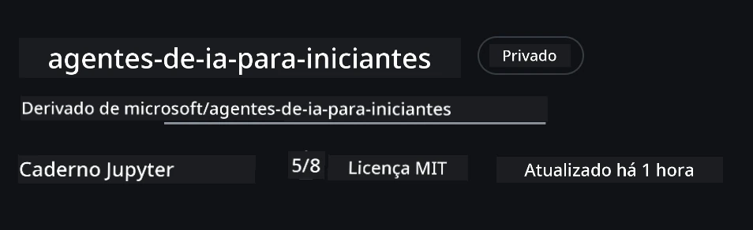
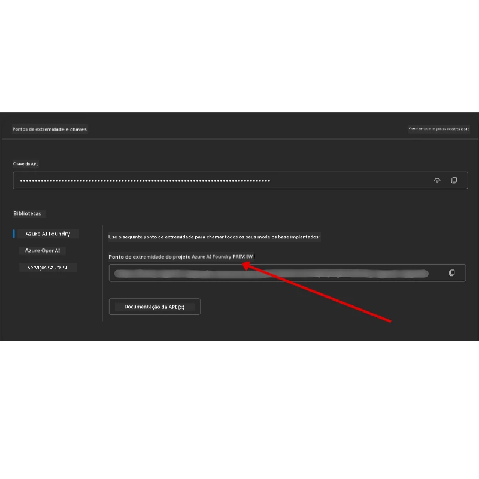

# Configuração do Curso

## Introdução

Esta lição abordará como executar os exemplos de código deste curso.

## Junte-se a Outros Estudantes e Obtenha Ajuda

Antes de começar a clonar seu repositório, entre no [canal Discord AI Agents For Beginners](https://aka.ms/ai-agents/discord) para obter qualquer ajuda com a configuração, tirar dúvidas sobre o curso ou conectar-se com outros estudantes.

## Clonar ou Fazer Fork deste Repositório

Para começar, por favor clone ou faça um fork do Repositório GitHub. Isso criará sua própria versão do material do curso para que você possa executar, testar e ajustar o código!

Isso pode ser feito clicando no link para <a href="https://github.com/microsoft/ai-agents-for-beginners/fork" target="_blank">fazer fork do repositório</a>

Você deverá ter agora sua própria versão forkada deste curso no seguinte link:



### Clone Raso (recomendado para workshop / Codespaces)

  >O repositório completo pode ser grande (~3 GB) quando você baixa o histórico completo e todos os arquivos. Se você só vai participar do workshop ou precisa apenas de algumas pastas das lições, um clone raso (ou clone esparso) evita a maior parte do download ao truncar o histórico e/ou pular blobs.

#### Clone raso rápido — histórico minimalista, todos os arquivos

Substitua `<your-username>` nos comandos abaixo pelo URL do seu fork (ou o URL original se preferir).

Para clonar apenas o histórico do último commit (download pequeno):

```bash|powershell
git clone --depth 1 https://github.com/<your-username>/ai-agents-for-beginners.git
```

Para clonar um branch específico:

```bash|powershell
git clone --depth 1 --branch <branch-name> https://github.com/<your-username>/ai-agents-for-beginners.git
```

#### Clone parcial (esparso) — blobs mínimos + apenas pastas selecionadas

Isso usa clone parcial e sparse-checkout (requer Git 2.25+ e é recomendado Git moderno com suporte a clone parcial):

```bash|powershell
git clone --depth 1 --filter=blob:none --sparse https://github.com/<your-username>/ai-agents-for-beginners.git
```

Entre na pasta do repositório:

```bash|powershell
cd ai-agents-for-beginners
```

Então especifique quais pastas você deseja (exemplo abaixo mostra duas pastas):

```bash|powershell
git sparse-checkout set 00-course-setup 01-intro-to-ai-agents
```

Após clonar e verificar os arquivos, se você só precisa dos arquivos e quer liberar espaço (sem histórico git), por favor delete os metadados do repositório (💀 irreversível — você perderá toda funcionalidade Git: sem commits, pulls, pushes ou acesso ao histórico).

```bash
# zsh/bash
rm -rf .git
```

```powershell
# PowerShell
Remove-Item -Recurse -Force .git
```

#### Usando GitHub Codespaces (recomendado para evitar grandes downloads locais)

- Crie um novo Codespace para este repositório via a [interface do GitHub](https://github.com/codespaces).

- No terminal do codespace recém-criado, execute um dos comandos de clone raso/esparso acima para trazer apenas as pastas das lições que você precisa para o espaço de trabalho do Codespace.
- Opcional: após clonar dentro do Codespaces, remova a pasta .git para recuperar espaço extra (veja comandos de remoção acima).
- Nota: se preferir abrir o repositório diretamente no Codespaces (sem um clone extra), tenha em mente que o Codespaces irá construir o ambiente devcontainer e pode ainda provisionar mais do que você precisa. Clonar uma cópia rasa dentro de um Codespace novo te dá mais controle sobre o uso do disco.

#### Dicas

- Sempre substitua o URL do clone pelo seu fork se quiser editar/commitar.
- Se depois precisar de mais histórico ou arquivos, pode buscá-los ou ajustar o sparse-checkout para incluir pastas adicionais.

## Executando o Código

Este curso oferece uma série de Jupyter Notebooks que você pode executar para obter experiência prática construindo Agentes de IA.

Os exemplos de código usam **Microsoft Agent Framework (MAF)** com o `AzureAIProjectAgentProvider`, que conecta ao **Azure AI Agent Service V2** (a API de Respostas) através do **Microsoft Foundry**.

Todos os notebooks Python são rotulados como `*-python-agent-framework.ipynb`.

## Requisitos

- Python 3.12+
  - **NOTA**: Se você não tem Python3.12 instalado, certifique-se de instalá-lo. Então crie seu ambiente virtual usando python3.12 para garantir que as versões corretas sejam instaladas a partir do arquivo requirements.txt.
  
    >Exemplo

    Crie o diretório do ambiente virtual Python:

    ```bash|powershell
    python -m venv venv
    ```

    Então ative o ambiente virtual para:

    ```bash
    # zsh/bash
    source venv/bin/activate
    ```
  
    ```dos
    # Command Prompt for Windows
    venv\Scripts\activate
    ```

- .NET 10+: Para os exemplos de código que usam .NET, certifique-se de instalar o [.NET 10 SDK](https://dotnet.microsoft.com/download/dotnet/10.0) ou superior. Depois, verifique a versão do SDK .NET instalado:

    ```bash|powershell
    dotnet --list-sdks
    ```

- **Azure CLI** — Necessária para autenticação. Instale a partir de [aka.ms/installazurecli](https://aka.ms/installazurecli).
- **Assinatura Azure** — Para acesso ao Microsoft Foundry e Azure AI Agent Service.
- **Projeto Microsoft Foundry** — Um projeto com modelo implantado (ex: `gpt-4o`). Veja [Passo 1](#passo-1-criar-um-projeto-microsoft-foundry) abaixo.

Incluímos um arquivo `requirements.txt` na raiz deste repositório contendo todos os pacotes Python necessários para executar os exemplos de código.

Você pode instalá-los executando o seguinte comando no terminal na raiz do repositório:

```bash|powershell
pip install -r requirements.txt
```

Recomendamos criar um ambiente virtual Python para evitar conflitos e problemas.

## Configurar VSCode

Certifique-se de que está usando a versão certa do Python no VSCode.


## Configurar Microsoft Foundry e Azure AI Agent Service

### Passo 1: Criar um Projeto Microsoft Foundry

Você precisa de um **hub** e um **projeto** no Azure AI Foundry com um modelo implantado para executar os notebooks.

1. Vá para [ai.azure.com](https://ai.azure.com) e faça login com sua conta Azure.
2. Crie um **hub** (ou use um existente). Veja: [Visão geral dos recursos Hub](https://learn.microsoft.com/azure/ai-foundry/concepts/ai-resources).
3. Dentro do hub, crie um **projeto**.
4. Implemente um modelo (ex: `gpt-4o`) em **Models + Endpoints** → **Deploy model**.

### Passo 2: Recupere o Endpoint do Projeto e o Nome de Implantação do Modelo

No portal do Microsoft Foundry para o seu projeto:

- **Endpoint do Projeto** — Vá para a página **Overview** e copie o URL do endpoint.



- **Nome da Implantação do Modelo** — Vá para **Models + Endpoints**, selecione seu modelo implantado e anote o **Deployment name** (ex: `gpt-4o`).

### Passo 3: Faça login no Azure com `az login`

Todos os notebooks usam **`AzureCliCredential`** para autenticação — não há chaves API para gerenciar. Isso requer que você esteja logado via Azure CLI.

1. **Instale o Azure CLI** se ainda não fez: [aka.ms/installazurecli](https://aka.ms/installazurecli)

2. **Faça login** executando:

    ```bash|powershell
    az login
    ```

    Ou se estiver em ambiente remoto/Codespace sem navegador:

    ```bash|powershell
    az login --use-device-code
    ```

3. **Selecione sua assinatura** se solicitado — escolha aquela que contém seu projeto Foundry.

4. **Verifique** o login:

    ```bash|powershell
    az account show
    ```

> **Por que `az login`?** Os notebooks autenticam usando `AzureCliCredential` do pacote `azure-identity`. Isso significa que sua sessão Azure CLI fornece as credenciais — sem chaves API ou segredos no seu arquivo `.env`. Esta é uma [boa prática de segurança](https://learn.microsoft.com/azure/developer/ai/keyless-connections).

### Passo 4: Crie seu arquivo `.env`

Copie o arquivo de exemplo:

```bash
# zsh/bash
cp .env.example .env
```

```powershell
# PowerShell
Copy-Item .env.example .env
```

Abra `.env` e preencha estes dois valores:

```env
AZURE_AI_PROJECT_ENDPOINT=https://<your-project>.services.ai.azure.com/api/projects/<your-project-id>
AZURE_AI_MODEL_DEPLOYMENT_NAME=gpt-4o
```

| Variável | Onde encontrar |
|----------|-----------------|
| `AZURE_AI_PROJECT_ENDPOINT` | Portal Foundry → seu projeto → página **Overview** |
| `AZURE_AI_MODEL_DEPLOYMENT_NAME` | Portal Foundry → **Models + Endpoints** → nome da implantação do seu modelo |

É isso para a maior parte das lições! Os notebooks irão autenticar automaticamente pela sessão de `az login`.

### Passo 5: Instale as Dependências Python

```bash|powershell
pip install -r requirements.txt
```

Recomendamos executar isso dentro do ambiente virtual que você criou antes.

## Configuração adicional para a Lição 5 (Agentic RAG)

A Lição 5 usa **Azure AI Search** para geração aumentada por recuperação. Se planeja executar essa lição, adicione estas variáveis ao seu arquivo `.env`:

| Variável | Onde encontrar |
|----------|-----------------|
| `AZURE_SEARCH_SERVICE_ENDPOINT` | Portal Azure → seu recurso **Azure AI Search** → **Overview** → URL |
| `AZURE_SEARCH_API_KEY` | Portal Azure → seu recurso **Azure AI Search** → **Settings** → **Keys** → chave administrativa primária |

## Configuração adicional para as Lições 6 e 8 (Modelos GitHub)

Alguns notebooks das lições 6 e 8 usam **Modelos GitHub** em vez do Azure AI Foundry. Se planeja executar esses exemplos, adicione estas variáveis ao seu arquivo `.env`:

| Variável | Onde encontrar |
|----------|-----------------|
| `GITHUB_TOKEN` | GitHub → **Settings** → **Developer settings** → **Personal access tokens** |
| `GITHUB_ENDPOINT` | Use `https://models.inference.ai.azure.com` (valor padrão) |
| `GITHUB_MODEL_ID` | Nome do modelo a usar (ex: `gpt-4o-mini`) |

## Provedor Alternativo: MiniMax (Compatível OpenAI)

[MiniMax](https://platform.minimaxi.com/) fornece modelos de contexto amplo (até 204 mil tokens) por meio de uma API compatível com OpenAI. Como o `OpenAIChatClient` do Microsoft Agent Framework funciona com qualquer endpoint compatível OpenAI, você pode usar o MiniMax como alternativa “drop-in” aos Modelos GitHub ou OpenAI.

Adicione estas variáveis ao seu arquivo `.env`:

| Variável | Onde encontrar |
|----------|-----------------|
| `MINIMAX_API_KEY` | [Plataforma MiniMax](https://platform.minimaxi.com/) → API Keys |
| `MINIMAX_BASE_URL` | Use `https://api.minimax.io/v1` (valor padrão) |
| `MINIMAX_MODEL_ID` | Nome do modelo a usar (ex: `MiniMax-M2.7`) |

**Modelos disponíveis**: `MiniMax-M2.7` (recomendado), `MiniMax-M2.7-highspeed` (respostas mais rápidas)

Os exemplos de código que usam `OpenAIChatClient` (ex: fluxo de reserva de hotel na Lição 14) detectarão e usarão automaticamente sua configuração MiniMax quando `MINIMAX_API_KEY` estiver definido.

## Configuração adicional para a Lição 8 (Fluxo Bing Grounding)

O notebook de fluxo condicional na lição 8 usa **Bing grounding** via Azure AI Foundry. Se planeja executar esse exemplo, adicione esta variável ao seu arquivo `.env`:

| Variável | Onde encontrar |
|----------|-----------------|
| `BING_CONNECTION_ID` | Portal Azure AI Foundry → seu projeto → **Management** → **Connected resources** → sua conexão Bing → copie o ID da conexão |

## Solução de Problemas

### Erros de Verificação de Certificado SSL no macOS

Se você estiver no macOS e encontrar um erro como:

```plaintext
ssl.SSLCertVerificationError: [SSL: CERTIFICATE_VERIFY_FAILED] certificate verify failed: self-signed certificate in certificate chain
```

Este é um problema conhecido com Python no macOS onde os certificados SSL do sistema não são confiados automaticamente. Tente as soluções a seguir na ordem:

**Opção 1: Execute o script Install Certificates do Python (recomendado)**

```bash
# Substitua 3.XX pela versão do Python instalada (por exemplo, 3.12 ou 3.13):
/Applications/Python\ 3.XX/Install\ Certificates.command
```

**Opção 2: Use `connection_verify=False` em seu notebook (somente para notebooks Modelos GitHub)**

No notebook da Lição 6 (`06-building-trustworthy-agents/code_samples/06-system-message-framework.ipynb`), uma solução alternativa comentada já está incluída. Descomente `connection_verify=False` ao criar o cliente:

```python
client = ChatCompletionsClient(
    endpoint=endpoint,
    credential=AzureKeyCredential(token),
    connection_verify=False,  # Desative a verificação SSL se você encontrar erros de certificado
)
```

> **⚠️ Aviso:** Desabilitar a verificação SSL (`connection_verify=False`) reduz a segurança ao pular a validação dos certificados. Use isso só como solução temporária em ambientes de desenvolvimento, nunca em produção.

**Opção 3: Instale e use `truststore`**

```bash
pip install truststore
```

Então adicione o seguinte no topo do seu notebook ou script antes de fazer chamadas de rede:

```python
import truststore
truststore.inject_into_ssl()
```

## Preso em Algum Lugar?

Se você tiver problemas para executar esta configuração, entre no nosso <a href="https://discord.gg/kzRShWzttr" target="_blank">Discord da Comunidade Azure AI</a> ou <a href="https://github.com/microsoft/ai-agents-for-beginners/issues?WT.mc_id=academic-105485-koreyst" target="_blank">crie uma issue</a>.

## Próxima Lição

Você já está pronto para executar o código deste curso. Aproveite para aprender mais sobre o mundo dos Agentes de IA!

[Introdução aos Agentes de IA e Casos de Uso de Agentes](../01-intro-to-ai-agents/README.md)

---

<!-- CO-OP TRANSLATOR DISCLAIMER START -->
**Aviso Legal**:  
Este documento foi traduzido usando o serviço de tradução por IA [Co-op Translator](https://github.com/Azure/co-op-translator). Embora nos esforcemos para garantir a precisão, esteja ciente de que traduções automáticas podem conter erros ou imprecisões. O documento original em seu idioma nativo deve ser considerado a fonte autorizada. Para informações críticas, recomenda-se tradução profissional realizada por seres humanos. Não nos responsabilizamos por quaisquer mal-entendidos ou interpretações incorretas decorrentes do uso desta tradução.
<!-- CO-OP TRANSLATOR DISCLAIMER END -->