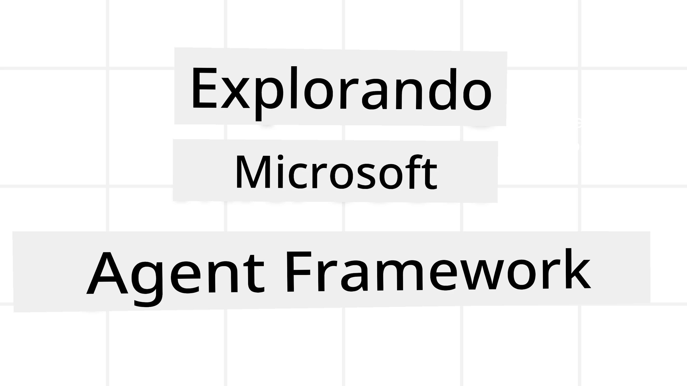
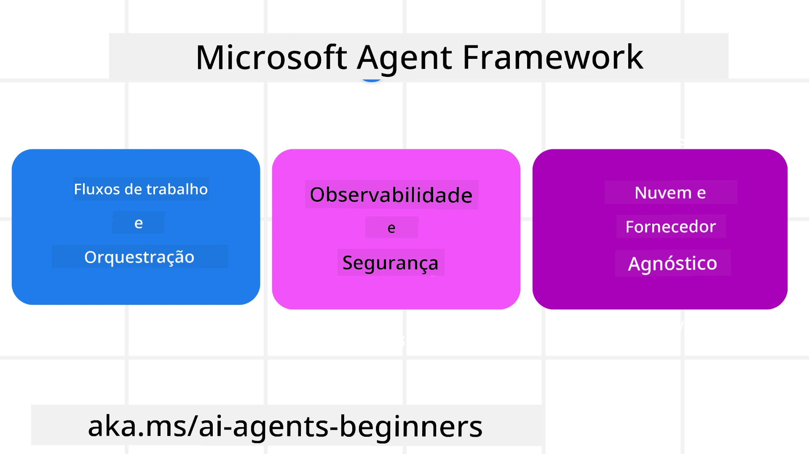

# Explorando o Microsoft Agent Framework



### Introdução

Esta lição abordará:

- Entendendo o Microsoft Agent Framework: Principais Recursos e Valor  
- Explorando os Conceitos Principais do Microsoft Agent Framework
- Padrões Avançados do MAF: Workflows, Middleware e Memória

## Objetivos de Aprendizagem

Após concluir esta lição, você saberá como:

- Construir Agentes de IA Prontos para Produção usando o Microsoft Agent Framework
- Aplicar os recursos essenciais do Microsoft Agent Framework aos seus Casos de Uso Agênticos
- Usar padrões avançados incluindo workflows, middleware e observabilidade

## Exemplos de Código

Exemplos de código para [Microsoft Agent Framework (MAF)](https://aka.ms/ai-agents-beginners/agent-framewrok) podem ser encontrados neste repositório nos arquivos `xx-python-agent-framework` e `xx-dotnet-agent-framework`.

## Entendendo o Microsoft Agent Framework



[Microsoft Agent Framework (MAF)](https://aka.ms/ai-agents-beginners/agent-framewrok) é o framework unificado da Microsoft para construir agentes de IA. Ele oferece a flexibilidade para abranger a grande variedade de casos de uso agênticos vistos tanto em ambientes de produção quanto em pesquisa, incluindo:

- **Orquestração Sequencial de Agentes** em cenários onde são necessários workflows passo a passo.
- **Orquestração Concorrente** em cenários onde agentes precisam completar tarefas ao mesmo tempo.
- **Orquestração em Grupo de Chat** em cenários onde agentes podem colaborar juntos em uma tarefa.
- **Orquestração de Repasse** em cenários onde agentes repassam a tarefa uns para os outros à medida que as subtarefas são concluídas.
- **Orquestração Magnética** em cenários onde um agente gestor cria e modifica uma lista de tarefas e gerencia a coordenação dos subagentes para completar a tarefa.

Para entregar Agentes de IA em Produção, o MAF também inclui recursos para:

- **Observabilidade** por meio do uso do OpenTelemetry onde cada ação do Agente de IA, incluindo invocação de ferramentas, passos de orquestração, fluxos de raciocínio e monitoramento de desempenho através dos painéis do Microsoft Foundry.
- **Segurança** hospedando agentes nativamente no Microsoft Foundry, que inclui controles de segurança como acesso baseado em função, manuseio de dados privados e segurança de conteúdo integrada.
- **Durabilidade** pois threads e workflows de agentes podem pausar, retomar e recuperar de erros, o que permite processos de longa duração.
- **Controle** pois workflows com intervenção humana são suportados onde as tarefas são marcadas como requerendo aprovação humana.

O Microsoft Agent Framework também é focado em ser interoperável por:

- **Ser neutro em relação à Nuvem** - Agentes podem rodar em containers, on-premise e através de múltiplas nuvens diferentes.
- **Ser neutro em relação ao Provedor** - Agentes podem ser criados através do seu SDK preferido, incluindo Azure OpenAI e OpenAI.
- **Integrar Padrões Abertos** - Agentes podem utilizar protocolos como Agent-to-Agent (A2A) e Model Context Protocol (MCP) para descobrir e usar outros agentes e ferramentas.
- **Plugins e Conectores** - Conexões podem ser feitas a serviços de dados e memória como Microsoft Fabric, SharePoint, Pinecone e Qdrant.

Vamos ver como esses recursos são aplicados a alguns dos conceitos fundamentais do Microsoft Agent Framework.

## Conceitos Principais do Microsoft Agent Framework

### Agentes


**Criando Agentes**

A criação de agentes é feita definindo o serviço de inferência (Provedor LLM), um conjunto de instruções para o Agente de IA seguir, e um `nome` atribuído:

```python
agent = AzureOpenAIChatClient(credential=AzureCliCredential()).create_agent( instructions="You are good at recommending trips to customers based on their preferences.", name="TripRecommender" )
```

O exemplo acima usa `Azure OpenAI`, mas agentes podem ser criados usando uma variedade de serviços incluindo `Microsoft Foundry Agent Service`:

```python
AzureAIAgentClient(async_credential=credential).create_agent( name="HelperAgent", instructions="You are a helpful assistant." ) as agent
```

APIs OpenAI `Responses`, `ChatCompletion`

```python
agent = OpenAIResponsesClient().create_agent( name="WeatherBot", instructions="You are a helpful weather assistant.", )
```

```python
agent = OpenAIChatClient().create_agent( name="HelpfulAssistant", instructions="You are a helpful assistant.", )
```

ou [MiniMax](https://platform.minimaxi.com/), que fornece uma API compatível com OpenAI com janelas de contexto grandes (até 204K tokens):

```python
agent = OpenAIChatClient(base_url="https://api.minimax.io/v1", api_key=os.environ["MINIMAX_API_KEY"], model_id="MiniMax-M2.7").create_agent( name="HelpfulAssistant", instructions="You are a helpful assistant.", )
```

ou agentes remotos usando o protocolo A2A:

```python
agent = A2AAgent( name=agent_card.name, description=agent_card.description, agent_card=agent_card, url="https://your-a2a-agent-host" )
```

**Executando Agentes**

Agentes são executados usando os métodos `.run` ou `.run_stream` para respostas não transmitidas ou transmitidas, respectivamente.

```python
result = await agent.run("What are good places to visit in Amsterdam?")
print(result.text)
```

```python
async for update in agent.run_stream("What are the good places to visit in Amsterdam?"):
    if update.text:
        print(update.text, end="", flush=True)

```

Cada execução do agente também pode ter opções para personalizar parâmetros como `max_tokens` usados pelo agente, `tools` que o agente pode chamar, e até mesmo o próprio `model` usado para o agente.

Isso é útil em casos onde modelos ou ferramentas específicas são requisitadas para completar a tarefa do usuário.

**Ferramentas**

Ferramentas podem ser definidas tanto ao definir o agente:

```python
def get_attractions( location: Annotated[str, Field(description="The location to get the top tourist attractions for")], ) -> str: """Get the top tourist attractions for a given location.""" return f"The top attractions for {location} are." 


# Ao criar um ChatAgent diretamente

agent = ChatAgent( chat_client=OpenAIChatClient(), instructions="You are a helpful assistant", tools=[get_attractions]

```

quanto ao executar o agente:

```python

result1 = await agent.run( "What's the best place to visit in Seattle?", tools=[get_attractions] # Ferramenta fornecida apenas para esta execução )
```

**Threads de Agentes**

Threads de agentes são usadas para gerenciar conversas de múltiplas interações. Threads podem ser criadas seja:

- Usando `get_new_thread()` que permite que a thread seja salva ao longo do tempo
- Criando uma thread automaticamente ao executar um agente, tendo a thread durar apenas durante a execução atual.

Para criar uma thread, o código fica assim:

```python
# Crie uma nova thread.
thread = agent.get_new_thread() # Execute o agente com a thread.
response = await agent.run("Hello, I am here to help you book travel. Where would you like to go?", thread=thread)

```

Você pode então serializar a thread para armazená-la para uso posterior:

```python
# Crie uma nova thread.
thread = agent.get_new_thread() 

# Execute o agente com a thread.

response = await agent.run("Hello, how are you?", thread=thread) 

# Serialize a thread para armazenamento.

serialized_thread = await thread.serialize() 

# Desserialize o estado da thread após o carregamento do armazenamento.

resumed_thread = await agent.deserialize_thread(serialized_thread)
```

**Middleware de Agentes**

Agentes interagem com ferramentas e LLMs para completar as tarefas do usuário. Em certos cenários, queremos executar ou registrar ações entre essas interações. O middleware de agentes nos permite isso através de:

*Middleware de Função*

Esse middleware nos permite executar uma ação entre o agente e uma função/ferramenta que ele estará chamando. Um exemplo de uso é quando você quer fazer algum registro (logging) da chamada da função.

No código abaixo, `next` define se o próximo middleware ou a função real deve ser chamada.

```python
async def logging_function_middleware(
    context: FunctionInvocationContext,
    next: Callable[[FunctionInvocationContext], Awaitable[None]],
) -> None:
    """Function middleware that logs function execution."""
    # Pré-processamento: Registrar antes da execução da função
    print(f"[Function] Calling {context.function.name}")

    # Continuar para o próximo middleware ou execução da função
    await next(context)

    # Pós-processamento: Registrar após a execução da função
    print(f"[Function] {context.function.name} completed")
```

*Middleware de Chat*

Esse middleware nos permite executar ou registrar uma ação entre o agente e as requisições feitas ao LLM.

Isso contém informações importantes como as `messages` que estão sendo enviadas ao serviço de IA.

```python
async def logging_chat_middleware(
    context: ChatContext,
    next: Callable[[ChatContext], Awaitable[None]],
) -> None:
    """Chat middleware that logs AI interactions."""
    # Pré-processamento: Registrar antes da chamada da IA
    print(f"[Chat] Sending {len(context.messages)} messages to AI")

    # Continuar para o próximo middleware ou serviço de IA
    await next(context)

    # Pós-processamento: Registrar após a resposta da IA
    print("[Chat] AI response received")

```

**Memória de Agentes**

Como visto na lição `Agentic Memory`, a memória é um elemento importante para permitir que o agente opere sobre diferentes contextos. O MAF oferece vários tipos de memórias:

*Armazenamento em Memória*

Esta é a memória armazenada nas threads durante o tempo de execução da aplicação.

```python
# Crie uma nova thread.
thread = agent.get_new_thread() # Execute o agente com a thread.
response = await agent.run("Hello, I am here to help you book travel. Where would you like to go?", thread=thread)
```

*Mensagens Persistentes*

Esta memória é usada para armazenar o histórico de conversas entre diferentes sessões. Ela é definida usando o `chat_message_store_factory`:

```python
from agent_framework import ChatMessageStore

# Criar um armazenamento de mensagens personalizado
def create_message_store():
    return ChatMessageStore()

agent = ChatAgent(
    chat_client=OpenAIChatClient(),
    instructions="You are a Travel assistant.",
    chat_message_store_factory=create_message_store
)

```

*Memória Dinâmica*

Esta memória é adicionada ao contexto antes dos agentes serem executados. Essas memórias podem ser armazenadas em serviços externos como mem0:

```python
from agent_framework.mem0 import Mem0Provider

# Usando Mem0 para capacidades avançadas de memória
memory_provider = Mem0Provider(
    api_key="your-mem0-api-key",
    user_id="user_123",
    application_id="my_app"
)

agent = ChatAgent(
    chat_client=OpenAIChatClient(),
    instructions="You are a helpful assistant with memory.",
    context_providers=memory_provider
)

```

**Observabilidade de Agentes**

Observabilidade é importante para construir sistemas agênticos confiáveis e mantíveis. O MAF integra-se ao OpenTelemetry para fornecer tracing e medidores para maior observabilidade.

```python
from agent_framework.observability import get_tracer, get_meter

tracer = get_tracer()
meter = get_meter()
with tracer.start_as_current_span("my_custom_span"):
    # faça algo
    pass
counter = meter.create_counter("my_custom_counter")
counter.add(1, {"key": "value"})
```

### Workflows

MAF oferece workflows que são passos pré-definidos para completar uma tarefa e incluem agentes de IA como componentes desses passos.

Workflows são compostos por diferentes componentes que permitem um melhor fluxo de controle. Workflows também habilitam **orquestração multiagente** e **checkpointing** para salvar estados do workflow.

Os componentes principais de um workflow são:

**Executores**

Executores recebem mensagens de entrada, realizam suas tarefas atribuídas e produzem uma mensagem de saída. Isso move o workflow adiante em direção à conclusão da tarefa maior. Executores podem ser um agente de IA ou lógica customizada.

**Edges (Conexões)**

Edges são usados para definir o fluxo de mensagens em um workflow. Eles podem ser:

*Edges Diretas* - Conexões simples um-para-um entre executores:

```python
from agent_framework import WorkflowBuilder

builder = WorkflowBuilder()
builder.add_edge(source_executor, target_executor)
builder.set_start_executor(source_executor)
workflow = builder.build()
```

*Edges Condicionais* - Ativadas após certa condição ser cumprida. Por exemplo, quando quartos de hotel não estão disponíveis, um executor pode sugerir outras opções.

*Edges switch-case* - Roteiam mensagens a diferentes executores com base em condições definidas. Por exemplo, se um cliente de viagem tem acesso prioritário e suas tarefas serão tratadas por outro workflow.

*Edges Fan-out* - Enviam uma mensagem a múltiplos destinos.

*Edges Fan-in* - Coletam múltiplas mensagens de diferentes executores e enviam para um destino.

**Eventos**

Para fornecer melhor observabilidade dos workflows, o MAF oferece eventos integrados para execução incluindo:

- `WorkflowStartedEvent`  - O workflow começa a ser executado
- `WorkflowOutputEvent` - O workflow produz uma saída
- `WorkflowErrorEvent` - Ocorre um erro durante o workflow
- `ExecutorInvokeEvent`  - Executor começa o processamento
- `ExecutorCompleteEvent`  - Executor termina o processamento
- `RequestInfoEvent` - Uma requisição é enviada

## Padrões Avançados do MAF

As seções acima cobrem os conceitos chave do Microsoft Agent Framework. À medida que você constrói agentes mais complexos, aqui estão alguns padrões avançados para considerar:

- **Composição de Middleware**: Encadear múltiplos handlers de middleware (logging, autenticação, limite de taxa) usando middleware de função e chat para controle refinado sobre o comportamento do agente.
- **Checkpointing de Workflow**: Usar eventos de workflow e serialização para salvar e retomar processos de agentes de longa duração.
- **Seleção Dinâmica de Ferramentas**: Combinar RAG sobre descrições de ferramentas com o registro de ferramentas do MAF para apresentar apenas ferramentas relevantes por consulta.
- **Repasse Multiagente**: Usar edges de workflow e roteamento condicional para orquestrar repasses entre agentes especializados.

## Exemplos de Código

Exemplos de código para Microsoft Agent Framework podem ser encontrados neste repositório nos arquivos `xx-python-agent-framework` e `xx-dotnet-agent-framework`.

## Tem Mais Perguntas Sobre Microsoft Agent Framework?

Junte-se ao [Microsoft Foundry Discord](https://aka.ms/ai-agents/discord) para encontrar outros aprendizes, participar de office hours e tirar suas dúvidas sobre Agentes de IA.

---

<!-- CO-OP TRANSLATOR DISCLAIMER START -->
**Aviso Legal**:  
Este documento foi traduzido utilizando o serviço de tradução por IA [Co-op Translator](https://github.com/Azure/co-op-translator). Embora nos esforcemos pela precisão, por favor, esteja ciente de que traduções automáticas podem conter erros ou imprecisões. O documento original em seu idioma nativo deve ser considerado a fonte autoritária. Para informações críticas, recomenda-se a tradução profissional humana. Não nos responsabilizamos por quaisquer mal-entendidos ou interpretações errôneas decorrentes do uso desta tradução.
<!-- CO-OP TRANSLATOR DISCLAIMER END -->