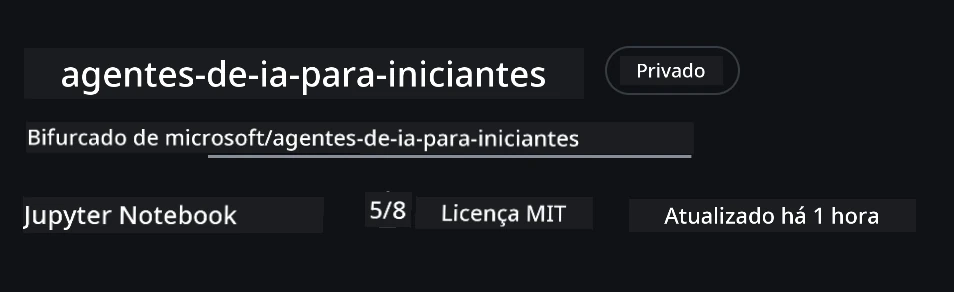

# Configuração do Curso

## Introdução

Esta aula abordará como executar os exemplos de código deste curso.

## Junte-se a Outros Estudantes e Obtenha Ajuda

Antes de começar a clonar o seu repositório, junte-se ao [canal Discord AI Agents For Beginners](https://aka.ms/ai-agents/discord) para obter ajuda com a configuração, esclarecer dúvidas sobre o curso ou para se conectar com outros aprendizes.

## Clone ou Faça Fork deste Repositório

Para começar, por favor clone ou faça fork do Repositório GitHub. Isto criará a sua própria versão do material do curso para que possa executar, testar e ajustar o código!

Isto pode ser feito clicando no link para <a href="https://github.com/microsoft/ai-agents-for-beginners/fork" target="_blank">fazer fork do repositório</a>

Agora deverá ter a sua própria versão forkada deste curso no seguinte link:



### Clone Superficial (recomendado para workshop / Codespaces)

> O repositório completo pode ser grande (~3 GB) quando descarrega todo o histórico e todos os ficheiros. Se vai apenas participar no workshop ou precisa só de algumas pastas das lições, um clone superficial (ou um clone esparso) evita a maior parte desse download ao truncar o histórico e/ou pular blobs.

#### Clone rápido superficial — histórico mínimo, todos os ficheiros

Substitua `<your-username>` nos comandos abaixo pelo URL do seu fork (ou pelo URL upstream se preferir).

Para clonar apenas o histórico do último commit (download pequeno):

```bash|powershell
git clone --depth 1 https://github.com/<your-username>/ai-agents-for-beginners.git
```

Para clonar um ramo específico:

```bash|powershell
git clone --depth 1 --branch <branch-name> https://github.com/<your-username>/ai-agents-for-beginners.git
```

#### Clone parcial (esparso) — blobs mínimos + apenas pastas selecionadas

Isto usa clone parcial e sparse-checkout (requer Git 2.25+ e é recomendado usar uma versão moderna do Git com suporte a clone parcial):

```bash|powershell
git clone --depth 1 --filter=blob:none --sparse https://github.com/<your-username>/ai-agents-for-beginners.git
```

Aceda à pasta do repositório:

```bash|powershell
cd ai-agents-for-beginners
```

Depois especifique as pastas que deseja (exemplo abaixo mostra duas pastas):

```bash|powershell
git sparse-checkout set 00-course-setup 01-intro-to-ai-agents
```

Após clonar e verificar os ficheiros, se precisar apenas dos ficheiros e quiser libertar espaço (sem histórico git), por favor elimine os metadados do repositório (💀 irreversível — perderá toda a funcionalidade Git: sem commits, pulls, pushes ou acesso ao histórico).

```bash
# zsh/bash
rm -rf .git
```

```powershell
# PowerShell
Remove-Item -Recurse -Force .git
```

#### Usando GitHub Codespaces (recomendado para evitar downloads locais grandes)

- Crie um novo Codespace para este repositório através da [interface do GitHub](https://github.com/codespaces).  

- No terminal do codespace recém-criado, execute um dos comandos de clone superficial/esparso acima para trazer apenas as pastas das lições que precisa para o espaço de trabalho do Codespace.
- Opcional: após clonar dentro do Codespaces, remova a pasta .git para recuperar espaço extra (veja os comandos de remoção acima).
- Nota: Se preferir abrir o repositório diretamente em Codespaces (sem um clone extra), esteja ciente que o Codespaces construirá o ambiente devcontainer e poderá ainda assim provisionar mais do que necessita. Clonar uma cópia superficial dentro de um Codespace novo dá-lhe mais controlo sobre o uso do disco.

#### Dicas

- Substitua sempre o URL do clone pelo do seu fork se quiser editar/fazer commit.
- Se depois precisar de mais histórico ou ficheiros, pode buscá-los ou ajustar o sparse-checkout para incluir pastas adicionais.

## Execução do Código

Este curso oferece uma série de Jupyter Notebooks que pode executar para obter experiência prática a construir Agentes de IA.

Os exemplos de código usam o **Microsoft Agent Framework (MAF)** com o `AzureAIProjectAgentProvider`, que se conecta ao **Azure AI Agent Service V2** (a API de Respostas) através do **Microsoft Foundry**.

Todos os notebooks Python estão etiquetados como `*-python-agent-framework.ipynb`.

## Requisitos

- Python 3.12+
  - **NOTA**: Se não tiver o Python3.12 instalado, certifique-se de instalá-lo. Depois crie o seu venv usando python3.12 para garantir que as versões corretas são instaladas a partir do ficheiro requirements.txt.
  
    >Exemplo

    Criar diretório ambiente Python venv:

    ```bash|powershell
    python -m venv venv
    ```

    Depois ative o ambiente venv para:

    ```bash
    # zsh/bash
    source venv/bin/activate
    ```
  
    ```dos
    # Command Prompt for Windows
    venv\Scripts\activate
    ```

- .NET 10+: Para os códigos exemplo que usam .NET, certifique-se de instalar o [.NET 10 SDK](https://dotnet.microsoft.com/download/dotnet/10.0) ou posterior. Depois, verifique a versão do SDK .NET instalado:

    ```bash|powershell
    dotnet --list-sdks
    ```

- **Azure CLI** — Necessário para autenticação. Instale a partir de [aka.ms/installazurecli](https://aka.ms/installazurecli).
- **Subscrição Azure** — Para acesso ao Microsoft Foundry e Azure AI Agent Service.
- **Projeto Microsoft Foundry** — Um projeto com um modelo implementado (ex., `gpt-4o`). Veja [Passo 1](#passo-1-criar-um-projeto-microsoft-foundry) abaixo.

Incluímos um ficheiro `requirements.txt` na raiz deste repositório que contém todos os pacotes Python necessários para executar os exemplos de código.

Pode instalá-los executando o seguinte comando no seu terminal na raiz do repositório:

```bash|powershell
pip install -r requirements.txt
```

Recomendamos criar um ambiente virtual Python para evitar conflitos e problemas.

## Configuração do VSCode

Certifique-se de que está a usar a versão correta do Python no VSCode.


## Configurar Microsoft Foundry e Azure AI Agent Service

### Passo 1: Criar um Projeto Microsoft Foundry

Vai precisar de um **hub** e **projeto** Azure AI Foundry com um modelo implementado para executar os notebooks.

1. Vá a [ai.azure.com](https://ai.azure.com) e inicie sessão com a sua conta Azure.
2. Crie um **hub** (ou use um existente). Consulte: [Visão geral dos recursos Hub](https://learn.microsoft.com/azure/ai-foundry/concepts/ai-resources).
3. Dentro do hub, crie um **projeto**.
4. Implemente um modelo (ex., `gpt-4o`) a partir de **Models + Endpoints** → **Deploy model**.

### Passo 2: Obter o Endpoint do Projeto e o Nome do Deployment do Modelo

No seu projeto no portal Microsoft Foundry:

- **Endpoint do Projeto** — Vá à página **Overview** e copie o URL do endpoint.


- **Nome do Deployment do Modelo** — Vá a **Models + Endpoints**, selecione o modelo implementado e anote o **Deployment name** (ex., `gpt-4o`).

### Passo 3: Inicie sessão no Azure com `az login`

Todos os notebooks usam **`AzureCliCredential`** para autenticação — não há chaves de API para gerir. Isso requer que esteja autenticado via Azure CLI.

1. **Instale a Azure CLI** se ainda não o fez: [aka.ms/installazurecli](https://aka.ms/installazurecli)

2. **Inicie sessão** executando:

    ```bash|powershell
    az login
    ```

    Ou se estiver num ambiente remoto/Codespace sem navegador:

    ```bash|powershell
    az login --use-device-code
    ```

3. **Selecione a sua subscrição** se solicitado — escolha aquela que contém o seu projeto Foundry.

4. **Verifique** que está autenticado:

    ```bash|powershell
    az account show
    ```

> **Porquê `az login`?** Os notebooks autenticam usando `AzureCliCredential` do pacote `azure-identity`. Isto significa que a sua sessão Azure CLI fornece as credenciais — sem chaves API ou segredos no seu ficheiro `.env`. Esta é uma [boa prática de segurança](https://learn.microsoft.com/azure/developer/ai/keyless-connections).

### Passo 4: Crie o seu ficheiro `.env`

Copie o ficheiro de exemplo:

```bash
# zsh/bash
cp .env.example .env
```

```powershell
# PowerShell
Copy-Item .env.example .env
```

Abra `.env` e preencha estes dois valores:

```env
AZURE_AI_PROJECT_ENDPOINT=https://<your-project>.services.ai.azure.com/api/projects/<your-project-id>
AZURE_AI_MODEL_DEPLOYMENT_NAME=gpt-4o
```

| Variável | Onde encontrar |
|----------|-----------------|
| `AZURE_AI_PROJECT_ENDPOINT` | Portal Foundry → seu projeto → página **Overview** |
| `AZURE_AI_MODEL_DEPLOYMENT_NAME` | Portal Foundry → **Models + Endpoints** → nome do modelo implementado |

É tudo para a maioria das lições! Os notebooks irão autenticar automaticamente através da sua sessão `az login`.

### Passo 5: Instalar Dependências Python

```bash|powershell
pip install -r requirements.txt
```

Recomendamos executar isto dentro do ambiente virtual que criou anteriormente.

## Configuração Adicional para a Lição 5 (Agentic RAG)

A Lição 5 usa **Azure AI Search** para geração aumentada por recuperação. Se pretende executar essa lição, adicione estas variáveis ao seu ficheiro `.env`:

| Variável | Onde encontrar |
|----------|-----------------|
| `AZURE_SEARCH_SERVICE_ENDPOINT` | Portal Azure → seu recurso **Azure AI Search** → **Overview** → URL |
| `AZURE_SEARCH_API_KEY` | Portal Azure → seu recurso **Azure AI Search** → **Settings** → **Keys** → chave administrativa primária |

## Configuração Adicional para as Lições 6 e 8 (Modelos GitHub)

Alguns notebooks das lições 6 e 8 usam **Modelos GitHub** em vez de Azure AI Foundry. Se pretende executar esses exemplos, adicione estas variáveis ao seu ficheiro `.env`:

| Variável | Onde encontrar |
|----------|-----------------|
| `GITHUB_TOKEN` | GitHub → **Settings** → **Developer settings** → **Personal access tokens** |
| `GITHUB_ENDPOINT` | Use `https://models.inference.ai.azure.com` (valor por defeito) |
| `GITHUB_MODEL_ID` | Nome do modelo a usar (ex.: `gpt-4o-mini`) |

## Provedor Alternativo: MiniMax (Compatível OpenAI)

[MiniMax](https://platform.minimaxi.com/) fornece modelos de contexto extenso (até 204K tokens) através de uma API compatível com OpenAI. Como o `OpenAIChatClient` do Microsoft Agent Framework funciona com qualquer endpoint compatível OpenAI, pode usar o MiniMax como alternativa direta aos Modelos GitHub ou OpenAI.

Adicione estas variáveis ao seu ficheiro `.env`:

| Variável | Onde encontrar |
|----------|-----------------|
| `MINIMAX_API_KEY` | [Plataforma MiniMax](https://platform.minimaxi.com/) → Chaves API |
| `MINIMAX_BASE_URL` | Use `https://api.minimax.io/v1` (valor por defeito) |
| `MINIMAX_MODEL_ID` | Nome do modelo a usar (ex., `MiniMax-M2.7`) |

**Modelos disponíveis**: `MiniMax-M2.7` (recomendado), `MiniMax-M2.7-highspeed` (respostas mais rápidas)

Os exemplos de código que usam `OpenAIChatClient` (ex., o workflow de reserva de hotel da Lição 14) detetam automaticamente e usam a sua configuração MiniMax quando `MINIMAX_API_KEY` está definido.

## Configuração Adicional para a Lição 8 (Workflow Bing Grounding)

O notebook de workflow condicional na lição 8 usa **Bing grounding** via Azure AI Foundry. Se pretende executar esse exemplo, adicione esta variável ao seu ficheiro `.env`:

| Variável | Onde encontrar |
|----------|-----------------|
| `BING_CONNECTION_ID` | Portal Azure AI Foundry → seu projeto → **Management** → **Connected resources** → sua ligação Bing → copie o ID da ligação |

## Resolução de Problemas

### Erros de Verificação de Certificado SSL no macOS

Se estiver a usar macOS e encontrar um erro como:

```plaintext
ssl.SSLCertVerificationError: [SSL: CERTIFICATE_VERIFY_FAILED] certificate verify failed: self-signed certificate in certificate chain
```

Este é um problema conhecido com Python no macOS onde os certificados SSL do sistema não são automaticamente confiáveis. Tente as seguintes soluções pela ordem:

**Opção 1: Execute o script Install Certificates do Python (recomendado)**

```bash
# Substitua 3.XX pela versão do Python que tem instalada (por exemplo, 3.12 ou 3.13):
/Applications/Python\ 3.XX/Install\ Certificates.command
```

**Opção 2: Use `connection_verify=False` no seu notebook (apenas para notebooks Modelos GitHub)**

No notebook da Lição 6 (`06-building-trustworthy-agents/code_samples/06-system-message-framework.ipynb`), já está incluída uma solução alternativa comentada. Descomente `connection_verify=False` ao criar o cliente:

```python
client = ChatCompletionsClient(
    endpoint=endpoint,
    credential=AzureKeyCredential(token),
    connection_verify=False,  # Desativar a verificação SSL se encontrar erros de certificado
)
```

> **⚠️ Aviso:** Desativar a verificação SSL (`connection_verify=False`) reduz a segurança ao pular a validação dos certificados. Use isto apenas como solução temporária em ambientes de desenvolvimento, nunca em produção.

**Opção 3: Instale e use o `truststore`**

```bash
pip install truststore
```

Depois adicione o seguinte no topo do seu notebook ou script antes de fazer chamadas a rede:

```python
import truststore
truststore.inject_into_ssl()
```

## Preso em Algum Lugar?

Se encontrar dificuldades a executar esta configuração, entre no nosso <a href="https://discord.gg/kzRShWzttr" target="_blank">Azure AI Community Discord</a> ou <a href="https://github.com/microsoft/ai-agents-for-beginners/issues?WT.mc_id=academic-105485-koreyst" target="_blank">crie uma issue</a>.

## Próxima Aula

Está agora pronto para executar o código deste curso. Boa aprendizagem no mundo dos Agentes de IA! 

[Introdução a Agentes de IA e Casos de Uso de Agentes](../01-intro-to-ai-agents/README.md)

---

<!-- CO-OP TRANSLATOR DISCLAIMER START -->
**Aviso Legal**:  
Este documento foi traduzido utilizando o serviço de tradução por IA [Co-op Translator](https://github.com/Azure/co-op-translator). Embora nos esforcemos pela precisão, tenha em conta que traduções automáticas podem conter erros ou imprecisões. O documento original na sua língua nativa deve ser considerado a fonte oficial. Para informação crítica, recomenda-se tradução profissional humana. Não nos responsabilizamos por quaisquer mal-entendidos ou interpretações erradas decorrentes da utilização desta tradução.
<!-- CO-OP TRANSLATOR DISCLAIMER END -->