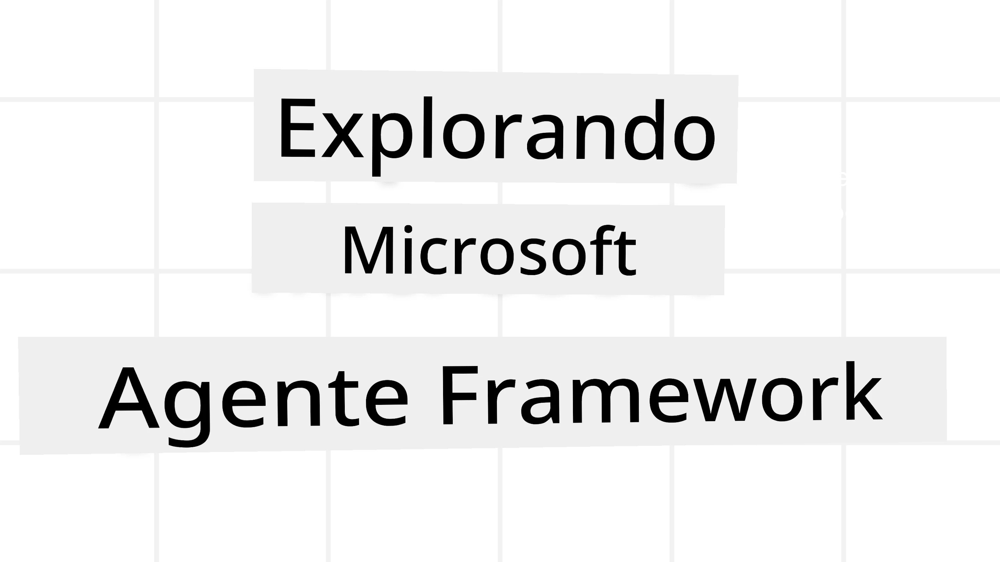

# Explorando o Microsoft Agent Framework



### Introdução

Esta lição vai abranger:

- Compreender o Microsoft Agent Framework: Características principais e Valor  
- Explorar os Conceitos-chave do Microsoft Agent Framework
- Padrões Avançados do MAF: Workflows, Middleware e Memória

## Objetivos de Aprendizagem

Após completar esta lição, saberá como:

- Construir Agentes de IA Prontos para Produção usando o Microsoft Agent Framework
- Aplicar as funcionalidades principais do Microsoft Agent Framework aos seus Casos de Uso Agênticos
- Usar padrões avançados incluindo workflows, middleware e observabilidade

## Exemplos de Código

Exemplos de código para [Microsoft Agent Framework (MAF)](https://aka.ms/ai-agents-beginners/agent-framewrok) podem ser encontrados neste repositório nos ficheiros `xx-python-agent-framework` e `xx-dotnet-agent-framework`.

## Compreendendo o Microsoft Agent Framework


[Microsoft Agent Framework (MAF)](https://aka.ms/ai-agents-beginners/agent-framewrok) é o framework unificado da Microsoft para construir agentes de IA. Oferece a flexibilidade para abordar a grande variedade de casos de uso agênticos vistos tanto em ambientes de produção como de investigação, incluindo:

- **Orquestração sequencial de agentes** em cenários onde são necessários workflows passo a passo.
- **Orquestração concorrente** em cenários onde os agentes precisam de realizar tarefas ao mesmo tempo.
- **Orquestração de chat em grupo** em cenários onde os agentes podem colaborar juntos numa tarefa.
- **Orquestração de transferência** em cenários onde os agentes passam a tarefa uns aos outros conforme as subtarefas são concluídas.
- **Orquestração magnética** em cenários onde um agente gestor cria e modifica uma lista de tarefas e gere a coordenação dos subagentes para completar a tarefa.

Para entregar Agentes de IA em Produção, o MAF também inclui funcionalidades para:

- **Observabilidade** através do uso de OpenTelemetry, onde cada ação do Agente de IA, incluindo invocação de ferramentas, passos de orquestração, fluxos de raciocínio e monitorização de desempenho através dos dashboards Microsoft Foundry.
- **Segurança** ao hospedar agentes nativamente na Microsoft Foundry, que inclui controlos de segurança como acesso baseado em funções, tratamento privado de dados e segurança de conteúdo incorporada.
- **Durabilidade** pois os threads e workflows do agente podem pausar, retomar e recuperar de erros, permitindo processos de execução mais longos.
- **Controlo** pois são suportados workflows com intervenção humana, onde as tarefas são marcadas como exigindo aprovação humana.

O Microsoft Agent Framework foca-se também na interoperabilidade, através de:

- **Ser Cloud-agnostic** - Os agentes podem correr em containers, on-premises e através de múltiplas clouds diferentes.
- **Ser Provider-agnostic** - Os agentes podem ser criados através do seu SDK preferido incluindo Azure OpenAI e OpenAI
- **Integrar padrões abertos** - Os agentes podem utilizar protocolos como Agent-to-Agent (A2A) e Model Context Protocol (MCP) para descobrir e usar outros agentes e ferramentas.
- **Plugins e Conectores** - Podem ser feitas conexões a serviços de dados e memória como Microsoft Fabric, SharePoint, Pinecone e Qdrant.

Vamos observar como estas funcionalidades são aplicadas a alguns dos conceitos centrais do Microsoft Agent Framework.

## Conceitos-chave do Microsoft Agent Framework

### Agentes


**Criar Agentes**

A criação de agentes é feita definindo o serviço de inferência (Fornecedor LLM), um conjunto de instruções para o Agente de IA seguir, e um `nome` atribuído:

```python
agent = AzureOpenAIChatClient(credential=AzureCliCredential()).create_agent( instructions="You are good at recommending trips to customers based on their preferences.", name="TripRecommender" )
```

O exemplo acima está a usar `Azure OpenAI` mas agentes podem ser criados usando uma variedade de serviços incluindo `Microsoft Foundry Agent Service`:

```python
AzureAIAgentClient(async_credential=credential).create_agent( name="HelperAgent", instructions="You are a helpful assistant." ) as agent
```

APIs OpenAI `Responses`, `ChatCompletion`

```python
agent = OpenAIResponsesClient().create_agent( name="WeatherBot", instructions="You are a helpful weather assistant.", )
```

```python
agent = OpenAIChatClient().create_agent( name="HelpfulAssistant", instructions="You are a helpful assistant.", )
```

ou [MiniMax](https://platform.minimaxi.com/), que fornece uma API compatível com OpenAI com janelas de contexto grandes (até 204K tokens):

```python
agent = OpenAIChatClient(base_url="https://api.minimax.io/v1", api_key=os.environ["MINIMAX_API_KEY"], model_id="MiniMax-M2.7").create_agent( name="HelpfulAssistant", instructions="You are a helpful assistant.", )
```

ou agentes remotos usando o protocolo A2A:

```python
agent = A2AAgent( name=agent_card.name, description=agent_card.description, agent_card=agent_card, url="https://your-a2a-agent-host" )
```

**Executar Agentes**

Os agentes são executados usando os métodos `.run` ou `.run_stream` para respostas sem streaming ou com streaming.

```python
result = await agent.run("What are good places to visit in Amsterdam?")
print(result.text)
```

```python
async for update in agent.run_stream("What are the good places to visit in Amsterdam?"):
    if update.text:
        print(update.text, end="", flush=True)

```

Cada execução de agente pode também ter opções para personalizar parâmetros como `max_tokens` usados pelo agente, `tools` que o agente pode chamar, e até o próprio `model` usado pelo agente.

Isto é útil em casos onde modelos ou ferramentas específicas são necessários para completar a tarefa do utilizador.

**Ferramentas**

Ferramentas podem ser definidas tanto quando se define o agente:

```python
def get_attractions( location: Annotated[str, Field(description="The location to get the top tourist attractions for")], ) -> str: """Get the top tourist attractions for a given location.""" return f"The top attractions for {location} are." 


# Ao criar um ChatAgent diretamente

agent = ChatAgent( chat_client=OpenAIChatClient(), instructions="You are a helpful assistant", tools=[get_attractions]

```

como também ao executar o agente:

```python

result1 = await agent.run( "What's the best place to visit in Seattle?", tools=[get_attractions] # Ferramenta fornecida apenas para esta execução )
```

**Threads de Agente**

Threads de Agente são usados para gerir conversas multi-turno. Threads podem ser criados quer por:

- Usar `get_new_thread()` que permite que o thread seja guardado ao longo do tempo
- Criar um thread automaticamente ao executar um agente e só ter o thread durante a execução atual.

Para criar um thread, o código é assim:

```python
# Criar um novo thread.
thread = agent.get_new_thread() # Executar o agente com o thread.
response = await agent.run("Hello, I am here to help you book travel. Where would you like to go?", thread=thread)

```

Depois pode serializar o thread para ser armazenado para uso posterior:

```python
# Criar uma nova thread.
thread = agent.get_new_thread() 

# Executar o agente com a thread.

response = await agent.run("Hello, how are you?", thread=thread) 

# Serializar a thread para armazenamento.

serialized_thread = await thread.serialize() 

# Desserializar o estado da thread após carregamento do armazenamento.

resumed_thread = await agent.deserialize_thread(serialized_thread)
```

**Middleware de Agente**

Agentes interagem com ferramentas e LLMs para completar as tarefas dos utilizadores. Em certos cenários, queremos executar ou registar algo entre estas interações. O middleware de agente permite-nos fazer isto através de:

*Middleware de Função*

Este middleware permite executar uma ação entre o agente e uma função/ferramenta que ele vai chamar. Um exemplo de quando isto seria usado é quando se quer fazer algum logging na chamada da função.

No código abaixo, `next` define se o próximo middleware ou a função real deve ser chamada.

```python
async def logging_function_middleware(
    context: FunctionInvocationContext,
    next: Callable[[FunctionInvocationContext], Awaitable[None]],
) -> None:
    """Function middleware that logs function execution."""
    # Pré-processamento: Registar antes da execução da função
    print(f"[Function] Calling {context.function.name}")

    # Continuar para o próximo middleware ou execução da função
    await next(context)

    # Pós-processamento: Registar após a execução da função
    print(f"[Function] {context.function.name} completed")
```

*Middleware de Chat*

Este middleware permite executar ou registar uma ação entre o agente e os pedidos ao LLM.

Contém informação importante como as `messages` que estão a ser enviadas para o serviço de IA.

```python
async def logging_chat_middleware(
    context: ChatContext,
    next: Callable[[ChatContext], Awaitable[None]],
) -> None:
    """Chat middleware that logs AI interactions."""
    # Pré-processamento: Registar antes da chamada à IA
    print(f"[Chat] Sending {len(context.messages)} messages to AI")

    # Continuar para o próximo middleware ou serviço de IA
    await next(context)

    # Pós-processamento: Registar após a resposta da IA
    print("[Chat] AI response received")

```

**Memória de Agente**

Conforme abordado na lição `Agentic Memory`, a memória é um elemento importante para permitir que o agente opere sobre diferentes contextos. O MAF oferece vários tipos diferentes de memórias:

*Armazenamento em Memória*

Esta é a memória armazenada nos threads durante o tempo de execução da aplicação.

```python
# Criar um novo thread.
thread = agent.get_new_thread() # Executar o agente com o thread.
response = await agent.run("Hello, I am here to help you book travel. Where would you like to go?", thread=thread)
```

*Mensagens Persistentes*

Esta memória é utilizada quando se armazena o histórico da conversa através de diferentes sessões. É definida usando o `chat_message_store_factory`:

```python
from agent_framework import ChatMessageStore

# Criar um armazenamento de mensagens personalizado
def create_message_store():
    return ChatMessageStore()

agent = ChatAgent(
    chat_client=OpenAIChatClient(),
    instructions="You are a Travel assistant.",
    chat_message_store_factory=create_message_store
)

```

*Memória Dinâmica*

Esta memória é adicionada ao contexto antes de os agentes serem executados. Estas memórias podem ser armazenadas em serviços externos como mem0:

```python
from agent_framework.mem0 import Mem0Provider

# Usar Mem0 para capacidades avançadas de memória
memory_provider = Mem0Provider(
    api_key="your-mem0-api-key",
    user_id="user_123",
    application_id="my_app"
)

agent = ChatAgent(
    chat_client=OpenAIChatClient(),
    instructions="You are a helpful assistant with memory.",
    context_providers=memory_provider
)

```

**Observabilidade de Agente**

A observabilidade é importante para construir sistemas agênticos fiáveis e fáceis de manter. O MAF integra-se com OpenTelemetry para fornecer tracing e métricas para melhor observabilidade.

```python
from agent_framework.observability import get_tracer, get_meter

tracer = get_tracer()
meter = get_meter()
with tracer.start_as_current_span("my_custom_span"):
    # fazer algo
    pass
counter = meter.create_counter("my_custom_counter")
counter.add(1, {"key": "value"})
```

### Workflows

O MAF oferece workflows que são passos pré-definidos para completar uma tarefa e incluem agentes de IA como componentes nesses passos.

Workflows são compostos por diferentes componentes que permitem melhor controlo do fluxo. Workflows também permitem **orquestração multi-agente** e **checkpointing** para guardar estados do workflow.

Os componentes principais de um workflow são:

**Executores**

Executores recebem mensagens de entrada, realizam as suas tarefas atribuídas e então produzem uma mensagem de saída. Isto move o workflow em direção à conclusão da tarefa maior. Os executores podem ser agentes de IA ou lógica personalizada.

**Arestas**

Arestas são usadas para definir o fluxo das mensagens num workflow. Estas podem ser:

*Arestas Diretamente* - Conexões simples um-para-um entre executores:

```python
from agent_framework import WorkflowBuilder

builder = WorkflowBuilder()
builder.add_edge(source_executor, target_executor)
builder.set_start_executor(source_executor)
workflow = builder.build()
```

*Arestas Condicionais* - Ativadas após uma determinada condição ser satisfeita. Por exemplo, quando quartos de hotel não estão disponíveis, um executor pode sugerir outras opções.

*Arestas de Switch-case* - Roteiam mensagens para diferentes executores com base em condições definidas. Por exemplo, se o cliente de viagens tem acesso prioritário e as suas tarefas serão tratadas por outro workflow.

*Arestas de Fan-out* - Enviam uma mensagem para múltiplos alvos.

*Arestas de Fan-in* - Colecionam múltiplas mensagens de diferentes executores e enviam para um alvo.

**Eventos**

Para fornecer melhor observabilidade nos workflows, o MAF oferece eventos incorporados para execução incluindo:

- `WorkflowStartedEvent`  - Começo da execução do workflow
- `WorkflowOutputEvent` - Workflow produz uma saída
- `WorkflowErrorEvent` - Workflow encontra um erro
- `ExecutorInvokeEvent`  - Executor começa a processar
- `ExecutorCompleteEvent`  -  Executor termina de processar
- `RequestInfoEvent` - Uma requisição é enviada

## Padrões Avançados do MAF

As seções acima cobrem os conceitos chave do Microsoft Agent Framework. À medida que constrói agentes mais complexos, aqui estão alguns padrões avançados a considerar:

- **Composição de Middleware**: Encadeie múltiplos handlers middleware (logging, autenticação, controlo de rate limit) usando middleware de função e de chat para controlo detalhado do comportamento do agente.
- **Checkpointing de Workflow**: Use eventos de workflow e serialização para guardar e retomar processos de agentes de longa execução.
- **Seleção Dinâmica de Ferramentas**: Combine RAG sobre descrições de ferramentas com o registo de ferramentas do MAF para apresentar só ferramentas relevantes por consulta.
- **Transferência Multi-Agente**: Use arestas de workflow e roteamento condicional para orquestrar transferências entre agentes especializados.

## Exemplos de Código

Exemplos de código para Microsoft Agent Framework podem ser encontrados neste repositório nos ficheiros `xx-python-agent-framework` e `xx-dotnet-agent-framework`.

## Tem Mais Questões Sobre o Microsoft Agent Framework?

Junte-se ao [Microsoft Foundry Discord](https://aka.ms/ai-agents/discord) para encontrar outros aprendizes, participar em horas de atendimento e obter respostas às suas perguntas sobre Agentes de IA.

---

<!-- CO-OP TRANSLATOR DISCLAIMER START -->
**Isenção de Responsabilidade**:  
Este documento foi traduzido utilizando o serviço de tradução automática [Co-op Translator](https://github.com/Azure/co-op-translator). Embora nos esforcemos pela precisão, avisamos que traduções automatizadas podem conter erros ou imprecisões. O documento original no seu idioma nativo deve ser considerado a fonte autoritativa. Para informações críticas, recomenda-se tradução profissional humana. Não nos responsabilizamos por quaisquer mal-entendidos ou interpretações incorretas resultantes da utilização desta tradução.
<!-- CO-OP TRANSLATOR DISCLAIMER END -->