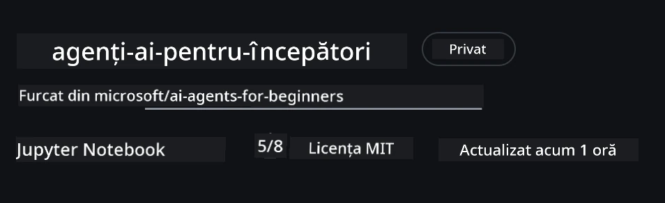

# Configurarea cursului

## Introducere

Această lecție va acoperi modul de a rula exemplele de cod ale acestui curs.

## Alăturați-vă altor cursanți și obțineți ajutor

Înainte de a începe să clonați repo-ul, alăturați-vă [canalului Discord AI Agents For Beginners](https://aka.ms/ai-agents/discord) pentru a primi ajutor cu configurarea, întrebări despre curs sau pentru a vă conecta cu alți cursanți.

## Clonați sau faceți fork la acest Repo

Pentru a începe, vă rugăm să clonați sau să faceți fork GitHub Repository. Acest lucru vă va crea propria versiune a materialului cursului pentru a putea rula, testa și modifica codul!

Acest lucru se poate face făcând clic pe linkul pentru <a href="https://github.com/microsoft/ai-agents-for-beginners/fork" target="_blank">fork la repo</a>

Acum ar trebui să aveți propria versiune forkuită a acestui curs la următorul link:



### Clonare superficială (recomandat pentru workshop / Codespaces)

  >Depozitul complet poate fi mare (~3 GB) când descărcați istoria completă și toate fișierele. Dacă participați doar la workshop sau aveți nevoie doar de câteva foldere de lecții, o clonare superficială (sau clonare sparsa) evită majoritatea acelei descărcări prin trunchierea istoriei și/sau sărind peste blob-uri.

#### Clonare superficială rapidă — istorie minimă, toate fișierele

Înlocuiți `<your-username>` în comenzile de mai jos cu URL-ul forkului vostru (sau URL-ul upstream dacă preferați).

Pentru a clona doar istoria ultimului commit (descărcare mică):

```bash|powershell
git clone --depth 1 https://github.com/<your-username>/ai-agents-for-beginners.git
```

Pentru a clona un branch specific:

```bash|powershell
git clone --depth 1 --branch <branch-name> https://github.com/<your-username>/ai-agents-for-beginners.git
```

#### Clonare parțială (sparsă) — blob-uri minime + doar foldere selectate

Aceasta folosește clonare parțială și sparse-checkout (necesită Git 2.25+ și Git modern recomandat cu suport pentru clonare parțială):

```bash|powershell
git clone --depth 1 --filter=blob:none --sparse https://github.com/<your-username>/ai-agents-for-beginners.git
```

Intrați în folderul repo-ului:

```bash|powershell
cd ai-agents-for-beginners
```

Apoi specificați ce foldere doriți (exemplul de mai jos arată două foldere):

```bash|powershell
git sparse-checkout set 00-course-setup 01-intro-to-ai-agents
```

După clonare și verificarea fișierelor, dacă aveți nevoie doar de fișiere și doriți să eliberați spațiu (fără istorie git), vă rugăm să ștergeți metadatele repository-ului (💀 ireversibil — veți pierde toată funcționalitatea Git: fără commit-uri, pull-uri, push-uri sau acces la istorie).

```bash
# zsh/bash
rm -rf .git
```

```powershell
# PowerShell
Remove-Item -Recurse -Force .git
```

#### Utilizarea GitHub Codespaces (recomandat pentru a evita descărcările locale mari)

- Creați un Codespace nou pentru acest repo prin [interfața GitHub](https://github.com/codespaces).  

- În terminalul codespace-ului nou creat, rulați una din comenzile de clonare superficială/sparsă de mai sus pentru a aduce în spațiul de lucru Codespace doar folderele de lecții de care aveți nevoie.
- Opțional: după clonare în Codespaces, eliminați .git pentru a recupera spațiu suplimentar (vedeți comenzile de ștergere de mai sus).
- Notă: Dacă preferați să deschideți repo-ul direct în Codespaces (fără clonare suplimentară), fiți conștienți că Codespaces va construi mediul devcontainer și poate să aprovisioneze mai mult decât aveți nevoie. Clonarea unei copii superficiale într-un Codespace proaspăt vă oferă mai mult control asupra utilizării discului.

#### Sfaturi

- Înlocuiți întotdeauna URL-ul de clonare cu cel al forkului dacă doriți să editați/faceți commit.
- Dacă mai târziu aveți nevoie de mai multă istorie sau fișiere, le puteți aduce cu fetch sau ajusta sparse-checkout pentru a include foldere suplimentare.

## Rularea codului

Acest curs oferă o serie de Jupyter Notebooks pe care le puteți rula pentru a obține experiență practică în construirea AI Agents.

Exemplele de cod folosesc **Microsoft Agent Framework (MAF)** cu `AzureAIProjectAgentProvider`, care se conectează la **Azure AI Agent Service V2** (API-ul Responses) prin **Microsoft Foundry**.

Toate notebook-urile Python sunt etichetate `*-python-agent-framework.ipynb`.

## Cerințe

- Python 3.12+
  - **NOTĂ**: Dacă nu aveți Python3.12 instalat, asigurați-vă că îl instalați. Apoi creați mediul virtual cu python3.12 pentru a asigura instalarea versiunilor corecte din fișierul requirements.txt.
  
    >Exemplu

    Creați directorul pentru mediu virtual Python:

    ```bash|powershell
    python -m venv venv
    ```

    Apoi activați mediul virtual pentru:

    ```bash
    # zsh/bash
    source venv/bin/activate
    ```
  
    ```dos
    # Command Prompt for Windows
    venv\Scripts\activate
    ```

- .NET 10+: Pentru codurile sample care folosesc .NET, asigurați-vă că instalați [.NET 10 SDK](https://dotnet.microsoft.com/download/dotnet/10.0) sau o versiune ulterioară. Apoi verificați versiunea SDK .NET instalată:

    ```bash|powershell
    dotnet --list-sdks
    ```

- **Azure CLI** — Necesară pentru autentificare. Instalați de la [aka.ms/installazurecli](https://aka.ms/installazurecli).
- **Abonament Azure** — Pentru acces la Microsoft Foundry și Azure AI Agent Service.
- **Proiect Microsoft Foundry** — Un proiect cu un model implementat (de ex., `gpt-4o`). Vedeți [Pasul 1](#pasul-1-creați-un-proiect-microsoft-foundry) mai jos.

Am inclus un fișier `requirements.txt` în rădăcina acestui repository care conține toate pachetele Python necesare pentru a rula exemplele de cod.

Le puteți instala rulând următoarea comandă în terminal, în directorul rădăcină al repo-ului:

```bash|powershell
pip install -r requirements.txt
```

Recomandăm crearea unui mediu virtual Python pentru a evita conflictele și problemele.

## Configurare VSCode

Asigurați-vă că folosiți versiunea corectă de Python în VSCode.


## Configurați Microsoft Foundry și Azure AI Agent Service

### Pasul 1: Creați un Proiect Microsoft Foundry

Aveți nevoie de un **hub** și un **proiect** Azure AI Foundry cu un model implementat pentru a rula notebook-urile.

1. Accesați [ai.azure.com](https://ai.azure.com) și conectați-vă cu contul dvs. Azure.
2. Creați un **hub** (sau folosiți unul existent). Vedeți: [Prezentarea resurselor Hub](https://learn.microsoft.com/azure/ai-foundry/concepts/ai-resources).
3. În cadrul hub-ului, creați un **proiect**.
4. Implementați un model (ex: `gpt-4o`) din **Models + Endpoints** → **Deploy model**.

### Pasul 2: Obțineți Endpoint-ul proiectului și Numele implementării modelului

Din proiectul dvs. în portalul Microsoft Foundry:

- **Endpoint-ul proiectului** — Accesați pagina **Overview** și copiați URL-ul endpoint-ului.


- **Numele implementării modelului** — Accesați **Models + Endpoints**, selectați modelul implementat, și notați **Deployment name** (ex: `gpt-4o`).

### Pasul 3: Autentificați-vă în Azure cu `az login`

Toate notebook-urile folosesc **`AzureCliCredential`** pentru autentificare — nu este nevoie să gestionați chei API. Acest lucru necesită să fiți autentificat prin Azure CLI.

1. **Instalați Azure CLI** dacă nu aveți deja: [aka.ms/installazurecli](https://aka.ms/installazurecli)

2. **Autentificați-vă** rulând:

    ```bash|powershell
    az login
    ```

    Sau dacă sunteți într-un mediu remote/Codespace fără browser:

    ```bash|powershell
    az login --use-device-code
    ```

3. **Selectați abonamentul** dacă vi se solicită — alegeți cel care conține proiectul Foundry.

4. **Verificați** că sunteți autentificat:

    ```bash|powershell
    az account show
    ```

> **De ce `az login`?** Notebook-urile autentifică folosind `AzureCliCredential` din pachetul `azure-identity`. Aceasta înseamnă că sesiunea CLI Azure oferă acreditările — fără chei API sau secrete în fișierul `.env`. Aceasta este o [bună practică de securitate](https://learn.microsoft.com/azure/developer/ai/keyless-connections).

### Pasul 4: Creați fișierul `.env`

Copiați fișierul exemplu:

```bash
# zsh/bash
cp .env.example .env
```

```powershell
# PowerShell
Copy-Item .env.example .env
```

Deschideți `.env` și completați aceste două valori:

```env
AZURE_AI_PROJECT_ENDPOINT=https://<your-project>.services.ai.azure.com/api/projects/<your-project-id>
AZURE_AI_MODEL_DEPLOYMENT_NAME=gpt-4o
```

| Variabilă | Unde o găsiți |
|----------|-----------------|
| `AZURE_AI_PROJECT_ENDPOINT` | Portal Foundry → proiectul dvs → pagina **Overview** |
| `AZURE_AI_MODEL_DEPLOYMENT_NAME` | Portal Foundry → **Models + Endpoints** → numele modelului implementat |

Asta e tot pentru majoritatea lecțiilor! Notebook-urile se vor autentifica automat prin sesiunea dvs `az login`.

### Pasul 5: Instalați dependențele Python

```bash|powershell
pip install -r requirements.txt
```

Recomandăm să rulați aceasta în mediul virtual creat anterior.

## Configurări suplimentare pentru Lecția 5 (Agentic RAG)

Lecția 5 folosește **Azure AI Search** pentru generare augmentată prin recuperare. Dacă intenționați să rulați acea lecție, adăugați aceste variabile în fișierul `.env`:

| Variabilă | Unde o găsiți |
|----------|-----------------|
| `AZURE_SEARCH_SERVICE_ENDPOINT` | Portal Azure → resursa dvs **Azure AI Search** → **Overview** → URL |
| `AZURE_SEARCH_API_KEY` | Portal Azure → resursa dvs **Azure AI Search** → **Settings** → **Keys** → cheia principală de admin |

## Configurări suplimentare pentru Lecția 6 și Lecția 8 (Modele GitHub)

Unele notebook-uri din lecțiile 6 și 8 folosesc **Modele GitHub** în loc de Azure AI Foundry. Dacă intenționați să rulați acele exemple, adăugați aceste variabile în fișierul `.env`:

| Variabilă | Unde o găsiți |
|----------|-----------------|
| `GITHUB_TOKEN` | GitHub → **Settings** → **Developer settings** → **Personal access tokens** |
| `GITHUB_ENDPOINT` | Folosiți `https://models.inference.ai.azure.com` (valoare implicită) |
| `GITHUB_MODEL_ID` | Numele modelului de utilizat (ex: `gpt-4o-mini`) |

## Furnizor alternativ: MiniMax (Compatibil OpenAI)

[MiniMax](https://platform.minimaxi.com/) oferă modele cu context mare (până la 204K de tokeni) printr-un API compatibil OpenAI. Deoarece `OpenAIChatClient` din Microsoft Agent Framework funcționează cu orice endpoint compatibil OpenAI, puteți folosi MiniMax ca alternativă în locul Modelelor GitHub sau OpenAI.

Adăugați aceste variabile în fișierul `.env`:

| Variabilă | Unde o găsiți |
|----------|-----------------|
| `MINIMAX_API_KEY` | [MiniMax Platform](https://platform.minimaxi.com/) → API Keys |
| `MINIMAX_BASE_URL` | Folosiți `https://api.minimax.io/v1` (valoare implicită) |
| `MINIMAX_MODEL_ID` | Numele modelului de utilizat (ex: `MiniMax-M2.7`) |

**Modele disponibile**: `MiniMax-M2.7` (recomandat), `MiniMax-M2.7-highspeed` (răspunsuri mai rapide)

Exemplele de cod care folosesc `OpenAIChatClient` (ex: workflow-ul rezervării hotelului din Lecția 14) vor detecta și folosi automat configurația MiniMax când `MINIMAX_API_KEY` este setat.

## Configurări suplimentare pentru Lecția 8 (Bing Grounding Workflow)

Notebook-ul cu workflow condițional din lecția 8 folosește **Bing grounding** prin Azure AI Foundry. Dacă intenționați să rulați acel exemplu, adăugați această variabilă în fișierul `.env`:

| Variabilă | Unde o găsiți |
|----------|-----------------|
| `BING_CONNECTION_ID` | Portal Azure AI Foundry → proiectul dvs → **Management** → **Connected resources** → conexiunea dvs Bing → copiați ID-ul conexiunii |

## Depanare

### Erori de verificare a certificatului SSL pe macOS

Dacă sunteți pe macOS și întâmpinați o eroare de genul:

```plaintext
ssl.SSLCertVerificationError: [SSL: CERTIFICATE_VERIFY_FAILED] certificate verify failed: self-signed certificate in certificate chain
```

Aceasta este o problemă cunoscută cu Python pe macOS, unde certificatele SSL ale sistemului nu sunt încredințate automat. Încercați următoarele soluții în ordine:

**Opțiunea 1: Rulați scriptul Python Install Certificates (recomandat)**

```bash
# Înlocuiți 3.XX cu versiunea Python instalată (de exemplu, 3.12 sau 3.13):
/Applications/Python\ 3.XX/Install\ Certificates.command
```

**Opțiunea 2: Folosiți `connection_verify=False` în notebook-ul dvs (doar pentru notebook-urile Modele GitHub)**

În notebook-ul Lesson 6 (`06-building-trustworthy-agents/code_samples/06-system-message-framework.ipynb`), este deja inclus un workaround comentat. Deblocați `connection_verify=False` când creați clientul:

```python
client = ChatCompletionsClient(
    endpoint=endpoint,
    credential=AzureKeyCredential(token),
    connection_verify=False,  # Dezactivează verificarea SSL dacă întâmpini erori de certificat
)
```

> **⚠️ Atenție:** Dezactivarea verificării SSL (`connection_verify=False`) reduce securitatea sărind peste validarea certificatului. Folosiți această soluție doar temporar în medii de dezvoltare, niciodată în producție.

**Opțiunea 3: Instalați și folosiți `truststore`**

```bash
pip install truststore
```

Apoi adăugați următoarea linie în partea de sus a notebook-ului sau scriptului dvs înainte de a face orice apeluri de rețea:

```python
import truststore
truststore.inject_into_ssl()
```

## Blocaj undeva?

Dacă întâmpinați probleme cu această configurare, intrați în <a href="https://discord.gg/kzRShWzttr" target="_blank">Azure AI Community Discord</a> sau <a href="https://github.com/microsoft/ai-agents-for-beginners/issues?WT.mc_id=academic-105485-koreyst" target="_blank">deschideți un issue</a>.

## Următoarea lecție

Acum sunteți gata să rulați codul pentru acest curs. Spor la învățat mai multe despre lumea AI Agents!

[Introducere în AI Agents și cazuri de utilizare a agenților](../01-intro-to-ai-agents/README.md)

---

<!-- CO-OP TRANSLATOR DISCLAIMER START -->
**Declinare a responsabilității**:  
Acest document a fost tradus folosind serviciul de traducere AI [Co-op Translator](https://github.com/Azure/co-op-translator). Deși ne străduim pentru acuratețe, vă rugăm să rețineți că traducerile automate pot conține erori sau inexactități. Documentul original în limba sa nativă trebuie considerat sursa autoritară. Pentru informații critice, se recomandă traducerea profesională realizată de un traducător uman. Nu ne asumăm responsabilitatea pentru orice neînțelegeri sau interpretări greșite care decurg din utilizarea acestei traduceri.
<!-- CO-OP TRANSLATOR DISCLAIMER END -->