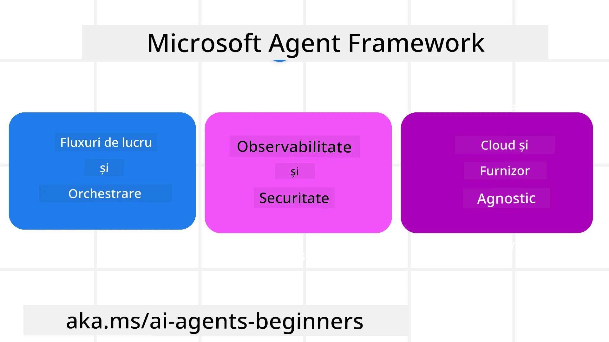
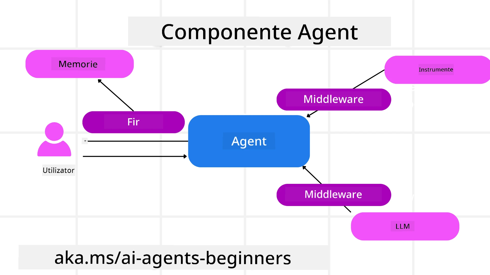

# Explorarea Microsoft Agent Framework


### Introducere

Această lecție va acoperi:

- Înțelegerea Microsoft Agent Framework: Caracteristici cheie și valoare  
- Explorarea conceptelor cheie din Microsoft Agent Framework
- Modele avansate MAF: Fluxuri de lucru, Middleware și Memorie

## Obiective de învățare

După finalizarea acestei lecții, vei ști cum să:

- Construiești agenți AI gata pentru producție folosind Microsoft Agent Framework
- Aplici caracteristicile principale ale Microsoft Agent Framework în cazurile tale de utilizare agentică
- Folosești modele avansate, inclusiv fluxuri de lucru, middleware și observabilitate

## Exemple de cod

Exemplele de cod pentru [Microsoft Agent Framework (MAF)](https://aka.ms/ai-agents-beginners/agent-framewrok) pot fi găsite în acest depozit sub fișierele `xx-python-agent-framework` și `xx-dotnet-agent-framework`.

## Înțelegerea Microsoft Agent Framework



[Microsoft Agent Framework (MAF)](https://aka.ms/ai-agents-beginners/agent-framewrok) este cadrul unificat al Microsoft pentru construirea agenților AI. Oferă flexibilitatea de a aborda o gamă largă de cazuri de utilizare agentică întâlnite atât în producție, cât și în medii de cercetare, incluzând:

- **Orchestrarea secvențială a agenților** în scenarii în care sunt necesare fluxuri de lucru pas cu pas.
- **Orchestrarea concurentă** în scenarii în care agenții trebuie să finalizeze sarcini în același timp.
- **Orchestrarea în chat de grup** în scenarii în care agenții pot colabora împreună la o singură sarcină.
- **Orchestrarea de transfer** în scenarii în care agenții transferă sarcina între ei pe măsură ce subtask-urile sunt finalizate.
- **Orchestrarea magnetică** în scenarii în care un agent manager creează și modifică o listă de sarcini și gestionează coordonarea subagenților pentru a finaliza sarcina.

Pentru a livra agenți AI în producție, MAF include și caracteristici pentru:

- **Observabilitate** prin utilizarea OpenTelemetry unde fiecare acțiune a agentului AI, inclusiv invocarea instrumentelor, pașii de orchestrare, fluxurile de raționare și monitorizarea performanței prin dashboard-uri Microsoft Foundry.
- **Securitate** prin găzduirea agenților nativ pe Microsoft Foundry, care include controale de securitate precum acces bazat pe roluri, gestionarea datelor private și siguranță încorporată a conținutului.
- **Durabilitate** deoarece firele de agent și fluxurile de lucru pot fi întrerupte, reluate și recuperate după erori, ceea ce permite procese de durată mai lungă.
- **Control** deoarece fluxurile de lucru cu intervenție umană sunt suportate, unde sarcinile sunt marcate ca necesitând aprobarea umană.

Microsoft Agent Framework este de asemenea axat pe interoperabilitate prin:

- **Fiind agnostic față de cloud** - Agenții pot rula în containere, on-premise și pe mai multe clouduri diferite.
- **Fiind agnostic față de furnizori** - Agenții pot fi creați prin SDK-ul preferat, inclusiv Azure OpenAI și OpenAI.
- **Integrarea standardelor deschise** - Agenții pot utiliza protocoale precum Agent-to-Agent (A2A) și Model Context Protocol (MCP) pentru a descoperi și folosi alți agenți și instrumente.
- **Pluginuri și conectori** - Se pot stabili conexiuni către servicii de date și memorie precum Microsoft Fabric, SharePoint, Pinecone și Qdrant.

Să vedem cum sunt aplicate aceste caracteristici în unele dintre conceptele cheie ale Microsoft Agent Framework.

## Concepte cheie ale Microsoft Agent Framework

### Agenți



**Crearea agenților**

Crearea unui agent se realizează prin definirea serviciului de inferență (furnizor LLM), un set de instrucțiuni pe care agentul AI trebuie să le urmeze și atribuirea unui `name`:

```python
agent = AzureOpenAIChatClient(credential=AzureCliCredential()).create_agent( instructions="You are good at recommending trips to customers based on their preferences.", name="TripRecommender" )
```

Mai sus se folosește `Azure OpenAI` dar agenții pot fi creați folosind o varietate de servicii inclusiv `Microsoft Foundry Agent Service`:

```python
AzureAIAgentClient(async_credential=credential).create_agent( name="HelperAgent", instructions="You are a helpful assistant." ) as agent
```

OpenAI `Responses`, API-urile `ChatCompletion`

```python
agent = OpenAIResponsesClient().create_agent( name="WeatherBot", instructions="You are a helpful weather assistant.", )
```

```python
agent = OpenAIChatClient().create_agent( name="HelpfulAssistant", instructions="You are a helpful assistant.", )
```

sau [MiniMax](https://platform.minimaxi.com/), care oferă un API compatibil OpenAI cu ferestre mari de context (până la 204K tokens):

```python
agent = OpenAIChatClient(base_url="https://api.minimax.io/v1", api_key=os.environ["MINIMAX_API_KEY"], model_id="MiniMax-M2.7").create_agent( name="HelpfulAssistant", instructions="You are a helpful assistant.", )
```

sau agenți la distanță folosind protocolul A2A:

```python
agent = A2AAgent( name=agent_card.name, description=agent_card.description, agent_card=agent_card, url="https://your-a2a-agent-host" )
```

**Rularea agenților**

Agenții sunt rulați folosind metodele `.run` sau `.run_stream` pentru răspunsuri non-streaming sau streaming.

```python
result = await agent.run("What are good places to visit in Amsterdam?")
print(result.text)
```

```python
async for update in agent.run_stream("What are the good places to visit in Amsterdam?"):
    if update.text:
        print(update.text, end="", flush=True)

```

Fiecare rulare a unui agent poate avea opțiuni pentru a personaliza parametri precum `max_tokens` folosiți de agent, `tools` pe care agentul le poate apela și chiar modelul (`model`) însuși folosit pentru agent.

Acest lucru este util în cazurile în care sunt necesare modele sau instrumente specifice pentru îndeplinirea sarcinii utilizatorului.

**Instrumente**

Instrumentele pot fi definite atât la definirea agentului:

```python
def get_attractions( location: Annotated[str, Field(description="The location to get the top tourist attractions for")], ) -> str: """Get the top tourist attractions for a given location.""" return f"The top attractions for {location} are." 


# Când creați un ChatAgent direct

agent = ChatAgent( chat_client=OpenAIChatClient(), instructions="You are a helpful assistant", tools=[get_attractions]

```

cât și la rularea agentului:

```python

result1 = await agent.run( "What's the best place to visit in Seattle?", tools=[get_attractions] # Unealtă oferită doar pentru această execuție )
```

**Firele agentului**

Firele agentului sunt folosite pentru a gestiona conversații cu mai multe runde. Firele pot fi create prin:

- Utilizarea `get_new_thread()` care permite salvarea firului în timp
- Crearea automată a unui fir la rularea agentului și firul durează doar pe durata rulării curente.

Pentru a crea un fir, codul arată astfel:

```python
# Creați un fir nou.
thread = agent.get_new_thread() # Rulați agentul cu firul.
response = await agent.run("Hello, I am here to help you book travel. Where would you like to go?", thread=thread)

```

Apoi poți serializa firul pentru a fi stocat pentru utilizare ulterioară:

```python
# Creează un fir nou.
thread = agent.get_new_thread() 

# Rulează agentul cu firul.

response = await agent.run("Hello, how are you?", thread=thread) 

# Seriază firul pentru stocare.

serialized_thread = await thread.serialize() 

# Deseriază starea firului după încărcarea din stocare.

resumed_thread = await agent.deserialize_thread(serialized_thread)
```

**Middleware agent**

Agenții interacționează cu instrumente și LLM-uri pentru a îndeplini sarcinile utilizatorului. În anumite scenarii, dorim să executăm sau să urmărim interacțiunile dintre acestea. Middleware-ul de agent ne permite acest lucru prin:

*Middleware funcție*

Acest middleware ne permite să executăm o acțiune între agent și o funcție/instrument pe care acesta îl va apela. Un exemplu este dorința de a face logare asupra apelului funcției.

În codul de mai jos `next` definește dacă următorul middleware sau funcția efectivă trebuie apelată.

```python
async def logging_function_middleware(
    context: FunctionInvocationContext,
    next: Callable[[FunctionInvocationContext], Awaitable[None]],
) -> None:
    """Function middleware that logs function execution."""
    # Preprocesare: Înregistrare înainte de execuția funcției
    print(f"[Function] Calling {context.function.name}")

    # Continuă la următorul middleware sau execuția funcției
    await next(context)

    # Postprocesare: Înregistrare după execuția funcției
    print(f"[Function] {context.function.name} completed")
```

*Middleware chat*

Acest middleware ne permite să executăm sau să înregistrăm o acțiune între agent și cererile dintre LLM.

Aceasta conține informații importante precum `messages` care sunt trimise către serviciul AI.

```python
async def logging_chat_middleware(
    context: ChatContext,
    next: Callable[[ChatContext], Awaitable[None]],
) -> None:
    """Chat middleware that logs AI interactions."""
    # Pre-procesare: Log de dinaintea apelului AI
    print(f"[Chat] Sending {len(context.messages)} messages to AI")

    # Continuă către următorul middleware sau serviciu AI
    await next(context)

    # Post-procesare: Log după răspunsul AI
    print("[Chat] AI response received")

```

**Memoria agentului**

Așa cum a fost acoperit în lecția `Agentic Memory`, memoria este un element important pentru a permite agentului să opereze în contexte diferite. MAF oferă mai multe tipuri de memorii:

*Stocare în memorie*

Aceasta este memoria stocată în fire în timpul rulării aplicației.

```python
# Creează un nou thread.
thread = agent.get_new_thread() # Rulează agentul cu thread-ul.
response = await agent.run("Hello, I am here to help you book travel. Where would you like to go?", thread=thread)
```

*Mesaje persistente*

Această memorie este folosită atunci când se stochează istoricul conversațiilor între sesiuni diferite. Este definită folosind `chat_message_store_factory`:

```python
from agent_framework import ChatMessageStore

# Creează un magazin de mesaje personalizat
def create_message_store():
    return ChatMessageStore()

agent = ChatAgent(
    chat_client=OpenAIChatClient(),
    instructions="You are a Travel assistant.",
    chat_message_store_factory=create_message_store
)

```

*Memorie dinamică*

Această memorie este adăugată în context înainte ca agenții să fie rulați. Aceste memorii pot fi stocate în servicii externe precum mem0:

```python
from agent_framework.mem0 import Mem0Provider

# Utilizarea Mem0 pentru capacități avansate de memorie
memory_provider = Mem0Provider(
    api_key="your-mem0-api-key",
    user_id="user_123",
    application_id="my_app"
)

agent = ChatAgent(
    chat_client=OpenAIChatClient(),
    instructions="You are a helpful assistant with memory.",
    context_providers=memory_provider
)

```

**Observabilitatea agentului**

Observabilitatea este importantă pentru construirea unor sisteme agentice fiabile și ușor de întreținut. MAF se integrează cu OpenTelemetry pentru a oferi trasabilitate și contoare pentru o observabilitate mai bună.

```python
from agent_framework.observability import get_tracer, get_meter

tracer = get_tracer()
meter = get_meter()
with tracer.start_as_current_span("my_custom_span"):
    # fă ceva
    pass
counter = meter.create_counter("my_custom_counter")
counter.add(1, {"key": "value"})
```

### Fluxuri de lucru

MAF oferă fluxuri de lucru care sunt pași predefiniți pentru a finaliza o sarcină și includ agenți AI ca componente în acești pași.

Fluxurile de lucru sunt compuse din diferite componente care permit un control mai bun al fluxului. De asemenea, fluxurile de lucru permit **orchestrarea multi-agent** și **checkpointing** pentru a salva stările fluxului de lucru.

Componentele de bază ale unui flux de lucru sunt:

**Executorii**

Executorii primesc mesaje de intrare, execută sarcinile alocate și apoi produc un mesaj de ieșire. Acesta avansează fluxul de lucru către finalizarea sarcinii mai mari. Executorii pot fi agenți AI sau logică personalizată.

**Muchii**

Muchiile sunt folosite pentru a defini fluxul mesajelor într-un flux de lucru. Acestea pot fi:

*Muchii directe* - Conexiuni simple unu-la-unu între executori:

```python
from agent_framework import WorkflowBuilder

builder = WorkflowBuilder()
builder.add_edge(source_executor, target_executor)
builder.set_start_executor(source_executor)
workflow = builder.build()
```

*Muchii condiționale* - Activează după ce o anumită condiție este îndeplinită. De exemplu, când camerele de hotel nu sunt disponibile, un executor poate sugera alte opțiuni.

*Muchii switch-case* - Direcționează mesajele către executori diferiți pe baza condițiilor definite. De exemplu, dacă un client de călătorie are acces prioritar, sarcinile sale vor fi gestionate printr-un alt flux de lucru.

*Muchii fan-out* - Trimit un mesaj către mai multe destinații.

*Muchii fan-in* - Colectează mai multe mesaje de la diverși executori și le trimite către o singură destinație.

**Evenimente**

Pentru a oferi o mai bună observabilitate în fluxurile de lucru, MAF oferă evenimente încorporate pentru execuție cum ar fi:

- `WorkflowStartedEvent`  - Execuția fluxului de lucru începe
- `WorkflowOutputEvent` - Fluxul de lucru produce un output
- `WorkflowErrorEvent` - Fluxul de lucru întâmpină o eroare
- `ExecutorInvokeEvent`  - Executorul începe procesarea
- `ExecutorCompleteEvent`  -  Executorul termină procesarea
- `RequestInfoEvent` - O cerere este emisă

## Modele avansate MAF

Secțiunile de mai sus acoperă conceptele cheie ale Microsoft Agent Framework. Pe măsură ce construiești agenți mai complexi, iată câteva modele avansate de luat în considerare:

- **Compoziția middleware**: Lanțuiește mai multe gestionare middleware (logare, autentificare, limitare rată) folosind middleware funcțional și chat pentru control fin asupra comportamentului agentului.
- **Checkpointing în fluxuri de lucru**: Folosește evenimentele fluxului de lucru și serializarea pentru a salva și relua procese lungi ale agenților.
- **Selecția dinamică a instrumentelor**: Combină RAG peste descrierile instrumentelor cu înregistrarea instrumentelor din MAF pentru a prezenta doar instrumentele relevante per interogare.
- **Transfer multi-agent**: Folosește muchiile din fluxuri și rutarea condițională pentru a orchestra transferuri între agenți specializați.

## Exemple de cod

Exemplele de cod pentru Microsoft Agent Framework pot fi găsite în acest depozit sub fișierele `xx-python-agent-framework` și `xx-dotnet-agent-framework`.

## Ai mai multe întrebări despre Microsoft Agent Framework?

Alătură-te [Microsoft Foundry Discord](https://aka.ms/ai-agents/discord) pentru a întâlni alți cursanți, a participa la orele de birou și a primi răspunsuri la întrebările tale despre agenții AI.

---

<!-- CO-OP TRANSLATOR DISCLAIMER START -->
**Declinare de responsabilitate**:  
Acest document a fost tradus folosind serviciul de traducere AI [Co-op Translator](https://github.com/Azure/co-op-translator). Deși ne străduim pentru acuratețe, vă rugăm să fiți conștienți că traducerile automate pot conține erori sau inexactități. Documentul original în limba sa nativă trebuie considerat sursa autoritară. Pentru informații critice, se recomandă traducerea profesională realizată de un specialist uman. Nu ne asumăm răspunderea pentru eventualele neînțelegeri sau interpretări eronate care pot apărea în urma utilizării acestei traduceri.
<!-- CO-OP TRANSLATOR DISCLAIMER END -->