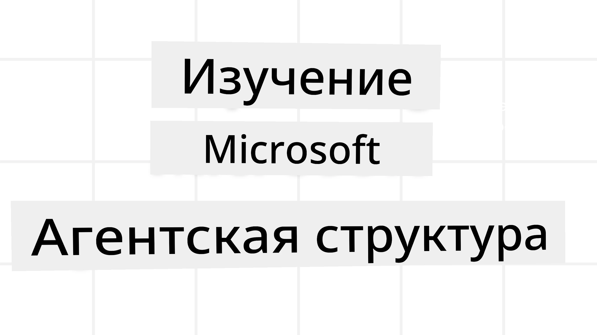
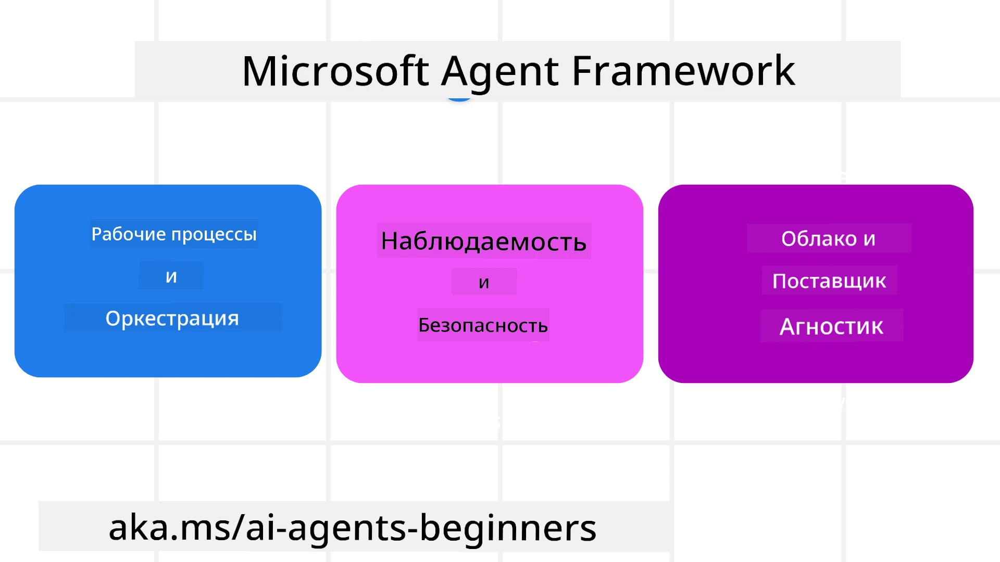

# Исследование Microsoft Agent Framework



### Введение

В этом уроке будут рассмотрены:

- Понимание Microsoft Agent Framework: ключевые особенности и ценность  
- Изучение ключевых понятий Microsoft Agent Framework
- Продвинутые шаблоны MAF: рабочие процессы, промежуточное ПО и память

## Цели обучения

После прохождения этого урока вы узнаете, как:

- Создавать производственных ИИ-агентов с использованием Microsoft Agent Framework
- Применять основные функции Microsoft Agent Framework к вашим агентским сценариям использования
- Использовать продвинутые шаблоны, включая рабочие процессы, промежуточное ПО и наблюдаемость

## Примеры кода

Примеры кода для [Microsoft Agent Framework (MAF)](https://aka.ms/ai-agents-beginners/agent-framewrok) можно найти в этом репозитории в файлах `xx-python-agent-framework` и `xx-dotnet-agent-framework`.

## Понимание Microsoft Agent Framework



[Microsoft Agent Framework (MAF)](https://aka.ms/ai-agents-beginners/agent-framewrok) – это унифицированный фреймворк Microsoft для создания ИИ-агентов. Он предлагает гибкость для решения разнообразных агентских сценариев, встречающихся как в производственной среде, так и в исследованиях, включая:

- **Последовательную оркестрацию агентов** в сценариях, где необходимы пошаговые рабочие процессы.
- **Параллельную оркестрацию** в сценариях, когда агенты должны выполнять задачи одновременно.
- **Оркестрацию групповых чатов** в сценариях, где агенты могут совместно работать над одной задачей.
- **Оркестрацию передачи** в сценариях, когда агенты передают задачи друг другу по мере завершения подзадач.
- **Магнитную оркестрацию** в сценариях, где управляющий агент создает и изменяет список задач и координирует подагентов для выполнения задачи.

Для реализации ИИ-агентов в производстве MAF также включает функции для:

- **Наблюдаемости** с использованием OpenTelemetry, где фиксируется каждое действие ИИ-агента, включая вызовы инструментов, шаги оркестрации, потоки рассуждений и мониторинг производительности через панели управления Microsoft Foundry.
- **Безопасности** за счет размещения агентов нативно на Microsoft Foundry, что включает меры безопасности, такие как контроль доступа на основе ролей, обработка частных данных и встроенная безопасность контента.
- **Надежности**, поскольку потоки и рабочие процессы агентов могут приостанавливаться, возобновляться и восстанавливаться после ошибок, что позволяет выполнять длительные процессы.
- **Контроля**, так как поддерживаются рабочие процессы с участием человека, где задачи помечаются как требующие одобрения человеком.

Microsoft Agent Framework также ориентирован на совместимость за счет:

- **Независимости от облака** — агенты могут запускаться в контейнерах, локально и в различных облаках.
- **Независимости от провайдера** — агенты могут создаваться с использованием предпочитаемого SDK, включая Azure OpenAI и OpenAI
- **Интеграции открытых стандартов** — агенты могут использовать протоколы, такие как Agent-to-Agent (A2A) и Model Context Protocol (MCP), для обнаружения и использования других агентов и инструментов.
- **Плагинов и коннекторов** — возможны подключения к сервисам данных и памяти, таким как Microsoft Fabric, SharePoint, Pinecone и Qdrant.

Давайте посмотрим, как эти функции применяются к некоторым ключевым понятиям Microsoft Agent Framework.

## Ключевые понятия Microsoft Agent Framework

### Агенты


**Создание агентов**

Создание агента выполняется путем определения сервиса вывода (LLM Provider), набора инструкций для ИИ-агента и присвоения `name`:

```python
agent = AzureOpenAIChatClient(credential=AzureCliCredential()).create_agent( instructions="You are good at recommending trips to customers based on their preferences.", name="TripRecommender" )
```

Пример выше использует `Azure OpenAI`, но агенты могут создаваться с использованием разнообразных сервисов, включая `Microsoft Foundry Agent Service`:

```python
AzureAIAgentClient(async_credential=credential).create_agent( name="HelperAgent", instructions="You are a helpful assistant." ) as agent
```

OpenAI API `Responses`, `ChatCompletion`

```python
agent = OpenAIResponsesClient().create_agent( name="WeatherBot", instructions="You are a helpful weather assistant.", )
```

```python
agent = OpenAIChatClient().create_agent( name="HelpfulAssistant", instructions="You are a helpful assistant.", )
```

или [MiniMax](https://platform.minimaxi.com/), который предоставляет API, совместимый с OpenAI, с большими контекстными окнами (до 204K токенов):

```python
agent = OpenAIChatClient(base_url="https://api.minimax.io/v1", api_key=os.environ["MINIMAX_API_KEY"], model_id="MiniMax-M2.7").create_agent( name="HelpfulAssistant", instructions="You are a helpful assistant.", )
```

или удаленных агентов по протоколу A2A:

```python
agent = A2AAgent( name=agent_card.name, description=agent_card.description, agent_card=agent_card, url="https://your-a2a-agent-host" )
```

**Запуск агентов**

Агенты запускаются с помощью методов `.run` или `.run_stream` для получения либо не потоковых, либо потоковых ответов.

```python
result = await agent.run("What are good places to visit in Amsterdam?")
print(result.text)
```

```python
async for update in agent.run_stream("What are the good places to visit in Amsterdam?"):
    if update.text:
        print(update.text, end="", flush=True)

```

Каждый запуск агента также может иметь параметры для настройки, такие как `max_tokens`, используемые агентом, `tools`, которые агент может вызвать, а также сам `model`, используемый агентом.

Это полезно в случаях, когда для выполнения задачи пользователя необходимы конкретные модели или инструменты.

**Инструменты**

Инструменты можно определить как при создании агента:

```python
def get_attractions( location: Annotated[str, Field(description="The location to get the top tourist attractions for")], ) -> str: """Get the top tourist attractions for a given location.""" return f"The top attractions for {location} are." 


# При прямом создании ChatAgent

agent = ChatAgent( chat_client=OpenAIChatClient(), instructions="You are a helpful assistant", tools=[get_attractions]

```

так и при запуске агента:

```python

result1 = await agent.run( "What's the best place to visit in Seattle?", tools=[get_attractions] # Инструмент предоставлен только для этого запуска )
```

**Потоки агента**

Потоки агента используются для управления многошаговыми разговорами. Потоки можно создавать следующим образом:

- Используя `get_new_thread()`, что позволяет сохранять поток со временем
- Автоматически создавая поток при запуске агента, который действует только в течение текущего запуска.

Для создания потока код выглядит так:

```python
# Создать новый поток.
thread = agent.get_new_thread() # Запустить агента с потоком.
response = await agent.run("Hello, I am here to help you book travel. Where would you like to go?", thread=thread)

```

Затем поток можно сериализовать для последующего хранения:

```python
# Создайте новый поток.
thread = agent.get_new_thread() 

# Запустите агента с потоком.

response = await agent.run("Hello, how are you?", thread=thread) 

# Сериализуйте поток для хранения.

serialized_thread = await thread.serialize() 

# Десериализуйте состояние потока после загрузки из хранилища.

resumed_thread = await agent.deserialize_thread(serialized_thread)
```

**Промежуточное ПО агента**

Агенты взаимодействуют с инструментами и LLM, чтобы выполнять задачи пользователя. В некоторых сценариях необходимо выполнять действия или отслеживать их между этими взаимодействиями. Промежуточное ПО агента позволяет это делать через:

*Функциональное промежуточное ПО*

Это промежуточное ПО позволяет выполнять действие между агентом и вызываемой функцией/инструментом. Например, его можно использовать для логирования вызова функции.

В коде ниже `next` определяет, следует ли вызвать следующее промежуточное ПО или саму функцию.

```python
async def logging_function_middleware(
    context: FunctionInvocationContext,
    next: Callable[[FunctionInvocationContext], Awaitable[None]],
) -> None:
    """Function middleware that logs function execution."""
    # Предварительная обработка: Логирование перед выполнением функции
    print(f"[Function] Calling {context.function.name}")

    # Продолжить к следующему посреднику или выполнению функции
    await next(context)

    # Последующая обработка: Логирование после выполнения функции
    print(f"[Function] {context.function.name} completed")
```

*Промежуточное ПО чата*

Это промежуточное ПО позволяет выполнять или логировать действия между агентом и запросами к LLM.

Содержит важную информацию, такую как `messages`, отправляемые в сервис ИИ.

```python
async def logging_chat_middleware(
    context: ChatContext,
    next: Callable[[ChatContext], Awaitable[None]],
) -> None:
    """Chat middleware that logs AI interactions."""
    # Предобработка: Логирование до вызова ИИ
    print(f"[Chat] Sending {len(context.messages)} messages to AI")

    # Продолжить к следующему посреднику или сервису ИИ
    await next(context)

    # Постобработка: Логирование после ответа ИИ
    print("[Chat] AI response received")

```

**Память агента**

Как обсуждалось в уроке `Agentic Memory`, память — важный элемент, позволяющий агенту работать в разных контекстах. MAF предлагает несколько типов памяти:

*Временное хранение в памяти*

Память, хранящаяся в потоках во время выполнения приложения.

```python
# Создать новый поток.
thread = agent.get_new_thread() # Запустить агента с потоком.
response = await agent.run("Hello, I am here to help you book travel. Where would you like to go?", thread=thread)
```

*Постоянные сообщения*

Память используется для сохранения истории разговоров между сессиями. Определяется с помощью `chat_message_store_factory`:

```python
from agent_framework import ChatMessageStore

# Создать пользовательское хранилище сообщений
def create_message_store():
    return ChatMessageStore()

agent = ChatAgent(
    chat_client=OpenAIChatClient(),
    instructions="You are a Travel assistant.",
    chat_message_store_factory=create_message_store
)

```

*Динамическая память*

Эта память добавляется в контекст перед запуском агентов. Она может храниться во внешних сервисах, таких как mem0:

```python
from agent_framework.mem0 import Mem0Provider

# Использование Mem0 для расширенных возможностей памяти
memory_provider = Mem0Provider(
    api_key="your-mem0-api-key",
    user_id="user_123",
    application_id="my_app"
)

agent = ChatAgent(
    chat_client=OpenAIChatClient(),
    instructions="You are a helpful assistant with memory.",
    context_providers=memory_provider
)

```

**Наблюдаемость агента**

Наблюдаемость важна для создания надежных и поддерживаемых агентских систем. MAF интегрируется с OpenTelemetry для предоставления трассировок и счетчиков для лучшей наблюдаемости.

```python
from agent_framework.observability import get_tracer, get_meter

tracer = get_tracer()
meter = get_meter()
with tracer.start_as_current_span("my_custom_span"):
    # сделать что-то
    pass
counter = meter.create_counter("my_custom_counter")
counter.add(1, {"key": "value"})
```

### Рабочие процессы

MAF предлагает рабочие процессы — предопределённые шаги для выполнения задачи, включающие ИИ-агентов в качестве компонентов на этих шагах.

Рабочие процессы состоят из различных компонентов, обеспечивающих лучший контроль потока. Они также поддерживают **многосоставную оркестрацию агентов** и **сохранение контрольных точек** для сохранения состояний рабочего процесса.

Основные компоненты рабочего процесса:

**Исполнители**

Исполнители получают входные сообщения, выполняют назначенные задачи и затем создают выходное сообщение. Это продвижение рабочего процесса к выполнению более крупной задачи. Исполнителями могут быть ИИ-агенты или пользовательская логика.

**Ребра**

Ребра определяют поток сообщений в рабочем процессе. Их типы:

*Прямые ребра* — простые соединения один к одному между исполнителями:

```python
from agent_framework import WorkflowBuilder

builder = WorkflowBuilder()
builder.add_edge(source_executor, target_executor)
builder.set_start_executor(source_executor)
workflow = builder.build()
```

*Условные ребра* — активируются после выполнения определенного условия. Например, когда номера в отеле недоступны, исполнитель может предложить другие варианты.

*Ребра switch-case* — направляют сообщения к разным исполнителям в зависимости от условий. Например, если у туриста приоритетный доступ, его задачи обрабатываются в другом рабочем процессе.

*Разветвляющие ребра* — отправляют одно сообщение нескольким получателям.

*Собирающие ребра* — собирают несколько сообщений от разных исполнителей и отправляют одному получателю.

**События**

Для улучшения наблюдаемости в рабочих процессах MAF предлагает встроенные события для выполнения, включая:

- `WorkflowStartedEvent` — начало выполнения рабочего процесса
- `WorkflowOutputEvent` — рабочий процесс создает выход
- `WorkflowErrorEvent` — рабочий процесс столкнулся с ошибкой
- `ExecutorInvokeEvent` — исполнитель начинает обработку
- `ExecutorCompleteEvent` — исполнитель завершает обработку
- `RequestInfoEvent` — запрос отправлен

## Продвинутые шаблоны MAF

Выше рассмотрены ключевые понятия Microsoft Agent Framework. При создании более сложных агентов стоит учитывать следующие продвинутые шаблоны:

- **Композиция промежуточного ПО**: цепочка нескольких обработчиков промежуточного ПО (логирование, аутентификация, ограничение скорости) с использованием функционального и чат-промежуточного ПО для тонкой настройки поведения агента.
- **Сохранение контрольных точек рабочего процесса**: использование событий рабочего процесса и сериализации для сохранения и возобновления длительных процессов агента.
- **Динамический выбор инструментов**: комбинирование RAG на основе описаний инструментов с регистрацией инструментов MAF для отображения только релевантных инструментов для каждого запроса.
- **Передача между несколькими агентами**: использование ребер рабочего процесса и условной маршрутизации для оркестровки передачи задач между специализированными агентами.

## Примеры кода

Примеры кода для Microsoft Agent Framework можно найти в этом репозитории в файлах `xx-python-agent-framework` и `xx-dotnet-agent-framework`.

## Есть дополнительные вопросы о Microsoft Agent Framework?

Присоединяйтесь к [Microsoft Foundry Discord](https://aka.ms/ai-agents/discord), чтобы встретиться с другими учащимися, посетить часы поддержки и получить ответы на вопросы по ИИ-агентам.

---

<!-- CO-OP TRANSLATOR DISCLAIMER START -->
**Отказ от ответственности**:  
Этот документ был переведен с помощью сервиса искусственного интеллекта [Co-op Translator](https://github.com/Azure/co-op-translator). Несмотря на наши усилия обеспечить точность, имейте в виду, что автоматические переводы могут содержать ошибки или неточности. Оригинальный документ на его родном языке следует рассматривать как авторитетный источник. Для критически важной информации рекомендуется профессиональный перевод человеком. Мы не несем ответственности за любые недоразумения или неверные толкования, возникающие в результате использования этого перевода.
<!-- CO-OP TRANSLATOR DISCLAIMER END -->