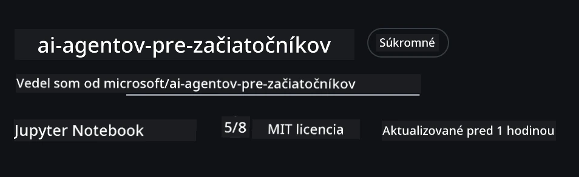
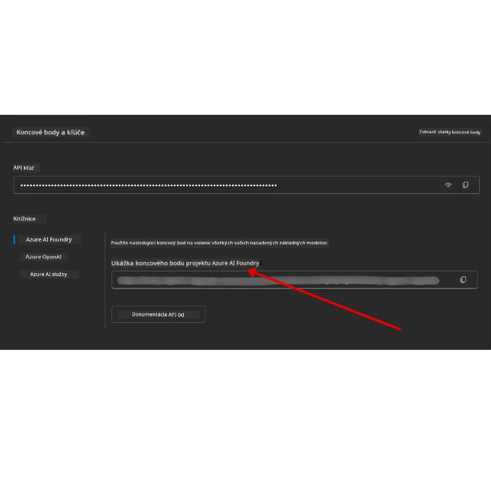

# Nastavenie kurzu

## Úvod

Táto lekcia pokrýva, ako spustiť ukážkové kódy tohto kurzu.

## Pripojte sa k ostatným študentom a získajte pomoc

Predtým, než začnete klonovať svoj repozitár, pripojte sa k [AI Agents For Beginners Discord kanálu](https://aka.ms/ai-agents/discord), kde môžete získať pomoc so zriaďovaním, otázky ohľadom kurzu alebo sa spojiť s ostatnými študentmi.

## Klonujte alebo forkujte tento repozitár

Na začiatok, prosím, sklonujte alebo forknite repozitár na GitHube. Tým získate vlastnú verziu materiálov kurzu, aby ste mohli kód spúšťať, testovať a upravovať!

Môžete to urobiť kliknutím na odkaz <a href="https://github.com/microsoft/ai-agents-for-beginners/fork" target="_blank">fork repozitára</a>

Teraz by ste mali mať vlastnú forknutú verziu tohto kurzu na nasledujúcom odkaze:



### Shallow Clone (odporúčané pre workshop / Codespaces)

  >Celý repozitár môže byť veľký (~3 GB) pri stiahnutí celej histórie a všetkých súborov. Ak sa zúčastňujete len workshopu alebo potrebujete len niekoľko lekčných priečinkov, shallow clone (alebo sparse clone) sa vyhne väčšine sťahovania tým, že skracuje históriu a/alebo vynecháva blob-y.

#### Rýchly shallow clone — minimálna história, všetky súbory

Nahraďte `<your-username>` v nižšie uvedených príkazoch URL vašej forknutej verzie (alebo upstream URL, ak preferujete).

Ak chcete klonovať iba poslednú históriu commitu (malé sťahovanie):

```bash|powershell
git clone --depth 1 https://github.com/<your-username>/ai-agents-for-beginners.git
```

Na klonovanie konkrétnej vetvy:

```bash|powershell
git clone --depth 1 --branch <branch-name> https://github.com/<your-username>/ai-agents-for-beginners.git
```

#### Čiastočný (sparse) clone — minimálne bloby + iba vybrané priečinky

Používame čiastočný clone a sparse-checkout (vyžaduje Git 2.25+ a odporúča sa moderný Git s podporou partial clone):

```bash|powershell
git clone --depth 1 --filter=blob:none --sparse https://github.com/<your-username>/ai-agents-for-beginners.git
```

Prejdite do priečinka repozitára:

```bash|powershell
cd ai-agents-for-beginners
```

Potom špecifikujte, ktoré priečinky chcete (príklad ukazuje dva priečinky):

```bash|powershell
git sparse-checkout set 00-course-setup 01-intro-to-ai-agents
```

Po klonovaní a overení súborov, ak potrebujete len súbory a chcete uvoľniť miesto (bez git histórie), prosím vymažte metadáta repozitára (💀nezvratné — stratíte všetku Git funkcionalitu: žiadne commity, pull-y, push-y alebo prístup k histórii).

```bash
# zsh/bash
rm -rf .git
```

```powershell
# PowerShell
Remove-Item -Recurse -Force .git
```

#### Použitie GitHub Codespaces (odporúčané na vyhnutie sa veľkým lokálnym stiahnutiam)

- Vytvorte nový Codespace pre tento repozitár cez [GitHub UI](https://github.com/codespaces).

- V termináli novo vytvoreného Codespace spustite jeden z príkazov shallow/sparse clone vyššie, aby ste do pracovného priestoru Codespace načítali iba požadované lekčné priečinky.
- Voliteľné: po klonovaní v Codespaces odstráňte .git na uvoľnenie ďalšieho miesta (pozrite príkazy na odstránenie vyššie).
- Poznámka: Ak preferujete otvoriť repozitár priamo v Codespaces (bez ďalšieho klonovania), majte na pamäti, že Codespaces zostaví devcontainer prostredie a môže stále vytvoriť viac, než potrebujete. Klonovanie shallow kópie vo fresh Codespace vám dá viac kontroly nad využitím disku.

#### Tipy

- Vždy nahraďte URL klonovania vašim forkom, ak chcete upravovať/commitovať.
- Ak neskôr potrebujete viac histórie alebo súborov, môžete ich stiahnuť alebo upraviť sparse-checkout, aby zahrnul ďalšie priečinky.

## Spúšťanie kódu

Tento kurz ponúka sériu Jupyter notebookov, ktoré môžete spustiť a získať praktické skúsenosti s vytváraním AI agentov.

Ukážkové kódy používajú **Microsoft Agent Framework (MAF)** s poskytovateľom `AzureAIProjectAgentProvider`, ktorý sa pripája na **Azure AI Agent Service V2** (API odpovedí) cez **Microsoft Foundry**.

Všetky Python notebooky sú označené ako `*-python-agent-framework.ipynb`.

## Požiadavky

- Python 3.12+
  - **POZNÁMKA**: Ak nemáte nainštalovaný Python 3.12, uistite sa, že ho nainštalujete. Potom vytvorte virtual env s použitím python3.12, aby sa zabezpečilo, že sa nainštalujú správne verzie z `requirements.txt`.
  
    >Príklad

    Vytvorenie adresára pre Python venv:

    ```bash|powershell
    python -m venv venv
    ```

    Potom aktivujte venv prostredie pre:

    ```bash
    # zsh/bash
    source venv/bin/activate
    ```
  
    ```dos
    # Command Prompt for Windows
    venv\Scripts\activate
    ```

- .NET 10+: Pre ukážkové kódy používajúce .NET, uistite sa, že máte nainštalovaný [.NET 10 SDK](https://dotnet.microsoft.com/download/dotnet/10.0) alebo novší. Potom overte verzia nainštalovaného .NET SDK:

    ```bash|powershell
    dotnet --list-sdks
    ```

- **Azure CLI** — Vyžadované na autentifikáciu. Nainštalujte z [aka.ms/installazurecli](https://aka.ms/installazurecli).
- **Azure Subscription** — Na prístup k Microsoft Foundry a Azure AI Agent Service.
- **Microsoft Foundry Project** — Projekt s nasadeným modelom (napr. `gpt-4o`). Pozri [Krok 1](#krok-1-vytvorte-microsoft-foundry-projekt) nižšie.

V koreňovom adresári repozitára je súbor `requirements.txt`, ktorý obsahuje všetky požadované Python balíky na spustenie ukážok kódu.

Môžete ich nainštalovať spustením nasledujúceho príkazu v termináli v koreňovom adresári repozitára:

```bash|powershell
pip install -r requirements.txt
```

Odporúčame vytvoriť Python virtuálne prostredie, aby ste predišli konfliktom a problémom.

## Nastavenie VSCode

Uistite sa, že vo VSCode používate správnu verziu Pythonu.


## Nastavenie Microsoft Foundry a Azure AI Agent Service

### Krok 1: Vytvorte Microsoft Foundry projekt

Na spustenie notebookov potrebujete Azure AI Foundry **hub** a **projekt** s nasadeným modelom.

1. Prejdite na [ai.azure.com](https://ai.azure.com) a prihláste sa so svojím Azure účtom.
2. Vytvorte **hub** (alebo použite existujúci). Viac info: [Prehľad zdrojov hubu](https://learn.microsoft.com/azure/ai-foundry/concepts/ai-resources).
3. V rámci hubu vytvorte **projekt**.
4. Nasadte model (napr. `gpt-4o`) cez **Models + Endpoints** → **Deploy model**.

### Krok 2: Získajte endpoint projektu a názov nasadenia modelu

Vo vašom projekte na Microsoft Foundry portáli:

- **Project Endpoint** — Prejdite na stránku **Prehľad** a skopírujte URL endpointu.



- **Model Deployment Name** — Prejdite do **Models + Endpoints**, vyberte nasadený model a zapíšte si jeho **Deployment name** (napr. `gpt-4o`).

### Krok 3: Prihláste sa do Azure pomocou `az login`

Všetky notebooky používajú **`AzureCliCredential`** na autentifikáciu — nie sú potrebné API kľúče na správu. Toto vyžaduje, aby ste boli prihlásení cez Azure CLI.

1. **Nainštalujte Azure CLI**, ak ho ešte nemáte: [aka.ms/installazurecli](https://aka.ms/installazurecli)

2. **Prihláste sa** spustením:

    ```bash|powershell
    az login
    ```

    Alebo ak ste v remote/Codespace prostredí bez prehliadača:

    ```bash|powershell
    az login --use-device-code
    ```

3. **Vyberte svoj subscription**, ak sa zobrazí výzva — vyberte ten, ktorý obsahuje váš Foundry projekt.

4. **Overte** prihlásenie:

    ```bash|powershell
    az account show
    ```

> **Prečo `az login`?** Notebooky sa autentifikujú pomocou `AzureCliCredential` z balíka `azure-identity`. Znamená to, že vaše Azure CLI session poskytuje prihlasovacie údaje — žiadne API kľúče alebo tajomstvá v `.env` súbore. Toto je [najlepšia bezpečnostná prax](https://learn.microsoft.com/azure/developer/ai/keyless-connections).

### Krok 4: Vytvorte súbor `.env`

Skopírujte ukážkový súbor:

```bash
# zsh/bash
cp .env.example .env
```

```powershell
# PowerShell
Copy-Item .env.example .env
```

Otvorte `.env` a vyplňte tieto dve hodnoty:

```env
AZURE_AI_PROJECT_ENDPOINT=https://<your-project>.services.ai.azure.com/api/projects/<your-project-id>
AZURE_AI_MODEL_DEPLOYMENT_NAME=gpt-4o
```

| Premenná | Kde ju nájsť |
|----------|--------------|
| `AZURE_AI_PROJECT_ENDPOINT` | Foundry portál → váš projekt → stránka **Prehľad** |
| `AZURE_AI_MODEL_DEPLOYMENT_NAME` | Foundry portál → **Models + Endpoints** → názov nasadeného modelu |

To je všetko pre väčšinu lekcií! Notebooky sa autentifikujú automaticky cez vašu `az login` session.

### Krok 5: Nainštalujte Python závislosti

```bash|powershell
pip install -r requirements.txt
```

Odporúčame to spustiť vo virtuálnom prostredí, ktoré ste si vytvorili.

## Dodatočné nastavenie pre Lekciu 5 (Agentic RAG)

Lekcia 5 používa **Azure AI Search** pre retrieval-augmented generation. Ak plánujete túto lekciu spustiť, pridajte tieto premenné do svojho `.env` súboru:

| Premenná | Kde ju nájsť |
|----------|--------------|
| `AZURE_SEARCH_SERVICE_ENDPOINT` | Azure portál → vaša **Azure AI Search** služba → **Prehľad** → URL |
| `AZURE_SEARCH_API_KEY` | Azure portál → vaša **Azure AI Search** služba → **Nastavenia** → **Kľúče** → primárny admin kľúč |

## Dodatočné nastavenie pre Lekcie 6 a 8 (GitHub Models)

Niektoré notebooky z lekcií 6 a 8 používajú **GitHub Models** namiesto Azure AI Foundry. Ak plánujete tieto ukážky spustiť, pridajte tieto premenné do `.env` súboru:

| Premenná | Kde ju nájsť |
|----------|--------------|
| `GITHUB_TOKEN` | GitHub → **Nastavenia** → **Developer settings** → **Personal access tokens** |
| `GITHUB_ENDPOINT` | Použite `https://models.inference.ai.azure.com` (predvolená hodnota) |
| `GITHUB_MODEL_ID` | Názov modelu na použitie (napr. `gpt-4o-mini`) |

## Alternatívny poskytovateľ: MiniMax (kompatibilný s OpenAI)

[MiniMax](https://platform.minimaxi.com/) poskytuje modely na veľký kontext (až 204K tokenov) cez API kompatibilné s OpenAI. Keďže Microsoft Agent Framework `OpenAIChatClient` pracuje s akýmkoľvek OpenAI-kompatibilným endpointom, môžete MiniMax použiť ako náhradu za GitHub Models alebo OpenAI.

Pridajte tieto premenné do `.env` súboru:

| Premenná | Kde ju nájsť |
|----------|--------------|
| `MINIMAX_API_KEY` | [MiniMax Platform](https://platform.minimaxi.com/) → API kľúče |
| `MINIMAX_BASE_URL` | Použite `https://api.minimax.io/v1` (predvolená hodnota) |
| `MINIMAX_MODEL_ID` | Názov modelu na použitie (napr. `MiniMax-M2.7`) |

**Dostupné modely**: `MiniMax-M2.7` (odporúčané), `MiniMax-M2.7-highspeed` (rýchlejšie odpovede)

Ukážky kódu používané `OpenAIChatClient` (napr. lekcia 14 workflow rezervácie hotela) automaticky rozpoznajú a použijú vašu konfiguráciu MiniMax, keď je nastavený `MINIMAX_API_KEY`.

## Dodatočné nastavenie pre Lekciu 8 (Bing Grounding Workflow)

Podmienený workflow notebook v lekcii 8 používa **Bing grounding** cez Azure AI Foundry. Ak plánujete spustiť túto ukážku, pridajte túto premennú do `.env` súboru:

| Premenná | Kde ju nájsť |
|----------|--------------|
| `BING_CONNECTION_ID` | Azure AI Foundry portál → váš projekt → **Management** → **Connected resources** → vaša Bing connection → skopírujte ID pripojenia |

## Riešenie problémov

### Chyby overovania SSL certifikátov na macOS

Ak ste na macOS a narazíte na chybu ako:

```plaintext
ssl.SSLCertVerificationError: [SSL: CERTIFICATE_VERIFY_FAILED] certificate verify failed: self-signed certificate in certificate chain
```

Ide o známy problém s Pythonom na macOS, kde systémové SSL certifikáty nie sú automaticky dôveryhodné. Vyskúšajte tieto riešenia v poradí:

**Možnosť 1: Spustite skript Inštalácie certifikátov v Pythone (odporúčané)**

```bash
# Nahraďte 3.XX vašou nainštalovanou verziou Pythonu (napr. 3.12 alebo 3.13):
/Applications/Python\ 3.XX/Install\ Certificates.command
```

**Možnosť 2: Použite `connection_verify=False` vo vašom notebooku (len pre GitHub Models notebooky)**

V lekcii 6 notebooku (`06-building-trustworthy-agents/code_samples/06-system-message-framework.ipynb`) je už zahrnutý zakomentovaný workaround. Odkomentujte `connection_verify=False` pri vytváraní klienta:

```python
client = ChatCompletionsClient(
    endpoint=endpoint,
    credential=AzureKeyCredential(token),
    connection_verify=False,  # Vypnite overovanie SSL, ak narazíte na chyby certifikátu
)
```

> **⚠️ Upozornenie:** Zakázanie overovania SSL (`connection_verify=False`) znižuje bezpečnosť, pretože sa obchádza validácia certifikátu. Používajte to iba ako dočasné riešenie v testovacom prostredí, nikdy v produkcii.

**Možnosť 3: Nainštalujte a používajte `truststore`**

```bash
pip install truststore
```

Potom pridajte nasledujúce na začiatok vášho notebooku alebo skriptu pred akýmikoľvek sieťovými požiadavkami:

```python
import truststore
truststore.inject_into_ssl()
```

## Stuck Somewhere?

Ak máte nejaké problémy so spustením tohto nastavenia, zapojte sa do nášho <a href="https://discord.gg/kzRShWzttr" target="_blank">Azure AI Community Discordu</a> alebo <a href="https://github.com/microsoft/ai-agents-for-beginners/issues?WT.mc_id=academic-105485-koreyst" target="_blank">vytvorte issue</a>.

## Ďalšia lekcia

Teraz ste pripravení spustiť kód pre tento kurz. Prajeme príjemné spoznávanie sveta AI Agentov!

[Úvod do AI Agentov a prípadov použitia agentov](../01-intro-to-ai-agents/README.md)

---

<!-- CO-OP TRANSLATOR DISCLAIMER START -->
**Poznámka**:  
Tento dokument bol preložený pomocou AI prekladateľskej služby [Co-op Translator](https://github.com/Azure/co-op-translator). Aj keď sa snažíme o presnosť, majte prosím na pamäti, že automatizované preklady môžu obsahovať chyby alebo nepresnosti. Pôvodný dokument v jeho natívnom jazyku by sa mal považovať za autoritatívny zdroj. Pre kritické informácie sa odporúča profesionálny ľudský preklad. Nie sme zodpovední za akékoľvek nedorozumenia alebo nesprávne výklady vyplývajúce z použitia tohto prekladu.
<!-- CO-OP TRANSLATOR DISCLAIMER END -->