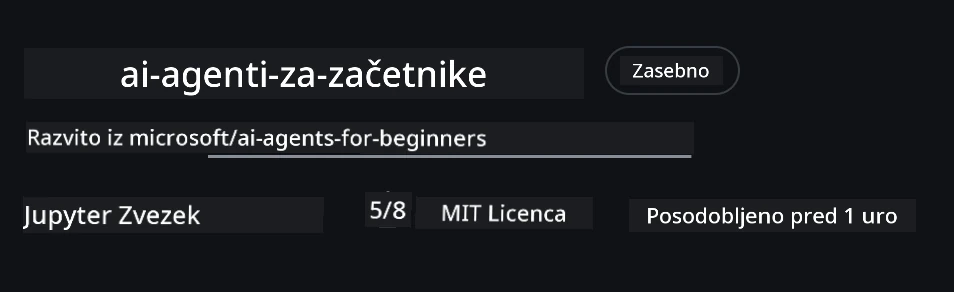

# Nastavitev tečaja

## Uvod

Ta lekcija bo pokrivala, kako zagnati primerke kode tega tečaja.

## Pridružite se drugim učencem in poiščite pomoč

Preden začnete s kloniranjem vašega repozitorija, se pridružite [kanalu AI Agents For Beginners na Discordu](https://aka.ms/ai-agents/discord), da dobite pomoč pri nastavitvi, odgovore na vprašanja o tečaju ali se povežete z drugimi učenci.

## Klonirajte ali forknite ta repozitorij

Za začetek prosim klonirajte ali forknite GitHub repozitorij. S tem boste ustvarili svojo različico gradiva tečaja, da lahko zaženete, testirate in prilagajate kodo!

To lahko naredite tako, da kliknete na povezavo za <a href="https://github.com/microsoft/ai-agents-for-beginners/fork" target="_blank">fork repozitorija</a>

Sedaj bi morali imeti svojo lastno forkano različico tega tečaja na naslednji povezavi:



### Plitvi klon (priporočeno za delavnico / Codespaces)

  >Celoten repozitorij je lahko velik (~3 GB), če prenesete celotno zgodovino in vse datoteke. Če obiskujete samo delavnico ali potrebujete le nekaj map lekcij, plitvi klon (ali redki klon) prepreči večino prenosa z omejitvijo zgodovine in/ali izpustitvijo vsebin.

#### Hitri plitvi klon — minimalna zgodovina, vse datoteke

Zamenjajte `<your-username>` v spodnjih ukazih z URL vaše fork različice (ali zgornji URL če raje).

Za kloniranje samo zadnje zgodovine ukazov (majhen prenos):

```bash|powershell
git clone --depth 1 https://github.com/<your-username>/ai-agents-for-beginners.git
```

Za kloniranje določene veje:

```bash|powershell
git clone --depth 1 --branch <branch-name> https://github.com/<your-username>/ai-agents-for-beginners.git
```

#### Delni (redki) klon — minimalni blobi + samo izbrane mape

To uporablja delni klon in sparse-checkout (zahteva Git 2.25+ in priporočen sodoben Git z delnim klonom):

```bash|powershell
git clone --depth 1 --filter=blob:none --sparse https://github.com/<your-username>/ai-agents-for-beginners.git
```

Pojdite v mapo repozitorija:

```bash|powershell
cd ai-agents-for-beginners
```

Nato določite, katere mape želite (spodnjega primera prikazuje dve mapi):

```bash|powershell
git sparse-checkout set 00-course-setup 01-intro-to-ai-agents
```

Po kloniranju in preverjanju datotek, če potrebujete samo datoteke in želite sprostiti prostor (brez git zgodovine), prosim izbrišite metapodatke repozitorija (💀nepopravljivo — izgubili boste vse funkcije Git-a: brez commit-ov, pull-ov, push-ov ali dostopa do zgodovine).

```bash
# zsh/bash
rm -rf .git
```

```powershell
# PowerShell
Remove-Item -Recurse -Force .git
```

#### Uporaba GitHub Codespaces (priporočeno za izogibanje velikim lokalnim prenosom)

- Ustvarite nov Codespace za ta repozitorij preko [GitHub UI](https://github.com/codespaces).  

- V terminalu novonastalega codespace-a zaženite enega od zgornjih plitvih/sparse clone ukazov, da prinesete samo mape lekcij, ki jih potrebujete v Codespace delovno okolje.
- Neobvezno: po kloniranju znotraj Codespaces odstranite .git, da sprostite dodatni prostor (glejte odstranitvene ukaze zgoraj).
- Opomba: Če raje odprete repozitorij neposredno v Codespaces (brez dodatnega kloniranja), bodite pozorni, da Codespaces vzpostavi devcontainer okolje in lahko kljub temu pripravi več, kot potrebujete. Kloniranje plitve kopije znotraj svežega Codespace-a vam daje več nadzora nad uporabo diska.

#### Nasveti

- Vedno zamenjajte URL klona z vašim fork-om, če želite urejati/commit.
- Če boste kasneje potrebovali več zgodovine ali datotek, jih lahko pridobite ali prilagodite sparse-checkout, da vključite dodatne mape.

## Zagon kode

Ta tečaj ponuja serijo Jupyter Notebook-ov, ki jih lahko zaženete za praktične izkušnje z gradnjo AI agentov.

Primeri kode uporabljajo **Microsoft Agent Framework (MAF)** z `AzureAIProjectAgentProvider`, ki povezuje z **Azure AI Agent Service V2** (Responses API) preko **Microsoft Foundry**.

Vsi Python notebok-i imajo oznako `*-python-agent-framework.ipynb`.

## Zahteve

- Python 3.12+
  - **OPOMBA**: Če nimate nameščenega Python3.12, poskrbite, da ga namestite. Nato ustvarite venv z python3.12, da se zagotovijo pravilne različice iz datoteke requirements.txt.
  
    >Primer

    Ustvarite Python venv mapo:

    ```bash|powershell
    python -m venv venv
    ```

    Nato aktivirajte venv okolje za:

    ```bash
    # zsh/bash
    source venv/bin/activate
    ```
  
    ```dos
    # Command Prompt for Windows
    venv\Scripts\activate
    ```

- .NET 10+: Za primerke kode, ki uporabljajo .NET, zagotovite, da imate nameščen [.NET 10 SDK](https://dotnet.microsoft.com/download/dotnet/10.0) ali novejši. Nato preverite svojo nameščeno različico .NET SDK:

    ```bash|powershell
    dotnet --list-sdks
    ```

- **Azure CLI** — Potrebno za avtentikacijo. Namestite z [aka.ms/installazurecli](https://aka.ms/installazurecli).
- **Azure naročnina** — Za dostop do Microsoft Foundry in Azure AI Agent Service.
- **Microsoft Foundry projekt** — Projekt z nameščenim modelom (npr. `gpt-4o`). Glejte [Korak 1](#korak-1-ustvarite-microsoft-foundry-projekt) spodaj.

V korenu tega repozitorija smo vključili `requirements.txt` datoteko, ki vsebuje vse potrebne Python pakete za zagon primerov kode.

Namestite jih z naslednjim ukazom v terminalu v korenu repozitorija:

```bash|powershell
pip install -r requirements.txt
```

Priporočamo, da ustvarite Python virtualno okolje, da se izognete morebitnim konfliktom in težavam.

## Nastavitev VSCode

Prepričajte se, da uporabljate pravo različico Pythona v VSCode.


## Nastavitev Microsoft Foundry in Azure AI Agent Service

### Korak 1: Ustvarite Microsoft Foundry projekt

Za zagon notebookov potrebujete Azure AI Foundry **hub** in **projekt** z nameščenim modelom.

1. Obiščite [ai.azure.com](https://ai.azure.com) in se prijavite z Azure računom.
2. Ustvarite **hub** (ali uporabite obstoječega). Glejte: [Pregled virov hub](https://learn.microsoft.com/azure/ai-foundry/concepts/ai-resources).
3. Znotraj huba ustvarite **projekt**.
4. Namestite model (npr. `gpt-4o`) iz **Models + Endpoints** → **Deploy model**.

### Korak 2: Pridobite URL končne točke projekta in ime nameščenega modela

Iz vašega projekta v Microsoft Foundry portalu:

- **Projektna končna točka** — Obiščite stran **Overview** in kopirajte URL končne točke.


- **Ime nameščenega modela** — Pojdite na **Models + Endpoints**, izberite nameščeni model in zabeležite **Deployment name** (npr. `gpt-4o`).

### Korak 3: Prijava v Azure z `az login`

Vsi notebook-i uporabljajo **`AzureCliCredential`** za avtentikacijo — brez upravljanja API ključev. To zahteva prijavo prek Azure CLI.

1. **Namestite Azure CLI** če ga še nimate: [aka.ms/installazurecli](https://aka.ms/installazurecli)

2. **Prijavite se** z ukazom:

    ```bash|powershell
    az login
    ```

    Ali če ste v oddaljenem/Codespace okolju brez brskalnika:

    ```bash|powershell
    az login --use-device-code
    ```

3. **Izberite naročnino** če vas vpraša — izberite tisto, ki vsebuje vaš Foundry projekt.

4. **Preverite** svojo prijavo:

    ```bash|powershell
    az account show
    ```

> **Zakaj `az login`?** Notebook-i se avtenticirajo z `AzureCliCredential` iz paketa `azure-identity`. To pomeni, da vaša Azure CLI seja zagotavlja poverilnice — brez API ključev ali skrivnosti v `.env` datoteki. To je [najboljša praksa za varnost](https://learn.microsoft.com/azure/developer/ai/keyless-connections).

### Korak 4: Ustvarite vašo `.env` datoteko

Kopirajte primer datoteke:

```bash
# zsh/bash
cp .env.example .env
```

```powershell
# PowerShell
Copy-Item .env.example .env
```

Odprite `.env` in vnesite ti dve vrednosti:

```env
AZURE_AI_PROJECT_ENDPOINT=https://<your-project>.services.ai.azure.com/api/projects/<your-project-id>
AZURE_AI_MODEL_DEPLOYMENT_NAME=gpt-4o
```

| Spremenljivka | Kje jo najti |
|--------------|--------------|
| `AZURE_AI_PROJECT_ENDPOINT` | Foundry portal → vaš projekt → stran **Overview** |
| `AZURE_AI_MODEL_DEPLOYMENT_NAME` | Foundry portal → **Models + Endpoints** → ime vašega nameščenega modela |

To je to za večino lekcij! Notebook-i se bodo samodejno avtenticirali preko vaše `az login` seje.

### Korak 5: Namestite Python odvisnosti

```bash|powershell
pip install -r requirements.txt
```

Priporočamo, da to izvedete v virtualnem okolju, ki ste ga ustvarili prej.

## Dodatna nastavitev za Lekcijo 5 (Agentic RAG)

Lekcija 5 uporablja **Azure AI Search** za generiranje na osnovi iskanja. Če nameravate zagnati to lekcijo, dodajte te spremenljivke v vašo `.env` datoteko:

| Spremenljivka | Kje jo najti |
|--------------|--------------|
| `AZURE_SEARCH_SERVICE_ENDPOINT` | Azure portal → vaš **Azure AI Search** vir → **Overview** → URL |
| `AZURE_SEARCH_API_KEY` | Azure portal → vaš **Azure AI Search** vir → **Settings** → **Keys** → glavni upravljalski ključ |

## Dodatna nastavitev za Lekcijo 6 in Lekcijo 8 (GitHub modeli)

Nekaj notebook-ov iz lekcij 6 in 8 uporablja **GitHub modele** namesto Azure AI Foundry. Če boste zagnali te primere, dodajte te spremenljivke v vašo `.env` datoteko:

| Spremenljivka | Kje jo najti |
|--------------|--------------|
| `GITHUB_TOKEN` | GitHub → **Settings** → **Developer settings** → **Personal access tokens** |
| `GITHUB_ENDPOINT` | Uporabite `https://models.inference.ai.azure.com` (privzeta vrednost) |
| `GITHUB_MODEL_ID` | Ime modela za uporabo (npr. `gpt-4o-mini`) |

## Alternativni ponudnik: MiniMax (združljiv z OpenAI)

[MiniMax](https://platform.minimaxi.com/) ponuja modele z velikim kontekstom (do 204K tokenov) preko API-ja, združljivega z OpenAI. Ker Microsoft Agent Framework `OpenAIChatClient` deluje z vsakim končnim OpenAI združljivim URL-jem, lahko uporabite MiniMax kot alternativo GitHub modelom ali OpenAI.

Dodajte te spremenljivke v vašo `.env` datoteko:

| Spremenljivka | Kje jo najti |
|--------------|--------------|
| `MINIMAX_API_KEY` | [MiniMax Platform](https://platform.minimaxi.com/) → API ključi |
| `MINIMAX_BASE_URL` | Uporabite `https://api.minimax.io/v1` (privzeta vrednost) |
| `MINIMAX_MODEL_ID` | Ime modela za uporabo (npr. `MiniMax-M2.7`) |

**Na voljo modeli**: `MiniMax-M2.7` (priporočeno), `MiniMax-M2.7-highspeed` (hitrejši odgovori)

Primeri kode, ki uporabljajo `OpenAIChatClient` (npr. potek rezervacije hotela iz Lekcije 14), bodo samodejno zaznali in uporabili vašo MiniMax konfiguracijo, ko je nastavljen `MINIMAX_API_KEY`.

## Dodatna nastavitev za Lekcijo 8 (Bing Grounding Workflow)

Notebook z odvisnim potekom dela v lekciji 8 uporablja **Bing grounding** preko Azure AI Foundry. Če boste zagnali ta primer, dodajte to spremenljivko v vašo `.env` datoteko:

| Spremenljivka | Kje jo najti |
|--------------|--------------|
| `BING_CONNECTION_ID` | Azure AI Foundry portal → vaš projekt → **Management** → **Connected resources** → vaša Bing povezava → kopirajte ID povezave |

## Reševanje težav

### Napake pri preverjanju SSL certifikata na macOS

Če uporabljate macOS in naletite na napako, kot je:

```plaintext
ssl.SSLCertVerificationError: [SSL: CERTIFICATE_VERIFY_FAILED] certificate verify failed: self-signed certificate in certificate chain
```

To je znana težava pri Pythonu na macOS, kjer sistemski SSL certifikati niso samodejno zaupani. Poskusite naslednje rešitve v tem vrstnem redu:

**Možnost 1: Zaženite Pythonovega namestitvenega skripta za certifikate (priporočeno)**

```bash
# Zamenjajte 3.XX z vašo nameščeno različico Pythona (npr. 3.12 ali 3.13):
/Applications/Python\ 3.XX/Install\ Certificates.command
```

**Možnost 2: Uporabite `connection_verify=False` v vašem notebooku (samo za GitHub modele)**

V Lekciji 6 notebook-u (`06-building-trustworthy-agents/code_samples/06-system-message-framework.ipynb`) je že vključen zakomentiran obhodni ukrep. Odkomentirajte `connection_verify=False` ob ustvarjanju klienta:

```python
client = ChatCompletionsClient(
    endpoint=endpoint,
    credential=AzureKeyCredential(token),
    connection_verify=False,  # Onemogoči preverjanje SSL, če naletiš na napake s certifikatom
)
```

> **⚠️ Opozorilo:** Onemogočanje SSL preverjanja (`connection_verify=False`) zmanjša varnost z izpustitvijo validacije certifikatov. To uporabi le kot začasno rešitev v razvojnih okoljih, nikoli v produkciji.

**Možnost 3: Namestite in uporabite `truststore`**

```bash
pip install truststore
```

Nato dodajte naslednje na začetek vašega notebooka ali skripte pred izvajanjem omrežnih klicev:

```python
import truststore
truststore.inject_into_ssl()
```

## Se zataknili?

Če imate kakršne koli težave z zagonom te nastavitve, se pridružite našemu <a href="https://discord.gg/kzRShWzttr" target="_blank">Azure AI Community Discordu</a> ali <a href="https://github.com/microsoft/ai-agents-for-beginners/issues?WT.mc_id=academic-105485-koreyst" target="_blank">ustvarite zadevo</a>.

## Naslednja lekcija

Sedaj ste pripravljeni za zagon kode za ta tečaj. Veselo učenje o svetu AI agentov!

[Uvod v AI agente in primere uporabe agentov](../01-intro-to-ai-agents/README.md)

---

<!-- CO-OP TRANSLATOR DISCLAIMER START -->
**Omejitev odgovornosti**:  
Ta dokument je bil preveden z uporabo storitve umetne inteligence za prevajanje [Co-op Translator](https://github.com/Azure/co-op-translator). Čeprav si prizadevamo za natančnost, vas prosimo, da upoštevate, da avtomatizirani prevodi lahko vsebujejo napake ali nepravilnosti. Izvirni dokument v njegovem izvirnem jeziku velja za avtoritativni vir. Za ključne informacije priporočamo strokovni človeški prevod. Za morebitne nesporazume ali napačne interpretacije, ki izhajajo iz uporabe tega prevoda, ne prevzemamo odgovornosti.
<!-- CO-OP TRANSLATOR DISCLAIMER END -->