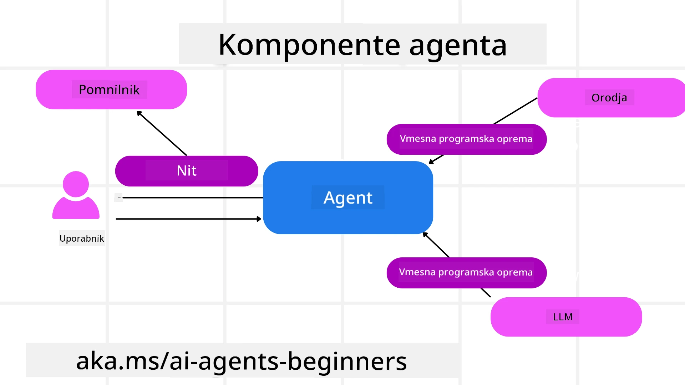

# Raziščemo Microsoft Agent Framework


### Uvod

Ta lekcija bo zajemala:

- Razumevanje Microsoft Agent Framework: ključne funkcije in vrednost  
- Raziščite ključne koncepte Microsoft Agent Framework
- Napredni MAF vzorci: poteki dela, middleware in pomnilnik

## Cilji učenja

Po zaključku te lekcije boste znali:

- Zgraditi produkcijsko pripravljene AI agente z uporabo Microsoft Agent Framework
- Uporabiti osnovne funkcije Microsoft Agent Framework za vaše agentske primere uporabe
- Uporabiti napredne vzorce, vključno s poteki dela, middleware in opazovanjem

## Primeri kode

Primeri kode za [Microsoft Agent Framework (MAF)](https://aka.ms/ai-agents-beginners/agent-framewrok) lahko najdete v tem repozitoriju v datotekah `xx-python-agent-framework` in `xx-dotnet-agent-framework`.

## Razumevanje Microsoft Agent Framework


[Microsoft Agent Framework (MAF)](https://aka.ms/ai-agents-beginners/agent-framewrok) je Microsoftov enoten okvir za gradnjo AI agentov. Ponuja prilagodljivost za reševanje širokega spektra agentskih primerov uporabe, ki jih srečamo tako v produkcijskem kot raziskovalnem okolju, vključno z:

- **Zaporedna orkestracija agentov** v scenarijih, kjer so potrebni postopni poteki dela.
- **Soočasna orkestracija** v scenarijih, kjer morajo agenti opraviti naloge hkrati.
- **Orkestracija skupinskega klepeta** v scenarijih, kjer agenti sodelujejo pri eni nalogi.
- **Predaja nalog** v scenarijih, kjer agenti predajajo nalogo drug drugemu, ko se podnaloge dokončajo.
- **Magnetna orkestracija** v scenarijih, kjer upravljalski agent ustvarja in spreminja seznam nalog ter usklajuje podagentov za dokončanje naloge.

Za zagotavljanje AI agentov v produkciji ima MAF vključene funkcije za:

- **Opazovanje** z uporabo OpenTelemetry, kjer se vsako dejanje AI agenta, vključno z uporabo orodij, koraki orkestracije, tokovi razmišljanja in spremljanjem zmogljivosti preko grafikonov Microsoft Foundry, beleži.
- **Varnost** z izvajanjem agentov nativeno na Microsoft Foundry, ki vključuje varnostne kontrole, kot so dostop na osnovi vlog, upravljanje zasebnih podatkov in vgrajena varnost vsebin.
- **Vzdržljivost** saj se niti agentov in poteki dela lahko začasno ustavijo, nadaljujejo in obnovijo po napakah, kar omogoča daljše izvajanje procesov.
- **Nadzor** saj so podprti poteki dela z vključkom človeka, kjer so naloge označene kot zahtevajo odobritev človeka.

Microsoft Agent Framework je tudi osredotočen na interoperabilnost z:

- **Neodvisnostjo od oblaka** - agenti lahko tečejo v vsebnikih, lokalno in v različnih oblakih.
- **Neodvisnostjo od ponudnika** - agenti se lahko ustvarijo z vašo priljubljeno SDK, vključno z Azure OpenAI in OpenAI.
- **Integracijo odprtih standardov** - agenti lahko uporabljajo protokole, kot so Agent-to-Agent (A2A) in Model Context Protocol (MCP), za odkrivanje in uporabo drugih agentov in orodij.
- **Vtičniki in priključki** - vzpostavljene so povezave do podatkovnih in pomnilniških storitev, kot so Microsoft Fabric, SharePoint, Pinecone in Qdrant.

Poglejmo, kako se te funkcije uporabljajo na nekaterih ključnih konceptih Microsoft Agent Framework.

## Ključni koncepti Microsoft Agent Framework

### Agenti



**Ustvarjanje agentov**

Ustvarjanje agenta poteka z definiranjem inferenčne storitve (LLM ponudnika), niza navodil za AI agenta, ki jih mora slediti, in dodeljenim `imenom`:

```python
agent = AzureOpenAIChatClient(credential=AzureCliCredential()).create_agent( instructions="You are good at recommending trips to customers based on their preferences.", name="TripRecommender" )
```

Zgoraj je uporabljen `Azure OpenAI`, vendar je mogoče agente ustvariti z različnimi storitvami, vključno z `Microsoft Foundry Agent Service`:

```python
AzureAIAgentClient(async_credential=credential).create_agent( name="HelperAgent", instructions="You are a helpful assistant." ) as agent
```

OpenAI `Responses`, `ChatCompletion` API-ji

```python
agent = OpenAIResponsesClient().create_agent( name="WeatherBot", instructions="You are a helpful weather assistant.", )
```

```python
agent = OpenAIChatClient().create_agent( name="HelpfulAssistant", instructions="You are a helpful assistant.", )
```

ali [MiniMax](https://platform.minimaxi.com/), ki ponuja API združljiv z OpenAI z velikimi kontekstnimi okni (do 204K žetonov):

```python
agent = OpenAIChatClient(base_url="https://api.minimax.io/v1", api_key=os.environ["MINIMAX_API_KEY"], model_id="MiniMax-M2.7").create_agent( name="HelpfulAssistant", instructions="You are a helpful assistant.", )
```

ali oddaljeni agenti z uporabo A2A protokola:

```python
agent = A2AAgent( name=agent_card.name, description=agent_card.description, agent_card=agent_card, url="https://your-a2a-agent-host" )
```

**Zagon agentov**

Agente zaženemo z metodama `.run` ali `.run_stream` za ne-streaming ali streaming odgovore.

```python
result = await agent.run("What are good places to visit in Amsterdam?")
print(result.text)
```

```python
async for update in agent.run_stream("What are the good places to visit in Amsterdam?"):
    if update.text:
        print(update.text, end="", flush=True)

```

Vsak zagon agenta lahko ima tudi možnosti za prilagajanje parametrov, kot so `max_tokens`, ki jih agent uporablja, `tools`, ki jih lahko agent kliče, in celo sam `model`, ki ga agent uporablja.

To je koristno v primerih, kjer so za dokončanje naloge uporabnika potrebni specifični modeli ali orodja.

**Orodja**

Orodja je mogoče definirati tako pri definiranju agenta:

```python
def get_attractions( location: Annotated[str, Field(description="The location to get the top tourist attractions for")], ) -> str: """Get the top tourist attractions for a given location.""" return f"The top attractions for {location} are." 


# Ko neposredno ustvarjate ChatAgenta

agent = ChatAgent( chat_client=OpenAIChatClient(), instructions="You are a helpful assistant", tools=[get_attractions]

```

kot tudi med zagonom agenta:

```python

result1 = await agent.run( "What's the best place to visit in Seattle?", tools=[get_attractions] # Orodje zagotovljeno samo za ta zagon )
```

**Niti agentov**

Niti agentov se uporabljajo za upravljanje pogovorov z več obrati. Niti lahko ustvarimo bodisi z:

- Uporabo `get_new_thread()`, ki omogoča shranjevanje nita skozi čas
- Samodejnim ustvarjanjem nita med zagonom agenta, pri čemer nit traja samo med trenutnim zagonom.

Za ustvarjanje nita koda izgleda tako:

```python
# Ustvari novo nit.
thread = agent.get_new_thread() # Zaženi agenta z nitjo.
response = await agent.run("Hello, I am here to help you book travel. Where would you like to go?", thread=thread)

```

Nit lahko nato serializiramo za shranjevanje in kasnejšo uporabo:

```python
# Ustvari novo nit.
thread = agent.get_new_thread() 

# Zaženi agenta z nitjo.

response = await agent.run("Hello, how are you?", thread=thread) 

# Serializiraj nit za shranjevanje.

serialized_thread = await thread.serialize() 

# Deserializiraj stanje niti po nalaganju iz shrambe.

resumed_thread = await agent.deserialize_thread(serialized_thread)
```

**Agent Middleware**

Agenti komunicirajo z orodji in LLM-ji za dokončanje nalog uporabnikov. V določenih scenarijih želimo izvesti ali slediti interakcijam med temi. Agent middleware nam to omogoča preko:

*Funkcijskega middleware*

Ta middleware nam omogoča izvajanje akcije med agentom in funkcijo/orodjem, ki ga agent kliče. Primer uporabe je beleženje poziva funkcije.

V spodnji kodi `next` določa, ali se mora poklicati naslednji middleware ali dejanska funkcija.

```python
async def logging_function_middleware(
    context: FunctionInvocationContext,
    next: Callable[[FunctionInvocationContext], Awaitable[None]],
) -> None:
    """Function middleware that logs function execution."""
    # Predobdelava: Zabeleži pred izvajanjem funkcije
    print(f"[Function] Calling {context.function.name}")

    # Nadaljuj na naslednji vmesni sloj ali izvedbo funkcije
    await next(context)

    # Povratna obdelava: Zabeleži po izvedbi funkcije
    print(f"[Function] {context.function.name} completed")
```

*Klepetalni middleware*

Ta middleware nam omogoča izvajanje ali beleženje akcije med agentom in zahtevami do LLM.

Vsebuje pomembne informacije, kot so `messages`, ki se pošiljajo storitvi AI.

```python
async def logging_chat_middleware(
    context: ChatContext,
    next: Callable[[ChatContext], Awaitable[None]],
) -> None:
    """Chat middleware that logs AI interactions."""
    # Predobdelava: Zabeleži pred klicem AI
    print(f"[Chat] Sending {len(context.messages)} messages to AI")

    # Nadaljuj do naslednjega vmesnega sloja ali AI storitve
    await next(context)

    # Poobdelava: Zabeleži po odgovoru AI
    print("[Chat] AI response received")

```

**Agentov pomnilnik**

Kot je omenjeno v lekciji `Agentic Memory`, je pomnilnik pomemben element, ki omogoča agentu delovanje v različnih kontekstih. MAF ponuja več različnih vrst pomnilnikov:

*Shranjevanje v pomnilniku*

To je pomnilnik, shranjen v nitih med izvajanjem aplikacije.

```python
# Ustvari novo nit.
thread = agent.get_new_thread() # Zaženi agenta z nitjo.
response = await agent.run("Hello, I am here to help you book travel. Where would you like to go?", thread=thread)
```

*Vztrajne sporočilne zbirke*

Ta pomnilnik se uporablja za shranjevanje zgodovine pogovora med različnimi sejami. Definiran je z uporabo `chat_message_store_factory`:

```python
from agent_framework import ChatMessageStore

# Ustvari prilagojeno shrambo sporočil
def create_message_store():
    return ChatMessageStore()

agent = ChatAgent(
    chat_client=OpenAIChatClient(),
    instructions="You are a Travel assistant.",
    chat_message_store_factory=create_message_store
)

```

*Dinamični pomnilnik*

Ta pomnilnik se doda v kontekst pred zagonom agentov. Ti pomnilniki so lahko shranjeni v zunanjih storitvah, kot je mem0:

```python
from agent_framework.mem0 import Mem0Provider

# Uporaba Mem0 za napredne zmogljivosti pomnilnika
memory_provider = Mem0Provider(
    api_key="your-mem0-api-key",
    user_id="user_123",
    application_id="my_app"
)

agent = ChatAgent(
    chat_client=OpenAIChatClient(),
    instructions="You are a helpful assistant with memory.",
    context_providers=memory_provider
)

```

**Opazovanje agentov**

Opazovanje je pomembno za gradnjo zanesljivih in vzdržljivih agentskih sistemov. MAF se integrira z OpenTelemetry za zagotavljanje sledenja in meritev za boljše opazovanje.

```python
from agent_framework.observability import get_tracer, get_meter

tracer = get_tracer()
meter = get_meter()
with tracer.start_as_current_span("my_custom_span"):
    # naredi nekaj
    pass
counter = meter.create_counter("my_custom_counter")
counter.add(1, {"key": "value"})
```

### Poteki dela

MAF ponuja poteke dela, ki so vnaprej določeni koraki za dokončanje naloge in vključujejo AI agente kot komponente v teh korakih.

Poteki dela so sestavljeni iz različnih komponent, ki omogočajo boljši nadzor poteka. Poteki dela prav tako omogočajo **orkestracijo več agentov** in **zapiske stanja** za shranjevanje stanj poteka dela.

Glavne komponente poteka dela so:

**Izvrševalci**

Izvrševalci prejmejo vhodna sporočila, opravijo svoje naloge in nato proizvedejo izhodno sporočilo. To potek dela premakne naprej k dokončanju večje naloge. Izvrševalci so lahko AI agenti ali prilagojena logika.

**Povezave (Edges)**

Povezave se uporabljajo za definiranje toka sporočil v poteku dela. Te so lahko:

*Neposredne povezave* - enostavne povezave ena na ena med izvrševalci:

```python
from agent_framework import WorkflowBuilder

builder = WorkflowBuilder()
builder.add_edge(source_executor, target_executor)
builder.set_start_executor(source_executor)
workflow = builder.build()
```

*Pogojne povezave* - aktivirajo se po izpolnitvi določenega pogoja. Na primer, ko hotelske sobe niso na voljo, lahko izvrševalec predlaga druge možnosti.

*Preklopne povezave* - usmerjajo sporočila različnim izvrševalcem glede na definirane pogoje. Na primer, če ima potnik prednostni dostop, bodo njegove naloge obdelane v drugem poteku dela.

*Razvejane povezave* - pošljejo eno sporočilo več ciljem.

*Združene povezave* - zberejo več sporočil od različnih izvrševalcev in jih pošljejo enemu cilju.

**Dogodki**

Za boljše opazovanje potekov dela MAF ponuja vgrajene dogodke za izvajanje, vključno z:

- `WorkflowStartedEvent`  - Začetek izvajanja poteka dela
- `WorkflowOutputEvent` - Potek dela proizvede izhod
- `WorkflowErrorEvent` - Pri izvajanju poteka dela pride do napake
- `ExecutorInvokeEvent`  - Izvrševalec začne obdelavo
- `ExecutorCompleteEvent`  -  Izvrševalec konča obdelavo
- `RequestInfoEvent` - Izda se zahteva

## Napredni MAF vzorci

Zgornji oddelki zajemajo ključne koncepte Microsoft Agent Framework. Ko ustvarjate bolj kompleksne agente, upoštevajte te napredne vzorce:

- **Sestava middleware**: Povežite več middleware handlerjev (beleženje, avtorizacija, omejevanje hitrosti) z uporabo funkcijskega in klepetalnega middleware za natančen nadzor vedenja agenta.
- **Zapiske poteka dela**: Uporabite dogodke poteka dela in serializacijo za shranjevanje in nadaljevanje dolgo trajajočih procesov agentov.
- **Dinamična izbira orodij**: Združite RAG preko opisov orodij z registracijo orodij v MAF, da prikažete le ustrezna orodja za posamezen poizvedbo.
- **Predaja več agentov**: Uporabite povezave poteka dela in pogojno usmerjanje za orkestracijo predaj nalog med specializiranimi agenti.

## Primeri kode

Primeri kode za Microsoft Agent Framework lahko najdete v tem repozitoriju v datotekah `xx-python-agent-framework` in `xx-dotnet-agent-framework`.

## Imate več vprašanj o Microsoft Agent Framework?

Pridružite se [Microsoft Foundry Discord](https://aka.ms/ai-agents/discord), da se srečate z drugimi učenci, obiskujete uradne ure in dobite odgovore na vprašanja o AI agentih.

---

<!-- CO-OP TRANSLATOR DISCLAIMER START -->
**Omejitev odgovornosti**:  
Ta dokument je bil preveden z uporabo AI prevajalske storitve [Co-op Translator](https://github.com/Azure/co-op-translator). Čeprav si prizadevamo za natančnost, vas prosimo, da upoštevate, da avtomatizirani prevodi lahko vsebujejo napake ali netočnosti. Izvirni dokument v njegovem izvirnem jeziku velja za avtoritativni vir. Za kritične informacije priporočamo strokovni človeški prevod. Za kakršne koli nesporazume ali napačne interpretacije, ki izhajajo iz uporabe tega prevoda, ne odgovarjamo.
<!-- CO-OP TRANSLATOR DISCLAIMER END -->