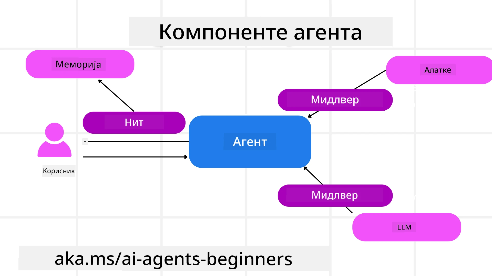

# Истраживање Microsoft Agent Framework


### Увод

У овој лекцији ћете научити:

- Разумевање Microsoft Agent Framework: Кључне карактеристике и вредност  
- Истраживање кључних концепата Microsoft Agent Framework
- Напредни MAF обрасци: радна уверења, посредници и меморија

## Циљеви учења

Након завршетка ове лекције, знаћете како да:

- Изградите AI агенте спремне за производњу користећи Microsoft Agent Framework
- Примените основне карактеристике Microsoft Agent Framework у вашим агентским случајевима коришћења
- Користите напредне обрасце као што су радна уверења, посредници и посматрање

## Примери кода

Примери кода за [Microsoft Agent Framework (MAF)](https://aka.ms/ai-agents-beginners/agent-framewrok) могу се пронаћи у овом репозиторијуму у фајловима `xx-python-agent-framework` и `xx-dotnet-agent-framework`.

## Разумевање Microsoft Agent Framework


[Microsoft Agent Framework (MAF)](https://aka.ms/ai-agents-beginners/agent-framewrok) је Microsoft-ов јединствени оквир за израду AI агената. Он нуди флексибилност за решавање широког спектра агентских случајева коришћења који се виде у продукцијским и истраживачким окружењима, укључујући:

- **Секвенцијална оркестрација агената** у сценаријима где су потребни корак-по-корак радни токови.
- **Паралелна оркестрација** у сценаријима где агенти морају истовремено да заврше задатке.
- **Оркестрација групног ћаскања** у сценаријима где агенти могу заједно сарађивати на једном задатку.
- **Оркестрација преноса задатака** у сценаријима где агенти препуштају задатак један другом како се подзадаци завршавају.
- **Магнетна оркестрација** у сценаријима где менаџер агент креира и модификује листу задатака и управља координацијом подагената да заврше задатак.

Да би се обезбедили AI агенти у продукцији, MAF такође укључује карактеристике за:

- **Посматрање** кроз коришћење OpenTelemetry где свака акција AI агента укључујући позив алата, кораке оркестрације, токове размишљања и праћење перформанси преко Microsoft Foundry контролних табли.
- **Безбедност** хостујући агенте нативно на Microsoft Foundry који укључује контроле безбедности као што су приступ базиран на улогама, руковање приватним подацима и уграђена безбедност садржаја.
- **Трајност** јер нитови агената и радни токови могу паузирати, наставити и опоравити се од грешака што омогућава дуже процесима.
- **Контрола** јер су дозвољени радни токови са људским надзором где су задаци означени као захтевају људско одобрење.

Microsoft Agent Framework је такође усмерен на интероперабилност кроз:

- **Облак-агностичност** - Агенти могу радити у контејнерима, локално и на више различитих облака.
- **Провајдер-агностичност** - Агенти могу бити креирани вашим омиљеним SDK-ом, укључујући Azure OpenAI и OpenAI.
- **Интеграцију отворених стандарда** - Агенти могу користити протоколе као што су Agent-to-Agent (A2A) и Model Context Protocol (MCP) за откривање и коришћење других агената и алата.
- **Плъгине и конекторе** - Везе се могу успоставити са сервисима података и меморије као што су Microsoft Fabric, SharePoint, Pinecone и Qdrant.

Погледајмо како се ове карактеристике примењују на неке основне концепте Microsoft Agent Framework.

## Кључни концепти Microsoft Agent Framework

### Агенти



**Креирање агената**

Креирање агената се врши дефинисањем сервисa за закључивање (LLM провајдера), скупа инструкција које AI агент треба да следи и додељеног `имена`:

```python
agent = AzureOpenAIChatClient(credential=AzureCliCredential()).create_agent( instructions="You are good at recommending trips to customers based on their preferences.", name="TripRecommender" )
```

Горњи пример користи `Azure OpenAI` али агенти могу бити креирани користећи разне сервисе укључујући `Microsoft Foundry Agent Service`:

```python
AzureAIAgentClient(async_credential=credential).create_agent( name="HelperAgent", instructions="You are a helpful assistant." ) as agent
```

OpenAI `Responses`, `ChatCompletion` API-ји

```python
agent = OpenAIResponsesClient().create_agent( name="WeatherBot", instructions="You are a helpful weather assistant.", )
```

```python
agent = OpenAIChatClient().create_agent( name="HelpfulAssistant", instructions="You are a helpful assistant.", )
```

или [MiniMax](https://platform.minimaxi.com/), који пружа OpenAI-компатибилан API са великим контекстуалним прозорима (до 204К токена):

```python
agent = OpenAIChatClient(base_url="https://api.minimax.io/v1", api_key=os.environ["MINIMAX_API_KEY"], model_id="MiniMax-M2.7").create_agent( name="HelpfulAssistant", instructions="You are a helpful assistant.", )
```

или даљинске агенте преко A2A протокола:

```python
agent = A2AAgent( name=agent_card.name, description=agent_card.description, agent_card=agent_card, url="https://your-a2a-agent-host" )
```

**Покретање агената**

Агенти се покрећу коришћењем метода `.run` или `.run_stream` за нестримоване или стримоване одговоре.

```python
result = await agent.run("What are good places to visit in Amsterdam?")
print(result.text)
```

```python
async for update in agent.run_stream("What are the good places to visit in Amsterdam?"):
    if update.text:
        print(update.text, end="", flush=True)

```

Свако покретање агента такође може имати опције за прилагођавање параметара као што су `max_tokens` које агент користи, `tools` које агент може позивати и чак `model` сам који се користи за агента.

Ово је корисно у случајевима када су потребни одређени модели или алати за завршетак корисничког захтева.

**Алатке**

Алатке се могу дефинисати приликом дефинисања агента:

```python
def get_attractions( location: Annotated[str, Field(description="The location to get the top tourist attractions for")], ) -> str: """Get the top tourist attractions for a given location.""" return f"The top attractions for {location} are." 


# Када се директно креира ChatAgent

agent = ChatAgent( chat_client=OpenAIChatClient(), instructions="You are a helpful assistant", tools=[get_attractions]

```

а такође и приликом покретања агента:

```python

result1 = await agent.run( "What's the best place to visit in Seattle?", tools=[get_attractions] # Алат обезбеђен само за ову употребу )
```

**Нитови агената**

Нитови агената се користе за управљање више-окретним разговорима. Нитови могу бити креирани на два начина:

- Коришћењем `get_new_thread()` који омогућава да нит буде сачувана током времена
- Аутоматским креирањем нити приликом покретања агента која траје само током тренутног покретања.

Креирање нити изгледа овако:

```python
# Креирајте нови нит.
thread = agent.get_new_thread() # Покрените агента са нитју.
response = await agent.run("Hello, I am here to help you book travel. Where would you like to go?", thread=thread)

```

Затим нит можете серијализовати да бисте је сачували за каснију употребу:

```python
# Креирај нови нит.
thread = agent.get_new_thread() 

# Покрени агента са нитима.

response = await agent.run("Hello, how are you?", thread=thread) 

# Сериализуј нит за чување.

serialized_thread = await thread.serialize() 

# Десериализуј стање нити након учитавања из складишта.

resumed_thread = await agent.deserialize_thread(serialized_thread)
```

**Посредници агената**

Агенти комуницирају са алаткама и LLM-овима да би завршили корисничке задатке. У неким сценаријима желимо да извршимо или пратимо између ове интеракције. Посредници агената нам омогућавају да то урадимо кроз:

*Функцијски посредници*

Ови посредници нам омогућавају да извршимо радњу између агента и функције/алата које ће агент позвати. Пример коришћења је када пожелите да реализујете неку евиденцију о позиву функције.

У коду испод, `next` дефинише да ли ће бити позван следећи посредник или сама функција.

```python
async def logging_function_middleware(
    context: FunctionInvocationContext,
    next: Callable[[FunctionInvocationContext], Awaitable[None]],
) -> None:
    """Function middleware that logs function execution."""
    # Пре-обрада: Запиши пре извршења функције
    print(f"[Function] Calling {context.function.name}")

    # Настави на следећи middleware или извршење функције
    await next(context)

    # Пост-обрада: Запиши након извршења функције
    print(f"[Function] {context.function.name} completed")
```

*Ћаскање посредници*

Ови посредници омогућавају извршавање или евидентирање радње између агента и захтева ка LLM-у.

Ово садржи важне информације као што су `messages` које се шаљу AI сервису.

```python
async def logging_chat_middleware(
    context: ChatContext,
    next: Callable[[ChatContext], Awaitable[None]],
) -> None:
    """Chat middleware that logs AI interactions."""
    # Претходна обрада: Лог пре позива вештачке интелигенције
    print(f"[Chat] Sending {len(context.messages)} messages to AI")

    # Наставите на следећи посреднички софтвер или услугу вештачке интелигенције
    await next(context)

    # Након обраде: Лог након одговора вештачке интелигенције
    print("[Chat] AI response received")

```

**Меморија агената**

Као што је описано у лекцији `Agentic Memory`, меморија је важан елемент који омогућава агенту да ради у различитим контекстима. MAF нуди неколико различитих типова меморије:

*Складиштење у меморији*

Ово је меморија сачувана у нитима током рада апликације.

```python
# Креирај нови нит.
thread = agent.get_new_thread() # Покрени агента са нити.
response = await agent.run("Hello, I am here to help you book travel. Where would you like to go?", thread=thread)
```

*Постојеће поруке*

Ова меморија се користи за чување историје разговора преко различитих сесија. Дефинише се помоћу фабрике `chat_message_store_factory`:

```python
from agent_framework import ChatMessageStore

# Креирајте прилагођену продавницу порука
def create_message_store():
    return ChatMessageStore()

agent = ChatAgent(
    chat_client=OpenAIChatClient(),
    instructions="You are a Travel assistant.",
    chat_message_store_factory=create_message_store
)

```

*Динамична меморија*

Ова меморија се додаје у контекст пре него што агенти почну да раде. Ове меморије могу бити сачуване у екстерним сервисима као мем0:

```python
from agent_framework.mem0 import Mem0Provider

# Коришћење Mem0 за напредне меморијске могућности
memory_provider = Mem0Provider(
    api_key="your-mem0-api-key",
    user_id="user_123",
    application_id="my_app"
)

agent = ChatAgent(
    chat_client=OpenAIChatClient(),
    instructions="You are a helpful assistant with memory.",
    context_providers=memory_provider
)

```

**Посматрање агената**

Посматрање је важно за израду поузданих и лако одрживих агентских система. MAF се интегрише са OpenTelemetry-ом како би обезбедио праћење и метре за боље посматрање.

```python
from agent_framework.observability import get_tracer, get_meter

tracer = get_tracer()
meter = get_meter()
with tracer.start_as_current_span("my_custom_span"):
    # уради нешто
    pass
counter = meter.create_counter("my_custom_counter")
counter.add(1, {"key": "value"})
```

### Радни токови

MAF нуди радна уверења која су унапред дефинисани кораци за завршетак задатка и укључују AI агенте као компоненте тих корака.

Радни токови се састоје из различитих елемената који омогућавају бољу контролу тока. Такође омогућавају **мулти-агентску оркестрацију** и **чување стања** ради спремања статуса радног тока.

Основни елементи радног тока су:

**Извршиоци**

Извршиоци примају улазне поруке, извршавају додељене задатке, а затим производе излазну поруку. Ово помера радни ток напред ка завршетку већег задатка. Извршиоци могу бити AI агенти или прилагођена логика.

**Везе**

Везе се користе за дефинисање тока порука у радном току. Оне могу бити:

*Директне везе* - Једноставне везе један-на-један између извршилаца:

```python
from agent_framework import WorkflowBuilder

builder = WorkflowBuilder()
builder.add_edge(source_executor, target_executor)
builder.set_start_executor(source_executor)
workflow = builder.build()
```

*Условне везе* - Активирају се након што се испуни одређени услов. На пример, када собе у хотелу нису доступне, извршилац може предложити друге опције.

*Штафетне везе* - Рутрирају поруке ка различитим извршиоцима на основу дефинисаних услова. На пример, ако путнички корисник има приоритетни приступ, задаци ће бити обрађени кроз други радни ток.

*Везе распрскавања* - Слање једне поруке више одредишта.

*Везе прикупљања* - Прикупљање више порука од различитих извршиоца и слање једном одредишту.

**Догађаји**

Да би се обезбедило боље посматрање радних токова, MAF нуди уграђене догађаје извршења укључујући:

- `WorkflowStartedEvent`  - Почетак извршења радног тока
- `WorkflowOutputEvent` - Радни ток производи излаз
- `WorkflowErrorEvent` - Радни ток има грешку
- `ExecutorInvokeEvent`  - Извршилац почиње обраду
- `ExecutorCompleteEvent`  - Извршилац завршава обраду
- `RequestInfoEvent` - Поднет је захтев

## Напредни MAF обрасци

Горњи делови покривају кључне концепте Microsoft Agent Framework. Како градите сложеније агенте, ево неких напредних образаца које треба размотрити:

- **Композиција посредника**: Ланац више посредника (логовање, аутентификација, ограничење брзине) користећи функцијски и ћаскање посреднике ради фина контроле понашања агента.
- **Чување стања радног тока**: Користите догађаје радног тока и серијализацију за спремање и наставак дуготрајних процеса агената.
- **Динамичан избор алата**: Комбинујте RAG преко описа алата са регистрацијом алата у MAF-у да бисте приказали само релевантне алате за сваку претрагу.
- **Пренос између више агената**: Користите везе радног тока и условно рутирање за оркестрацију преноса између специјализованих агената.

## Примери кода

Примери кода за Microsoft Agent Framework могу се пронаћи у овом репозиторијуму у фајловима `xx-python-agent-framework` и `xx-dotnet-agent-framework`.

## Имате још питања о Microsoft Agent Framework?

Придружите се [Microsoft Foundry Discord](https://aka.ms/ai-agents/discord) да упознате друге ученике, посетите радне сате и добијете одговоре на ваша питања о AI агентима.

---

<!-- CO-OP TRANSLATOR DISCLAIMER START -->
**Ограничење одговорности**:
Овај документ је преведен коришћењем AI услуге за превођење [Co-op Translator](https://github.com/Azure/co-op-translator). Иако се трудимо да буде тачно, молимо имајте у виду да аутоматски преводи могу садржати грешке или нетачности. Оригинални документ на његовом изворном језику треба сматрати ауторитетним извором. За критичне информације препоручује се професионални људски превод. Не сносимо одговорност за било каква неспоразума или погрешна тумачења која произлазе из коришћења овог превода.
<!-- CO-OP TRANSLATOR DISCLAIMER END -->