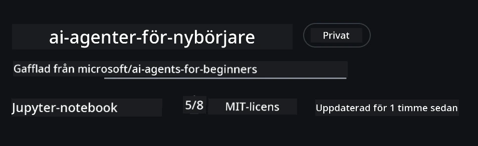
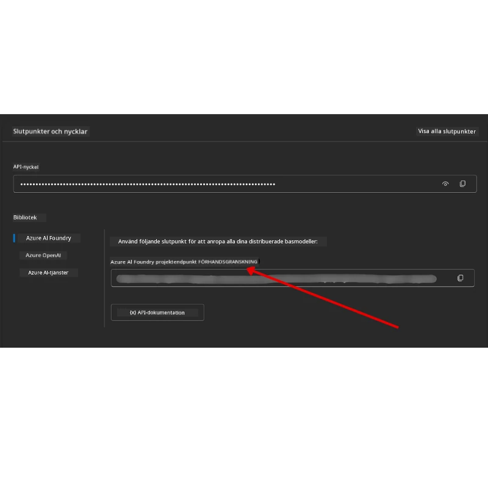

# Kursinställning

## Introduktion

Denna lektion täcker hur du kör kodexemplen i denna kurs.

## Gå med andra elever och få hjälp

Innan du börjar klona ditt repo, gå med i [AI Agents For Beginners Discord-kanalen](https://aka.ms/ai-agents/discord) för att få hjälp med installation, ställa frågor om kursen eller för att ansluta med andra elever.

## Klona eller Forka detta repo

För att börja, klona eller forka GitHub-repositoriet. Detta gör en egen version av kursmaterialet så att du kan köra, testa och justera koden!

Detta kan göras genom att klicka på länken för att <a href="https://github.com/microsoft/ai-agents-for-beginners/fork" target="_blank">forka repot</a>

Du bör nu ha din egen forkade version av denna kurs på följande länk:



### Shallow Clone (rekommenderas för workshop / Codespaces)

  >Hela repot kan vara stort (~3 GB) när du laddar ner full historik och alla filer. Om du bara deltar i workshopen eller bara behöver några lektioners mappar, undviker en shallow clone (eller spars clone) det mesta av denna nedladdning genom att trunkera historiken och/eller hoppa över blobs.

#### Snabb shallow clone — minimal historik, alla filer

Ersätt `<your-username>` i nedanstående kommandon med din fork-URL (eller upstream-URL om du föredrar det).

För att klona endast senaste commit-historiken (liten nedladdning):

```bash|powershell
git clone --depth 1 https://github.com/<your-username>/ai-agents-for-beginners.git
```

För att klona en specifik branch:

```bash|powershell
git clone --depth 1 --branch <branch-name> https://github.com/<your-username>/ai-agents-for-beginners.git
```

#### Partiell (sparse) clone — minimal blobs + endast utvalda mappar

Det här använder partial clone och sparse-checkout (kräver Git 2.25+ och rekommenderas med modern Git med partial clone-support):

```bash|powershell
git clone --depth 1 --filter=blob:none --sparse https://github.com/<your-username>/ai-agents-for-beginners.git
```

Navigera in i repo-mappen:

```bash|powershell
cd ai-agents-for-beginners
```

Specificera sedan vilka mappar du vill ha (exemplet nedan visar två mappar):

```bash|powershell
git sparse-checkout set 00-course-setup 01-intro-to-ai-agents
```

Efter kloning och verifiering av filer, om du bara behöver filer och vill frigöra utrymme (ingen git-historik), ta bort repots metadata (💀irreversibelt — du förlorar all Git-funktionalitet: inga commits, pulls, pushes eller historiktillgång).

```bash
# zsh/bash
rm -rf .git
```

```powershell
# PowerShell
Remove-Item -Recurse -Force .git
```

#### Använda GitHub Codespaces (rekommenderas för att undvika stora lokala nedladdningar)

- Skapa en ny Codespace för detta repo via [GitHub UI](https://github.com/codespaces).  

- I terminalen i den nya codespacen, kör ett av shallow/sparse clone-kommandona ovan för att bara ta in de lektionmappar du behöver i Codespace-arbetsytan.
- Valfritt: efter kloning inne i Codespaces, ta bort .git för att återvinna extra utrymme (se borttagningskommandon ovan).
- Obs: Om du föredrar att öppna repot direkt i Codespaces (utan extra kloning), var medveten om att Codespaces bygger upp devcontainer-miljön och kan ändå provisionera mer än du behöver. Att klona en shallow kopia inuti en ny Codespace ger dig mer kontroll över diskutrymme.

#### Tips

- Ersätt alltid klonings-URL med din fork om du vill redigera/commita.
- Om du senare behöver mer historik eller filer kan du hämta dem eller justera sparse-checkout för att inkludera fler mappar.

## Köra koden

Den här kursen erbjuder en serie Jupyter Notebooks som du kan köra för att få praktisk erfarenhet av att bygga AI-agenter.

Kodexemplen använder **Microsoft Agent Framework (MAF)** med `AzureAIProjectAgentProvider`, som ansluter till **Azure AI Agent Service V2** (Responses API) via **Microsoft Foundry**.

Alla Python notebooks är märkta `*-python-agent-framework.ipynb`.

## Krav

- Python 3.12+
  - **OBS:** Om du inte har Python3.12 installerat, se till att installera det. Skapa sedan ditt virtuella miljö med python3.12 för att säkerställa att rätt versioner installeras från requirements.txt-filen.
  
    >Exempel

    Skapa Python virtuell miljö-mapp:

    ```bash|powershell
    python -m venv venv
    ```

    Aktivera sedan venv-miljön för:

    ```bash
    # zsh/bash
    source venv/bin/activate
    ```
  
    ```dos
    # Command Prompt for Windows
    venv\Scripts\activate
    ```

- .NET 10+: För exempel som använder .NET, se till att du installerat [.NET 10 SDK](https://dotnet.microsoft.com/download/dotnet/10.0) eller senare. Kontrollera sedan din installerade .NET SDK version:

    ```bash|powershell
    dotnet --list-sdks
    ```

- **Azure CLI** — Krävs för autentisering. Installera från [aka.ms/installazurecli](https://aka.ms/installazurecli).
- **Azure Subscription** — För åtkomst till Microsoft Foundry och Azure AI Agent Service.
- **Microsoft Foundry Project** — Ett projekt med en driftsatt modell (t.ex. `gpt-4o`). Se [Steg 1](#steg-1-skapa-ett-microsoft-foundry-projekt) nedan.

Vi har inkluderat en `requirements.txt`-fil i roten av detta repo som innehåller alla nödvändiga Pythonpaket för att köra kodexemplen.

Du kan installera dem genom att köra följande kommando i terminalen i repo-root:

```bash|powershell
pip install -r requirements.txt
```

Vi rekommenderar att skapa en Python virtuell miljö för att undvika konflikter och problem.

## Konfigurera VSCode

Se till att du använder rätt Python-version i VSCode.


## Ställ in Microsoft Foundry och Azure AI Agent Service

### Steg 1: Skapa ett Microsoft Foundry-projekt

Du behöver en Azure AI Foundry **hub** och ett **projekt** med en driftsatt modell för att köra notebooks.

1. Gå till [ai.azure.com](https://ai.azure.com) och logga in med ditt Azure-konto.
2. Skapa en **hub** (eller använd en befintlig). Se: [Hub resurser översikt](https://learn.microsoft.com/azure/ai-foundry/concepts/ai-resources).
3. Inuti hubben, skapa ett **projekt**.
4. Driftsätt en modell (t.ex. `gpt-4o`) från **Models + Endpoints** → **Deploy model**.

### Steg 2: Hämta ditt projektendpoint och modell-deploynamn

Från ditt projekt i Microsoft Foundry-portalen:

- **Projektendpoint** — Gå till **Overview**-sidan och kopiera endpoint-URL:en.



- **Modell-deploymentnamn** — Gå till **Models + Endpoints**, välj din driftsatta modell och notera **Deployment name** (t.ex. `gpt-4o`).

### Steg 3: Logga in i Azure med `az login`

Alla notebooks använder **`AzureCliCredential`** för autentisering — inga API-nycklar att hantera. Detta kräver att du är inloggad via Azure CLI.

1. **Installera Azure CLI** om du inte redan gjort det: [aka.ms/installazurecli](https://aka.ms/installazurecli)

2. **Logga in** genom att köra:

    ```bash|powershell
    az login
    ```

    Eller om du är i en fjärr-/Codespace-miljö utan webbläsare:

    ```bash|powershell
    az login --use-device-code
    ```

3. **Välj din prenumeration** om du blir tillfrågad — välj den som innehåller ditt Foundry-projekt.

4. **Verifiera** att du är inloggad:

    ```bash|powershell
    az account show
    ```

> **Varför `az login`?** Notebooks autentiserar med `AzureCliCredential` från `azure-identity`-paketet. Detta innebär att din Azure CLI-session tillhandahåller autentiseringsuppgifterna — inga API-nycklar eller hemligheter i din `.env`-fil. Detta är en [säkerhetsbästa praxis](https://learn.microsoft.com/azure/developer/ai/keyless-connections).

### Steg 4: Skapa din `.env`-fil

Kopiera exempel-filen:

```bash
# zsh/bash
cp .env.example .env
```

```powershell
# PowerShell
Copy-Item .env.example .env
```

Öppna `.env` och fyll i dessa två värden:

```env
AZURE_AI_PROJECT_ENDPOINT=https://<your-project>.services.ai.azure.com/api/projects/<your-project-id>
AZURE_AI_MODEL_DEPLOYMENT_NAME=gpt-4o
```

| Variabel | Var du hittar den |
|----------|-------------------|
| `AZURE_AI_PROJECT_ENDPOINT` | Foundry-portalen → ditt projekt → **Overview**-sida |
| `AZURE_AI_MODEL_DEPLOYMENT_NAME` | Foundry-portalen → **Models + Endpoints** → namn på din driftsatta modell |

Det är allt för de flesta lektioner! Notebooks autentiserar automatiskt via din `az login`-session.

### Steg 5: Installera Pythonberoenden

```bash|powershell
pip install -r requirements.txt
```

Vi rekommenderar att köra detta inom den virtuella miljön du skapade tidigare.

## Ytterligare installation för Lektion 5 (Agentic RAG)

Lektion 5 använder **Azure AI Search** för retrieval-augmented generation. Om du tänker köra den lektionen, lägg till dessa variabler i din `.env`-fil:

| Variabel | Var du hittar den |
|----------|-------------------|
| `AZURE_SEARCH_SERVICE_ENDPOINT` | Azure-portalen → din **Azure AI Search**-resurs → **Overview** → URL |
| `AZURE_SEARCH_API_KEY` | Azure-portalen → din **Azure AI Search**-resurs → **Settings** → **Keys** → primär administratörsnyckel |

## Ytterligare installation för Lektion 6 och Lektion 8 (GitHub Models)

Vissa notebooks i lektionerna 6 och 8 använder **GitHub Models** istället för Azure AI Foundry. Om du tänker köra dessa exempel, lägg till dessa variabler i din `.env`-fil:

| Variabel | Var du hittar den |
|----------|-------------------|
| `GITHUB_TOKEN` | GitHub → **Settings** → **Developer settings** → **Personal access tokens** |
| `GITHUB_ENDPOINT` | Använd `https://models.inference.ai.azure.com` (standardvärde) |
| `GITHUB_MODEL_ID` | Modellnamn att använda (t.ex. `gpt-4o-mini`) |

## Alternativ leverantör: MiniMax (OpenAI-kompatibel)

[MiniMax](https://platform.minimaxi.com/) tillhandahåller storskaliga kontextmodeller (upp till 204K tokens) via en OpenAI-kompatibel API. Eftersom Microsoft Agent Frameworks `OpenAIChatClient` fungerar med vilken OpenAI-kompatibel endpoint som helst, kan du använda MiniMax som ett direkt alternativ till GitHub Models eller OpenAI.

Lägg till dessa variabler i din `.env`-fil:

| Variabel | Var du hittar den |
|----------|-------------------|
| `MINIMAX_API_KEY` | [MiniMax Platform](https://platform.minimaxi.com/) → API-nycklar |
| `MINIMAX_BASE_URL` | Använd `https://api.minimax.io/v1` (standardvärde) |
| `MINIMAX_MODEL_ID` | Modellnamn att använda (t.ex. `MiniMax-M2.7`) |

**Tillgängliga modeller**: `MiniMax-M2.7` (rekommenderad), `MiniMax-M2.7-highspeed` (snabbare svar)

Kodexemplen som använder `OpenAIChatClient` (t.ex. Lektion 14 hotellboknings-workflow) kommer automatiskt upptäcka och använda din MiniMax-konfiguration när `MINIMAX_API_KEY` är satt.

## Ytterligare installation för Lektion 8 (Bing Grounding Workflow)

Den villkorliga arbetsflödesnotebooken i lektion 8 använder **Bing grounding** via Azure AI Foundry. Om du planerar att köra det exemplet, lägg till denna variabel i din `.env`-fil:

| Variabel | Var du hittar den |
|----------|-------------------|
| `BING_CONNECTION_ID` | Azure AI Foundry-portalen → ditt projekt → **Management** → **Connected resources** → din Bing-anslutning → kopiera anslutnings-ID |

## Felsökning

### SSL-certifikatverifieringsfel på macOS

Om du är på macOS och stöter på ett fel som:

```plaintext
ssl.SSLCertVerificationError: [SSL: CERTIFICATE_VERIFY_FAILED] certificate verify failed: self-signed certificate in certificate chain
```

Detta är ett känt problem med Python på macOS där systemets SSL-certifikat inte automatiskt betros. Prova följande lösningar i ordning:

**Alternativ 1: Kör Pythons Install Certificates-script (rekommenderat)**

```bash
# Ersätt 3.XX med din installerade Python-version (t.ex. 3.12 eller 3.13):
/Applications/Python\ 3.XX/Install\ Certificates.command
```

**Alternativ 2: Använd `connection_verify=False` i din notebook (endast för GitHub Models-notebooks)**

I Lektion 6 notebook (`06-building-trustworthy-agents/code_samples/06-system-message-framework.ipynb`) finns redan en kommenterad lösning. Avkommentera `connection_verify=False` när du skapar klienten:

```python
client = ChatCompletionsClient(
    endpoint=endpoint,
    credential=AzureKeyCredential(token),
    connection_verify=False,  # Inaktivera SSL-verifiering om du stöter på certifikatfel
)
```

> **⚠️ Varning:** Att inaktivera SSL-verifiering (`connection_verify=False`) minskar säkerheten genom att hoppa över certifikatvalidering. Använd detta endast som en tillfällig lösning i utvecklingsmiljöer, aldrig i produktion.

**Alternativ 3: Installera och använd `truststore`**

```bash
pip install truststore
```

Lägg sedan till följande högst upp i din notebook eller skript innan du gör några nätverksanrop:

```python
import truststore
truststore.inject_into_ssl()
```

## Fastna någonstans?

Om du har problem med att köra denna setup, hoppa in i vår <a href="https://discord.gg/kzRShWzttr" target="_blank">Azure AI Community Discord</a> eller <a href="https://github.com/microsoft/ai-agents-for-beginners/issues?WT.mc_id=academic-105485-koreyst" target="_blank">skapa ett issue</a>.

## Nästa lektion

Du är nu redo att köra koden för denna kurs. Lycka till med att lära dig mer om AI-agenters värld! 

[Introduktion till AI-agenter och agenteanvändningsfall](../01-intro-to-ai-agents/README.md)

---

<!-- CO-OP TRANSLATOR DISCLAIMER START -->
**Ansvarsfriskrivning**:
Detta dokument har översatts med hjälp av AI-översättningstjänsten [Co-op Translator](https://github.com/Azure/co-op-translator). Även om vi strävar efter noggrannhet, vänligen var medveten om att automatiska översättningar kan innehålla fel eller brister. Det ursprungliga dokumentet på dess modersmål bör betraktas som den auktoritativa källan. För kritisk information rekommenderas professionell mänsklig översättning. Vi ansvarar inte för eventuella missförstånd eller feltolkningar som uppstår från användningen av denna översättning.
<!-- CO-OP TRANSLATOR DISCLAIMER END -->