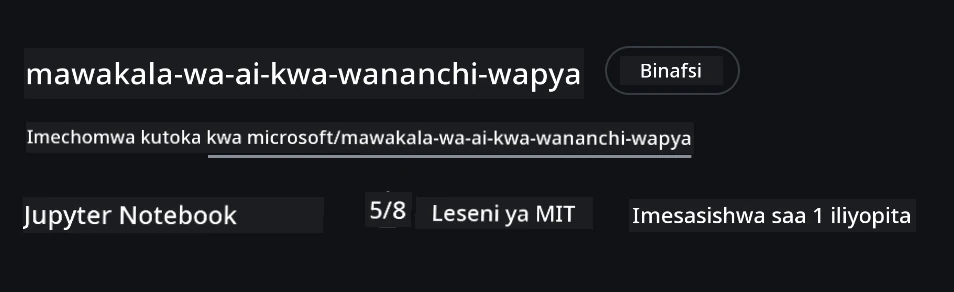
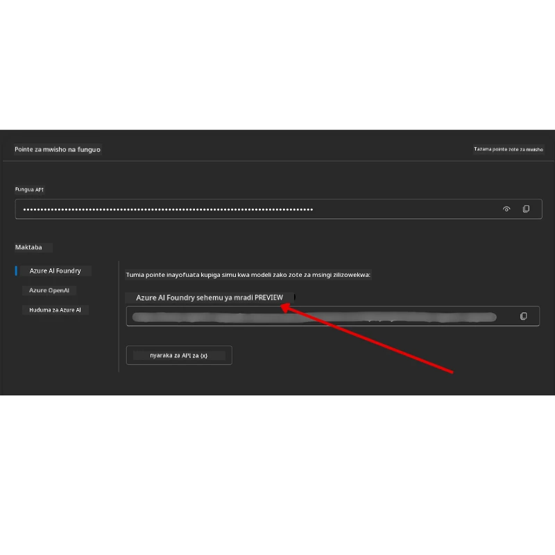

# Kuandaa Kozi

## Utangulizi

Somo hili litafundisha jinsi ya kuendesha sampuli za msimbo za kozi hii.

## Jiunge na Wajifunza Wengine na Pata Msaada

Kabla hujaanza kunakili repo yako, jiunge na [AI Agents For Beginners Discord channel](https://aka.ms/ai-agents/discord) kupata msaada wowote wa kuanzisha, maswali yoyote kuhusu kozi, au kuungana na wajifunza wengine.

## Nakili au Fanya Fork ya Repo Hii

Kuanza, tafadhali nakili au fanya fork ya GitHub Repository. Hii itakupa toleo lako binafsi la nyenzo za kozi ili uweze kuendesha, kujaribu, na kuboresha msimbo!

Hii inaweza kufanywa kwa kubonyeza kiungo cha <a href="https://github.com/microsoft/ai-agents-for-beginners/fork" target="_blank">fanya fork ya repo</a>

Sasa unapaswa kuwa na toleo lako la fork ya kozi hii katika kiungo kifuatacho:



### Nakili Yenye Kina Kidogo (inakubalika kwa warsha / Codespaces)

  >Hifadhi nzima inaweza kuwa kubwa (~3 GB) unapopakua historia yote na faili zote. Ikiwa unashiriki tu warsha au unahitaji folda chache za masomo, nakili yenye kina kidogo (au nakili yenye kujitenga) inazuia sehemu kubwa ya kupakua kwa kukata historia na/au kuepuka blobs.

#### Nakili ya kina kidogo — historia ndogo, faili zote

Badilisha `<your-username>` katika amri zifuatazo na URL ya fork yako (au URL ya juu ikiwa unapendelea).

Kunakili historia ya mabadiliko ya hivi karibuni pekee (pakua kidogo):

```bash|powershell
git clone --depth 1 https://github.com/<your-username>/ai-agents-for-beginners.git
```

Kunakili tawi maalum:

```bash|powershell
git clone --depth 1 --branch <branch-name> https://github.com/<your-username>/ai-agents-for-beginners.git
```

#### Nakili Sehemu (sparse) — blobs chache + folda zilizochaguliwa pekee

Hii inatumia nakili sehemu na sparse-checkout (inahitaji Git 2.25+ na inashauriwa kutumia Git ya kisasa yenye msaada wa nakili sehemu):

```bash|powershell
git clone --depth 1 --filter=blob:none --sparse https://github.com/<your-username>/ai-agents-for-beginners.git
```

Ingiza ndani ya folda ya repo:

```bash|powershell
cd ai-agents-for-beginners
```

Kisha bainisha folda unazotaka (mfano hapa chini unaonyesha folda mbili):

```bash|powershell
git sparse-checkout set 00-course-setup 01-intro-to-ai-agents
```

Baada ya kunakili na kuthibitisha faili, kama unahitaji tu faili na unataka kuondoa nafasi ya kuhifadhi (haki ya git hairudi), tafadhali futa metadata ya repo (💀haiwezi kurekebishwa — utapoteza kazi zote za Git: hakuna commits, pulls, pushes, au ufikiaji wa historia).

```bash
# zsh/bash
rm -rf .git
```

```powershell
# PowerShell
Remove-Item -Recurse -Force .git
```

#### Kutumia GitHub Codespaces (inashauriwa kuepuka kupakua kubwa mahali pako)

- Tengeneza Codespace mpya kwa repo hii kupitia [GitHub UI](https://github.com/codespaces).  

- Katika terminal ya Codespace mpya, endesha moja ya amri za nakili yenye kina kidogo/sparse checkout hapo juu kuleta folda za masomo unazohitaji tu kwenye eneo la Codespace.
- Hiari: baada ya kunakili ndani ya Codespaces, ondoa .git ili kurudisha nafasi ya ziada (ona amri za kuondoa hapo juu).
- Kumbuka: Ikiwa unapenda kufungua repo moja kwa moja katika Codespaces (bila kunakili tena), fahamu Codespaces itaandaa mazingira ya devcontainer na huenda bado ikaandaa zaidi ya unavyohitaji. Kunakili nakili yenye kina kidogo ndani ya Codespace safi hukupa udhibiti zaidi wa matumizi ya diski.

#### Vidokezo

- Daima badilisha URL ya nakili na ile ya fork yako ikiwa unataka kuhariri/kuweka commit.
- Kama baadaye unahitaji historia zaidi au faili, unaweza kuziongeza au kurekebisha sparse-checkout ili kujumuisha folda za ziada.

## Kuendesha Msimbo

Kozi hii inatoa mfululizo wa Jupyter Notebooks ambazo unaweza kuzindua kupata uzoefu wa vitendo wa kujenga AI Agents.

Sampuli za msimbo zinatumia **Microsoft Agent Framework (MAF)** na `AzureAIProjectAgentProvider`, ambayo inaunganisha na **Azure AI Agent Service V2** (API ya Majibu) kupitia **Microsoft Foundry**.

Notebooks zote za Python zinapakiwa jina `*-python-agent-framework.ipynb`.

## Mahitaji

- Python 3.12+
  - **KUMBUKO**: Ikiwa huna Python3.12 imewekwa, hakikisha unaiweka. Kisha unda venv yako kwa kutumia python3.12 kuhakikisha toleo sahihi limewekwa kutoka kwa faili ya requirements.txt.
  
    >Mfano

    Unda saraka ya Python venv:

    ```bash|powershell
    python -m venv venv
    ```

    Kisha washawishe mazingira ya venv kwa:

    ```bash
    # zsh/bash
    source venv/bin/activate
    ```
  
    ```dos
    # Command Prompt for Windows
    venv\Scripts\activate
    ```

- .NET 10+: Kwa sampuli za msimbo zinazotumia .NET, hakikisha umeweka [.NET 10 SDK](https://dotnet.microsoft.com/download/dotnet/10.0) au baadaye. Kisha, angalia toleo la .NET SDK uliloloweka:

    ```bash|powershell
    dotnet --list-sdks
    ```

- **Azure CLI** — Inahitajika kwa uthibitishaji. Imewekwa kutoka [aka.ms/installazurecli](https://aka.ms/installazurecli).
- **Azure Subscription** — Kwa ufikiaji wa Microsoft Foundry na Azure AI Agent Service.
- **Microsoft Foundry Project** — Mradi uliotumia mfano (mfano, `gpt-4o`). Angalia [Hatua 1](#hatua-ya-1-tengeneza-mradi-wa-microsoft-foundry) hapa chini.

Tumejumuisha faili ya `requirements.txt` katika mizizi ya repo hii ambayo ina vifurushi vyote vya Python vinavyohitajika ili kuendesha sampuli za msimbo.

Unaweza kuviweka kwa kuendesha amri ifuatayo kwenye terminal yako katika mizizi ya repo:

```bash|powershell
pip install -r requirements.txt
```

Tunapendekeza kuunda mazingira ya virtual ya Python ili kuepuka migongano na matatizo yoyote.

## Kuandaa VSCode

Hakikisha unatumia toleo sahihi la Python katika VSCode.


## Kuandaa Microsoft Foundry na Azure AI Agent Service

### Hatua ya 1: Tengeneza Mradi wa Microsoft Foundry

Unahitaji **hub** ya Azure AI Foundry na **mradi** wenye mfano uliowekwa ili kuendesha notebooks.

1. Nenda kwenye [ai.azure.com](https://ai.azure.com) na ingia na akaunti yako ya Azure.
2. Tengeneza **hub** (au tumia ilipo kwayo). Angalia: [Muhtasari wa rasilimali za Hub](https://learn.microsoft.com/azure/ai-foundry/concepts/ai-resources).
3. Ndani ya hub, tengeneza **mradi**.
4. Weka mfano (mfano, `gpt-4o`) kutoka **Models + Endpoints** → **Deploy model**.

### Hatua ya 2: Pata Kituo cha Mradi na Jina la Uwekeaji Mfano

Kutoka kwa mradi wako kwenye portal ya Microsoft Foundry:

- **Kituo cha Mradi** — Nenda kwenye ukurasa wa **Overview** na nakili URL ya kituo.



- **Jina la Uwekaji Mfano** — Nenda kwenye **Models + Endpoints**, chagua mfano uliowekwa, na kumbuka **Deployment name** (mfano, `gpt-4o`).

### Hatua ya 3: Ingia Azure kwa kutumia `az login`

Notebooks zote zinalazimisha uthibitishaji kutumia **`AzureCliCredential`** — hakuna API keys ya kusimamia. Hii inahitaji ulinge kwa kutumia Azure CLI.

1. **Sakinisha Azure CLI** ikiwa bado haijawekwa: [aka.ms/installazurecli](https://aka.ms/installazurecli)

2. **Ingia** kwa kuendesha:

    ```bash|powershell
    az login
    ```

    Au kama uko kwenye mazingira ya mbali/Codespace bila kivinjari:

    ```bash|powershell
    az login --use-device-code
    ```

3. **Chagua usajili wako** kama itakuomba — chagua ile ina mradi wako wa Foundry.

4. **Thibitisha** umeingia:

    ```bash|powershell
    az account show
    ```

> **Kwa nini `az login`?** Notebooks zinafanya uthibitishaji kwa kutumia `AzureCliCredential` kutoka kwenye kifurushi cha `azure-identity`. Hii maana yake ni kwamba kikao chako cha Azure CLI kinatoa vyeti — hakuna API keys au siri kwenye faili lako `.env`. Hii ni [mbinu bora ya usalama](https://learn.microsoft.com/azure/developer/ai/keyless-connections).

### Hatua ya 4: Tengeneza Faili Your `.env`

Nakili faili la mfano:

```bash
# zsh/bash
cp .env.example .env
```

```powershell
# PowerShell
Copy-Item .env.example .env
```

Fungua `.env` na jaza thamani hizi mbili:

```env
AZURE_AI_PROJECT_ENDPOINT=https://<your-project>.services.ai.azure.com/api/projects/<your-project-id>
AZURE_AI_MODEL_DEPLOYMENT_NAME=gpt-4o
```

| Kigezo | Mahali pa kukipata |
|----------|-----------------|
| `AZURE_AI_PROJECT_ENDPOINT` | Portal ya Foundry → mradi wako → ukurasa wa **Overview** |
| `AZURE_AI_MODEL_DEPLOYMENT_NAME` | Portal ya Foundry → **Models + Endpoints** → jina la mfano uliowekwa |

Hiyo ni kwa masomo mengi! Notebooks zitathibitisha moja kwa moja kupitia kikao chako cha `az login`.

### Hatua ya 5: Sakinisha Vitegemezi vya Python

```bash|powershell
pip install -r requirements.txt
```

Tunapendekeza kuendesha hii ndani ya mazingira ya virtual yaliyotengenezwa awali.

## Kuongeza Kuandaa kwa Somo 5 (Agentic RAG)

Somo la 5 linatumia **Azure AI Search** kwa uzalishaji ulioboreshwa kwa utaftaji. Ukiwa na mpango wa kuendesha somo hilo, ongeza vigezo hivi kwenye faili lako `.env`:

| Kigezo | Mahali pa kukipata |
|----------|-----------------|
| `AZURE_SEARCH_SERVICE_ENDPOINT` | Azure portal → rasilimali yako ya **Azure AI Search** → **Overview** → URL |
| `AZURE_SEARCH_API_KEY` | Azure portal → rasilimali yako ya **Azure AI Search** → **Settings** → **Keys** → ufunguo mkuu wa msimamizi |

## Kuongeza Kuandaa kwa Somo 6 na Somo 8 (GitHub Models)

Baadhi ya notebooks katika masomo 6 na 8 zinatumia **GitHub Models** badala ya Azure AI Foundry. Ikiwa unapanga kuendesha sampuli hizo, ongeza vigezo hivi kwenye faili lako `.env`:

| Kigezo | Mahali pa kukipata |
|----------|-----------------|
| `GITHUB_TOKEN` | GitHub → **Settings** → **Developer settings** → **Personal access tokens** |
| `GITHUB_ENDPOINT` | Tumia `https://models.inference.ai.azure.com` (thamani ya kawaida) |
| `GITHUB_MODEL_ID` | Jina la mfano unaotaka kutumia (mfano `gpt-4o-mini`) |

## Mtoa Huduma Mbadala: MiniMax (Inayolingana na OpenAI)

[MiniMax](https://platform.minimaxi.com/) hutoa mfano wenye muktadha mkubwa (hadi tokeni 204K) kupitia API inayolingana na OpenAI. Kwa kuwa Microsoft Agent Framework `OpenAIChatClient` hufanya kazi na kituo chochote kinacholingana na OpenAI, unaweza kutumia MiniMax kama mbadala ya moja kwa moja kwa GitHub Models au OpenAI.

Ongeza vigezo hivi kwenye faili lako `.env`:

| Kigezo | Mahali pa kukipata |
|----------|-----------------|
| `MINIMAX_API_KEY` | [MiniMax Platform](https://platform.minimaxi.com/) → API Keys |
| `MINIMAX_BASE_URL` | Tumia `https://api.minimax.io/v1` (thamani ya kawaida) |
| `MINIMAX_MODEL_ID` | Jina la mfano unaotaka kutumia (mfano, `MiniMax-M2.7`) |

**Mifano inayopatikana**: `MiniMax-M2.7` (inapendekezwa), `MiniMax-M2.7-highspeed` (majibu ya haraka)

Sampuli za msimbo zinazotumia `OpenAIChatClient` (mfano, mtiririko wa kuhifadhi hoteli wa Somo 14) zitagundua na kutumia usanidi wako wa MiniMax moja kwa moja wakati `MINIMAX_API_KEY` umetolewa.

## Kuongeza Kuandaa kwa Somo 8 (Mtiririko wa Kuweka Msingi wa Bing)

Notebook ya mtiririko wa masharti katika somo 8 inatumia **Bing grounding** kupitia Azure AI Foundry. Ikiwa unakusudia kuendesha sampuli hiyo, ongeza kigezo hiki kwenye faili lako `.env`:

| Kigezo | Mahali pa kukipata |
|----------|-----------------|
| `BING_CONNECTION_ID` | Portal ya Azure AI Foundry → mradi wako → **Management** → **Connected resources** → muunganisho wako wa Bing → nakili kitambulisho cha muunganisho |

## Kutatua Matatizo

### Makosa ya Uthibitishaji wa Cheti cha SSL kwenye macOS

Kama uko kwenye macOS na ukaona kosa kama:

```plaintext
ssl.SSLCertVerificationError: [SSL: CERTIFICATE_VERIFY_FAILED] certificate verify failed: self-signed certificate in certificate chain
```

Hili ni tatizo la kawaida la Python kwenye macOS ambapo vyeti vya SSL vya mfumo havipiwi imani moja kwa moja. Jaribu suluhisho zifuatazo kwa mpangilio:

**Chaguo 1: Endesha script ya Python ya Kufunga Vyeti (inapendekezwa)**

```bash
# Badilisha 3.XX na toleo la Python ulilolisakinisha (mfano, 3.12 au 3.13):
/Applications/Python\ 3.XX/Install\ Certificates.command
```

**Chaguo 2: Tumia `connection_verify=False` kwenye notebook yako (kwa notebooks za GitHub Models pekee)**

Katika notebook ya Somo 6 (`06-building-trustworthy-agents/code_samples/06-system-message-framework.ipynb`), suluhisho lililosemwa limejumuishwa tayari. Fungua `connection_verify=False` wakati wa kuunda mteja:

```python
client = ChatCompletionsClient(
    endpoint=endpoint,
    credential=AzureKeyCredential(token),
    connection_verify=False,  # Zima uhakiki wa SSL ikiwa unakutana na makosa ya cheti
)
```

> **⚠️ Tahadhari:** Kuwasha disi uthibitishaji wa SSL (`connection_verify=False`) hupunguza usalama kwa kuepuka uhakiki wa cheti. Tumia hii tu kama suluhisho la muda katika mazingira ya maendeleo, kamwe si kwa uzalishaji.

**Chaguo 3: Sakinisha na tumia `truststore`**

```bash
pip install truststore
```

Kisha ongeza yafuatayo juu ya notebook yako au script kabla ya kufanya miito yoyote ya mtandao:

```python
import truststore
truststore.inject_into_ssl()
```

## Umekwama Wapi?

Kama ukikumbwa na matatizo yoyote katika kuendesha kuandaa hii, jiunge nasi kwenye <a href="https://discord.gg/kzRShWzttr" target="_blank">Azure AI Community Discord</a> au <a href="https://github.com/microsoft/ai-agents-for-beginners/issues?WT.mc_id=academic-105485-koreyst" target="_blank">tengeneza tatizo</a>.

## Somo Lijalo

Sasa uko tayari kuendesha msimbo wa kozi hii. Jifunze kwa furaha zaidi kuhusu ulimwengu wa AI Agents!

[Utangulizi wa AI Agents na Matumizi ya Agent](../01-intro-to-ai-agents/README.md)

---

<!-- CO-OP TRANSLATOR DISCLAIMER START -->
**Tangazo la Kukataa**:  
Hati hii imetafsiriwa kwa kutumia huduma ya tafsiri ya AI [Co-op Translator](https://github.com/Azure/co-op-translator). Ingawa tunajitahidi usahihi, tafadhali fahamu kwamba tafsiri za moja kwa moja zinaweza kuwa na makosa au upungufu wa usahihi. Hati asili katika lugha yake ya asili inapaswa kuchukuliwa kama chanzo cha mamlaka. Kwa taarifa muhimu, tafsiri ya kitaalam ya binadamu inapendekezwa. Hatuwajibiki kwa kutoelewana au tafsiri potofu zinazotokana na matumizi ya tafsiri hii.
<!-- CO-OP TRANSLATOR DISCLAIMER END -->