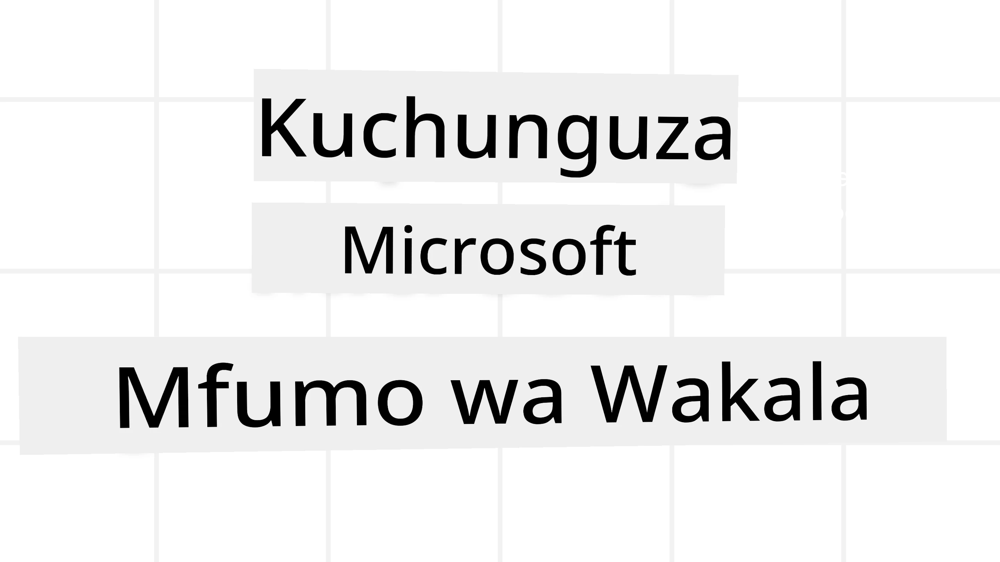
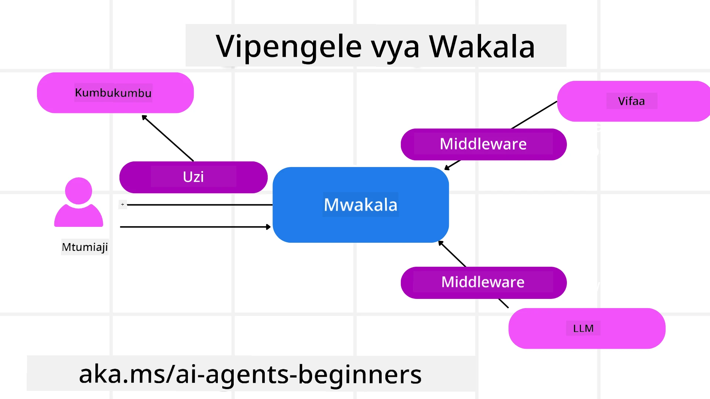

# Kuchunguza Mfumo wa Microsoft Agent



### Utangulizi

Somu hii itajumuisha:

- Kuelewa Mfumo wa Microsoft Agent: Vipengele Vikuu na Thamani  
- Kuchunguza Dhana Muhimu za Mfumo wa Microsoft Agent
- Mifumo ya Juu ya MAF: Mifumo ya Kazi, Middleware, na Kumbukumbu

## Malengo ya Kujifunza

Baada ya kukamilisha somu hii, utajua jinsi ya:

- Kujenga Wakala wa AI Tayari kwa Uzalishaji kwa kutumia Mfumo wa Microsoft Agent
- Kutumia vipengele vikuu vya Mfumo wa Microsoft Agent kwa Matumizi yako ya Wakala
- Kutumia mifumo ya juu ikiwa ni pamoja na mifumo ya kazi, middleware, na uangalifu

## Sampuli za Msimbo 

Sampuli za msimbo kwa [Microsoft Agent Framework (MAF)](https://aka.ms/ai-agents-beginners/agent-framewrok) zinaweza kupatikana katika hazina hii chini ya faili za `xx-python-agent-framework` na `xx-dotnet-agent-framework`.

## Kuelewa Mfumo wa Microsoft Agent


[Microsoft Agent Framework (MAF)](https://aka.ms/ai-agents-beginners/agent-framewrok) ni mfumo wa pamoja wa Microsoft kwa ajili ya kujenga mawakala wa AI. Inatoa unyumbufu wa kushughulikia aina mbalimbali za matumizi ya wakala kama inavyoonekana katika mazingira ya uzalishaji na utafiti ikiwa ni pamoja na:

- **Uratibu wa Wakakati wa Mfuatano** katika matukio ambapo mifumo ya hatua kwa hatua inahitajika.
- **Uratibu wa Simultaneous** katika matukio ambapo mawakala wanahitaji kumaliza kazi kwa wakati mmoja.
- **Uratibu wa Mazungumzo ya Kundi** katika matukio ambapo mawakala wanaweza kushirikiana pamoja kwenye kazi moja.
- **Uratibu wa Kutoa Kazi** katika matukio ambapo mawakala wanapita kazi kwa kila mmoja kadri kazi ndogo zinavyokamilika.
- **Uratibu wa Kivutio** katika matukio ambapo wakala mkuu huunda na kurekebisha orodha ya kazi na kushughulikia uratibu wa mawakala wadogo kumaliza kazi.

Ili kuwasilisha Wakala AI katika Uzalishaji, MAF pia ina vipengele vilivyojumuishwa vya:

- **Uangalifu** kupitia matumizi ya OpenTelemetry ambapo kila hatua ya Wakala wa AI ikiwa ni pamoja na kutumia zana, hatua za uratibu, michakato ya kufikiria na ufuatiliaji wa utendaji kupitia dashibodi za Microsoft Foundry.
- **Usalama** kwa kuendesha mawakala kwa asili kwenye Microsoft Foundry ambayo ni pamoja na udhibiti wa usalama kama upatikanaji wa majukumu, usimamizi wa data binafsi na usalama wa maudhui uliojengewa ndani.
- **Uadilifu** kwa kuwa nyuzi na mifumo ya wakala inaweza kusitishwa, kuendelea na kupona kutoka kwa makosa ambayo hutoa mchakato mrefu wa kuendesha.
- **Udhibiti** kwa kuwa mifumo ya mwanadamu katika mzunguko inaungwa mkono ambapo kazi zinatambulika kama zinahitaji idhini ya kibinadamu.

Mfumo wa Microsoft Agent pia unalenga kuwa rafiki wa mzunguko kwa:

- **Kuwa Huru wa Wingu** - Mawakala yanaweza kuendeshwa kwenye vyombo, ndani ya kampuni na katika mawingu mbalimbali.
- **Kuwa Huru wa Mtoa Huduma** - Mawakala yanaweza kuundwa kupitia SDK unayopendelea ikiwa ni pamoja na Azure OpenAI na OpenAI
- **Kujumuisha Viwango Huru** - Mawakala yanaweza kutumia itifaki kama Agent-to-Agent(A2A) na Model Context Protocol (MCP) kugundua na kutumia mawakala na zana nyingine.
- **Viambatisho na Vifungo** - Muunganisho unaweza kufanywa kwa huduma za data na kumbukumbu kama Microsoft Fabric, SharePoint, Pinecone na Qdrant.

Tuchunguze jinsi vipengele hivi vinavyotumika kwa baadhi ya dhana kuu za Mfumo wa Microsoft Agent.

## Dhana Muhimu za Mfumo wa Microsoft Agent

### Mawakala



**Kuunda Mawakala**

Uundaji wa wakala hufanywa kwa kufafanua huduma ya inference (Mtoa LLM), seti ya maelekezo kwa Wakala wa AI kufuata, na jina lililopewa:

```python
agent = AzureOpenAIChatClient(credential=AzureCliCredential()).create_agent( instructions="You are good at recommending trips to customers based on their preferences.", name="TripRecommender" )
```

Hapo juu inatumia `Azure OpenAI` lakini mawakala yanaweza kuundwa kwa kutumia huduma mbalimbali ikiwa ni pamoja na `Microsoft Foundry Agent Service`:

```python
AzureAIAgentClient(async_credential=credential).create_agent( name="HelperAgent", instructions="You are a helpful assistant." ) as agent
```

API za OpenAI `Responses`, `ChatCompletion`

```python
agent = OpenAIResponsesClient().create_agent( name="WeatherBot", instructions="You are a helpful weather assistant.", )
```

```python
agent = OpenAIChatClient().create_agent( name="HelpfulAssistant", instructions="You are a helpful assistant.", )
```

au [MiniMax](https://platform.minimaxi.com/), ambayo hutoa API inayolingana na OpenAI yenye dirisha kubwa la muktadha (hadi tokens 204K):

```python
agent = OpenAIChatClient(base_url="https://api.minimax.io/v1", api_key=os.environ["MINIMAX_API_KEY"], model_id="MiniMax-M2.7").create_agent( name="HelpfulAssistant", instructions="You are a helpful assistant.", )
```

au mawakala wa mbali kwa kutumia itifaki ya A2A:

```python
agent = A2AAgent( name=agent_card.name, description=agent_card.description, agent_card=agent_card, url="https://your-a2a-agent-host" )
```

**Kuendesha Mawakala**

Mawakala huendeshwa kwa kutumia mbinu `.run` au `.run_stream` kwa majibu yasiyo ya mtiririko au ya mtiririko.

```python
result = await agent.run("What are good places to visit in Amsterdam?")
print(result.text)
```

```python
async for update in agent.run_stream("What are the good places to visit in Amsterdam?"):
    if update.text:
        print(update.text, end="", flush=True)

```

Kiasi cha kila mara cha kuendesha wakala kinaweza pia kuwa na chaguo za kubinafsisha vigezo kama `max_tokens` vinavyotumiwa na wakala, `tools` ambazo wakala anaweza kuitisha, na hata `model` yenyewe inayotumika kwa wakala.

Hii ni muhimu katika kesi ambapo mifano maalum au zana zinahitajika kumaliza kazi ya mtumiaji.

**Zana**

Zana zinaweza kufafanuliwa wakati wa kufafanua wakala:

```python
def get_attractions( location: Annotated[str, Field(description="The location to get the top tourist attractions for")], ) -> str: """Get the top tourist attractions for a given location.""" return f"The top attractions for {location} are." 


# Wakati wa kuunda ChatAgent moja kwa moja

agent = ChatAgent( chat_client=OpenAIChatClient(), instructions="You are a helpful assistant", tools=[get_attractions]

```

na pia wakati wa kuendesha wakala:

```python

result1 = await agent.run( "What's the best place to visit in Seattle?", tools=[get_attractions] # Zana iliyotolewa kwa ajili ya kukimbia hii tu )
```

**Nyuzi za Wakala**

Nyuzi za Wakala hutumika kushughulikia mazungumzo yenye kurudia-rudia. Nyuzi zinaweza kuundwa kwa:

- Kutumia `get_new_thread()` ambayo inaruhusu nyuzi kuhifadhiwa kwa muda
- Kuunda nyuzi kiotomatiki wakati wakala anapoendesha na nyuzi hiyo kudumu tu wakati wa uendeshaji huo.

Ili kuunda nyuzi, msimbo ni kama ifuatavyo:

```python
# Unda thread mpya.
thread = agent.get_new_thread() # Endesha wakala na thread.
response = await agent.run("Hello, I am here to help you book travel. Where would you like to go?", thread=thread)

```

Kisha unaweza kusafirisha nyuzi kuhifadhiwa kwa matumizi ya baadaye:

```python
# Unda thread mpya.
thread = agent.get_new_thread() 

# Endesha wakala na thread.

response = await agent.run("Hello, how are you?", thread=thread) 

# Serialize thread kwa ajili ya uhifadhi.

serialized_thread = await thread.serialize() 

# Deserialize hali ya thread baada ya kupakiwa kutoka kwa uhifadhi.

resumed_thread = await agent.deserialize_thread(serialized_thread)
```

**Middleware ya Wakala**

Mawakala hufanya kazi na zana na LLM kumaliza kazi za mtumiaji. Katika matukio fulani, tunataka kutekeleza au kufuatilia kati ya mwingiliano huu. Middleware ya wakala inatuwezesha kufanya hivi kupitia:

*Middleware ya Kazi*

Middleware hii inaturuhusu kutekeleza kitendo kati ya wakala na kazi/zaana ambayo itaitwa. Mfano wa matumizi ni pale ambapo unaweza kutaka kufanya ukusanyaji wa matukio ya kuitwa kwa kazi.

Katika msimbo wa chini `next` huamua kama middleware inayofuata au kazi halisi inapaswa kuitwa.

```python
async def logging_function_middleware(
    context: FunctionInvocationContext,
    next: Callable[[FunctionInvocationContext], Awaitable[None]],
) -> None:
    """Function middleware that logs function execution."""
    # Utangulizi: Andika kumbukumbu kabla ya utekelezaji wa kazi
    print(f"[Function] Calling {context.function.name}")

    # Endelea kwa middleware inayofuata au utekelezaji wa kazi
    await next(context)

    # Ufuatiliaji wa mwisho: Andika kumbukumbu baada ya utekelezaji wa kazi
    print(f"[Function] {context.function.name} completed")
```

*Middleware ya Mazungumzo*

Middleware hii inaturuhusu kutekeleza au kurekodi kitendo kati ya wakala na maombi kati ya LLM.

Hii ina habari muhimu kama vile `messages` zinazotumwa kwa huduma ya AI.

```python
async def logging_chat_middleware(
    context: ChatContext,
    next: Callable[[ChatContext], Awaitable[None]],
) -> None:
    """Chat middleware that logs AI interactions."""
    # Usindikaji wa awali: Rekodi kabla ya wito la AI
    print(f"[Chat] Sending {len(context.messages)} messages to AI")

    # Endelea kwa middleware inayofuata au huduma ya AI
    await next(context)

    # Usindikaji wa baadae: Rekodi baada ya jibu la AI
    print("[Chat] AI response received")

```

**Kumbukumbu ya Wakala**

Kama ilivyozungumzwa katika somu ya `Agentic Memory`, kumbukumbu ni kipengele muhimu kuwezesha wakala kufanya kazi kwenye muktadha mbalimbali. MAF hutoa aina kadhaa za kumbukumbu:

*Kuhifadhi Kumbukumbu Ndani ya Kumbukumbu*

Hii ni kumbukumbu iliyohifadhiwa katika nyuzi wakati wa kuendesha programu.

```python
# Unda thread mpya.
thread = agent.get_new_thread() # Endesha wakala na thread.
response = await agent.run("Hello, I am here to help you book travel. Where would you like to go?", thread=thread)
```

*Ujumbe Endelevu*

Kumbukumbu hii hutumiwa kuhifadhi historia ya mazungumzo kati ya vikao tofauti. Imefafanuliwa kwa kutumia `chat_message_store_factory` :

```python
from agent_framework import ChatMessageStore

# Unda duka la ujumbe la kipekee
def create_message_store():
    return ChatMessageStore()

agent = ChatAgent(
    chat_client=OpenAIChatClient(),
    instructions="You are a Travel assistant.",
    chat_message_store_factory=create_message_store
)

```

*Kumbukumbu Dinamiki*

Kumbukumbu hii inaongezwa kwenye muktadha kabla mawakala kuendesha. Kumbukumbu hizi zinaweza kuhifadhiwa katika huduma za nje kama mem0:

```python
from agent_framework.mem0 import Mem0Provider

# Kutumia Mem0 kwa uwezo wa hali ya juu wa kumbukumbu
memory_provider = Mem0Provider(
    api_key="your-mem0-api-key",
    user_id="user_123",
    application_id="my_app"
)

agent = ChatAgent(
    chat_client=OpenAIChatClient(),
    instructions="You are a helpful assistant with memory.",
    context_providers=memory_provider
)

```

**Uangalifu wa Wakala**

Uangalifu ni muhimu kujenga mifumo ya wakala inayotegemewa na inayotunzwa. MAF inaunganishwa na OpenTelemetry kutoa njia za kufuatilia na meter kwa uangalifu bora.

```python
from agent_framework.observability import get_tracer, get_meter

tracer = get_tracer()
meter = get_meter()
with tracer.start_as_current_span("my_custom_span"):
    # fanya kitu
    pass
counter = meter.create_counter("my_custom_counter")
counter.add(1, {"key": "value"})
```

### Mifumo ya Kazi

MAF inatoa mifumo ya kazi ambayo ni hatua zilizobainishwa kabla kumaliza kazi na kujumuisha mawakala wa AI kama vipengele katika hatua hizo.

Mifumo ya kazi inajumuisha vipengele vyenye kuruhusu mzunguko bora wa kudhibiti. Mifumo ya kazi pia inaruhusu **uratibu wa mawakala wengi** na **kuhifadhi hatua** kwa ajili ya kuhifadhi hali ya mfumo.

Vipengele vikuu vya mfumo wa kazi ni:

**Watekelezaji**

Watekelezaji hupokea ujumbe wa ingizo, kutekeleza kazi walizopewa, na kutoa ujumbe wa matokeo. Hii husogeza mfumo wa kazi kuelekea kumaliza kazi kubwa. Watekelezaji wanaweza kuwa wakala wa AI au mantiki maalum.

**Mikondo**

Mikondo hutumika kufafanua mtiririko wa ujumbe katika mfumo wa kazi. Hii inaweza kuwa:

*Mikondo ya Moja kwa Moja* - Muunganisho rahisi wa mmoja kwa mmoja kati ya watekelezaji:

```python
from agent_framework import WorkflowBuilder

builder = WorkflowBuilder()
builder.add_edge(source_executor, target_executor)
builder.set_start_executor(source_executor)
workflow = builder.build()
```

*Mikondo Yenye Masharti* - Huitwa baada ya hali fulani kutimizwa. Kwa mfano, wakati vyumba vya hoteli havipatikani, mtendaji anaweza kupendekeza chaguzi zingine.

*Mikondo ya Swichi-matumizi* - Kuongoza ujumbe kwa watekelezaji mbalimbali kulingana na masharti yaliyofafanuliwa. Kwa mfano, ikiwa mteja wa usafiri ana upatikanaji wa kipaumbele na kazi zao zitatendewa kupitia mfumo mwingine.

*Mikondo ya Kuenea* - Kutuma ujumbe mmoja kwa malengo mengi.

*Mikondo ya Kukusanya* - Kukusanya ujumbe mbalimbali kutoka kwa watekelezaji tofauti na kutuma kwa lengo moja.

**Matukio**

Ili kutoa uangalifu bora katika mifumo ya kazi, MAF inatoa matukio yaliyojengewa kwa ajili ya utekelezaji ikiwa ni pamoja na:

- `WorkflowStartedEvent`  - Utekelezaji wa mfumo wa kazi unaanza
- `WorkflowOutputEvent` - Mfumo wa kazi unatoa matokeo
- `WorkflowErrorEvent` - Mfumo wa kazi unakutana na kosa
- `ExecutorInvokeEvent`  - Mtendaji anaanza kuchakata
- `ExecutorCompleteEvent`  -  Mtendaji anakamilisha kuchakata
- `RequestInfoEvent` - Ombi limefanywa

## Mifumo ya Juu ya MAF

Sehemu zilizo juu zinashughulikia dhana kuu za Mfumo wa Microsoft Agent. Unapojenga mawakala tata zaidi, hapa kuna mifumo ya juu ya kuzingatia:

- **Muundo wa Middleware**: Mnyororo wa watunza middleware wengi (kurekodi, uthibitisho, ukomo wa kiwango) kwa kutumia middleware ya kazi na ya mazungumzo kwa udhibiti wa kina wa tabia ya wakala.
- **Kuhifadhi Hatua za Mfumo wa Kazi**: Tumia matukio ya mfumo wa kazi na usajili ili kuhifadhi na kuendelea na michakato mrefu ya wakala.
- **Uchaguzi wa Zana unaobadilika**: Changanya RAG juu ya maelezo ya zana na usajili wa zana wa MAF kuwasilisha zana zinazohitajika tu kwa kila swali.
- **Kutoa Kazi kwa Wakala Wengi**: Tumia mikondo ya mfumo wa kazi na uratibu wa masharti kuratibu makabidhiano kati ya mawakala maalum.

## Sampuli za Msimbo 

Sampuli za msimbo kwa Mfumo wa Microsoft Agent zinaweza kupatikana katika hazina hii chini ya faili za `xx-python-agent-framework` na `xx-dotnet-agent-framework`.

## Una Maswali Zaidi Kuhusu Mfumo wa Microsoft Agent?

Jiunge na [Microsoft Foundry Discord](https://aka.ms/ai-agents/discord) kukutana na wasomaji wengine, kuhudhuria saa za ofisi na kupata majibu ya maswali yako kuhusu Wakala wa AI.

---

<!-- CO-OP TRANSLATOR DISCLAIMER START -->
**Kielelezo cha majibu**:  
Hati hii imetafsiriwa kwa kutumia huduma ya tafsiri ya AI [Co-op Translator](https://github.com/Azure/co-op-translator). Wakati tunajitahidi kwa usahihi, tafadhali fahamu kuwa tafsiri za otomatiki zinaweza kuwa na makosa au ukosefu wa usahihi. Hati ya asili katika lugha yake ya asili inapaswa kuchukuliwa kama chanzo cha mamlaka. Kwa taarifa muhimu, tafsiri ya kitaalamu ya binadamu inashauriwa. Hatuwajibiki kwa kutoelewana au tafsiri potofu zinazotokana na matumizi ya tafsiri hii.
<!-- CO-OP TRANSLATOR DISCLAIMER END -->