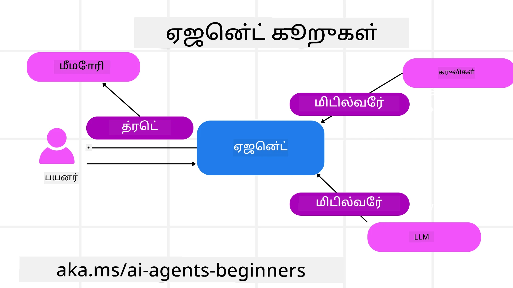

# மைக்ரோசாஃப்ட் ஏஜென்ட் கட்டமைப்பை ஆராய்ச்சி செய்தல்


### அறிமுகம்

இந்த பாடத்தில் கீழ்க்கண்டவை உள்ளடக்கியுள்ளது:

- மைக்ரோசாஃப்ட் ஏஜென்ட் கட்டமைப்பை புரிந்துகொள்வது: முக்கிய அம்சங்கள் மற்றும் மதிப்பு  
- மைக்ரோசாஃப்ட் ஏஜென்ட் கட்டமைப்பின் முக்கிய கருத்துக்களை ஆராய்தல்
- முன்னேற்றமான MAF மாதிரிகள்: வேலைப்பாடுகள், மிடில்வேர் மற்றும் நினைவகம்

## கற்றல் குறிக்கோள்கள்

இந்த பாடத்தை முடித்த பின், நீங்கள் கீழ்காணும் செயல்களை எப்படி செய்வதென்பதை அறிந்து கொள்வீர்கள்:

- மைக்ரோசாஃப்ட் ஏஜென்ட் கட்டமைப்பைப் பயன்படுத்தி தயாரிப்பு தயாரான AI ஏஜென்ட்களை உருவாக்குதல்
- மைக்ரோசாஃப்ட் ஏஜென்ட் கட்டமைப்பின் முக்கிய அம்சங்களை உங்கள் ஏஜென்டிக் பயன்பாட்டு வழிகளுக்கு பயன்படுத்துதல்
- வேலைப்பாடுகள், மிடில்வேர் மற்றும் பார்வையிடல் ஆகியவற்றைப் போன்று முன்னேற்றமான மாதிரிகளை பயன்படுத்துதல்

## குறியீட்டு உதாரணங்கள் 

[Microsoft Agent Framework (MAF)](https://aka.ms/ai-agents-beginners/agent-framewrok) குறியீட்டு உதாரணங்கள் இந்த தொகுப்பில் `xx-python-agent-framework` மற்றும் `xx-dotnet-agent-framework` கோப்புகளின் கீழே காணப்படுகின்றன.

## மைக்ரோசாஃப்ட் ஏஜென்ட் கட்டமைப்பை புரிந்துகொள்ளல்


[Microsoft Agent Framework (MAF)](https://aka.ms/ai-agents-beginners/agent-framewrok) என்பது AI ஏஜென்ட்களை உருவாக்குவதற்கான மைக்ரோசாஃப்ட் ஒருங்கிணைந்த கட்டமைப்பாகும். இது தயாரிப்பு மற்றும் ஆராய்ச்சி சூழல்களில் காணப்படும் பலவகையான ஏஜென்டிக் பயன்பாட்டு வழிகளுக்கு தகுதியான வசதிகளை வழங்குகிறது, அதாவது:

- படிப்படி வேலைவழிமுறைகள் தேவைப்படும் சூழல்களில் **ஆரம்பக்கரு ஏஜென்ட் ஒழுங்கமைப்பு**.
- ஏஜென்ட்கள் ஒரே நேரத்தில் பணிகளை முடிக்க வேண்டும் என்ற சூழல்களில் **ஒன்றிணைந்த ஒழுங்கமைப்பு**.
- ஏஜென்ட்கள் ஒரே பணியில் இணைந்து செயற்பட வேண்டிய சூழல்களில் **குழு உரையாடல் ஒழுங்கமைப்பு**.
- துணைப் பணிகள் முடிவடையும் போது ஏஜென்ட்கள் ஒருவருக்கொருவர் பணியை ஒப்படைப்பது உள்ள சூழல்களில் **பணிமாற்ற ஒழுங்கமைப்பு**.
- மேலாளர் ஏஜென்ட் ஒரு பணியியல் பட்டியலை உருவாக்கி மாற்றங்களைச் செய்தி துணை ஏஜென்ட்களின் ஒத்துழைப்பை கையாளும் ** mágnetic ore ) ஒழுங்கமைப்பு**.

தயாரிப்பில் AI ஏஜென்ட்களை வழங்குவதற்கு, MAF இல் இவ்வாறான அம்சங்களும் உள்ளன:

- **பார்வையிடல்**: OpenTelemetry மூலம், AI ஏஜென்டின் ஒவ்வொரு செயலையும் — கருவி அழைப்பு, ஒழுங்கமைப்பு படிகள், காரண விளக்க ஓட்டங்கள் மற்றும் Microsoft Foundry டாஷ்போர்ட்களுக்கான செயல்திறன் கண்காணிப்பு ஆகியவற்றை கவனிக்கிறது.
- **பாதுகாப்பு**: ஏஜென்ட்கள் Microsoft Foundry இல் நேரடியாக ஓடுவதால், பங்கு அடிப்படையிலான அணுகல், தனிப்பட்ட தரவு கையாளுதல் மற்றும் கட்டமைக்கப்பட்ட உள்ளடக்க பாதுகாப்பு ஆகிய பாதுகாப்பு கட்டுப்பாடுகள் உள்ளன.
- **திடைத்தன்மை**: ஏஜென்ட் தந்திகள் மற்றும் வேலைவழிகள் இடையீடுகள், மறுவிடுவிகள் மற்றும் பிழைகளில் இருந்து மீள்வதற்கு ஆதரவு உள்ளதால் நீண்டகால செயல்பாடுகளுக்கு உதவும்.
- **கட்டுப்பாடு**: மனித ஒப்புதலில் தேவையான பணிகள் குறிக்கப்பட்டு மனிதனின் பங்களிப்புடன் வேலைப்பாடுகள் ஆதரவாகும்.

மைக்ரோசாஃப்ட் ஏஜென்ட் கட்டமைப்பு இத்துடன் இணக்கபடுத்தலுக்கு கவனம் செலுத்துகிறது:

- **மேக போதுமானதல்லாதது** - ஏஜென்ட்கள் கன்டெய்னர்கள், உள்ளக சேவைகள் மற்றும் பல்வேறு மேகங்கள் இல் இயங்கும்.
- **வழங்குநர் போதுமானதல்லாதது** - Azure OpenAI மற்றும் OpenAI உட்பட பிடித்த SDK மூலம் ஏஜென்ட்கள் உருவாக்கப்பட முடியும்.
- **திறந்த தரநிலைகள் இணைப்பு** - Agent-to-Agent (A2A) மற்றும் Model Context Protocol (MCP) போன்ற புரோட்டோகால்களை பயன்படுத்தி பிற ஏஜென்ட்கள் மற்றும் கருவிகள் கண்டுபிடிக்கப்பட்டு பயன்படுத்தலாம்.
- **பிளகின்கள் மற்றும் இணைப்பிகள்** - Microsoft Fabric, SharePoint, Pinecone மற்றும் Qdrant போன்ற தரவு மற்றும் நினைவு சேவைகளுடன் இணைப்புகள் ஏற்படலாம்.

இப்போது இந்த அம்சங்கள் மைக்ரோசாஃப்ட் ஏஜென்ட் கட்டமைப்பின் சில முக்கிய கருத்துக்களில் எப்படி பயன்படுத்தப்படுகின்றன என்று பார்ப்போம்.

## மைக்ரோசாஃப்ட் ஏஜென்ட் கட்டமைப்பின் முக்கிய கருத்துக்கள்

### ஏஜென்ட்கள்



**ஏஜென்ட்கள் உருவாக்குதல்**

ஏஜென்ட் உருவாக்கல் என்பது கணிப்பு சேவை (LLM வழங்குநர்), AI ஏஜென்ட் பின்பற்ற வேண்டிய வழிமுறைகள் தொகுப்பு மற்றும் ஒதுக்கப்பட்ட `name` ஐ வரையறுப்பதாகும்:

```python
agent = AzureOpenAIChatClient(credential=AzureCliCredential()).create_agent( instructions="You are good at recommending trips to customers based on their preferences.", name="TripRecommender" )
```

மேலே `Azure OpenAI` பயன்பாட்டை பயன்படுத்துகிறது, ஆனால் ஏஜென்ட்கள் பல சேவைகளைக் கொண்டு உருவாக்கப்படலாம், அதாவது `Microsoft Foundry Agent Service`:

```python
AzureAIAgentClient(async_credential=credential).create_agent( name="HelperAgent", instructions="You are a helpful assistant." ) as agent
```

OpenAI `Responses`, `ChatCompletion` APIs

```python
agent = OpenAIResponsesClient().create_agent( name="WeatherBot", instructions="You are a helpful weather assistant.", )
```

```python
agent = OpenAIChatClient().create_agent( name="HelpfulAssistant", instructions="You are a helpful assistant.", )
```

அல்லது [MiniMax](https://platform.minimaxi.com/), இது மிக நீளமான சூழலியல் சாளரங்களுடன்(OpenAI-க்கு இணங்கக்கூடிய API, 204K டோக்கன்கள் வரை):

```python
agent = OpenAIChatClient(base_url="https://api.minimax.io/v1", api_key=os.environ["MINIMAX_API_KEY"], model_id="MiniMax-M2.7").create_agent( name="HelpfulAssistant", instructions="You are a helpful assistant.", )
```

அல்லது A2A புரோட்டோக்கால் மூலம் தொலைவன் ஏஜென்ட்கள்:

```python
agent = A2AAgent( name=agent_card.name, description=agent_card.description, agent_card=agent_card, url="https://your-a2a-agent-host" )
```

**ஏஜென்ட்கள் இயக்கல்**

ஏஜென்ட்கள் `.run` அல்லது `.run_stream` முறைகளைக் கொண்டு ஜனரஞ்சன் அல்லது ஸ்ட்ரீமிங் பதில்களுக்கு பயன்படுத்தப்படுகின்றன.

```python
result = await agent.run("What are good places to visit in Amsterdam?")
print(result.text)
```

```python
async for update in agent.run_stream("What are the good places to visit in Amsterdam?"):
    if update.text:
        print(update.text, end="", flush=True)

```

ஒவ்வொரு ஏஜென்ட் இயக்கத்திற்கும் `max_tokens`, `tools` மற்றும் `model` போன்ற விருப்பங்கள் உள்ளன.

இது பயனர் பணியை முடிக்க குறிப்பிட்ட மாதிரிகள் அல்லது கருவிகள் தேவைப்படும் சூழல்களில் பயனுள்ளதாக இருக்கிறது.

**கருவிகள்**

கருவிகள் ஏஜென்டைப் பொறுத்த போது:

```python
def get_attractions( location: Annotated[str, Field(description="The location to get the top tourist attractions for")], ) -> str: """Get the top tourist attractions for a given location.""" return f"The top attractions for {location} are." 


# நேரடியாக ஒரு ChatAgent உருவாக்கும் போது

agent = ChatAgent( chat_client=OpenAIChatClient(), instructions="You are a helpful assistant", tools=[get_attractions]

```

அதன்பிறகு ஏஜென்ட் இயக்கும் போது:

```python

result1 = await agent.run( "What's the best place to visit in Seattle?", tools=[get_attractions] # இந்த இயக்கத்திற்கான கருவி மட்டும் வழங்கப்பட்டது )
```

**ஏஜென்ட் தந்திகள்**

ஏஜென்ட் தந்திகள் பல சுழற்சி உரையாடல்களை கையாள பயன்படுத்தப்படுகின்றன. தந்திகள் உருவாக்கப்படும்:

- `get_new_thread()` முறையை பயன்படுத்தி மேலும் சேமிக்கத் தெரியும்
- ஏஜென்ட் இயக்கும்போது தானாகவே தந்தி உருவாக்கப்படலாம், அது தற்போதைய இயக்கத்தில் மட்டுமே செயல்படும்.

தந்தி உருவாக்க குறியீடு:

```python
# புதிய தலைப்பை உருவாக்கவும்.
thread = agent.get_new_thread() # தலைப்புடன் முகவரியை இயக்கவும்.
response = await agent.run("Hello, I am here to help you book travel. Where would you like to go?", thread=thread)

```

பிறகு அதனை சேமிக்கத் திரைமாற்றலாம்:

```python
# புதிய தையலை உருவாக்கவும்.
thread = agent.get_new_thread() 

# அந்த தையலுடன் முகவரியை இயக்கவும்.

response = await agent.run("Hello, how are you?", thread=thread) 

# சேமிப்பிற்காக தையலை வரிசைப்படுத்தவும்.

serialized_thread = await thread.serialize() 

# சேமிப்பிலிருந்து ஏற்றிய பிறகு தையல் நிலையை மறுவிசாரணை செய்யவும்.

resumed_thread = await agent.deserialize_thread(serialized_thread)
```

**ஏஜென்ட் மிடில்வேர்**

ஏஜென்ட்கள் கருவிகள் மற்றும் LLM-களை பயன்படுத்தி பயனர் பணிகளை முடிக்கின்றன. சில சூழல்களில், இந்த இடைநிலை தொடர்புகளை செயல்படுத்த அல்லது கண்காணிக்க வேண்டும். ஏஜென்ட் மிடில்வேர் இதற்குரிய திறன்களை தருகிறது:

*செயல்முறை மிடில்வேர்*

இந்த மிடில்வேர், ஏஜென்ட் மற்றும் அதற்கு அழைக்கும் செயல்முறை/கருவிக்கு இடையில் ஒரு நடவடிக்கையை செய்ய அனுமதிக்கிறது. உதாரணமாக, செயல்பாடு அழைப்பு போது பதிவு வைப்பது.

குறியீட்டில் `next` என்பது அடுத்த மிடில்வேர் அல்லது உண்மையான செயல்பாடின் அழைப்பு எடுக்கப்படும் என்பதை குறிக்கிறது.

```python
async def logging_function_middleware(
    context: FunctionInvocationContext,
    next: Callable[[FunctionInvocationContext], Awaitable[None]],
) -> None:
    """Function middleware that logs function execution."""
    # முன் செயலாக்கம்: செயல்பாடு இயக்கத்திற்கு முன் பதிவு செய்க
    print(f"[Function] Calling {context.function.name}")

    # அடுத்த மிடில்வேர் அல்லது செயல்பாடு இயக்கத்தை தொடரவும்
    await next(context)

    # பிந்தைய செயலாக்கம்: செயல்பாடு இயக்கத்திற்கு பிறகு பதிவு செய்க
    print(f"[Function] {context.function.name} completed")
```

*உரையாடல் மிடில்வேர்*

இந்த மிடில்வேர், ஏஜென்ட் மற்றும் LLM இடையே உள்ள கோரிக்கைகளுக்கு இடையில் ஒரு நடவடிக்கையைக் செய்ய அல்லது பதிவு வைக்க அனுமதிக்கிறது.

இதில் `messages` போன்ற முக்கிய தகவல்கள் உள்ளன, அவை AI சேவைக்கு அனுப்பப்படுகின்றன.

```python
async def logging_chat_middleware(
    context: ChatContext,
    next: Callable[[ChatContext], Awaitable[None]],
) -> None:
    """Chat middleware that logs AI interactions."""
    # முன் செயலாக்கம்: AI அழைப்பிற்கு முன் பதிவு செய்க
    print(f"[Chat] Sending {len(context.messages)} messages to AI")

    # அடுத்து உள்ள மிடில்வேர் அல்லது AI சேவையை தொடர்க
    await next(context)

    # பின் செயலாக்கம்: AI பதிலுக்கு பிறகு பதிவு செய்க
    print("[Chat] AI response received")

```

**ஏஜென்ட் நினைவகம்**

`Agentic Memory` பாடத்தில் கூறியபடி, நினைவகம் என்பது ஏஜென்ட் பல்வேறு சூழல்களை கையாள உதவும் முக்கிய கூறாகும். MAF பலவிதமான நினைவக வகைகளை வழங்குகிறது:

*சூழல் நினைவகம்*

இந்த நினைவகம் செயலி இயக்கத்தின் போது தந்திகளில் சேமிக்கப்பட்டது.

```python
# புதிய திரெட்டை உருவாக்கவும்.
thread = agent.get_new_thread() # அந்த திரெட்டுடன் முகவரியை இயக்கவும்.
response = await agent.run("Hello, I am here to help you book travel. Where would you like to go?", thread=thread)
```

*நிறைவேற்றப்பட்ட செய்திகள்*

பல்வேறு அமர்வுகளுக்கு இடையேயான உரையாடல் வரலாற்றை சேமிப்பதில் இது பயன்படுகிறது. `chat_message_store_factory` மூலம் வரையறுக்கப்படுகிறது:

```python
from agent_framework import ChatMessageStore

# ஒரு தனிப்பயன் செய்தி அங்காடி உருவாக்கவும்
def create_message_store():
    return ChatMessageStore()

agent = ChatAgent(
    chat_client=OpenAIChatClient(),
    instructions="You are a Travel assistant.",
    chat_message_store_factory=create_message_store
)

```

*தருண நினைவகம்*

ஏஜென்ட்கள் இயக்கத்துக்கு முன் இந்த நினைவகம் சூழலில் சேர்க்கப்படுகிறது. mem0 போன்ற வெளிப்புற சேவைகளில் சேமிக்கலாம்:

```python
from agent_framework.mem0 import Mem0Provider

# மேம்பட்ட நினைவக திறன்களுக்காக Mem0 ஐ பயன்படுத்துதல்
memory_provider = Mem0Provider(
    api_key="your-mem0-api-key",
    user_id="user_123",
    application_id="my_app"
)

agent = ChatAgent(
    chat_client=OpenAIChatClient(),
    instructions="You are a helpful assistant with memory.",
    context_providers=memory_provider
)

```

**ஏஜென்ட் பார்வையிடல்**

நம்பகமான மற்றும் பராமரிக்க கூடிய ஏஜென்டிக் அமைப்புகளை உருவாக்க பார்வையிடல் முக்கியம். MAF OpenTelemetry உடன் ஒருங்கிணைந்து கண்காணிப்பு மற்றும் அளவீடுகளை வழங்குகிறது.

```python
from agent_framework.observability import get_tracer, get_meter

tracer = get_tracer()
meter = get_meter()
with tracer.start_as_current_span("my_custom_span"):
    # ஏதாவது செய்
    pass
counter = meter.create_counter("my_custom_counter")
counter.add(1, {"key": "value"})
```

### வேலைப்பாடுகள்

MAF predefined படிகள் கொண்ட வேலைப்பாடுகளை வழங்குகிறது, இடையில் AI ஏஜென்ட்கள் கூறுகளாக உள்ளன.

வேலைப்பாடுகள் பல கூறுகளைக் கொண்டவை, இது சிறந்த கட்டுப்பாட்டை வழங்குகிறது. இவை **பல ஏஜென்ட் ஒழுங்கமைப்பு** மற்றும் **checkpointing** மூலம் வேலைப்பாடு நிலைகளைக் காப்பதையும் அதனை மீண்டும் தொடர்வதையும் ஆதரிக்கின்றன.

வேலைப்பாடு கூறுகள்:

**செயல்படுத்திகள்**

செயல்படுத்திகள் உள்ளீடு செய்திகளை பெறவும், அவர்களுக்கு ஒதுக்கப்பட்ட பணிகளைச் செய்து முடித்து வெளியீடு செய்திகளை உருவாக்கும். இது வேலைப்பாடை முன்னெடுத்து பெரிய பணியை முடிவுசெய்ய உதவும். செயல்படுத்திகள் AI ஏஜென்ட் அல்லது தனிப்பட்ட தர்க்கமாக இருக்கலாம்.

**அவ்வாறு(edge)கள்**

வேலைப்பாடு செய்திகள் ஓடும் வழியை வரையறுக்க அவ்வாறு(edge)கள் பயன்படுத்தப்படுகின்றன. அவை:

*நேரடி அவ்வாறு(edge)கள்* - செயல்படுத்திகளுக்கு இடையேயான எளிய ஒன்றுக்கு ஒன்று தொடர்புகள்:

```python
from agent_framework import WorkflowBuilder

builder = WorkflowBuilder()
builder.add_edge(source_executor, target_executor)
builder.set_start_executor(source_executor)
workflow = builder.build()
```

*நிபந்தனை அடிப்படையிலான அவ்வாறு(edge)கள்* - குறிப்பிட்ட நிபந்தனை பூர்த்தியடைந்தவுடன் செயல்படுத்தப்படுகின்றன. உதாரணமாக, ஹோட்டல் அறைகள் கிடையாத போது, செயல்படுத்தி மற்ற விருப்பங்களைக் கூறலாம்.

*மாற்று-வழி (Switch-case) அவ்வாறு(edge)கள்* - நிபந்தனைகளுக்கு தகுந்த செயல்படுத்திகளுக்கு செய்திகள் வழிமாற்றப்படுகின்றன. உதாரணமாக, பயணக் கோரிக்கை கண Prioritiy உள்ளது என்றால், அவர்களின் பணிகள் வேறு வேலைப்பாடுகளின் மூலம் கையாளப்படும்.

*பலவழி வெளியற்றல் (Fan-out) அவ்வாறு(edge)கள்* - ஒரு செய்தியை பல இலக்குகளுக்கு அனுப்புதல்.

*பலவழி கையெழுத்து (Fan-in) அவ்வாறு(edge)கள்* - பல செயல்படுத்திகளில் இருந்து பல செய்திகள் சேகரிக்கப்பட, ஒரே இலக்குக்கு அனுப்புதல்.

**நிகழ்வுகள்**

வேலைப்பாட்டு முன்னேற்றத்தை மேம்படுத்துவதற்காக, MAF இல் வேலைப்பாட்டு நிகழ்வுகள் உள்ளன, அதாவது:

- `WorkflowStartedEvent`  - வேலைப்பாட்டு இயக்கம் தொடங்கியது
- `WorkflowOutputEvent` - வேலைப்பாட்டு வெளியீட்டை உருவாக்கியது
- `WorkflowErrorEvent` - வேலைப்பாடு பிழை சந்தித்தது
- `ExecutorInvokeEvent`  - செயல்படுத்தி செயல்படுத்தல் ஆரம்பித்தது
- `ExecutorCompleteEvent`  -  செயல்படுத்தி செயல்படுத்தலை முடித்தது
- `RequestInfoEvent` - கோரிக்கை வெளியிடப்பட்டது

## முன்னேற்றமான MAF மாதிரிகள்

மேலே கூறப்பட்ட பகுதிகள் மைக்ரோசாஃப்ட் ஏஜென்ட் கட்டமைப்பின் முக்கிய கருத்துக்களை உள்ளடக்கியவை. உங்கள் ஏஜென்ட்களை மேலும் சிக்கலாக கட்டும்போது, பின்வரும் முன்னேற்றமான மாதிரிகள் கவனிக்கப்பட வேண்டும்:

- **மிடில்வேர் சேர்க்கை**: பலவித பதிவேடுகள் (பதிவு, அங்கீகாரம், வீதப்படி கட்டுப்படுத்தல்) ஆகியவற்றை செயல்முறை மற்றும் உரையாடல் மிடில்வேர் வழியாக சங்கிலி செய்து ஏஜென்ட் நடத்தை மீதான அழுத்தமான கட்டுப்பாட்டை பெறுதல்.
- **வேலைப்பாட்டு checkpointing**: வேலைப்பாட்டு நிகழ்வுகள் மற்றும் திரைத்தொகு முனையாக நீண்டகால ஏஜென்ட் செயல்களை சேமித்து மீண்டும் தொடர்க.
- **தருண கருவிகள் தேர்வு**: RAG மூலம் கருவி விளக்கங்கள் மற்றும் MAF கருவி பதிவு சேர்க்கையை இணைத்து, கேள்விக்கே பொருத்தமான கருவிகளை மட்டும் வழங்குதல்.
- **பல ஏஜென்ட் பணிமாற்றம்**: வேலைப்பாட்டு அவ்வாறு(edge)கள் மற்றும் நிபந்தனை அடிப்படையிலான வழிச்செலுத்தலை பயன்படுத்தி சிறப்பான ஏஜென்ட்களுக்கிடையே பணிகளை ஒழுங்கமைத்தல்.

## குறியீட்டு உதாரணங்கள் 

Microsoft Agent Framework குறியீட்டு உதாரணங்கள் இந்த தொகுப்பில் `xx-python-agent-framework` மற்றும் `xx-dotnet-agent-framework` கோப்புகளின் கீழே காணப்படுகின்றன.

## Microsoft Agent Framework பற்றி மேலும் கேள்விகள் உள்ளதா?

[Microsoft Foundry Discord](https://aka.ms/ai-agents/discord) இல் இணைந்து மற்ற கற்றலாளர்களுடன் சந்திக்கவும், அலுவலக நேரங்களில் கலந்துகொண்டு உங்கள் AI ஏஜென்ட்கள் தொடர்பான கேள்விகளுக்கு பதில் பெறவும்.

---

<!-- CO-OP TRANSLATOR DISCLAIMER START -->
**எச்சரிக்கை**:  
இந்த ஆவணம் [Co-op Translator](https://github.com/Azure/co-op-translator) என்ற AI மொழிபெயர்ப்புச் சேவையைப் பயன்படுத்தி மொழிமாற்றம் செய்யப்பட்டுள்ளது. நாங்கள் துல்லியத்திற்காக முயற்சிப்பது உண்மைதானும், தானாக செய்யப்பட்ட மொழிபெயர்ப்பில் பிழைகள் அல்லது தவறுகள் இருக்க வாய்ப்பு உள்ளது என்பதைக் கவனத்தில் கொள்ளவும். அசலை ஆவணத்தை அதன் உரிய மொழியில் பின்பற்றவேண்டும் என்பதை more  
முக்கியமான தகவல்களுக்கு, தொழில்முறை மனித மொழிபெயர்ப்பு பரிந்துரைக்கப்படுகிறது. இந்த மொழிபெயர்ப்பைப் பயன்படுத்துவதால் ஏற்படும் எந்த தவறான புரிதலுக்கும் அல்லது தவறான விளக்கங்களுக்கும் நாங்கள் பொறுப்புதாரர்களில்லை.
<!-- CO-OP TRANSLATOR DISCLAIMER END -->