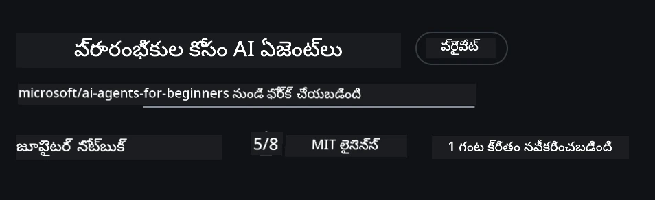
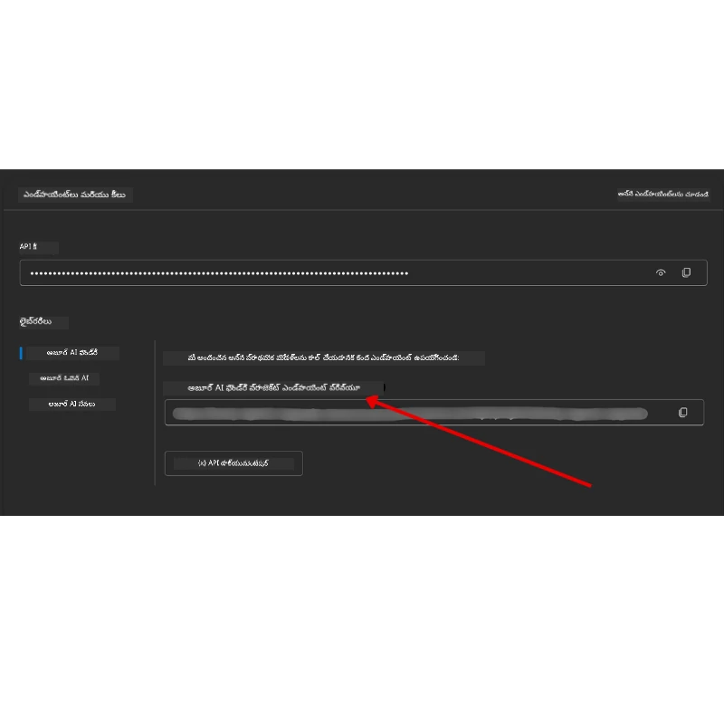

# కోర్సు సెటప్

## పరిచయం

ఈ పాఠం ఈ కోర్సు యొక్క కోడ్ నమూనాలను ఎలా నడుపాలో కవర్ చేస్తుంది.

## ఇతర అభ్యసకులతో చేరండి మరియు సహాయం పొందండి

మీరు మీ రిపోను క్లోన్ చేసుకోవడం ప్రారంభించేముందు, సెటప్ గురించి మీకు సహాయమవ్వడానికి, కోర్సు గురించి ఎటువంటి ప్రశ్నలు ఉన్నా లేదా ఇతర అభ్యసకులతో కనెక్ట్ కావడానికి [AI Agents For Beginners Discord చానల్](https://aka.ms/ai-agents/discord) లో చేరండి.

## ఈ రిపోను క్లోన్ లేదా ఫోర్క్ చేయండి

ప్రారంభించడానికి, దయచేసి GitHub రిపోజిటరీని క్లోన్ లేదా ఫోర్క్ చేయండి. ఇది మీకు కోర్సు పదార్థానికి మీ సొంత వర్షన్ ఇవ్వనుంది, అందువల్ల మీరు కోడ్‌ని నడపవచ్చు, పరీక్షించవచ్చు మరియు సవరించవచ్చు!

ఈ క్రింది లాంక్‌పై క్లిక్ చేసి <a href="https://github.com/microsoft/ai-agents-for-beginners/fork" target="_blank">ఫోర్క్ చేయండి</a>

ఇప్పుడు మీరు ఈ కింది లింకులో ఈ కోర్సు యొక్క మీ ఫోర్క్ చేసిన వర్షన్ ను కలిగి ఉండాలి:



### శాలో క్లోన్ (వర్క్షాప్ / కోడ్‌స్పేస్ల కోసం సిఫార్సు)

  > ఫుల్ రిపోజిటరీ పూర్తిగా డౌన్లోడ్ చేసినప్పుడు (గత చరిత్ర మరియు అన్ని ఫైళ్లతో) పెద్దదో కావచ్చు (~3 GB). మీరు వర్క్షాప్‌లో పాల్గొంటున్నట్లయితే లేదా కొన్ని పాఠశాల ఫోల్డర్‌లే కావాలంటే, శాలో క్లోన్ (లేదా స్పార్స్ క్లోన్) చరిత్రను తక్కువ చేసి లేదా బ్లాబ్స్‌ను స్కిప్ చేయడం ద్వారా ఎక్కువ భాగం డౌన్లోడ్ మినహాయిస్తుంది.

#### వేగవంతమైన శాలో క్లోన్ — తక్కువ చరిత్ర, అన్ని ఫైళ్లు

కింది కమాండ్లలో `<your-username>` ను మీ ఫోర్క్ URL (లేదా మీరు ఇష్టపడితే అప్‌స్ట్రీమ్ URL) తో మార్చండి.

ఇప్పటి commit చరిత్ర మాత్రమే క్లోన్ చేయడానికి (చిన్న డౌన్లోడ్):

```bash|powershell
git clone --depth 1 https://github.com/<your-username>/ai-agents-for-beginners.git
```

నియత బ్రాంచ్‌ను క్లోన్ చేయడానికి:

```bash|powershell
git clone --depth 1 --branch <branch-name> https://github.com/<your-username>/ai-agents-for-beginners.git
```

#### పార్టియల్ (స్పార్స్) క్లోన్ — తక్కువ బ్లాబ్స్ + మాత్రమే ఎంచుకున్న ఫోల్డర్స్

ఇది పార్టియల్ క్లోన్ మరియు స్పార్స్-చెకౌట్ ఉపయోగిస్తుంది (Git 2.25+ అవసరం మరియు సిఫార్సు చేయబడిన ఆధునిక Git):

```bash|powershell
git clone --depth 1 --filter=blob:none --sparse https://github.com/<your-username>/ai-agents-for-beginners.git
```

రిపో ఫోల్డర్‌లోకి వెళ్లండి:

```bash|powershell
cd ai-agents-for-beginners
```

తర్వాత మీరు కావలసిన ఫోల్డర్లు పేర్కొనండి (కింద ఉదాహరణ రెండు ఫోల్డర్లను చూపుతుంది):

```bash|powershell
git sparse-checkout set 00-course-setup 01-intro-to-ai-agents
```

క్లోనింగ్ చేసిన తరువాత మరియు ఫైళ్లను ధృవీకరించాక, మీరు కేవలం ఫైళ్లను మాత్రమే కావాలంటే, డిస్క్ స్థలం విడదీయడానికి (గిట్ చరిత్ర లేదు), దయచేసి రిపోజిటరీ మెటాడేటా తొలగించండి (💀 తిరగబడని — మీరు అన్ని Git ఫంక్షనాలిటి నష్టం పొందుతారు: commits, pulls, pushes, లేదా చరిత్ర యాక్సెస్ ఉండదు).

```bash
# zsh/bash
rm -rf .git
```

```powershell
# పవర్షెల్
Remove-Item -Recurse -Force .git
```

#### GitHub కోడ్స్పేస్‌లను ఉపయోగించడం (లోకల్ భారీ డౌన్లోడ్లను నివారించడానికి సిఫార్సు)

- ఈ రిపో కోసం [GitHub UI](https://github.com/codespaces) ద్వారా కొత్త కోడ్స్పేస్‌ని సృష్టించండి.

- కొత్తగా సృష్టించిన కోడ్స్పేస్ టెర్మినల్‌లో, మీరు కావలసిన పాఠశాల ఫోల్డర్‌లను మాత్రమే కోడ్స్పేస్ వర్క్‌స్పేస్‌లోకి తెచ్చేందుకు పైన ఉన్న శాలో / స్పార్స్ క్లోన్ కమాండ్లలో ఒకదాన్ని నడపండి.
- ఐచ్ఛికం: కోడ్స్పేసుల్లో క్లోన్ చేసిన తరువాత, అదనపు స్థలం తీసుకోవడానికి .git ను తొలగించండి (పైన ఉన్న తొలగింపు కమాండ్లు చూడండి).
- గమనిక: మీరు కోడ్స్పేసుల్లో నేరుగా రిపోను తెరవాలనుకుంటే (అదనపు క్లోన్ లేకుండా), కోడ్స్పేస్ devcontainer వాతావరణాన్ని నిర్మిస్తుంది మరియు కావలసిన దానికంటే ఎక్కువ సేవల్ని కూడా అందించవచ్చు. ఒక కొత్త కోడ్స్పేస్‌లో శాలో కాపీని క్లోన్ చేయడం డిస్క్ వినియోగాన్ని ఎక్కువగా నియంత్రించడానికి సహాయపడుతుంది.

#### చిట్కాలు

- ఎప్పుడైనా మీరు ఎడిట్ చేయాలనుకుంటే/కమిట్ చేయాలనుకుంటే, క్లోన్ URL ను మీ ఫోర్కుతో మార్చండి.
- మీరు తరువాత మరిన్ని చరిత్ర లేదా ఫైళ్లను అవసరం అయితే, వాటిని fetch చేయవచ్చు లేదా స్పార్స్-చెకౌట్ ద్వారా అదనపు ఫోల్డర్లను చేర్చవచ్చు.

## కోడ్ నడపడం

ఈ కోర్సు మీరు AI ఏజెంట్లను నిర్మించడంలో ప్రయోగాత్మక అనుభవాన్ని పొందడానికి నడపగల Jupyter నోట్ బుక్లను అందిస్తుంది.

కోడ్ నమూనాలు **Microsoft Agent Framework (MAF)**, `AzureAIProjectAgentProvider` ఉపయోగిస్తాయి, ఇది **Microsoft Foundry** ద్వారా **Azure AI Agent Service V2** (Responses API) తో కనెక్ట్ అవుతుంది.

అన్ని Python నోట్‌బూక్‌లు `*-python-agent-framework.ipynb` అని లేబుల్ చేయబడ్డాయి.

## అవసరాలు

- Python 3.12+
  - **గమనిక**: మీరు Python3.12 ఇన్స్టాల్ చేయకపోతే, దయచేసి ఇన్స్టాల్ చేసుకోండి. తరువాత, `python3.12` ఉపయోగించి venv సృష్టించి, requirements.txt ఫైల్ నుండి సరైన సంస్కరణలు ఇన్స్టాల్ అయ్యాయో లేదో నిర్ధారించండి.
  
    >ఉదాహరణ

    Python venv డైరెక్టరీను సృష్టించండి:

    ```bash|powershell
    python -m venv venv
    ```

    తరువాత venv పరిసరాన్ని క్రింది విధంగా యాక్టివేట్ చేయండి:

    ```bash
    # zsh/bash
    source venv/bin/activate
    ```
  
    ```dos
    # Command Prompt for Windows
    venv\Scripts\activate
    ```

- .NET 10+: .NET ఉపయోగించే సాంపిల్ కోడ్‌ల కోసం, [.NET 10 SDK](https://dotnet.microsoft.com/download/dotnet/10.0) లేదా తరువాత సంస్కరణను ఇన్స్టాల్ చేయండి. తరువాత, మీరు ఇన్స్టాల్ చేసిన .NET SDK సంస్కరణను తనిఖీ చేయండి:

    ```bash|powershell
    dotnet --list-sdks
    ```

- **Azure CLI** — ప్రమాణీకరణ కోసం అవసరం. [aka.ms/installazurecli](https://aka.ms/installazurecli) నుండి ఇన్స్టాల్ చేయండి.
- **Azure సబ్‌స్క్రిప్షన్** — Microsoft Foundry మరియు Azure AI Agent Service ను యాక్సెస్ చేయడానికి.
- **Microsoft Foundry ప్రాజెక్ట్** — మోడల్ ను డిప్లాయ్ చేసిన ప్రాజెక్ట్ (ఉదా: `gpt-4o`). క్రింద [స్టెప్ 1](#స్టెప్-1-microsoft-foundry-ప్రాజెక్ట్-సృష్టించండి) చూడండి.

ఈ రిపోజిటరీ రూట్లో `requirements.txt` ఫైల్ ఉంది, ఇందులో కోడ్ నమూనాలను నడపడానికి అవసరమైన అన్ని Python ప్యాకేజీలు ఉన్నాయి.

మీరు ఈ క్రింది కమాండ్‌ను రిపోజిటరీ రూట్‌లో మీ టెర్మినల్‌లో నడపడం ద్వారా వాటిని ఇన్స్టాల్ చేయవచ్చు:

```bash|powershell
pip install -r requirements.txt
```

ఎలాంటి సమస్యలు మరియు సహకారాలు తప్పించుకోవడానికి Python వర్చువల్ ఎన్విరాన్మెంట్ సృష్టించవలసినది సిఫార్సు చేయబడుతుంది.

## VSCode సెటప్ చేయండి

VSCode లో సరైన Python వెర్షన్ ఉపయోగిస్తున్నారో చూడండి.


## Microsoft Foundry మరియు Azure AI Agent Service సెటప్ చేయండి

### స్టెప్ 1: Microsoft Foundry ప్రాజెక్ట్ సృష్టించండి

నోట్‌బుక్లను నడపడానికి మీరు ఒక Azure AI Foundry **హబ్** మరియు **ప్రాజెక్ట్** డిప్లాయ్ చేసిన మోడల్‌తో కలిగి ఉండాలి.

1. [ai.azure.com](https://ai.azure.com) కి వెళ్లి మీ Azure ఖాతాతో సైన్ ఇన్ అవ్వండి.
2. ఒక **హబ్** సృష్టించండి (లేదా ఉన్న హబ్ ఉపయోగించండి). వీక్షించండి: [Hub resources overview](https://learn.microsoft.com/azure/ai-foundry/concepts/ai-resources).
3. హబ్ లో, ఒక **ప్రాజెక్ట్** సృష్టించండి.
4. **Models + Endpoints** → **Deploy model** నుండి మోడల్ (ఉదా: `gpt-4o`) ని డిప్లాయ్ చేయండి.

### స్టెప్ 2: మీ ప్రాజెక్ట్ ఎండ్పాయింట్ మరియు మోడల్ డిప్లాయ్‌మెంట్ పేరు పొందండి

Microsoft Foundry పోర్టల్‌లో మీ ప్రాజెక్ట్ నుండి:

- **ప్రాజెక్ట్ ఎండ్పాయింట్** — **Overview** పేజీకి వెళ్లి ఎండ్పాయింట్ URL ను కాపీ చేయండి.



- **మోడల్ డిప్లాయ్‌మెంట్ పేరు** — **Models + Endpoints** కి వెళ్లి డిప్లాయ్ చేసిన మోడల్ ఎంచుకుని **Deployment name** గమనించండి (ఉదా: `gpt-4o`).

### స్టెప్ 3: `az login` ద్వారా Azureలో సైన్ ఇన్ అవ్వండి

అన్ని నోట్‌బుక్లూ **`AzureCliCredential`** లను ప్రమాణీకరణ కోసం ఉపయోగిస్తాయి — ఏ API కీలు అవసరం లేదు. దీని కోసం మీరు Azure CLI ద్వారా సైన్ ఇన్ అవ్వాలి.

1. **Azure CLI ఇన్స్టాల్ చేయండి** (ఇప్పుడివరకు చేయలేదంటే): [aka.ms/installazurecli](https://aka.ms/installazurecli)

2. **సైన్ ఇన్ అవ్వండి**:

    ```bash|powershell
    az login
    ```

    లేదా మీరు రిమోట్/కోడ్స్పేస్ వాతావరణంలో ఉన్నట్లయితే బ్రౌజర్ లేకుండా:

    ```bash|powershell
    az login --use-device-code
    ```

3. **మీ సబ్స్క్రిప్షన్ ఎంచుకోండి** (ప్రమ్ప్ట్ వచ్చినప్పుడు) — మీ Foundry ప్రాజెక్ట్ ఉన్నది ఎంచుకోండి.

4. **మీరు సైన్ ఇన్ అయి ఉన్నారా అని ధృవీకరించండి**:

    ```bash|powershell
    az account show
    ```

> **`az login` ఉపయోగించే కారణం?** నోట్‌బుక్లులు `azure-identity` ప్యాకేజీ నుండి `AzureCliCredential` ఉపయోగించి ఆథెంటికేట్ అవుతాయి. అంటే, మీ Azure CLI సెషన్ ద్వారా క్రెడెన్షియల్స్ అందించబడతాయి — `.env` ఫైల్లో API కీలు లేదా సీక్రెట్స్ ఉండవు. ఇది ఒక [భద్రతా ఉత్తమ పద్ధతి](https://learn.microsoft.com/azure/developer/ai/keyless-connections).

### స్టెప్ 4: మీ `.env` ఫైల్ సృష్టించండి

ఉదాహరణ ఫైల్‌ని కాపీ చేయండి:

```bash
# zsh/bash
cp .env.example .env
```

```powershell
# పవర్‌షెల్
Copy-Item .env.example .env
```

`.env` తెరిచి ఈ రెండింటి విలువలను నింపండి:

```env
AZURE_AI_PROJECT_ENDPOINT=https://<your-project>.services.ai.azure.com/api/projects/<your-project-id>
AZURE_AI_MODEL_DEPLOYMENT_NAME=gpt-4o
```

| వేరియబుల్ | ఎక్కడ్ కనిపెట్టాలి |
|----------|---------------------|
| `AZURE_AI_PROJECT_ENDPOINT` | Foundry పోర్టల్ → మీ ప్రాజెక్ట్ → **Overview** పేజీ |
| `AZURE_AI_MODEL_DEPLOYMENT_NAME` | Foundry పోర్టల్ → **Models + Endpoints** → మీ డిప్లాయ్ అయిన మోడల్ పేరు |

ఇంతటితో ఎక్కువ భాగం పాఠాలు తయారయ్యాయి! నోట్‌బుక్లు `az login` సెషన్ ద్వారా ఆటోమేటిక్ కలిసిపోతాయి.

### స్టెప్ 5: Python డిపెండెన్సీలు ఇన్స్టాల్ చేయండి

```bash|powershell
pip install -r requirements.txt
```

ముందుగా సృష్టించిన వర్చువల్ ఎన్విరాన్మెంట్‌లో ఈ కమాండ్ నడపాలని మేము సిఫార్సు చేస్తాం.

## పాఠం 5 (Agentic RAG) కోసం అదనపు సెటప్

పాఠం 5 **Azure AI Search**ను retrieval-augmented generation కోసం ఉపయోగిస్తుంది. ఆ పాఠం నడుప తలపుకుంటే, మీ `.env` ఫైల్లో ఈ వేరియబుల్‌లు జోడించండి:

| వేరియబుల్ | ఎక్కడ్ కనుగొనాలి |
|----------|------------------|
| `AZURE_SEARCH_SERVICE_ENDPOINT` | Azure పోర్టల్ → మీ **Azure AI Search** రిసోర్స్ → **Overview** → URL |
| `AZURE_SEARCH_API_KEY` | Azure పోర్టల్ → మీ **Azure AI Search** రిసోర్స్ → **Settings** → **Keys** → ప్రాథమిక అడ్మిన్ కీ |

## పాఠం 6 మరియు పాఠం 8 (GitHub Models) కోసం అదనపు సెటప్

పాఠాలు 6 మరియు 8 లో కొన్ని నోట్‌బుక్లు Azure AI Foundry స్థానంలో **GitHub Models** ఉపయోగిస్తాయి. ఆ నమూనాలు నడపమని ఉంటే, మీరు మీ `.env` ఫైల్లో ఈ వేరియబుల్స్ జోడించండి:

| వేరియబుల్ | ఎక్కడ్ కనుగొనాలి |
|----------|------------------}}
| `GITHUB_TOKEN` | GitHub → **Settings** → **Developer settings** → **Personal access tokens** |
| `GITHUB_ENDPOINT` | వాడడానికి `https://models.inference.ai.azure.com` (డిఫాల్ట్ విలువ) |
| `GITHUB_MODEL_ID` | వాడాల్సిన మోడల్ పేరు (ఉదా: `gpt-4o-mini`) |

## ప్రత్యామ్నాయ ప్రొవైడర్: MiniMax (OpenAI-సామర్థ్యమైనది)

[MiniMax](https://platform.minimaxi.com/) భారీ కాంటెక్స్ట్ మోడల్స్ (204K టోకెన్లు వరకు) OpenAI-సరిపోలిక API అందిస్తుంది. Microsoft Agent Framework యొక్క `OpenAIChatClient` ఏ OpenAI-సరిపోలిక ఎండ్పాయింట్‌తో పని చేస్తూ, మీరు MiniMax ను GitHub Models లేదా OpenAI స్థానంలో ఉపయోగించవచ్చు.

ఈ వేరియబుల్స్ మీ `.env` ఫైల్లో జోడించండి:

| వేరియబుల్ | ఎక్కడ్ కనుగొనాలి |
|----------|------------------|
| `MINIMAX_API_KEY` | [MiniMax Platform](https://platform.minimaxi.com/) → API Keys |
| `MINIMAX_BASE_URL` | వాడాలి `https://api.minimax.io/v1` (డిఫాల్ట్ విలువ) |
| `MINIMAX_MODEL_ID` | వాడాల్సిన మోడల్ పేరు (ఉదా: `MiniMax-M2.7`) |

**ఉపలబ్ధి మోడల్స్**: `MiniMax-M2.7` (సిఫార్సు చేయబడింది), `MiniMax-M2.7-highspeed` (వేగవంతమైన ప్రతిస్పందనలు)

`OpenAIChatClient` ఉపయోగించే కోడ్ నమూనాలు (ఉదా. పాఠం 14 హోటల్ బుకింగ్ వర్క్‌ఫ్లో) `MINIMAX_API_KEY` సెటప్ అయినప్పుడు మీ MiniMax కాన్ఫిగరేషన్ ఆటోమేటుగా గుర్తించి ఉపయోగిస్తాయి.

## పాఠం 8 (Bing Grounding Workflow) కోసం అదనపు సెటప్

పాఠం 8 లో ఉన్న కండిషనల్ వర్క్‌ఫ్లో నోట్‌బుక్ **Bing grounding** ను Azure AI Foundry ద్వారా ఉపయోగిస్తుంది. ఆ నమూనా నడపాలంటే, ఈ వేరియబుల్‌ను మీ `.env` లో జోడించండి:

| వేరియబుల్ | ఎక్కడ్ కనుగొనాలి |
|----------|-----------------|
| `BING_CONNECTION_ID` | Azure AI Foundry పోర్టల్ → మీ ప్రాజెక్ట్ → **Management** → **Connected resources** → మీ Bing కనెక్షన్ → కనెక్షన్ ID ని కాపీ చేయండి |

## సమస్యల పరిష్కారం

### macOSపై SSL సర్టిఫికేట్ నిర్ధారణ లోపాలు

మీరు macOSలో అయితే మరియు ఈ క్రింది తప్పిదం వస్తే:

```plaintext
ssl.SSLCertVerificationError: [SSL: CERTIFICATE_VERIFY_FAILED] certificate verify failed: self-signed certificate in certificate chain
```

ఇది macOSలో Python యొక్క సిస్టం SSL సర్టిఫికెట్లను ఆటోమేటిక్‌గా ట్రస్ట్ చెయ్యకపోవడంతో జరిగే ప్రసిద్ధ సమస్య. కింద చెప్పిన పరిష్కారాలను క్రమంగా ప్రయత్నించండి:

**ఎంపిక 1: Python యొక్క Install Certificates స్క్రిప్ట్ నడపండి (సిఫార్సు చేయబడింది)**

```bash
# మీరు ఇన్‌స్టాల్ చేసిన Python వర్షన్‌తో 3.XX ని మార్చండి (ఉదా: 3.12 లేదా 3.13):
/Applications/Python\ 3.XX/Install\ Certificates.command
```

**ఎంపిక 2: మీ నోట్‌బుక్‌లో `connection_verify=False` ఉపయోగించండి (GitHub Models నోట్‌బుక్స్ కోసం మాత్రమే)**

పాఠం 6 నోట్‌బుక్‌లో (`06-building-trustworthy-agents/code_samples/06-system-message-framework.ipynb`), కామెంట్ చేసిన వర్క్ అరౌండ్ చేర్చబడింది. క్లయింట్ సృష్టించేటప్పుడు `connection_verify=False`ని అన్ కామెంట్ చేయండి:

```python
client = ChatCompletionsClient(
    endpoint=endpoint,
    credential=AzureKeyCredential(token),
    connection_verify=False,  # మీరు సర్టిఫికెట్ లోపాలు ఎదురైతే SSL నిర్ధారణను నిష్క్రియం చేయండి
)
```

> **⚠️ హెచ్చరిక:** SSL నిర్ధారణ (connection_verify=False) నిలిపివేయడం సర్టిఫికెట్ వెరిఫికేషన్ ను தவిర్చడం వలన భద్రత తగ్గుతుంది. ఇది అభివృద్ధి పరిసరాల్లో తాత్కాలిక పరిష్కారంగా మాత్రమే ఉపయోగించండి, ప్రొడక్షన్ లో ఎప్పుడూ వాడకండి.

**ఎంపిక 3: `truststore` ను ఇన్స్టాల్ చేసి వాడండి**

```bash
pip install truststore
```

దీనిని మీ నోట్‌బుక్ లేదా స్క్రిప్ట్ మొదట్లో నెట్‌వర్క్ కాల్స్ చేసేముందు జోడించండి:

```python
import truststore
truststore.inject_into_ssl()
```

## ఎక్కడైనా చిక్కుకున్నారా?

మీకు సెటప్ నడిపేటప్పుడు ఏ సమస్యలు ఎదురైతే, మన <a href="https://discord.gg/kzRShWzttr" target="_blank">Azure AI Community Discord</a> లో చేరండి లేదా <a href="https://github.com/microsoft/ai-agents-for-beginners/issues?WT.mc_id=academic-105485-koreyst" target="_blank">ఇష్యూ సృష్టించండి</a>.

## తదుపరి పాఠం

మీరు ఇప్పుడు ఈ కోర్సు కోడ్ నడపడానికి సిద్ధంగా ఉన్నారు. AI ఏజెంట్ల ప్రపంచం గురించి మరింత నేర్చుకున్నందుకు సంతోషంగా ఉండండి!

[Introduction to AI Agents and Agent Use Cases](../01-intro-to-ai-agents/README.md)

---

<!-- CO-OP TRANSLATOR DISCLAIMER START -->
**అస్పష్టత**:  
ఈ డాక్యుమెంట్‌ను AI అనువాద సేవ인 [Co-op Translator](https://github.com/Azure/co-op-translator) ఉపయోగించి అనువదించబడింది. మేము ఖచ్చితత్వానికి ప్రయత్నిస్తున్నప్పటికీ, స్వయంచాలక అనువాదాలలో తప్పిదాలు లేదా అసత్యతలు ఉండవచ్చు అని దయచేసి గమనించండి. స్థానిక భాషలో ఉన్న ఒరిజినల్ డాక్యుమెంట్‌ను అధికారిక మూలంగా పరిగణించాలి. ముఖ్యమైన సమాచారానికి, నిపుణుల మానవ అనువాదం సిఫార్సు చేయబడుతుంది. ఈ అనువాదం వలన కలిగే ఏటువంటి అపసం లేదా తప్పు అర్థం చేసుకోవడంలో మేము బాధ్యులు కాదు.
<!-- CO-OP TRANSLATOR DISCLAIMER END -->