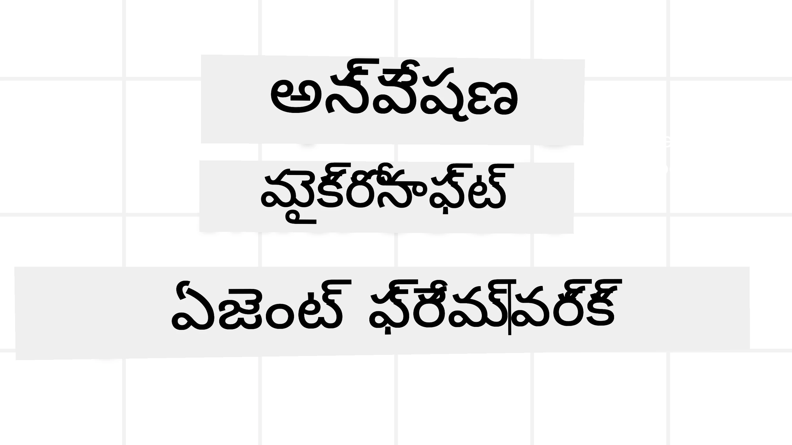
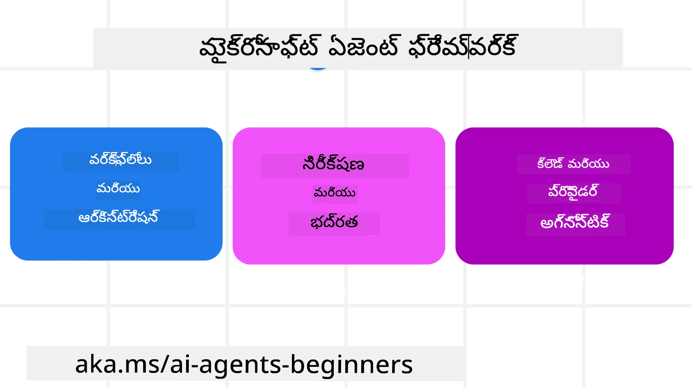

# Microsoft Agent Framework ని అన్వేషించడం



### పరిచయం

ఈ పాఠం ఈవిషయాలను కవర్ చేస్తుంది:

- Microsoft Agent Frameworkని అర్థం చేసుకోవడం: ప్రధాన లక్షణాలు మరియు విలువ  
- Microsoft Agent Framework యొక్క ముఖ్య భావాలను అన్వేషించడం
- అభివృద్ధిగల MAF నమూనాలు: వర్క్‌ఫ్లోలు, మిడిల్వేర్, మరియు మెమరీ

## అభ్యాస లక్ష్యాలు

ఈ పాఠం పూర్తిచేసిన తర్వాత, మీరు తెలుసుకుంటారు:

- Microsoft Agent Framework ఉపయోగించి ప్రొడక్షన్-తయారు AI ఏజెంట్లను నిర్మించడం
- Microsoft Agent Framework యొక్క ప్రధాన లక్షణాలను మీ ఏజెంటిక్ వాడుక కేసులకు వర్తించడం
- వర్క్‌ఫ్లో, మిడిల్వేర్ మరియు పరిశీలనలతో సహా అభివృద్ధిగల నమూనాలను ఉపయోగించడం

## కోడ్ నమూనాలు

[Microsoft Agent Framework (MAF)](https://aka.ms/ai-agents-beginners/agent-framewrok) కోసం కోడ్ నమూనాలు ఈ రెపొజిటరీలో `xx-python-agent-framework` మరియు `xx-dotnet-agent-framework` ఫైళ్లలో అందుబాటులో ఉన్నాయి.

## Microsoft Agent Framework అర్థం చేసుకోవడం



[Microsoft Agent Framework (MAF)](https://aka.ms/ai-agents-beginners/agent-framewrok) Microsoft యొక్క ఏఐ ఏజెంట్లను నిర్మించడానికి ఏకీకృత ఫ్రేమ్‌వర్క్. ఇది ప్రొడక్షన్ మరియు పరిశోధనా వాతావరణాలలో చూడబడే విస్తృత రకాల agentic వాడుక కేసులను పరిష్కరించడానికి అందుబాటులో ఉంది:

- **క్రమబద్ధమైన ఏజెంట్ ఆర్కెస్ట్రేషన్** - ప్రయోజనాల్లో దశల వారీ workflowలు అవసరమైన సందర్భాల్లో.
- **సమకాలీన ఆర్కెస్ట్రేషన్** - ఏజెంట్లు ఒకేసారి పనులు పూర్తిచేయాల్సిన సందర్భాల్లో.
- **గ్రూప్ చాట్ ఆర్కెస్ట్రేషన్** - ఏజెంట్లు ఒక పని పై కలిసి సహకరించే సందర్భాల్లో.
- **హ్యాండాఫ్ ఆర్కెస్ట్రేషన్** - ఉపపనులు పూర్తయ్యేటప్పుడు ఏజెంట్లు ఒకరినించి మరోరికీ పని బదిలీ చేసే సందర్భాల్లో.
- **మాగ్నెటిక్ ఆర్కెస్ట్రేషన్** - మేనేజర్ ఏజెంట్ పని జాబితాను సృష్టించి మార్చి ఉపఏజెంట్ల సమన్వయంతో పని పూర్తిచేస్తుంది.

AI ఏజెంట్లను ప్రొడక్షన్‌లో అందించడానికి, MAF ఈ క్రింది లక్షణాలను కూడా కలిగిస్తుంది:

- **పరిశీలన** - OpenTelemetry ఉపయోగించి ఏఐ ఏజెంట్ యొక్క ప్రతి చర్యను (టూల్ పిలుపులు, ఆర్కెస్ట్రేషన్ దశలు, తర్కప్రవాహాలు, Microsoft Foundry డాష్‌బోర్డ్స్ ద్వారా పనితీరు మానిటరింగ్) గమనిస్తారు.
- **భద్రత** - Microsoft Foundry పై ఏజెంట్లను స్వాభావికంగా హోస్టు చేయడం ద్వారా భద్రతా నియంత్రణలు (పాత్రా-ఆధారిత యాక్సెస్, వ్యక్తిగత డేటా నిర్వహణ, సవరణ భద్రత) ఉన్నాయి.
- **దృఢత్వం** - ఏజెంట్ థ్రెడ్లు మరియు వర్క్‌ఫ్లోలు స్టాప్, రీస్యూమ్ మరియు లోపాల నుండి పునరుద్ధరించవచ్చు, దీని వల్ల పొడవైన ప్రాసెస్‌లను నిర్వహించవచ్చు.
- **నియంత్రణ** - మానవ నిర్ధారణ అవసరమయిన పనులకు మానవ పాల్గొనడం ఉన్న వర్క్‌ఫ్లోలను మద్దతు ఇస్తుంది.

Microsoft Agent Framework అంతరుబిడ్డలు సాధ్యం కావడానికి కూడా కేంద్రీకృతంగా పనిచేస్తుంది:

- **క్లౌడ్-నిరపేక్షం** - ఏజెంట్లు కంటైనర్లలో, ఆన్-ప్రామ్ లేదా అనేక క్లౌడ్లలో నడిచే వీలుంది.
- **ప్రొవైడర్-నిరపేక్షం** - Azure OpenAI మరియు OpenAI వంటి మీ ఇష్టమైన SDK ద్వారా ఏజెంట్లు రూపొందించవచ్చు.
- **ప్రామాణికాలు ఏకీకరణ** - Agent-to-Agent(A2A) మరియు Model Context Protocol (MCP) వంటి ప్రోటోకాల్స్ ద్వారా ఇతర ఏజెంట్లు మరియు టూల్స్ కనిపెట్టడము మరియు వినియోగం.
- **ప్లగిన్లు మరియు కనెక్టర్లు** - Microsoft Fabric, SharePoint, Pinecone మరియు Qdrant వంటి డేటా మరియు మెమరీ సేవలతో కనెక్షన్లు.

ఇప్పుడు ఈ లక్షణాలు Microsoft Agent Framework యొక్క కొన్ని ప్రధాన భావాలకు ఎలా వర్తించాయో చూద్దాం.

## Microsoft Agent Framework యొక్క ముఖ్య భావాలు

### ఏజెంట్లు


**ఏజెంట్లను సృష్టించడం**

ఏజెంట్ సృష్టి ఇన్ఫరెన్స్ సర్వీస్ (LLM ప్రొవైడర్), ఏఐ ఏజెంట్ అనుసరించాల్సిన సూచనల సమాహారం, మరియు కేటాయించిన `name`ని నిర్వచించడం ద్వారా చేయబడుతుంది:

```python
agent = AzureOpenAIChatClient(credential=AzureCliCredential()).create_agent( instructions="You are good at recommending trips to customers based on their preferences.", name="TripRecommender" )
```

పైది `Azure OpenAI` ఉపయోగిస్తోంది, కానీ ఏజెంట్లు ఈ క్రింది సేవలతో కూడా సృష్టించవచ్చు `Microsoft Foundry Agent Service`:

```python
AzureAIAgentClient(async_credential=credential).create_agent( name="HelperAgent", instructions="You are a helpful assistant." ) as agent
```

OpenAI `Responses`, `ChatCompletion` APIs

```python
agent = OpenAIResponsesClient().create_agent( name="WeatherBot", instructions="You are a helpful weather assistant.", )
```

```python
agent = OpenAIChatClient().create_agent( name="HelpfulAssistant", instructions="You are a helpful assistant.", )
```

లేదా [MiniMax](https://platform.minimaxi.com/), ఇది పెద్ద కాంటెక్స్ట్ విండోలతో (204K టోకెన్ల వరకు) OpenAI అనుకూల API అందిస్తుంది:

```python
agent = OpenAIChatClient(base_url="https://api.minimax.io/v1", api_key=os.environ["MINIMAX_API_KEY"], model_id="MiniMax-M2.7").create_agent( name="HelpfulAssistant", instructions="You are a helpful assistant.", )
```

లేదా A2A ప్రోటోకాల్ ఉపయోగించి రిమోట్ ఏజెంట్లు:

```python
agent = A2AAgent( name=agent_card.name, description=agent_card.description, agent_card=agent_card, url="https://your-a2a-agent-host" )
```

**ఏజెంట్లను నడపడం**

ఏజెంట్లు `.run` లేదా `.run_stream` పద్ధతులను ఉపయోగించి నాన్-స్ట్రీమింగ్ లేదా స్ట్రీమింగ్ స్పందనల కోసం నడపబడతాయి.

```python
result = await agent.run("What are good places to visit in Amsterdam?")
print(result.text)
```

```python
async for update in agent.run_stream("What are the good places to visit in Amsterdam?"):
    if update.text:
        print(update.text, end="", flush=True)

```

ప్రతి ఏజెంట్ నడపడంలో `max_tokens`, ఏటెగెం కాల్ చేయగల `tools`, మరియు ఏజెంట్ కోసం ఉపయోగించే `model` వంటి పరిమాణాలను అనుకూలీకరించవచ్చు.

ఇది వినియోగదారు ప‌ని పూర్తి చేయడానికి నిర్దిష్ట మోడల్స్ లేదా టూల్స్ అవసరమయ్యే సందర్భాల్లో ఉపయోగకరం.

**టూల్స్**

టూల్స్‌ను ఏజెంట్ నిర్వచన సమయంలో కూడా నిర్వచించవచ్చు:

```python
def get_attractions( location: Annotated[str, Field(description="The location to get the top tourist attractions for")], ) -> str: """Get the top tourist attractions for a given location.""" return f"The top attractions for {location} are." 


# ChatAgent ని నేరుగా సృష్టించేటప్పుడు

agent = ChatAgent( chat_client=OpenAIChatClient(), instructions="You are a helpful assistant", tools=[get_attractions]

```

మరియు ఏజెంట్ నడపడంలో కూడా:

```python

result1 = await agent.run( "What's the best place to visit in Seattle?", tools=[get_attractions] # ఈ రన్ కోసం మాత్రమే అందించిన సాధనం )
```

**ఏజెంట్ థ్రెడ్లు**

ఏజెంట్ థ్రెడ్లు బహుళ మలుపుల సంభాషణలను నిర్వహించడానికి ఉపయోగిస్తారు. థ్రెడ్లు ఈ విధంగా సృష్టించవచ్చు:

- `get_new_thread()` ఉపయోగించడం, ఇది థ్రెడ్‌ను కాలంతో పాటు సేฟ్ చేయడానికి అనుమతిస్తుంది
- ఏజెంట్ నడపడంలో ఆటోమాటిక్‌గా థ్రెడ్ సృష్టించటం, అది ప్రస్తుత నడక సమయంలో మాత్రమే ఉంటుంది.

థ్రెడ్ సృష్టించడానికి కో드는 ఇలాభాగొంది:

```python
# కొత్త థ్రెడ్ సృష్టించండి.
thread = agent.get_new_thread() # ఆ ఏజెంట్‌ను థ్రెడ్‌తో నడపండి.
response = await agent.run("Hello, I am here to help you book travel. Where would you like to go?", thread=thread)

```

తర్వాత ఈ థ్రెడ్‌ను భవిష్యత్తులో ఉపయోగం కోసం సీరియలైజ్ చేయవచ్చు:

```python
# కొత్త థ్రెడ్ సృష్టించండి.
thread = agent.get_new_thread() 

# ఆజెంట్‌ను థ్రెడ్‌తోపాటు నడపండి.

response = await agent.run("Hello, how are you?", thread=thread) 

# నిల్వ కోసం థ్రెడ్‌ను సీరియలైజ్ చేయండి.

serialized_thread = await thread.serialize() 

# నిల్వ నుండి లోడ్ చేసిన తరువాత థ్రెడ్ స్థితిని డీసీరియలైజ్ చేయండి.

resumed_thread = await agent.deserialize_thread(serialized_thread)
```

**ఏజెంట్ మిడిల్వేర్**

ఏజెంట్లు టూల్స్ మరియు LLMs తో వినియోగదారు పనులను పూర్తి చేయడానికి పరస్పర చర్య చేస్తాయి. కొన్ని సందర్భాల్లో, మేము ఈ పరస్పర చర్యల మధ్యలో ఒక చర్యను అమలు చేయాలనుకుంటాము. ఏజెంట్ మిడిల్వేర్ ఇది సాధ్యమవుతుంది:

*ఫంక్షన్ మిడిల్వేర్*

ఈ మిడిల్వేర్ ఏజెంట్ మరియు అది పిలవబోయే ఫంక్షన్/టూల్ మధ్య చర్యను అమలు చేయడానికి అనుమతిస్తుంది. ఉదాహరణకు, ఫంక్షన్ కాల్ పై కొన్ని లాగింగ్ చేయాలనుకుంటే ఇది ఉపయోగపడుతుంది.

క్రింద కోడ్‌లో `next` దాని తర్వాతి మిడిల్వేర్ లేదా అసలు ఫంక్షన్ పిలవాలని సూచిస్తుంది.

```python
async def logging_function_middleware(
    context: FunctionInvocationContext,
    next: Callable[[FunctionInvocationContext], Awaitable[None]],
) -> None:
    """Function middleware that logs function execution."""
    # ప్రీ-ప్రాసెసింగ్: ఫంక్షన్ నడిచే ముందు లాగ్ చేయండి
    print(f"[Function] Calling {context.function.name}")

    # తదుపరి మిడిల్‌వేర్ లేదా ఫంక్షన్ నడపడం కొనసాగించండి
    await next(context)

    # పోస్ట్-ప్రాసెసింగ్: ఫంక్షన్ నడిచిన తర్వాత లాగ్ చేయండి
    print(f"[Function] {context.function.name} completed")
```

*చాట్ మిడిల్వేర్*

ఈ మిడిల్వేర్ ఏజెంట్ మరియు LLM మధ్య అభ్యర్థనల మధ్య చర్యను అమలు లేదా లాగ్ చేయడానికి అనుమతిస్తుంది.

ఇందులో AI సేవకు పంపబడుతున్న `messages` వంటి ముఖ్యమైన సమాచారం ఉంటుంది.

```python
async def logging_chat_middleware(
    context: ChatContext,
    next: Callable[[ChatContext], Awaitable[None]],
) -> None:
    """Chat middleware that logs AI interactions."""
    # ముందస్తు ప్రాసెసింగ్: AI కాల్ ముందు లాగ్
    print(f"[Chat] Sending {len(context.messages)} messages to AI")

    # తదుపరి మిడిల్వేర్ లేదా AI సర్వీస్‌కి కొనసాగించండి
    await next(context)

    # తరువాత ప్రాసెసింగ్: AI ప్రతిస్పందన తర్వాత లాగ్
    print("[Chat] AI response received")

```

**ఏజెంట్ మెమరీ**

`Agentic Memory` పాఠంలో చూపించినట్లుగా, మెమరీ ఏజెంట్ ను వేర్వేరు సారాంశాలపై పనిచేయించేలా చేయడానికి ముఖ్యమైన భాగం. MAF లో పలు రకాల మెమరీలు ఉన్నాయి:

*ఇన్-మెమరీ స్టోరేజ్*

అప్లికేషన్ రన్‌ టైమ్ సమయంలో థ్రెడ్లలో నిల్వ చేయబడిన మెమరీ.

```python
# కొత్త థ్రెడ్ సృష్టించండి.
thread = agent.get_new_thread() # ఈ థ్రెడ్‌తో ఏజెంట్‌ను పరుగెడండి.
response = await agent.run("Hello, I am here to help you book travel. Where would you like to go?", thread=thread)
```

*స్థిరమైన సందేశాలు*

విభిన్న సెషన్లలో సంభాషణ చరిత్ర నిల్వ చేయడానికి ఈ మెమరీ ఉపయోగిస్తారు. ఇది `chat_message_store_factory` ఉపయోగించి నిర్వచించబడుతుంది:

```python
from agent_framework import ChatMessageStore

# కస్టమ్ సందేశ నిల్వను సృష్టించండి
def create_message_store():
    return ChatMessageStore()

agent = ChatAgent(
    chat_client=OpenAIChatClient(),
    instructions="You are a Travel assistant.",
    chat_message_store_factory=create_message_store
)

```

*డైనమిక్ మెమరీ*

ఏజెంట్లు నడిపే ముందు కాంటెక్స్ట్‌కు జోడించబడును. ఈ మెమరీలను mem0 వంటి బాహ్య సేవలలో నిల్వ చేయవచ్చు:

```python
from agent_framework.mem0 import Mem0Provider

# ప్రगत మెమొరీ సామర్థ్యాల కోసం Mem0 ఉపయోగించడం
memory_provider = Mem0Provider(
    api_key="your-mem0-api-key",
    user_id="user_123",
    application_id="my_app"
)

agent = ChatAgent(
    chat_client=OpenAIChatClient(),
    instructions="You are a helpful assistant with memory.",
    context_providers=memory_provider
)

```

**ఏజెంట్ పరిశీలన**

నా విశ్వసనీయమైన మరియు నిర్వహించగల ఏజెంటిక్ సిస్టమ్‌లను నిర్మించడానికి పరిశీలన ముఖ్యం. MAF OpenTelemetryతో సమ్మిళితం అవolvedూ ట్రేసింగ్ మరియు మీటర్లు అందిస్తుంది.

```python
from agent_framework.observability import get_tracer, get_meter

tracer = get_tracer()
meter = get_meter()
with tracer.start_as_current_span("my_custom_span"):
    # ఏదైనా చేయండి
    pass
counter = meter.create_counter("my_custom_counter")
counter.add(1, {"key": "value"})
```

### వర్క్‌ఫ్లోలు

MAF ముందుగా నిర్వచించిన దశల వర్క్‌ఫ్లోలను అందిస్తుంది, ఇవి పనిని పూర్తి చేస్తాయి మరియు ఆ దశల్లో AI ఏజెంట్లను భాగాలుగా కలుపుకుంటాయి.

వర్క్‌ఫ్లోలు వివిధ భాగాలతో రూపొందించబడి, కంట్రోల్ ఫ్లో మెరుగుపరుస్తాయి. వర్క్‌ఫ్లోలు **బహుళ-ఏజెంట్ ఆర్కెస్ట్రేషన్** మరియు **checkpointing** మద్దతు ఇస్తాయి వర్క్‌ఫ్లో స్థితులను సేవ్ చేయడానికి.

వర్క్‌ఫ్లో ప్రధాన భాగాలు:

**ఎక్సిక్యూటర్లు**

ఎక్సిక్యూటర్లు ఇన్‌పుట్ మెసేజులను అందుకుని, వారి కేటాయింపులను నిర్వహించి, అవుట్‌పుట్ మెసేజ్ ఉత్పత్తి చేస్తారు. ఇది వర్క్‌ఫ్లోను పెద్ద పనికి ముందుకు తీసుకెళుతుంది. ఎక్సిక్యూటర్లు AI ఏజెంట్ కాబోతాయి లేదా కస్టమ్ లాజిక్ కాబోతాయి.

**ఎడ్జెస్**

వర్క్‌ఫ్లోలో మెసేజుల ప్రవాహాన్ని నిర్వచించడానికి ఎడ్జెస్ ఉపయోగిస్తారు. ఇవి ఉంటాయి:

*డైరెక్ట్ ఎడ్జెస్* - ఎక్సిక్యూటర్ల మధ్య సింపుల్ ఒక్కో కనెక్షన్లు:

```python
from agent_framework import WorkflowBuilder

builder = WorkflowBuilder()
builder.add_edge(source_executor, target_executor)
builder.set_start_executor(source_executor)
workflow = builder.build()
```

*షరతుపడిన ఎడ్జెస్* - నిర్దిష్ట షరతు తీరిన తర్వాత క్రియాశీలం అవుతాయి. ఉదాహరణకు హోటల్ గదులు అందుబాటులో లేనప్పుడు, ఎక్సిక్యూటర్ ఇతర ఆప్షన్లు సూచించగలడు.

*స్విచ్-కేస్ ఎడ్జెస్* - నిర్వచించిన షరతులపై ఆధారపడి మెసేజులను వేర్వేరు ఎక్సిక్యూటర్లకు మళ్లించు. ఉదాహరణకు, ప్రయాణ ఖాతాదారుకు ప్రాధాన్యత యాక్సెస్ ఉంటే, వారి పనులు ఇంకొక వర్క్‌ఫ్లో ద్వారా నిర్వహించబడతాయి.

*ఫ్యాన్-ఆవుట్ ఎడ్జెస్* - ఒక మెసేజ్‌ను అనేక లక్ష్యాలకు పంపడం.

*ఫ్యాన్-ఇన్ ఎడ్జెస్* - అనేక ఎక్సిక్యూటర్ల నుండి మెసేజులను సమకూర్చి ఒక లక్ష్యానికి పంపడం.

**ఇవెంట్స్**

వర్క్‌ఫ్లోలకి మెరుగైన పరిశీలన అందించడానికి, MAF ఈ క్రింది ఎగ్జిక్యూషన్ కార్యక్రమాల కోసం నిర్మిత ఈవెంట్లను అందిస్తుంది:

- `WorkflowStartedEvent`  - వర్క్‌ఫ్లో ఎగ్జిక్యూషన్ ప్రారంభమైనది
- `WorkflowOutputEvent` - వర్క్‌ఫ్లో ఒక అవుట్‌పుట్ ఉత్పత్తి చేసింది
- `WorkflowErrorEvent` - వర్క్‌ఫ్లోలో లోపం సంభవించింది
- `ExecutorInvokeEvent`  - ఎక్సిక్యూటర్ ప్రాసెసింగ్ ప్రారంభించింది
- `ExecutorCompleteEvent`  -  ఎక్సిక్యూటర్ ప్రాసెసింగ్ పూర్తిచేయింది
- `RequestInfoEvent` - అభ్యర్థన జారీ చేసింది

## అభివృద్ధిగల MAF నమూనాలు

పై విభాగాల్లో Microsoft Agent Framework యొక్క ముఖ్య భావాలను చూశాము. మీరు మరింత సంక్లిష్ట ఏజెంట్లను నిర్మించేటప్పుడు, పరిగణించవలసిన కొన్ని అభివృద్ధిగల నమూనాలు ఇవిటి:

- **మిడిల్వేర్ కాంపోజిషన్**: ఫంక్షన్ మరియు చాట్ మిడిల్వేర్ ఉపయోగించి అనేక మిడిల్వేర్ హ్యాండ్లర్లను (లాగింగ్, ఆథ్, రేట్-లిమిటింగ్) గొప్ప నియంత్రణ కోసం జాడ్చేయడం.
- **వర్క్‌ఫ్లో checkpointing**: వర్క్‌ఫ్లో ఈవెంట్లు మరియు సీరియలైజేషన్ ఉపయోగించి పొడవైన ఏజెంట్ ప్రాసెస్‌లను సేవ్ చేసి మళ్లీ మొదలుపెట్టడం.
- **డైనమిక్ టూల్ ఎంచుకోవడం**: టూల్ వర్ణనలపై RAG ని MAF టూల్ రిజిస్ట్రేషన్‌తో కలిపి ప్రశ్నలకు సంబంధిత టూల్స్ మాత్రమే చూపించడం.
- **బహుళ-ఏజెంట్ హ్యాండాఫ్**: వర్క్‌ఫ్లో ఎడ్జెస్ మరియు షరతుపడిన రూటింగ్ ఉపయోగించి ప్రత్యేక ఏజెంట్ల మధ్య హ్యాండాఫ్ ఆర్కెస్ట్రేషన్.

## కోడ్ నమూనాలు

Microsoft Agent Framework కోసం కోడ్ నమూనాలు ఈ రెపొజిటరీలో `xx-python-agent-framework` మరియు `xx-dotnet-agent-framework` ఫైళ్లలో అందుబాటులో ఉన్నాయి.

## Microsoft Agent Framework గురించి మరిన్ని ప్రశ్నలు ఉన్నాయా?

మరెందరో అభ్యాసకులతో కలవడానికి, ఆఫీస్ గంటలకు హాజరవడానికి మరియు మీ AI ఏజెంట్ల సంబంధిత ప్రశ్నలకు సమాధానాలు పొందడానికి [Microsoft Foundry Discord](https://aka.ms/ai-agents/discord) లో చేరండి.

---

<!-- CO-OP TRANSLATOR DISCLAIMER START -->
**విజ్ఞప్తి**:  
ఈ పత్రాన్ని AI అనువాద సేవ [Co-op Translator](https://github.com/Azure/co-op-translator) ఉపయోగించి అనువదించారు. మా ప్రయత్నం సరైనదిగా ఉండటమే అయితే, స్వయంచాలక అనువాదాల్లో తప్పులు లేదా అపవృత్తులు ఉండవచ్చు. అసలు పత్రం దాని స్థానిక భాషలో ఉన్న దాని మూలాధారమైన గ్రంథంగా పరిగణించాలి. ముఖ్యమైన సమాచారానికి వృత్తిపరమైన మానవ అనువాద సేవను సిఫార్సు చేస్తున్నాము. ఈ అనువాదాన్ని ఉపయోగించడంతో వచ్చిన ఏవైనా అపవ్యాఖ్యలు లేదా తప్పుదారితీస్కోవడంలో మేము బాధ్యులం కాదు.
<!-- CO-OP TRANSLATOR DISCLAIMER END -->