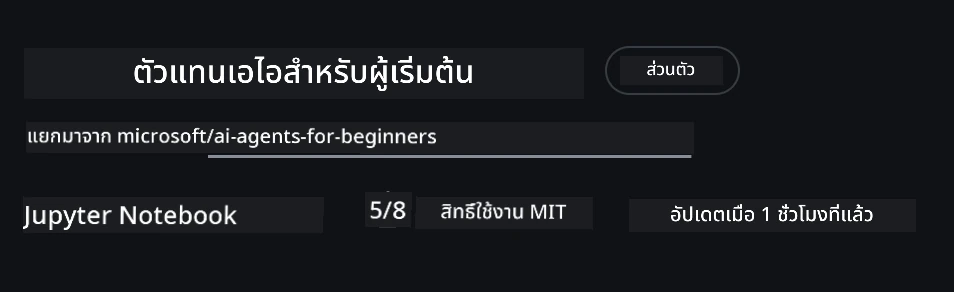

# การตั้งค่าหลักสูตร

## บทนำ

บทเรียนนี้จะครอบคลุมวิธีการรันตัวอย่างโค้ดของหลักสูตรนี้

## ร่วมกับผู้เรียนคนอื่น ๆ และรับความช่วยเหลือ

ก่อนที่คุณจะเริ่มโคลนรีโปของคุณ เข้าร่วม [ช่อง Discord AI Agents For Beginners](https://aka.ms/ai-agents/discord) เพื่อขอความช่วยเหลือเกี่ยวกับการตั้งค่า คำถามใด ๆ เกี่ยวกับหลักสูตร หรือเพื่อเชื่อมต่อกับผู้เรียนคนอื่น ๆ

## โคลนหรือฟอร์กรีโปนี้

เพื่อเริ่มต้น กรุณาโคลนหรือฟอร์ก GitHub Repository นี้ จะทำให้คุณมีเวอร์ชันของเนื้อหาหลักสูตรนั้นเป็นของตัวเอง เพื่อให้คุณสามารถรัน ทดสอบ และปรับแต่งโค้ดได้!

คุณสามารถทำได้โดยคลิกที่ลิงก์ <a href="https://github.com/microsoft/ai-agents-for-beginners/fork" target="_blank">ฟอร์กรีโป</a>

ตอนนี้คุณควรมีเวอร์ชันฟอร์กของหลักสูตรนี้อยู่ที่ลิงก์ต่อไปนี้:



### โคลนแบบตื้น ๆ (แนะนำสำหรับ workshop / Codespaces)

> รีโปเต็มอาจมีขนาดใหญ่ (~3 GB) เมื่อคุณดาวน์โหลดประวัติทั้งหมดและไฟล์ทั้งหมด หากคุณเข้าร่วมเฉพาะเวิร์กช็อปหรือเพียงแค่ต้องการโฟลเดอร์บทเรียนบางส่วน โคลนแบบตื้น ๆ (หรือโคลนแบบระยะห่าง) จะช่วยหลีกเลี่ยงการดาวน์โหลดส่วนใหญ่โดยการตัดประวัติหรือข้ามบล็อบบางส่วน

#### โคลนตื้นอย่างรวดเร็ว — ประวัติน้อยที่สุด ไฟล์ทั้งหมด

แทนที่ `<your-username>` ในคำสั่งด้านล่างด้วย URL ฟอร์กของคุณ (หรือ URL ต้นทางถ้าคุณต้องการ)

เพื่อโคลนเฉพาะประวัติการคอมมิตล่าสุด (ดาวน์โหลดขนาดเล็ก):

```bash|powershell
git clone --depth 1 https://github.com/<your-username>/ai-agents-for-beginners.git
```

เพื่อโคลนสาขาที่เฉพาะ:

```bash|powershell
git clone --depth 1 --branch <branch-name> https://github.com/<your-username>/ai-agents-for-beginners.git
```

#### โคลนบางส่วน (sparse) — บล็อบน้อยที่สุด + เฉพาะโฟลเดอร์ที่เลือก

นี้ใช้โคลนบางส่วนและ sparse-checkout (ต้องใช้ Git 2.25+ และแนะนำให้ใช้ Git รุ่นใหม่ที่รองรับโคลนบางส่วน):

```bash|powershell
git clone --depth 1 --filter=blob:none --sparse https://github.com/<your-username>/ai-agents-for-beginners.git
```

เข้าไปยังโฟลเดอร์รีโป:

```bash|powershell
cd ai-agents-for-beginners
```

จากนั้นระบุว่าโฟลเดอร์ใดที่คุณต้องการ (ตัวอย่างด้านล่างแสดงสองโฟลเดอร์):

```bash|powershell
git sparse-checkout set 00-course-setup 01-intro-to-ai-agents
```

หลังจากโคลนและตรวจสอบไฟล์แล้ว หากคุณต้องการเฉพาะไฟล์และต้องการเพิ่มพื้นที่ว่าง (ไม่มีประวัติ Git) กรุณาลบเมตาดาทารีโป (💀ไม่สามารถย้อนกลับ — คุณจะสูญเสียความสามารถ Git ทั้งหมด: ไม่มีคอมมิต, ดึง, ผลัก หรือเข้าถึงประวัติ)

```bash
# zsh/bash
rm -rf .git
```

```powershell
# พาวเวอร์เชลล์
Remove-Item -Recurse -Force .git
```

#### ใช้ GitHub Codespaces (แนะนำเพื่อหลีกเลี่ยงการดาวน์โหลดขนาดใหญ่ในเครื่อง)

- สร้าง Codespace ใหม่สำหรับรีโปนี้ผ่าน [GitHub UI](https://github.com/codespaces)  

- ในเทอร์มินัลของ Codespace ที่สร้างใหม่ รันคำสั่ง shallow/sparse clone ด้านบนเพื่อดึงเฉพาะโฟลเดอร์บทเรียนที่คุณต้องการเข้าสู่พื้นที่ทำงานของ Codespace
- ตัวเลือก: หลังจากโคลนใน Codespaces แล้ว ลบ .git เพื่อคืนพื้นที่ว่างเพิ่ม (ดูคำสั่งลบด้านบน)
- หมายเหตุ: หากคุณต้องการเปิดรีโปโดยตรงใน Codespaces (โดยไม่ต้องโคลนเพิ่ม) ให้ทราบว่า Codespaces จะสร้างสภาพแวดล้อม devcontainer และอาจติดตั้งมากกว่าที่คุณต้องการ การโคลนแบบตื้นใน Codespace ใหม่จะให้คุณควบคุมการใช้งานดิสก์ได้มากขึ้น

#### เคล็ดลับ

- แทนที่ URL โคลนด้วยฟอร์กของคุณเสมอหากคุณต้องการแก้ไข/คอมมิต
- หากคุณต้องการประวัติหรือไฟล์เพิ่มในภายหลัง คุณสามารถดึงข้อมูลหรือปรับ sparse-checkout เพื่อรวมโฟลเดอร์เพิ่มเติมได้

## การรันโค้ด

หลักสูตรนี้มีชุด Jupyter Notebooks เพื่อให้คุณได้ฝึกปฏิบัติสร้าง AI Agents

ตัวอย่างโค้ดใช้ **Microsoft Agent Framework (MAF)** กับ `AzureAIProjectAgentProvider` ซึ่งเชื่อมต่อกับ **Azure AI Agent Service V2** (API Responses) ผ่าน **Microsoft Foundry**

โน้ตบุ๊ค Python ทั้งหมดจะมีป้ายชื่อ `*-python-agent-framework.ipynb`

## ความต้องการ

- Python 3.12+
  - **หมายเหตุ**: หากคุณยังไม่มี Python3.12 ติดตั้ง กรุณาติดตั้งก่อน จากนั้นสร้าง venv โดยใช้ python3.12 เพื่อให้แน่ใจว่าจะติดตั้งเวอร์ชันที่ถูกต้องจากไฟล์ requirements.txt

    >ตัวอย่าง

    สร้างไดเรกทอรี Python venv:

    ```bash|powershell
    python -m venv venv
    ```

    จากนั้นเปิดใช้งานสภาพแวดล้อม venv สำหรับ:

    ```bash
    # zsh/bash
    source venv/bin/activate
    ```
  
    ```dos
    # Command Prompt for Windows
    venv\Scripts\activate
    ```

- .NET 10+: สำหรับตัวอย่างโค้ดที่ใช้ .NET ให้แน่ใจว่าคุณติดตั้ง [.NET 10 SDK](https://dotnet.microsoft.com/download/dotnet/10.0) หรือเวอร์ชันใหม่กว่า จากนั้นตรวจสอบเวอร์ชัน .NET SDK ที่ติดตั้ง:

    ```bash|powershell
    dotnet --list-sdks
    ```

- **Azure CLI** — จำเป็นสำหรับการตรวจสอบสิทธิ์ ติดตั้งได้ที่ [aka.ms/installazurecli](https://aka.ms/installazurecli)
- **Subscription ของ Azure** — เพื่อเข้าถึง Microsoft Foundry และ Azure AI Agent Service
- **โปรเจกต์ Microsoft Foundry** — โปรเจกต์ที่มีโมเดลที่ปรับใช้แล้ว (เช่น `gpt-4o`) ดูที่ [ขั้นตอนที่ 1](#ขั้นตอนที่-1-สร้างโปรเจกต์-microsoft-foundry) ข้างล่าง

เราได้รวมไฟล์ `requirements.txt` ไว้ที่โฟลเดอร์หลักของรีโปนี้ ซึ่งมีแพ็กเกจ Python ที่จำเป็นทั้งหมดสำหรับรันตัวอย่างโค้ด

คุณสามารถติดตั้งได้โดยรันคำสั่งต่อไปนี้ในเทอร์มินัลที่โฟลเดอร์หลักของรีโป:

```bash|powershell
pip install -r requirements.txt
```

เราแนะนำให้สร้างสภาพแวดล้อม Python แบบเสมือนเพื่อหลีกเลี่ยงข้อขัดแย้งหรือปัญหา

## ตั้งค่า VSCode

ตรวจสอบให้แน่ใจว่าคุณใช้เวอร์ชัน Python ที่ถูกต้องใน VSCode


## ตั้งค่า Microsoft Foundry และ Azure AI Agent Service

### ขั้นตอนที่ 1: สร้างโปรเจกต์ Microsoft Foundry

คุณต้องมี Azure AI Foundry **hub** และ **project** พร้อมโมเดลที่ปรับใช้แล้วเพื่อรันโน้ตบุ๊ค

1. เข้าสู่ [ai.azure.com](https://ai.azure.com) และลงชื่อเข้าใช้ด้วยบัญชี Azure ของคุณ
2. สร้าง **hub** (หรือใช้ที่มีอยู่แล้ว) ดู: [Hub resources overview](https://learn.microsoft.com/azure/ai-foundry/concepts/ai-resources)
3. ใน hub สร้าง **project**
4. ปรับใช้โมเดล (เช่น `gpt-4o`) จาก **Models + Endpoints** → **Deploy model**

### ขั้นตอนที่ 2: ดึง Endpoint โปรเจกต์และชื่อการปรับใช้โมเดลของคุณ

จากโปรเจกต์ของคุณในพอร์ทัล Microsoft Foundry:

- **Project Endpoint** — ไปที่หน้าสรุปภาพรวม (Overview) และคัดลอก URL endpoint


- **ชื่อการปรับใช้โมเดล** — ไปที่ **Models + Endpoints** เลือกโมเดลที่ปรับใช้ แล้วจดชื่อ **Deployment name** (เช่น `gpt-4o`)

### ขั้นตอนที่ 3: ลงชื่อเข้าใช้ Azure ด้วย `az login`

โน้ตบุ๊คทั้งหมดใช้ **`AzureCliCredential`** สำหรับการยืนยันตัวตน — ไม่มีคีย์ API ให้จัดการ ซึ่งต้องให้คุณลงชื่อผ่าน Azure CLI

1. **ติดตั้ง Azure CLI** หากยังไม่ติดตั้ง: [aka.ms/installazurecli](https://aka.ms/installazurecli)

2. **ลงชื่อเข้าใช้** ด้วยคำสั่ง:

    ```bash|powershell
    az login
    ```

    หรือถ้าคุณอยู่ในสภาพแวดล้อมระยะไกล/Codespace ที่ไม่มีเบราว์เซอร์:

    ```bash|powershell
    az login --use-device-code
    ```

3. **เลือก subscription** หากระบบถาม — เลือก subscription ที่มีโปรเจกต์ Foundry ของคุณ

4. **ตรวจสอบ** ว่าคุณลงชื่อเข้าใช้แล้ว:

    ```bash|powershell
    az account show
    ```

> **ทำไมต้อง `az login`?** โน้ตบุ๊คจะยืนยันตัวตนด้วย `AzureCliCredential` จากแพ็กเกจ `azure-identity` หมายความว่าเซสชัน Azure CLI ของคุณจะจัดการข้อมูลรับรองโดยตรง — ไม่มีคีย์ API หรือความลับในไฟล์ `.env` ซึ่งเป็น [แนวปฏิบัติด้านความปลอดภัยที่ดีที่สุด](https://learn.microsoft.com/azure/developer/ai/keyless-connections)

### ขั้นตอนที่ 4: สร้างไฟล์ `.env` ของคุณ

คัดลอกไฟล์ตัวอย่าง:

```bash
# zsh/bash
cp .env.example .env
```

```powershell
# PowerShell
Copy-Item .env.example .env
```

เปิด `.env` และกรอกค่าต่อไปนี้:

```env
AZURE_AI_PROJECT_ENDPOINT=https://<your-project>.services.ai.azure.com/api/projects/<your-project-id>
AZURE_AI_MODEL_DEPLOYMENT_NAME=gpt-4o
```

| ตัวแปร | หาได้ที่ไหน |
|----------|-----------------|
| `AZURE_AI_PROJECT_ENDPOINT` | พอร์ทัล Foundry → โปรเจกต์ของคุณ → หน้า **Overview** |
| `AZURE_AI_MODEL_DEPLOYMENT_NAME` | พอร์ทัล Foundry → **Models + Endpoints** → ชื่อโมเดลที่ปรับใช้ |

ก็ครบสำหรับบทเรียนส่วนใหญ่! โน้ตบุ๊คจะยืนยันตัวตนโดยอัตโนมัติผ่านเซสชัน `az login` ของคุณ

### ขั้นตอนที่ 5: ติดตั้ง Dependencies ของ Python

```bash|powershell
pip install -r requirements.txt
```

เราแนะนำให้รันนี้ภายในสภาพแวดล้อมเสมือนที่คุณสร้างไว้ก่อนหน้า

## การตั้งค่าเพิ่มเติมสำหรับบทเรียน 5 (Agentic RAG)

บทเรียน 5 ใช้ **Azure AI Search** สำหรับการรวมข้อมูลเสริมการสร้าง หากคุณวางแผนจะรันบทเรียนนั้น ให้เพิ่มตัวแปรเหล่านี้ในไฟล์ `.env` ของคุณ:

| ตัวแปร | หาได้ที่ไหน |
|----------|-----------------|
| `AZURE_SEARCH_SERVICE_ENDPOINT` | พอร์ทัล Azure → ทรัพยากร **Azure AI Search** ของคุณ → **Overview** → URL |
| `AZURE_SEARCH_API_KEY` | พอร์ทัล Azure → ทรัพยากร **Azure AI Search** ของคุณ → **Settings** → **Keys** → คีย์แอดมินหลัก |

## การตั้งค่าเพิ่มเติมสำหรับบทเรียน 6 และ 8 (GitHub Models)

โน้ตบุ๊คบางส่วนในบทเรียน 6 และ 8 ใช้ **GitHub Models** แทน Azure AI Foundry หากคุณจะรันตัวอย่างเหล่านั้น ให้เพิ่มตัวแปรเหล่านี้ในไฟล์ `.env` ของคุณ:

| ตัวแปร | หาได้ที่ไหน |
|----------|-----------------|
| `GITHUB_TOKEN` | GitHub → **Settings** → **Developer settings** → **Personal access tokens** |
| `GITHUB_ENDPOINT` | ใช้ `https://models.inference.ai.azure.com` (ค่าดีฟอลต์) |
| `GITHUB_MODEL_ID` | ชื่อโมเดลที่ใช้ (เช่น `gpt-4o-mini`) |

## ผู้ให้บริการทางเลือก: MiniMax (เข้ากันได้กับ OpenAI)

[MiniMax](https://platform.minimaxi.com/) ให้บริการโมเดลขนาดบริบทใหญ่ (สูงสุด 204K โทเคน) ผ่าน API ที่เข้ากันได้กับ OpenAI เนื่องจาก Microsoft Agent Framework `OpenAIChatClient` ทำงานกับ endpoint ที่เข้ากันได้กับ OpenAI คุณจึงสามารถใช้ MiniMax เป็นทางเลือกแทน GitHub Models หรือ OpenAI ได้โดยตรง

เพิ่มตัวแปรเหล่านี้ในไฟล์ `.env` ของคุณ:

| ตัวแปร | หาได้ที่ไหน |
|----------|-----------------|
| `MINIMAX_API_KEY` | [MiniMax Platform](https://platform.minimaxi.com/) → API Keys |
| `MINIMAX_BASE_URL` | ใช้ `https://api.minimax.io/v1` (ค่าเริ่มต้น) |
| `MINIMAX_MODEL_ID` | ชื่อโมเดลที่ใช้ (เช่น `MiniMax-M2.7`) |

**โมเดลที่ใช้ได้**: `MiniMax-M2.7` (แนะนำ), `MiniMax-M2.7-highspeed` (ตอบสนองเร็วขึ้น)

ตัวอย่างโค้ดที่ใช้ `OpenAIChatClient` (เช่น บทเรียน 14 โฟลว์การจองโรงแรม) จะตรวจจับและใช้การตั้งค่า MiniMax อัตโนมัติเมื่อมีการตั้งค่า `MINIMAX_API_KEY`

## การตั้งค่าเพิ่มเติมสำหรับบทเรียน 8 (โฟลว์การทำงานของ Bing Grounding)

โน้ตบุ๊คโฟลว์เชิงเงื่อนไขในบทเรียน 8 ใช้ **Bing grounding** ผ่าน Azure AI Foundry หากคุณจะรันตัวอย่างนี้ ให้เพิ่มตัวแปรนี้ในไฟล์ `.env` ของคุณ:

| ตัวแปร | หาได้ที่ไหน |
|----------|-----------------|
| `BING_CONNECTION_ID` | พอร์ทัล Azure AI Foundry → โปรเจกต์ของคุณ → **Management** → **Connected resources** → การเชื่อมต่อ Bing ของคุณ → คัดลอก connection ID |

## การแก้ไขปัญหา

### ข้อผิดพลาดการตรวจสอบใบรับรอง SSL บน macOS

หากคุณใช้ macOS แล้วพบข้อผิดพลาดแบบนี้:

```plaintext
ssl.SSLCertVerificationError: [SSL: CERTIFICATE_VERIFY_FAILED] certificate verify failed: self-signed certificate in certificate chain
```

นี่เป็นปัญหาที่ทราบกันใน Python บน macOS ซึ่งใบรับรอง SSL ของระบบไม่ถูกเชื่อถือโดยอัตโนมัติ ลองแก้ไขตามลำดับนี้:

**ตัวเลือกที่ 1: รันสคริปต์ติดตั้งใบรับรองของ Python (แนะนำ)**

```bash
# แทนที่ 3.XX ด้วยเวอร์ชัน Python ที่คุณติดตั้งไว้ (เช่น 3.12 หรือ 3.13):
/Applications/Python\ 3.XX/Install\ Certificates.command
```

**ตัวเลือกที่ 2: ใช้ `connection_verify=False` ในโน้ตบุ๊คของคุณ (สำหรับโน้ตบุ๊ค GitHub Models เท่านั้น)**

ในโน้ตบุ๊คบทเรียน 6 (`06-building-trustworthy-agents/code_samples/06-system-message-framework.ipynb`) มีวิธีแก้ปัญหาแบบคอมเมนต์ไว้แล้ว ให้ยกเลิกคอมเมนต์ `connection_verify=False` เมื่อสร้างไคลเอนต์:

```python
client = ChatCompletionsClient(
    endpoint=endpoint,
    credential=AzureKeyCredential(token),
    connection_verify=False,  # ปิดการตรวจสอบ SSL หากคุณพบข้อผิดพลาดของใบรับรอง
)
```

> **⚠️ คำเตือน:** การปิดการตรวจสอบ SSL (`connection_verify=False`) ลดความปลอดภัยโดยข้ามการตรวจสอบใบรับรอง ใช้เฉพาะเป็นการแก้ปัญหาชั่วคราวในสภาพแวดล้อมการพัฒนาเท่านั้น ห้ามใช้ในงานจริง

**ตัวเลือกที่ 3: ติดตั้งและใช้ `truststore`**

```bash
pip install truststore
```

จากนั้นเพิ่มโค้ดนี้ไว้ด้านบนของโน้ตบุ๊คหรือสคริปต์ก่อนเรียกใช้งานเครือข่ายใด ๆ:

```python
import truststore
truststore.inject_into_ssl()
```

## ติดขัดตรงไหน?

หากคุณมีปัญหาในการรันการตั้งค่านี้ โปรดเข้าร่วมใน <a href="https://discord.gg/kzRShWzttr" target="_blank">Azure AI Community Discord</a> หรือ <a href="https://github.com/microsoft/ai-agents-for-beginners/issues?WT.mc_id=academic-105485-koreyst" target="_blank">สร้างปัญหา (issue)</a>

## บทเรียนถัดไป

คุณพร้อมแล้วที่จะรันโค้ดสำหรับหลักสูตรนี้ ขอให้สนุกกับการเรียนรู้เพิ่มเติมเกี่ยวกับโลกของ AI Agents!

[บทนำสู่ AI Agents และกรณีการใช้งาน Agent](../01-intro-to-ai-agents/README.md)

---

<!-- CO-OP TRANSLATOR DISCLAIMER START -->
**ข้อจำกัดความรับผิดชอบ**:  
เอกสารนี้ได้รับการแปลโดยใช้บริการแปลภาษาด้วย AI [Co-op Translator](https://github.com/Azure/co-op-translator) แม้เราจะพยายามให้ความถูกต้องสูงสุด โปรดทราบว่าการแปลอัตโนมัติอาจมีข้อผิดพลาดหรือความไม่ถูกต้อง เอกสารต้นฉบับในภาษาต้นฉบับถือเป็นแหล่งข้อมูลที่เชื่อถือได้ ในกรณีข้อมูลสำคัญ แนะนำให้ใช้บริการแปลโดยมนุษย์มืออาชีพ เราไม่รับผิดชอบต่อความเข้าใจผิดหรือการตีความที่คลาดเคลื่อนใดๆ ที่เกิดจากการใช้การแปลนี้
<!-- CO-OP TRANSLATOR DISCLAIMER END -->