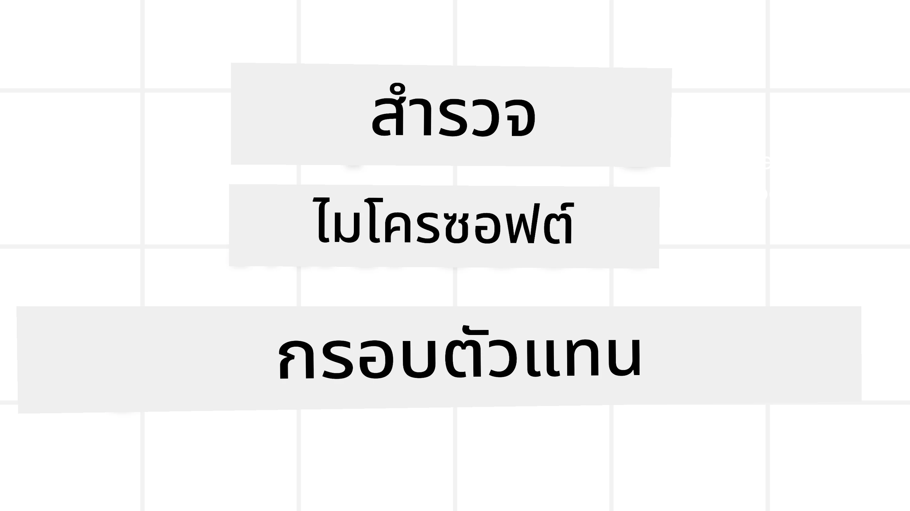
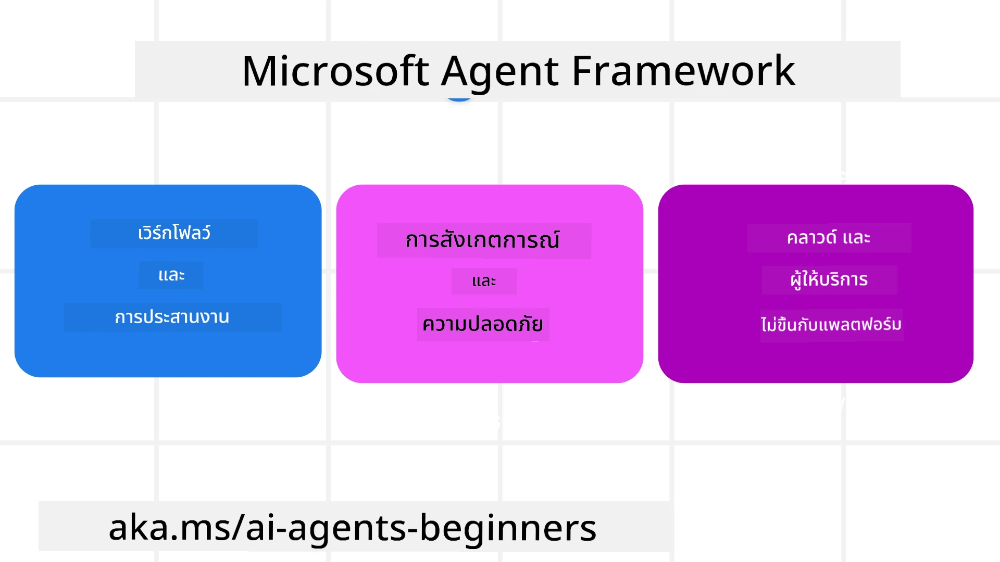

# การสำรวจ Microsoft Agent Framework



### บทนำ

บทเรียนนี้จะครอบคลุม:

- ความเข้าใจ Microsoft Agent Framework: ฟีเจอร์และคุณค่า  
- การสำรวจแนวคิดหลักของ Microsoft Agent Framework
- รูปแบบ MAF ขั้นสูง: Workflows, Middleware และ Memory

## เป้าหมายการเรียนรู้

หลังจากทำบทเรียนนี้เสร็จ คุณจะรู้วิธี:

- สร้าง AI Agents ที่พร้อมใช้งานจริงโดยใช้ Microsoft Agent Framework
- ใช้ฟีเจอร์หลักของ Microsoft Agent Framework กับกรณีการใช้งานตัวแทนของคุณ
- ใช้รูปแบบขั้นสูงรวมถึง workflows, middleware และ observability

## ตัวอย่างโค้ด

ตัวอย่างโค้ดสำหรับ [Microsoft Agent Framework (MAF)](https://aka.ms/ai-agents-beginners/agent-framewrok) สามารถพบได้ในที่เก็บนี้ในไฟล์ `xx-python-agent-framework` และ `xx-dotnet-agent-framework`

## ความเข้าใจ Microsoft Agent Framework



[Microsoft Agent Framework (MAF)](https://aka.ms/ai-agents-beginners/agent-framewrok) คือเฟรมเวิร์กแบบรวมของ Microsoft สำหรับสร้าง AI agents ซึ่งให้ความยืดหยุ่นในการตอบโจทย์การใช้งานตัวแทนต่างๆ ที่พบในทั้งสภาพแวดล้อมการผลิตและการวิจัย รวมถึง:

- **การจัดลำดับตัวแทนแบบตามลำดับ** ในสถานการณ์ที่ต้องการ workflows ทีละขั้นตอน
- **การจัดลำดับหลายงานพร้อมกัน** ในสถานการณ์ที่ตัวแทนต้องทำงานหลายเรื่องพร้อมกัน
- **การจัดลำดับแชทกลุ่ม** ในสถานการณ์ที่ตัวแทนสามารถทำงานร่วมกันในงานเดียว
- **การส่งมอบงานระหว่างตัวแทน** ในสถานการณ์ที่ตัวแทนส่งงานต่อกันตามงานย่อยที่เสร็จ
- **การจัดลำดับแบบแม่เหล็ก** ในสถานการณ์ที่ตัวแทนผู้จัดการสร้างและแก้ไขรายการงานและควบคุมการประสานงานตัวแทนย่อยเพื่อทำงานให้เสร็จ

เพื่อส่งมอบ AI Agents ในการผลิต MAF ยังรวมฟีเจอร์สำหรับ:

- **การตรวจสอบ (Observability)** ผ่านการใช้ OpenTelemetry ซึ่งบันทึกทุกการกระทำของ AI Agent รวมถึงการเรียกใช้เครื่องมือ ขั้นตอนการทำงาน reasoning flow และการตรวจสอบประสิทธิภาพผ่านแดชบอร์ด Microsoft Foundry
- **ความปลอดภัย** ด้วยการโฮสต์ตัวแทนอย่างเนทีฟบน Microsoft Foundry ซึ่งรวมการควบคุมความปลอดภัย เช่น การเข้าถึงตามบทบาท การจัดการข้อมูลส่วนตัว และความปลอดภัยเนื้อหาในตัว
- **ความทนทาน** เนื่องจากกระแสของ Agent และ workflows สามารถหยุดชั่วคราว ดำเนินการต่อ และกู้คืนความผิดพลาด เพื่อรองรับการทำงานระยะยาว
- **การควบคุม** เพราะรองรับ workflows ที่มีมนุษย์ร่วมในลูปซึ่งกำหนดงานที่ต้องการการอนุมัติจากมนุษย์

Microsoft Agent Framework ยังเน้นเรื่องการทำงานร่วมกันได้โดย:

- **ไม่พึ่งพาคลาวด์เฉพาะเจาะจง (Cloud-agnostic)** - ตัวแทนสามารถรันได้ในคอนเทนเนอร์ บนสถานที่จริง และบนคลาวด์หลายแห่ง
- **ไม่ขึ้นกับผู้ให้บริการใดๆ (Provider-agnostic)** - ตัวแทนสามารถสร้างผ่าน SDK ที่คุณเลือกได้ รวมถึง Azure OpenAI และ OpenAI
- **รวมมาตรฐานเปิด** - ตัวแทนสามารถใช้โปรโตคอลเช่น Agent-to-Agent (A2A) และ Model Context Protocol (MCP) เพื่อค้นหาและใช้ตัวแทนและเครื่องมืออื่นๆ
- **ปลั๊กอินและตัวเชื่อมต่อ** - สร้างการเชื่อมต่อกับบริการข้อมูลและหน่วยความจำ เช่น Microsoft Fabric, SharePoint, Pinecone และ Qdrant

มาดูว่าฟีเจอร์เหล่านี้ถูกใช้กับแนวคิดหลักของ Microsoft Agent Framework อย่างไร

## แนวคิดหลักของ Microsoft Agent Framework

### ตัวแทน


**การสร้างตัวแทน**

การสร้างตัวแทนทำโดยการกำหนดบริการอนุมาน (LLM Provider), ชุดคำสั่งสำหรับ AI Agent ให้ปฏิบัติตาม และระบุ `name`:

```python
agent = AzureOpenAIChatClient(credential=AzureCliCredential()).create_agent( instructions="You are good at recommending trips to customers based on their preferences.", name="TripRecommender" )
```
  
ด้านบนใช้ `Azure OpenAI` แต่ตัวแทนสามารถสร้างได้จากบริการหลากหลายรวมถึง `Microsoft Foundry Agent Service`:

```python
AzureAIAgentClient(async_credential=credential).create_agent( name="HelperAgent", instructions="You are a helpful assistant." ) as agent
```
  
OpenAI `Responses`, `ChatCompletion` APIs

```python
agent = OpenAIResponsesClient().create_agent( name="WeatherBot", instructions="You are a helpful weather assistant.", )
```
  
```python
agent = OpenAIChatClient().create_agent( name="HelpfulAssistant", instructions="You are a helpful assistant.", )
```
  
หรือ [MiniMax](https://platform.minimaxi.com/) ซึ่งให้ API ที่เข้ากันกับ OpenAI พร้อมบริบทขนาดใหญ่ (สูงสุด 204K tokens):

```python
agent = OpenAIChatClient(base_url="https://api.minimax.io/v1", api_key=os.environ["MINIMAX_API_KEY"], model_id="MiniMax-M2.7").create_agent( name="HelpfulAssistant", instructions="You are a helpful assistant.", )
```
  
หรือใช้ตัวแทนระยะไกลผ่านโปรโตคอล A2A:

```python
agent = A2AAgent( name=agent_card.name, description=agent_card.description, agent_card=agent_card, url="https://your-a2a-agent-host" )
```
  
**การรันตัวแทน**

ตัวแทนจะรันด้วยเมทอด `.run` หรือ `.run_stream` สำหรับการตอบแบบไม่สตรีมหรือแบบสตรีมตามลำดับ

```python
result = await agent.run("What are good places to visit in Amsterdam?")
print(result.text)
```
  
```python
async for update in agent.run_stream("What are the good places to visit in Amsterdam?"):
    if update.text:
        print(update.text, end="", flush=True)

```
  
แต่ละการรันตัวแทนสามารถปรับแต่งพารามิเตอร์เช่น `max_tokens` ที่ตัวแทนใช้, `tools` ที่ตัวแทนเรียกใช้ได้, หรือแม้แต่ `model` ที่ใช้สำหรับตัวแทน

สิ่งนี้มีประโยชน์เมื่อจำเป็นต้องใช้โมเดลหรือเครื่องมือเฉพาะในการทำงานของผู้ใช้ให้เสร็จ

**เครื่องมือ**

เครื่องมือสามารถกำหนดทั้งตอนสร้างตัวแทน:

```python
def get_attractions( location: Annotated[str, Field(description="The location to get the top tourist attractions for")], ) -> str: """Get the top tourist attractions for a given location.""" return f"The top attractions for {location} are." 


# เมื่อสร้าง ChatAgent โดยตรง

agent = ChatAgent( chat_client=OpenAIChatClient(), instructions="You are a helpful assistant", tools=[get_attractions]

```
  
และตอนรันตัวแทน:

```python

result1 = await agent.run( "What's the best place to visit in Seattle?", tools=[get_attractions] # เครื่องมือให้ใช้สำหรับการรันนี้เท่านั้น )
```
  
**กระแสตัวแทน (Agent Threads)**

Agent Threads ใช้จัดการการสนทนาหลายรอบ กระแสสามารถสร้างได้โดย:

- ใช้ `get_new_thread()` ซึ่งทำให้กระแสถูกบันทึกและใช้งานต่อเนื่องได้
- สร้างกระแสอัตโนมัติเมื่อรันตัวแทน และกระแสจะมีอายุแค่ระหว่างการรันปัจจุบัน

โค้ดสำหรับสร้างกระแสดูแบบนี้:

```python
# สร้างเธรดใหม่
thread = agent.get_new_thread() # เรียกใช้งานเอเย่นต์กับเธรดนั้น
response = await agent.run("Hello, I am here to help you book travel. Where would you like to go?", thread=thread)

```
  
คุณสามารถแปลงกระแสเป็นรูปแบบจัดเก็บเพื่อใช้งานภายหลังได้:

```python
# สร้างเธรดใหม่
thread = agent.get_new_thread() 

# รันเอเจนต์ด้วยเธรด

response = await agent.run("Hello, how are you?", thread=thread) 

# ทำการเรียงลำดับเธรดเพื่อจัดเก็บ

serialized_thread = await thread.serialize() 

# ทำการถอดรหัสสถานะเธรดหลังจากโหลดจากที่เก็บข้อมูล

resumed_thread = await agent.deserialize_thread(serialized_thread)
```
  
**Middleware ของตัวแทน**

ตัวแทนโต้ตอบกับเครื่องมือและ LLM เพื่อทำงานของผู้ใช้ให้เสร็จ ในบางสถานการณ์ เราต้องการดำเนินการหรือบันทึกในระหว่างการโต้ตอบเหล่านี้ Middleware ของตัวแทนช่วยเราเรื่องนี้ด้วย:

*Function Middleware*

Middleware นี้ช่วยให้เราดำเนินการระหว่างตัวแทนกับฟังก์ชัน/เครื่องมือที่ตัวแทนจะเรียกใช้ เช่น อาจใช้สำหรับบันทึกข้อมูลการเรียกใช้งานฟังก์ชัน

ในโค้ดด้านล่าง `next` กำหนดว่าควรเรียก middleware ถัดไปหรือฟังก์ชันจริง

```python
async def logging_function_middleware(
    context: FunctionInvocationContext,
    next: Callable[[FunctionInvocationContext], Awaitable[None]],
) -> None:
    """Function middleware that logs function execution."""
    # การประมวลผลล่วงหน้า: บันทึกก่อนการทำงานของฟังก์ชัน
    print(f"[Function] Calling {context.function.name}")

    # ดำเนินการต่อไปยังมิดเดิลแวร์ถัดไปหรือการทำงานของฟังก์ชัน
    await next(context)

    # การประมวลผลภายหลัง: บันทึกหลังการทำงานของฟังก์ชัน
    print(f"[Function] {context.function.name} completed")
```
  
*Chat Middleware*

Middleware นี้ช่วยให้ดำเนินการหรือบันทึกการกระทำระหว่างตัวแทนกับคำขอระหว่าง LLM

ซึ่งประกอบด้วยข้อมูลสำคัญ เช่น `messages` ที่ส่งไปยังบริการ AI

```python
async def logging_chat_middleware(
    context: ChatContext,
    next: Callable[[ChatContext], Awaitable[None]],
) -> None:
    """Chat middleware that logs AI interactions."""
    # การประมวลผลล่วงหน้า: บันทึกก่อนการเรียกใช้งาน AI
    print(f"[Chat] Sending {len(context.messages)} messages to AI")

    # ดำเนินการต่อไปยังมิดเดิลแวร์หรือบริการ AI ถัดไป
    await next(context)

    # การประมวลผลหลัง: บันทึกหลังจากได้รับคำตอบจาก AI
    print("[Chat] AI response received")

```
  
**หน่วยความจำตัวแทน**

ตามที่ได้เรียนรู้ในบทเรียน `Agentic Memory` หน่วยความจำเป็นองค์ประกอบสำคัญที่ช่วยให้ตัวแทนทำงานในบริบทต่างๆ ได้ MAF มีหน่วยความจำหลายประเภท:

*หน่วยความจำในหน่วยความจำ (In-Memory Storage)*

หน่วยความจำนี้เก็บในกระแสระหว่างเวลาทำงานของแอปพลิเคชัน

```python
# สร้างเธรดใหม่
thread = agent.get_new_thread() # รันเอเจนต์ด้วยเธรดนั้น
response = await agent.run("Hello, I am here to help you book travel. Where would you like to go?", thread=thread)
```
  
*ข้อความถาวร (Persistent Messages)*

หน่วยความจำนี้ใช้เก็บประวัติการสนทนาในแต่ละเซสชัน ถูกกำหนดโดย `chat_message_store_factory`:

```python
from agent_framework import ChatMessageStore

# สร้างที่เก็บข้อความแบบกำหนดเอง
def create_message_store():
    return ChatMessageStore()

agent = ChatAgent(
    chat_client=OpenAIChatClient(),
    instructions="You are a Travel assistant.",
    chat_message_store_factory=create_message_store
)

```
  
*หน่วยความจำแบบไดนามิก (Dynamic Memory)*

หน่วยความจำนี้เพิ่มลงในบริบทก่อนที่ตัวแทนจะรัน หน่วยความจำนี้เก็บในบริการภายนอก เช่น mem0:

```python
from agent_framework.mem0 import Mem0Provider

# ใช้ Mem0 สำหรับความสามารถหน่วยความจำขั้นสูง
memory_provider = Mem0Provider(
    api_key="your-mem0-api-key",
    user_id="user_123",
    application_id="my_app"
)

agent = ChatAgent(
    chat_client=OpenAIChatClient(),
    instructions="You are a helpful assistant with memory.",
    context_providers=memory_provider
)

```
  
**การตรวจสอบตัวแทน (Agent Observability)**

Observability สำคัญสำหรับการสร้างระบบตัวแทนที่เชื่อถือได้และดูแลรักษาง่าย MAF ผสานกับ OpenTelemetry เพื่อให้การติดตามและการวัดเพื่อเพิ่มประสิทธิภาพในการตรวจสอบ

```python
from agent_framework.observability import get_tracer, get_meter

tracer = get_tracer()
meter = get_meter()
with tracer.start_as_current_span("my_custom_span"):
    # ทำบางอย่าง
    pass
counter = meter.create_counter("my_custom_counter")
counter.add(1, {"key": "value"})
```
  
### Workflows

MAF มี workflows ที่เป็นขั้นตอนที่กำหนดไว้ล่วงหน้าเพื่อทำงานให้เสร็จ และรวม AI agents เป็นส่วนประกอบในขั้นตอนเหล่านั้น

Workflows ประกอบด้วยส่วนประกอบต่างๆ ที่ช่วยควบคุมการไหลของงานดีขึ้น รวมถึงช่วยให้เกิด **การจัดลำดับตัวแทนหลายตัว** และ **การบันทึกสถานะ** เพื่อเก็บสถานะของ workflow

ส่วนประกอบหลักของ workflow มีดังนี้:

**Executors**

Executors รับข้อความป้อนเข้า ทำงานที่ได้รับมอบหมาย และส่งออกข้อความออกไป ดัน workflow ไปสู่การทำงานที่ใหญ่ขึ้น Executor อาจเป็น AI agent หรือโลจิกที่กำหนดเอง

**Edges**

Edges ใช้กำหนดเส้นทางของข้อความใน workflow อาจเป็น:

*Direct Edges* - การเชื่อมต่อกันโดยตรงแบบหนึ่งต่อหนึ่งระหว่าง executor:

```python
from agent_framework import WorkflowBuilder

builder = WorkflowBuilder()
builder.add_edge(source_executor, target_executor)
builder.set_start_executor(source_executor)
workflow = builder.build()
```
  
*Conditional Edges* - ทำงานเมื่อตรงตามเงื่อนไข เช่น เมื่อห้องพักไม่ว่าง executor อาจแนะนำตัวเลือกอื่น

*Switch-case Edges* - ส่งข้อความไปยัง executor ต่างๆ ตามเงื่อนไข เช่น ลูกค้าที่มีสิทธิพิเศษจะถูกจัดการใน workflow อื่น

*Fan-out Edges* - ส่งข้อความหนึ่งไปยังหลายเป้าหมาย

*Fan-in Edges* - รวบรวมข้อความหลายข้อความจาก executor ต่างๆ และส่งไปยังเป้าหมายเดียว

**Events**

เพื่อให้การตรวจสอบ workflow ดีขึ้น MAF มีอีเวนต์ในตัวสำหรับการดำเนินงาน เช่น:

- `WorkflowStartedEvent` - เริ่มต้นการทำงานของ workflow
- `WorkflowOutputEvent` - workflow ส่งออกผลลัพธ์
- `WorkflowErrorEvent` - workflow เกิดข้อผิดพลาด
- `ExecutorInvokeEvent` - executor เริ่มการประมวลผล
- `ExecutorCompleteEvent` - executor เสร็จสิ้นการประมวลผล
- `RequestInfoEvent` - มีการส่งคำขอ

## รูปแบบ MAF ขั้นสูง

ส่วนข้างต้นครอบคลุมแนวคิดหลักของ Microsoft Agent Framework เมื่อคุณสร้างตัวแทนที่ซับซ้อนมากขึ้น นี่คือรูปแบบขั้นสูงที่ควรพิจารณา:

- **การจัดการ middleware หลายชั้น**: เชื่อมต่อ middleware หลายตัว (เช่น logging, auth, rate-limiting) ด้วย function และ chat middleware เพื่อควบคุมพฤติกรรมของตัวแทนอย่างละเอียด
- **การบันทึกสถานะ workflow**: ใช้อีเวนต์ใน workflow และการแปลงข้อมูลเพื่อบันทึกและทำงานต่อในกระบวนการตัวแทนที่ทำงานนาน
- **การเลือกเครื่องมือแบบไดนามิก**: ผสมผสาน RAG จากคำอธิบายเครื่องมือกับการลงทะเบียนเครื่องมือของ MAF เพื่อแสดงเครื่องมือที่เกี่ยวข้องกับคำถามเท่านั้น
- **การส่งมอบงานระหว่างตัวแทนหลายตัว**: ใช้ edges ของ workflow และการกำหนดเส้นทางตามเงื่อนไขเพื่อลำดับงานส่งต่อระหว่างตัวแทนเฉพาะทาง

## ตัวอย่างโค้ด

ตัวอย่างโค้ดสำหรับ Microsoft Agent Framework สามารถพบได้ในที่เก็บนี้ในไฟล์ `xx-python-agent-framework` และ `xx-dotnet-agent-framework`

## มีคำถามเพิ่มเติมเกี่ยวกับ Microsoft Agent Framework หรือไม่?

เข้าร่วม [Microsoft Foundry Discord](https://aka.ms/ai-agents/discord) เพื่อพบปะผู้เรียนคนอื่นๆ เข้าร่วมช่วงถามตอบ และขอคำตอบสำหรับคำถามเกี่ยวกับ AI Agents ของคุณได้เลย

---

<!-- CO-OP TRANSLATOR DISCLAIMER START -->
**ข้อจำกัดความรับผิดชอบ**:  
เอกสารฉบับนี้ได้รับการแปลโดยใช้บริการแปลภาษาด้วย AI [Co-op Translator](https://github.com/Azure/co-op-translator) แม้ว่าเราจะพยายามให้ความถูกต้องอย่างเต็มที่ แต่โปรดทราบว่าการแปลอัตโนมัติอาจมีข้อผิดพลาดหรือความไม่แม่นยำ เอกสารต้นฉบับในภาษาต้นฉบับถือเป็นแหล่งข้อมูลที่เชื่อถือได้ สำหรับข้อมูลที่สำคัญ ขอแนะนำให้ใช้การแปลโดยผู้เชี่ยวชาญด้านภาษามนุษย์ เราไม่รับผิดชอบต่อความเข้าใจผิดหรือการตีความที่ผิดพลาดใด ๆ ที่เกิดขึ้นจากการใช้การแปลนี้
<!-- CO-OP TRANSLATOR DISCLAIMER END -->