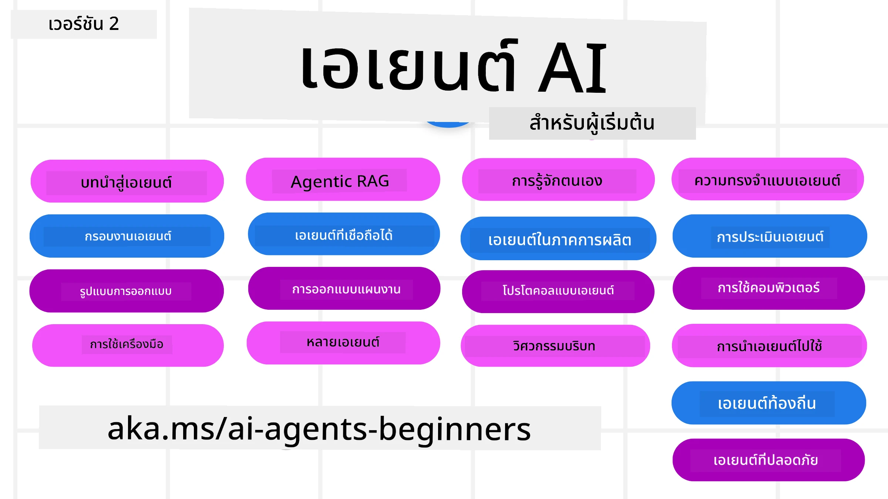

# ตัวแทน AI สำหรับผู้เริ่มต้น - หลักสูตร



## หลักสูตรที่สอนทุกอย่างที่คุณจำเป็นต้องรู้เพื่อเริ่มสร้างตัวแทน AI

[](https://github.com/microsoft/ai-agents-for-beginners/blob/master/LICENSE?WT.mc_id=academic-105485-koreyst)
[](https://GitHub.com/microsoft/ai-agents-for-beginners/graphs/contributors/?WT.mc_id=academic-105485-koreyst)
[](https://GitHub.com/microsoft/ai-agents-for-beginners/issues/?WT.mc_id=academic-105485-koreyst)
[](https://GitHub.com/microsoft/ai-agents-for-beginners/pulls/?WT.mc_id=academic-105485-koreyst)
[](http://makeapullrequest.com?WT.mc_id=academic-105485-koreyst)

### 🌐 รองรับหลายภาษา

#### รองรับผ่าน GitHub Action (อัตโนมัติ & อัปเดตตลอดเวลา)

<!-- CO-OP TRANSLATOR LANGUAGES TABLE START -->
[Arabic](../ar/README.md) | [Bengali](../bn/README.md) | [Bulgarian](../bg/README.md) | [Burmese (Myanmar)](../my/README.md) | [Chinese (Simplified)](../zh-CN/README.md) | [Chinese (Traditional, Hong Kong)](../zh-HK/README.md) | [Chinese (Traditional, Macau)](../zh-MO/README.md) | [Chinese (Traditional, Taiwan)](../zh-TW/README.md) | [Croatian](../hr/README.md) | [Czech](../cs/README.md) | [Danish](../da/README.md) | [Dutch](../nl/README.md) | [Estonian](../et/README.md) | [Finnish](../fi/README.md) | [French](../fr/README.md) | [German](../de/README.md) | [Greek](../el/README.md) | [Hebrew](../he/README.md) | [Hindi](../hi/README.md) | [Hungarian](../hu/README.md) | [Indonesian](../id/README.md) | [Italian](../it/README.md) | [Japanese](../ja/README.md) | [Kannada](../kn/README.md) | [Khmer](../km/README.md) | [Korean](../ko/README.md) | [Lithuanian](../lt/README.md) | [Malay](../ms/README.md) | [Malayalam](../ml/README.md) | [Marathi](../mr/README.md) | [Nepali](../ne/README.md) | [Nigerian Pidgin](../pcm/README.md) | [Norwegian](../no/README.md) | [Persian (Farsi)](../fa/README.md) | [Polish](../pl/README.md) | [Portuguese (Brazil)](../pt-BR/README.md) | [Portuguese (Portugal)](../pt-PT/README.md) | [Punjabi (Gurmukhi)](../pa/README.md) | [Romanian](../ro/README.md) | [Russian](../ru/README.md) | [Serbian (Cyrillic)](../sr/README.md) | [Slovak](../sk/README.md) | [Slovenian](../sl/README.md) | [Spanish](../es/README.md) | [Swahili](../sw/README.md) | [Swedish](../sv/README.md) | [Tagalog (Filipino)](../tl/README.md) | [Tamil](../ta/README.md) | [Telugu](../te/README.md) | [Thai](./README.md) | [Turkish](../tr/README.md) | [Ukrainian](../uk/README.md) | [Urdu](../ur/README.md) | [Vietnamese](../vi/README.md)

> **ต้องการโคลนมาใช้งานในเครื่อง?**
>
> ที่เก็บนี้รวมการแปลมากกว่า 50 ภาษา ซึ่งเพิ่มขนาดการดาวน์โหลดอย่างมาก หากต้องการโคลนโดยไม่รวมการแปล ให้ใช้ sparse checkout:
>
> **Bash / macOS / Linux:**
> ```bash
> git clone --filter=blob:none --sparse https://github.com/microsoft/ai-agents-for-beginners.git
> cd ai-agents-for-beginners
> git sparse-checkout set --no-cone '/*' '!translations' '!translated_images'
> ```
>
> **CMD (Windows):**
> ```cmd
> git clone --filter=blob:none --sparse https://github.com/microsoft/ai-agents-for-beginners.git
> cd ai-agents-for-beginners
> git sparse-checkout set --no-cone "/*" "!translations" "!translated_images"
> ```
>
> สิ่งนี้จะมอบทุกอย่างที่คุณจำเป็นต้องใช้เพื่อเรียนหลักสูตรนี้ด้วยการดาวน์โหลดที่รวดเร็วกว่า
<!-- CO-OP TRANSLATOR LANGUAGES TABLE END -->

**หากคุณต้องการให้รองรับการแปลภาษาเพิ่มเติม รายการภาษาเหล่านั้นถูกระบุไว้ [ที่นี่](https://github.com/Azure/co-op-translator/blob/main/getting_started/supported-languages.md)**

[](https://GitHub.com/microsoft/ai-agents-for-beginners/watchers/?WT.mc_id=academic-105485-koreyst)
[](https://GitHub.com/microsoft/ai-agents-for-beginners/network/?WT.mc_id=academic-105485-koreyst)
[](https://GitHub.com/microsoft/ai-agents-for-beginners/stargazers/?WT.mc_id=academic-105485-koreyst)

[](https://discord.gg/nTYy5BXMWG)


## 🌱 เริ่มต้นใช้งาน

หลักสูตรนี้มีบทเรียนที่ครอบคลุมพื้นฐานของการสร้างตัวแทน AI แต่ละบทเรียนจะครอบคลุมหัวข้อเฉพาะของตนเอง ดังนั้นคุณสามารถเริ่มได้ที่บทเรียนใดก็ได้ที่คุณต้องการ!

หลักสูตรนี้รองรับหลายภาษา ดูได้ที่ [ภาษาที่รองรับที่นี่](#-multi-language-support)  

ถ้านี่เป็นครั้งแรกที่คุณจะสร้างด้วยโมเดล Generative AI ให้ลองดูหลักสูตร [Generative AI For Beginners](https://aka.ms/genai-beginners) ซึ่งมีบทเรียน 21 บทเกี่ยวกับการสร้างด้วย GenAI

อย่าลืม [กดดาว (🌟) ที่ repo นี้](https://docs.github.com/en/get-started/exploring-projects-on-github/saving-repositories-with-stars?WT.mc_id=academic-105485-koreyst) และ [โฟลก repo นี้](https://github.com/microsoft/ai-agents-for-beginners/fork) เพื่อรันโค้ด

### พบกับผู้เรียนคนอื่น ๆ ได้ที่นี่ และรับคำตอบสำหรับคำถามของคุณ

ถ้าคุณติดขัดหรือมีคำถามเกี่ยวกับการสร้างตัวแทน AI เข้าร่วมช่อง Discord เฉพาะสำหรับหลักสูตรนี้ใน [Microsoft Foundry Discord](https://aka.ms/ai-agents/discord)

### สิ่งที่คุณต้องมี

แต่ละบทเรียนในหลักสูตรนี้มีตัวอย่างโค้ดซึ่งสามารถหาได้ในโฟลเดอร์ code_samples คุณสามารถ [โฟลก repo นี้](https://github.com/microsoft/ai-agents-for-beginners/fork) เพื่อสร้างสำเนาของคุณเองได้  

ตัวอย่างโค้ดในแบบฝึกหัดเหล่านี้ใช้ Microsoft Agent Framework กับ Azure AI Foundry Agent Service V2:

- [Microsoft Foundry](https://aka.ms/ai-agents-beginners/ai-foundry) - ต้องมีบัญชี Azure

หลักสูตรนี้ใช้เฟรมเวิร์กและบริการตัวแทน AI จาก Microsoft ดังนี้:

- [Microsoft Agent Framework (MAF)](https://aka.ms/ai-agents-beginners/agent-framewrok)
- [Azure AI Foundry Agent Service V2](https://aka.ms/ai-agents-beginners/ai-agent-service)

ตัวอย่างโค้ดบางตัวยังรองรับผู้ให้บริการที่เข้ากันได้กับ OpenAI ทางเลือกอื่น เช่น [MiniMax](https://platform.minimaxi.com/), ที่มีโมเดลบริบทขนาดใหญ่ (สูงสุดถึง 204K tokens) ดูรายละเอียดการตั้งค่าได้ที่ [Course Setup](./00-course-setup/README.md)

สำหรับข้อมูลเพิ่มเติมเกี่ยวกับการรันโค้ดสำหรับหลักสูตรนี้ ไปที่ [Course Setup](./00-course-setup/README.md)

## 🙏 ต้องการช่วยเหลือไหม?

คุณมีคำแนะนำ หรือพบคำสะกดหรือข้อผิดพลาดโค้ดไหม? [แจ้งปัญหา](https://github.com/microsoft/ai-agents-for-beginners/issues?WT.mc_id=academic-105485-koreyst) หรือ [สร้างคำขอดึง](https://github.com/microsoft/ai-agents-for-beginners/pulls?WT.mc_id=academic-105485-koreyst)


## 📂 แต่ละบทเรียนประกอบด้วย

- บทเรียนที่เขียนไว้ใน README และวิดีโอสั้น ๆ
- ตัวอย่างโค้ด Python ใช้ Microsoft Agent Framework กับ Azure AI Foundry
- ลิงก์สู่ทรัพยากรเพิ่มเติมเพื่อเรียนรู้ต่อ


## 🗃️ บทเรียน

| **บทเรียน**                                    | **ข้อความ & โค้ด**                                    | **วิดีโอ**                                                 | **การเรียนรู้อีก**                                                                      |
|----------------------------------------------|----------------------------------------------------|------------------------------------------------------------|-----------------------------------------------------------------------------------------|
| บทนำสู่ตัวแทน AI และกรณีการใช้งาน             | [ลิงก์](./01-intro-to-ai-agents/README.md)           | [วิดีโอ](https://youtu.be/3zgm60bXmQk?si=z8QygFvYQv-9WtO1)  | [ลิงก์](https://aka.ms/ai-agents-beginners/collection?WT.mc_id=academic-105485-koreyst)  |
| สำรวจ Agentic Frameworks                      | [ลิงก์](./02-explore-agentic-frameworks/README.md)   | [วิดีโอ](https://youtu.be/ODwF-EZo_O8?si=Vawth4hzVaHv-u0H)  | [ลิงก์](https://aka.ms/ai-agents-beginners/collection?WT.mc_id=academic-105485-koreyst)  |
| เข้าใจรูปแบบการออกแบบ Agentic                 | [ลิงก์](./03-agentic-design-patterns/README.md)      | [วิดีโอ](https://youtu.be/m9lM8qqoOEA?si=BIzHwzstTPL8o9GF)  | [ลิงก์](https://aka.ms/ai-agents-beginners/collection?WT.mc_id=academic-105485-koreyst)  |
| รูปแบบการออกแบบการใช้เครื่องมือ                | [ลิงก์](./04-tool-use/README.md)                     | [วิดีโอ](https://youtu.be/vieRiPRx-gI?si=2z6O2Xu2cu_Jz46N)  | [ลิงก์](https://aka.ms/ai-agents-beginners/collection?WT.mc_id=academic-105485-koreyst)  |
| Agentic RAG                                   | [ลิงก์](./05-agentic-rag/README.md)                  | [วิดีโอ](https://youtu.be/WcjAARvdL7I?si=gKPWsQpKiIlDH9A3)  | [ลิงก์](https://aka.ms/ai-agents-beginners/collection?WT.mc_id=academic-105485-koreyst)  |
| การสร้างตัวแทน AI ที่น่าเชื่อถือ                 | [ลิงก์](./06-building-trustworthy-agents/README.md)  | [วิดีโอ](https://youtu.be/iZKkMEGBCUQ?si=jZjpiMnGFOE9L8OK ) | [ลิงก์](https://aka.ms/ai-agents-beginners/collection?WT.mc_id=academic-105485-koreyst)  |
| รูปแบบการออกแบบการวางแผน                        | [ลิงก์](./07-planning-design/README.md)              | [วิดีโอ](https://youtu.be/kPfJ2BrBCMY?si=6SC_iv_E5-mzucnC)  | [ลิงก์](https://aka.ms/ai-agents-beginners/collection?WT.mc_id=academic-105485-koreyst)  |
| รูปแบบการออกแบบหลายตัวแทน                        | [ลิงก์](./08-multi-agent/README.md)                  | [วิดีโอ](https://youtu.be/V6HpE9hZEx0?si=rMgDhEu7wXo2uo6g)  | [ลิงก์](https://aka.ms/ai-agents-beginners/collection?WT.mc_id=academic-105485-koreyst)  |
| รูปแบบการออกแบบการรู้จักรู้คิด (Metacognition)          | [ลิงก์](./09-metacognition/README.md)               | [วิดีโอ](https://youtu.be/His9R6gw6Ec?si=8gck6vvdSNCt6OcF)   | [ลิงก์](https://aka.ms/ai-agents-beginners/collection?WT.mc_id=academic-105485-koreyst)       |
| ตัวแทน AI ในการผลิต                                  | [ลิงก์](./10-ai-agents-production/README.md)        | [วิดีโอ](https://youtu.be/l4TP6IyJxmQ?si=31dnhexRo6yLRJDl)   | [ลิงก์](https://aka.ms/ai-agents-beginners/collection?WT.mc_id=academic-105485-koreyst)       |
| การใช้พรอตโคอลตัวแทน (MCP, A2A และ NLWeb)                 | [ลิงก์](./11-agentic-protocols/README.md)           | [วิดีโอ](https://youtu.be/X-Dh9R3Opn8)                                  | [ลิงก์](https://aka.ms/ai-agents-beginners/collection?WT.mc_id=academic-105485-koreyst)       |
| วิศวกรรมบริบทสำหรับตัวแทน AI                         | [ลิงก์](./12-context-engineering/README.md)         | [วิดีโอ](https://youtu.be/F5zqRV7gEag)                                  | [ลิงก์](https://aka.ms/ai-agents-beginners/collection?WT.mc_id=academic-105485-koreyst)       |
| การจัดการหน่วยความจำตัวแทน                          | [ลิงก์](./13-agent-memory/README.md)     |      [วิดีโอ](https://youtu.be/QrYbHesIxpw?si=vZkVwKrQ4ieCcIPx)                                                     |                                                                                        |
| การสำรวจกรอบงานตัวแทน Microsoft                         | [ลิงก์](./14-microsoft-agent-framework/README.md)                            |                                                            |                                                                                        |
| การสร้างตัวแทนที่ใช้คอมพิวเตอร์ (CUA)                   | [ลิงก์](./15-browser-use/README.md)     |                                                            | [ลิงก์](https://docs.browser-use.com/examples/templates/playwright-integration)         |
| การปรับใช้งานตัวแทนที่ขยายได้                       | จะมาในเร็ว ๆ นี้                            |                                                            |                                                                                        |
| การสร้างตัวแทน AI ภายในเครื่อง                       | จะมาในเร็ว ๆ นี้                              |                                                            |                                                                                        |
| การรักษาความปลอดภัยตัวแทน AI                        | จะมาในเร็ว ๆ นี้                              |                                                            |                                                                                        |

## 🎒 คอร์สอื่น ๆ

ทีมงานของเราผลิตคอร์สอื่น ๆ! ลองดู:

<!-- CO-OP TRANSLATOR OTHER COURSES START -->
### LangChain
[](https://aka.ms/langchain4j-for-beginners)
[](https://aka.ms/langchainjs-for-beginners?WT.mc_id=m365-94501-dwahlin)
[](https://github.com/microsoft/langchain-for-beginners?WT.mc_id=m365-94501-dwahlin)
---

### Azure / Edge / MCP / Agents
[](https://github.com/microsoft/AZD-for-beginners?WT.mc_id=academic-105485-koreyst)
[](https://github.com/microsoft/edgeai-for-beginners?WT.mc_id=academic-105485-koreyst)
[](https://github.com/microsoft/mcp-for-beginners?WT.mc_id=academic-105485-koreyst)
[](https://github.com/microsoft/ai-agents-for-beginners?WT.mc_id=academic-105485-koreyst)

---
 
### ชุดวิชาปัญญาประดิษฐ์สร้างสรรค์
[](https://github.com/microsoft/generative-ai-for-beginners?WT.mc_id=academic-105485-koreyst)
[-9333EA?style=for-the-badge&labelColor=E5E7EB&color=9333EA)](https://github.com/microsoft/Generative-AI-for-beginners-dotnet?WT.mc_id=academic-105485-koreyst)
[-C084FC?style=for-the-badge&labelColor=E5E7EB&color=C084FC)](https://github.com/microsoft/generative-ai-for-beginners-java?WT.mc_id=academic-105485-koreyst)
[-E879F9?style=for-the-badge&labelColor=E5E7EB&color=E879F9)](https://github.com/microsoft/generative-ai-with-javascript?WT.mc_id=academic-105485-koreyst)

---
 
### การเรียนรู้หลัก
[](https://aka.ms/ml-beginners?WT.mc_id=academic-105485-koreyst)
[](https://aka.ms/datascience-beginners?WT.mc_id=academic-105485-koreyst)
[](https://aka.ms/ai-beginners?WT.mc_id=academic-105485-koreyst)
[](https://github.com/microsoft/Security-101?WT.mc_id=academic-96948-sayoung)
[](https://aka.ms/webdev-beginners?WT.mc_id=academic-105485-koreyst)
[](https://aka.ms/iot-beginners?WT.mc_id=academic-105485-koreyst)
[](https://github.com/microsoft/xr-development-for-beginners?WT.mc_id=academic-105485-koreyst)

---
 
### ชุด Copilot
[](https://aka.ms/GitHubCopilotAI?WT.mc_id=academic-105485-koreyst)
[](https://github.com/microsoft/mastering-github-copilot-for-dotnet-csharp-developers?WT.mc_id=academic-105485-koreyst)
[](https://github.com/microsoft/CopilotAdventures?WT.mc_id=academic-105485-koreyst)
<!-- CO-OP TRANSLATOR OTHER COURSES END -->

## 🌟 ขอขอบคุณจากชุมชน

ขอขอบคุณ [Shivam Goyal](https://www.linkedin.com/in/shivam2003/) สำหรับการสนับสนุนตัวอย่างโค้ดสำคัญที่แสดงให้เห็น Agentic RAG

## การมีส่วนร่วม

โครงการนี้ยินดีรับการมีส่วนร่วมและคำแนะนำ ส่วนใหญ่การมีส่วนร่วมต้องการให้คุณยอมรับ
ข้อตกลงใบอนุญาตผู้ร่วมพัฒนา (CLA) ที่ระบุว่าคุณมีสิทธิ์และได้มอบสิทธิ์ให้เราใช้งานการมีส่วนร่วมของคุณอย่างถูกต้อง ดูรายละเอียดได้ที่ <https://cla.opensource.microsoft.com>

เมื่อคุณส่งคำขอดึง (pull request) บอท CLA จะกำหนดโดยอัตโนมัติว่าคุณจำเป็นต้องจัดหา
CLA หรือไม่ และจะแสดงผลอย่างเหมาะสม (เช่น การตรวจสอบสถานะ, ความคิดเห็น) เพียงทำตามคำแนะนำที่บอทให้ไว้ คุณจะต้องทำเพียงครั้งเดียวสำหรับทุกรีโพที่ใช้ CLA ของเรา

โครงการนี้ได้ใช้ [Microsoft Open Source Code of Conduct](https://opensource.microsoft.com/codeofconduct/)
สำหรับข้อมูลเพิ่มเติมดู [คำถามที่พบบ่อยเกี่ยวกับจรรยาบรรณ](https://opensource.microsoft.com/codeofconduct/faq/) หรือ
ติดต่อ [opencode@microsoft.com](mailto:opencode@microsoft.com) หากมีคำถามหรือความคิดเห็นเพิ่มเติม

## เครื่องหมายการค้า

โครงการนี้อาจมีเครื่องหมายการค้าหรือโลโก้สำหรับโครงการ ผลิตภัณฑ์ หรือบริการ การใช้เครื่องหมายการค้าหรือโลโก้ Microsoft ที่ได้รับอนุญาตต้องเป็นไปตามและปฏิบัติตาม
[แนวทางเครื่องหมายการค้าและแบรนด์ของ Microsoft](https://www.microsoft.com/legal/intellectualproperty/trademarks/usage/general)
การใช้เครื่องหมายการค้าหรือโลโก้ Microsoft ในเวอร์ชันที่แก้ไขของโครงการนี้ต้องไม่ก่อให้เกิดความสับสนหรือบ่งชี้ว่ามีการสนับสนุนจาก Microsoft
การใช้เครื่องหมายการค้าหรือโลโก้ของบุคคลที่สามต้องเป็นไปตามนโยบายของบุคคลที่สามนั้น

## ขอความช่วยเหลือ

ถ้าคุณติดขัดหรือมีคำถามใดๆ เกี่ยวกับการสร้างแอป AI โปรดเข้าร่วม:

[](https://aka.ms/foundry/discord)

หากคุณมีคำติชมเกี่ยวกับผลิตภัณฑ์หรือต้องการแจ้งข้อผิดพลาดระหว่างการพัฒนา โปรดเยี่ยมชม:

[](https://aka.ms/foundry/forum)

---

<!-- CO-OP TRANSLATOR DISCLAIMER START -->
**ข้อจำกัดความรับผิดชอบ**:  
เอกสารนี้ได้รับการแปลโดยใช้บริการแปลภาษา AI [Co-op Translator](https://github.com/Azure/co-op-translator) ในขณะที่เราพยายามให้ความถูกต้อง โปรดทราบว่าการแปลอัตโนมัติอาจมีข้อผิดพลาดหรือความไม่ถูกต้อง เอกสารต้นฉบับในภาษาดั้งเดิมถือเป็นแหล่งข้อมูลที่เชื่อถือได้ สำหรับข้อมูลที่สำคัญ แนะนำให้ใช้บริการแปลโดยมนุษย์มืออาชีพ เราไม่รับผิดชอบต่อความเข้าใจผิดหรือการตีความผิดใดๆ ที่เกิดจากการใช้การแปลนี้
<!-- CO-OP TRANSLATOR DISCLAIMER END -->