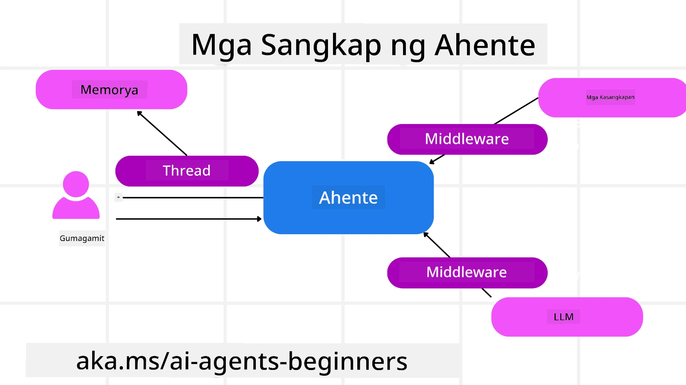

# Pagsusuri sa Microsoft Agent Framework


### Panimula

Tatalakayin sa araling ito ang:

- Pag-unawa sa Microsoft Agent Framework: Pangunahing Mga Tampok at Halaga  
- Pagsusuri sa mga Pangunahing Konsepto ng Microsoft Agent Framework
- Mga Advanced na Pattern ng MAF: Workflows, Middleware, at Memorya

## Mga Layunin sa Pagkatuto

Pagkatapos makumpleto ang araling ito, malalaman mo kung paano:

- Bumuo ng Mga Production Ready AI Agents gamit ang Microsoft Agent Framework
- Ilapat ang mga pangunahing tampok ng Microsoft Agent Framework sa iyong mga Agentic Use Cases
- Gumamit ng mga advanced na pattern kabilang ang workflows, middleware, at observability

## Mga Halimbawa ng Kodigo

Ang mga halimbawa ng kodigo para sa [Microsoft Agent Framework (MAF)](https://aka.ms/ai-agents-beginners/agent-framewrok) ay matatagpuan sa repositoryong ito sa ilalim ng mga file na `xx-python-agent-framework` at `xx-dotnet-agent-framework`.

## Pag-unawa sa Microsoft Agent Framework


Ang [Microsoft Agent Framework (MAF)](https://aka.ms/ai-agents-beginners/agent-framewrok) ay unified framework ng Microsoft para sa paggawa ng AI agents. Nag-aalok ito ng kakayahan upang tugunan ang malawak na hanay ng mga agentic use cases na nakikita sa parehong production at research environments kabilang ang:

- **Sequential Agent orchestration** sa mga senaryong nangangailangan ng sunod-sunod na workflows.
- **Concurrent orchestration** sa mga senaryong kailangang matapos ng mga agent ang mga gawain nang sabay-sabay.
- **Group chat orchestration** sa mga senaryong maaaring mag-collaborate ang mga agent sa isang gawain.
- **Handoff Orchestration** sa mga senaryong ipinapasa ng mga agent ang gawain sa isa't isa habang natatapos ang mga subtask.
- **Magnetic Orchestration** sa mga senaryong ang manager agent ang lumilikha at nagbabago ng listahan ng gawain at namamahala sa koordinasyon ng mga subagent upang matapos ang gawain.

Para sa paghahatid ng AI Agents sa Production, kabilang din sa MAF ang mga tampok para sa:

- **Observability** sa pamamagitan ng paggamit ng OpenTelemetry kung saan bawat kilos ng AI Agent kabilang ang tool invocation, orchestration steps, reasoning flows at performance monitoring ay ginagawa gamit ang Microsoft Foundry dashboards.
- **Seguridad** sa pamamagitan ng pagho-host ng mga agent nang direkta sa Microsoft Foundry na may kasamang mga kontrol sa seguridad gaya ng role-based access, paghawak ng pribadong datos, at built-in na content safety.
- **Durability** dahil ang mga Agent thread at workflow ay maaaring huminto, magpatuloy, at makabawi mula sa mga error na nagbibigay-daan sa mas mahabang proseso.
- **Kontrol** kung saan sinusuportahan ang human in the loop workflows kung saan ang mga gawain ay minamarkahan bilang nangangailangan ng apruba ng tao.

Nakatuon din ang Microsoft Agent Framework sa pagiging interoperable sa pamamagitan ng:

- **Being Cloud-agnostic** - Maaaring patakbuhin ang mga agent sa containers, on-prem at sa iba't ibang mga cloud.
- **Being Provider-agnostic** - Maaaring malikha ang mga agent gamit ang paborito mong SDK kabilang ang Azure OpenAI at OpenAI
- **Integrating Open Standards** - Maaaring gamitin ng mga agent ang mga protocol tulad ng Agent-to-Agent(A2A) at Model Context Protocol (MCP) upang tuklasin at gamitin ang ibang mga agent at tools.
- **Plugins at Connectors** - Maaaring ikonekta sa mga serbisyo ng data at memorya tulad ng Microsoft Fabric, SharePoint, Pinecone at Qdrant.

Tingnan natin kung paano ginagamit ang mga tampok na ito sa ilan sa mga pangunahing konsepto ng Microsoft Agent Framework.

## Pangunahing Konsepto ng Microsoft Agent Framework

### Agents



**Paglikha ng Agents**

Ang paglikha ng agent ay ginagawa sa pamamagitan ng pagtukoy ng inference service (LLM Provider), isang set ng mga tagubilin para sundan ng AI Agent, at isang itinalagang `name`:

```python
agent = AzureOpenAIChatClient(credential=AzureCliCredential()).create_agent( instructions="You are good at recommending trips to customers based on their preferences.", name="TripRecommender" )
```

Ang nasa itaas ay gumagamit ng `Azure OpenAI` ngunit maaaring gumawa ng mga agent gamit ang iba't ibang serbisyo kabilang ang `Microsoft Foundry Agent Service`:

```python
AzureAIAgentClient(async_credential=credential).create_agent( name="HelperAgent", instructions="You are a helpful assistant." ) as agent
```

OpenAI `Responses`, `ChatCompletion` APIs

```python
agent = OpenAIResponsesClient().create_agent( name="WeatherBot", instructions="You are a helpful weather assistant.", )
```

```python
agent = OpenAIChatClient().create_agent( name="HelpfulAssistant", instructions="You are a helpful assistant.", )
```

o [MiniMax](https://platform.minimaxi.com/), na nag-aalok ng OpenAI-compatible na API na may malalawak na window ng konteksto (hanggang 204K tokens):

```python
agent = OpenAIChatClient(base_url="https://api.minimax.io/v1", api_key=os.environ["MINIMAX_API_KEY"], model_id="MiniMax-M2.7").create_agent( name="HelpfulAssistant", instructions="You are a helpful assistant.", )
```

o mga remote agent gamit ang A2A protocol:

```python
agent = A2AAgent( name=agent_card.name, description=agent_card.description, agent_card=agent_card, url="https://your-a2a-agent-host" )
```

**Pagpapatakbo ng Agents**

Pinapatakbo ang mga agent gamit ang mga metodo na `.run` o `.run_stream` para sa non-streaming o streaming na mga tugon.

```python
result = await agent.run("What are good places to visit in Amsterdam?")
print(result.text)
```

```python
async for update in agent.run_stream("What are the good places to visit in Amsterdam?"):
    if update.text:
        print(update.text, end="", flush=True)

```

Maaaring may mga opsyon sa bawat pagpapatakbo ng agent para i-customize ang mga parametro tulad ng `max_tokens` na gagamitin ng agent, `tools` na maaaring tawagan ng agent, at pati na ang mismong `model` na gagamitin para sa agent.

Magagamit ito sa mga kaso kung saan kinakailangan ang mga partikular na modelo o tools para matapos ang gawain ng gumagamit.

**Mga Tools**

Maaaring tukuyin ang mga tool kapwa sa pagdedeklara ng agent:

```python
def get_attractions( location: Annotated[str, Field(description="The location to get the top tourist attractions for")], ) -> str: """Get the top tourist attractions for a given location.""" return f"The top attractions for {location} are." 


# Kapag direktang lumilikha ng ChatAgent

agent = ChatAgent( chat_client=OpenAIChatClient(), instructions="You are a helpful assistant", tools=[get_attractions]

```

at pati na rin sa pagpapatakbo ng agent:

```python

result1 = await agent.run( "What's the best place to visit in Seattle?", tools=[get_attractions] # Kagamitang ibinigay para lamang sa run na ito )
```

**Agent Threads**

Ginagamit ang Agent Threads upang pangasiwaan ang multi-turn na usapan. Maaaring malikha ang thread sa pamamagitan ng:

- Paggamit ng `get_new_thread()` na nagpapahintulot sa thread na mai-save sa paglipas ng panahon
- Awtomatikong paglikha ng thread sa tuwing nagpapatakbo ng agent kung saan ang thread ay umiiral lamang habang tumatakbo ang kasalukuyang session.

Para gumawa ng thread, ganito ang hitsura ng kodigo:

```python
# Gumawa ng bagong thread.
thread = agent.get_new_thread() # Patakbuhin ang ahente gamit ang thread.
response = await agent.run("Hello, I am here to help you book travel. Where would you like to go?", thread=thread)

```

Maaari mo ring i-serialize ang thread upang itabi para magamit sa ibang pagkakataon:

```python
# Lumikha ng bagong thread.
thread = agent.get_new_thread() 

# Patakbuhin ang ahente gamit ang thread.

response = await agent.run("Hello, how are you?", thread=thread) 

# I-serialize ang thread para sa imbakan.

serialized_thread = await thread.serialize() 

# I-deserialize ang estado ng thread pagkatapos i-load mula sa imbakan.

resumed_thread = await agent.deserialize_thread(serialized_thread)
```

**Agent Middleware**

Nakikipag-ugnayan ang mga agent sa mga tool at LLM upang tapusin ang mga gawain ng gumagamit. Sa ilang senaryo, nais nating magsagawa o magtala ng mga aksyon sa pagitan ng mga interaksyong ito. Pinahihintulutan tayo ng agent middleware na gawin ito sa pamamagitan ng:

*Function Middleware*

Pinapayagan ng middleware na ito tayong magsagawa ng aksyon sa pagitan ng agent at ng function/tool na tatawagin nito. Isang halimbawa kung kailan ito gagamitin ay kapag nais mong mag-log ng tawag sa function.

Sa kodigo sa ibaba, tinutukoy ng `next` kung susunod na tatawagin ang susunod na middleware o ang mismong function.

```python
async def logging_function_middleware(
    context: FunctionInvocationContext,
    next: Callable[[FunctionInvocationContext], Awaitable[None]],
) -> None:
    """Function middleware that logs function execution."""
    # Paunang pagproseso: Mag-log bago ang pagpapatupad ng function
    print(f"[Function] Calling {context.function.name}")

    # Magpatuloy sa susunod na middleware o pagpapatupad ng function
    await next(context)

    # Pagkatapos ng pagproseso: Mag-log pagkatapos ng pagpapatupad ng function
    print(f"[Function] {context.function.name} completed")
```

*Chat Middleware*

Pinapayagan ng middleware na ito tayong magsagawa o mag-log ng aksyon sa pagitan ng agent at mga request sa pagitan ng LLM.

Nagtataglay ito ng mahalagang impormasyon tulad ng mga `messages` na ipinapadala sa AI service.

```python
async def logging_chat_middleware(
    context: ChatContext,
    next: Callable[[ChatContext], Awaitable[None]],
) -> None:
    """Chat middleware that logs AI interactions."""
    # Paunang pagproseso: Mag-log bago ang tawag sa AI
    print(f"[Chat] Sending {len(context.messages)} messages to AI")

    # Magpatuloy sa susunod na middleware o serbisyo ng AI
    await next(context)

    # Pagkatapos ng pagproseso: Mag-log pagkatapos ng tugon ng AI
    print("[Chat] AI response received")

```

**Agent Memory**

Tulad ng tinalakay sa araling `Agentic Memory`, mahalagang sangkap ang memorya upang payagan ang agent na mag-operate sa iba't ibang konteksto. Nag-aalok ang MAF ng iba't ibang uri ng memorya:

*In-Memory Storage*

Ito ang memoryang naka-imbak sa mga thread habang tumatakbo ang aplikasyon.

```python
# Gumawa ng bagong thread.
thread = agent.get_new_thread() # Patakbuhin ang agent gamit ang thread.
response = await agent.run("Hello, I am here to help you book travel. Where would you like to go?", thread=thread)
```

*Persistent Messages*

Ginagamit ang memoryang ito kapag ini-imbak ang kasaysayan ng pag-uusap sa iba't ibang session. Ito ay tinutukoy gamit ang `chat_message_store_factory` :

```python
from agent_framework import ChatMessageStore

# Lumikha ng pasadyang tindahan ng mensahe
def create_message_store():
    return ChatMessageStore()

agent = ChatAgent(
    chat_client=OpenAIChatClient(),
    instructions="You are a Travel assistant.",
    chat_message_store_factory=create_message_store
)

```

*Dynamic Memory*

Idinadagdag ang memoryang ito sa konteksto bago patakbuhin ang mga agent. Maaaring itago ang mga memoryang ito sa mga panlabas na serbisyo tulad ng mem0:

```python
from agent_framework.mem0 import Mem0Provider

# Paggamit ng Mem0 para sa mga advanced na kakayahan sa memorya
memory_provider = Mem0Provider(
    api_key="your-mem0-api-key",
    user_id="user_123",
    application_id="my_app"
)

agent = ChatAgent(
    chat_client=OpenAIChatClient(),
    instructions="You are a helpful assistant with memory.",
    context_providers=memory_provider
)

```

**Agent Observability**

Mahalaga ang observability sa paggawa ng maaasahan at napananatiling mga systema ng agent. Nakikipagsabayan ang MAF sa OpenTelemetry upang magbigay ng tracing at meters para sa mas mahusay na observability.

```python
from agent_framework.observability import get_tracer, get_meter

tracer = get_tracer()
meter = get_meter()
with tracer.start_as_current_span("my_custom_span"):
    # gawin ang isang bagay
    pass
counter = meter.create_counter("my_custom_counter")
counter.add(1, {"key": "value"})
```

### Workflows

Nag-aalok ang MAF ng workflows na mga paunang tinukoy na mga hakbang upang matapos ang isang gawain at kasama ang mga AI agent bilang bahagi ng mga hakbang na iyon.

Binubuo ang workflows ng iba't ibang mga bahagi na nagpapahintulot ng mas mahusay na daloy ng kontrol. Pinapayagan din ng workflows ang **multi-agent orchestration** at **checkpointing** upang mai-save ang mga estado ng workflow.

Ang mga pangunahing bahagi ng isang workflow ay:

**Executors**

Tumatanggap ang mga executors ng input messages, ginagawa ang mga iniwang gawain, at pagkatapos ay naglalabas ng output message. Itinutulak nito ang workflow patungo sa pagtatapos ng mas malaking gawain. Maaaring AI agent o custom logic ang mga executors.

**Edges**

Ginagamit ang edges upang tukuyin ang daloy ng mga mensahe sa isang workflow. Maaari itong:

*Direct Edges* - Simpleng one-to-one na koneksyon sa pagitan ng mga executor:

```python
from agent_framework import WorkflowBuilder

builder = WorkflowBuilder()
builder.add_edge(source_executor, target_executor)
builder.set_start_executor(source_executor)
workflow = builder.build()
```

*Conditional Edges* - Nag-a-activate pagkatapos matugunan ang isang partikular na kondisyon. Halimbawa, kapag wala nang mga hotel room, maaaring magmungkahi ang executor ng ibang opsyon.

*Switch-case Edges* - Nagpapadala ng mga mensahe sa iba't ibang mga executor batay sa mga tinukoy na kondisyon. Halimbawa, kung may priority access ang isang travel customer at ang kanilang mga gawain ay hahawakan sa ibang workflow.

*Fan-out Edges* - Nagpapadala ng isang mensahe sa maraming target.

*Fan-in Edges* - Nangongolekta ng maraming mensahe mula sa iba't ibang executor at ipinapadala sa isang target.

**Mga Kaganapan**

Para magbigay ng mas mahusay na observability sa workflows, nag-aalok ang MAF ng mga built-in na kaganapan para sa execution kabilang ang:

- `WorkflowStartedEvent`  - Nagsisimula ang pagsasagawa ng workflow
- `WorkflowOutputEvent` - Naglalabas ang workflow ng output
- `WorkflowErrorEvent` - Nakakaranas ng error ang workflow
- `ExecutorInvokeEvent`  - Nagsisimula ang trabaho ng executor
- `ExecutorCompleteEvent`  - Natatapos ang processing ng executor
- `RequestInfoEvent` - Isang kahilingan ang inilalabas

## Mga Advanced na Pattern ng MAF

Saklaw ng mga naunang seksyon ang mga pangunahing konsepto ng Microsoft Agent Framework. Habang gumagawa ka ng mas kumplikadong mga agent, narito ang ilang mga advanced na pattern na dapat isaalang-alang:

- **Middleware Composition**: Pagsasama-sama ng maraming middleware handler (logging, auth, rate-limiting) gamit ang function at chat middleware para sa mas detalyadong kontrol sa kilos ng agent.
- **Workflow Checkpointing**: Gamitin ang mga workflow events at serialization upang ma-save at maipagpatuloy ang mga long-running processes ng agent.
- **Dynamic Tool Selection**: Pagsamahin ang RAG sa mga deskripsyon ng tool kasama ng pagpaparehistro ng tool sa MAF upang ipakita lamang ang mga kaugnay na tool sa bawat query.
- **Multi-Agent Handoff**: Gamitin ang mga edge ng workflow at conditional routing upang i-orchestrate ang handoff sa pagitan ng mga specialized agent.

## Mga Halimbawa ng Kodigo

Ang mga halimbawa ng kodigo para sa Microsoft Agent Framework ay matatagpuan sa repositoryong ito sa ilalim ng mga file na `xx-python-agent-framework` at `xx-dotnet-agent-framework`.

## May Mga Karagdagang Tanong Tungkol sa Microsoft Agent Framework?

Sumali sa [Microsoft Foundry Discord](https://aka.ms/ai-agents/discord) upang makipagkita sa ibang mga nag-aaral, dumalo sa office hours, at masagot ang iyong mga tanong tungkol sa AI Agents.

---

<!-- CO-OP TRANSLATOR DISCLAIMER START -->
**Paunawa**:  
Ang dokumentong ito ay isinalin gamit ang AI translation service na [Co-op Translator](https://github.com/Azure/co-op-translator). Bagamat nagsusumikap kami para sa katumpakan, pakatandaan na maaaring may mga pagkakamali o di-tumpak na bahagi sa awtomatikong pagsasalin. Ang orihinal na dokumento sa orihinal nitong wika ang dapat ituring na pangunahing sanggunian. Para sa mahahalagang impormasyon, inirerekomenda ang propesyonal na pagsasalin ng tao. Hindi kami mananagot sa anumang hindi pagkakaunawaan o maling interpretasyon na maaaring magmula sa paggamit ng pagsasaling ito.
<!-- CO-OP TRANSLATOR DISCLAIMER END -->