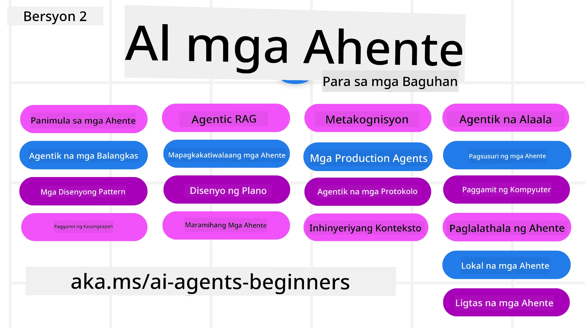

# AI Agents para sa mga Nagsisimula - Isang Kurso



## Isang kurso na nagtuturo ng lahat ng kailangan mong malaman upang makapagsimula sa paggawa ng AI Agents

[](https://github.com/microsoft/ai-agents-for-beginners/blob/master/LICENSE?WT.mc_id=academic-105485-koreyst)
[](https://GitHub.com/microsoft/ai-agents-for-beginners/graphs/contributors/?WT.mc_id=academic-105485-koreyst)
[](https://GitHub.com/microsoft/ai-agents-for-beginners/issues/?WT.mc_id=academic-105485-koreyst)
[](https://GitHub.com/microsoft/ai-agents-for-beginners/pulls/?WT.mc_id=academic-105485-koreyst)
[](http://makeapullrequest.com?WT.mc_id=academic-105485-koreyst)

### 🌐 Multi-Language Support

#### Sinusuportahan sa pamamagitan ng GitHub Action (Automatiko at Palaging Nai-update)

<!-- CO-OP TRANSLATOR LANGUAGES TABLE START -->
[Arabic](../ar/README.md) | [Bengali](../bn/README.md) | [Bulgarian](../bg/README.md) | [Burmese (Myanmar)](../my/README.md) | [Chinese (Simplified)](../zh-CN/README.md) | [Chinese (Traditional, Hong Kong)](../zh-HK/README.md) | [Chinese (Traditional, Macau)](../zh-MO/README.md) | [Chinese (Traditional, Taiwan)](../zh-TW/README.md) | [Croatian](../hr/README.md) | [Czech](../cs/README.md) | [Danish](../da/README.md) | [Dutch](../nl/README.md) | [Estonian](../et/README.md) | [Finnish](../fi/README.md) | [French](../fr/README.md) | [German](../de/README.md) | [Greek](../el/README.md) | [Hebrew](../he/README.md) | [Hindi](../hi/README.md) | [Hungarian](../hu/README.md) | [Indonesian](../id/README.md) | [Italian](../it/README.md) | [Japanese](../ja/README.md) | [Kannada](../kn/README.md) | [Khmer](../km/README.md) | [Korean](../ko/README.md) | [Lithuanian](../lt/README.md) | [Malay](../ms/README.md) | [Malayalam](../ml/README.md) | [Marathi](../mr/README.md) | [Nepali](../ne/README.md) | [Nigerian Pidgin](../pcm/README.md) | [Norwegian](../no/README.md) | [Persian (Farsi)](../fa/README.md) | [Polish](../pl/README.md) | [Portuguese (Brazil)](../pt-BR/README.md) | [Portuguese (Portugal)](../pt-PT/README.md) | [Punjabi (Gurmukhi)](../pa/README.md) | [Romanian](../ro/README.md) | [Russian](../ru/README.md) | [Serbian (Cyrillic)](../sr/README.md) | [Slovak](../sk/README.md) | [Slovenian](../sl/README.md) | [Spanish](../es/README.md) | [Swahili](../sw/README.md) | [Swedish](../sv/README.md) | [Tagalog (Filipino)](./README.md) | [Tamil](../ta/README.md) | [Telugu](../te/README.md) | [Thai](../th/README.md) | [Turkish](../tr/README.md) | [Ukrainian](../uk/README.md) | [Urdu](../ur/README.md) | [Vietnamese](../vi/README.md)

> **Mas gusto mo bang Kopyahin nang Lokal?**
>
> Kasama sa repositoryong ito ang 50+ na mga pagsasalin ng wika na lubhang nagpapalaki sa laki ng pag-download. Para mag-clone nang walang mga pagsasalin, gamitin ang sparse checkout:
>
> **Bash / macOS / Linux:**
> ```bash
> git clone --filter=blob:none --sparse https://github.com/microsoft/ai-agents-for-beginners.git
> cd ai-agents-for-beginners
> git sparse-checkout set --no-cone '/*' '!translations' '!translated_images'
> ```
>
> **CMD (Windows):**
> ```cmd
> git clone --filter=blob:none --sparse https://github.com/microsoft/ai-agents-for-beginners.git
> cd ai-agents-for-beginners
> git sparse-checkout set --no-cone "/*" "!translations" "!translated_images"
> ```
>
> Bibigyan ka nito ng lahat ng kailangan mo para makumpleto ang kurso nang mas mabilis ang pag-download.
<!-- CO-OP TRANSLATOR LANGUAGES TABLE END -->

**Kung nais mo ng iba pang mga sinusuportahang wikang pagsasalin ay nakalista [dito](https://github.com/Azure/co-op-translator/blob/main/getting_started/supported-languages.md)**

[](https://GitHub.com/microsoft/ai-agents-for-beginners/watchers/?WT.mc_id=academic-105485-koreyst)
[](https://GitHub.com/microsoft/ai-agents-for-beginners/network/?WT.mc_id=academic-105485-koreyst)
[](https://GitHub.com/microsoft/ai-agents-for-beginners/stargazers/?WT.mc_id=academic-105485-koreyst)

[](https://discord.gg/nTYy5BXMWG)


## 🌱 Pagsisimula

Ang kursong ito ay may mga leksyon na sumasaklaw sa mga pangunahing kaalaman sa paggawa ng AI Agents. Ang bawat leksyon ay sumasaklaw sa sarili nitong paksa kaya magsimula ka kahit saan na gusto mo!

Mayroon ding suporta ng maraming wika para sa kursong ito. Pumunta sa aming [mga magagamit na wika dito](#-multi-language-support). 

Kung ito ang iyong unang pagkakataon na bumuo gamit ang Generative AI models, tingnan ang aming kursong [Generative AI For Beginners](https://aka.ms/genai-beginners), na may 21 na leksyon sa paggawa gamit ang GenAI.

Huwag kalimutang [bigyan ng bituin (🌟) ang repo na ito](https://docs.github.com/en/get-started/exploring-projects-on-github/saving-repositories-with-stars?WT.mc_id=academic-105485-koreyst) at [i-fork ang repo na ito](https://github.com/microsoft/ai-agents-for-beginners/fork) para patakbuhin ang kodigo.

### Makipagkilala sa Iba Pang mga Nag-aaral, Sagutin ang Iyong mga Tanong

Kung magkaproblema ka o may mga tanong tungkol sa paggawa ng AI Agents, sumali sa aming dedikadong Discord Channel sa [Microsoft Foundry Discord](https://aka.ms/ai-agents/discord).

### Ano ang Kailangan Mo

Ang bawat leksyon sa kursong ito ay may kasama na mga halimbawa ng kodigo, na makikita sa folder na code_samples. Maaari kang [mag-fork ng repo na ito](https://github.com/microsoft/ai-agents-for-beginners/fork) upang gumawa ng sarili mong kopya.

Ang mga halimbawa ng kodigo sa mga pagsasanay na ito ay gumagamit ng Microsoft Agent Framework kasama ang Azure AI Foundry Agent Service V2:

- [Microsoft Foundry](https://aka.ms/ai-agents-beginners/ai-foundry) - Kailangan ng Azure Account

Ginagamit ng kursong ito ang mga sumusunod na AI Agent framework at serbisyo mula sa Microsoft:

- [Microsoft Agent Framework (MAF)](https://aka.ms/ai-agents-beginners/agent-framewrok)
- [Azure AI Foundry Agent Service V2](https://aka.ms/ai-agents-beginners/ai-agent-service)

Ang ilang mga halimbawa ng kodigo ay sumusuporta rin sa mga alternatibong OpenAI-compatible provider tulad ng [MiniMax](https://platform.minimaxi.com/), na nag-aalok ng malalaking context na modelo (hanggang 204K tokens). Tingnan ang [Course Setup](./00-course-setup/README.md) para sa mga detalye sa pagsasaayos.

Para sa karagdagang impormasyon sa pagpapatakbo ng mga kodigo para sa kursong ito, pumunta sa [Course Setup](./00-course-setup/README.md).

## 🙏 Gusto Mo Bang Tumulong?

Mayroon ka bang mga mungkahi o nakakita ng mga maling baybay o error sa kodigo? [Mag-raise ng isyu](https://github.com/microsoft/ai-agents-for-beginners/issues?WT.mc_id=academic-105485-koreyst) o [Gumawa ng pull request](https://github.com/microsoft/ai-agents-for-beginners/pulls?WT.mc_id=academic-105485-koreyst)


## 📂 Ang bawat leksyon ay may kasamang

- Isang nakasulat na leksyon na matatagpuan sa README at isang maikling video
- Mga halimbawa ng Python code gamit ang Microsoft Agent Framework na may Azure AI Foundry
- Mga link sa dagdag na mga mapagkukunan upang ipagpatuloy ang iyong pag-aaral


## 🗃️ Mga Leksiyon

| **Leksiyon**                                 | **Teksto at Kodigo**                               | **Video**                                                  | **Dagdag na Pag-aaral**                                                                |
|----------------------------------------------|----------------------------------------------------|------------------------------------------------------------|----------------------------------------------------------------------------------------|
| Intro sa AI Agents at mga Use Cases ng Agent | [Link](./01-intro-to-ai-agents/README.md)          | [Video](https://youtu.be/3zgm60bXmQk?si=z8QygFvYQv-9WtO1)  | [Link](https://aka.ms/ai-agents-beginners/collection?WT.mc_id=academic-105485-koreyst) |
| Pagsusuri ng AI Agentic Frameworks           | [Link](./02-explore-agentic-frameworks/README.md)  | [Video](https://youtu.be/ODwF-EZo_O8?si=Vawth4hzVaHv-u0H)  | [Link](https://aka.ms/ai-agents-beginners/collection?WT.mc_id=academic-105485-koreyst) |
| Pag-unawa sa AI Agentic Design Patterns      | [Link](./03-agentic-design-patterns/README.md)     | [Video](https://youtu.be/m9lM8qqoOEA?si=BIzHwzstTPL8o9GF)  | [Link](https://aka.ms/ai-agents-beginners/collection?WT.mc_id=academic-105485-koreyst) |
| Pattern ng Tool Use Design                    | [Link](./04-tool-use/README.md)                    | [Video](https://youtu.be/vieRiPRx-gI?si=2z6O2Xu2cu_Jz46N)  | [Link](https://aka.ms/ai-agents-beginners/collection?WT.mc_id=academic-105485-koreyst) |
| Agentic RAG                                  | [Link](./05-agentic-rag/README.md)                 | [Video](https://youtu.be/WcjAARvdL7I?si=gKPWsQpKiIlDH9A3)  | [Link](https://aka.ms/ai-agents-beginners/collection?WT.mc_id=academic-105485-koreyst) |
| Paggawa ng Mapagkakatiwalaang AI Agents      | [Link](./06-building-trustworthy-agents/README.md) | [Video](https://youtu.be/iZKkMEGBCUQ?si=jZjpiMnGFOE9L8OK ) | [Link](https://aka.ms/ai-agents-beginners/collection?WT.mc_id=academic-105485-koreyst) |
| Pattern ng Planning Design                    | [Link](./07-planning-design/README.md)             | [Video](https://youtu.be/kPfJ2BrBCMY?si=6SC_iv_E5-mzucnC)  | [Link](https://aka.ms/ai-agents-beginners/collection?WT.mc_id=academic-105485-koreyst) |
| Pattern ng Multi-Agent Design                 | [Link](./08-multi-agent/README.md)                 | [Video](https://youtu.be/V6HpE9hZEx0?si=rMgDhEu7wXo2uo6g)  | [Link](https://aka.ms/ai-agents-beginners/collection?WT.mc_id=academic-105485-koreyst) |
| Disenyo ng Pattern ng Metacognition            | [Link](./09-metacognition/README.md)               | [Video](https://youtu.be/His9R6gw6Ec?si=8gck6vvdSNCt6OcF)  | [Link](https://aka.ms/ai-agents-beginners/collection?WT.mc_id=academic-105485-koreyst) |
| Mga AI Agent sa Produksyon                      | [Link](./10-ai-agents-production/README.md)        | [Video](https://youtu.be/l4TP6IyJxmQ?si=31dnhexRo6yLRJDl)  | [Link](https://aka.ms/ai-agents-beginners/collection?WT.mc_id=academic-105485-koreyst) |
| Paggamit ng Agentic Protocols (MCP, A2A at NLWeb) | [Link](./11-agentic-protocols/README.md)           | [Video](https://youtu.be/X-Dh9R3Opn8)                                 | [Link](https://aka.ms/ai-agents-beginners/collection?WT.mc_id=academic-105485-koreyst) |
| Pag-iinisyal ng Konteksto para sa AI Agents    | [Link](./12-context-engineering/README.md)         | [Video](https://youtu.be/F5zqRV7gEag)                                 | [Link](https://aka.ms/ai-agents-beginners/collection?WT.mc_id=academic-105485-koreyst) |
| Pamamahala ng Agentic Memory                    | [Link](./13-agent-memory/README.md)     |      [Video](https://youtu.be/QrYbHesIxpw?si=vZkVwKrQ4ieCcIPx)                                                      |                                                                                        |
| Pagsusuri sa Microsoft Agent Framework          | [Link](./14-microsoft-agent-framework/README.md)                            |                                                            |                                                                                        |
| Pagbuo ng Mga Computer Use Agents (CUA)         | [Link](./15-browser-use/README.md)     |                                                            | [Link](https://docs.browser-use.com/examples/templates/playwright-integration)         |
| Pagde-deploy ng Mga Scalable Agents             | Malapit Nang Dumating                            |                                                            |                                                                                        |
| Paglikha ng Mga Lokal na AI Agent                | Malapit Nang Dumating                               |                                                            |                                                                                        |
| Pagpapatibay ng Mga AI Agent                     | Malapit Nang Dumating                               |                                                            |                                                                                        |

## 🎒 Iba Pang Kurso

Ang aming koponan ay gumagawa rin ng iba pang mga kurso! Tingnan ang:

<!-- CO-OP TRANSLATOR OTHER COURSES START -->
### LangChain
[](https://aka.ms/langchain4j-for-beginners)
[](https://aka.ms/langchainjs-for-beginners?WT.mc_id=m365-94501-dwahlin)
[](https://github.com/microsoft/langchain-for-beginners?WT.mc_id=m365-94501-dwahlin)
---

### Azure / Edge / MCP / Agents
[](https://github.com/microsoft/AZD-for-beginners?WT.mc_id=academic-105485-koreyst)
[](https://github.com/microsoft/edgeai-for-beginners?WT.mc_id=academic-105485-koreyst)
[](https://github.com/microsoft/mcp-for-beginners?WT.mc_id=academic-105485-koreyst)
[](https://github.com/microsoft/ai-agents-for-beginners?WT.mc_id=academic-105485-koreyst)

---
 
### Series ng Generative AI
[](https://github.com/microsoft/generative-ai-for-beginners?WT.mc_id=academic-105485-koreyst)
[-9333EA?style=for-the-badge&labelColor=E5E7EB&color=9333EA)](https://github.com/microsoft/Generative-AI-for-beginners-dotnet?WT.mc_id=academic-105485-koreyst)
[-C084FC?style=for-the-badge&labelColor=E5E7EB&color=C084FC)](https://github.com/microsoft/generative-ai-for-beginners-java?WT.mc_id=academic-105485-koreyst)
[-E879F9?style=for-the-badge&labelColor=E5E7EB&color=E879F9)](https://github.com/microsoft/generative-ai-with-javascript?WT.mc_id=academic-105485-koreyst)

---
 
### Core Learning
[](https://aka.ms/ml-beginners?WT.mc_id=academic-105485-koreyst)
[](https://aka.ms/datascience-beginners?WT.mc_id=academic-105485-koreyst)
[](https://aka.ms/ai-beginners?WT.mc_id=academic-105485-koreyst)
[](https://github.com/microsoft/Security-101?WT.mc_id=academic-96948-sayoung)
[](https://aka.ms/webdev-beginners?WT.mc_id=academic-105485-koreyst)
[](https://aka.ms/iot-beginners?WT.mc_id=academic-105485-koreyst)
[](https://github.com/microsoft/xr-development-for-beginners?WT.mc_id=academic-105485-koreyst)

---
 
### Series ng Copilot
[](https://aka.ms/GitHubCopilotAI?WT.mc_id=academic-105485-koreyst)
[](https://github.com/microsoft/mastering-github-copilot-for-dotnet-csharp-developers?WT.mc_id=academic-105485-koreyst)
[](https://github.com/microsoft/CopilotAdventures?WT.mc_id=academic-105485-koreyst)
<!-- CO-OP TRANSLATOR OTHER COURSES END -->

## 🌟 Pasasalamat sa Komunidad

Salamat kay [Shivam Goyal](https://www.linkedin.com/in/shivam2003/) para sa pag-ambag ng mahahalagang code samples na nagpapakita ng Agentic RAG. 

## Pag-aambag

Tinatanggap ng proyektong ito ang mga kontribusyon at mungkahi. Karamihan sa mga kontribusyon ay nangangailangan na sumang-ayon ka sa isang
Contributor License Agreement (CLA) na nagsasaad na ikaw ay may karapatan at aktuwal na nagbibigay sa amin ng
mga karapatan na gamitin ang iyong kontribusyon. Para sa mga detalye, bisitahin ang <https://cla.opensource.microsoft.com>.

Kapag nagsumite ka ng pull request, awtomatikong matutukoy ng CLA bot kung kailangan mong magbigay ng
CLA at lalagyan ng tamang dekorasyon ang PR (halimbawa, status check, komento). Sundin lamang ang mga tagubiling
ibinibigay ng bot. Isang beses mo lang ito kailangang gawin para sa lahat ng mga repo na gumagamit ng aming CLA.

Ang proyektong ito ay nagsunod sa [Microsoft Open Source Code of Conduct](https://opensource.microsoft.com/codeofconduct/).
Para sa karagdagang impormasyon, tingnan ang [Code of Conduct FAQ](https://opensource.microsoft.com/codeofconduct/faq/) o
kontakin ang [opencode@microsoft.com](mailto:opencode@microsoft.com) para sa anumang karagdagang mga tanong o komento.

## Mga Tanda ng Kalakalan

Ang proyektong ito ay maaaring maglaman ng mga trademark o logo para sa mga proyekto, produkto, o serbisyo. Ang awtorisadong paggamit ng mga trademark o logo ng Microsoft
ay napapailalim at dapat sumunod sa
[Microsoft's Trademark & Brand Guidelines](https://www.microsoft.com/legal/intellectualproperty/trademarks/usage/general).
Ang paggamit ng mga trademark o logo ng Microsoft sa mga binagong bersyon ng proyektong ito ay hindi dapat magdulot ng kalituhan o magpahiwatig ng sponsorship ng Microsoft.
Anumang paggamit ng mga trademark o logo ng third-party ay napapailalim sa mga patakaran ng mga third-party na iyon.

## Paghahanap ng Tulong

Kung ikaw ay na-stuck o may mga tanong tungkol sa paggawa ng mga AI app, sumali sa:

[](https://aka.ms/foundry/discord)

Kung mayroon kang feedback o nakaranas ng mga error habang gumagawa, bisitahin:

[](https://aka.ms/foundry/forum)

---

<!-- CO-OP TRANSLATOR DISCLAIMER START -->
**Paunawa**:
Ang dokumentong ito ay isinalin gamit ang serbisyong AI na pagsasalin na [Co-op Translator](https://github.com/Azure/co-op-translator). Bagamat nagsusumikap kami ng katumpakan, pakatandaan na ang mga awtomatikong pagsasalin ay maaaring maglaman ng mga pagkakamali o hindi pagkakatugma. Ang orihinal na dokumento sa orihinal nitong wika ang dapat ituring na opisyal na pinagmulan. Para sa mga mahalagang impormasyon, inirerekomenda ang propesyonal na pagsasalin ng tao. Hindi kami mananagot sa anumang hindi pagkakaunawaan o maling interpretasyon na maaaring magmula sa paggamit ng pagsasaling ito.
<!-- CO-OP TRANSLATOR DISCLAIMER END -->