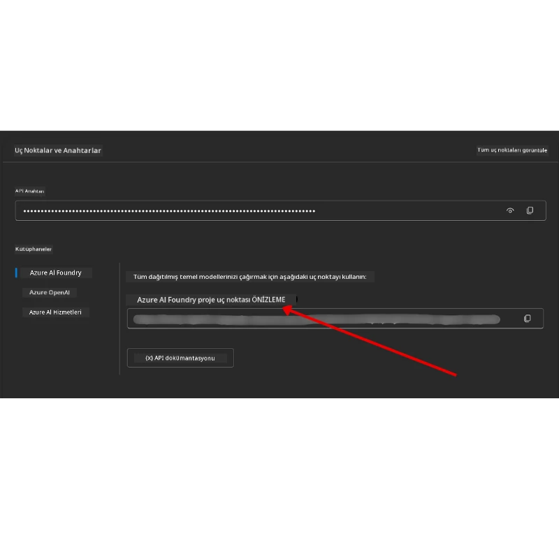

# Kurs Kurulumu

## Giriş

Bu ders, bu kursun kod örneklerinin nasıl çalıştırılacağını kapsayacaktır.

## Diğer Öğrenenlere Katılın ve Yardım Alın

Repounuzu klonlamaya başlamadan önce, kurulumla ilgili herhangi bir yardım almak, kursla ilgili herhangi bir soru sormak ya da diğer öğrenenlerle bağlantı kurmak için [AI Agents For Beginners Discord kanalına](https://aka.ms/ai-agents/discord) katılın.

## Bu Repoyu Klonlayın veya Forklayın

Başlamak için lütfen GitHub Deposunu klonlayın veya forklayın. Böylece kodu çalıştırabilir, test edebilir ve üzerinde değişiklikler yapabileceğiniz kendi kurs malzemenizin bir versiyonuna sahip olacaksınız!

Bunu <a href="https://github.com/microsoft/ai-agents-for-beginners/fork" target="_blank">depo için fork yap</a> bağlantısına tıklayarak yapabilirsiniz.

Şimdi aşağıdaki bağlantıda bu kursun sizin kendi forklanmış versiyonunuz olmalı:


### Shallow Clone (atölye / Codespaces için önerilir)

  > Tam depo, tüm geçmiş ve dosyalar indirildiğinde çok büyük (~3 GB) olabilir. Sadece atölyeye katılıyorsanız veya sadece birkaç ders klasörüne ihtiyacınız varsa, shallow clone (veya sparse clone), geçmişi kısaltarak ve/veya blob'ları atlayarak bu indirme işleminin çoğunu önler.

#### Hızlı shallow clone — minimum geçmiş, tüm dosyalar

Aşağıdaki komutlarda `<your-username>` kısmını kendi fork URL'nizle (veya tercihinize göre upstream URL ile) değiştirin.

Sadece en son commit geçmişini klonlamak için (küçük indirme):

```bash|powershell
git clone --depth 1 https://github.com/<your-username>/ai-agents-for-beginners.git
```

Belirli bir branch'i klonlamak için:

```bash|powershell
git clone --depth 1 --branch <branch-name> https://github.com/<your-username>/ai-agents-for-beginners.git
```

#### Kısmi (sparse) clone — minimum blob + sadece seçilen klasörler

Bu, kısmi clone ve sparse-checkout kullanır (Git 2.25+ gerektirir ve kısmi clone desteği olan modern Git önerilir):

```bash|powershell
git clone --depth 1 --filter=blob:none --sparse https://github.com/<your-username>/ai-agents-for-beginners.git
```

Repo klasörüne gidin:

```bash|powershell
cd ai-agents-for-beginners
```

Sonra hangi klasörleri istediğinizi belirtin (aşağıdaki örnek iki klasör gösterir):

```bash|powershell
git sparse-checkout set 00-course-setup 01-intro-to-ai-agents
```

Dosyaları klonlayıp doğruladıktan sonra sadece dosyalara ihtiyacınız varsa ve alan açmak istiyorsanız (git geçmişi olmaz), depo meta verilerini silin (💀geri alınamaz — tüm Git işlevselliğini kaybedersiniz: commit yapamaz, pull, push veya geçmişe erişim olmaz).

```bash
# zsh/bash
rm -rf .git
```

```powershell
# PowerShell
Remove-Item -Recurse -Force .git
```

#### GitHub Codespaces Kullanımı (yerel büyük indirmelerden kaçınmak için önerilir)

- [GitHub UI](https://github.com/codespaces) üzerinden bu repo için yeni bir Codespace oluşturun.

- Yeni oluşturulan Codespace’in terminalinde, yukarıdaki shallow/sparse clone komutlarından birini çalıştırarak sadece ihtiyaç duyduğunuz ders klasörlerini Codespace çalışma alanına getirin.
- İsteğe bağlı: Codespaces içinde klonladıktan sonra ekstra alan kazanmak için .git klasörünü kaldırabilirsiniz (yukarıdaki kaldırma komutlarına bakınız).
- Not: Repoyu doğrudan Codespaces'de açmayı tercih ederseniz (ek klonlama olmadan), Codespaces geliştirme konteyner ortamını oluşturacak ve belki de ihtiyaç duyduğunuzdan daha fazla şeyi kuracaktır. Taze bir Codespace içinde shallow bir kopya klonlamak disk kullanımı üzerinde daha fazla kontrol sağlar.

#### İpuçları

- Eğer düzenlemek/commit yapmak istiyorsanız, klon URL'sini daima kendi forkunuzla değiştirin.
- Daha sonra daha fazla geçmişe veya dosyaya ihtiyacınız olursa, bunları fetch ile alabilir veya sparse-checkout’u ek klasörleri içerecek şekilde ayarlayabilirsiniz.

## Kodu Çalıştırma

Bu kurs, AI Ajanları oluşturma konusunda pratik deneyim kazanmanız için çalıştırabileceğiniz bir dizi Jupyter Notebook sunar.

Kod örnekleri, **Microsoft Agent Framework (MAF)**'i `AzureAIProjectAgentProvider` ile kullanır; bu, **Microsoft Foundry** aracılığıyla **Azure AI Agent Service V2** (Responses API) ile bağlantı kurar.

Tüm Python notebookları `*-python-agent-framework.ipynb` etiketiyle işaretlenmiştir.

## Gereksinimler

- Python 3.12+
  - **NOT:** Python3.12 yüklü değilse, onu yükleyin. Ardından requirements.txt dosyasından doğru sürümlerin yüklenmesini sağlamak için python3.12 kullanarak sanal ortamınızı oluşturun.
  
    >Örnek

    Python venv dizini oluşturun:

    ```bash|powershell
    python -m venv venv
    ```

    Sonra venv ortamını etkinleştirin:

    ```bash
    # zsh/bash
    source venv/bin/activate
    ```
  
    ```dos
    # Command Prompt for Windows
    venv\Scripts\activate
    ```

- .NET 10+: .NET kullanan örnek kodlar için [.NET 10 SDK](https://dotnet.microsoft.com/download/dotnet/10.0) veya daha yenisini yükleyin. Sonra yüklü .NET SDK sürümünüzü kontrol edin:

    ```bash|powershell
    dotnet --list-sdks
    ```

- **Azure CLI** — Kimlik doğrulama için gereklidir. [aka.ms/installazurecli](https://aka.ms/installazurecli)’den yükleyin.
- **Azure Aboneliği** — Microsoft Foundry ve Azure AI Agent Service erişimi için.
- **Microsoft Foundry Projesi** — Dağıtılmış bir modele sahip bir proje (ör. `gpt-4o`). Aşağıdaki [Adım 1](#adım-1-microsoft-foundry-projesi-oluşturun) bölümüne bakınız.

Kök dizinde, kod örneklerini çalıştırmak için gereken tüm Python paketlerini içeren `requirements.txt` dosyası bulunmaktadır.

Terminalinizde depo kökünde aşağıdaki komutu çalıştırarak yükleyebilirsiniz:

```bash|powershell
pip install -r requirements.txt
```

Herhangi bir çakışma ve sorundan kaçınmak için bir Python sanal ortamı oluşturmanızı öneririz.

## VSCode Kurulumu

VSCode’da doğru Python sürümünü kullandığınızdan emin olun.


## Microsoft Foundry ve Azure AI Agent Service Ayarları

### Adım 1: Microsoft Foundry Projesi Oluşturun

Notebookları çalıştırmak için dağıtılmış bir modele sahip Azure AI Foundry **hub** ve **projeye** ihtiyacınız var.

1. [ai.azure.com](https://ai.azure.com) adresine gidin ve Azure hesabınızla oturum açın.
2. Bir **hub** oluşturun (varsa mevcut birini kullanabilirsiniz). Bakınız: [Hub kaynaklarına genel bakış](https://learn.microsoft.com/azure/ai-foundry/concepts/ai-resources).
3. Hub içinde bir **proje** oluşturun.
4. **Models + Endpoints** → **Deploy model** kısmından bir model dağıtın (örneğin `gpt-4o`).

### Adım 2: Projenizin Endpoint ve Model Dağıtım Adını Alın

Microsoft Foundry portalındaki projenizden:

- **Project Endpoint** — **Overview** sayfasına gidip endpoint URL’sini kopyalayın.



- **Model Deployment Name** — **Models + Endpoints** bölümüne gidin, dağıttığınız modeli seçip **Deployment name**'i not alın (örn. `gpt-4o`).

### Adım 3: `az login` ile Azure’a Giriş Yapın

Tüm notebooklar kimlik doğrulama için **`AzureCliCredential`** kullanır — yönetmenizi gerektiren API anahtarı yoktur. Bu, Azure CLI üzerinden oturum açmanızı gerektirir.

1. **Azure CLI’yi yükleyin:** [aka.ms/installazurecli](https://aka.ms/installazurecli)

2. **Giriş yapın**:

    ```bash|powershell
    az login
    ```

    Ya da uzak/Codespace ortamındaysanız ve tarayıcınız yoksa:

    ```bash|powershell
    az login --use-device-code
    ```

3. İstendiğinde aboneliğinizi seçin — Foundry projenizin bulunduğu aboneliği seçin.

4. Giriş yaptığınızı doğrulayın:

    ```bash|powershell
    az account show
    ```

> **Neden `az login`?** Notebooklar `azure-identity` paketindeki `AzureCliCredential` ile kimlik doğrulama yapar. Böylece Azure CLI oturumunuz kimlik bilgilerini sağlar — `.env` dosyanızda API anahtarına veya sırrına gerek yoktur. Bu bir [güvenlik en iyi uygulamasıdır](https://learn.microsoft.com/azure/developer/ai/keyless-connections).

### Adım 4: `.env` Dosyanızı Oluşturun

Örnek dosyayı kopyalayın:

```bash
# zsh/bash
cp .env.example .env
```

```powershell
# PowerShell
Copy-Item .env.example .env
```

`.env` dosyasını açın ve bu iki değeri doldurun:

```env
AZURE_AI_PROJECT_ENDPOINT=https://<your-project>.services.ai.azure.com/api/projects/<your-project-id>
AZURE_AI_MODEL_DEPLOYMENT_NAME=gpt-4o
```

| Değişken | Nereden bulunur |
|----------|-----------------|
| `AZURE_AI_PROJECT_ENDPOINT` | Foundry portal → projeniz → **Overview** sayfası |
| `AZURE_AI_MODEL_DEPLOYMENT_NAME` | Foundry portal → **Models + Endpoints** → dağıtılmış modelinizin adı |

Çoğu ders için bu kadar! Notebooklar `az login` oturumunuz üzerinden otomatik olarak kimlik doğrulama yapacaktır.

### Adım 5: Python Bağımlılıklarını Kurun

```bash|powershell
pip install -r requirements.txt
```

Daha önce oluşturduğunuz sanal ortam içinde çalıştırmanızı öneririz.

## Ders 5 için Ek Kurulum (Agentic RAG)

Ders 5, retrieval-augmented generation için **Azure AI Search** kullanır. Bu dersi çalıştırmayı planlıyorsanız, `.env` dosyanıza şu değişkenleri ekleyin:

| Değişken | Nereden bulunur |
|----------|-----------------|
| `AZURE_SEARCH_SERVICE_ENDPOINT` | Azure portal → **Azure AI Search** kaynağınız → **Overview** → URL |
| `AZURE_SEARCH_API_KEY` | Azure portal → **Azure AI Search** kaynağınız → **Settings** → **Keys** → birincil yönetici anahtarı |

## Ders 6 ve Ders 8 için Ek Kurulum (GitHub Modelleri)

Ders 6 ve 8’deki bazı notebooklar Azure AI Foundry yerine **GitHub Modelleri** kullanır. Bu örnekleri çalıştıracaksanız, `.env` dosyanıza şu değişkenleri ekleyin:

| Değişken | Nereden bulunur |
|----------|-----------------|
| `GITHUB_TOKEN` | GitHub → **Ayarlar** → **Geliştirici ayarları** → **Kişisel erişim tokenları** |
| `GITHUB_ENDPOINT` | `https://models.inference.ai.azure.com` (varsayılan değer) olarak kullanın |
| `GITHUB_MODEL_ID` | Kullanılacak model adı (örneğin `gpt-4o-mini`) |

## Alternatif Sağlayıcı: MiniMax (OpenAI-Uyumlu)

[MiniMax](https://platform.minimaxi.com/), OpenAI uyumlu bir API üzerinden 204K token’a kadar büyük bağlam modelleri sağlar. Microsoft Agent Framework’ün `OpenAIChatClient` sınıfı, herhangi bir OpenAI uyumlu uç noktası ile çalıştığından MiniMax’ı GitHub Modelleri veya OpenAI’nın yerine drop-in alternatif olarak kullanabilirsiniz.

`.env` dosyanıza şunları ekleyin:

| Değişken | Nereden bulunur |
|----------|-----------------|
| `MINIMAX_API_KEY` | [MiniMax Platformu](https://platform.minimaxi.com/) → API Anahtarları |
| `MINIMAX_BASE_URL` | `https://api.minimax.io/v1` olarak kullanın (varsayılan değer) |
| `MINIMAX_MODEL_ID` | Kullanılacak model adı (örneğin `MiniMax-M2.7`) |

**Mevcut modeller**: `MiniMax-M2.7` (önerilen), `MiniMax-M2.7-highspeed` (daha hızlı yanıtlar)

`OpenAIChatClient` kullanan kod örnekleri (örn. Ders 14 otel rezervasyon iş akışı) `MINIMAX_API_KEY` ayarlandıysa MiniMax konfigürasyonunuzu otomatik olarak algılayıp kullanacaktır.

## Ders 8 için Ek Kurulum (Bing Grounding Workflow)

Ders 8’deki koşullu iş akışı notebooku, Azure AI Foundry üzerinden **Bing grounding** kullanır. O örneği çalıştırmayı planlıyorsanız, `.env` dosyanıza şu değişkeni ekleyin:

| Değişken | Nereden bulunur |
|----------|-----------------|
| `BING_CONNECTION_ID` | Azure AI Foundry portal → projeniz → **Management** → **Connected resources** → Bing bağlantınız → bağlantı ID’sini kopyalayın |

## Sorun Giderme

### macOS’te SSL Sertifika Doğrulama Hataları

macOS kullanıyorsanız ve şöyle bir hata alıyorsanız:

```plaintext
ssl.SSLCertVerificationError: [SSL: CERTIFICATE_VERIFY_FAILED] certificate verify failed: self-signed certificate in certificate chain
```

Bu, macOS’te Python’un sistem SSL sertifikalarına otomatik olarak güvenmemesi nedeniyle bilinen bir sorundur. Şu çözümleri sırayla deneyin:

**Seçenek 1: Python’un Sertifika Kurulum betiğini çalıştırın (önerilen)**

```bash
# Yüklü Python sürümünüzle 3.XX'i değiştirin (örneğin, 3.12 veya 3.13):
/Applications/Python\ 3.XX/Install\ Certificates.command
```

**Seçenek 2: Notebookunuzda `connection_verify=False` kullanın (yalnızca GitHub Modelleri notebookları için)**

Ders 6 notebookunda (`06-building-trustworthy-agents/code_samples/06-system-message-framework.ipynb`) yorum satırı olarak bir çözüm zaten var. Client oluştururken `connection_verify=False` kod satırının yorumunu kaldırın:

```python
client = ChatCompletionsClient(
    endpoint=endpoint,
    credential=AzureKeyCredential(token),
    connection_verify=False,  # Sertifika hataları ile karşılaşırsanız SSL doğrulamasını devre dışı bırakın
)
```

> **⚠️ Uyarı:** SSL doğrulamasını devre dışı bırakmak (`connection_verify=False`), sertifika doğrulamasını atlayarak güvenliği azaltır. Sadece geliştirme ortamlarında geçici çözümler için kullanın, üretimde asla.

**Seçenek 3: `truststore` yükleyin ve kullanın**

```bash
pip install truststore
```

Sonra, herhangi bir ağ çağrısı yapmadan önce notebookunuzun veya betiğinizin en üstüne şu satırı ekleyin:

```python
import truststore
truststore.inject_into_ssl()
```

## Bir Yerde Takıldınız mı?

Bu kurulumu çalıştırmakta herhangi bir sorun yaşarsanız, <a href="https://discord.gg/kzRShWzttr" target="_blank">Azure AI Community Discord</a>'umuza katılabilir veya <a href="https://github.com/microsoft/ai-agents-for-beginners/issues?WT.mc_id=academic-105485-koreyst" target="_blank">bir issue oluşturabilirsiniz</a>.

## Sonraki Ders

Artık bu kursun kodlarını çalıştırmaya hazırsınız. AI Ajanları dünyası hakkında daha fazla öğrenmenizi dileriz!

[AI Ajanlara ve Ajan Kullanım Senaryolarına Giriş](../01-intro-to-ai-agents/README.md)

---

<!-- CO-OP TRANSLATOR DISCLAIMER START -->
**Feragatname**:  
Bu belge, AI çeviri hizmeti [Co-op Translator](https://github.com/Azure/co-op-translator) kullanılarak çevrilmiştir. Doğruluk için çaba göstermemize rağmen, otomatik çevirilerin hata veya yanlışlık içerebileceğini lütfen unutmayın. Orijinal belge, kendi dilinde yetkili kaynak olarak kabul edilmelidir. Kritik bilgiler için profesyonel insan çevirisi önerilir. Bu çevirinin kullanımından doğabilecek herhangi bir yanlış anlama veya yorumlama nedeniyle sorumluluk kabul edilmez.
<!-- CO-OP TRANSLATOR DISCLAIMER END -->