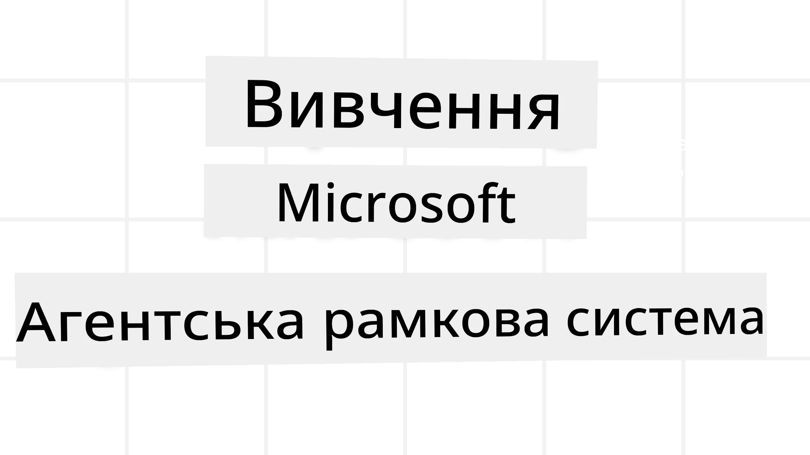
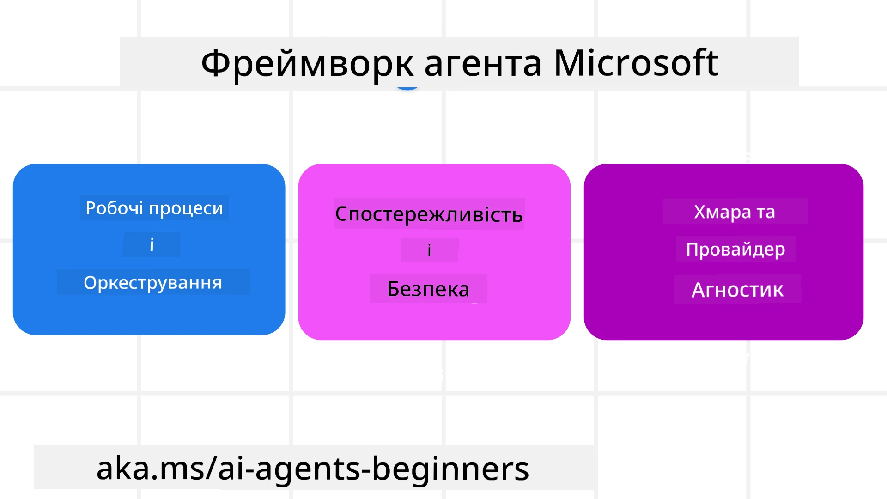

# Дослідження Microsoft Agent Framework



### Вступ

У цьому уроці розглянемо:

- Розуміння Microsoft Agent Framework: ключові особливості та цінність  
- Огляд ключових концепцій Microsoft Agent Framework
- Просунуті патерни MAF: робочі процеси, проміжне програмне забезпечення та пам’ять

## Навчальні цілі

Після завершення цього уроку ви знатимете, як:

- Створювати AI-агенти, готові до виробництва, використовуючи Microsoft Agent Framework
- Застосовувати основні функції Microsoft Agent Framework у ваших агентських сценаріях
- Використовувати розвинені патерни, включаючи робочі процеси, проміжне програмне забезпечення та спостережність

## Приклади коду 

Приклади коду для [Microsoft Agent Framework (MAF)](https://aka.ms/ai-agents-beginners/agent-framewrok) можна знайти у цьому репозиторії у файлах `xx-python-agent-framework` та `xx-dotnet-agent-framework`.

## Розуміння Microsoft Agent Framework



[Microsoft Agent Framework (MAF)](https://aka.ms/ai-agents-beginners/agent-framewrok) — це уніфікована платформа Microsoft для створення AI-агентів. Вона пропонує гнучкість для різноманітних агентських сценаріїв, що зустрічаються у виробничих та дослідницьких середовищах, включаючи:

- **Послідовну оркестрацію агентів** у сценаріях, де потрібні покрокові робочі процеси.
- **Паралельну оркестрацію** у сценаріях, де агенти повинні виконувати завдання одночасно.
- **Оркестрацію групового чату** у випадках, коли агенти можуть співпрацювати над одним завданням.
- **Оркестрацію передачі** у сценаріях, коли агенти передають завдання один одному по мірі виконання підзавдань.
- **Магнітну оркестрацію** у випадках, коли керуючий агент створює й змінює список завдань та координує підлеглих агентів для виконання завдання.

Для запуску AI-агентів у виробництві MAF також має функції для:

- **Спостережності** за допомогою OpenTelemetry, де кожна дія AI-агента, включаючи виклик інструментів, кроки оркестрації, потоки логіки й моніторинг продуктивності через панелі Microsoft Foundry.
- **Безпеки** шляхом хостингу агентів безпосередньо в Microsoft Foundry із контролем доступу по ролях, обробкою приватних даних та вбудованим контентним захистом.
- **Надійності** — агентські потоки й робочі процеси можуть ставати на паузу, відновлюватись і виправляти помилки, що дозволяє працювати над тривалими процесами.
- **Контролю** — підтримуються робочі процеси з людиною у циклі, де завдання позначені як такі, що потребують схвалення людиною.

Microsoft Agent Framework також прагне бути інтероперабельним шляхом:

- **Відсутності залежності від хмарної платформи** — агенти можуть працювати у контейнерах, локально та на різних хмарах.
- **Відсутності залежності від провайдера** — агенти можуть створюватись за допомогою улюбленого SDK, зокрема Azure OpenAI та OpenAI.
- **Інтеграції відкритих стандартів** — агенти можуть використовувати протоколи Agent-to-Agent (A2A) та Model Context Protocol (MCP) для виявлення й використання інших агентів та інструментів.
- **Плагінів та конекторів** — можна підключатись до сервісів даних і пам’яті, таких як Microsoft Fabric, SharePoint, Pinecone та Qdrant.

Розглянемо, як ці функції застосовуються до основних концепцій Microsoft Agent Framework.

## Ключові концепції Microsoft Agent Framework

### Агенти


**Створення агентів**

Створення агента здійснюється шляхом визначення сервісу інференції (постачальника LLM), набору інструкцій для AI-агента й призначення `name`:

```python
agent = AzureOpenAIChatClient(credential=AzureCliCredential()).create_agent( instructions="You are good at recommending trips to customers based on their preferences.", name="TripRecommender" )
```

Вищенаведений приклад використовує `Azure OpenAI`, але агенти можуть створюватись через різні сервіси, включаючи `Microsoft Foundry Agent Service`:

```python
AzureAIAgentClient(async_credential=credential).create_agent( name="HelperAgent", instructions="You are a helpful assistant." ) as agent
```

API OpenAI `Responses`, `ChatCompletion`

```python
agent = OpenAIResponsesClient().create_agent( name="WeatherBot", instructions="You are a helpful weather assistant.", )
```

```python
agent = OpenAIChatClient().create_agent( name="HelpfulAssistant", instructions="You are a helpful assistant.", )
```

або [MiniMax](https://platform.minimaxi.com/), який надає сумісний з OpenAI API із великими контекстними вікнами (до 204К токенів):

```python
agent = OpenAIChatClient(base_url="https://api.minimax.io/v1", api_key=os.environ["MINIMAX_API_KEY"], model_id="MiniMax-M2.7").create_agent( name="HelpfulAssistant", instructions="You are a helpful assistant.", )
```

або віддалені агенти за протоколом A2A:

```python
agent = A2AAgent( name=agent_card.name, description=agent_card.description, agent_card=agent_card, url="https://your-a2a-agent-host" )
```

**Запуск агентів**

Агенти запускаються за допомогою методів `.run` або `.run_stream` для відповіді без потоків і з потоками відповідно.

```python
result = await agent.run("What are good places to visit in Amsterdam?")
print(result.text)
```

```python
async for update in agent.run_stream("What are the good places to visit in Amsterdam?"):
    if update.text:
        print(update.text, end="", flush=True)

```

Кожен запуск агента може мати параметри налаштування, такі як `max_tokens`, `tools`, які агент може викликати, і навіть `model`, що використовується агентом.

Це корисно, коли для виконання завдання користувача потрібні конкретні моделі або інструменти.

**Інструменти**

Інструменти можна визначати як під час створення агента:

```python
def get_attractions( location: Annotated[str, Field(description="The location to get the top tourist attractions for")], ) -> str: """Get the top tourist attractions for a given location.""" return f"The top attractions for {location} are." 


# При безпосередньому створенні ChatAgent

agent = ChatAgent( chat_client=OpenAIChatClient(), instructions="You are a helpful assistant", tools=[get_attractions]

```

так і під час запуску агента:

```python

result1 = await agent.run( "What's the best place to visit in Seattle?", tools=[get_attractions] # Інструмент надається лише для цього запуску )
```

**Потоки агентів**

Потоки агентів використовуються для багатокрокових розмов. Потоки можна створювати або шляхом:

- Виклику `get_new_thread()`, що дозволяє зберігати потік з часом
- Автоматичного створення потоку під час запуску агента, коли потік існує лише під час поточного запуску.

Щоб створити потік, код виглядає так:

```python
# Створіть новий потік.
thread = agent.get_new_thread() # Запустіть агента з потоком.
response = await agent.run("Hello, I am here to help you book travel. Where would you like to go?", thread=thread)

```

Потім потік можна серіалізувати для зберігання та подальшого використання:

```python
# Створити новий потік.
thread = agent.get_new_thread() 

# Запустити агента з потоком.

response = await agent.run("Hello, how are you?", thread=thread) 

# Послідовно записати потік для зберігання.

serialized_thread = await thread.serialize() 

# Десеріалізувати стан потоку після завантаження зі сховища.

resumed_thread = await agent.deserialize_thread(serialized_thread)
```

**Проміжне програмне забезпечення агента**

Агенти взаємодіють з інструментами та LLM для виконання завдань користувача. У певних випадках потрібно виконувати або відслідковувати дії між цими взаємодіями. Проміжне ПЗ агента дозволяє це зробити через:

*Function Middleware*

Це проміжне ПЗ дає змогу виконувати дію між агентом і функцією/інструментом, які він викликає. Приклад використання — логування виклику функції.

У наведеному нижче коді `next` визначає, чи слід викликати наступне проміжне ПЗ або саму функцію.

```python
async def logging_function_middleware(
    context: FunctionInvocationContext,
    next: Callable[[FunctionInvocationContext], Awaitable[None]],
) -> None:
    """Function middleware that logs function execution."""
    # Попередня обробка: Логування перед виконанням функції
    print(f"[Function] Calling {context.function.name}")

    # Продовжити до наступного проміжного програмного забезпечення або виконання функції
    await next(context)

    # Постобробка: Логування після виконання функції
    print(f"[Function] {context.function.name} completed")
```

*Chat Middleware*

Це проміжне ПЗ дає змогу виконувати чи логувати дії між агентом і запитами до LLM.

Тут міститься важлива інформація, така як `messages`, які надсилаються AI-сервісу.

```python
async def logging_chat_middleware(
    context: ChatContext,
    next: Callable[[ChatContext], Awaitable[None]],
) -> None:
    """Chat middleware that logs AI interactions."""
    # Попередня обробка: Логування перед викликом ШІ
    print(f"[Chat] Sending {len(context.messages)} messages to AI")

    # Продовжити до наступного проміжного ПЗ або сервісу ШІ
    await next(context)

    # Пост-обробка: Логування після відповіді ШІ
    print("[Chat] AI response received")

```

**Пам’ять агента**

Як розглянуто в уроці `Agentic Memory`, пам’ять — важливий елемент, що дозволяє агенту працювати з різним контекстом. MAF пропонує кілька типів пам’яті:

*In-Memory Storage*

Це пам’ять, що зберігається у потоках під час виконання програми.

```python
# Створити новий потік.
thread = agent.get_new_thread() # Запустити агента з цим потоком.
response = await agent.run("Hello, I am here to help you book travel. Where would you like to go?", thread=thread)
```

*Persistent Messages*

Ця пам’ять використовується для збереження історії розмов між сесіями. Визначається за допомогою `chat_message_store_factory`:

```python
from agent_framework import ChatMessageStore

# Створити власне сховище повідомлень
def create_message_store():
    return ChatMessageStore()

agent = ChatAgent(
    chat_client=OpenAIChatClient(),
    instructions="You are a Travel assistant.",
    chat_message_store_factory=create_message_store
)

```

*Dynamic Memory*

Ця пам’ять додається до контексту перед запуском агентів. Вона може зберігатись у зовнішніх сервісах, таких як mem0:

```python
from agent_framework.mem0 import Mem0Provider

# Використання Mem0 для розширених можливостей пам'яті
memory_provider = Mem0Provider(
    api_key="your-mem0-api-key",
    user_id="user_123",
    application_id="my_app"
)

agent = ChatAgent(
    chat_client=OpenAIChatClient(),
    instructions="You are a helpful assistant with memory.",
    context_providers=memory_provider
)

```

**Спостережність агента**

Спостережність важлива для створення надійних та підтримуваних агентських систем. MAF інтегрується з OpenTelemetry для забезпечення трасування і метрик для кращої спостережності.

```python
from agent_framework.observability import get_tracer, get_meter

tracer = get_tracer()
meter = get_meter()
with tracer.start_as_current_span("my_custom_span"):
    # зробити щось
    pass
counter = meter.create_counter("my_custom_counter")
counter.add(1, {"key": "value"})
```

### Робочі процеси

MAF пропонує робочі процеси — це попередньо визначені кроки для виконання завдання, у яких AI-агенти виступають компонентами.

Робочі процеси складаються з різних компонентів, що забезпечують кращий контроль потоку. Вони також підтримують **багатоагентну оркестрацію** і **збереження чекпоінтів** для збереження станів робочого процесу.

Основні компоненти робочого процесу:

**Виконавці (Executors)**

Виконавці отримують вхідні повідомлення, виконують призначені завдання й створюють вихідні повідомлення. Це рухає робочий процес до завершення великого завдання. Виконавцями можуть бути AI-агенти або власна логіка.

**Ребра (Edges)**

Ребра визначають потік повідомлень у робочому процесі. Вони бувають:

*Прямі ребра* — прості однонаправлені з'єднання між виконавцями:

```python
from agent_framework import WorkflowBuilder

builder = WorkflowBuilder()
builder.add_edge(source_executor, target_executor)
builder.set_start_executor(source_executor)
workflow = builder.build()
```

*Умовні ребра* — активуються, коли виконана певна умова. Наприклад, коли готельні номери недоступні, виконавець може запропонувати інші варіанти.

*Перемикачі (switch-case)* — направляють повідомлення до різних виконавців залежно від умов. Наприклад, якщо у туриста є пріоритетний доступ, його завдання оброблятимуться через інший робочий процес.

*Розгалуження (fan-out)* — надсилають одне повідомлення багатьом отримувачам.

*Злиття (fan-in)* — збирають кілька повідомлень від різних виконавців і надсилають одному отримувачу.

**Події**

Для кращої спостережності робочих процесів MAF пропонує вбудовані події виконання, зокрема:

- `WorkflowStartedEvent`  - початок виконання робочого процесу
- `WorkflowOutputEvent` - робочий процес генерує вихідні дані
- `WorkflowErrorEvent` - виникнення помилки в робочому процесі
- `ExecutorInvokeEvent`  - виконавець починає обробку
- `ExecutorCompleteEvent`  - виконавець завершує обробку
- `RequestInfoEvent` - подано запит

## Розвинені патерни MAF

Вищенаведені розділи охоплюють ключові концепції Microsoft Agent Framework. Коли ви створюєте складніших агентів, ось декілька розвинених патернів до розгляду:

- **Композиція проміжного ПЗ**: побудова ланцюжка з декількох проміжних обробників (логування, автентифікація, обмеження швидкості) за допомогою функціонального та чат-проміжного ПЗ для детального контролю поведінки агента.
- **Збереження чекпоінтів робочого процесу**: використання подій робочого процесу та серіалізації для збереження та відновлення довготривалих процесів агента.
- **Динамічний вибір інструментів**: поєднання RAG над описами інструментів із реєстрацією інструментів MAF для надання лише релевантних інструментів за запитом.
- **Передача між багатьма агентами**: використання ребер робочого процесу та умовного маршрутування для організації передачі між спеціалізованими агентами.

## Приклади коду 

Приклади коду для Microsoft Agent Framework можна знайти у цьому репозиторії у файлах `xx-python-agent-framework` і `xx-dotnet-agent-framework`.

## Є більше запитань про Microsoft Agent Framework?

Приєднуйтесь до [Microsoft Foundry Discord](https://aka.ms/ai-agents/discord), щоб поспілкуватися з іншими учнями, відвідати години консультацій і отримати відповіді на свої питання про AI-агентів.

---

<!-- CO-OP TRANSLATOR DISCLAIMER START -->
**Застереження**:  
Цей документ було перекладено за допомогою сервісу автоматичного перекладу [Co-op Translator](https://github.com/Azure/co-op-translator). Незважаючи на наші зусилля забезпечити точність, будь ласка, майте на увазі, що автоматичні переклади можуть містити помилки або неточності. Оригінальний документ його рідною мовою слід вважати авторитетним джерелом. Для критично важливої інформації рекомендується професійний людський переклад. Ми не несемо відповідальності за будь-які непорозуміння або неправильні тлумачення, що виникли внаслідок використання цього перекладу.
<!-- CO-OP TRANSLATOR DISCLAIMER END -->