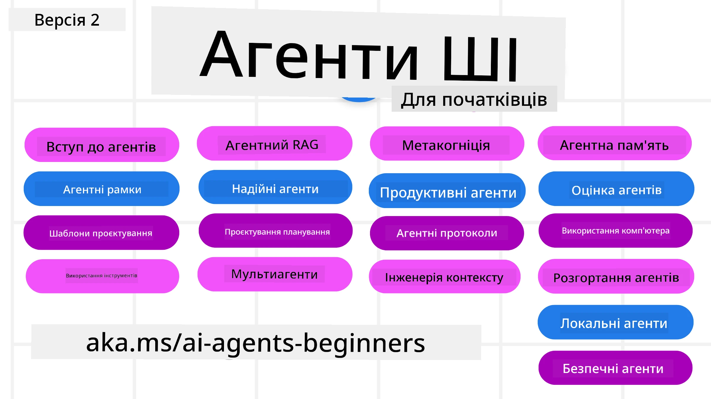

# AI агенти для початківців - Курс



## Курс, що навчає всьому, що потрібно знати для початку створення AI агентів

[](https://github.com/microsoft/ai-agents-for-beginners/blob/master/LICENSE?WT.mc_id=academic-105485-koreyst)
[](https://GitHub.com/microsoft/ai-agents-for-beginners/graphs/contributors/?WT.mc_id=academic-105485-koreyst)
[](https://GitHub.com/microsoft/ai-agents-for-beginners/issues/?WT.mc_id=academic-105485-koreyst)
[](https://GitHub.com/microsoft/ai-agents-for-beginners/pulls/?WT.mc_id=academic-105485-koreyst)
[](http://makeapullrequest.com?WT.mc_id=academic-105485-koreyst)

### 🌐 Підтримка багатьох мов

#### Підтримується через GitHub Action (Автоматично і завжди оновлюється)

<!-- CO-OP TRANSLATOR LANGUAGES TABLE START -->
[Arabic](../ar/README.md) | [Bengali](../bn/README.md) | [Bulgarian](../bg/README.md) | [Burmese (Myanmar)](../my/README.md) | [Chinese (Simplified)](../zh-CN/README.md) | [Chinese (Traditional, Hong Kong)](../zh-HK/README.md) | [Chinese (Traditional, Macau)](../zh-MO/README.md) | [Chinese (Traditional, Taiwan)](../zh-TW/README.md) | [Croatian](../hr/README.md) | [Czech](../cs/README.md) | [Danish](../da/README.md) | [Dutch](../nl/README.md) | [Estonian](../et/README.md) | [Finnish](../fi/README.md) | [French](../fr/README.md) | [German](../de/README.md) | [Greek](../el/README.md) | [Hebrew](../he/README.md) | [Hindi](../hi/README.md) | [Hungarian](../hu/README.md) | [Indonesian](../id/README.md) | [Italian](../it/README.md) | [Japanese](../ja/README.md) | [Kannada](../kn/README.md) | [Khmer](../km/README.md) | [Korean](../ko/README.md) | [Lithuanian](../lt/README.md) | [Malay](../ms/README.md) | [Malayalam](../ml/README.md) | [Marathi](../mr/README.md) | [Nepali](../ne/README.md) | [Nigerian Pidgin](../pcm/README.md) | [Norwegian](../no/README.md) | [Persian (Farsi)](../fa/README.md) | [Polish](../pl/README.md) | [Portuguese (Brazil)](../pt-BR/README.md) | [Portuguese (Portugal)](../pt-PT/README.md) | [Punjabi (Gurmukhi)](../pa/README.md) | [Romanian](../ro/README.md) | [Russian](../ru/README.md) | [Serbian (Cyrillic)](../sr/README.md) | [Slovak](../sk/README.md) | [Slovenian](../sl/README.md) | [Spanish](../es/README.md) | [Swahili](../sw/README.md) | [Swedish](../sv/README.md) | [Tagalog (Filipino)](../tl/README.md) | [Tamil](../ta/README.md) | [Telugu](../te/README.md) | [Thai](../th/README.md) | [Turkish](../tr/README.md) | [Ukrainian](./README.md) | [Urdu](../ur/README.md) | [Vietnamese](../vi/README.md)

> **Віддаєте перевагу клонувати локально?**
>
> У цьому репозиторії є понад 50 перекладів, які значно збільшують розмір завантаження. Щоб клонувати без перекладів, використовуйте sparse checkout:
>
> **Bash / macOS / Linux:**
> ```bash
> git clone --filter=blob:none --sparse https://github.com/microsoft/ai-agents-for-beginners.git
> cd ai-agents-for-beginners
> git sparse-checkout set --no-cone '/*' '!translations' '!translated_images'
> ```
>
> **CMD (Windows):**
> ```cmd
> git clone --filter=blob:none --sparse https://github.com/microsoft/ai-agents-for-beginners.git
> cd ai-agents-for-beginners
> git sparse-checkout set --no-cone "/*" "!translations" "!translated_images"
> ```
>
> Це дасть вам усе необхідне для проходження курсу з набагато швидшим завантаженням.
<!-- CO-OP TRANSLATOR LANGUAGES TABLE END -->

**Якщо ви хочете, щоб підтримувались додаткові мови перекладу, вони перелічені [тут](https://github.com/Azure/co-op-translator/blob/main/getting_started/supported-languages.md)**

[](https://GitHub.com/microsoft/ai-agents-for-beginners/watchers/?WT.mc_id=academic-105485-koreyst)
[](https://GitHub.com/microsoft/ai-agents-for-beginners/network/?WT.mc_id=academic-105485-koreyst)
[](https://GitHub.com/microsoft/ai-agents-for-beginners/stargazers/?WT.mc_id=academic-105485-koreyst)

[](https://discord.gg/nTYy5BXMWG)


## 🌱 Початок роботи

Цей курс містить уроки, які охоплюють основи створення AI агентів. Кожен урок присвячений окремій темі, тож починайте з будь-якого!

Для цього курсу є підтримка кількох мов. Перейдіть до наших [доступних мов тут](#-multi-language-support). 

Якщо ви вперше працюєте з генеративними AI-моделями, ознайомтеся з нашим курсом [Generative AI For Beginners](https://aka.ms/genai-beginners), який включає 21 урок зі створення з GenAI.

Не забудьте [поставити зірочку (🌟) цьому репозиторію](https://docs.github.com/en/get-started/exploring-projects-on-github/saving-repositories-with-stars?WT.mc_id=academic-105485-koreyst) та [форкнути цей репозиторій](https://github.com/microsoft/ai-agents-for-beginners/fork), щоб запускати код.

### Познайомтесь з іншими учнями, отримайте відповіді на свої запитання

Якщо у вас виникли труднощі або запитання щодо створення AI агентів, приєднуйтесь до нашого спеціального Discord-каналу у [Microsoft Foundry Discord](https://aka.ms/ai-agents/discord).

### Що вам потрібно

Кожен урок цього курсу включає приклади коду, які можна знайти у папці code_samples. Ви можете [форкнути цей репозиторій](https://github.com/microsoft/ai-agents-for-beginners/fork), щоб створити власну копію.  

Приклади коду в цих вправах використовують Microsoft Agent Framework із Azure AI Foundry Agent Service V2:

- [Microsoft Foundry](https://aka.ms/ai-agents-beginners/ai-foundry) - Потрібен обліковий запис Azure

У цьому курсі використовуються такі фреймворки та сервіси AI агентів від Microsoft:

- [Microsoft Agent Framework (MAF)](https://aka.ms/ai-agents-beginners/agent-framewrok)
- [Azure AI Foundry Agent Service V2](https://aka.ms/ai-agents-beginners/ai-agent-service)

Деякі приклади коду також підтримують альтернативних провайдерів, сумісних з OpenAI, таких як [MiniMax](https://platform.minimaxi.com/), який пропонує моделі з великим контекстом (до 204K токенів). Деталі налаштування дивіться в [Course Setup](./00-course-setup/README.md).

Для отримання додаткової інформації про запуск коду для цього курсу перейдіть до [Course Setup](./00-course-setup/README.md).

## 🙏 Хочете допомогти?

У вас є пропозиції або ви знайшли помилки в правописі чи коді? [Створіть issue](https://github.com/microsoft/ai-agents-for-beginners/issues?WT.mc_id=academic-105485-koreyst) або [зробіть pull request](https://github.com/microsoft/ai-agents-for-beginners/pulls?WT.mc_id=academic-105485-koreyst)


## 📂 Кожен урок включає

- Текстовий урок, розміщений у README, та коротке відео
- Приклади коду на Python з використанням Microsoft Agent Framework із Azure AI Foundry
- Посилання на додаткові ресурси для подальшого навчання


## 🗃️ Уроки

| **Урок**                                     | **Текст & Код**                                      | **Відео**                                                  | **Додаткове навчання**                                                                  |
|----------------------------------------------|-----------------------------------------------------|------------------------------------------------------------|-----------------------------------------------------------------------------------------|
| Вступ до AI агентів та варіанти використання | [Link](./01-intro-to-ai-agents/README.md)           | [Video](https://youtu.be/3zgm60bXmQk?si=z8QygFvYQv-9WtO1)  | [Link](https://aka.ms/ai-agents-beginners/collection?WT.mc_id=academic-105485-koreyst)  |
| Дослідження AI агентських фреймворків         | [Link](./02-explore-agentic-frameworks/README.md)   | [Video](https://youtu.be/ODwF-EZo_O8?si=Vawth4hzVaHv-u0H)  | [Link](https://aka.ms/ai-agents-beginners/collection?WT.mc_id=academic-105485-koreyst)  |
| Розуміння патернів агентського дизайну        | [Link](./03-agentic-design-patterns/README.md)      | [Video](https://youtu.be/m9lM8qqoOEA?si=BIzHwzstTPL8o9GF)  | [Link](https://aka.ms/ai-agents-beginners/collection?WT.mc_id=academic-105485-koreyst)  |
| Патерн використання інструментів               | [Link](./04-tool-use/README.md)                      | [Video](https://youtu.be/vieRiPRx-gI?si=2z6O2Xu2cu_Jz46N)  | [Link](https://aka.ms/ai-agents-beginners/collection?WT.mc_id=academic-105485-koreyst)  |
| Агентський RAG                                 | [Link](./05-agentic-rag/README.md)                   | [Video](https://youtu.be/WcjAARvdL7I?si=gKPWsQpKiIlDH9A3)  | [Link](https://aka.ms/ai-agents-beginners/collection?WT.mc_id=academic-105485-koreyst)  |
| Створення надійних AI агентів                  | [Link](./06-building-trustworthy-agents/README.md)  | [Video](https://youtu.be/iZKkMEGBCUQ?si=jZjpiMnGFOE9L8OK ) | [Link](https://aka.ms/ai-agents-beginners/collection?WT.mc_id=academic-105485-koreyst)  |
| Патерн планування                              | [Link](./07-planning-design/README.md)               | [Video](https://youtu.be/kPfJ2BrBCMY?si=6SC_iv_E5-mzucnC)  | [Link](https://aka.ms/ai-agents-beginners/collection?WT.mc_id=academic-105485-koreyst)  |
| Патерн мультіагентської системи                | [Link](./08-multi-agent/README.md)                   | [Video](https://youtu.be/V6HpE9hZEx0?si=rMgDhEu7wXo2uo6g)  | [Link](https://aka.ms/ai-agents-beginners/collection?WT.mc_id=academic-105485-koreyst)  |
| Метакогнітивний шаблон дизайну                 | [Link](./09-metacognition/README.md)               | [Video](https://youtu.be/His9R6gw6Ec?si=8gck6vvdSNCt6OcF)  | [Link](https://aka.ms/ai-agents-beginners/collection?WT.mc_id=academic-105485-koreyst) |
| AI агенти у виробництві                      | [Link](./10-ai-agents-production/README.md)        | [Video](https://youtu.be/l4TP6IyJxmQ?si=31dnhexRo6yLRJDl)  | [Link](https://aka.ms/ai-agents-beginners/collection?WT.mc_id=academic-105485-koreyst) |
| Використання агентних протоколів (MCP, A2A та NLWeb) | [Link](./11-agentic-protocols/README.md)           | [Video](https://youtu.be/X-Dh9R3Opn8)                                 | [Link](https://aka.ms/ai-agents-beginners/collection?WT.mc_id=academic-105485-koreyst) |
| Контекстна інженерія для AI агентів            | [Link](./12-context-engineering/README.md)         | [Video](https://youtu.be/F5zqRV7gEag)                                 | [Link](https://aka.ms/ai-agents-beginners/collection?WT.mc_id=academic-105485-koreyst) |
| Управління агентною пам’яттю                      | [Link](./13-agent-memory/README.md)     |      [Video](https://youtu.be/QrYbHesIxpw?si=vZkVwKrQ4ieCcIPx)                                                      |                                                                                        |
| Ознайомлення з Microsoft Agent Framework                         | [Link](./14-microsoft-agent-framework/README.md)                            |                                                            |                                                                                        |
| Створення агентів для використання комп’ютера (CUA)           | [Link](./15-browser-use/README.md)     |                                                            | [Link](https://docs.browser-use.com/examples/templates/playwright-integration)         |
| Розгортання масштабованих агентів                    | Незабаром                            |                                                            |                                                                                        |
| Створення локальних AI агентів                     | Незабаром                               |                                                            |                                                                                        |
| Захист AI агентів                           | Незабаром                               |                                                            |                                                                                        |

## 🎒 Інші Курси

Наша команда створює інші курси! Дивіться:

<!-- CO-OP TRANSLATOR OTHER COURSES START -->
### LangChain
[](https://aka.ms/langchain4j-for-beginners)
[](https://aka.ms/langchainjs-for-beginners?WT.mc_id=m365-94501-dwahlin)
[](https://github.com/microsoft/langchain-for-beginners?WT.mc_id=m365-94501-dwahlin)
---

### Azure / Edge / MCP / Агентів
[](https://github.com/microsoft/AZD-for-beginners?WT.mc_id=academic-105485-koreyst)
[](https://github.com/microsoft/edgeai-for-beginners?WT.mc_id=academic-105485-koreyst)
[](https://github.com/microsoft/mcp-for-beginners?WT.mc_id=academic-105485-koreyst)
[](https://github.com/microsoft/ai-agents-for-beginners?WT.mc_id=academic-105485-koreyst)

---
 
### Серія Generative AI
[](https://github.com/microsoft/generative-ai-for-beginners?WT.mc_id=academic-105485-koreyst)
[-9333EA?style=for-the-badge&labelColor=E5E7EB&color=9333EA)](https://github.com/microsoft/Generative-AI-for-beginners-dotnet?WT.mc_id=academic-105485-koreyst)
[-C084FC?style=for-the-badge&labelColor=E5E7EB&color=C084FC)](https://github.com/microsoft/generative-ai-for-beginners-java?WT.mc_id=academic-105485-koreyst)
[-E879F9?style=for-the-badge&labelColor=E5E7EB&color=E879F9)](https://github.com/microsoft/generative-ai-with-javascript?WT.mc_id=academic-105485-koreyst)

---
 
### Основне навчання
[](https://aka.ms/ml-beginners?WT.mc_id=academic-105485-koreyst)
[](https://aka.ms/datascience-beginners?WT.mc_id=academic-105485-koreyst)
[](https://aka.ms/ai-beginners?WT.mc_id=academic-105485-koreyst)
[](https://github.com/microsoft/Security-101?WT.mc_id=academic-96948-sayoung)
[](https://aka.ms/webdev-beginners?WT.mc_id=academic-105485-koreyst)
[](https://aka.ms/iot-beginners?WT.mc_id=academic-105485-koreyst)
[](https://github.com/microsoft/xr-development-for-beginners?WT.mc_id=academic-105485-koreyst)

---
 
### Серія Copilot
[](https://aka.ms/GitHubCopilotAI?WT.mc_id=academic-105485-koreyst)
[](https://github.com/microsoft/mastering-github-copilot-for-dotnet-csharp-developers?WT.mc_id=academic-105485-koreyst)
[](https://github.com/microsoft/CopilotAdventures?WT.mc_id=academic-105485-koreyst)
<!-- CO-OP TRANSLATOR OTHER COURSES END -->

## 🌟 Подяки спільноті

Дякуємо [Shivam Goyal](https://www.linkedin.com/in/shivam2003/) за внесок важливих прикладів коду, що демонструють Agentic RAG. 

## Участь у проєкті

Цей проєкт вітає внески та пропозиції. Більшість внесків вимагає згоди з
Угодою про ліцензію для контрибуторів (CLA), яка підтверджує, що ви маєте право і фактично надаєте нам
права на використання вашого внеску. Деталі за адресою <https://cla.opensource.microsoft.com>.

Коли ви подаєте pull request, бот CLA автоматично визначить, чи потрібно вам надати
CLA і відповідно позначить PR (наприклад, статус-перевірка, коментар). Просто дотримуйтесь інструкцій,
наданих ботом. Вам потрібно зробити це лише один раз для всіх репозиторіїв, які використовують нашу CLA.

Цей проєкт прийняв [Microsoft Open Source Code of Conduct](https://opensource.microsoft.com/codeofconduct/).
Для детальнішої інформації дивіться [Code of Conduct FAQ](https://opensource.microsoft.com/codeofconduct/faq/) або
зв'яжіться з [opencode@microsoft.com](mailto:opencode@microsoft.com) з будь-якими додатковими питаннями чи коментарями.

## Тримарки

Цей проєкт може містити торгові марки або логотипи для проєктів, продуктів або послуг. Авторизоване використання торгових марок або логотипів Microsoft
підлягає і повинно відповідати
[Правилам використання торгових марок і брендів Microsoft](https://www.microsoft.com/legal/intellectualproperty/trademarks/usage/general).
Використання торгових марок або логотипів Microsoft у змінених версіях цього проєкту не повинно спричиняти плутанину чи припускати спонсорство Microsoft.
Будь-яке використання торгових марок або логотипів третіх сторін підлягає політикам цих третіх сторін.

## Отримання допомоги


Якщо ви застрягли або маєте питання щодо створення AI-додатків, приєднуйтесь:

[](https://aka.ms/foundry/discord)

Якщо у вас є відгуки про продукт або помилки під час створення, відвідайте:

[](https://aka.ms/foundry/forum)

---

<!-- CO-OP TRANSLATOR DISCLAIMER START -->
**Відмова від відповідальності**:  
Цей документ був перекладений за допомогою сервісу автоматичного перекладу [Co-op Translator](https://github.com/Azure/co-op-translator). Хоча ми прагнемо до точності, будьте уважні, що автоматичні переклади можуть містити помилки або неточності. Оригінальний документ рідною мовою слід вважати авторитетним джерелом. Для критично важливої інформації рекомендується професійний переклад людиною. Ми не несемо відповідальності за будь-які непорозуміння чи помилки, що виникли внаслідок використання цього перекладу.
<!-- CO-OP TRANSLATOR DISCLAIMER END -->